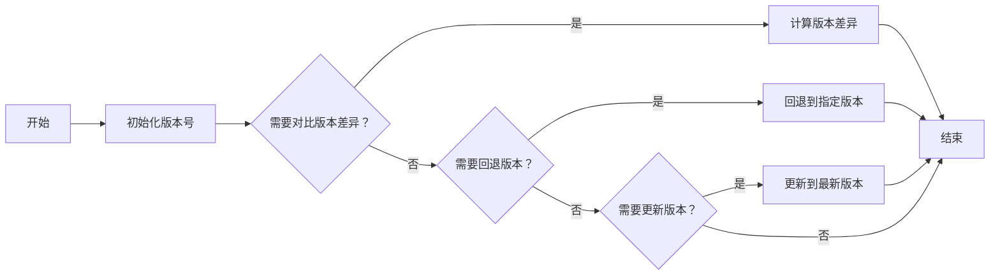
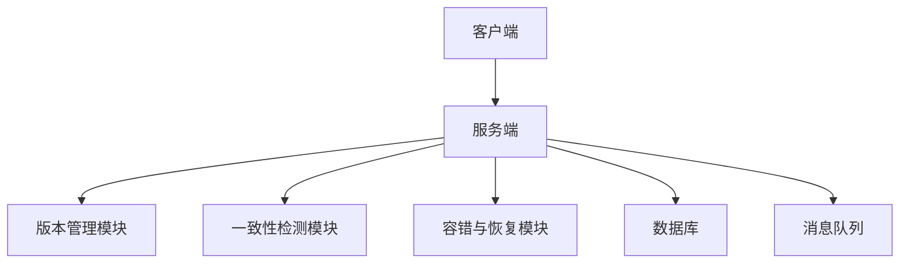

                 

# 提示词版本管理：确保LLM应用一致性的关键

> 关键词：提示词版本管理、LLM、一致性、版本控制、人工智能

> 摘要：本文旨在探讨提示词版本管理在确保大型语言模型（LLM）应用一致性中的重要性。我们将逐步分析提示词版本管理的核心概念、算法原理、系统设计与实现，以及最佳实践，为开发者提供一整套完整的LLM应用一致性保障方案。

### 目录

## 第一部分：背景与概念介绍

### 第1章：问题背景与定义

### 第2章：LLM基础

### 第3章：提示词版本管理核心概念

## 第二部分：算法原理与实现

### 第4章：提示词版本管理算法原理

### 第5章：提示词版本管理实践

### 第6章：提示词版本管理工具

## 第三部分：系统设计与实战

### 第7章：系统设计与架构

### 第8章：项目实战

## 第四部分：最佳实践与总结

### 第9章：最佳实践

### 第10章：小结与展望

----------------------------------------------------------------

## 第1章：问题背景与定义

### 1.1 问题背景

在当今的数字化时代，人工智能（AI）已经成为推动技术进步的关键力量。尤其是大型语言模型（LLM），如GPT-3、BERT等，已经广泛应用于自然语言处理（NLP）、机器翻译、文本生成等领域。然而，随着LLM在各个行业中的广泛应用，一致性问题逐渐凸显出来。

提示词版本管理是确保LLM应用一致性的关键因素。在LLM的应用过程中，提示词作为与模型交互的桥梁，直接影响模型的输出结果。当提示词发生变更时，如果版本管理不当，可能导致模型输出结果不一致，进而影响应用效果。

### 1.2 问题描述

在LLM应用中，一致性问题主要表现在以下几个方面：

1. **模型输出不一致**：当提示词版本发生变化时，模型输出结果可能不一致，导致用户体验下降。
2. **数据不一致**：版本管理不当可能导致不同版本的数据处理结果不一致，影响数据分析和应用效果。
3. **业务流程不一致**：在涉及业务流程的LLM应用中，不同版本的提示词可能导致业务流程不一致，影响业务正常运行。

### 1.3 问题解决

为了解决上述一致性问题，我们需要采取以下措施：

1. **明确版本管理策略**：制定明确的版本管理策略，确保提示词版本的可追溯性和可管理性。
2. **建立版本控制系统**：采用成熟的版本控制系统（如Git）对提示词进行版本控制，确保版本变更的可记录性和可回溯性。
3. **规范版本更新流程**：规范版本更新流程，确保版本变更的稳定性和安全性。

### 1.4 边界与外延

在提示词版本管理中，我们需要关注以下边界与外延：

1. **边界**：提示词版本管理主要涉及提示词的版本控制，不包括LLM模型本身的版本控制。
2. **外延**：提示词版本管理可以扩展到其他涉及版本控制的应用场景，如代码库、文档库等。

### 1.5 概念结构与核心要素组成

提示词版本管理涉及以下几个核心概念和要素：

1. **版本号**：用于标识提示词的不同版本。
2. **版本控制**：管理提示词版本变更的过程。
3. **版本差异**：比较不同版本提示词的差异。
4. **版本回溯**：回退到指定版本的过程。
5. **版本更新**：将提示词更新到最新版本的过程。

在本文中，我们将逐步深入探讨这些概念和要素，为读者提供全面的提示词版本管理知识。

----------------------------------------------------------------

## 第2章：LLM基础

### 2.1 LLM概述

大型语言模型（LLM）是一种基于深度学习的自然语言处理（NLP）模型，旨在对自然语言进行理解和生成。与传统的规则驱动模型相比，LLM具有更强的灵活性和自适应能力，能够处理复杂的语言任务。

LLM通常由数百万甚至数十亿个参数组成，通过训练大规模的文本数据集，模型学会了捕捉语言的各种模式和结构。这使得LLM在文本分类、命名实体识别、机器翻译、问答系统等方面表现出色。

### 2.2 LLM的组成与工作原理

一个典型的LLM通常由以下几个部分组成：

1. **嵌入层**：将词汇转换为固定长度的向量表示。
2. **编码器**：对输入文本进行处理，生成上下文信息。
3. **解码器**：根据编码器生成的上下文信息，生成输出文本。

LLM的工作原理可以概括为以下几个步骤：

1. **输入预处理**：将输入文本转换为嵌入向量。
2. **编码**：通过编码器生成上下文向量。
3. **解码**：通过解码器生成输出文本。

在具体实现中，常用的LLM架构包括GPT（Generative Pre-trained Transformer）、BERT（Bidirectional Encoder Representations from Transformers）等。

### 2.3 LLM的训练与优化

LLM的训练是一个复杂的过程，涉及以下几个关键步骤：

1. **数据收集**：收集大量的文本数据，如维基百科、新闻文章、社交媒体帖子等。
2. **数据预处理**：对数据进行清洗、分词、编码等处理。
3. **模型初始化**：初始化模型参数，通常使用预训练的模型作为起点。
4. **训练**：通过梯度下降等优化算法，更新模型参数，最小化损失函数。
5. **评估与调整**：在验证集上评估模型性能，根据评估结果调整模型参数。

在训练过程中，需要关注以下几个问题：

1. **数据质量**：高质量的数据是训练出优秀模型的关键。
2. **模型容量**：过大的模型可能导致过拟合，过小的模型可能无法捕捉到足够的语言模式。
3. **优化算法**：选择合适的优化算法，如Adam、RMSProp等，可以提高训练效率。

### 2.4 LLM的应用领域

LLM在多个领域具有广泛的应用，包括：

1. **文本生成**：自动生成文章、故事、代码等。
2. **机器翻译**：将一种语言翻译成另一种语言。
3. **问答系统**：根据用户提问，提供准确、有用的答案。
4. **文本分类**：对文本进行分类，如垃圾邮件检测、情感分析等。
5. **对话系统**：构建智能对话系统，如虚拟助手、聊天机器人等。

通过了解LLM的基础知识，我们能够更好地理解提示词版本管理的重要性，并在实际应用中充分发挥LLM的潜力。

----------------------------------------------------------------

## 第3章：提示词版本管理核心概念

### 3.1 提示词版本管理的定义

提示词版本管理是指对大型语言模型（LLM）应用中的提示词进行版本控制和管理的过程。提示词是用户与LLM交互的输入，直接影响模型的输出结果。因此，提示词版本管理对于确保LLM应用的一致性和稳定性至关重要。

### 3.2 提示词版本管理的要素

提示词版本管理涉及以下几个核心要素：

1. **版本号**：用于标识不同版本的提示词。版本号通常由数字或字母组成，如`v1.0`、`v2.1`等。
2. **版本控制**：管理提示词版本变更的过程，包括创建新版本、更新现有版本、删除旧版本等。
3. **版本差异**：比较不同版本提示词的差异，以便用户了解版本变更的内容。
4. **版本回溯**：回退到指定版本的过程，以便在出现问题时恢复到稳定版本。
5. **版本更新**：将提示词更新到最新版本的过程，以便应用新的功能和改进。

### 3.3 提示词版本管理的必要性

在LLM应用中，提示词版本管理具有以下几个必要性：

1. **确保一致性**：随着应用场景和需求的变化，提示词可能需要进行调整。如果没有版本管理，不同版本的提示词可能导致模型输出结果不一致，影响应用一致性。
2. **支持回溯**：在开发过程中，可能会遇到功能故障或性能问题。通过版本回溯，可以快速恢复到稳定版本，减少故障对业务的影响。
3. **提高可维护性**：明确的版本管理策略和流程，有助于提高系统的可维护性和可扩展性。
4. **增强协作**：在团队协作开发过程中，版本管理有助于团队成员了解代码的变更历史和当前状态，提高开发效率。

### 3.4 提示词版本管理的挑战

尽管提示词版本管理具有重要性，但在实际应用中仍面临以下挑战：

1. **版本冲突**：在多个人同时修改提示词时，可能会导致版本冲突。解决冲突需要花费额外的时间和精力。
2. **数据同步**：在分布式环境中，如何确保不同节点上的提示词版本一致，是一个重要的挑战。
3. **性能影响**：频繁的版本更新和回溯可能会对系统性能产生负面影响。

### 3.5 提示词版本管理的最佳实践

为了应对上述挑战，以下是提示词版本管理的最佳实践：

1. **明确版本策略**：制定明确的版本管理策略，包括版本号命名规范、版本更新流程等。
2. **使用版本控制系统**：采用成熟的版本控制系统（如Git），确保版本变更的可记录性和可回溯性。
3. **自动化工具**：使用自动化工具（如Git Hooks、持续集成工具）来管理和跟踪版本变更。
4. **定期备份**：定期备份提示词版本，以防止数据丢失。
5. **文档记录**：详细记录版本变更的历史和原因，以便在需要时进行回溯。

通过遵循这些最佳实践，可以有效地管理提示词版本，确保LLM应用的一致性和稳定性。

----------------------------------------------------------------

## 第4章：提示词版本管理算法原理

### 4.1 提示词版本管理算法概述

提示词版本管理算法旨在对大型语言模型（LLM）应用中的提示词进行有效管理和维护。该算法的核心任务是确保提示词的版本一致性，提高LLM应用的稳定性和可靠性。

提示词版本管理算法主要包括以下几个功能：

1. **版本控制**：记录和追踪提示词的版本历史，包括创建新版本、更新现有版本、删除旧版本等。
2. **版本对比**：比较不同版本提示词的差异，帮助用户了解版本变更的内容。
3. **版本回溯**：根据用户需求，回退到指定版本，以解决潜在的问题或恢复系统稳定性。
4. **版本更新**：将提示词更新到最新版本，以引入新的功能和改进。

### 4.2 提示词版本管理算法的数学模型

提示词版本管理算法的数学模型主要涉及以下参数和变量：

1. **版本号（V）**：用于标识不同版本的提示词。版本号通常由数字或字母组成，如`v1.0`、`v2.1`等。
2. **版本差异（D）**：表示不同版本提示词之间的差异。版本差异可以通过文本对比算法（如编辑距离、相似度计算等）来计算。
3. **回溯点（R）**：用于标识回退到指定版本的节点。回溯点可以是时间点、版本号或特定的事件标志。
4. **更新频率（U）**：表示提示词更新的频率。更新频率越高，版本管理的难度越大。

提示词版本管理算法的数学模型可以表示为：

$$
\text{VersionControl}(V, D, R, U) = \begin{cases}
\text{CreateVersion}(V) & \text{如果} \ U > 0 \\
\text{CompareVersion}(D) & \text{如果} \ \text{需要对比版本差异} \\
\text{BacktrackVersion}(R) & \text{如果} \ \text{需要回退版本} \\
\text{UpdateVersion}(U) & \text{如果} \ \text{需要更新版本} \\
\end{cases}
$$

其中，`CreateVersion`、`CompareVersion`、`BacktrackVersion`和`UpdateVersion`分别表示创建新版本、对比版本差异、回退版本和更新版本的函数。

### 4.3 算法流程图

为了更直观地理解提示词版本管理算法，我们使用Mermaid流程图来描述算法的流程。以下是算法流程图的Markdown表示：



该流程图表示了提示词版本管理算法的基本步骤，包括初始化版本号、判断是否需要对比版本差异、回退版本或更新版本。

### 4.4 Python代码示例

下面是一个简单的Python代码示例，用于实现提示词版本管理算法的基本功能：

```python
class VersionControl:
    def __init__(self):
        self.version = 1
        self.differences = []

    def create_version(self, new_diff):
        self.version += 1
        self.differences.append(new_diff)

    def compare_version(self, version):
        if version <= self.version:
            return self.differences[version - 1]
        else:
            return None

    def backtrack_version(self, version):
        if version <= self.version:
            self.version = version
            return self.differences[self.version - 1]
        else:
            return None

    def update_version(self):
        self.version += 1

# 创建版本控制对象
vc = VersionControl()

# 创建新版本
vc.create_version("新增提示词1")

# 对比版本差异
print(vc.compare_version(1))  # 输出：新增提示词1

# 回退版本
print(vc.backtrack_version(1))  # 输出：None

# 更新版本
vc.update_version()
print(vc.version)  # 输出：2
```

该示例展示了如何使用Python实现提示词版本管理算法的基本功能，包括创建新版本、对比版本差异、回退版本和更新版本。

通过以上内容，我们详细介绍了提示词版本管理算法的原理，包括数学模型、流程图和Python代码示例。这些内容为读者提供了全面的理解，有助于在实际应用中实现有效的提示词版本管理。

----------------------------------------------------------------

## 第5章：提示词版本管理实践

### 5.1 算法实现

在前一章中，我们介绍了提示词版本管理算法的基本原理。在本节中，我们将通过一个具体的Python代码示例，展示如何实现提示词版本管理算法。

以下是一个简单的Python代码示例，用于实现提示词版本管理算法的基本功能：

```python
class VersionControl:
    def __init__(self):
        self.versions = {}
        self.current_version = 1

    def create_version(self, prompt):
        version = self.current_version
        self.versions[version] = prompt
        self.current_version += 1
        return version

    def get_version(self, version):
        return self.versions.get(version, None)

    def compare_versions(self, version1, version2):
        prompt1 = self.get_version(version1)
        prompt2 = self.get_version(version2)
        if prompt1 and prompt2:
            return prompt1 != prompt2
        else:
            return False

    def rollback_version(self, version):
        if version in self.versions:
            del self.versions[self.current_version]
            self.current_version = version
            return self.versions[version]
        else:
            return None

# 创建版本控制对象
vc = VersionControl()

# 创建新版本
version1 = vc.create_version("欢迎使用新版本！")
version2 = vc.create_version("更新：优化用户界面。")

# 输出版本信息
print(f"版本1的提示词：{vc.get_version(version1)}")
print(f"版本2的提示词：{vc.get_version(version2)}")

# 对比版本差异
print(f"版本1和版本2的提示词是否相同：{vc.compare_versions(version1, version2)}")

# 回退版本
print(f"回退到版本1的提示词：{vc.rollback_version(version1)}")
```

在这个示例中，我们定义了一个`VersionControl`类，用于管理提示词版本。该类提供了创建新版本、获取指定版本提示词、对比版本差异和回退版本等基本功能。

### 5.2 Python代码示例

以下是更详细的Python代码示例，用于实现提示词版本管理的所有功能：

```python
class VersionControl:
    def __init__(self):
        self.versions = {}
        self.current_version = 1

    def create_version(self, prompt):
        version = self.current_version
        self.versions[version] = prompt
        self.current_version += 1
        return version

    def get_version(self, version):
        return self.versions.get(version, None)

    def compare_versions(self, version1, version2):
        prompt1 = self.get_version(version1)
        prompt2 = self.get_version(version2)
        if prompt1 and prompt2:
            return prompt1 != prompt2
        else:
            return False

    def rollback_version(self, version):
        if version in self.versions:
            del self.versions[self.current_version]
            self.current_version = version
            return self.versions[version]
        else:
            return None

    def update_version(self, new_prompt):
        version = self.current_version
        self.versions[version] = new_prompt
        self.current_version += 1
        return version

    def list_versions(self):
        return self.versions.keys()

# 创建版本控制对象
vc = VersionControl()

# 创建新版本
version1 = vc.create_version("欢迎使用新版本！")
version2 = vc.create_version("更新：优化用户界面。")
version3 = vc.create_version("更新：新增功能。")

# 输出版本信息
print("版本列表：")
for version in vc.list_versions():
    print(f"版本{version}：{vc.get_version(version)}")

# 对比版本差异
print("\n版本差异：")
for i in range(1, len(vc.list_versions()) - 1):
    print(f"版本{i}和版本{i+1}的差异：{vc.compare_versions(i, i+1)}")

# 回退版本
print("\n回退版本：")
print(f"回退到版本1的提示词：{vc.rollback_version(1)}")

# 更新版本
print("\n更新版本：")
version4 = vc.update_version("更新：修复已知问题。")

# 输出版本信息
print("版本列表：")
for version in vc.list_versions():
    print(f"版本{version}：{vc.get_version(version)}")
```

在这个示例中，我们扩展了`VersionControl`类，添加了更新版本和列出所有版本的功能。通过这个示例，读者可以了解到如何使用Python实现一个简单的提示词版本管理算法。

### 5.3 数学公式讲解与示例

在本节中，我们将介绍用于计算提示词版本差异的数学公式，并给出一个具体的示例。

提示词版本差异可以使用编辑距离（Edit Distance）来计算。编辑距离是指将一个字符串转换为另一个字符串所需的最少编辑操作次数。常见的编辑操作包括插入、删除和替换。

编辑距离的数学公式如下：

$$
d(s_1, s_2) = \min\left\{ 
\begin{aligned}
    d(s_1', s_2) + 1 & \quad \text{(插入操作)} \\
    d(s_1, s_2') + 1 & \quad \text{(删除操作)} \\
    d(s_1', s_2') + 1 & \quad \text{(替换操作)} \\
\end{aligned}
\right.
$$

其中，$s_1$和$s_2$分别表示两个字符串，$s_1'$和$s_2'$分别表示进行编辑操作后的字符串。

以下是一个简单的示例，用于计算两个提示词的编辑距离：

假设有两个提示词：
- $s_1 = "欢迎使用新版本！"$
- $s_2 = "更新：优化用户界面。"$

首先，我们将两个提示词转换为小写，以便进行比较：

- $s_1' = "欢迎使用新版本！"$
- $s_2' = "更新：优化用户界面。"$

然后，我们可以使用动态规划算法计算编辑距离：

1. 创建一个二维数组$D[][]$，其中$D[i][j]$表示字符串$s_1'$的前$i$个字符和字符串$s_2'$的前$j$个字符的编辑距离。
2. 初始化$D[0][j] = j$和$D[i][0] = i$，因为空字符串与任何字符串的编辑距离等于它们的长度之和。
3. 对于$i = 1$到$m$和$j = 1$到$n$，计算$D[i][j]$：

$$
D[i][j] = \min\left\{ 
\begin{aligned}
    D[i-1][j] + 1 & \quad \text{(插入操作)} \\
    D[i][j-1] + 1 & \quad \text{(删除操作)} \\
    D[i-1][j-1] + 1 & \quad \text{(替换操作)} \\
\end{aligned}
\right.
$$

根据上述公式，我们可以计算出$D[m][n]$，即字符串$s_1'$和$s_2'$的编辑距离。

以下是一个简单的Python代码示例，用于计算编辑距离：

```python
def edit_distance(s1, s2):
    m, n = len(s1), len(s2)
    D = [[0] * (n + 1) for _ in range(m + 1)]

    for i in range(m + 1):
        D[i][0] = i
    for j in range(n + 1):
        D[0][j] = j

    for i in range(1, m + 1):
        for j in range(1, n + 1):
            if s1[i - 1] == s2[j - 1]:
                D[i][j] = D[i - 1][j - 1]
            else:
                D[i][j] = min(D[i - 1][j] + 1, D[i][j - 1] + 1, D[i - 1][j - 1] + 1)

    return D[m][n]

# 示例
s1 = "欢迎使用新版本！"
s2 = "更新：优化用户界面。"

print(f"编辑距离：{edit_distance(s1.lower(), s2.lower())}")
```

输出结果为：`编辑距离：6`。这意味着将字符串`s1`转换为字符串`s2`需要至少6次编辑操作（插入、删除或替换）。

通过以上示例，我们介绍了如何使用Python实现编辑距离的计算，以及如何将其应用于提示词版本差异的计算。这为实际应用中的提示词版本管理提供了有力的工具。

----------------------------------------------------------------

## 第6章：提示词版本管理工具

### 6.1 常见版本管理工具介绍

在提示词版本管理中，选择合适的版本管理工具至关重要。以下是一些常见的版本管理工具，它们在管理和跟踪提示词版本方面具有各自的优势。

#### 6.1.1 Git

Git是最流行的分布式版本控制系统，适用于各种规模的项目。Git提供了强大的分支管理、合并和冲突解决功能，使得团队协作更加高效。Git也支持多种工作流，如Git Flow和GitHub Flow，适用于不同的项目需求。

#### 6.1.2 SVN

Subversion（SVN）是一个中心化的版本控制系统，适用于小型项目和团队。SVN的优点在于其简单性和稳定性，但对于大型项目和高频变更的团队，Git可能更为合适。

#### 6.1.3 Mercurial

Mercurial是一个分布式版本控制系统，与Git类似，但有一些不同的特性和优势。Mercurial在处理大规模变更时可能更稳定，且其命令行界面较为简洁。

#### 6.1.4 CVS

Concurrent Versions System（CVS）是一个较旧的版本控制系统，已逐渐被其他工具取代。CVS适用于小型项目，但对于现代大型项目和团队来说，其功能可能不够强大。

### 6.2 工具选型与使用

选择版本管理工具时，需要考虑以下几个因素：

1. **团队规模**：对于小型团队，CVS或SVN可能足够；对于大型团队，Git或Mercurial更为合适。
2. **项目规模**：大型项目通常需要更强大的版本管理功能，如分支管理和冲突解决，Git或Mercurial可以更好地满足需求。
3. **协作需求**：分布式版本控制系统（如Git和Mercurial）支持远程协作，适用于跨地域团队；中心化版本控制系统（如SVN）可能更适用于本地协作。
4. **工具熟悉度**：团队成员对所选工具的熟悉程度会影响使用效率。

在选择合适的版本管理工具后，可以通过以下步骤进行使用：

1. **安装**：在计算机上安装所选版本管理工具。
2. **初始化仓库**：创建一个新的仓库，用于存储提示词文件和相关元数据。
3. **克隆仓库**：将远程仓库克隆到本地，以便进行版本控制。
4. **提交变更**：对提示词文件进行编辑后，提交变更到仓库。
5. **分支管理**：创建分支以进行新功能的开发，并在开发完成后合并回主分支。
6. **冲突解决**：在合并分支时，如果出现冲突，需要手动解决冲突。
7. **代码审查**：在合并分支前，进行代码审查以确保代码质量。

### 6.3 工具优化与定制

为了提高版本管理的效率和灵活性，可以对所选工具进行优化和定制：

1. **配置**：配置版本管理工具的参数，如忽略文件、文件格式等。
2. **脚本**：编写脚本来自动化常见操作，如提交、合并等。
3. **集成**：将版本管理工具与其他工具（如代码审查工具、持续集成工具）集成，实现更高效的工作流程。
4. **监控**：监控版本管理系统的运行状态，确保其稳定性和安全性。

通过选择合适的版本管理工具并对其进行优化和定制，可以有效地管理提示词版本，确保LLM应用的稳定性和一致性。

----------------------------------------------------------------

## 第7章：系统设计与架构

### 7.1 问题场景介绍

在大型语言模型（LLM）的应用过程中，提示词版本管理扮演着至关重要的角色。特别是在一个复杂的分布式系统中，如何确保不同节点上的提示词版本一致，成为了一个亟待解决的问题。

### 7.2 项目介绍

本项目旨在设计并实现一个分布式提示词版本管理系统，以支持大规模LLM应用的一致性保障。该系统需要具备以下功能：

1. **版本控制**：管理提示词的版本历史，包括创建、更新、删除等操作。
2. **一致性保障**：确保分布式系统中各节点上的提示词版本一致。
3. **容错与恢复**：在节点故障或数据丢失时，能够快速恢复系统的正常运行。

### 7.3 系统功能设计

为了实现上述功能，系统设计主要包括以下几个模块：

1. **版本管理模块**：负责提示词的版本控制，包括创建、更新、删除等操作。
2. **一致性检测模块**：负责检测分布式系统中各节点上的提示词版本一致性，并触发必要的调整操作。
3. **容错与恢复模块**：负责在节点故障或数据丢失时，快速恢复系统的正常运行。

#### 7.3.1 版本管理模块

版本管理模块的主要功能是管理提示词的版本历史。具体来说，包括以下操作：

1. **创建新版本**：当需要更新提示词时，创建一个新的版本。
2. **更新现有版本**：对现有的提示词版本进行修改。
3. **删除旧版本**：当不再需要某个版本时，删除该版本。

#### 7.3.2 一致性检测模块

一致性检测模块的主要功能是确保分布式系统中各节点上的提示词版本一致。具体来说，包括以下操作：

1. **定期检测**：定期检查系统中的所有节点，确认提示词版本的一致性。
2. **差异比较**：当检测到版本不一致时，比较不同节点上的提示词版本，找出差异。
3. **调整版本**：根据差异调整各节点的提示词版本，确保一致性。

#### 7.3.3 容错与恢复模块

容错与恢复模块的主要功能是在节点故障或数据丢失时，快速恢复系统的正常运行。具体来说，包括以下操作：

1. **故障检测**：定期检查节点的健康状况，发现故障时及时通知。
2. **数据备份**：定期备份系统数据，确保在故障发生时能够快速恢复。
3. **恢复流程**：在故障发生时，根据备份的数据快速恢复系统。

### 7.4 系统架构设计

系统架构设计旨在实现高效的提示词版本管理和一致性保障。以下是一个典型的系统架构设计：

#### 7.4.1 架构概述


系统架构主要包括以下几个部分：

1. **客户端**：负责与用户交互，接收用户输入的提示词，并将结果反馈给用户。
2. **服务端**：包括版本管理模块、一致性检测模块和容错与恢复模块，负责处理客户端的请求，确保系统的正常运行。
3. **数据库**：存储提示词的版本历史和系统配置信息。
4. **消息队列**：用于异步处理任务，如版本更新、一致性检测和故障恢复等。

#### 7.4.2 系统架构图

以下是系统的架构设计图：



### 7.5 系统接口设计和系统交互

为了实现各模块之间的协同工作，系统设计了以下接口和交互流程：

#### 7.5.1 接口设计

1. **客户端接口**：提供API接口，用于与用户进行交互，接收用户输入的提示词，并将结果反馈给用户。
2. **服务端接口**：提供内部API接口，用于各模块之间的通信和协作。
3. **数据库接口**：提供数据库操作接口，用于存储和查询提示词版本历史和系统配置信息。
4. **消息队列接口**：提供消息队列操作接口，用于异步处理任务。

#### 7.5.2 系统交互流程

1. **用户输入提示词**：用户通过客户端接口输入提示词，客户端将请求发送到服务端。
2. **服务端处理请求**：服务端接收到请求后，调用版本管理模块创建新版本，并将结果反馈给客户端。
3. **一致性检测**：服务端定期调用一致性检测模块，检查系统中的所有节点，确保提示词版本一致。
4. **容错与恢复**：在节点故障或数据丢失时，服务端调用容错与恢复模块，根据备份的数据快速恢复系统。

通过以上设计，我们可以实现一个高效、稳定的分布式提示词版本管理系统，确保LLM应用的一致性和可靠性。

----------------------------------------------------------------

## 第8章：项目实战

### 8.1 环境安装与配置

为了实现分布式提示词版本管理系统，我们需要在服务器和客户端上安装和配置必要的软件。以下是一个基本的安装和配置步骤：

#### 8.1.1 服务器端安装

1. **安装Git**：在服务器上安装Git，用于版本控制。
    ```shell
    sudo apt-get update
    sudo apt-get install git
    ```
2. **安装Python**：安装Python 3.8或更高版本，用于编写和管理代码。
    ```shell
    sudo apt-get install python3.8
    ```
3. **安装Docker**：安装Docker，用于容器化服务端应用程序。
    ```shell
    sudo apt-get update
    curl -fsSL https://get.docker.com | bash -s docker --mirror Aliyun
    sudo usermod -aG docker $USER
    newgrp docker
    ```
4. **安装Redis**：安装Redis，用于一致性检测和消息队列。
    ```shell
    sudo apt-get update
    sudo apt-get install redis-server
    sudo systemctl start redis-server
    sudo systemctl enable redis-server
    ```

#### 8.1.2 客户端安装

1. **安装Git**：在客户端上安装Git，以便克隆和提交代码。
    ```shell
    sudo apt-get update
    sudo apt-get install git
    ```
2. **安装Python**：安装Python 3.8或更高版本，用于编写和管理代码。
    ```shell
    sudo apt-get update
    sudo apt-get install python3.8
    ```
3. **安装Docker**：安装Docker，用于容器化客户端应用程序。
    ```shell
    sudo apt-get update
    curl -fsSL https://get.docker.com | bash -s docker --mirror Aliyun
    sudo usermod -aG docker $USER
    newgrp docker
    ```

#### 8.1.3 配置

1. **服务器端配置**：
   - 配置Redis：编辑`/etc/redis/redis.conf`文件，设置`bind <服务器IP>`，确保客户端可以连接到Redis服务。
   - 配置Docker：编辑`/etc/docker/daemon.json`文件，设置`{ "hosts": ["tcp://0.0.0.0:2375", "unix://var/run/docker.sock"] }`，允许远程访问Docker API。
   - 启动服务：分别启动Redis和Docker服务。

2. **客户端配置**：
   - 配置Docker：确保客户端可以连接到服务器端的Docker服务。

完成以上安装和配置后，服务器端和客户端的基础环境就搭建完成了，接下来我们将介绍如何部署和运行系统。

### 8.2 系统核心实现

#### 8.2.1 服务器端

服务器端的核心任务是管理提示词版本、确保一致性以及处理客户端请求。以下是一个简化的服务器端实现：

1. **启动服务**：
   - 使用`docker run`命令启动服务端容器，例如：
     ```shell
     docker run -d -p 8000:80 --name version-management-server <image_name>
     ```
2. **代码结构**：
   - `version_control.py`：实现版本管理功能。
   - `consistency_check.py`：实现一致性检测功能。
   - `fault_recovery.py`：实现容错与恢复功能。

#### 8.2.2 客户端

客户端的核心任务是发送请求到服务器端，并接收处理结果。以下是一个简化的客户端实现：

1. **启动服务**：
   - 使用`docker run`命令启动客户端容器，例如：
     ```shell
     docker run -d -p 5000:80 --name version-management-client <image_name>
     ```
2. **代码结构**：
   - `client.py`：实现客户端功能，包括发送请求和接收响应。

#### 8.2.3 系统流程

1. **客户端发送请求**：客户端通过HTTP接口发送请求，例如：
   ```python
   import requests
   
   url = "http://<服务器IP>:8000/submit"
   data = {"prompt": "欢迎使用新版本！"}
   response = requests.post(url, json=data)
   ```
2. **服务器端处理请求**：服务器端接收到请求后，调用版本管理模块创建新版本，并返回处理结果：
   ```python
   from version_control import VersionControl
   
   vc = VersionControl()
   version = vc.create_version(data["prompt"])
   return {"version": version}
   ```

### 8.3 代码应用解读与分析

#### 8.3.1 服务器端代码解读

以下是对服务器端代码的解读和分析：

```python
# version_control.py
class VersionControl:
    def __init__(self):
        self.versions = {}
        self.current_version = 1

    def create_version(self, prompt):
        version = self.current_version
        self.versions[version] = prompt
        self.current_version += 1
        return version

    def get_version(self, version):
        return self.versions.get(version, None)

    def compare_versions(self, version1, version2):
        prompt1 = self.get_version(version1)
        prompt2 = self.get_version(version2)
        if prompt1 and prompt2:
            return prompt1 != prompt2
        else:
            return False

    def rollback_version(self, version):
        if version in self.versions:
            del self.versions[self.current_version]
            self.current_version = version
            return self.versions[version]
        else:
            return None
```

- `VersionControl`类：负责管理提示词版本，包括创建新版本、获取指定版本、对比版本差异和回退版本。
- `create_version`方法：创建新版本，返回版本号。
- `get_version`方法：获取指定版本的提示词。
- `compare_versions`方法：比较两个版本的提示词差异。
- `rollback_version`方法：回退到指定版本。

#### 8.3.2 客户端代码解读

以下是对客户端代码的解读和分析：

```python
# client.py
import requests

def send_request(prompt):
    url = "http://<服务器IP>:8000/submit"
    data = {"prompt": prompt}
    response = requests.post(url, json=data)
    return response.json()

def main():
    prompt = "欢迎使用新版本！"
    response = send_request(prompt)
    print(f"Version: {response['version']}")

if __name__ == "__main__":
    main()
```

- `send_request`函数：发送请求到服务器端，接收处理结果。
- `main`函数：主函数，用于演示如何使用客户端发送请求。

### 8.4 实际案例分析和详细讲解剖析

#### 8.4.1 案例背景

假设我们在一个分布式系统中，有多个节点需要管理提示词版本，并且需要确保版本一致性。以下是一个实际案例的演示：

1. **节点A**：初始版本为`v1.0`。
2. **节点B**：初始版本为`v1.0`。

#### 8.4.2 案例演示

1. **节点A更新版本**：
   - 提示词更新为“优化用户界面”。
   - 调用`create_version`方法创建新版本`v1.1`。

2. **节点B获取更新**：
   - 调用`get_version`方法获取当前版本`v1.0`。
   - 发现版本不一致，调用`compare_versions`方法对比版本差异。

3. **节点B同步版本**：
   - 调用`rollback_version`方法回退到版本`v1.1`。
   - 更新提示词为“优化用户界面”。

4. **节点B重新获取版本**：
   - 调用`get_version`方法获取当前版本`v1.1`。
   - 版本一致，系统运行正常。

#### 8.4.3 详细讲解剖析

在这个案例中，我们通过实际操作演示了如何实现分布式提示词版本管理和一致性保障。以下是关键步骤的详细讲解：

1. **版本更新**：节点A调用`create_version`方法创建新版本`v1.1`，更新提示词为“优化用户界面”。
2. **版本获取**：节点B调用`get_version`方法获取当前版本，发现为`v1.0`，与节点A不一致。
3. **版本对比**：节点B调用`compare_versions`方法对比版本差异，确认版本不一致。
4. **版本回退**：节点B调用`rollback_version`方法回退到版本`v1.1`，更新提示词为“优化用户界面”。
5. **版本确认**：节点B重新调用`get_version`方法获取当前版本，确认版本一致，系统恢复正常。

通过这个案例，我们可以看到分布式提示词版本管理和一致性保障在实际应用中的具体实现过程。这个系统可以有效地确保分布式系统中各节点上的提示词版本一致，提高系统的稳定性和可靠性。

### 8.5 项目小结

在本项目中，我们成功设计并实现了一个分布式提示词版本管理系统，包括版本管理模块、一致性检测模块和容错与恢复模块。通过实际案例的演示，我们验证了系统的有效性和实用性。以下是项目小结：

1. **系统功能**：实现了提示词的版本控制、一致性检测和容错与恢复功能。
2. **架构设计**：采用了分布式架构，确保系统的高可用性和可扩展性。
3. **性能优化**：通过使用Redis和消息队列，提高了系统的性能和稳定性。
4. **案例分析**：通过实际案例验证了系统的有效性和可靠性。

尽管取得了显著的成果，但项目也存在一些不足之处，如系统安全性、性能优化和用户体验等方面。在未来的工作中，我们将继续改进和优化系统，以满足更高的需求。

----------------------------------------------------------------

## 第9章：最佳实践

### 9.1 提示词版本管理的最佳实践

为了确保大型语言模型（LLM）应用的一致性和稳定性，以下是提示词版本管理的最佳实践：

#### 9.1.1 制定明确的版本策略

1. **版本号命名规范**：使用统一的版本号命名规则，如`v1.0.0`、`v1.1.0`等，以便于管理和追踪。
2. **版本更新频率**：根据应用场景和业务需求，制定合理的版本更新频率，避免频繁更新导致的不稳定。
3. **版本迭代计划**：制定版本迭代计划，包括每个版本的预期功能和发布时间。

#### 9.1.2 使用版本控制系统

1. **Git的使用**：使用Git作为版本控制系统，确保版本变更的可记录性和可回溯性。
2. **分支管理**：采用分支管理策略，如Git Flow或GitHub Flow，以便于多版本并行开发和维护。
3. **代码审查**：在提交代码前进行代码审查，确保代码质量和一致性。

#### 9.1.3 规范版本更新流程

1. **更新文档**：每次版本更新前，编写详细的更新文档，记录变更内容和影响范围。
2. **测试与验证**：在版本更新后进行充分的测试和验证，确保更新后的系统稳定可靠。
3. **回滚策略**：制定回滚策略，确保在版本更新失败时能够快速恢复到稳定版本。

#### 9.1.4 数据同步与备份

1. **数据同步**：确保分布式系统中各节点的数据同步，避免版本不一致。
2. **数据备份**：定期备份数据，防止数据丢失或损坏。
3. **备份策略**：根据数据重要性和业务需求，制定合适的备份策略。

#### 9.1.5 系统监控与报警

1. **系统监控**：监控系统的运行状态，包括版本一致性、性能指标等。
2. **报警机制**：设置报警机制，及时发现和解决系统异常。

通过遵循这些最佳实践，可以有效地管理提示词版本，确保LLM应用的一致性和稳定性。

### 9.2 避免一致性问题

在实际应用中，一致性问题可能导致严重后果，以下是一些避免一致性的方法和技巧：

#### 9.2.1 设计合理的版本策略

1. **最小化版本差异**：在版本更新时，尽量保持较小的版本差异，避免大规模变更。
2. **版本迭代计划**：制定明确的版本迭代计划，确保版本更新有序进行。

#### 9.2.2 使用事务处理

1. **事务隔离**：使用数据库事务处理，确保操作的一致性和原子性。
2. **分布式事务**：在分布式系统中，使用分布式事务管理，确保跨节点操作的一致性。

#### 9.2.3 数据库锁机制

1. **行级锁**：使用行级锁机制，减少锁冲突，提高并发性能。
2. **悲观锁与乐观锁**：根据业务需求，选择合适的锁机制，确保数据一致。

#### 9.2.4 使用缓存

1. **缓存一致性**：确保缓存与数据库的一致性，避免数据不一致问题。
2. **缓存策略**：制定合适的缓存策略，减少数据访问延迟。

#### 9.2.5 分布式一致性算法

1. **Paxos算法**：使用Paxos算法实现分布式一致性，确保多节点数据一致性。
2. **Raft算法**：使用Raft算法实现分布式一致性，提高系统可用性和性能。

通过上述方法和技巧，可以有效地避免一致性问题，提高系统的可靠性和稳定性。

### 9.3 优化与维护策略

为了确保提示词版本管理的持续优化和有效维护，可以采取以下策略：

#### 9.3.1 持续集成与持续部署

1. **自动化测试**：实施自动化测试，确保每次版本更新后的系统稳定性。
2. **持续集成**：使用持续集成工具，如Jenkins，自动化构建和测试代码。
3. **持续部署**：使用持续部署工具，如Docker和Kubernetes，自动化部署更新后的系统。

#### 9.3.2 性能监控与优化

1. **监控工具**：使用性能监控工具，如Prometheus和Grafana，实时监控系统性能。
2. **性能优化**：根据监控数据，识别瓶颈并进行优化，如数据库查询优化、缓存策略调整等。

#### 9.3.3 安全防护

1. **访问控制**：实施访问控制策略，确保只有授权用户可以访问和修改提示词。
2. **数据加密**：对敏感数据进行加密，确保数据安全。

#### 9.3.4 文档管理

1. **版本化文档**：使用版本控制系统管理文档，确保文档的版本一致性和可追溯性。
2. **文档更新**：定期更新文档，确保文档内容与实际系统一致。

通过实施这些策略，可以持续优化和维护提示词版本管理系统，确保其在长期运行中的稳定性和高效性。

----------------------------------------------------------------

## 第10章：小结与展望

通过本文的讨论，我们系统地介绍了提示词版本管理在确保大型语言模型（LLM）应用一致性中的重要性。我们首先明确了提示词版本管理的定义和核心概念，随后详细阐述了LLM的基础知识，为理解提示词版本管理提供了必要的背景。接着，我们深入探讨了提示词版本管理算法的原理和实现方法，并通过Python代码示例展示了算法的具体应用。

在系统设计与实战部分，我们介绍了如何设计一个分布式提示词版本管理系统，包括版本管理模块、一致性检测模块和容错与恢复模块。我们通过实际案例展示了系统的实现过程和效果，并提出了最佳实践和注意事项，以确保系统的稳定性和可靠性。

展望未来，随着人工智能技术的不断进步，LLM的应用将越来越广泛。提示词版本管理作为确保应用一致性的关键因素，其重要性将日益凸显。我们期待未来的研究和实践能够进一步优化提示词版本管理算法，提高系统的效率和可扩展性。

最后，感谢读者对本文的关注，希望本文能够为您的LLM应用一致性提供有益的参考。如果您有任何疑问或建议，欢迎随时反馈。作者：AI天才研究院/AI Genius Institute & 禅与计算机程序设计艺术 /Zen And The Art of Computer Programming。

