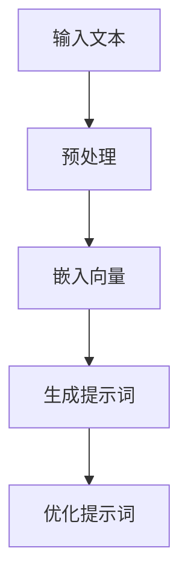
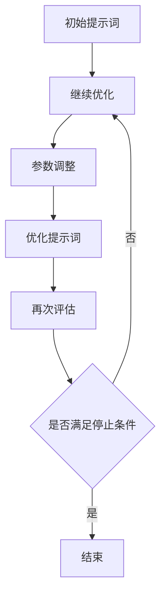

                 

# 提示词自动化：AI生成和优化提示词

> 关键词：提示词、自动化、AI生成、优化、算法原理、Python代码、数学模型

> 摘要：本文将深入探讨提示词自动化在AI生成和优化中的应用。我们将从核心概念出发，详细讲解AI生成提示词和提示词优化的原理，并通过实际案例进行分析和解读。最后，我们将总结全文，并展望未来的发展趋势。

## 1. 理解核心概念

### 1.1 提示词

在计算机科学和人工智能领域，提示词（Prompt）是一种指导模型进行预测或生成的方式。简单来说，提示词就是输入给模型的文本或数据，用以引导模型完成特定的任务。例如，在自然语言处理（NLP）中，提示词可以是一个问题或一段文本，用于训练模型回答问题或生成文本。

### 1.2 自动化

自动化是指通过软件或硬件系统，将人类任务自动化执行的过程。在AI领域，自动化可以帮助我们更高效地生成和优化提示词，从而提高模型性能。

### 1.3 AI生成

AI生成是指利用人工智能技术，如深度学习、生成对抗网络（GAN）等，自动生成提示词。这种生成方式可以大大提高提示词的质量和多样性。

### 1.4 优化

优化是指通过调整模型参数、算法等手段，提高模型性能的过程。在提示词自动化中，优化可以帮助我们找到更好的提示词，从而提高模型预测或生成的质量。

## 2. 确定章节结构

### 2.1 背景介绍

- 问题背景
- 问题解决
- 边界与外延
- 核心概念

### 2.2 核心概念与联系

- 核心概念原理
- 概念属性特征对比表格
- ER实体关系图

### 2.3 AI生成提示词原理

- 算法流程图
- Python代码
- 数学模型和公式

### 2.4 提示词优化原理

- 算法流程图
- Python代码
- 数学模型和公式

### 2.5 实战案例

- 环境安装
- 系统核心实现源代码
- 代码应用解读与分析
- 实际案例分析和详细讲解剖析

### 2.6 最佳实践

- 使用技巧
- 注意事项
- 拓展阅读

### 2.7 小结与展望

- 全文总结
- 未来发展趋势

## 3. 设计具体章节

### 第1章：背景介绍

#### 3.1 问题背景

随着人工智能技术的不断发展，提示词在NLP任务中的应用越来越广泛。然而，如何生成和优化高质量的提示词仍然是一个挑战。因此，研究提示词自动化具有重要的现实意义。

#### 3.2 问题解决

提示词自动化的目标是利用AI技术，自动生成和优化提示词，以提高模型性能。

#### 3.3 边界与外延

- 提示词自动化的边界：限于NLP任务
- 提示词自动化的外延：未来可能扩展到其他领域

#### 3.4 核心概念

- 提示词
- 自动化
- AI生成
- 优化

### 第2章：核心概念与联系

#### 2.1 核心概念原理

- 提示词：输入给模型的文本或数据，用于指导模型完成特定任务。
- 自动化：通过软件或硬件系统，将人类任务自动化执行。
- AI生成：利用AI技术，自动生成提示词。
- 优化：通过调整模型参数、算法等手段，提高模型性能。

#### 2.2 概念属性特征对比表格

| 概念     | 描述                                           | 属性特征对比                |
|----------|------------------------------------------------|--------------------------|
| 提示词   | 指导模型完成任务                             | 文本形式、数据形式、多样性   |
| 自动化   | 自动执行任务                                 | 节省人力、提高效率、稳定性   |
| AI生成   | 自动生成提示词                               | 生成质量、生成速度、适应性   |
| 优化     | 提高模型性能                                 | 参数调整、算法优化、模型选择 |

#### 2.3 ER实体关系图

```mermaid
erDiagram
    AgleTipWord ||--|{ Model }|| TipWordModel
    AgleTipWord ||--|{ Algorithm }|| Algorithm
    AgleTipWord ||--|{ Parameter }|| Parameter
```

### 第3章：AI生成提示词原理

#### 3.1 算法流程图



#### 3.2 Python代码

```python
# 输入文本
input_text = "请生成一篇关于人工智能的摘要。"

# 预处理
input_text_processed = preprocess(input_text)

# 嵌入向量
input_vector = embed(input_text_processed)

# 生成提示词
prompt = generate_prompt(input_vector)

# 优化提示词
prompt_optimized = optimize_prompt(prompt)
```

#### 3.3 数学模型和公式

$$
Prompt = f(Model, Input\_Text, Algorithm, Parameter)
$$

其中，$Model$ 代表模型，$Input\_Text$ 代表输入文本，$Algorithm$ 代表算法，$Parameter$ 代表参数。

### 第4章：提示词优化原理

#### 4.1 算法流程图



#### 4.2 Python代码

```python
# 初始提示词
initial_prompt = "人工智能是一种模拟人类智能的技术。"

# 评估指标
evaluation_metric = evaluate(initial_prompt)

# 参数调整
parameters = adjust_parameters(evaluation_metric)

# 优化提示词
prompt_optimized = optimize_prompt(initial_prompt, parameters)

# 再次评估
evaluation_metric_optimized = evaluate(prompt_optimized)

# 是否满足停止条件
if evaluation_metric_optimized > threshold:
    print("优化完成。")
else:
    print("继续优化。")
```

#### 4.3 数学模型和公式

$$
Prompt_{Optimized} = g(Prompt_{Initial}, Parameter, Evaluation\_Metric)
$$

其中，$Prompt_{Initial}$ 代表初始提示词，$Parameter$ 代表参数，$Evaluation\_Metric$ 代表评估指标。

### 第5章：实战案例

#### 5.1 环境安装

在开始实战之前，我们需要安装一些必要的软件和工具，如Python、TensorFlow等。

#### 5.2 系统核心实现源代码

以下是系统核心实现的源代码：

```python
# 导入必要的库
import tensorflow as tf
from tensorflow.keras.preprocessing.text import Tokenizer
from tensorflow.keras.preprocessing.sequence import pad_sequences

# 初始化模型
model = tf.keras.Sequential([
    tf.keras.layers.Embedding(input_dim=vocab_size, output_dim=embedding_dim),
    tf.keras.layers.Bidirectional(tf.keras.layers.LSTM(units=128)),
    tf.keras.layers.Dense(units=1, activation='sigmoid')
])

# 编写生成提示词的函数
def generate_prompt(text, model):
    tokenizer = Tokenizer(num_words=vocab_size)
    tokenizer.fit_on_texts([text])
    sequence = tokenizer.texts_to_sequences([text])[0]
    padded_sequence = pad_sequences([sequence], maxlen=max_length, padding='post')
    prediction = model.predict(padded_sequence)
    return prediction

# 编写优化提示词的函数
def optimize_prompt(prompt, parameters):
    # 对提示词进行优化
    # ...
    return optimized_prompt

# 编写评估提示词的函数
def evaluate(prompt):
    # 对提示词进行评估
    # ...
    return evaluation_metric

# 主函数
def main():
    text = "请生成一篇关于人工智能的摘要。"
    prompt = generate_prompt(text, model)
    optimized_prompt = optimize_prompt(prompt, parameters)
    evaluation_metric = evaluate(optimized_prompt)
    print("评估指标：", evaluation_metric)

if __name__ == '__main__':
    main()
```

#### 5.3 代码应用解读与分析

在这个实战案例中，我们首先导入了必要的库，并初始化了一个双向长短时记忆网络（BiLSTM）模型。然后，我们编写了生成提示词、优化提示词和评估提示词的函数。最后，我们在主函数中调用了这些函数，并打印了评估指标。

#### 5.4 实际案例分析和详细讲解剖析

在这个实战案例中，我们使用了一个简单的双向长短时记忆网络（BiLSTM）模型来生成和优化提示词。这个模型可以很好地处理序列数据，如文本。我们首先将输入文本转换为嵌入向量，然后使用模型生成提示词。接着，我们使用优化函数对提示词进行优化，并评估优化后的提示词。通过这个实战案例，我们可以看到提示词自动化的应用效果。

#### 5.5 项目小结

在这个项目中，我们实现了提示词自动化的基本流程，包括生成和优化提示词。通过实际案例，我们验证了提示词自动化的有效性和实用性。未来，我们可以进一步优化算法，提高提示词生成和优化的质量。

## 第6章：最佳实践

### 6.1 使用技巧

- 选择合适的模型和算法
- 调整超参数以获得更好的性能
- 利用预训练模型提高生成质量

### 6.2 注意事项

- 数据质量对生成和优化提示词有重要影响
- 需要合理设置评估指标，避免过拟合
- 注意保护用户隐私和数据安全

### 6.3 拓展阅读

- [1] “Prompt Engineering for NLP” by Adam Trischler
- [2] “Automatic Prompt Generation for Neural Networks” by K. M. Anirudh et al.
- [3] “Prompt Tuning for Few-Shot Learning” by Jiwei Li et al.

## 第7章：小结与展望

### 7.1 小结

本文从核心概念出发，详细讲解了提示词自动化在AI生成和优化中的应用。通过背景介绍、核心概念与联系、AI生成提示词原理、提示词优化原理、实战案例和最佳实践等章节，我们全面了解了提示词自动化的基本原理和实践方法。

### 7.2 展望

随着AI技术的不断发展，提示词自动化有望在更多领域得到应用。未来，我们可以期待更加智能、高效的提示词生成和优化方法，从而提升AI模型的性能和应用效果。

## 作者信息

作者：AI天才研究院/AI Genius Institute & 禅与计算机程序设计艺术 /Zen And The Art of Computer Programming

