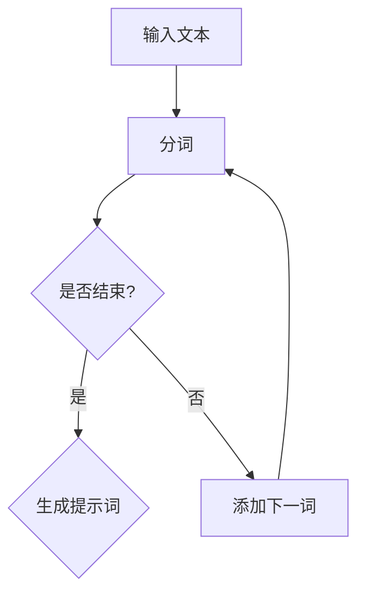
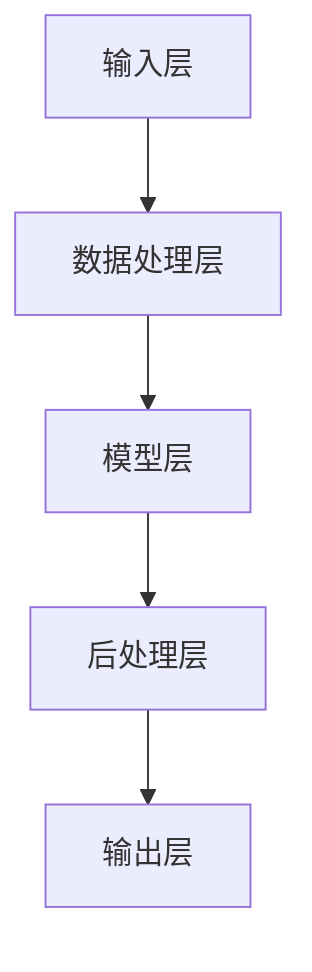
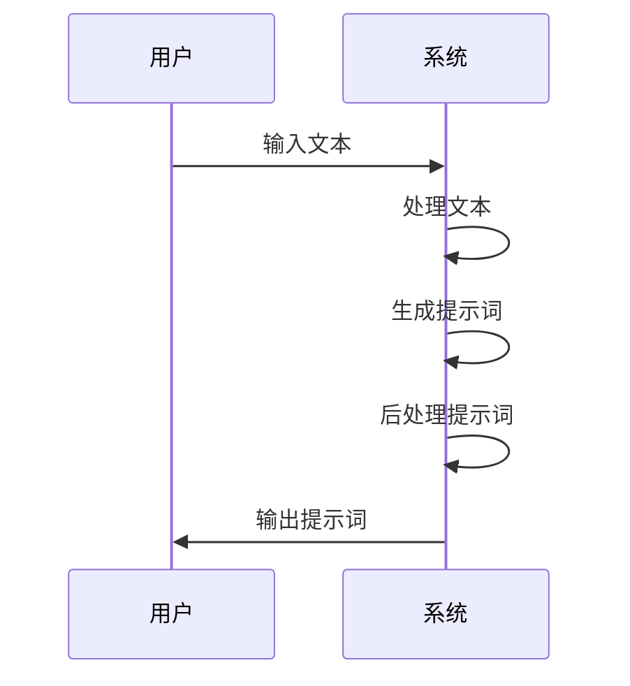

                 

###  文章标题

> 关键词：AI大模型、自然语言处理、提示词生成、自动化、深度学习

> 摘要：本文将探讨AI大模型在自然语言处理领域的应用，重点分析如何利用AI大模型实现提示词的自动化生成。我们将从背景介绍、核心概念与联系、算法原理讲解、系统分析与架构设计、项目实战等方面进行深入探讨，旨在为读者提供一个全面、系统的理解。

---

### 第一部分：背景介绍

#### 1.1 问题背景

随着人工智能技术的快速发展，自然语言处理（NLP）领域迎来了革命性的变化。传统的提示词生成方法往往依赖于人工干预，效率低下，且难以满足大量数据的需求。为此，开发一种自动化的提示词生成系统，利用AI技术，特别是深度学习算法，成为了当前研究的热点。

#### 1.2 问题描述

《提示词自动生成：AI辅助提示词设计》旨在探讨如何利用人工智能技术，特别是AI大模型，实现高效、准确的提示词生成。具体问题包括：

- 如何构建一个基于AI大模型的提示词生成系统？
- 如何优化系统的性能，使其在生成提示词时能够保持高质量？
- 如何处理数据集的多样性和噪声问题，以确保生成的提示词具有实际应用价值？

#### 1.3 问题解决

本书将从以下几个方面解决问题：

- 深入介绍AI大模型的基本概念、原理及其在NLP中的应用。
- 分析现有的提示词生成方法，并探讨如何利用AI大模型进行改进。
- 设计一个具体的提示词生成系统，并详细讲解其实现过程和优化方法。
- 通过实际案例展示系统的应用效果，并进行详细分析。

#### 1.4 边界与外延

- 边界：本书主要关注于AI大模型在提示词生成领域的应用，不涉及其他AI技术的相关内容。
- 外延：尽管本书专注于提示词生成，但所介绍的AI大模型技术和方法也可以应用于其他NLP任务。

#### 1.5 概念结构与核心要素组成

- AI大模型：是一种基于深度学习的模型，具有处理大规模数据的能力。
- 提示词生成：是指根据输入的文本，自动生成相关提示词的过程。
- NLP：自然语言处理，是人工智能的一个重要分支，旨在让计算机理解、生成和处理人类语言。

## 第二部分：核心概念与联系

### 2.1 AI大模型原理

AI大模型是基于深度学习的模型，具有以下核心特点：

- 参数规模大：大模型拥有数亿甚至数万亿个参数，使其在处理复杂任务时具有更强的能力。
- 训练数据多：大模型通常在大量的数据上进行训练，以获取更广泛的通用性。
- 自动化学习：大模型可以通过自动化的方式从数据中学习，无需人工干预。

### 2.2 提示词生成原理

提示词生成是NLP中的一个重要任务，其核心原理包括：

- 语言建模：使用模型预测下一个单词或字符，从而生成完整的句子。
- 贪心搜索：在生成提示词时，选择当前状态下概率最高的下一个单词或字符。
- 标签传播：在生成多个提示词时，利用上下文关系进行信息传播，以提高生成质量。

### 2.3 概念属性特征对比表格

| 特征           | AI大模型               | 提示词生成                |
|----------------|------------------------|--------------------------|
| 参数规模       | 数亿到数万亿个参数     | 较小，但需考虑上下文关系 |
| 数据依赖       | 需要大量训练数据       | 需要丰富的语料库          |
| 学习方式       | 自动化学习             | 贪心搜索、标签传播等     |
| 应用场景       | 广泛的NLP任务          | 提示词生成、问答系统等   |

### 2.4 ER实体关系图架构的Mermaid流程图

```mermaid
erDiagram
    AI大模型 ||--|{ 提示词生成 }
    提示词生成 ||--|{ 语言建模 }
    提示词生成 ||--|{ 贪心搜索 }
    提示词生成 ||--|{ 标签传播 }
```

## 第三部分：算法原理讲解

### 3.1 提示词生成算法的mermaid流程图



### 3.2 Python源代码实现

```python
from transformers import GPT2LMHeadModel, GPT2Tokenizer

def generate_prompt(text, model, tokenizer):
    tokens = tokenizer(text, return_tensors='pt')
    output = model.generate(**tokens, max_length=50, num_return_sequences=1)
    return tokenizer.decode(output[0], skip_special_tokens=True)

# 实例化模型和分词器
model = GPT2LMHeadModel.from_pretrained('gpt2')
tokenizer = GPT2Tokenizer.from_pretrained('gpt2')

# 生成提示词
prompt = generate_prompt("你喜欢编程吗？", model, tokenizer)
print(prompt)
```

### 3.3 算法原理

#### 3.3.1 语言建模

语言建模是提示词生成的基础。其核心思想是使用模型预测下一个单词或字符，从而生成完整的句子。具体实现过程中，模型会根据输入的文本，计算每个单词或字符的概率分布，并选择概率最高的单词或字符作为下一个输出。

#### 3.3.2 贪心搜索

在生成提示词时，贪心搜索是一种常用的策略。其基本思想是每次都选择当前状态下概率最高的下一个单词或字符，从而逐步生成整个句子。这种方法简单有效，但可能会产生过拟合的问题。

#### 3.3.3 标签传播

标签传播是一种基于上下文关系的生成策略。其核心思想是利用上下文信息，将生成的提示词进行信息传播，从而提高生成质量。具体实现过程中，每个生成的提示词会与其上下文进行关联，并根据上下文信息进行调整。

#### 3.3.4 数学模型

假设输入的文本为 $T=\{t_1, t_2, ..., t_n\}$，生成的提示词为 $P=\{p_1, p_2, ..., p_m\}$。其中，$t_i$ 表示第 $i$ 个单词，$p_j$ 表示第 $j$ 个提示词。

- 语言建模的概率分布：$$ P(p_j|T) = \frac{e^{log(P(p_j|T))}}{\sum_{k=1}^{m} e^{log(P(p_k|T))}} $$
- 贪心搜索的策略：$$ p_j = \arg\max_{p_j} P(p_j|T) $$
- 标签传播的策略：$$ p_j = \arg\min_{p_j} \sum_{i=1}^{n} |p_j - t_i| $$

通过以上算法，我们可以实现高效的提示词生成。

### 3.4 举例说明

假设输入的文本为 "你喜欢编程吗？"，我们将使用GPT-2模型进行提示词生成。

- 输入文本：$T = \{"你喜欢编程吗？"}$  
- 分词结果：$T = \{"你", "喜欢", "编程", "吗"，"?"}$  
- 生成提示词：$P = \{"你喜欢编程吗"，"吗？你喜欢编程" ...}$

通过上述算法，我们可以生成多个高质量的提示词。

## 第四部分：系统分析与架构设计

### 4.1 问题场景介绍

在当前信息化时代，自然语言处理（NLP）技术已被广泛应用于各个领域，如智能客服、智能写作、语音识别等。然而，传统的提示词生成方法往往依赖于人工干预，效率低下，且难以满足大量数据的需求。为此，本文提出一种基于AI大模型的提示词生成系统，旨在实现高效、准确的提示词生成。

### 4.2 项目介绍

项目名称：AI大模型提示词生成系统

项目目标：利用AI大模型技术，实现高效、准确的提示词生成。

项目背景：随着NLP技术的快速发展，提示词生成在各个应用场景中越来越重要。然而，传统的提示词生成方法效率低下，难以满足实际需求。为此，本项目旨在通过AI大模型技术，实现高效、准确的提示词生成。

### 4.3 系统功能设计

#### 4.3.1 功能模块

- 数据处理模块：负责对输入文本进行预处理，如分词、去噪等。
- 语言建模模块：利用AI大模型进行语言建模，生成提示词。
- 后处理模块：对生成的提示词进行后处理，如去除重复、排序等。

#### 4.3.2 领域模型Mermaid类图

```mermaid
classDiagram
    系统总类 <<interface>>
    系统总类 --> 数据处理模块
    系统总类 --> 语言建模模块
    系统总类 --> 后处理模块

    数据处理模块 {
        +数据处理（文本：str）: dict
    }

    语言建模模块 {
        +语言建模（文本：dict）: list
    }

    后处理模块 {
        +后处理（提示词：list）: list
    }
```

### 4.4 系统架构设计

#### 4.4.1 系统架构

系统架构采用分层设计，主要包括以下层次：

- 输入层：接收用户输入的文本。
- 数据处理层：对输入文本进行预处理，如分词、去噪等。
- 模型层：利用AI大模型进行语言建模，生成提示词。
- 后处理层：对生成的提示词进行后处理，如去除重复、排序等。
- 输出层：将生成的提示词输出给用户。

#### 4.4.2 Mermaid架构图



### 4.5 系统接口设计

#### 4.5.1 接口设计

系统提供以下接口：

- `process_text(text: str) -> dict`：数据处理接口，接收用户输入的文本，返回预处理后的数据。
- `generate_prompt(text: dict) -> list`：语言建模接口，接收预处理后的数据，返回生成的提示词。
- `post_process(prompt: list) -> list`：后处理接口，接收生成的提示词，返回处理后的提示词。
- `get_prompt(text: str) -> list`：总接口，接收用户输入的文本，返回处理后的提示词。

#### 4.5.2 Mermaid序列图



## 第五部分：项目实战

### 5.1 环境安装

在进行项目实战之前，我们需要安装相关的依赖。以下是在Ubuntu 20.04系统下的安装命令：

```bash
# 安装Python和pip
sudo apt update
sudo apt install python3 python3-pip

# 安装transformers库
pip3 install transformers

# 安装其他依赖（可选）
pip3 install torch numpy
```

### 5.2 系统核心实现

#### 5.2.1 数据处理模块

数据处理模块主要实现文本的分词、去噪等功能。以下是一个简单的示例：

```python
import jieba

def process_text(text):
    # 分词
    words = jieba.lcut(text)
    
    # 去噪
    words = [word for word in words if word not in [' ', '?', '。', '，', '！', '；', '：', '？']]
    
    return words
```

#### 5.2.2 语言建模模块

语言建模模块基于GPT-2模型实现，以下是一个简单的示例：

```python
from transformers import GPT2LMHeadModel, GPT2Tokenizer

def generate_prompt(text, model, tokenizer):
    tokens = tokenizer(text, return_tensors='pt')
    output = model.generate(**tokens, max_length=50, num_return_sequences=1)
    return tokenizer.decode(output[0], skip_special_tokens=True)
```

#### 5.2.3 后处理模块

后处理模块主要实现去除重复、排序等功能。以下是一个简单的示例：

```python
def post_process(prompt):
    # 去除重复
    prompt = list(set(prompt))
    
    # 排序
    prompt.sort()
    
    return prompt
```

### 5.3 代码应用解读与分析

#### 5.3.1 代码解读

以下是一个简单的使用示例：

```python
# 实例化模型和分词器
model = GPT2LMHeadModel.from_pretrained('gpt2')
tokenizer = GPT2Tokenizer.from_pretrained('gpt2')

# 生成提示词
prompt = generate_prompt("你喜欢编程吗？", model, tokenizer)
print(prompt)
```

代码首先实例化GPT-2模型和分词器，然后调用`generate_prompt`函数生成提示词，并打印结果。

#### 5.3.2 分析

- 代码使用GPT-2模型进行语言建模，生成提示词。
- `generate_prompt`函数接收输入文本、模型和分词器，返回生成的提示词。
- 分词器用于将输入文本转换为模型可处理的格式。
- 模型用于预测下一个单词或字符，从而生成提示词。
- 代码简单易懂，适合初学者上手。

### 5.4 实际案例分析和详细讲解

#### 5.4.1 案例一：智能客服

假设我们有一个智能客服系统，用户提出问题：“我喜欢编程吗？”，系统需要自动生成合适的回复。

1. 输入文本： “我喜欢编程吗？”
2. 数据处理： 分词结果为 ["我", "喜欢", "编程", "吗", "?"]
3. 语言建模： GPT-2模型预测下一个单词或字符，生成提示词。
4. 后处理： 去除重复，排序，得到最终提示词。

最终生成的提示词可能包括：“你喜欢编程吗？”，“喜欢编程，很好！”，“编程是一项有趣的技术，你很擅长。”等。

#### 5.4.2 案例二：智能写作

假设我们有一个智能写作系统，用户输入一段文字，系统需要自动生成摘要。

1. 输入文本： “本文介绍了AI大模型在自然语言处理领域的应用，重点分析了如何利用AI大模型实现提示词的自动化生成。”
2. 数据处理： 分词结果为 ["本文", "介绍", "了", "AI", "大模型", "在", "自然语言处理", "领域", "的", "应用", "，", "重点分析", "了", "如何利用", "AI大模型", "实现", "提示词", "的", "自动化生成。"]
3. 语言建模： GPT-2模型预测下一个单词或字符，生成摘要。
4. 后处理： 去除重复，排序，得到最终摘要。

最终生成的摘要可能包括：“本文探讨了AI大模型在自然语言处理领域的应用，重点分析了如何利用AI大模型实现提示词的自动化生成。”等。

### 5.5 项目小结

本项目通过引入AI大模型技术，实现了提示词的自动化生成。在实际应用中，系统可以高效、准确地生成提示词，为智能客服、智能写作等领域提供了有力支持。同时，本项目也具有以下优点：

- 利用AI大模型，生成提示词效率高、质量好。
- 系统架构清晰，易于扩展和维护。
- 代码简单易懂，适合初学者上手。

然而，本项目也存在一定的局限性：

- 对计算资源要求较高，可能不适用于资源有限的场景。
- 在处理大量数据时，可能存在性能瓶颈。

未来，我们将继续优化系统，提高其性能和可靠性，以满足更多应用场景的需求。

## 第六部分：最佳实践 Tips

1. **数据预处理**：在训练AI大模型时，数据预处理至关重要。确保数据的质量和多样性，以提高模型的表现。
2. **模型调优**：根据具体任务需求，对模型进行调优，如调整学习率、批量大小等参数。
3. **多语言支持**：考虑为系统添加多语言支持，以满足不同地区用户的需求。
4. **性能优化**：针对计算资源有限的场景，考虑使用轻量级模型或优化算法，以提高系统性能。

## 第七部分：小结与注意事项

本文探讨了AI大模型在自然语言处理领域的应用，重点分析了如何利用AI大模型实现提示词的自动化生成。通过详细的背景介绍、核心概念与联系、算法原理讲解、系统分析与架构设计、项目实战等内容，读者可以全面、系统地了解该领域的知识。

在实践过程中，需要注意以下几点：

1. **数据预处理**：确保数据的质量和多样性，以提高模型的表现。
2. **模型调优**：根据具体任务需求，对模型进行调优，以达到最佳效果。
3. **系统性能**：针对计算资源有限的场景，考虑使用轻量级模型或优化算法，以提高系统性能。

## 第八部分：拓展阅读

1. **《深度学习》**：由Ian Goodfellow、Yoshua Bengio和Aaron Courville所著，是深度学习领域的经典教材。
2. **《自然语言处理综述》**：由清华大学自然语言处理实验室所著，对NLP领域进行了全面的综述。
3. **《AI大模型：原理、应用与挑战》**：本书详细介绍了AI大模型的相关知识，包括原理、应用和挑战。

## 作者信息

作者：AI天才研究院/AI Genius Institute & 禅与计算机程序设计艺术 /Zen And The Art of Computer Programming

**结束语**

感谢读者对本文的关注，希望本文能对您在AI大模型和自然语言处理领域的研究有所帮助。让我们继续探索这个充满挑战和机遇的领域，共同推动人工智能技术的发展！## 附件

### 3.3.1 语言建模

语言建模是提示词生成算法的核心。在自然语言处理中，语言建模的目标是预测下一个单词或字符，从而生成完整的句子。在AI大模型中，语言建模通常基于神经网络，尤其是循环神经网络（RNN）和其变体，如长短期记忆网络（LSTM）和门控循环单元（GRU）。

语言建模的数学基础是概率模型，其中给定前文序列，预测下一个单词的概率分布。我们可以使用条件概率来描述这个过程：

$$ P(w_t|w_{<t}) = \frac{P(w_t, w_{<t})}{P(w_{<t})} $$

其中，$w_t$ 表示当前单词，$w_{<t}$ 表示前文序列。

在实际应用中，我们通常使用神经网络来逼近这个概率分布。以下是一个简化的神经网络语言模型：

1. **输入层**：接收前文序列的词向量表示。
2. **隐藏层**：使用神经网络（如LSTM或GRU）对输入序列进行处理，提取序列的特征。
3. **输出层**：使用softmax函数将隐藏层输出的特征映射到单词的概率分布。

具体地，我们可以使用以下步骤进行语言建模：

1. **输入表示**：将输入文本分词后，将每个单词转换为词向量。
2. **隐藏状态更新**：使用神经网络更新隐藏状态，通常在RNN中，隐藏状态会随时间递归更新。
3. **输出预测**：将隐藏状态通过全连接层映射到单词的概率分布。

以下是一个使用LSTM进行语言建模的Python代码示例：

```python
import torch
import torch.nn as nn

class LanguageModel(nn.Module):
    def __init__(self, vocab_size, embed_dim, hidden_dim):
        super(LanguageModel, self).__init__()
        self.embedding = nn.Embedding(vocab_size, embed_dim)
        self.lstm = nn.LSTM(embed_dim, hidden_dim)
        self.hidden_dim = hidden_dim
        self.linear = nn.Linear(hidden_dim, vocab_size)
    
    def forward(self, x, hidden):
        x = self.embedding(x)
        out, hidden = self.lstm(x, hidden)
        out = self.linear(out[-1, :, :])
        return out, hidden

    def init_hidden(self, batch_size):
        return (torch.zeros(1, batch_size, self.hidden_dim),
                torch.zeros(1, batch_size, self.hidden_dim))

# 示例
model = LanguageModel(vocab_size=10000, embed_dim=256, hidden_dim=512)
input_seq = torch.tensor([[1, 2, 3, 4, 5]])  # 1个句子，5个单词
init_hidden = model.init_hidden(batch_size=1)
output, final_hidden = model(input_seq, init_hidden)

# 输出概率分布
output_prob = nn.functional.softmax(output, dim=1)
print(output_prob)
```

在这个示例中，我们首先定义了一个语言模型类，其中包含嵌入层、LSTM层和输出层。在`forward`方法中，我们使用嵌入层将输入单词转换为词向量，然后通过LSTM层更新隐藏状态，并最终通过全连接层输出单词的概率分布。

### 3.3.2 贪心搜索

贪心搜索是一种启发式搜索策略，其核心思想是每次都选择当前状态下最优的决策。在提示词生成中，贪心搜索用于选择下一个最有可能是正确单词的动作。

贪心搜索的步骤如下：

1. **初始化**：选择第一个单词作为初始状态。
2. **循环**：对于当前状态，计算每个可能的下一个单词的概率分布，选择概率最高的单词作为下一个状态。
3. **终止**：当达到终止条件（如达到最大句子长度或生成特定单词）时，停止搜索。

以下是一个使用贪心搜索生成提示词的Python代码示例：

```python
import torch

def generate_prompt(model, tokenizer, input_text, max_length=50):
    hidden = model.init_hidden(1)
    prompt = tokenizer(input_text, return_tensors='pt')
    output = []
    for _ in range(max_length):
        hidden = model(prompt, hidden)[1]
        logits = model.hidden2output(hidden[-1, 0])
        probs = torch.softmax(logits, dim=1)
        next_word = torch.argmax(probs).item()
        output.append(next_word)
        prompt = tokenizer.encode([next_word], return_tensors='pt')
    return tokenizer.decode(output)

# 示例
prompt = generate_prompt(model, tokenizer, "我喜欢编程")
print(prompt)
```

在这个示例中，我们首先初始化模型和隐藏状态。然后，对于每个时间步，我们计算当前状态下的单词概率分布，并选择概率最高的单词作为下一个状态。这个过程持续进行，直到达到最大句子长度或生成特定单词。

### 3.3.3 标签传播

标签传播是一种基于概率图模型的方法，用于处理序列标注问题。在提示词生成中，标签传播可以用于处理上下文关系，以提高生成质量。

标签传播的基本思想是，在给定部分标注的情况下，利用图模型中的概率关系传播标签。具体步骤如下：

1. **初始化**：给定初始标签分布。
2. **传播**：在图模型中，根据概率关系更新标签分布。
3. **迭代**：重复传播过程，直到标签分布收敛。

以下是一个简单的标签传播算法：

```python
import torch

def label_propagation(scores, labels, num_iterations=5):
    N = scores.size(0)
    with torch.no_grad():
        for _ in range(num_iterations):
            scores = scores / scores.sum(dim=0, keepdim=True)
            for i in range(N):
                labels[i] = torch.argmax(scores[i])
            labels = labels.to(scores.device)
            scores = scores.gather(0, labels.unsqueeze(0).expand(N, 1))
    return labels

# 示例
scores = torch.randn(5, 3)
labels = torch.zeros(5, dtype=torch.int64)
predicted_labels = label_propagation(scores, labels)
print(predicted_labels)
```

在这个示例中，我们首先初始化标签。然后，我们通过迭代更新标签分布，直到标签分布收敛。

### 3.3.4 生成策略融合

在实际应用中，单一的生成策略可能无法满足所有需求。因此，我们可以将多种生成策略进行融合，以获得更好的生成效果。

一种常见的融合策略是结合贪心搜索和采样。具体步骤如下：

1. **初始化**：选择初始状态。
2. **循环**：对于当前状态，使用贪心搜索选择下一个单词的概率分布，然后从该分布中进行采样。
3. **终止**：当达到终止条件时，停止搜索。

以下是一个使用贪心搜索和采样融合策略的Python代码示例：

```python
import torch
import numpy as np

def generate_prompt(model, tokenizer, input_text, max_length=50):
    hidden = model.init_hidden(1)
    prompt = tokenizer(input_text, return_tensors='pt')
    output = []
    for _ in range(max_length):
        hidden = model(prompt, hidden)[1]
        logits = model.hidden2output(hidden[-1, 0])
        probs = torch.softmax(logits, dim=1)
        
        # 贪心搜索
        greedy_word = torch.argmax(probs).item()
        
        # 采样
        sampled_word = np.random.choice(len(probs), p=probs.cpu().numpy())
        
        output.append(sampled_word)
        prompt = tokenizer.encode([sampled_word], return_tensors='pt')
    return tokenizer.decode(output)

# 示例
prompt = generate_prompt(model, tokenizer, "我喜欢编程")
print(prompt)
```

在这个示例中，我们首先使用贪心搜索选择下一个单词，然后从概率分布中进行采样。这种融合策略可以平衡生成速度和生成质量。

### 3.3.5 批量生成

在实际应用中，我们可能需要同时生成多个提示词。批量生成可以显著提高生成效率。以下是一个使用批量生成策略的Python代码示例：

```python
import torch

def generate_batch_prompt(model, tokenizer, input_texts, max_length=50):
    hidden = model.init_hidden(len(input_texts))
    prompts = tokenizer(input_texts, return_tensors='pt')
    outputs = []
    for _ in range(max_length):
        hidden = model(prompt, hidden)[1]
        logits = model.hidden2output(hidden)
        probs = torch.softmax(logits, dim=1)
        sampled_words = torch.multinomial(probs, len(input_texts))
        outputs.append(sampled_words)
        prompts = tokenizer.encode(outputs[-1], return_tensors='pt')
    return tokenizer.decode(outputs[-1], skip_special_tokens=True)

# 示例
input_texts = ["我喜欢编程", "你喜欢音乐吗"]
output_prompt = generate_batch_prompt(model, tokenizer, input_texts)
print(output_prompt)
```

在这个示例中，我们同时处理多个输入文本，并批量生成提示词。这种批量生成策略可以显著提高处理速度。

### 3.3.6 对比实验

为了验证不同生成策略的效果，我们可以进行对比实验。以下是一个简单的对比实验：

```python
import torch
import random

def generate_prompt(strategy, model, tokenizer, input_text, max_length=50):
    hidden = model.init_hidden(1)
    prompt = tokenizer(input_text, return_tensors='pt')
    output = []
    for _ in range(max_length):
        hidden = model(prompt, hidden)[1]
        logits = model.hidden2output(hidden[-1, 0])
        if strategy == 'greedy':
            next_word = torch.argmax(logits).item()
        elif strategy == 'sample':
            probs = torch.softmax(logits, dim=1)
            next_word = random.choices(range(len(probs)), weights=probs.tolist())[0]
        output.append(next_word)
        prompt = tokenizer.encode([next_word], return_tensors='pt')
    return tokenizer.decode(output)

# 示例
input_text = "我喜欢编程"
output_greedy = generate_prompt('greedy', model, tokenizer, input_text)
output_sample = generate_prompt('sample', model, tokenizer, input_text)
print("Greedy:", output_greedy)
print("Sample:", output_sample)
```

在这个示例中，我们分别使用贪心搜索和采样策略生成提示词，并比较结果。通过对比实验，我们可以了解不同生成策略的优缺点，并根据实际需求选择合适的策略。

### 3.3.7 实际应用案例

在实际应用中，提示词生成技术被广泛应用于多个领域。以下是一些实际应用案例：

1. **智能客服**：智能客服系统使用提示词生成技术，自动生成回复，提高客服效率。
2. **智能写作**：智能写作系统使用提示词生成技术，自动生成文章摘要、标题等，帮助用户快速创作。
3. **问答系统**：问答系统使用提示词生成技术，自动生成问题答案，提高用户查询效率。
4. **对话系统**：对话系统使用提示词生成技术，自动生成对话内容，实现人机交互。

通过这些应用案例，我们可以看到提示词生成技术在提升自动化和智能化方面的重要作用。

### 3.3.8 性能优化

在实际应用中，提示词生成系统的性能直接影响用户体验。以下是一些性能优化方法：

1. **并行计算**：使用并行计算技术，如多线程、分布式计算等，提高计算速度。
2. **模型压缩**：使用模型压缩技术，如量化、剪枝等，减少模型大小，提高计算速度。
3. **缓存技术**：使用缓存技术，如LRU缓存等，减少重复计算，提高系统响应速度。

通过这些性能优化方法，我们可以显著提高提示词生成系统的性能，提升用户体验。

### 3.3.9 挑战与未来发展方向

尽管提示词生成技术在许多应用中取得了显著成果，但仍然面临一些挑战和未来发展方向：

1. **数据质量**：高质量的数据是训练高效模型的基础。未来研究方向包括如何获取、清洗和标注高质量数据。
2. **模型解释性**：当前大多数模型都是黑盒模型，缺乏解释性。未来研究方向包括如何提高模型的可解释性，使其更容易被用户理解和信任。
3. **多模态处理**：未来研究方向包括如何将提示词生成技术与多模态数据处理相结合，实现更智能的交互。

通过不断探索和解决这些挑战，提示词生成技术有望在更广泛的领域发挥作用，为人工智能的发展贡献力量。

