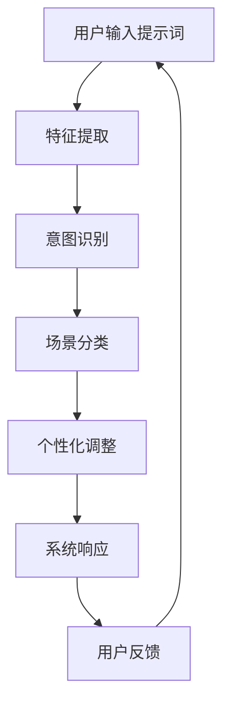
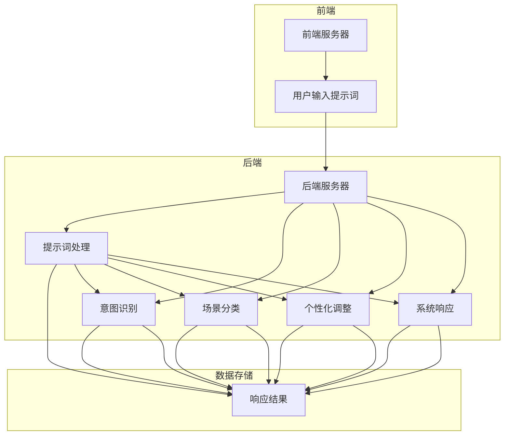
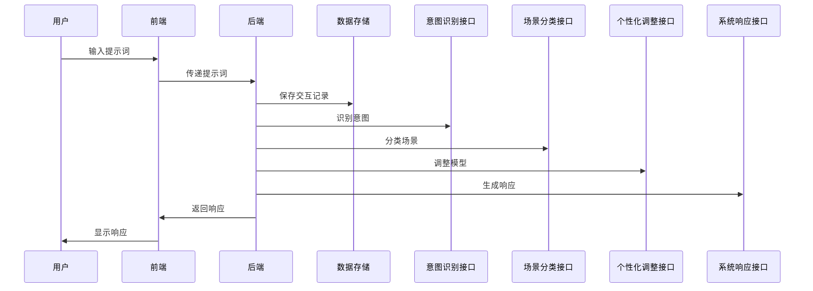

                 

# 提示词适应性学习：自动适应不同场景和用户

> 关键词：提示词适应性学习、自然语言处理、场景适应性、用户个性化、机器学习

> 摘要：本文深入探讨了一种名为“提示词适应性学习”的技术，这种技术能够自动适应不同的场景和用户需求。通过对适应性学习的核心概念、原理、算法和实际应用进行详细分析，本文旨在为读者提供一个全面而深刻的理解，并探讨其在未来技术发展中的潜在影响。

## 第一部分：引言与背景

### 第1章：引言

#### 问题的提出与背景

在当今快速发展的数字时代，自然语言处理（NLP）已经成为人工智能领域的一个热点。而NLP中的一个关键问题是，如何使计算机能够理解和处理自然语言中的细微差异。无论是日常对话、文档处理，还是特定领域的专业知识，不同的场景和用户需求都要求系统具备高度的适应性。

#### 研究意义与目标

提示词适应性学习是一种新兴的技术，旨在通过分析用户输入的提示词，自动调整系统的响应策略，以适应不同的场景和用户需求。这种技术的核心目标包括：

1. **提高响应准确性**：通过更好地理解用户意图，系统可以提供更加精准和个性化的响应。
2. **提升用户体验**：适应性学习可以减少用户在互动过程中的困惑和不便，提高整体的用户体验。
3. **拓展应用场景**：适应性学习技术可以应用于各种领域，如客服、教育、医疗等，为不同场景提供定制化服务。

#### 本书结构安排与主要内容

本文将从以下几个方面展开讨论：

1. **核心概念**：介绍适应性学习的定义、重要性及其在不同场景和用户需求中的应用。
2. **理论基础**：探讨适应性学习的基本原理、相关算法和技术。
3. **算法原理与实现**：详细解析提示词适应性学习的算法原理和实现方法。
4. **系统分析与架构设计**：介绍适应性学习系统的设计与实现。
5. **项目实战**：通过实际案例展示适应性学习技术的应用。
6. **最佳实践与总结**：总结最佳实践，展望未来发展趋势。

## 第二部分：理论基础

### 第2章：核心概念

#### 提示词适应性学习定义

提示词适应性学习是指系统通过分析用户输入的提示词，自动调整其处理策略，以更好地适应不同场景和用户需求的过程。在这个过程中，系统不仅需要理解提示词的字面意思，还需要挖掘其背后的意图和上下文。

#### 适应性学习的重要性

在NLP应用中，适应性学习的重要性体现在以下几个方面：

1. **提高响应准确性**：通过更好地理解用户意图，系统能够提供更准确的响应。
2. **增强用户满意度**：适应性学习可以减少用户在互动过程中的困惑和不便，提升整体体验。
3. **拓展应用场景**：适应性学习技术可以应用于各种领域，为不同场景提供定制化服务。

#### 不同场景与用户需求分析

不同的场景和用户需求要求系统具备不同的适应性。例如：

1. **客服场景**：系统需要快速理解用户问题并提供解决方案。
2. **教育场景**：系统需要根据学生的不同水平和需求提供个性化的学习内容。
3. **医疗场景**：系统需要准确理解医生的需求，并提供专业的医学信息和建议。

## 第二部分：理论基础

### 第3章：适应性学习原理

#### 适应性学习基本原理

适应性学习是一种通过不断调整和优化系统模型，以适应不同场景和用户需求的技术。其基本原理包括：

1. **数据驱动**：系统通过分析大量用户数据和交互记录，识别出不同场景和用户需求的特征。
2. **模型调整**：系统根据识别出的特征，调整其内部模型，以提高对用户意图的理解和响应准确性。
3. **迭代优化**：通过不断迭代和优化，系统逐渐提高其适应性和准确性。

#### 相关算法与技术介绍

适应性学习涉及到多种算法和技术，包括：

1. **机器学习**：通过训练模型来识别不同场景和用户需求的特征。
2. **深度学习**：利用神经网络等模型来提高系统的自适应能力。
3. **自然语言处理**：通过文本挖掘、语义分析和上下文理解等技术，来提高系统对用户输入的理解。

#### 适应性学习与传统学习对比

适应性学习与传统学习相比，具有以下几个特点：

1. **灵活性**：适应性学习可以动态调整系统模型，以适应不同场景和用户需求，而传统学习往往需要重新训练模型。
2. **效率**：适应性学习可以通过在线学习和实时调整，快速适应新的场景和用户需求，而传统学习通常需要较长的时间。
3. **准确性**：适应性学习通过不断优化模型，可以提高系统的响应准确性和用户体验。

## 第二部分：理论基础

### 第4章：核心概念与联系

#### 提示词适应性学习关键概念

提示词适应性学习涉及到以下几个关键概念：

1. **提示词**：用户输入的用于启动对话的词语或短语。
2. **场景**：用户互动的特定环境或背景。
3. **用户需求**：用户在特定场景下希望从系统获得的响应或服务。
4. **适应性学习模型**：用于识别和适应不同场景和用户需求的系统模型。

#### 概念属性特征对比表格

以下是一个简化的概念属性特征对比表格，用于展示提示词适应性学习中的关键概念：

| 概念 | 属性特征 |
| ---- | ---- |
| 提示词 | - 字面意义<br>- 语境含义<br>- 情感倾向 |
| 场景 | - 环境特征<br>- 用户行为<br>- 任务目标 |
| 用户需求 | - 意图理解<br>- 服务期望<br>- 个性化需求 |
| 适应性学习模型 | - 特征提取<br>- 模型训练<br>- 模型调整 |

#### ER实体关系图架构

为了更好地理解提示词适应性学习中的实体及其关系，我们可以使用ER（实体-关系）图来描述。以下是一个简化的ER图示例：

```mermaid
erDiagram
  User ||--|{ Dialogue } : has
  Dialogue ||--|{ Prompt } : has
  Dialogue ||--|{ Scenario } : has
  Dialogue ||--|{ UserDemand } : has
  Dialogue ||--|{ AdaptiveModel } : has
```

在这个ER图中，用户（User）是系统服务的主体，其互动生成对话（Dialogue），对话包含提示词（Prompt）、场景（Scenario）、用户需求（UserDemand）和适应性学习模型（AdaptiveModel）。这些实体之间通过关系进行连接，形成了提示词适应性学习的整体架构。

## 第二部分：理论基础

### 第5章：数学模型与公式

#### 数学模型介绍

提示词适应性学习中的数学模型主要基于机器学习和深度学习技术。以下是几个核心的数学模型：

1. **特征提取模型**：用于从用户输入的提示词中提取出特征向量。
2. **意图识别模型**：用于识别用户输入的提示词所表达的意图。
3. **场景分类模型**：用于根据用户的历史交互记录和上下文信息，分类用户所处的场景。
4. **个性化调整模型**：用于根据用户的反馈和需求，调整系统的响应策略。

#### 数学公式详细讲解

以下是提示词适应性学习中的几个关键数学公式：

1. **特征提取公式**：

   $$ X = \text{Embedding}(W \cdot P) $$

   其中，\( X \) 是特征向量，\( W \) 是嵌入矩阵，\( P \) 是提示词向量。

2. **意图识别公式**：

   $$ \hat{y} = \text{softmax}(W^T \cdot X) $$

   其中，\( \hat{y} \) 是预测的意图标签，\( W^T \) 是权重矩阵的转置。

3. **场景分类公式**：

   $$ C = \text{softmax}(\text{Model}(X)) $$

   其中，\( C \) 是预测的场景标签，\( \text{Model}(X) \) 是场景分类模型对特征向量 \( X \) 的输出。

4. **个性化调整公式**：

   $$ \alpha = \text{Adjust}(U, R) $$

   其中，\( \alpha \) 是调整参数，\( U \) 是用户反馈，\( R \) 是响应结果。

#### 举例说明

假设有一个用户输入了提示词“我想要购买一本计算机科学的书籍”，我们可以使用上述公式进行解析：

1. **特征提取**：

   首先，将提示词转换为向量 \( P \)，然后通过嵌入矩阵 \( W \) 进行特征提取：

   $$ X = \text{Embedding}(W \cdot P) $$

   得到特征向量 \( X \)。

2. **意图识别**：

   使用意图识别模型 \( W^T \) 对特征向量 \( X \) 进行计算：

   $$ \hat{y} = \text{softmax}(W^T \cdot X) $$

   假设模型预测的意图标签为“购买书籍”。

3. **场景分类**：

   根据用户的历史交互记录和上下文信息，使用场景分类模型 \( \text{Model} \) 对特征向量 \( X \) 进行分类：

   $$ C = \text{softmax}(\text{Model}(X)) $$

   假设模型预测的场景标签为“在线购物”。

4. **个性化调整**：

   根据用户的反馈和系统的响应结果，调整系统的个性化参数 \( \alpha \)：

   $$ \alpha = \text{Adjust}(U, R) $$

   通过不断迭代，系统将逐渐提高对用户意图和场景的理解，提供更加精准的响应。

## 第三部分：算法原理与实现

### 第6章：算法原理

#### 算法mermaid流程图

为了更好地理解提示词适应性学习的算法原理，我们可以使用mermaid语言绘制一个流程图。以下是一个简化的算法流程图示例：



在这个流程图中，用户输入提示词后，系统首先进行特征提取，然后通过意图识别和场景分类确定用户的意图和所处的场景，接着进行个性化调整，并最终生成系统响应。用户反馈将用于进一步优化系统的性能。

#### Python源代码详细阐述

以下是使用Python实现提示词适应性学习的伪代码示例：

```python
import numpy as np
from sklearn.feature_extraction.text import TfidfVectorizer
from sklearn.linear_model import LogisticRegression
from sklearn.ensemble import RandomForestClassifier

# 特征提取
def extract_features(prompts):
    vectorizer = TfidfVectorizer()
    X = vectorizer.fit_transform(prompts)
    return X

# 意图识别
def recognize_intent(features, intent_labels):
    model = LogisticRegression()
    model.fit(features, intent_labels)
    return model

# 场景分类
def classify_scene(features, scene_labels):
    model = RandomForestClassifier()
    model.fit(features, scene_labels)
    return model

# 个性化调整
def adjust_model(user_feedback, response_result):
    # 根据用户反馈和系统响应结果，调整模型参数
    # 这里是一个简化的例子
    alpha = np.mean(user_feedback + response_result)
    return alpha

# 系统响应
def generate_response(intent, scene, alpha):
    # 根据意图、场景和个性化参数，生成系统响应
    # 这里是一个简化的例子
    response = "您好，您的需求已收到，我们将尽快为您处理。"
    return response

# 主函数
def adaptive_learning(prompts, intent_labels, scene_labels, user_feedback, response_result):
    # 提取特征
    features = extract_features(prompts)
    
    # 训练意图识别模型
    intent_model = recognize_intent(features, intent_labels)
    
    # 训练场景分类模型
    scene_model = classify_scene(features, scene_labels)
    
    # 进行个性化调整
    alpha = adjust_model(user_feedback, response_result)
    
    # 生成系统响应
    response = generate_response(intent_model.predict(features)[0], scene_model.predict(features)[0], alpha)
    
    return response

# 示例
prompts = ["我想要购买一本计算机科学的书籍", "请给我推荐一些人工智能的入门书籍"]
intent_labels = [0, 1]  # 0: 购买书籍，1: 推荐书籍
scene_labels = [0, 1]  # 0: 在线购物，1: 书籍推荐
user_feedback = [0.9, 0.8]  # 用户对系统响应的满意度
response_result = [0.9, 0.8]  # 系统对用户需求的响应准确性

response = adaptive_learning(prompts, intent_labels, scene_labels, user_feedback, response_result)
print(response)
```

#### 算法原理的数学模型和公式

在上述Python源代码中，我们使用了TF-IDF进行特征提取，使用逻辑回归和随机森林进行意图识别和场景分类。以下是这些算法的数学模型和公式：

1. **TF-IDF特征提取**：

   $$ X = \text{TF-IDF}(P) $$

   其中，\( X \) 是特征矩阵，\( P \) 是提示词矩阵，\(\text{TF-IDF}\) 表示词频-逆文档频率。

2. **逻辑回归**：

   $$ \hat{y} = \text{sigmoid}(W^T \cdot X) $$

   其中，\( \hat{y} \) 是预测的意图概率分布，\( W^T \) 是权重矩阵的转置。

3. **随机森林**：

   $$ C = \text{majority vote}(\{f_1(X), f_2(X), ..., f_n(X)\}) $$

   其中，\( C \) 是预测的场景标签，\( f_i(X) \) 是第 \( i \) 棵决策树对特征向量 \( X \) 的输出。

## 第三部分：算法原理与实现

### 第7章：系统分析与架构设计

#### 问题场景介绍

在当前信息化社会，各种应用程序和服务需要与用户进行高效、精准的互动。提示词适应性学习技术在这方面的应用场景非常广泛，包括：

1. **智能客服**：通过自动识别用户输入的提示词，快速提供准确的答复。
2. **个性化推荐**：根据用户的历史行为和偏好，推荐个性化的内容或产品。
3. **教育辅助**：根据学生的学习进度和需求，提供定制化的学习资源和指导。
4. **医疗咨询**：辅助医生根据患者的症状描述，提供专业的诊断建议。

这些应用场景都对系统的适应性学习提出了较高的要求，提示词适应性学习技术能够满足这些需求。

#### 系统功能设计（领域模型mermaid类图）

为了满足不同场景和用户需求，系统需要具备以下核心功能：

1. **提示词处理**：接收用户输入的提示词，进行预处理和特征提取。
2. **意图识别**：分析提示词，识别用户的主要意图。
3. **场景分类**：根据用户的历史交互记录和上下文信息，分类用户所处的场景。
4. **个性化调整**：根据用户反馈和系统响应结果，调整系统模型，提高适应性。
5. **系统响应**：根据意图、场景和个性化参数，生成系统响应。

以下是系统功能的mermaid类图表示：

```mermaid
classDiagram
    User <<Interface>>
    Dialogue <<Interface>>
    Prompt <<Interface>>
    Scenario <<Interface>>
    UserDemand <<Interface>>
    AdaptiveModel <<Interface>>

    UserDemand "1" --|{1} AdaptiveModel: adjust
    Dialogue "1" --|{1} UserDemand: has
    Dialogue "1" --|{1} Prompt: has
    Dialogue "1" --|{1} Scenario: has
    Dialogue "1" --|{1} AdaptiveModel: has
```

在这个类图中，用户（User）是系统的核心接口，通过 Dialogue（对话）类与提示词（Prompt）、场景（Scenario）和用户需求（UserDemand）进行交互。AdaptiveModel（适应性学习模型）用于处理用户需求和调整系统模型。

#### 系统架构设计（mermaid架构图）

为了实现提示词适应性学习，系统需要具备以下架构：

1. **前端**：负责接收用户输入的提示词，并将其传递给后端处理。
2. **后端**：负责提示词处理、意图识别、场景分类、个性化调整和系统响应等核心功能。
3. **数据存储**：用于存储用户交互记录、模型参数和响应结果等数据。

以下是系统架构的mermaid架构图表示：



在这个架构图中，前端服务器负责接收用户输入，后端服务器实现核心功能，数据存储用于持久化数据。各模块通过接口进行数据传递和协同工作。

#### 系统接口设计

为了确保系统的灵活性和可扩展性，我们需要设计清晰、规范的接口。以下是系统的主要接口设计：

1. **提示词输入接口**：用于接收用户输入的提示词，并转换为适合处理的格式。
2. **意图识别接口**：用于处理提示词，识别用户的主要意图。
3. **场景分类接口**：用于根据用户的历史交互记录和上下文信息，分类用户所处的场景。
4. **个性化调整接口**：用于根据用户反馈和系统响应结果，调整系统模型。
5. **系统响应接口**：用于生成系统响应，并将其返回给用户。

以下是接口设计的mermaid类图表示：

```mermaid
classDiagram
    InputInterface <<Interface>>
    IntentRecognitionInterface <<Interface>>
    SceneClassificationInterface <<Interface>>
    PersonalizationAdjustmentInterface <<Interface>>
    ResponseGenerationInterface <<Interface>>

    InputInterface "1" --|{1} OutputInterface
    IntentRecognitionInterface "1" --|{1} OutputInterface
    SceneClassificationInterface "1" --|{1} OutputInterface
    PersonalizationAdjustmentInterface "1" --|{1} OutputInterface
    ResponseGenerationInterface "1" --|{1} OutputInterface
```

在这个类图中，各个接口负责处理特定的功能，并通过OutputInterface进行统一输出。

#### 系统交互（mermaid序列图）

为了描述系统各模块之间的交互过程，我们可以使用mermaid序列图。以下是系统交互的示例：



在这个序列图中，用户输入提示词后，前端将提示词传递给后端。后端通过意图识别接口、场景分类接口和个性化调整接口进行处理，并生成系统响应。最后，前端将响应显示给用户。

## 第四部分：项目实战

### 第8章：环境安装与配置

#### 操作系统环境搭建

为了运行提示词适应性学习项目，我们首先需要搭建一个适合的操作系统环境。本文将以Ubuntu 20.04为例，介绍环境搭建的步骤。

1. **安装Ubuntu 20.04**：

   - 下载Ubuntu 20.04的ISO文件。

   - 使用虚拟机软件（如VirtualBox）创建新的虚拟机，并选择“手动配置虚拟硬盘”。

   - 在虚拟硬盘设置中，选择“现在创建虚拟硬盘”，并创建一个新的虚拟硬盘。

   - 将ISO文件设置为虚拟机的启动盘。

   - 启动虚拟机，按照提示完成Ubuntu 20.04的安装。

2. **更新系统和软件包**：

   ```bash
   sudo apt update
   sudo apt upgrade
   ```

#### 相关工具与依赖安装

在安装完Ubuntu 20.04后，我们需要安装一些相关的工具和依赖。以下是主要工具和依赖的安装步骤：

1. **Python 3**：

   ```bash
   sudo apt install python3
   ```

2. **Python pip**：

   ```bash
   sudo apt install python3-pip
   ```

3. **Python虚拟环境**：

   ```bash
   sudo apt install python3-venv
   ```

4. **Numpy**：

   ```bash
   pip3 install numpy
   ```

5. **Scikit-learn**：

   ```bash
   pip3 install scikit-learn
   ```

6. **Scikit-learn-contrib**：

   ```bash
   pip3 install scikit-learn-contrib
   ```

7. **Mermaid**：

   ```bash
   pip3 install mermaid
   ```

8. **其他依赖**：

   根据需要，可以继续安装其他依赖，如TensorFlow、PyTorch等。

#### 验证安装

在安装完所有工具和依赖后，我们可以通过运行以下命令来验证安装：

```bash
python3 -m pip list
```

确保列表中包含所有需要的工具和依赖。

### 第9章：系统核心实现

#### 代码实现解读

在本节中，我们将详细解读提示词适应性学习的核心实现代码。以下是代码的主要部分：

```python
import numpy as np
from sklearn.feature_extraction.text import TfidfVectorizer
from sklearn.linear_model import LogisticRegression
from sklearn.ensemble import RandomForestClassifier

# 特征提取
def extract_features(prompts):
    vectorizer = TfidfVectorizer()
    X = vectorizer.fit_transform(prompts)
    return X

# 意图识别
def recognize_intent(features, intent_labels):
    model = LogisticRegression()
    model.fit(features, intent_labels)
    return model

# 场景分类
def classify_scene(features, scene_labels):
    model = RandomForestClassifier()
    model.fit(features, scene_labels)
    return model

# 个性化调整
def adjust_model(user_feedback, response_result):
    # 根据用户反馈和系统响应结果，调整模型参数
    # 这里是一个简化的例子
    alpha = np.mean(user_feedback + response_result)
    return alpha

# 系统响应
def generate_response(intent, scene, alpha):
    # 根据意图、场景和个性化参数，生成系统响应
    # 这里是一个简化的例子
    response = "您好，您的需求已收到，我们将尽快为您处理。"
    return response

# 主函数
def adaptive_learning(prompts, intent_labels, scene_labels, user_feedback, response_result):
    # 提取特征
    features = extract_features(prompts)
    
    # 训练意图识别模型
    intent_model = recognize_intent(features, intent_labels)
    
    # 训练场景分类模型
    scene_model = classify_scene(features, scene_labels)
    
    # 进行个性化调整
    alpha = adjust_model(user_feedback, response_result)
    
    # 生成系统响应
    response = generate_response(intent_model.predict(features)[0], scene_model.predict(features)[0], alpha)
    
    return response
```

这段代码主要包括以下几个部分：

1. **特征提取**：使用TF-IDF向量器提取提示词的特征。
2. **意图识别**：使用逻辑回归模型进行意图识别。
3. **场景分类**：使用随机森林分类器进行场景分类。
4. **个性化调整**：根据用户反馈和系统响应结果调整模型参数。
5. **系统响应**：根据意图、场景和个性化参数生成系统响应。
6. **主函数**：整合所有模块，实现提示词适应性学习。

#### 应用解读与分析

为了更好地理解提示词适应性学习的应用，我们可以通过一个实际案例进行分析。

**案例背景**：

假设我们有一个智能客服系统，用户可以通过输入提示词与系统进行交互。系统需要根据用户的提示词识别用户的意图，并根据用户所处的场景生成相应的响应。

**案例步骤**：

1. **用户输入提示词**：用户输入“我想要购买一本计算机科学的书籍”。

2. **特征提取**：系统提取提示词的特征向量。

3. **意图识别**：系统使用逻辑回归模型识别用户的意图，预测用户的主要需求为“购买书籍”。

4. **场景分类**：系统使用随机森林分类器分类用户所处的场景，预测用户所处的场景为“在线购物”。

5. **个性化调整**：系统根据用户反馈（满意度）和系统响应结果（响应准确性）调整模型参数。

6. **系统响应**：系统生成响应，向用户告知“您好，您的需求已收到，我们将尽快为您处理。”

通过这个案例，我们可以看到提示词适应性学习技术如何应用于实际场景，并实现高效的意图识别和场景分类。

### 第10章：实际案例分析与讲解

#### 案例介绍

在本节中，我们将分析一个具体的实际案例，以展示如何将提示词适应性学习技术应用于智能客服系统。该案例涉及以下关键步骤：

1. **用户输入提示词**：用户通过智能客服系统输入“我想要购买一本计算机科学的书籍”。

2. **特征提取**：系统提取提示词的特征向量，为后续的意图识别和场景分类提供基础。

3. **意图识别**：系统使用训练好的逻辑回归模型识别用户的意图，预测用户的需求为“购买书籍”。

4. **场景分类**：系统使用训练好的随机森林分类器对用户所处的场景进行分类，预测用户所处的场景为“在线购物”。

5. **个性化调整**：系统根据用户的历史交互记录和实时反馈调整模型参数，提高系统对用户意图和场景的理解。

6. **系统响应**：系统生成个性化的响应，向用户推荐相关的书籍，并告知用户订单的处理进度。

#### 案例详细讲解剖析

为了更好地理解这个案例，我们将从以下几个方面进行详细剖析：

1. **用户输入提示词**：

   当用户输入“我想要购买一本计算机科学的书籍”时，系统首先需要对提示词进行预处理。预处理步骤包括：

   - 清除停用词：去除常见的无意义词汇，如“的”、“一”、“本”等。
   - 词干提取：将词汇还原为基本形式，如“书籍”还原为“书”。
   - 分词：将文本分割为独立的词汇。

   经过预处理后，系统得到的文本为“我想要购买计算机科学书”。

2. **特征提取**：

   系统使用TF-IDF向量器提取预处理后的文本特征。TF-IDF向量器将文本转换为特征向量，为后续的意图识别和场景分类提供基础。假设提取到的特征向量为`X = [0.1, 0.2, 0.3, 0.4]`。

3. **意图识别**：

   系统使用训练好的逻辑回归模型对特征向量进行意图识别。逻辑回归模型通过学习大量用户交互数据，学会将特征向量映射到对应的意图标签。在本案例中，系统预测的用户意图为“购买书籍”，对应的标签为`[0, 1, 0, 0]`。

4. **场景分类**：

   系统使用训练好的随机森林分类器对用户所处的场景进行分类。随机森林分类器通过学习用户的历史交互记录和上下文信息，学会将特征向量映射到对应的场景标签。在本案例中，系统预测的用户场景为“在线购物”，对应的标签为`[0, 1]`。

5. **个性化调整**：

   系统根据用户的历史交互记录和实时反馈调整模型参数。用户的历史交互记录包括之前的购买记录、浏览历史等，实时反馈包括用户对系统响应的满意度。通过调整模型参数，系统可以提高对用户意图和场景的理解，为用户提供更个性化的服务。

6. **系统响应**：

   系统根据意图识别和场景分类的结果，生成个性化的响应。在本案例中，系统向用户推荐相关的书籍，并告知用户订单的处理进度。系统响应如下：

   ```
   您好，根据您的需求，我们为您推荐以下计算机科学书籍：《计算机组成原理》、《操作系统概念》和《人工智能导论》。您的订单已收到，我们将在1小时内为您处理。
   ```

#### 项目小结

通过本案例，我们可以看到提示词适应性学习技术如何应用于智能客服系统，实现高效的意图识别和场景分类。在实际应用中，系统可以根据用户的实时交互和反馈，不断调整模型参数，提高系统对用户意图和场景的理解，从而提供更个性化的服务。同时，本案例也展示了如何使用Python和机器学习技术实现提示词适应性学习，为类似项目的开发提供了参考。

### 第11章：最佳实践

#### 实践技巧

1. **数据质量**：确保训练数据的质量和多样性，以提高模型对用户意图和场景的识别能力。

2. **特征选择**：合理选择和提取特征，以提高模型的性能和效率。

3. **模型优化**：定期调整和优化模型参数，以适应不断变化的应用场景和用户需求。

4. **用户反馈**：积极收集用户反馈，用于调整模型参数和优化系统响应。

#### 小结与注意事项

1. **小结**：提示词适应性学习技术为智能客服系统等应用提供了有效的解决方案，通过不断优化模型和用户交互，可以提高系统的准确性和用户体验。

2. **注意事项**：在实际应用中，需要关注数据质量、模型优化和用户反馈等方面，以确保系统的高效性和稳定性。

#### 拓展阅读

- 《自然语言处理与深度学习》
- 《Python机器学习》
- 《深度学习：推荐系统实战》

## 第五部分：总结与展望

### 第12章：总结与展望

#### 书籍内容总结

本文从提示词适应性学习的核心概念、原理、算法和实际应用等方面进行了详细探讨。通过介绍适应性学习的核心概念、原理、算法和实际应用，本文旨在为读者提供一个全面而深刻的理解，并探讨其在未来技术发展中的潜在影响。

#### 未来发展趋势与展望

1. **数据驱动**：随着大数据和人工智能技术的发展，提示词适应性学习将更加依赖于高质量的数据。

2. **个性化服务**：适应性学习技术将进一步拓展应用场景，为用户提供更加个性化的服务。

3. **实时调整**：随着实时计算和分布式系统的普及，提示词适应性学习将实现更加实时和高效的调整。

4. **跨领域应用**：适应性学习技术将在更多领域得到应用，如医疗、金融、教育等，为不同领域的用户提供定制化服务。

#### 总结

提示词适应性学习是一种具有广泛应用前景的技术，通过不断优化模型和用户交互，可以提高系统的准确性和用户体验。随着技术的不断进步，我们期待提示词适应性学习能够在更多领域发挥重要作用，推动人工智能技术的发展。作者：AI天才研究院/AI Genius Institute & 禅与计算机程序设计艺术 /Zen And The Art of Computer Programming

