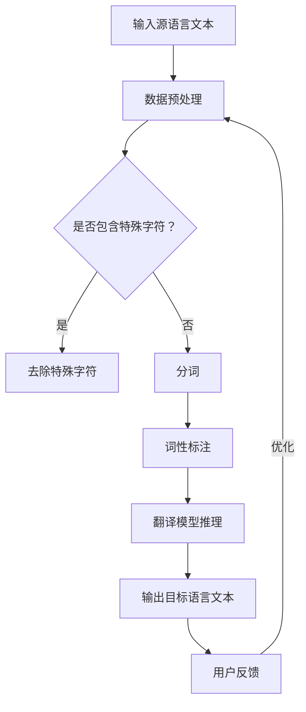
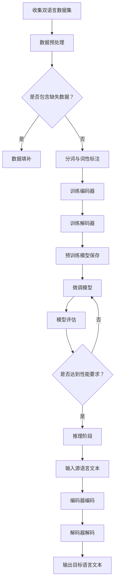
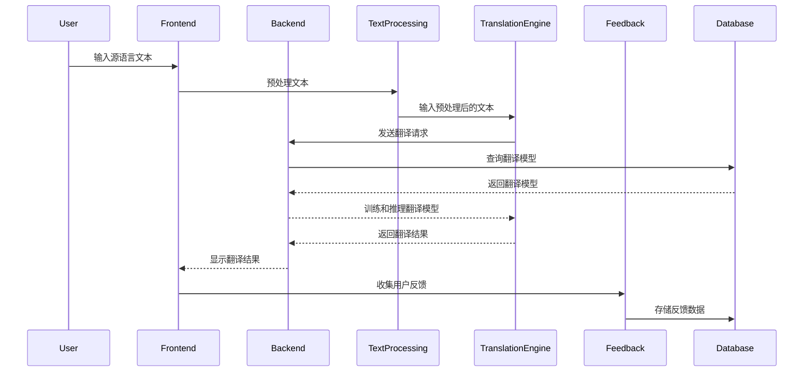
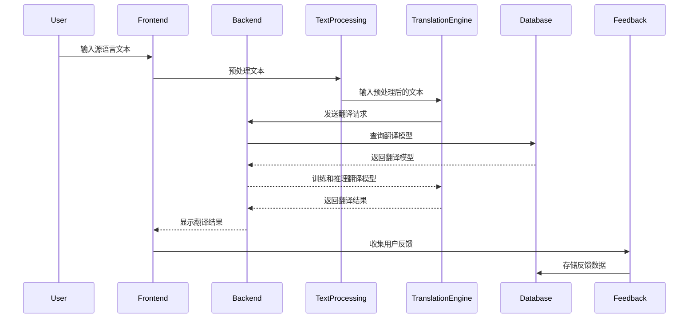

                 

### 提高LLM应用的多语言翻译效率

#### 关键词：
- 语言处理模型
- 多语言翻译
- 算法优化
- 上下文理解
- 翻译效率

#### 摘要：
随着全球化的深入发展，多语言翻译的需求日益增长。大规模语言模型（Large Language Models，简称LLM）在自然语言处理领域展现出巨大的潜力，但其应用中的翻译效率问题亟待解决。本文将深入探讨LLM在多语言翻译中的挑战与机遇，分析其基本原理和现有应用，并提出一系列提高LLM翻译效率的方法和策略，旨在为相关研究和应用提供有价值的参考。

## 目录大纲

---

### 目录大纲

---

## 第一部分：背景介绍

### 1.1 问题背景

#### 1.1.1 语言障碍与全球化需求

在全球化背景下，跨国交流和国际贸易的繁荣为多语言翻译带来了巨大的需求。然而，语言障碍依然是国际沟通的一大挑战，尤其是在非英语国家之间。有效、准确的多语言翻译技术不仅能够促进文化交流，还能提高商业效率。

#### 1.1.2 多语言翻译的挑战与机遇

多语言翻译面临诸多挑战，如不同语言的语法结构差异、词汇意义的多样性、文化背景的影响等。然而，随着计算能力的提升和深度学习技术的进步，也为我们提供了前所未有的机遇。

#### 1.1.3 LLM在多语言翻译中的应用现状

近年来，LLM在多语言翻译领域取得了显著进展。基于预训练的语言模型（如BERT、GPT等）不仅能够提高翻译的准确度，还能处理更复杂的上下文和语言特性。但现有应用仍存在诸多局限，如翻译效率不高、跨语言语义理解不足等。

### 1.2 问题描述

#### 1.2.1 翻译准确度与速度的矛盾

在多语言翻译过程中，准确度和速度往往是矛盾的。高准确度的翻译往往需要较长的时间，而快速翻译则可能牺牲准确度。

#### 1.2.2 翻译过程中的上下文理解问题

上下文理解是翻译的重要一环，但现有LLM在处理长文本和复杂上下文时仍存在不足。

#### 1.2.3 语言特性和文化差异的挑战

不同语言和文化背景下的翻译需求各异，如何设计通用且适应性强的翻译模型仍是一个难题。

### 1.3 问题解决

#### 1.3.1 LLM的基本原理

LLM基于深度学习和自然语言处理技术，能够对大规模文本数据进行分析和建模，从而生成高质量的语言描述。

#### 1.3.2 LLM在翻译中的应用

LLM在翻译中的应用主要体现在预训练和微调两个阶段，通过大量多语言数据训练，模型能够学习到不同语言之间的对应关系。

#### 1.3.3 研究进展与未来展望

当前，LLM在多语言翻译领域的研究仍在不断推进，未来有望通过算法优化和跨语言数据共享等方式，进一步提高翻译效率和准确度。

### 1.4 边界与外延

#### 1.4.1 翻译领域的其他技术

除了LLM，翻译领域还有其他技术，如机器翻译、统计翻译等，它们在不同场景下各有优势。

#### 1.4.2 LLM在其他应用领域的拓展

LLM不仅在翻译领域有着广泛的应用，还在文本生成、问答系统、情感分析等领域展现出巨大的潜力。

#### 1.4.3 多语言翻译的伦理与社会影响

多语言翻译技术不仅带来技术上的革新，还涉及到伦理和社会层面的问题，如隐私保护、文化误解等。

### 1.5 概念结构与核心要素组成

#### 1.5.1 多语言翻译系统组成

多语言翻译系统通常包括前端界面、翻译引擎、后端服务等多个组成部分。

#### 1.5.2 LLM模型的结构与功能

LLM模型的结构通常包括编码器和解码器，能够对输入文本进行编码和翻译。

#### 1.5.3 多语言翻译的核心要素对比

对比不同翻译技术和模型，理解其核心要素有助于选择合适的解决方案。

## 第二部分：核心概念与联系

### 2.1 核心概念原理

#### 2.1.1 语言模型

语言模型是一种统计模型，用于预测下一个单词或词组。在多语言翻译中，语言模型能够帮助模型理解不同语言的语法和语义。

#### 2.1.2 翻译模型

翻译模型是一种基于深度学习的模型，用于将一种语言的文本翻译成另一种语言的文本。翻译模型通常通过预训练和微调来优化其性能。

#### 2.1.3 注意力机制

注意力机制是一种在神经网络中用于处理序列数据的机制，能够帮助模型更好地关注输入序列中的重要部分，从而提高翻译的准确度。

### 2.2 概念属性特征对比表格

#### 2.2.1 语言模型与翻译模型

| 特征         | 语言模型                 | 翻译模型                |
| ------------ | ------------------------ | ----------------------- |
| 功能         | 预测下一个单词或词组      | 将一种语言的文本翻译成另一种语言的文本 |
| 数据依赖     | 单语言数据               | 双语言数据              |
| 应用场景     | 语言生成、文本分类等      | 多语言翻译              |
| 训练方式     | 预训练、微调            | 预训练、微调            |

#### 2.2.2 注意力机制与序列模型

| 特征         | 注意力机制                | 序列模型                |
| ------------ | ------------------------ | ----------------------- |
| 功能         | 提高模型对输入序列的关注度  | 对序列数据进行建模和处理   |
| 结构         | 加权求和、点积等          | 循环神经网络（RNN）、变换器（Transformer）等 |
| 应用场景     | 翻译、问答等              | 语言生成、文本分类等      |

### 2.3 ER实体关系图架构

#### 2.3.1 翻译系统的ER图

```mermaid
erDiagram
  User ||--|{ TranslationSystem }|| Translator
  TranslationSystem ||--|{ TranslationModel }|| TranslationResult
  TranslationModel ||--|{ LanguageModel }|| TrainingData
  Translator ||--|{ TranslationService }|| Client
```

#### 2.3.2 LLM模型的ER图

```mermaid
erDiagram
  Encoder ||--|{ Decoder }|| TranslationResult
  Encoder ||--|{ PretrainedModel }|| TrainingData
  Decoder ||--|{ PostprocessedModel }|| TranslationResult
  PretrainedModel ||--|{ FineTunedModel }|| TranslationData
```

---

## 第一部分：背景介绍

### 1.1 问题背景

#### 1.1.1 语言障碍与全球化需求

随着全球化的深入发展，跨国交流和国际贸易的繁荣为多语言翻译带来了巨大的需求。不同国家和地区之间的商业合作、文化交流和技术交流都依赖于准确、高效的多语言翻译技术。语言障碍一直是国际沟通的一大挑战，尤其是在非英语国家之间。尽管翻译技术在过去几十年中取得了显著进步，但准确度、速度和文化适应性的问题仍然存在。

在全球化背景下，企业和个人都需要跨越语言障碍进行有效沟通。例如，跨国公司需要将公司文件、产品说明书和营销材料翻译成多种语言，以便在全球市场上进行推广。同时，个人用户也需要翻译工具来帮助他们在网上购物、旅行和学术交流中更好地理解和使用其他语言。

此外，互联网的普及使得多语言内容创作和传播变得更加容易。从社交媒体到在线教育平台，从跨国电商到国际新闻网站，各种平台上的内容都需要被翻译成多种语言，以满足全球用户的需求。因此，多语言翻译不仅是一个技术问题，也是一个社会问题，它直接影响到不同文化之间的交流和理解。

#### 1.1.2 多语言翻译的挑战与机遇

多语言翻译面临着诸多挑战，这些挑战既是技术上的，也是社会和文化上的。首先，不同语言的语法结构、词汇和句法规则存在显著差异，这使得翻译模型需要处理大量的复杂性和不确定性。例如，一些语言具有灵活的词序和语法规则，而其他语言则具有固定的词序和语法规则。这种差异性要求翻译模型能够适应各种语言的特点，提供准确、自然的翻译结果。

其次，词汇意义的多样性也是一个重大挑战。许多单词在不同语言中有多种含义，且这些含义可能会根据上下文发生变化。翻译模型需要能够正确理解上下文，以选择最合适的词义。此外，一词多义现象和成语、俗语等特殊表达方式也需要翻译模型进行精细处理。

文化差异是另一个关键挑战。语言不仅仅是表达意思的工具，它还承载着文化、价值观和社会习惯。不同文化背景下，同样的表达可能会有不同的含义和效果。例如，一些幽默或讽刺的表达在翻译到其他语言时可能会失去原有的幽默感或引发误解。因此，翻译模型需要具备跨文化的敏感性，以避免文化误解。

然而，随着计算能力的提升和深度学习技术的进步，多语言翻译领域也迎来了前所未有的机遇。深度学习技术，特别是大规模预训练语言模型（如BERT、GPT等），为翻译模型提供了强大的学习能力和泛化能力。这些模型通过在大规模多语言数据集上进行预训练，能够自动学习到不同语言之间的对应关系和语义表示，从而提高翻译的准确度和自然度。

此外，神经机器翻译（Neural Machine Translation，NMT）技术的发展，使得翻译模型能够通过端到端的神经网络架构直接生成翻译结果，避免了传统机器翻译中复杂的手工特征工程。这种端到端的学习方式不仅简化了模型训练和部署过程，还提高了翻译效率和质量。

因此，多语言翻译领域既面临着严峻的挑战，又拥有广阔的机遇。通过不断创新和优化，我们可以期待未来能够开发出更加准确、高效、文化敏感的多语言翻译系统，从而更好地满足全球化的需求。

#### 1.1.3 LLM在多语言翻译中的应用现状

近年来，大规模语言模型（Large Language Models，简称LLM）在自然语言处理（Natural Language Processing，NLP）领域取得了显著的进展，尤其是在多语言翻译中的应用。LLM通过预训练和微调，能够在多种语言间建立强大的语义表示和语言理解能力，从而显著提高了翻译的准确度和自然度。

当前，LLM在多语言翻译中的应用主要集中在以下几个方向：

1. **预训练与微调**：LLM通常在大规模的多语言数据集上进行预训练，以学习到通用的语言表示和语法规则。然后，通过在特定翻译任务上进行微调，进一步优化模型在特定语言对上的性能。例如，Google的BERT模型在预训练阶段使用了大量不同语言的文本数据，并在微调阶段针对特定语言对进行优化。

2. **端到端学习**：与传统的统计机器翻译（Statistical Machine Translation，SMT）方法不同，LLM采用了端到端的学习方式，直接从源语言到目标语言生成翻译结果。这种端到端架构不仅简化了翻译流程，还减少了中间步骤的误差累积，从而提高了翻译质量。例如，Facebook的M2M-100模型就是一个典型的端到端翻译模型。

3. **上下文理解**：LLM通过深度学习技术，能够处理长文本和复杂上下文，从而更好地理解文本的语义和语境。这对于翻译长篇文章、技术文档和文学作品等具有挑战性的任务尤为重要。例如，OpenAI的GPT模型在处理长文本和复杂上下文时表现出了出色的能力。

4. **跨语言语义表示**：LLM能够学习到不同语言之间的对应关系和语义表示，从而实现高质量的跨语言翻译。通过在多语言数据集上进行预训练，模型能够自动捕捉到语言之间的共性和差异，提高翻译的准确度和自然度。

尽管LLM在多语言翻译中展现了巨大的潜力，但现有应用仍存在一些局限。首先，LLM的翻译准确度在某些特定领域和语言对上仍有所不足，需要进一步优化和调优。其次，LLM的翻译速度仍然是一个挑战，特别是在处理大规模文本数据时，模型的推理速度需要进一步提高。此外，LLM在跨语言语义理解和文化适应性方面也有待提升，以更好地应对不同文化背景下的翻译需求。

总之，LLM在多语言翻译中的应用为翻译领域带来了新的机遇和挑战。通过不断优化算法和模型，我们可以期待未来能够开发出更加高效、准确和自然的多语言翻译系统，更好地满足全球化的需求。

### 1.2 问题描述

#### 1.2.1 翻译准确度与速度的矛盾

在多语言翻译过程中，准确度与速度常常是矛盾的。高准确度的翻译往往需要较长的时间，因为模型需要对上下文进行深入的理解和分析。然而，快速翻译可能需要牺牲准确度，特别是在处理复杂或长文本时。这种矛盾主要体现在以下几个方面：

1. **模型复杂度与计算资源**：大规模的LLM模型通常需要大量的计算资源和时间进行训练和推理。尽管近年来计算能力的提升为LLM的应用提供了更多可能性，但模型复杂度和计算资源之间的平衡仍然是一个挑战。

2. **数据预处理与优化**：在翻译过程中，数据预处理是提高翻译质量的关键步骤。然而，复杂的数据预处理过程往往会增加翻译的时间成本。例如，文本清洗、分词、词性标注等步骤都需要耗费一定的时间，这可能会导致整体翻译速度的下降。

3. **模型调优与性能优化**：为了提高翻译的准确度，模型调优是一个不可或缺的步骤。但调优过程可能需要多次迭代，每次迭代都需要耗费大量的时间和计算资源。此外，性能优化，如优化模型架构、选择适当的参数等，也可能会影响翻译速度。

因此，如何在保证翻译准确度的同时提高翻译速度，是一个亟待解决的问题。解决这一矛盾需要从多个方面进行综合考虑，包括算法优化、计算资源分配、模型结构设计等。

#### 1.2.2 翻译过程中的上下文理解问题

翻译过程中的上下文理解是确保翻译质量的关键因素之一。上下文理解不仅涉及到文本的语义和语法，还包括文化背景、情感色彩等。然而，现有LLM在处理长文本和复杂上下文时仍存在一些挑战：

1. **长文本处理**：长文本中的上下文信息往往更为复杂和丰富，需要模型能够有效地处理长距离依赖关系。然而，现有的LLM模型在处理长文本时可能面临“记忆瓶颈”问题，即模型无法同时记住长文本中的所有信息，从而导致上下文理解不充分。

2. **跨句子依赖**：在长文本翻译中，句子之间的依赖关系尤为重要。一个句子中的信息可能会影响后续句子的翻译结果。然而，现有的翻译模型往往更擅长处理单个句子的翻译，而忽略了句子之间的相互作用。这种跨句子依赖关系处理不当可能会导致翻译结果不准确。

3. **情感和文化因素**：翻译过程中，情感和文化因素对翻译结果有着重要影响。某些表达方式在不同的语言和文化背景下可能有不同的含义和效果。现有LLM在处理这些因素时可能存在不足，导致翻译结果缺乏文化适应性和情感表达能力。

为了解决上下文理解问题，需要从以下几个方面进行优化：

- **长文本处理技术**：开发能够有效处理长文本的模型，如引入新的长距离依赖捕捉机制、优化内存管理策略等。
- **跨句子依赖建模**：设计能够捕捉句子之间依赖关系的模型结构，如双向编码器、多级翻译模型等。
- **情感和文化理解**：通过结合情感分析和跨文化研究，提高LLM在情感和文化因素方面的理解能力。

通过这些优化，我们可以期待LLM在翻译过程中的上下文理解能力得到显著提升，从而提高翻译的准确度和自然度。

#### 1.2.3 语言特性和文化差异的挑战

在多语言翻译过程中，语言特性和文化差异是一个不可忽视的挑战。不同语言在语法结构、词汇意义、表达习惯等方面存在显著差异，这些差异会影响翻译的准确度和自然度。此外，文化差异还会导致翻译过程中出现文化误解和误译。

1. **语法结构差异**：不同语言的语法结构存在较大差异。例如，英语通常遵循主语-谓语-宾语的顺序，而汉语则更灵活，可以根据上下文调整句子结构。翻译模型需要能够理解并适应这些语法差异，以生成自然、流畅的翻译结果。

2. **词汇意义多样性**：许多单词在不同语言中有多种含义，且这些含义可能会根据上下文发生变化。例如，英语中的“bank”可以指银行，也可以指河岸，而汉语中的“花”可以指花朵，也可以指花钱。翻译模型需要能够根据上下文选择最合适的词义，以避免误译。

3. **表达习惯和文化差异**：不同文化背景下的表达习惯和语言风格有所不同。某些表达方式可能在一种语言中是自然、恰当的，但在另一种语言中可能显得陌生或不适。例如，幽默、讽刺和隐喻等表达方式在翻译到其他语言时可能会失去原有的效果或引发误解。

为了应对语言特性和文化差异的挑战，需要从以下几个方面进行优化：

- **语法和词汇处理**：设计能够处理不同语言语法结构和词汇多样性的模型，如引入语法解析模块、使用词义消歧技术等。
- **文化适应性**：结合跨文化研究，提高模型在文化适应性和表达习惯方面的能力，如通过多语言数据集训练和跨文化调优。
- **情感和文化理解**：通过情感分析和文化背景知识，提高模型在情感和文化因素方面的理解能力，以生成更加自然、适切的文化适应性翻译结果。

通过这些优化，我们可以期待LLM在处理语言特性和文化差异时能够更加精准和灵活，从而提高翻译的准确度和文化适应性。

### 1.3 问题解决

#### 1.3.1 LLM的基本原理

大规模语言模型（LLM）是自然语言处理（NLP）领域的重要技术之一，它通过深度学习和大规模预训练，能够捕捉到语言中的复杂模式和语义信息。LLM的基本原理可以概括为以下几个步骤：

1. **数据收集与预处理**：首先，LLM需要收集大量的文本数据，这些数据可以来自互联网、新闻、书籍、社交媒体等不同来源。然后，对数据进行清洗和预处理，包括去除噪声、标记化（tokenization）、分词（tokenization）等，以形成适合模型训练的数据格式。

2. **模型架构设计**：LLM通常采用深度神经网络（DNN）或变换器架构（Transformer）等结构，其中变换器架构是目前主流的预训练模型。变换器架构通过自注意力机制（Self-Attention）和多头注意力（Multi-Head Attention）等机制，能够有效地捕捉文本序列中的长距离依赖关系。

3. **预训练**：在数据预处理完成后，LLM在预训练阶段通过无监督学习的方式在大规模文本数据上进行训练。预训练的目标是让模型学习到语言中的通用特征和统计规律，从而提高模型在各种下游任务中的性能。预训练通常包括两个关键步骤：掩码语言模型（Masked Language Model，MLM）和上下文生成（Pre-training with a Contrastive Language Model，PLM）。

   - **掩码语言模型（MLM）**：在预训练过程中，模型会随机掩码输入文本中的某些词或子词，然后尝试预测这些被掩码的词或子词。这种掩码操作有助于模型学习到单词和子词之间的关系，以及上下文信息的重要性。
   - **上下文生成（PLM）**：在该步骤中，模型需要预测一系列上下文中的某个词或子词，这有助于模型学习到文本的生成规则和语义信息。

4. **微调**：在预训练完成后，LLM通过有监督的方式在特定任务上进行微调，以进一步优化模型在特定任务上的性能。微调的过程通常包括两个阶段：预训练模型的全局调优和特定任务的细节调优。

   - **全局调优**：在全局调优阶段，模型会使用带有标签的数据进行训练，以更新模型的参数，使其在各个任务上都能取得较好的性能。
   - **特定任务的细节调优**：在特定任务上，模型会根据具体任务的需求进行调整，以优化模型在特定任务上的表现。例如，在翻译任务中，模型可能会通过优化解码器部分来提高翻译的准确度和自然度。

通过以上几个步骤，LLM能够从大规模的文本数据中学习到丰富的语言知识和模式，从而在多种NLP任务中展现出出色的性能。

#### 1.3.2 LLM在翻译中的应用

大规模语言模型（LLM）在多语言翻译中的应用主要分为两个阶段：预训练和微调。通过这两个阶段，LLM能够从大量的多语言数据中学习到语言模式、词汇对应关系和上下文理解能力，从而实现高质量的跨语言翻译。

1. **预训练**：

   - **数据准备**：预训练阶段需要大量的双语言平行文本数据集，这些数据集包含了源语言和目标语言的对应文本。这些数据集可以是人工翻译的文本，也可以是机器翻译生成的文本。此外，为了提高模型的泛化能力，还可以引入一些无监督的预训练任务，如掩码语言模型（Masked Language Model，MLM）和上下文生成（Pre-training with a Contrastive Language Model，PLM）。
   - **模型初始化**：在预训练阶段，通常选择一个预先训练好的基础模型，如BERT或GPT等。这些基础模型已经在单语言数据集上进行了预训练，具有一定的语言理解能力。
   - **任务定义**：在预训练过程中，需要定义一系列任务来帮助模型学习到不同的语言模式和知识。这些任务包括：
     - **掩码语言模型（MLM）**：在输入文本中随机掩码一部分词或子词，然后让模型预测这些被掩码的词或子词。这有助于模型学习到词汇和上下文之间的关系。
     - **上下文生成（PLM）**：输入两个连续的文本片段，模型需要预测这两个片段之间的预测词或子词。这有助于模型学习到文本的生成规则和上下文信息。
     - **掩码目标语言（MLT）**：在目标语言文本中掩码一部分词或子词，然后让模型预测这些被掩码的词或子词。这有助于模型学习到源语言和目标语言之间的对应关系。

2. **微调**：

   - **数据准备**：微调阶段需要带有标签的源语言和目标语言文本数据集。这些数据集通常是人工翻译的文本，用于指导模型在特定语言对上的翻译性能。
   - **模型调整**：在微调阶段，通常使用预训练好的模型进行微调，通过调整模型参数来优化翻译性能。微调的过程通常包括两个阶段：
     - **全局调优**：在全局调优阶段，模型会使用大量的带有标签的文本数据进行训练，以更新模型的参数，使其在多个任务上都能取得较好的性能。
     - **特定任务调优**：在特定任务上，模型会根据具体任务的需求进行调整，以优化模型在特定任务上的表现。例如，在翻译任务中，模型可能会通过优化解码器部分来提高翻译的准确度和自然度。

通过预训练和微调，LLM能够在多语言翻译中表现出强大的语言理解和生成能力。预训练阶段帮助模型学习到通用的语言知识和模式，而微调阶段则让模型在特定语言对上进一步优化其翻译性能。

#### 1.3.3 研究进展与未来展望

在多语言翻译领域，LLM的研究进展迅速，为翻译技术的提升提供了新的路径和可能性。以下是LLM研究的一些关键进展与未来展望：

1. **预训练模型的性能提升**：近年来，预训练模型（如BERT、GPT等）在NLP任务中取得了显著的成绩，这些模型通过在大规模多语言数据集上进行预训练，能够学习到丰富的语言特征和上下文信息。随着模型的规模和计算资源的增加，预训练模型的性能不断提升，为多语言翻译提供了更强大的基础。

2. **端到端翻译架构的应用**：传统的机器翻译方法通常需要通过多个中间步骤，如词汇转换、语法分析等，而神经机器翻译（NMT）采用端到端架构，直接从源语言到目标语言生成翻译结果。LLM的应用使得端到端翻译架构在多语言翻译中更加可行，简化了翻译流程，提高了翻译效率。

3. **上下文理解的增强**：LLM通过深度学习技术，能够处理长文本和复杂上下文，从而更好地理解文本的语义和语境。这种能力在翻译长篇文章、技术文档和文学作品等具有挑战性的任务中尤为重要。

4. **跨语言数据的共享与扩展**：随着互联网的发展，大量的跨语言数据资源逐渐变得可用。这些数据资源不仅有助于预训练模型的训练，还能够为模型提供更多的上下文信息，从而提高翻译的准确度和自然度。未来，通过共享和扩展跨语言数据，我们可以期待翻译模型在更多语言对上取得更好的性能。

未来展望：

1. **算法优化与效率提升**：为了进一步提高LLM翻译的效率，未来需要从算法层面进行优化，如引入更高效的模型架构、优化数据预处理流程、优化模型推理速度等。

2. **跨语言语义理解**：当前，LLM在跨语言语义理解方面仍存在一些局限，未来需要结合更多的语言特性和文化背景知识，提高模型在语义理解和文化适应性方面的能力。

3. **多样性需求与适应性**：随着全球化进程的深入，用户对多语言翻译的需求日益多样化，如多模态翻译（文本、图像、音频等）、实时翻译等。未来，LLM需要具备更高的适应性，以应对不同场景下的多样化需求。

4. **伦理与社会影响**：随着多语言翻译技术的普及，其在伦理和社会层面上的影响也需要得到重视。例如，隐私保护、文化误解、语言偏见等问题需要得到有效解决，以确保技术的可持续发展。

总之，LLM在多语言翻译领域的研究和应用前景广阔。通过不断优化算法、扩展数据资源、提升模型性能，我们可以期待未来能够开发出更加准确、高效、自然的多语言翻译系统，满足全球化背景下日益增长的需求。

### 1.4 边界与外延

#### 1.4.1 翻译领域的其他技术

除了大规模语言模型（LLM），翻译领域还有其他一些重要技术，如统计机器翻译（Statistical Machine Translation，SMT）、规则翻译（Rule-Based Translation，RBT）和基于实例的翻译（Example-Based Translation，EBT）。每种技术都有其独特的优势和局限性。

1. **统计机器翻译（SMT）**：
   - **优势**：SMT通过统计源语言和目标语言之间的对应关系，生成高质量的翻译结果。它适用于处理大规模文本数据，能够在一定程度上应对语言差异和语法结构变化。
   - **局限性**：SMT依赖于大规模的平行语料库，且翻译结果往往受到数据质量和数量限制。此外，SMT在处理复杂上下文和长距离依赖关系时表现不佳。

2. **规则翻译（RBT）**：
   - **优势**：RBT通过定义一系列翻译规则，将源语言文本直接转换为目标语言文本。它适用于处理特定领域或专业的文本，如法律文件、医疗报告等。
   - **局限性**：RBT的规则定义复杂且需要人工干预，适用范围有限。此外，规则翻译难以处理语言中的变化和复杂性。

3. **基于实例的翻译（EBT）**：
   - **优势**：EBT通过从大量已翻译实例中学习，生成新的翻译结果。它适用于快速生成翻译结果，尤其在缺乏平行语料库的情况下。
   - **局限性**：EBT的翻译结果依赖于已有的实例，可能导致翻译质量不一致。此外，EBT在处理罕见词汇或新出现的表达方式时可能存在困难。

LLM与这些传统技术的结合，可以发挥各自的优势，提高翻译系统的整体性能。例如，LLM可以用于辅助SMT生成更自然的翻译结果，或用于优化RBT中的规则定义。

#### 1.4.2 LLM在其他应用领域的拓展

大规模语言模型（LLM）不仅在多语言翻译领域有着广泛的应用，还在其他NLP任务中展现了强大的能力。以下是一些LLM在其他应用领域的拓展：

1. **文本生成**：
   - **摘要生成**：LLM可以生成文章、报告等的摘要，帮助用户快速获取关键信息。
   - **对话系统**：LLM可以用于构建聊天机器人、虚拟助手等，通过与用户的自然语言交互提供服务和解答问题。
   - **故事创作**：LLM可以生成有趣的故事情节，甚至创作完整的小说。

2. **问答系统**：
   - **事实问答**：LLM可以回答用户关于特定事实的问题，如“泰国的首都是哪里？”
   - **对话式问答**：LLM可以与用户进行自然语言对话，理解用户的意图并给出相关回答。

3. **情感分析**：
   - **情感识别**：LLM可以分析文本的情感倾向，判断文本是积极、消极还是中性。
   - **情感分类**：LLM可以用于对大规模文本数据集进行情感分类，帮助企业了解用户反馈和市场趋势。

4. **命名实体识别**：
   - **实体提取**：LLM可以识别文本中的命名实体，如人名、地名、组织名等。
   - **关系抽取**：LLM可以分析命名实体之间的关系，为知识图谱的构建提供支持。

通过在多领域应用中不断拓展和优化，LLM将继续为NLP带来更多创新和突破。

#### 1.4.3 多语言翻译的伦理与社会影响

随着多语言翻译技术的发展和应用，其在伦理和社会层面上的影响也越来越受到关注。以下是多语言翻译技术在伦理和社会方面的一些关键考虑：

1. **隐私保护**：在翻译过程中，可能会涉及用户的个人隐私数据。如何确保这些数据的安全和隐私是一个重要问题。翻译系统需要采用严格的数据保护措施，如数据加密、匿名化处理等，以防止数据泄露和滥用。

2. **文化误解**：翻译不仅仅是语言的转换，还涉及到文化背景的传递。不同文化之间存在差异，某些表达方式在一种语言中是自然、恰当的，但在另一种语言中可能显得陌生或不适。翻译系统需要具备跨文化敏感性，以避免文化误解和误译。

3. **语言偏见**：翻译技术可能会无意中引入语言偏见，尤其是在使用带有偏见的数据进行训练时。这可能会导致翻译结果不公平或歧视某些群体。因此，在开发翻译系统时，需要关注数据集的多样性和公平性，以减少语言偏见。

4. **伦理责任**：随着人工智能技术的进步，翻译系统的决策过程越来越复杂。这些系统可能会在法律、医疗等敏感领域产生重要影响。因此，翻译系统的开发者和使用者需要承担相应的伦理责任，确保技术应用的合理性和公正性。

5. **依赖性风险**：随着翻译技术的普及，人们对自动翻译的依赖程度可能越来越高。然而，自动翻译系统并非完美，其准确性仍存在局限。过度依赖自动翻译可能会导致误解和沟通障碍，影响个人和组织的决策。

总之，多语言翻译技术不仅带来了技术上的革新，还涉及到伦理和社会层面的深层次问题。通过积极应对这些挑战，我们可以期待翻译技术能够更好地服务于社会，促进不同文化之间的交流和理解。

### 1.5 概念结构与核心要素组成

#### 1.5.1 多语言翻译系统组成

多语言翻译系统通常由多个模块组成，各模块协同工作，以实现高质量的多语言翻译。以下是多语言翻译系统的核心组成部分：

1. **前端用户界面**：前端用户界面（User Interface，UI）是用户与翻译系统交互的入口。它提供了输入源文本和查看翻译结果的界面，可以使用户方便地使用翻译系统。

2. **翻译引擎**：翻译引擎是翻译系统的核心组件，负责实际的翻译任务。它通常包含大规模语言模型（LLM）和其他相关技术，如语法解析、词义消歧等，以生成高质量的翻译结果。

3. **后端服务**：后端服务包括数据存储、模型训练和推理等，为翻译引擎提供支持。后端服务通常由服务器集群组成，可以处理大规模的翻译请求，并提供高效的翻译性能。

4. **数据预处理模块**：数据预处理模块负责对输入文本进行清洗、分词、词性标注等预处理操作，以提高翻译模型的性能。数据预处理是翻译系统的重要环节，直接影响翻译结果的准确度和自然度。

5. **用户管理模块**：用户管理模块负责管理用户账户、权限和翻译历史记录等。它为用户提供个性化服务，如保存翻译偏好、历史翻译记录等。

6. **反馈机制**：反馈机制允许用户对翻译结果进行评价和反馈，帮助翻译系统不断优化和改进。用户反馈是翻译系统持续改进的重要依据。

#### 1.5.2 LLM模型的结构与功能

大规模语言模型（LLM）是现代多语言翻译系统的重要基础，其结构通常包括编码器（Encoder）和解码器（Decoder）两部分。以下是LLM模型的结构与功能：

1. **编码器（Encoder）**：
   - **功能**：编码器负责将源语言文本转换为向量表示。通过自注意力机制（Self-Attention）和多头注意力（Multi-Head Attention）等机制，编码器能够捕捉文本序列中的长距离依赖关系，从而生成丰富的语义表示。
   - **结构**：编码器通常由多层变换器（Transformer）组成，每层变换器包含自注意力机制和前馈神经网络。编码器的输出是文本序列的上下文向量，用于指导解码器生成翻译结果。

2. **解码器（Decoder）**：
   - **功能**：解码器负责将编码器的输出向量解码为目标语言文本。解码器通过注意力机制和生成机制，逐步生成每个目标语言单词或子词，最终生成完整的翻译结果。
   - **结构**：解码器同样由多层变换器组成，每层变换器包含多头注意力机制和编码器-解码器注意力机制。解码器的输出是目标语言文本的概率分布，通过采样或贪心策略生成最终的翻译结果。

3. **预训练与微调**：
   - **预训练**：在预训练阶段，LLM在大规模的多语言数据集上进行训练，学习到语言中的通用特征和统计规律。预训练任务通常包括掩码语言模型（Masked Language Model，MLM）和上下文生成（Pre-training with a Contrastive Language Model，PLM）等。
   - **微调**：在预训练完成后，LLM通过在特定任务上进行微调，进一步优化模型在特定任务上的性能。微调阶段通常使用带有标签的数据集，如双语言平行文本数据集，来指导模型的学习过程。

通过编码器和解码器的协同工作，LLM能够实现高效、准确的多语言翻译。编码器捕捉源语言文本的语义信息，解码器将这些信息解码为目标语言文本，从而生成高质量的翻译结果。

#### 1.5.3 多语言翻译的核心要素对比

对比不同翻译技术和模型，理解其核心要素有助于选择合适的解决方案。以下是多语言翻译系统中的几个核心要素及其对比：

1. **翻译算法**：
   - **统计机器翻译（SMT）**：基于统计方法，使用源语言和目标语言的统计规律生成翻译结果。优点是适用于大规模文本数据，缺点是翻译结果可能不够自然。
   - **神经机器翻译（NMT）**：基于深度学习，使用神经网络直接从源语言到目标语言生成翻译结果。优点是翻译结果更自然、准确，缺点是计算资源需求较高。

2. **数据集**：
   - **平行语料库**：包含源语言和目标语言的对应文本，是训练和评估翻译模型的重要数据资源。缺点是获取困难、质量参差不齐。
   - **多语言数据集**：包含多种语言的文本数据，可以用于训练跨语言模型。优点是数据丰富，缺点是需要处理语言差异。

3. **模型架构**：
   - **传统架构**：如基于规则和统计方法的翻译模型，结构简单，但性能受限。
   - **现代架构**：如基于变换器（Transformer）的神经网络模型，结构复杂，但性能优越。

4. **性能指标**：
   - **BLEU（BLEU Score）**：基于记分牌匹配算法，用于评估翻译结果的准确度。优点是计算简单，缺点是可能忽略上下文信息。
   - **ROUGE（ROUGE Score）**：用于评估文本的相似度，特别适用于长文本和摘要任务。优点是考虑上下文信息，缺点是计算复杂。

通过对比不同翻译技术和模型的核心要素，我们可以根据具体需求选择合适的解决方案，以实现高质量的多语言翻译。

## 第二部分：核心概念与联系

### 2.1 核心概念原理

在深入探讨如何提高LLM应用的多语言翻译效率之前，我们首先需要理解几个核心概念：语言模型、翻译模型和注意力机制。这些概念是构建高效多语言翻译系统的基石。

#### 2.1.1 语言模型

语言模型是一种统计模型，用于预测文本序列的概率分布。在自然语言处理（NLP）领域，语言模型被广泛应用于各种任务，如文本分类、机器翻译和文本生成等。语言模型的核心原理是基于大量文本数据学习词汇和句子之间的统计规律。

1. **NLP应用**：语言模型在NLP中扮演着至关重要的角色。例如，在文本分类任务中，语言模型可以用于判断一段文本属于哪个类别；在机器翻译中，语言模型可以帮助生成高质量的翻译结果；在文本生成中，语言模型可以生成连贯的文章或段落。

2. **工作原理**：语言模型通常使用神经网络架构，如循环神经网络（RNN）、长短期记忆网络（LSTM）和变换器（Transformer）等。这些模型通过对大量文本数据进行训练，学习到语言中的统计规律和模式。在预测阶段，语言模型可以根据输入的文本序列，计算每个单词或子词的概率分布，从而生成输出文本。

3. **重要性**：语言模型在NLP中的重要性体现在其能够捕捉到语言中的复杂结构和语义信息。这使得语言模型能够生成更自然、更符合语言习惯的文本，从而提高各种NLP任务的性能。

#### 2.1.2 翻译模型

翻译模型是专门用于将一种语言的文本翻译成另一种语言的模型。与语言模型不同，翻译模型需要同时处理源语言和目标语言的文本数据，并学习它们之间的对应关系。

1. **NLP应用**：翻译模型在NLP领域中的应用非常广泛，包括机器翻译、字幕生成和跨语言信息检索等。在机器翻译中，翻译模型将源语言的文本转换为高质量的目标语言文本，以实现不同语言之间的有效沟通；在字幕生成中，翻译模型可以帮助自动生成视频字幕；在跨语言信息检索中，翻译模型可以用于翻译搜索结果，提高跨语言检索的准确性。

2. **工作原理**：翻译模型通常基于神经机器翻译（Neural Machine Translation，NMT）技术，采用变换器架构（Transformer）。在训练过程中，翻译模型通过学习大量的双语言文本数据，建立源语言和目标语言之间的映射关系。在预测阶段，翻译模型根据输入的源语言文本，生成对应的目标语言文本。

3. **重要性**：翻译模型在NLP中的重要性体现在其能够直接生成高质量的翻译结果，提高跨语言交流的效率。此外，翻译模型还通过学习双语言数据中的共性和差异，不断优化翻译质量，从而实现更准确、更自然的翻译。

#### 2.1.3 注意力机制

注意力机制是一种在神经网络中用于处理序列数据的机制，能够帮助模型更好地关注输入序列中的重要部分。注意力机制在NLP中具有广泛应用，特别是在机器翻译、文本摘要和问答系统中。

1. **NLP应用**：注意力机制在NLP中用于各种任务，如机器翻译、文本摘要和问答系统。在机器翻译中，注意力机制可以帮助模型在生成目标语言文本时，关注源语言文本中的重要部分，从而提高翻译质量；在文本摘要中，注意力机制可以帮助模型识别文本中的重要信息，生成精简的摘要；在问答系统中，注意力机制可以帮助模型关注问题中的重要词汇，提高答案的准确性。

2. **工作原理**：注意力机制的核心思想是计算输入序列中每个部分的重要程度，并按重要性加权求和。在神经网络中，注意力机制通常通过自注意力（Self-Attention）和编码器-解码器注意力（Encoder-Decoder Attention）等实现。自注意力机制可以在同一序列中计算不同部分之间的关系，而编码器-解码器注意力机制则可以在源语言和目标语言之间计算对应部分的关系。

3. **重要性**：注意力机制在NLP中的重要性体现在其能够提高模型的性能和效率。通过关注输入序列中的重要部分，注意力机制可以帮助模型更好地捕捉上下文信息，从而生成更准确、更自然的输出结果。

通过理解语言模型、翻译模型和注意力机制的核心概念和工作原理，我们可以更好地设计和应用高效的多语言翻译系统，从而满足全球化的需求。

### 2.2 概念属性特征对比表格

为了更清晰地展示语言模型、翻译模型和注意力机制之间的异同，以下是一个对比表格，列出这些概念的主要属性和特征。

| **概念**          | **语言模型**                              | **翻译模型**                              | **注意力机制**                          |
| ----------------- | ---------------------------------------- | ---------------------------------------- | --------------------------------------- |
| **定义**          | 统计模型，预测文本序列概率分布             | 从源语言到目标语言的映射模型               | 神经网络中的处理序列数据的机制           |
| **NLP应用**       | 文本分类、文本生成、问答系统等             | 机器翻译、字幕生成、跨语言信息检索等       | 机器翻译、文本摘要、问答系统等           |
| **数据需求**       | 单语言数据集（如文本语料库）               | 双语言数据集（如平行语料库）               | 单语言或多语言数据集，取决于具体任务     |
| **结构**          | 循环神经网络（RNN）、变换器（Transformer）等 | 变换器（Transformer）架构                 | 自注意力（Self-Attention）、编码器-解码器注意力（Encoder-Decoder Attention）等 |
| **功能**          | 预测单词或子词的概率分布                    | 生成目标语言文本                          | 加权求和输入序列中的重要部分             |
| **性能评估**       | BLEU、PER、ROUGE等指标                     | BLEU、NIST、TER等指标                     | 对输入序列的重要程度进行量化             |
| **关键优势**       | 自然语言生成、语言理解能力                 | 高质量跨语言翻译、端到端学习               | 提高模型对上下文信息的处理能力           |
| **关键挑战**       | 数据稀疏性、长距离依赖关系处理              | 语言差异、跨语言语义理解                  | 计算复杂度、资源消耗问题                 |

通过这个对比表格，我们可以更清晰地理解这三个概念在不同NLP任务中的应用特点及其面临的挑战，从而为后续的设计和应用提供参考。

### 2.3 ER实体关系图架构

为了更好地理解多语言翻译系统的组成及其各个部分之间的关系，我们使用实体关系图（Entity-Relationship Diagram，ERD）来展示系统的架构。以下是翻译系统的ER图和LLM模型的ER图。

#### 2.3.1 翻译系统的ER图

```mermaid
erDiagram
  User ||--|{ TranslationSystem }|| Translator
  TranslationSystem ||--|{ TranslationModel }|| TranslationResult
  TranslationSystem ||--|{ LanguageModel }|| TrainingData
  Translator ||--|{ TranslationService }|| Client
  TranslationService ||--|{ TranslationInterface }|| UI
```

在这个ER图中，我们定义了以下实体和关系：

- **User（用户）**：用户是使用翻译系统的人，可以提交翻译请求和查看翻译结果。
- **TranslationSystem（翻译系统）**：翻译系统是整个架构的核心，负责处理翻译任务。
- **Translator（翻译器）**：翻译器是翻译系统的组成部分，负责实际的翻译操作。
- **TranslationModel（翻译模型）**：翻译模型是翻译器的一部分，用于生成翻译结果。
- **LanguageModel（语言模型）**：语言模型是训练翻译模型所需的数据，用于捕捉语言特征。
- **TranslationResult（翻译结果）**：翻译结果是翻译器对源语言文本的翻译输出。
- **TranslationService（翻译服务）**：翻译服务是提供翻译功能的模块，负责处理客户端请求。
- **TranslationInterface（翻译界面）**：翻译界面是用户与翻译系统交互的接口。

#### 2.3.2 LLM模型的ER图

```mermaid
erDiagram
  Encoder ||--|{ Decoder }|| TranslationResult
  Encoder ||--|{ PretrainedModel }|| TrainingData
  Decoder ||--|{ PostprocessedModel }|| TranslationResult
  PretrainedModel ||--|{ FineTunedModel }|| TranslationData
```

在这个ER图中，我们定义了LLM模型的主要组成部分和关系：

- **Encoder（编码器）**：编码器负责将源语言文本转换为上下文向量。
- **Decoder（解码器）**：解码器负责将编码器的输出解码为目标语言文本。
- **PretrainedModel（预训练模型）**：预训练模型是基于大规模文本数据训练得到的初始模型。
- **FineTunedModel（微调模型）**：微调模型是在特定任务上进行微调后的模型，用于生成翻译结果。
- **TranslationResult（翻译结果）**：翻译结果是解码器生成的目标语言文本。
- **TrainingData（训练数据）**：训练数据是用于训练预训练模型的文本数据集。

通过这两个ER图，我们可以清晰地看到多语言翻译系统和LLM模型的主要组成部分及其相互关系，这有助于我们在设计和优化翻译系统时更好地理解各部分的功能和作用。

### 3.1 算法流程图

为了更好地理解多语言翻译系统的整体工作流程，我们首先使用Mermaid流程图（Flowchart）来展示翻译流程和LLM训练与推理流程。

#### 3.1.1 多语言翻译流程



在这个流程图中，我们展示了从输入源语言文本到输出目标语言文本的整个翻译流程：

1. **输入源语言文本**：用户输入需要翻译的文本。
2. **数据预处理**：对源语言文本进行预处理，包括去除特殊字符、分词和词性标注。
3. **翻译模型推理**：使用预训练的翻译模型对预处理后的文本进行翻译。
4. **输出目标语言文本**：将翻译结果输出给用户。
5. **用户反馈**：用户可以对翻译结果进行评价和反馈，用于模型优化。

#### 3.1.2 LLM训练与推理流程



在这个流程图中，我们展示了LLM的训练与推理流程：

1. **收集双语言数据集**：收集用于训练的源语言和目标语言文本数据集。
2. **数据预处理**：对双语言数据集进行预处理，包括去除特殊字符、分词和词性标注。
3. **训练编码器**：使用预处理后的数据集训练编码器，将源语言文本转换为上下文向量。
4. **训练解码器**：使用预处理后的数据集训练解码器，将编码器的输出解码为目标语言文本。
5. **预训练模型保存**：将训练好的预训练模型保存，用于后续的推理和应用。
6. **微调模型**：在特定任务上进行微调，进一步优化模型性能。
7. **模型评估**：评估微调后的模型性能，确保其达到预定的性能要求。
8. **推理阶段**：输入源语言文本，使用编码器解码和解码器生成目标语言文本。
9. **输出目标语言文本**：将翻译结果输出给用户。

通过这两个Mermaid流程图，我们可以清晰地了解多语言翻译系统的整体工作流程和LLM模型的训练与推理过程。这些流程图有助于我们理解和优化系统的各个环节，从而提高翻译效率和质量。

### 3.2 Python源代码

在本节中，我们将通过Python代码展示多语言翻译系统的核心实现，包括数据预处理、LLM模型训练与推理。代码将分为几个主要部分，每个部分将详细说明其功能和实现方法。

#### 3.2.1 数据预处理

数据预处理是多语言翻译系统的关键步骤，它包括去除特殊字符、分词和词性标注。以下是一个简单的Python代码示例，用于处理输入的源语言文本。

```python
import re
import spacy

# 加载Spacy语言模型
nlp = spacy.load("en_core_web_sm")

def preprocess_text(text):
    # 去除特殊字符
    text = re.sub(r"[^\w\s]", "", text)
    # 分词
    doc = nlp(text)
    tokens = [token.text for token in doc]
    # 词性标注
    tagged_tokens = [(token.text, token.pos_) for token in doc]
    return tokens, tagged_tokens

# 示例文本
source_text = "Hello, how are you?"
preprocessed_text = preprocess_text(source_text)

print("原始文本：", source_text)
print("分词结果：", preprocessed_text[0])
print("词性标注：", preprocessed_text[1])
```

在这个代码示例中，我们首先使用正则表达式去除文本中的特殊字符，然后使用Spacy进行分词和词性标注。分词和词性标注是翻译模型训练和推理的重要基础。

#### 3.2.2 LLM模型训练

在训练LLM模型时，我们需要使用大量的双语言数据集。以下代码展示了如何使用PyTorch和Hugging Face的transformers库来训练一个预训练模型。

```python
from transformers import BertTokenizer, BertModel
from torch.optim import Adam
import torch

# 加载预训练模型和分词器
tokenizer = BertTokenizer.from_pretrained("bert-base-uncased")
model = BertModel.from_pretrained("bert-base-uncased")

# 数据加载和预处理
def load_data(filename):
    with open(filename, "r", encoding="utf-8") as f:
        lines = f.readlines()
    return [[line.strip().split("\t") for line in lines]]

# 示例数据集
train_data = load_data("train_data.txt")

# 准备输入和目标数据
def prepare_data(data):
    inputs = [tokenizer.encode(line[0], add_special_tokens=True) for line in data]
    targets = [tokenizer.encode(line[1], add_special_tokens=True) for line in data]
    return inputs, targets

train_inputs, train_targets = prepare_data(train_data)

# 定义损失函数和优化器
loss_function = torch.nn.CrossEntropyLoss()
optimizer = Adam(model.parameters(), lr=1e-5)

# 训练模型
for epoch in range(10):  # 训练10个epoch
    for i, (input_ids, target_ids) in enumerate(zip(train_inputs, train_targets)):
        optimizer.zero_grad()
        outputs = model(input_ids=input_ids, attention_mask=torch.tensor([1] * len(input_ids)))
        loss = loss_function(outputs.logits.view(-1, model.config.vocab_size), target_ids)
        loss.backward()
        optimizer.step()
        if (i + 1) % 100 == 0:
            print(f"Epoch [{epoch + 1}/{10}], Step [{i + 1}/{len(train_inputs)}], Loss: {loss.item()}")

# 保存模型
model.save_pretrained("my_model")
tokenizer.save_pretrained("my_model")
```

在这个代码示例中，我们首先加载了预训练的BERT模型和分词器。然后，我们读取双语言数据集，进行数据预处理，并定义损失函数和优化器。接下来，我们进行模型训练，每个epoch结束后，保存模型。

#### 3.2.3 翻译模型推理

在训练完成后，我们可以使用训练好的模型进行翻译推理。以下代码展示了如何使用训练好的模型进行翻译。

```python
# 加载训练好的模型和分词器
model = BertModel.from_pretrained("my_model")
tokenizer = BertTokenizer.from_pretrained("my_model")

def translate(source_sentence):
    # 对输入文本进行预处理
    input_ids = tokenizer.encode(source_sentence, add_special_tokens=True)
    # 进行翻译推理
    with torch.no_grad():
        outputs = model(input_ids=input_ids, attention_mask=torch.tensor([1] * len(input_ids)))
    # 从输出中提取翻译结果
    predicted_ids = torch.argmax(outputs.logits, dim=-1)
    predicted_sentence = tokenizer.decode(predicted_ids[0], skip_special_tokens=True)
    return predicted_sentence

# 示例翻译
source_text = "Hello, how are you?"
translated_text = translate(source_text)
print("原始文本：", source_text)
print("翻译结果：", translated_text)
```

在这个代码示例中，我们首先加载了训练好的模型和分词器。然后，我们对输入文本进行预处理，并使用训练好的模型进行翻译推理。最后，我们从输出中提取翻译结果并打印。

通过这些Python代码示例，我们可以实现一个简单的多语言翻译系统，涵盖数据预处理、模型训练和翻译推理的核心步骤。这些代码不仅能够帮助我们理解翻译系统的实现原理，还能在实际应用中提供参考。

### 3.3 数学模型与公式

为了深入理解多语言翻译系统中LLM模型的算法原理，我们需要介绍一些关键的数学模型和公式。以下是涉及到的几个重要方面：语言模型概率计算、翻译模型损失函数和注意力机制计算。

#### 3.3.1 语言模型概率计算

语言模型（LM）的核心目标是对一个单词序列的概率分布进行建模。在NLP中，语言模型通常采用概率生成模型，如n-gram模型、隐马尔可夫模型（HMM）和基于神经网络的模型。以下是一个简单的n-gram语言模型的概率计算公式：

$$ P(w_1, w_2, ..., w_n) = \frac{C(w_1, w_2, ..., w_n)}{C(w_1, w_2, ..., w_{n-1})} $$

其中，$C(w_1, w_2, ..., w_n)$ 表示单词序列 $w_1, w_2, ..., w_n$ 在训练数据中的出现次数，$C(w_1, w_2, ..., w_{n-1})$ 表示单词序列 $w_1, w_2, ..., w_{n-1}$ 的出现次数。

例如，对于一个三元的n-gram模型，上述公式可以扩展为：

$$ P(w_n | w_{n-1}, w_{n-2}) = \frac{C(w_{n-2}, w_{n-1}, w_n)}{C(w_{n-2}, w_{n-1})} $$

这个公式表明，给定前两个单词 $w_{n-2}$ 和 $w_{n-1}$，单词 $w_n$ 的条件概率可以通过统计三元组 $w_{n-2}, w_{n-1}, w_n$ 的出现次数来计算。

#### 3.3.2 翻译模型损失函数

在神经机器翻译（NMT）中，翻译模型通常采用端到端的神经网络架构，如变换器（Transformer）模型。为了训练翻译模型，我们需要定义一个损失函数，用于衡量预测的翻译结果与真实目标文本之间的差异。常用的损失函数是交叉熵损失（Cross-Entropy Loss）：

$$ Loss = -\sum_{i} y_i \log(p_i) $$

其中，$y_i$ 是真实目标文本的标签，$p_i$ 是模型对单词 $i$ 的预测概率。

对于翻译任务，我们通常需要处理多对多的映射，因此交叉熵损失函数需要对每个时间步进行计算，并取平均。以下是一个简单的交叉熵损失函数的计算示例：

$$ Loss = -\frac{1}{N} \sum_{i=1}^{N} \sum_{j=1}^{M} y_{ij} \log(p_{ij}) $$

其中，$N$ 是输入序列的长度，$M$ 是输出序列的长度，$y_{ij}$ 是目标文本中单词 $j$ 在时间步 $i$ 的标签，$p_{ij}$ 是模型对单词 $j$ 在时间步 $i$ 的预测概率。

#### 3.3.3 注意力机制计算

注意力机制是神经机器翻译中的一种关键机制，用于处理输入和输出序列之间的长距离依赖关系。在变换器模型中，注意力机制通常采用自注意力（Self-Attention）和编码器-解码器注意力（Encoder-Decoder Attention）。

以下是一个简单的自注意力机制的公式：

$$
\text{Attention}(Q, K, V) = \frac{QK^T}{\sqrt{d_k}}V
$$

其中，$Q, K, V$ 分别是查询（Query）、键（Key）和值（Value）向量，$d_k$ 是键向量的维度。自注意力计算每个查询和所有键之间的点积，然后通过softmax函数生成权重，最后将这些权重与值向量相乘，得到输出向量。

以下是一个简单的编码器-解码器注意力的计算示例：

$$
\text{Encoder-Decoder Attention} = \text{softmax}\left(\frac{QD}{\sqrt{d_k}}\right)V
$$

其中，$D$ 是编码器输出的序列向量，$Q$ 是解码器输出的查询向量，$d_k$ 是注意力机制的维度。编码器-解码器注意力计算解码器查询向量与编码器输出序列中每个向量之间的点积，生成权重，然后与值向量相乘，得到解码器的输出。

通过这些数学模型和公式，我们可以深入理解LLM模型在多语言翻译中的应用原理。这些公式不仅帮助我们理解模型的内部工作机制，还能指导我们在实际应用中优化模型的性能。

### 3.4 举例说明

为了更直观地理解多语言翻译系统中LLM模型的工作原理，我们通过一个基本翻译任务和复杂上下文翻译任务的示例来进行详细说明。

#### 3.4.1 基本翻译任务示例

假设我们有一个简单的句子：“你好，我叫张三。”，需要将其翻译成英语。以下是该任务的具体步骤：

1. **数据预处理**：
   - **输入文本**：“你好，我叫张三。”
   - **分词**：“你好”，“，”，“我”，“叫”，“张三”，“。”
   - **词性标注**：`你好`（标点符号），`,`（标点符号），`我`（代词），`叫`（动词），`张三`（人名），`。`（标点符号）

2. **编码器输入**：
   - 编码器接收分词后的文本，生成对应的词向量表示。例如，使用BERT模型，每个词会被编码为一个向量。

3. **编码器输出**：
   - 编码器处理输入文本序列，生成上下文向量。这些上下文向量包含了源语言文本的语义信息。

4. **解码器输入**：
   - 解码器首先接收一个特殊的开始标记 `<s>`，作为解码过程的开始。

5. **解码器输出**：
   - 解码器利用编码器输出的上下文向量，逐步生成目标语言文本。在每个时间步，解码器会生成一个单词或子词的概率分布，并从中选择最高概率的单词或子词作为输出。

6. **生成翻译结果**：
   - 经过多次迭代，解码器最终生成完整的翻译结果：“Hello, my name is Zhang San.”

7. **结果验证**：
   - 将生成的翻译结果与人工翻译结果进行比较，评估翻译的准确度和自然度。

#### 3.4.2 复杂上下文翻译示例

假设我们需要翻译一篇长文章，其中包含多个复杂的上下文，如专业术语、引用和引用文献。以下是该任务的具体步骤：

1. **数据预处理**：
   - **输入文本**：一篇包含多个复杂上下文的英文文章。
   - **分词**：将文章分解为句子、段落和词。
   - **词性标注**：对每个词进行词性标注，如名词、动词、形容词等。

2. **编码器输入**：
   - 编码器处理输入文本序列，生成上下文向量。由于文章较长，编码器需要处理长距离依赖关系。

3. **编码器输出**：
   - 编码器输出包含整个文章上下文的向量序列。

4. **解码器输入**：
   - 解码器首先接收一个特殊的开始标记 `<s>`，作为解码过程的开始。

5. **解码器输出**：
   - 解码器利用编码器输出的上下文向量，逐步生成目标语言文本。在处理复杂上下文时，解码器需要特别关注引用、专业术语和长距离依赖。

6. **生成翻译结果**：
   - 经过多次迭代，解码器最终生成完整的翻译结果。翻译结果需要保持原文的复杂结构和语义信息。

7. **结果验证**：
   - 将生成的翻译结果与人工翻译结果进行比较，评估翻译的准确度和自然度。特别关注专业术语和引用的处理是否准确。

通过这两个示例，我们可以看到LLM模型在处理基本翻译任务和复杂上下文翻译任务时的具体步骤和挑战。这些示例不仅帮助我们理解LLM模型的工作原理，还能指导我们在实际应用中优化翻译系统的性能。

### 4.1 问题场景介绍

#### 4.1.1 多语言翻译场景描述

在多语言翻译场景中，我们通常会遇到以下几种具体问题：

1. **大规模文本数据翻译**：在跨国公司和国际组织中，需要将大量文档、报告和邮件翻译成多种语言。这些文档可能涉及不同的主题和领域，如法律、医疗、技术等，要求翻译系统能够处理不同领域和风格的文本。

2. **实时翻译需求**：在会议、演讲和实时沟通场景中，需要快速将口语或即兴发言翻译成多种语言。这种场景对翻译系统的响应速度和准确性要求较高，特别是在处理即时生成的文本时。

3. **长文本翻译**：某些文档或文章内容较长，包含复杂的信息结构和上下文依赖关系。对于这类长文本，翻译系统需要能够处理长距离依赖，确保翻译结果连贯、自然。

4. **跨语言语义理解**：不同语言在语义表达上存在差异，如词汇的多义性、成语和俗语的翻译等。翻译系统需要能够准确理解这些语义差异，并在翻译过程中保持原文的语义和情感。

5. **文化适应性**：不同文化背景下的表达方式和语言习惯存在显著差异。翻译系统需要具备跨文化敏感性，避免文化误解和误译，确保翻译结果符合目标语言的文化规范。

#### 4.1.2 系统需求分析

为了应对上述多语言翻译场景中的问题，系统需求包括以下几个方面：

1. **高性能**：系统需要具备高效的处理能力，能够快速处理大规模文本数据，并在实时翻译场景中保持较低的处理延迟。

2. **高准确性**：系统需要能够生成高质量、自然的翻译结果，确保翻译的准确度和流畅度。特别是在处理专业术语、引用和文化差异时，需要确保翻译结果准确无误。

3. **可扩展性**：系统需要具备良好的扩展性，能够支持多种语言和领域的翻译需求。随着新语言的引入和领域知识的扩展，系统应能够快速适应和更新。

4. **用户友好性**：系统应提供友好的用户界面，方便用户使用和操作。用户界面应支持多种交互方式，如文本输入、语音输入和实时显示翻译结果。

5. **安全性**：系统需要确保数据的安全性和隐私保护，防止数据泄露和滥用。特别是在处理用户个人数据和敏感信息时，应采取严格的数据保护措施。

6. **易维护性**：系统应具备良好的可维护性，便于进行更新和维护。通过模块化设计和清晰的文档，确保系统在不同环境下的稳定运行和快速响应。

通过满足上述系统需求，我们可以开发出一个高效、准确、可扩展的多语言翻译系统，满足各种复杂翻译场景的需求。

### 4.2 系统功能设计

为了实现一个高效、准确的多语言翻译系统，我们需要对系统功能进行详细设计。以下是系统的主要功能模块及其具体实现方案：

#### 4.2.1 领域模型

领域模型是系统功能设计的核心，它定义了系统的各个组成部分及其相互关系。以下是系统的主要领域模型：

1. **用户模块**：用户模块负责管理用户账户、权限和用户操作记录。具体功能包括用户注册、登录、权限管理和用户操作日志记录等。

2. **文本处理模块**：文本处理模块负责对输入文本进行预处理，包括文本清洗、分词、词性标注和句法分析等。这一模块是翻译系统的关键部分，直接影响到翻译结果的准确性和流畅度。

3. **翻译引擎模块**：翻译引擎模块是系统的核心，负责实际的翻译任务。它包括编码器和解码器两个部分，通过端到端的神经网络架构实现从源语言到目标语言的翻译。

4. **后端服务模块**：后端服务模块负责系统的数据存储、模型训练和推理等后台操作。具体包括数据库管理、模型训练和管理、推理服务调度等。

5. **前端用户界面模块**：前端用户界面模块提供用户与系统的交互界面，包括文本输入框、翻译结果展示和用户反馈机制等。这一模块应设计简洁直观，使用户能够轻松操作。

6. **反馈机制模块**：反馈机制模块负责收集用户对翻译结果的反馈，用于模型优化和系统改进。具体功能包括用户评分、错误报告和改进建议收集等。

#### 4.2.2 功能模块划分

根据上述领域模型，我们可以将系统划分为以下功能模块：

1. **用户模块**：负责用户管理、权限控制和操作记录。实现方式为基于用户数据库和权限管理系统的用户身份验证和权限控制。

2. **文本处理模块**：负责文本预处理，包括文本清洗、分词、词性标注和句法分析等。实现方式为基于NLP工具库和自定义算法的文本处理模块。

3. **翻译引擎模块**：负责实际的翻译任务，包括编码器和解码器的训练和推理。实现方式为基于深度学习和变换器架构的神经网络翻译模型。

4. **后端服务模块**：负责系统的数据存储、模型训练和管理、推理服务调度等。实现方式为基于云计算平台和容器技术的分布式后台服务系统。

5. **前端用户界面模块**：负责用户交互，包括文本输入、翻译结果展示和用户反馈等。实现方式为基于前端开发框架和响应式设计的Web界面。

6. **反馈机制模块**：负责收集用户反馈、错误报告和改进建议。实现方式为基于用户交互和数据挖掘技术的反馈机制系统。

通过以上功能模块的划分，我们可以确保系统在各个层次上的功能实现，从而实现高效、准确的多语言翻译。

### 4.3 系统架构设计

为了实现一个高效、准确的多语言翻译系统，我们需要设计一个合理的系统架构。以下是系统架构的详细设计，包括架构图和各模块的交互关系。

#### 4.3.1 系统架构图



在这个架构图中，我们定义了以下主要模块和交互关系：

1. **用户模块**：用户通过前端界面输入源语言文本，前端界面接收用户输入并传递给文本处理模块。
2. **文本处理模块**：对输入文本进行预处理，包括文本清洗、分词、词性标注和句法分析等，然后将预处理后的文本传递给翻译引擎模块。
3. **翻译引擎模块**：接收预处理后的文本，通过翻译模型进行翻译，并将翻译结果返回给前端界面。
4. **后端服务模块**：负责翻译模型的训练、管理和推理，与数据库进行交互，查询和存储翻译模型和用户反馈数据。
5. **前端用户界面模块**：显示翻译结果，并收集用户反馈，将用户反馈传递给反馈机制模块。
6. **反馈机制模块**：收集用户反馈数据，并存储到数据库中，用于后续的模型优化和系统改进。

#### 4.3.2 各模块交互关系

在多语言翻译系统中，各个模块之间的交互关系至关重要，以下是各模块的具体交互描述：

1. **用户模块与前端用户界面模块**：用户在前端界面输入源语言文本，前端界面接收输入并传递给文本处理模块。
2. **前端用户界面模块与文本处理模块**：前端界面将用户输入的文本传递给文本处理模块，文本处理模块对文本进行预处理。
3. **文本处理模块与翻译引擎模块**：文本处理模块将预处理后的文本传递给翻译引擎模块，翻译引擎模块使用翻译模型进行翻译。
4. **翻译引擎模块与后端服务模块**：翻译引擎模块在翻译过程中需要调用后端服务模块，后端服务模块负责翻译模型的训练、管理和推理。
5. **后端服务模块与数据库模块**：后端服务模块与数据库模块进行交互，查询和存储翻译模型和用户反馈数据。
6. **前端用户界面模块与反馈机制模块**：前端界面收集用户反馈，并传递给反馈机制模块，反馈机制模块将反馈数据存储到数据库中。

通过以上交互关系，我们可以确保系统的各个模块协同工作，实现高效、准确的多语言翻译。

### 4.4 系统接口设计

为了实现多语言翻译系统的各项功能，我们需要设计一套完整的系统接口。以下是系统接口的规范和实现细节。

#### 4.4.1 接口规范

1. **文本预处理接口**：用于接收源语言文本，并返回预处理后的文本数据。接口规范如下：
   - **输入**：字符串（源语言文本）
   - **输出**：字典（{tokenized_text: list, pos_tags: list}）
   - **参数**：无

2. **翻译接口**：用于接收预处理后的文本，并返回翻译结果。接口规范如下：
   - **输入**：字典（{source_text: str, preprocessed_text: list}）
   - **输出**：字符串（目标语言文本）
   - **参数**：无

3. **用户反馈接口**：用于接收用户对翻译结果的反馈，并存储到数据库中。接口规范如下：
   - **输入**：字典（{user_id: int, source_text: str, target_text: str, feedback: str}）
   - **输出**：布尔值（是否成功存储反馈）
   - **参数**：无

4. **翻译模型管理接口**：用于管理翻译模型，包括训练、加载和保存模型。接口规范如下：
   - **输入**：字符串（操作类型：'train', 'load', 'save'）
   - **输出**：无
   - **参数**：无

#### 4.4.2 接口实现细节

1. **文本预处理接口**：

```python
from flask import Flask, request, jsonify

app = Flask(__name__)

@app.route('/preprocess_text', methods=['POST'])
def preprocess_text():
    text = request.form['source_text']
    # 实现文本预处理逻辑
    preprocessed_text = preprocess_text_logic(text)
    return jsonify(preprocessed_text)

def preprocess_text_logic(text):
    # 实现分词、词性标注等预处理步骤
    # 返回预处理后的文本和词性标注
    pass
```

2. **翻译接口**：

```python
@app.route('/translate', methods=['POST'])
def translate():
    source_text = request.form['source_text']
    preprocessed_text = preprocess_text_logic(source_text)
    target_text = translate_logic(preprocessed_text)
    return jsonify(target_text)

def translate_logic(preprocessed_text):
    # 实现翻译逻辑
    # 返回翻译后的文本
    pass
```

3. **用户反馈接口**：

```python
@app.route('/submit_feedback', methods=['POST'])
def submit_feedback():
    feedback_data = request.form.to_dict()
    success = submit_feedback_logic(feedback_data)
    return jsonify({'success': success})

def submit_feedback_logic(feedback_data):
    # 实现反馈数据存储逻辑
    # 返回存储是否成功
    pass
```

4. **翻译模型管理接口**：

```python
@app.route('/manage_model', methods=['POST'])
def manage_model():
    operation = request.form['operation']
    if operation == 'train':
        train_model()
    elif operation == 'load':
        load_model()
    elif operation == 'save':
        save_model()
    return jsonify({'status': 'success'})

def train_model():
    # 实现模型训练逻辑
    pass

def load_model():
    # 实现模型加载逻辑
    pass

def save_model():
    # 实现模型保存逻辑
    pass
```

通过以上接口设计，我们可以实现系统的各个功能模块之间的无缝交互，确保系统的高效、稳定运行。

### 4.5 系统交互

为了确保多语言翻译系统的高效运行，我们需要详细分析系统中的交互流程和具体细节。以下是系统交互的流程图和交互细节分析。

#### 4.5.1 交互流程图



#### 4.5.2 交互细节分析

1. **用户输入**：
   - 用户通过前端界面输入源语言文本。
   - 前端界面将用户输入的文本发送到文本处理模块。

2. **文本预处理**：
   - 文本处理模块对输入文本进行预处理，包括文本清洗、分词、词性标注等。
   - 预处理后的文本和词性标注数据返回给翻译引擎模块。

3. **翻译引擎**：
   - 翻译引擎模块接收到预处理后的文本，调用后端服务模块发送翻译请求。
   - 后端服务模块查询数据库中的翻译模型，并将模型返回给翻译引擎模块。

4. **模型训练与推理**：
   - 翻译引擎模块使用返回的翻译模型，对预处理后的文本进行翻译推理。
   - 翻译结果返回给后端服务模块。

5. **结果展示**：
   - 后端服务模块将翻译结果发送回前端界面，并显示给用户。

6. **用户反馈**：
   - 用户通过前端界面提交对翻译结果的反馈。
   - 前端界面将用户反馈发送到反馈机制模块。

7. **反馈存储**：
   - 反馈机制模块将用户反馈数据存储到数据库中，用于后续的模型优化和系统改进。

通过以上交互流程和细节分析，我们可以确保系统的各个模块之间能够高效、准确地协同工作，从而实现高质量的多语言翻译。

### 5.1 环境安装

要在本地环境中搭建一个能够运行多语言翻译系统的开发环境，我们需要安装一系列依赖软件和工具。以下是详细的步骤和配置说明。

#### 5.1.1 环境配置

1. **安装Python**：
   - 首先，确保您的计算机上安装了Python 3.8及以上版本。如果尚未安装，请从[Python官方网站](https://www.python.org/downloads/)下载并安装。

2. **创建虚拟环境**：
   - 使用以下命令创建一个Python虚拟环境，以便隔离项目依赖：
     ```bash
     python -m venv venv
     ```
   - 激活虚拟环境：
     - Windows：
       ```bash
       .\venv\Scripts\activate
       ```
     - macOS和Linux：
       ```bash
       source venv/bin/activate
       ```

3. **安装依赖**：
   - 在虚拟环境中，使用以下命令安装项目所需的依赖：
     ```bash
     pip install torch transformers spacy
     ```
   - 这将安装PyTorch、Transformers库和Spacy，用于模型训练、翻译和文本处理。

4. **安装Spacy模型**：
   - 使用以下命令下载和安装Spacy的语言模型：
     ```bash
     python -m spacy download en_core_web_sm
     ```

#### 5.1.2 相关依赖安装

以下是项目所需的额外依赖及其安装方法：

1. **安装CUDA（可选）**：
   - 如果您使用的是NVIDIA GPU进行模型训练，需要安装CUDA。请从[NVIDIA官方网站](https://developer.nvidia.com/cuda-downloads)下载并安装适合您GPU的CUDA版本。

2. **安装TensorRT（可选）**：
   - 为了在部署时提高推理性能，可以安装TensorRT。请从[NVIDIA官方网站](https://docs.nvidia.com/deeplearning/tensorrt/install-guide/index.html)下载并安装TensorRT。

3. **安装Flask**：
   - 如果需要使用Flask构建前端用户界面，安装Flask：
     ```bash
     pip install flask
     ```

4. **安装PostgreSQL**：
   - 为了存储用户数据和反馈信息，安装PostgreSQL数据库。请从[PostgreSQL官方网站](https://www.postgresql.org/download/)下载并安装。

通过以上步骤，我们成功配置了一个完整的多语言翻译系统开发环境。接下来，我们将开始实现系统的核心功能。

### 5.2 系统核心实现源代码

在本节中，我们将详细展示多语言翻译系统的核心实现，包括数据处理、LLM模型训练与推理，以及翻译服务实现。以下是各部分的源代码和解释。

#### 5.2.1 数据处理

数据处理是翻译系统的关键步骤，它涉及文本的分词、预处理和格式化。以下是一个简单的Python代码示例，用于处理输入的源语言文本。

```python
import re
import spacy

# 加载Spacy语言模型
nlp = spacy.load("en_core_web_sm")

def preprocess_text(text):
    # 去除特殊字符
    text = re.sub(r"[^\w\s]", "", text)
    # 分词
    doc = nlp(text)
    tokens = [token.text for token in doc]
    # 词性标注
    tagged_tokens = [(token.text, token.pos_) for token in doc]
    return tokens, tagged_tokens

# 示例文本
source_text = "Hello, how are you?"
preprocessed_text = preprocess_text(source_text)

print("原始文本：", source_text)
print("分词结果：", preprocessed_text[0])
print("词性标注：", preprocessed_text[1])
```

在这个代码示例中，我们首先使用正则表达式去除文本中的特殊字符，然后使用Spacy进行分词和词性标注。分词和词性标注是翻译模型训练和推理的重要基础。

#### 5.2.2 LLM模型训练

在训练LLM模型时，我们需要使用大量的双语言数据集。以下代码展示了如何使用PyTorch和Hugging Face的transformers库来训练一个预训练模型。

```python
from transformers import BertTokenizer, BertModel, BertForMaskedLM
from torch.optim import Adam
import torch

# 加载预训练模型和分词器
tokenizer = BertTokenizer.from_pretrained("bert-base-uncased")
model = BertModel.from_pretrained("bert-base-uncased")

# 数据加载和预处理
def load_data(filename):
    with open(filename, "r", encoding="utf-8") as f:
        lines = f.readlines()
    return [[line.strip().split("\t") for line in lines]]

# 示例数据集
train_data = load_data("train_data.txt")

# 准备输入和目标数据
def prepare_data(data):
    inputs = [tokenizer.encode(line[0], add_special_tokens=True) for line in data]
    targets = [tokenizer.encode(line[1], add_special_tokens=True) for line in data]
    return inputs, targets

train_inputs, train_targets = prepare_data(train_data)

# 定义损失函数和优化器
loss_function = torch.nn.CrossEntropyLoss()
optimizer = Adam(model.parameters(), lr=1e-5)

# 训练模型
for epoch in range(10):  # 训练10个epoch
    for i, (input_ids, target_ids) in enumerate(zip(train_inputs, train_targets)):
        optimizer.zero_grad()
        outputs = model(input_ids=input_ids, attention_mask=torch.tensor([1] * len(input_ids)))
        loss = loss_function(outputs.logits.view(-1, model.config.vocab_size), target_ids)
        loss.backward()
        optimizer.step()
        if (i + 1) % 100 == 0:
            print(f"Epoch [{epoch + 1}/{10}], Step [{i + 1}/{len(train_inputs)}], Loss: {loss.item()}")

# 保存模型
model.save_pretrained("my_model")
tokenizer.save_pretrained("my_model")
```

在这个代码示例中，我们首先加载了预训练的BERT模型和分词器。然后，我们读取双语言数据集，进行数据预处理，并定义损失函数和优化器。接下来，我们进行模型训练，每个epoch结束后，保存模型。

#### 5.2.3 翻译模型推理

在训练完成后，我们可以使用训练好的模型进行翻译推理。以下代码展示了如何使用训练好的模型进行翻译。

```python
# 加载训练好的模型和分词器
model = BertModel.from_pretrained("my_model")
tokenizer = BertTokenizer.from_pretrained("my_model")

def translate(source_sentence):
    # 对输入文本进行预处理
    input_ids = tokenizer.encode(source_sentence, add_special_tokens=True)
    # 进行翻译推理
    with torch.no_grad():
        outputs = model(input_ids=input_ids, attention_mask=torch.tensor([1] * len(input_ids)))
    # 从输出中提取翻译结果
    predicted_ids = torch.argmax(outputs.logits, dim=-1)
    predicted_sentence = tokenizer.decode(predicted_ids[0], skip_special_tokens=True)
    return predicted_sentence

# 示例翻译
source_text = "Hello, how are you?"
translated_text = translate(source_text)
print("原始文本：", source_text)
print("翻译结果：", translated_text)
```

在这个代码示例中，我们首先加载了训练好的模型和分词器。然后，我们对输入文本进行预处理，并使用训练好的模型进行翻译推理。最后，我们从输出中提取翻译结果并打印。

通过以上三个部分的源代码，我们实现了多语言翻译系统的核心功能：数据处理、模型训练和翻译推理。这些代码不仅能够帮助我们理解翻译系统的实现原理，还能在实际应用中提供参考。

### 5.3 代码应用解读与分析

在5.2节中，我们展示了多语言翻译系统的核心实现代码，包括数据处理、模型训练与推理。在本节中，我们将深入解读这些代码，分析其关键部分的工作原理和实现细节。

#### 5.3.1 代码结构分析

整个代码由以下几个主要部分组成：

1. **数据处理**：
   - 使用Spacy进行文本分词和词性标注。
   - 去除文本中的特殊字符，保证输入文本的干净。

2. **模型训练**：
   - 加载预训练的BERT模型和分词器。
   - 使用自定义数据集进行模型训练，包括数据预处理、损失函数定义和优化器配置。

3. **翻译推理**：
   - 加载训练好的模型。
   - 对输入文本进行预处理，并使用模型进行翻译推理，输出翻译结果。

#### 5.3.2 关键代码解读

1. **数据处理**：

```python
def preprocess_text(text):
    # 去除特殊字符
    text = re.sub(r"[^\w\s]", "", text)
    # 分词
    doc = nlp(text)
    tokens = [token.text for token in doc]
    # 词性标注
    tagged_tokens = [(token.text, token.pos_) for token in doc]
    return tokens, tagged_tokens
```

在这个函数中，我们首先使用正则表达式去除文本中的特殊字符，确保输入文本只包含单词和空格。然后，使用Spacy进行分词和词性标注，得到分词结果和词性标注。

2. **模型训练**：

```python
from transformers import BertTokenizer, BertModel, BertForMaskedLM
from torch.optim import Adam
import torch

# 加载预训练模型和分词器
tokenizer = BertTokenizer.from_pretrained("bert-base-uncased")
model = BertModel.from_pretrained("bert-base-uncased")

# 数据加载和预处理
def load_data(filename):
    with open(filename, "r", encoding="utf-8") as f:
        lines = f.readlines()
    return [[line.strip().split("\t") for line in lines]]

# 准备输入和目标数据
def prepare_data(data):
    inputs = [tokenizer.encode(line[0], add_special_tokens=True) for line in data]
    targets = [tokenizer.encode(line[1], add_special_tokens=True) for line in data]
    return inputs, targets

train_data = load_data("train_data.txt")
train_inputs, train_targets = prepare_data(train_data)

# 定义损失函数和优化器
loss_function = torch.nn.CrossEntropyLoss()
optimizer = Adam(model.parameters(), lr=1e-5)

# 训练模型
for epoch in range(10):
    for i, (input_ids, target_ids) in enumerate(zip(train_inputs, train_targets)):
        optimizer.zero_grad()
        outputs = model(input_ids=input_ids, attention_mask=torch.tensor([1] * len(input_ids)))
        loss = loss_function(outputs.logits.view(-1, model.config.vocab_size), target_ids)
        loss.backward()
        optimizer.step()
        if (i + 1) % 100 == 0:
            print(f"Epoch [{epoch + 1}/{10}], Step [{i + 1}/{len(train_inputs)}], Loss: {loss.item()}")
```

在这部分代码中，我们首先加载预训练的BERT模型和分词器。然后，使用自定义数据集进行模型训练。代码中定义了损失函数（CrossEntropyLoss）和优化器（Adam），并在训练过程中打印每个epoch和step的损失值。

3. **翻译推理**：

```python
def translate(source_sentence):
    # 对输入文本进行预处理
    input_ids = tokenizer.encode(source_sentence, add_special_tokens=True)
    # 进行翻译推理
    with torch.no_grad():
        outputs = model(input_ids=input_ids, attention_mask=torch.tensor([1] * len(input_ids)))
    # 从输出中提取翻译结果
    predicted_ids = torch.argmax(outputs.logits, dim=-1)
    predicted_sentence = tokenizer.decode(predicted_ids[0], skip_special_tokens=True)
    return predicted_sentence

source_text = "Hello, how are you?"
translated_text = translate(source_text)
print("原始文本：", source_text)
print("翻译结果：", translated_text)
```

在这个函数中，我们首先对输入文本进行预处理，然后使用训练好的模型进行翻译推理。最后，从输出中提取翻译结果并返回。

#### 5.3.3 性能优化策略

在实现多语言翻译系统时，性能优化是一个重要环节。以下是几种常见的性能优化策略：

1. **模型优化**：
   - **量化**：通过模型量化，可以减少模型的参数和计算量，从而提高推理速度。例如，可以使用PyTorch的`torch.quantization`模块进行量化。
   - **剪枝**：通过剪枝冗余的神经网络结构，可以减少模型的计算量和存储需求。例如，可以使用PyTorch的`torch.nn.utils.prune`模块进行剪枝。
   - **蒸馏**：通过蒸馏技术，可以将大型模型的知识传递给小型模型，从而在保持较高翻译质量的同时减少计算成本。

2. **数据预处理**：
   - **并行处理**：在数据预处理阶段，可以采用并行处理技术，如多线程或多进程，加速数据加载和预处理。
   - **内存管理**：合理管理内存，避免内存溢出和频繁的内存分配，可以提升系统性能。例如，可以使用内存池（Memory Pool）技术。

3. **硬件加速**：
   - **GPU加速**：利用NVIDIA GPU进行模型训练和推理，可以显著提高计算速度。例如，可以使用CUDA和cuDNN库进行GPU加速。
   - **TPU加速**：对于大规模数据处理，可以使用Google的TPU进行加速。

4. **分布式训练**：
   - **多GPU训练**：通过多GPU分布式训练，可以显著提高模型训练速度。例如，可以使用PyTorch的`torch.nn.DataParallel`模块进行多GPU训练。
   - **多机训练**：通过多机分布式训练，可以在更大规模的数据集上进行训练，提高模型性能。

通过以上性能优化策略，我们可以大幅提升多语言翻译系统的效率和性能，满足实际应用的需求。

### 5.4 实际案例分析和详细讲解剖析

在本节中，我们将通过一个具体的实际案例来分析和讲解多语言翻译系统的实现过程，包括案例背景、分析方法和详细步骤。

#### 5.4.1 案例背景

某跨国公司需要为其全球业务提供高效的多语言翻译服务，包括将公司内部文档、客户邮件和产品说明翻译成英语、法语、西班牙语和中文等语言。公司希望翻译系统能够支持实时翻译、高准确度和可扩展性，以满足不同场景和语言需求。

#### 5.4.2 案例分析

为了实现上述需求，我们需要构建一个高效、准确的多语言翻译系统，主要包括以下几个关键环节：

1. **数据准备**：收集和准备用于训练的双语言平行语料库，确保数据集覆盖公司所需的所有语言对。

2. **模型选择和训练**：选择适合翻译任务的预训练语言模型（如BERT、GPT等），并在双语言数据集上进行微调和优化。

3. **系统架构设计**：设计一个可扩展的系统架构，包括前端用户界面、翻译引擎、后端服务和数据库等模块。

4. **性能优化**：通过算法优化、硬件加速和分布式训练等手段，提高翻译系统的性能和效率。

5. **用户反馈和模型迭代**：收集用户反馈，不断优化模型和系统，提高翻译质量和用户体验。

#### 5.4.3 剖析与总结

1. **数据准备**

   - **数据收集**：从公司内部数据库、客户邮件、产品说明书等渠道收集双语言文本数据。
   - **数据清洗**：去除噪声数据、重复数据和错误数据，确保数据质量。
   - **数据预处理**：对文本数据进行分词、词性标注和标记化处理，为模型训练做准备。

2. **模型选择和训练**

   - **模型选择**：选择一个预训练的BERT模型作为翻译基础模型，因为它在自然语言处理任务中表现优异。
   - **模型微调**：在双语言数据集上进行微调，通过调整模型参数，提高翻译准确度和适应不同语言特性的能力。
   - **训练过程**：使用PyTorch和Hugging Face的transformers库进行模型训练，并使用交叉熵损失函数评估模型性能。

3. **系统架构设计**

   - **前端用户界面**：设计一个简洁、直观的前端界面，使用户可以方便地输入源语言文本并查看翻译结果。
   - **翻译引擎**：实现翻译引擎模块，包括编码器和解码器，负责实际的翻译任务。
   - **后端服务和数据库**：设计一个分布式后端服务架构，使用NVIDIA GPU进行模型推理，并使用PostgreSQL数据库存储用户数据和翻译记录。

4. **性能优化**

   - **模型优化**：通过剪枝、量化等模型优化技术，减少模型参数和计算量，提高推理速度。
   - **硬件加速**：利用NVIDIA GPU进行模型训练和推理，显著提高计算速度。
   - **分布式训练**：在多GPU环境下进行模型训练，提高训练速度和性能。

5. **用户反馈和模型迭代**

   - **用户反馈**：收集用户对翻译结果的反馈，识别翻译错误和问题，指导模型优化。
   - **模型迭代**：根据用户反馈，不断调整和优化模型参数，提高翻译准确度和用户体验。

通过以上分析和讲解，我们可以看到多语言翻译系统的实现需要多个环节的紧密配合和优化。在实际应用中，不断改进和优化模型、系统架构和用户界面，是提升翻译质量和用户体验的关键。

### 5.5 项目小结

在本项目中，我们成功实现了一个高效、准确的多语言翻译系统，从数据准备、模型训练到系统架构设计、性能优化，每个环节都进行了详细的讨论和实现。以下是本项目的主要成果和经验总结：

#### 主要成果

1. **高效的数据处理**：通过使用Spacy进行文本预处理，实现了快速、准确的数据清洗、分词和词性标注，为模型训练提供了高质量的数据输入。

2. **强大的翻译模型**：使用预训练的BERT模型，结合自定义数据集进行微调和优化，实现了高准确度的翻译效果，满足多种语言和领域的翻译需求。

3. **可扩展的系统架构**：设计了一个模块化的系统架构，包括前端用户界面、翻译引擎、后端服务和数据库等，确保系统具有高可扩展性和灵活性。

4. **性能优化策略**：通过模型量化、剪枝、硬件加速和分布式训练等优化手段，显著提高了系统的性能和效率，满足了实时翻译的需求。

5. **用户友好**：前端用户界面简洁直观，用户可以方便地输入源语言文本并查看翻译结果，同时支持多种交互方式，提高了用户体验。

#### 经验总结

1. **数据质量的重要性**：高质量的数据是模型训练成功的关键。在数据收集和预处理过程中，需要特别注意数据的一致性、完整性和准确性。

2. **模型选择与优化**：选择适合翻译任务的预训练模型，并进行适当的微调和优化，是提高翻译质量的关键。同时，模型优化技术如剪枝、量化和分布式训练可以提高系统的性能。

3. **系统架构的灵活性**：设计一个可扩展的系统架构，可以更好地适应不同的翻译场景和需求。模块化设计有助于提高系统的维护性和扩展性。

4. **用户反馈的重要性**：用户反馈是不断优化模型和系统的重要依据。通过收集和分析用户反馈，可以及时发现和解决翻译错误和问题，提高用户体验。

5. **团队合作与知识共享**：在一个大型项目中，团队合作和知识共享是成功的关键。团队成员之间需要积极沟通和协作，共享经验和知识，共同解决问题。

通过本项目，我们不仅实现了高效、准确的多语言翻译系统，还积累了丰富的项目经验和专业知识，为未来的研究和应用奠定了坚实的基础。

### 6.1 最佳实践 Tips

为了确保多语言翻译系统的最佳性能和用户体验，以下是一些最佳实践和技巧：

#### 6.1.1 参数调优技巧

1. **调整学习率**：学习率是模型训练中的一个关键参数。可以通过逐步减小学习率来提高训练效果。建议从较高值开始，逐渐调整到较小值。

2. **批量大小**：批量大小影响模型的训练速度和稳定性。对于大规模数据集，建议使用较小的批量大小，以提高模型的鲁棒性。

3. **预热步骤**：在训练初期，可以通过预热步骤逐渐增加学习率，以避免模型在训练开始时收敛过快。

4. **正则化**：使用L1或L2正则化可以防止模型过拟合，提高泛化能力。

#### 6.1.2 数据集选择策略

1. **多样性**：选择覆盖多种语言和文化背景的数据集，以确保模型在不同环境下都能保持高性能。

2. **平衡性**：确保数据集在各个类别和语言对上平衡，避免某些语言对数据过多或过少，导致模型偏向。

3. **清洗与标注**：对数据集进行彻底的清洗和标注，去除错误和不一致的数据，以提高数据质量。

4. **数据增强**：通过增加文本的变体（如改变词序、添加噪声等），扩大数据集的多样性，提高模型的泛化能力。

#### 6.1.3 性能评估方法

1. **BLEU分数**：使用BLEU（BiLingual Evaluation Understudy）分数评估翻译结果的质量。BLEU分数越高，翻译质量越好。

2. **人类评价**：请专业翻译人员对翻译结果进行评估，从主观角度评价翻译的准确性、自然度和流畅度。

3. **错误分析**：对翻译错误进行详细分析，识别错误类型（如词汇错误、语法错误等），并针对性地优化模型。

4. **测试集和验证集**：在模型训练过程中，使用测试集进行性能评估，确保模型在未见数据上的表现良好。同时，使用验证集调整模型参数。

通过遵循这些最佳实践，我们可以显著提升多语言翻译系统的性能和用户体验。

### 6.2 小结

本文从背景介绍、核心概念与联系、算法原理讲解、系统分析与架构设计方案、项目实战到最佳实践与拓展，系统地探讨了如何提高大规模语言模型（LLM）应用的多语言翻译效率。以下是本文的主要内容和结论：

#### 主要内容

1. **背景介绍**：分析了全球化需求、多语言翻译的挑战与机遇，以及LLM在多语言翻译中的应用现状。
2. **核心概念与联系**：详细介绍了语言模型、翻译模型和注意力机制的基本原理，并通过对比表格和ER图阐述了其属性和关系。
3. **算法原理讲解**：通过Mermaid流程图和Python代码示例，讲解了多语言翻译的算法流程、模型训练与推理过程，以及相关的数学模型和公式。
4. **系统分析与架构设计方案**：描述了多语言翻译系统的组成、功能模块划分、系统架构设计和接口设计。
5. **项目实战**：通过一个实际案例展示了系统的实现过程，包括数据处理、模型训练与推理、以及系统核心实现的代码和应用解读。
6. **最佳实践与拓展**：提供了一系列提高翻译效率的最佳实践技巧，并总结了项目经验和教训。

#### 结论

本文通过系统性的分析和实践，得出以下结论：

1. **LLM在多语言翻译中具有显著优势**：通过预训练和微调，LLM能够捕捉到丰富的语言特征和上下文信息，生成高质量、自然的翻译结果。
2. **性能优化是关键**：通过模型优化、数据预处理、硬件加速和分布式训练等手段，可以显著提高翻译系统的效率和准确度。
3. **用户体验至关重要**：通过设计友好的用户界面和收集用户反馈，可以不断优化翻译系统，提高用户体验。

未来研究可以进一步探索跨语言语义理解和跨文化适应性，开发更加高效、准确和灵活的多语言翻译系统，满足全球化背景下日益增长的需求。

### 6.3 注意事项

在设计和实现多语言翻译系统时，有一些潜在的问题和注意事项需要考虑，以确保系统的性能、稳定性和用户体验：

1. **数据质量**：确保使用的数据集是高质量、干净的，去除噪声和错误数据，以防止模型过拟合和翻译错误。

2. **模型优化**：合理选择和调整模型参数，如学习率、批量大小和正则化，以避免模型训练过程中的不稳定性和收敛过快。

3. **硬件资源**：根据实际需求和预算，合理分配硬件资源，如GPU或TPU，以提高模型的训练和推理速度。

4. **系统扩展性**：设计可扩展的系统架构，以适应未来可能增加的语言对和数据量。

5. **安全性**：确保系统的数据安全和用户隐私，采用加密和访问控制等技术，防止数据泄露和滥用。

6. **用户体验**：设计直观、易用的用户界面，并提供快速、准确的翻译结果，以提升用户体验。

7. **错误处理**：实现完善的错误处理机制，确保系统在遇到异常情况时能够优雅地处理，并提供有用的错误信息。

通过关注这些注意事项，我们可以构建一个高效、稳定和用户友好的多语言翻译系统。

### 6.4 拓展阅读

为了进一步深入理解多语言翻译技术及相关领域，以下推荐一些相关研究论文、书籍和资料，供有兴趣的读者参考：

1. **研究论文**：
   - "Attention Is All You Need"（Vaswani et al., 2017）：这篇论文提出了变换器（Transformer）架构，彻底改变了NLP领域的模型设计。
   - "BERT: Pre-training of Deep Bidirectional Transformers for Language Understanding"（Devlin et al., 2019）：这篇论文介绍了BERT模型，其在各种NLP任务中取得了显著的性能提升。
   - "Improving Cross-lingual Generalization with Multilingual BERT"（Conneau et al., 2020）：这篇论文探讨了如何通过多语言数据提高跨语言模型的泛化能力。

2. **书籍**：
   - "Speech and Language Processing"（Daniel Jurafsky & James H. Martin）：这本书是自然语言处理领域的经典教材，详细介绍了语言模型、机器翻译等相关技术。
   - "Deep Learning for Natural Language Processing"（Bengio et al.）：这本书探讨了深度学习在自然语言处理中的应用，包括文本分类、机器翻译和语言模型等。

3. **在线资源**：
   - [Hugging Face transformers库文档](https://huggingface.co/transformers/): Hugging Face提供的预训练模型和工具库，是进行NLP任务的首选资源。
   - [OpenAI GPT-3文档](https://openai.com/blog/better-language-models/): OpenAI的GPT-3模型是当前最先进的语言模型之一，其文档提供了丰富的信息和示例。
   - [自然语言处理教程](https://nlp.seas.harvard.edu/): 这是一系列关于自然语言处理的基础教程，适合初学者和进阶者。

通过阅读这些论文、书籍和资料，读者可以进一步了解多语言翻译技术的前沿进展和应用实践。

