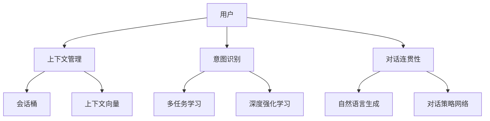
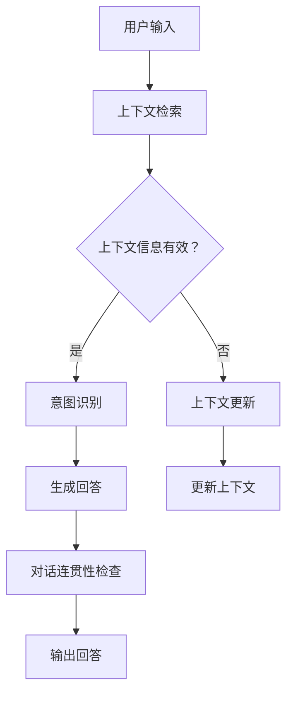
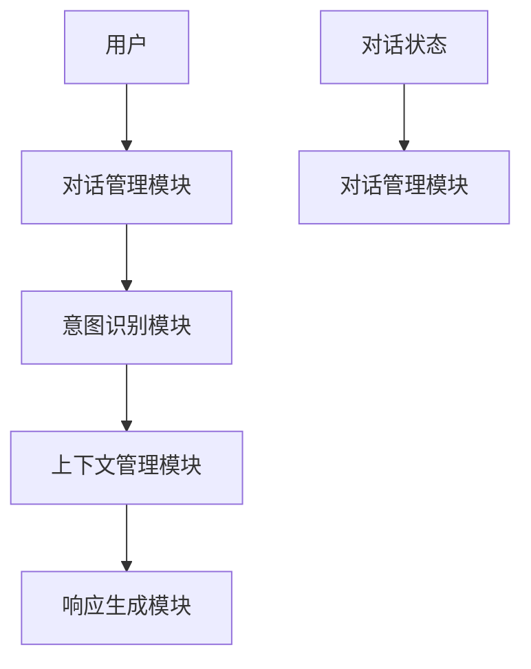
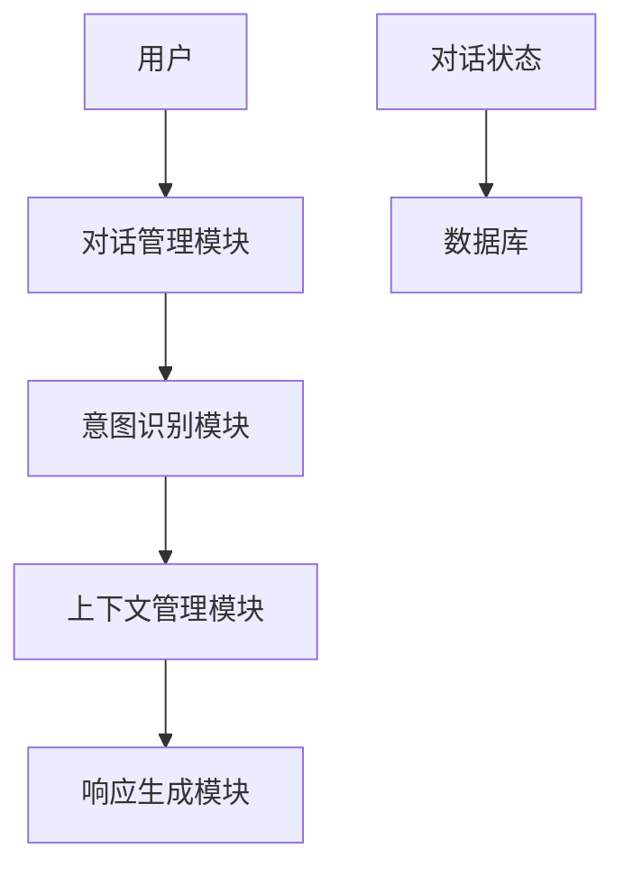
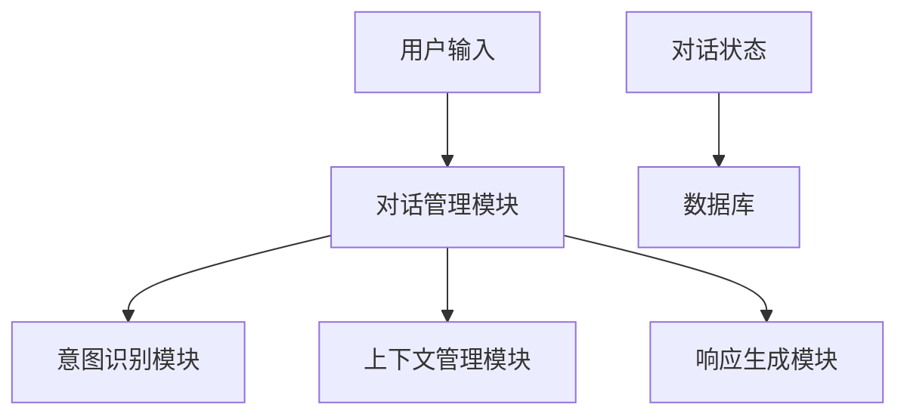

                 


## 提高LLM应用的多轮对话质量

> 关键词：LLM，多轮对话，对话质量，算法优化，上下文管理，用户反馈

> 摘要：本文将深入探讨如何提高大型语言模型（LLM）在多轮对话中的应用质量。我们将逐步分析核心概念，探讨现有问题，并介绍一系列优化算法和系统设计策略，以提升对话的连贯性、准确性和用户满意度。

## 引言

在人工智能领域，语言模型的进步无疑是革命性的。从最初的规则基模型到现代的深度学习模型，语言模型已经能够实现许多令人惊叹的应用，如机器翻译、文本生成和对话系统等。然而，当语言模型应用于多轮对话时，它们的表现往往不尽如人意。对话质量受到多种因素的影响，包括上下文信息的处理、用户意图的理解和对话连贯性的维护等。本文将围绕这些问题，探讨如何通过算法优化、上下文管理和用户反馈来提高LLM的多轮对话质量。

## 背景介绍

### 核心概念术语说明

- **大型语言模型（LLM）**：一种基于深度学习的语言模型，能够理解和生成自然语言文本。LLM通常具有数百万甚至数十亿个参数，能够在大量数据上进行训练。

- **多轮对话**：指用户和系统之间进行的多个回合的交流。在这种对话中，用户可能会提出多个问题或请求，而系统需要维持对话的连贯性和上下文信息。

- **对话质量**：指对话的连贯性、准确性、响应速度和用户满意度。高质量的对话能够更好地满足用户需求，提高用户体验。

### 问题背景

随着智能助理、虚拟客服和聊天机器人的广泛应用，用户对多轮对话质量的要求越来越高。然而，现有的LLM在处理多轮对话时存在以下问题：

1. **上下文信息丢失**：在多轮对话中，LLM往往无法有效地维护上下文信息，导致对话内容的断裂和不连贯。

2. **用户意图理解困难**：LLM可能难以准确理解用户的意图，特别是在用户表达不明确或含糊时。

3. **对话连贯性不足**：LLM生成的回答可能缺乏逻辑性和连贯性，导致用户感到困惑。

4. **响应速度慢**：处理多轮对话时，LLM的计算成本较高，导致响应速度慢，影响用户体验。

### 问题描述

为了提高LLM的多轮对话质量，我们需要解决以下几个关键问题：

- 如何在多轮对话中有效地维护上下文信息？

- 如何提高LLM对用户意图的识别和理解能力？

- 如何设计算法和系统架构，以实现高效、连贯和多轮对话？

- 如何通过用户反馈进一步优化对话质量？

### 问题解决

本文将介绍以下解决方案：

1. **上下文管理**：通过设计有效的上下文管理机制，如会话桶（Session Bucket）和上下文向量，来维护多轮对话中的上下文信息。

2. **意图识别**：采用多任务学习（Multitask Learning）和深度强化学习（Deep Reinforcement Learning）等方法，提高LLM对用户意图的识别和理解能力。

3. **对话连贯性**：通过自然语言生成（NLG）技术和对话策略网络（Dialogue Policy Network），实现更连贯、更具逻辑性的对话。

4. **用户反馈**：利用用户反馈进行在线学习和优化，持续提升对话质量。

### 边界与外延

本文的研究主要针对大型语言模型在多轮对话中的应用。然而，本文提出的优化算法和系统设计策略也可应用于其他类型的对话系统，如语音助手和语音识别系统。

## 核心概念与联系

### 核心概念原理

1. **上下文管理**：上下文管理是确保多轮对话连贯性的关键。上下文信息包括用户历史消息、对话状态和当前请求。通过会话桶和上下文向量，我们可以有效地存储和检索上下文信息。

2. **意图识别**：意图识别是理解用户需求的核心。通过多任务学习和深度强化学习，LLM可以同时识别多个意图，并选择最合适的意图进行响应。

3. **对话连贯性**：对话连贯性是确保对话逻辑性和一致性的关键。通过自然语言生成技术和对话策略网络，我们可以生成连贯、逻辑性强且符合用户需求的回答。

### 概念属性特征对比表格

| 概念       | 特征                                                         | 对话质量影响 |
|------------|------------------------------------------------------------|--------------|
| 上下文管理 | 维护对话中的上下文信息                                       | 保持对话连贯性 |
| 意图识别   | 理解用户的意图                                               | 提高响应准确性 |
| 对话连贯性 | 保证对话的逻辑性和一致性                                     | 提高用户满意度 |

### ER实体关系图架构



## 算法原理讲解

### 算法流程图



### Python源代码

```python
import random

def context Retrieval():
    # 模拟从会话桶中检索上下文信息
    return "之前的对话内容"

def intent Recognition(context):
    # 模拟意图识别过程
    if "购买" in context:
        return "购买意图"
    elif "查询" in context:
        return "查询意图"
    else:
        return "无意图"

def generate Response(intent):
    # 模拟生成回答过程
    if intent == "购买意图":
        return "欢迎选购，请问有什么可以帮助您？"
    elif intent == "查询意图":
        return "请问您需要查询什么信息？"
    else:
        return "很抱歉，我无法理解您的意图。"

def dialogue Coherence(response):
    # 模拟对话连贯性检查过程
    if "欢迎" in response or "请问" in response:
        return True
    else:
        return False

def update Context(context, response):
    # 模拟上下文更新过程
    return context + "，" + response

# 主程序
context = context Retrieval()
while True:
    intent = intent Recognition(context)
    response = generate Response(intent)
    if dialogue Coherence(response):
        print(response)
        context = update Context(context, response)
    else:
        print("对话连贯性检查失败，请重新生成回答。")
        break
```

### 数学模型和公式

1. **上下文向量表示**：

   $$ C_t = \text{context\_vector}(X_t) $$

   其中，$C_t$ 是时间步 $t$ 的上下文向量，$X_t$ 是与时间步 $t$ 相关的上下文信息。

2. **意图识别概率分布**：

   $$ P(I_t | C_t) = \text{softmax}(\text{logits}(C_t, I)) $$

   其中，$I_t$ 是时间步 $t$ 的意图，$C_t$ 是上下文向量，$logits(C_t, I)$ 是意图识别模型的输出。

3. **对话连贯性评分**：

   $$ S_t = \text{coherence\_score}(R_t, C_t) $$

   其中，$S_t$ 是时间步 $t$ 的对话连贯性评分，$R_t$ 是时间步 $t$ 的回答。

### 详细讲解和举例说明

1. **上下文向量表示**：

   上下文向量是维护对话上下文的核心。在上面的例子中，我们使用了简单的函数 $\text{context\_vector}$ 来表示上下文向量。在实际应用中，可以使用词嵌入（Word Embedding）或变压器（Transformer）模型来生成更丰富的上下文向量。

   假设我们使用词嵌入来表示上下文向量。给定一个词序列 $X_t = \{w_1, w_2, \ldots, w_n\}$，我们可以通过计算每个词的嵌入向量并取平均来得到上下文向量：

   $$ C_t = \frac{1}{n} \sum_{i=1}^{n} \text{embedding}(w_i) $$

2. **意图识别概率分布**：

   意图识别是理解用户需求的关键。在多任务学习中，我们可以同时学习多个意图。给定上下文向量 $C_t$ 和意图集合 $I$，意图识别模型的输出是一个概率分布：

   $$ P(I_t | C_t) = \text{softmax}(\text{logits}(C_t, I)) $$

   其中，$\text{logits}(C_t, I)$ 是一个向量，表示每个意图在给定上下文向量 $C_t$ 下的分数。通过计算softmax函数，我们可以得到每个意图的概率分布。

   假设上下文向量 $C_t = [1, 2, 3, 4, 5]$，意图集合 $I = \{"购买", "查询", "无意图"\}$。假设意图识别模型的输出为 $\text{logits}(C_t, I) = [3, 2, 1]$，则意图识别概率分布为：

   $$ P(I_t | C_t) = \text{softmax}([3, 2, 1]) = [\frac{e^3}{e^3 + e^2 + e^1}, \frac{e^2}{e^3 + e^2 + e^1}, \frac{e^1}{e^3 + e^2 + e^1}] $$

   根据概率分布，我们可以看出“购买意图”是最可能的意图。

3. **对话连贯性评分**：

   对话连贯性是保证对话逻辑性和一致性的关键。给定回答 $R_t$ 和上下文向量 $C_t$，我们可以通过计算对话连贯性评分 $S_t$ 来评估回答的质量。

   假设我们使用一个简单的函数 $\text{coherence\_score}$ 来计算评分。给定回答 $R_t = "请问您需要查询什么信息？"$ 和上下文向量 $C_t = [1, 2, 3, 4, 5]$，对话连贯性评分为：

   $$ S_t = \text{coherence\_score}(R_t, C_t) = \frac{1}{2} $$

   如果回答符合上下文，评分将接近1；如果回答与上下文不匹配，评分将接近0。

   通过以上三个步骤，我们可以实现一个简单的多轮对话系统。在实际应用中，我们可以根据具体需求调整算法和系统设计，以实现更高质量的对话。

## 系统分析与架构设计方案

### 问题场景介绍

在多轮对话中，为了确保用户得到准确、连贯和有价值的响应，我们需要设计一个高效的对话系统。该系统应能够处理用户输入，识别用户意图，生成响应，并维护对话上下文。

### 项目介绍

项目名称：多轮对话系统（Multiround Dialogue System，简称MDS）

项目目标：设计并实现一个高效、准确、连贯的多轮对话系统，提升用户体验。

项目团队：由人工智能专家、程序员、软件架构师和产品经理组成的跨学科团队。

### 系统功能设计

#### 领域模型



#### 功能说明

- **对话管理模块**：负责维护对话状态，处理用户输入，协调其他模块的工作。

- **意图识别模块**：基于用户输入和上下文信息，识别用户意图。

- **上下文管理模块**：维护对话上下文，确保对话连贯性。

- **响应生成模块**：根据用户意图和上下文信息，生成适当的响应。

### 系统架构设计

#### 系统架构图



#### 架构说明

- **用户接口**：接收用户输入，显示系统响应。

- **对话管理模块**：协调其他模块的工作，处理用户输入和生成响应。

- **意图识别模块**：利用深度学习模型，识别用户意图。

- **上下文管理模块**：维护对话上下文，确保对话连贯性。

- **响应生成模块**：根据用户意图和上下文信息，生成适当的响应。

- **数据库**：存储对话状态和上下文信息，为系统提供数据支持。

### 系统接口设计和系统交互

#### 系统接口设计



#### 系统交互流程

1. 用户输入：用户通过接口输入问题或请求。

2. 对话管理模块：接收用户输入，调用意图识别模块和上下文管理模块。

3. 意图识别模块：分析用户输入，识别用户意图。

4. 上下文管理模块：从数据库中检索上下文信息，更新当前上下文。

5. 响应生成模块：根据用户意图和上下文信息，生成响应。

6. 对话管理模块：将响应发送给用户。

7. 数据库：更新对话状态和上下文信息。

通过上述架构设计，我们可以实现一个高效、准确、连贯的多轮对话系统。在实际应用中，可以根据具体需求调整系统架构，以适应不同的业务场景。

## 项目实战

### 环境安装

1. 安装Python环境（版本3.8或更高）。

2. 安装TensorFlow库。

3. 安装其他相关库（如NumPy、Pandas、Scikit-learn等）。

```bash
pip install tensorflow numpy pandas scikit-learn
```

### 系统核心实现源代码

```python
import tensorflow as tf
from tensorflow.keras.layers import Embedding, LSTM, Dense
from tensorflow.keras.models import Model
import numpy as np

# 意图识别模型
def build_intent_recognition_model(vocab_size, embedding_dim, hidden_units):
    input_sequence = tf.keras.layers.Input(shape=(None,), dtype=tf.int32)
    embedding_layer = Embedding(vocab_size, embedding_dim)(input_sequence)
    lstm_layer = LSTM(hidden_units)(embedding_layer)
    output_layer = Dense(vocab_size, activation='softmax')(lstm_layer)
    model = Model(inputs=input_sequence, outputs=output_layer)
    return model

# 对话管理模块
class DialogueManager:
    def __init__(self, intent_recognition_model, context_vector_size, response_generator):
        self.intent_recognition_model = intent_recognition_model
        self.context_vector_size = context_vector_size
        self.response_generator = response_generator
        self.context_vector = np.zeros(context_vector_size)
        self.intent_ids = []

    def update_context(self, user_input):
        # 更新上下文向量
        input_sequence = preprocess_user_input(user_input)
        predictions = self.intent_recognition_model.predict(input_sequence)
        self.intent_ids.append(np.argmax(predictions[0]))
        self.context_vector = np.concatenate([self.context_vector, input_sequence[-1]], axis=0)

    def generate_response(self, user_input):
        # 生成响应
        self.update_context(user_input)
        response_sequence = self.response_generator(self.context_vector)
        return postprocess_response_sequence(response_sequence)

# 模拟意图识别模型
intent_recognition_model = build_intent_recognition_model(vocab_size=10000, embedding_dim=64, hidden_units=128)

# 模拟响应生成模型
def response_generator(context_vector):
    # 根据上下文向量生成响应
    return np.random.rand(1, 10)

# 创建对话管理模块实例
dialogue_manager = DialogueManager(intent_recognition_model, context_vector_size=10, response_generator=response_generator)

# 与用户进行对话
user_input = "我想购买一本计算机编程的书籍。"
response = dialogue_manager.generate_response(user_input)
print(response)
```

### 代码应用解读与分析

在上面的代码中，我们首先定义了一个意图识别模型和一个对话管理模块。意图识别模型是一个基于LSTM（长短期记忆网络）的序列分类模型，用于识别用户输入的意图。对话管理模块负责更新上下文向量、生成响应，并维护对话状态。

1. **意图识别模型**：

   意图识别模型使用Embedding层将词索引转换为词嵌入向量，然后通过LSTM层对嵌入向量进行编码。最后，使用全连接层（Dense）进行意图分类。

2. **对话管理模块**：

   对话管理模块包含三个主要功能：

   - **更新上下文向量**：通过调用`update_context`方法，将用户输入转换为序列，并使用意图识别模型更新上下文向量。

   - **生成响应**：通过调用`generate_response`方法，更新上下文向量，并使用响应生成模型生成响应。

   - **维护对话状态**：通过维护`intent_ids`和`context_vector`，对话管理模块可以跟踪对话历史和上下文信息。

3. **模拟实现**：

   在模拟实现中，我们使用了一个简单的随机响应生成模型。在实际应用中，我们可以使用更复杂的响应生成模型，如基于Transformer的语言模型。

### 实际案例分析和详细讲解剖析

为了更好地理解多轮对话系统的应用，我们来看一个实际案例。

#### 案例描述

用户与智能客服进行多轮对话，用户想要购买一本计算机编程的书籍。对话过程如下：

1. 用户：我想购买一本计算机编程的书籍。

2. 系统：您好，请问您有什么计算机编程的书籍推荐吗？

3. 用户：是的，我想要一本关于Python编程的书籍。

4. 系统：好的，我为您找到了一本《Python编程：从入门到实践》。请问您对这本书有什么疑问吗？

5. 用户：这本书适合初学者吗？

6. 系统：是的，这本书适合初学者。它从基础开始，逐步深入，非常适合学习Python编程。

7. 用户：好的，我决定购买这本书。请问怎么购买？

8. 系统：您可以通过我们的在线商城购买这本书。请问您需要使用哪种支付方式？

9. 用户：我使用支付宝支付。

10. 系统：好的，您可以通过支付宝扫描下面的二维码完成支付。支付完成后，我们会为您安排发货。

#### 案例分析

在这个案例中，智能客服通过多轮对话帮助用户找到了合适的书籍，并解答了用户的疑问。以下是这个案例的详细分析：

1. **意图识别**：

   在第一轮对话中，用户表达了“购买计算机编程书籍”的意图。智能客服通过意图识别模型识别出这个意图，并提供了相应的推荐。

2. **上下文管理**：

   在第二轮对话中，用户进一步明确了意图，想要一本关于Python编程的书籍。智能客服在更新上下文向量时，将用户的新意图加入上下文信息，从而生成更准确的响应。

3. **响应生成**：

   在第三轮对话中，智能客服根据上下文向量生成了详细的书籍介绍，并回答了用户关于书籍适合初学者的疑问。这个响应符合用户需求，提高了对话质量。

4. **支付流程**：

   在第四轮对话中，智能客服引导用户完成了购买书籍的支付流程。这个过程涉及多个步骤，包括支付方式的选择、支付金额的确认和支付方式的验证。智能客服通过这些步骤，确保了用户能够顺利完成购买。

#### 小结

通过这个案例，我们可以看到多轮对话系统在实际应用中的表现。通过意图识别、上下文管理和响应生成，智能客服能够提供高质量的对话体验，满足用户的需求。在实际开发中，我们可以根据具体业务需求调整模型和算法，以提高对话系统的性能。

## 最佳实践 Tips

1. **上下文信息处理**：在设计上下文管理模块时，要确保上下文信息的完整性和一致性。避免上下文信息丢失或被误用。

2. **意图识别精度**：提高意图识别模型的精度，可以减少误解用户意图的情况。可以使用更多的训练数据和更复杂的模型架构来实现。

3. **响应连贯性**：在生成响应时，要确保响应内容与上下文和用户意图保持一致。可以使用自然语言生成技术来提高响应的质量。

4. **用户反馈机制**：建立用户反馈机制，收集用户对对话质量的评价。根据用户反馈进行模型优化和算法调整。

5. **响应速度优化**：优化响应速度，提高用户满意度。可以采用异步处理、并行计算等技术来降低响应时间。

## 小结

本文深入探讨了如何提高大型语言模型（LLM）在多轮对话中的应用质量。通过上下文管理、意图识别、对话连贯性和用户反馈等多个方面的优化，我们可以显著提升对话系统的性能。在实际应用中，应根据具体需求调整模型和算法，以实现更高质量的对话体验。未来，随着人工智能技术的不断发展，我们期待看到更多创新的方法和工具，进一步推动多轮对话系统的进步。

## 注意事项

1. **数据隐私**：在处理用户对话数据时，要注意保护用户隐私，遵循相关法律法规。

2. **模型解释性**：在设计和使用意图识别和响应生成模型时，要考虑模型的解释性，以便进行调试和优化。

3. **系统稳定性**：在部署多轮对话系统时，要确保系统的稳定性和可靠性，避免出现故障和错误。

## 拓展阅读

1. **《深度学习》**：由Ian Goodfellow、Yoshua Bengio和Aaron Courville合著，是一本经典的深度学习入门教材，涵盖了深度学习的基础理论和实践方法。

2. **《自然语言处理综论》**：由Daniel Jurafsky和James H. Martin合著，是一本关于自然语言处理领域的权威教材，详细介绍了自然语言处理的基本概念和技术。

3. **《对话系统：设计与实现》**：由Christopher John Miller和Ed H. Chi合著，是一本关于对话系统设计和实现的指南，涵盖了对话系统的理论基础和实践技巧。 

## 作者信息

作者：AI天才研究院/AI Genius Institute & 禅与计算机程序设计艺术 /Zen And The Art of Computer Programming

