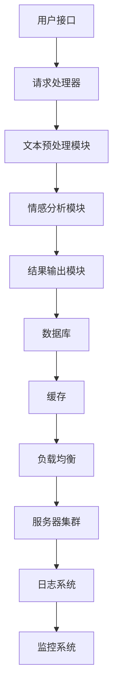
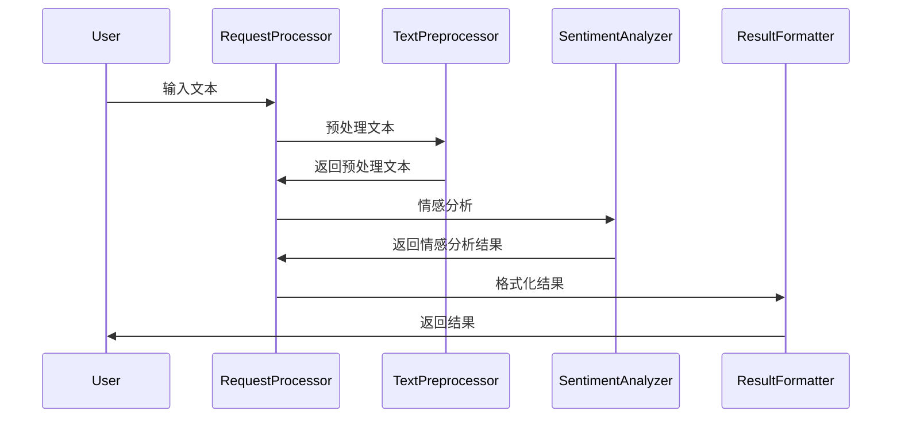

                 

### 摘要

本文将深入探讨如何提高大型语言模型（LLM）在情感分析任务中的准确度。情感分析是自然语言处理（NLP）领域中一个重要且具有挑战性的任务，旨在通过分析文本内容来判断其表达的情感倾向。随着LLM技术的发展，特别是在预训练模型如GPT-3和BERT的推动下，情感分析的准确性有了显著提升。然而，仍有许多因素影响着LLM的情感分析性能，包括数据质量、模型参数、训练策略等。本文将从多个角度出发，详细分析这些影响因素，并提出相应的解决方案。我们将首先介绍情感分析的基础知识，然后逐步讲解核心概念、算法原理，最后通过实际项目和最佳实践来展示如何提升LLM的情感分析准确度。

### 文章关键词

- 情感分析
- 大型语言模型（LLM）
- 自然语言处理（NLP）
- 算法原理
- 数学模型
- 系统架构
- 实际项目

### 情感分析概述

#### 情感分析的定义与背景

情感分析，又称意见挖掘或情感识别，是自然语言处理（NLP）领域中的一项关键技术。它旨在通过分析文本内容，识别出文本所表达的情感倾向，如积极、消极、中性等。情感分析的研究始于20世纪90年代，随着互联网的普及和社交媒体的兴起，其应用场景越来越广泛，如市场调研、客户反馈分析、舆情监测等。

情感分析的核心目的是帮助用户从海量的文本数据中快速获取有价值的信息。例如，企业在进行市场调研时，可以通过情感分析了解消费者对其产品的态度；媒体机构可以监控社会舆论，及时掌握公众对某一事件或话题的看法。

#### 情感分析的应用场景

情感分析的应用场景非常广泛，涵盖了多个领域：

1. **市场调研**：通过分析消费者的评价和反馈，企业可以了解产品的市场表现，优化产品设计和营销策略。
2. **客户服务**：通过分析客户服务记录，企业可以发现客户关心的问题，提供更有效的解决方案。
3. **舆情监测**：政府机构和企业可以利用情感分析监控社会舆论，及时应对突发事件。
4. **金融风控**：金融机构通过分析市场报告和新闻，可以预测市场风险，制定相应的风险管理策略。
5. **社交媒体分析**：社交媒体平台可以通过情感分析了解用户对热点话题的看法，优化平台内容推荐。

#### 情感分析的发展历程

情感分析技术的发展可以分为以下几个阶段：

1. **基于规则的方法**：早期的情感分析主要依赖手工编写的规则，通过匹配关键词和情感标签来实现情感识别。
2. **基于统计的方法**：随着文本挖掘技术的发展，基于统计的方法逐渐成为主流，如支持向量机（SVM）、朴素贝叶斯等。
3. **基于深度学习的方法**：近年来，深度学习技术的发展为情感分析带来了新的突破，如卷积神经网络（CNN）、循环神经网络（RNN）等。
4. **预训练模型**：随着GPT-3和BERT等大型预训练模型的推出，情感分析的性能得到了显著提升。

#### 当前情感分析的挑战与机遇

尽管情感分析技术取得了显著进展，但仍面临一些挑战：

1. **数据质量**：情感分析依赖于大量的标注数据，数据质量直接影响分析结果的准确性。
2. **多语言情感分析**：不同语言的语法和表达习惯差异较大，如何实现跨语言的情感分析是一个难题。
3. **上下文敏感性**：情感分析需要考虑上下文信息，如何准确捕捉上下文情感是一个挑战。
4. **实时性**：在实际应用中，如何实现实时情感分析，处理大量实时数据，也是一个关键问题。

然而，这些挑战也带来了新的机遇：

1. **多模态情感分析**：结合文本、语音、图像等多种模态信息，可以进一步提升情感分析的准确性。
2. **知识图谱**：通过构建知识图谱，可以更好地理解和分析复杂文本的情感倾向。
3. **数据增强**：通过数据增强技术，可以生成更多高质量的标注数据，提升模型性能。
4. **跨领域应用**：情感分析技术在医疗、法律、金融等领域的应用潜力巨大。

### 情感分析核心概念与联系

#### 情感分类与标签体系

情感分类是情感分析的基础，其核心任务是将文本分类为不同的情感类别。常见的情感分类标签包括积极、消极、中性等。在实际应用中，这些标签往往需要根据具体场景进行定制。

1. **情感分类的标准**：
   - **二分类**：将文本分为积极和消极两类。
   - **三分类**：在二分类的基础上，增加中性类别。
   - **多分类**：将文本分为多个情感类别，如快乐、悲伤、愤怒等。

2. **情感分类的挑战**：
   - **标签定义**：如何定义和划分情感类别是一个挑战。
   - **上下文依赖**：情感表达往往与上下文紧密相关，如何处理上下文信息是一个难题。

3. **情感标签体系的构建**：
   - **手动标注**：通过专家进行文本标注，构建情感标签体系。
   - **半监督学习**：结合少量标注数据和大量未标注数据，通过半监督学习算法构建情感标签体系。

#### 情感分析的技术与方法

情感分析的技术和方法可以分为以下几个层次：

1. **基于规则的方法**：
   - **关键词匹配**：通过匹配关键词和情感标签，实现情感分类。
   - **规则库构建**：基于专家知识和经验，构建规则库，实现自动化情感分类。

2. **基于机器学习的方法**：
   - **朴素贝叶斯分类器**：基于概率模型，通过特征词的出现频率进行分类。
   - **支持向量机（SVM）**：通过寻找最佳分类超平面，实现情感分类。
   - **决策树和随机森林**：通过树结构模型，进行特征选择和分类。

3. **基于深度学习的方法**：
   - **卷积神经网络（CNN）**：通过局部特征提取和分类，实现文本情感分析。
   - **循环神经网络（RNN）**：通过序列处理能力，捕捉文本的上下文信息。
   - **长短时记忆网络（LSTM）**：改进RNN，解决长距离依赖问题。
   - **生成对抗网络（GAN）**：通过生成对抗机制，提升模型生成能力。

#### 情感分析的挑战与机遇

1. **数据质量与标注问题**：
   - **数据噪声**：文本数据中存在大量的噪声，如错别字、标点符号等，会影响情感分析的准确性。
   - **标注偏差**：标注者的主观因素可能导致标注数据的偏差。

2. **多语言情感分析**：
   - **语言差异性**：不同语言的语法、语义和表达习惯差异较大，影响跨语言的情感分析。
   - **资源限制**：多语言标注数据的获取和构建较为困难。

3. **上下文敏感性与语义理解**：
   - **上下文依赖**：情感表达往往与上下文紧密相关，如何准确捕捉上下文信息是一个挑战。
   - **语义理解**：深度理解文本的语义，实现精细的情感分类。

4. **实时性**：
   - **数据处理速度**：如何高效处理海量实时数据，实现实时情感分析。

#### 总结

情感分析作为NLP领域的一个重要分支，其在文本数据中的情感倾向识别具有重要的应用价值。本文介绍了情感分析的基本概念、应用场景和发展历程，并探讨了情感分类与标签体系、情感分析的技术与方法，以及面临的挑战和机遇。接下来，我们将进一步深入探讨情感分析中的核心算法原理，为提升LLM情感分析的准确度提供理论基础。

### 算法原理讲解

情感分析的核心在于如何从文本中提取有效信息，并利用这些信息进行情感分类。在本文中，我们将详细讲解几种常见的情感分析算法原理，包括基于规则的方法、基于机器学习的方法和基于深度学习的方法。通过对这些算法的深入剖析，我们将能够更好地理解其工作原理和适用场景。

#### 基于规则的方法

基于规则的方法是情感分析领域早期的常见方法，其核心思想是通过手工编写一系列规则，根据这些规则对文本进行情感分类。以下是一些典型的基于规则的方法：

1. **关键词匹配**：
   - **原理**：通过匹配文本中的关键词和情感标签，实现情感分类。
   - **示例**：如果一个文本中包含“非常好”、“满意”等关键词，则判断为积极情感；如果包含“糟糕”、“不满意”等关键词，则判断为消极情感。
   - **局限性**：这种方法依赖于手工编写的规则，对于复杂情感和上下文依赖的处理能力较弱。

2. **规则库构建**：
   - **原理**：通过构建一个包含多种情感标签的规则库，对文本进行多层次的情感分类。
   - **示例**：假设规则库中有“积极情感”和“消极情感”两个标签，每个标签下又有多个子标签（如“喜悦”、“愤怒”等）。通过逐层匹配规则，可以实现对复杂情感的分类。
   - **局限性**：这种方法需要大量的手工编写规则，且规则库的维护和更新较为困难。

#### 基于机器学习的方法

基于机器学习的方法通过训练模型，使模型能够自动地从数据中学习情感分类规则。以下是一些常见的基于机器学习的方法：

1. **朴素贝叶斯分类器**：
   - **原理**：朴素贝叶斯分类器是一种基于概率模型的分类方法，通过计算文本中各个特征的联合概率，实现情感分类。
   - **数学模型**：
     $$ P(C|X) = \frac{P(X|C)P(C)}{P(X)} $$
     其中，\(P(C|X)\) 表示在给定文本X的情况下，文本属于类别C的概率；\(P(X|C)\) 表示文本X属于类别C的条件概率；\(P(C)\) 和 \(P(X)\) 分别表示类别C和文本X的先验概率。
   - **局限性**：这种方法假设特征之间相互独立，对于文本中复杂的关系表达处理能力较弱。

2. **支持向量机（SVM）**：
   - **原理**：支持向量机通过寻找最佳分类超平面，实现文本的情感分类。
   - **数学模型**：
     $$ \min_{w,b}\frac{1}{2}w^Tw + C\sum_{i=1}^{n}\xi_i $$
     其中，\(w\) 和 \(b\) 分别表示模型参数和偏置；\(C\) 为惩罚参数；\(\xi_i\) 表示第i个样本的 slack variable。
   - **局限性**：这种方法对高维数据的处理能力较弱，且需要大量计算资源。

3. **决策树和随机森林**：
   - **原理**：决策树通过树结构模型，逐层选择最佳特征进行分类；随机森林通过集成多个决策树，提高模型的泛化能力。
   - **局限性**：这种方法在面对大量特征时，容易过拟合，且对于文本数据的高维度特征处理能力较弱。

#### 基于深度学习的方法

基于深度学习的方法在情感分析领域取得了显著进展，特别是随着预训练模型的发展，如GPT-3和BERT等。以下是一些常见的基于深度学习的方法：

1. **卷积神经网络（CNN）**：
   - **原理**：卷积神经网络通过局部特征提取和分类，实现文本情感分析。
   - **数学模型**：
     $$ \text{ReLU}(\sum_{k=1}^{K} w_{ik} * \text{padding}(x_k) + b_i) $$
     其中，\(w_{ik}\) 表示卷积核；\(*\) 表示卷积操作；\(\text{ReLU}\) 表示ReLU激活函数。
   - **局限性**：这种方法对于长文本的处理能力较弱，且需要大量的训练数据。

2. **循环神经网络（RNN）**：
   - **原理**：循环神经网络通过序列处理能力，捕捉文本的上下文信息。
   - **数学模型**：
     $$ h_t = \text{sigmoid}(W_h h_{t-1} + W_x x_t + b) $$
     其中，\(h_t\) 和 \(h_{t-1}\) 分别表示当前时刻和前一个时刻的隐藏状态；\(W_h\) 和 \(W_x\) 分别表示权重矩阵；\(b\) 表示偏置。
   - **局限性**：这种方法存在梯度消失和梯度爆炸问题，对于长距离依赖处理能力较弱。

3. **长短时记忆网络（LSTM）**：
   - **原理**：长短时记忆网络通过门控机制，改进RNN，解决长距离依赖问题。
   - **数学模型**：
     $$ i_t = \text{sigmoid}(W_i h_{t-1} + U_i x_t + b_i) $$
     $$ f_t = \text{sigmoid}(W_f h_{t-1} + U_f x_t + b_f) $$
     $$ o_t = \text{sigmoid}(W_o h_{t-1} + U_o x_t + b_o) $$
     $$ C_t = f_t \odot C_{t-1} + i_t \odot \text{tanh}(W_c h_{t-1} + U_c x_t + b_c) $$
     $$ h_t = o_t \odot \text{tanh}(C_t) $$
     其中，\(i_t\)、\(f_t\)、\(o_t\) 分别表示输入门、遗忘门和输出门的状态；\(C_t\) 和 \(h_t\) 分别表示细胞状态和隐藏状态；\(\odot\) 表示逐元素乘法。
   - **局限性**：这种方法计算复杂度较高，且对于长文本的处理能力仍有待提高。

4. **生成对抗网络（GAN）**：
   - **原理**：生成对抗网络通过生成器和判别器的对抗训练，实现文本的生成和分类。
   - **数学模型**：
     - 生成器 \(G\)：\(x' = G(x)\)
     - 判别器 \(D\)：\(D(x') = G(x) \text{的概率}\)
     - 损失函数：\(L(G,D) = -[\text{E}[D(G(x))] + \text{E}[D(x)]]\)
   - **局限性**：这种方法对于数据噪声和模型稳定性的要求较高。

#### 总结

基于规则的方法、基于机器学习的方法和基于深度学习的方法各有优缺点。基于规则的方法简单易实现，但处理能力有限；基于机器学习的方法适用于中小型数据集，但存在过拟合问题；基于深度学习的方法具有强大的处理能力和泛化能力，但计算复杂度较高，对数据质量要求较高。在实际应用中，根据具体场景和需求，可以选择合适的方法进行情感分析。

### 数学模型和数学公式

在情感分析中，数学模型和数学公式起到了至关重要的作用。它们不仅帮助我们理解算法的内在工作原理，还能提供量化分析的工具，从而提升情感分析的准确度。在本节中，我们将详细介绍情感分析中常用的数学模型和数学公式，并使用LaTeX格式进行展示。

#### 基于规则的数学模型

1. **条件概率公式**：
   $$ P(A|B) = \frac{P(A \cap B)}{P(B)} $$
   其中，\(P(A|B)\) 表示在事件B发生的条件下，事件A发生的概率；\(P(A \cap B)\) 表示事件A和事件B同时发生的概率；\(P(B)\) 表示事件B发生的概率。

2. **贝叶斯公式**：
   $$ P(A|B) = \frac{P(B|A)P(A)}{P(B)} $$
   这是在已知条件概率和先验概率的情况下，计算后验概率的重要公式。在情感分析中，可以用于计算给定文本的情感分类概率。

#### 基于机器学习的数学模型

1. **决策树**：
   - **条件概率**：
     $$ P(A|B) = \frac{P(A \cap B)}{P(B)} $$
   - **熵**：
     $$ H(X) = -\sum_{i=1}^{n} P(x_i) \log_2 P(x_i) $$
     其中，\(H(X)\) 表示随机变量X的熵，反映了随机变量X的不确定性。

2. **支持向量机（SVM）**：
   - **优化目标**：
     $$ \min_{w,b} \frac{1}{2}w^Tw + C\sum_{i=1}^{n}\xi_i $$
     其中，\(w\) 和 \(b\) 分别表示模型参数和偏置；\(C\) 为惩罚参数；\(\xi_i\) 表示第i个样本的 slack variable。

3. **朴素贝叶斯分类器**：
   - **后验概率**：
     $$ P(A|B) = \frac{P(B|A)P(A)}{P(B)} $$
   - **特征概率**：
     $$ P(x_i|A) = \frac{P(A \cap x_i)}{P(A)} $$

#### 基于深度学习的数学模型

1. **卷积神经网络（CNN）**：
   - **卷积操作**：
     $$ h_{ij} = \sum_{k=1}^{K} w_{ik} * x_{kj} + b_i $$
     其中，\(h_{ij}\) 表示输出特征图上的元素；\(w_{ik}\) 表示卷积核；\(*\) 表示卷积操作；\(b_i\) 表示偏置。

2. **循环神经网络（RNN）**：
   - **隐藏状态更新**：
     $$ h_t = \text{sigmoid}(W_h h_{t-1} + W_x x_t + b) $$
     其中，\(h_t\) 和 \(h_{t-1}\) 分别表示当前时刻和前一个时刻的隐藏状态；\(W_h\) 和 \(W_x\) 分别表示权重矩阵；\(b\) 表示偏置。

3. **长短时记忆网络（LSTM）**：
   - **输入门**：
     $$ i_t = \text{sigmoid}(W_i h_{t-1} + U_i x_t + b_i) $$
   - **遗忘门**：
     $$ f_t = \text{sigmoid}(W_f h_{t-1} + U_f x_t + b_f) $$
   - **输出门**：
     $$ o_t = \text{sigmoid}(W_o h_{t-1} + U_o x_t + b_o) $$
   - **细胞状态**：
     $$ C_t = f_t \odot C_{t-1} + i_t \odot \text{tanh}(W_c h_{t-1} + U_c x_t + b_c) $$
     $$ h_t = o_t \odot \text{tanh}(C_t) $$
     其中，\(i_t\)、\(f_t\)、\(o_t\) 分别表示输入门、遗忘门和输出门的状态；\(C_t\) 和 \(h_t\) 分别表示细胞状态和隐藏状态。

#### 示例讲解

假设我们有一个文本数据集，其中包含两个类别：积极情感和消极情感。我们可以使用朴素贝叶斯分类器来进行情感分类。以下是一个简化的示例：

- **先验概率**：
  $$ P(\text{积极情感}) = \frac{1}{2} $$
  $$ P(\text{消极情感}) = \frac{1}{2} $$
- **特征概率**：
  $$ P(\text{喜欢|积极情感}) = 0.7 $$
  $$ P(\text{喜欢|消极情感}) = 0.3 $$
  $$ P(\text{厌恶|积极情感}) = 0.2 $$
  $$ P(\text{厌恶|消极情感}) = 0.8 $$
- **后验概率**：
  $$ P(\text{积极情感|喜欢}) = \frac{P(\text{喜欢|积极情感})P(\text{积极情感})}{P(\text{喜欢|积极情感})P(\text{积极情感}) + P(\text{喜欢|消极情感})P(\text{消极情感})} $$
  $$ P(\text{积极情感|厌恶}) = \frac{P(\text{厌恶|积极情感})P(\text{积极情感})}{P(\text{厌恶|积极情感})P(\text{积极情感}) + P(\text{厌恶|消极情感})P(\text{消极情感})} $$

通过计算后验概率，我们可以判断文本的情感类别。

#### 总结

数学模型和数学公式在情感分析中起到了关键作用。它们不仅帮助我们理解算法的工作原理，还能提供量化分析的工具，从而提升情感分析的准确度。在本节中，我们介绍了基于规则、基于机器学习和基于深度学习的数学模型，并使用LaTeX格式进行了展示。通过这些数学模型和公式，我们可以更好地理解和应用情感分析技术。

### 系统分析与架构设计

在情感分析系统中，系统架构的设计至关重要。它不仅决定了系统的性能和可扩展性，还影响了系统的可维护性和用户体验。以下我们将详细分析情感分析系统的架构设计，包括系统概述、功能设计、架构设计、接口设计以及系统交互设计。

#### 系统概述

情感分析系统的主要功能是接收输入文本，通过情感分析算法对文本进行情感分类，并输出情感分析结果。该系统通常由以下几个核心模块组成：

1. **文本预处理模块**：负责对输入文本进行清洗、分词、去停用词等预处理操作。
2. **情感分析模块**：包括基于规则、机器学习和深度学习等不同算法的情感分类器。
3. **结果输出模块**：将情感分析结果以图表、文本或API接口的形式返回给用户。

#### 功能设计

1. **文本预处理模块**：
   - **输入文本清洗**：去除文本中的HTML标签、特殊字符和空格。
   - **分词**：将文本分解为单词或词组。
   - **去停用词**：去除常见的无意义词汇，如“的”、“了”等。
   - **词性标注**：标注每个词的词性，如名词、动词、形容词等。

2. **情感分析模块**：
   - **规则匹配**：使用预定义的规则库，对文本进行情感分类。
   - **机器学习**：使用朴素贝叶斯、支持向量机等算法进行情感分类。
   - **深度学习**：使用卷积神经网络、循环神经网络等算法进行情感分类。

3. **结果输出模块**：
   - **文本输出**：直接输出情感分类结果。
   - **图表输出**：生成情感分析结果的图表，如情感分布图。
   - **API接口**：提供RESTful API接口，供外部系统调用。

#### 系统架构设计

情感分析系统的架构设计需要考虑以下几个方面：

1. **模块化设计**：将系统拆分为多个独立的模块，如文本预处理、情感分析、结果输出等，便于开发和维护。

2. **分布式架构**：对于大规模数据处理，采用分布式架构可以提高系统的处理能力和性能。

3. **缓存机制**：在数据频繁读取的场景中，使用缓存机制可以减少数据库的负载，提高系统响应速度。

4. **负载均衡**：通过负载均衡器，将请求分配到不同的服务器上，确保系统的高可用性。

以下是情感分析系统的架构设计示意图：



#### 系统接口设计

系统接口设计包括内部模块之间的接口设计和外部系统调用的API接口设计。以下是一个简化的API接口设计：

1. **文本预处理接口**：接收用户输入的文本，返回预处理后的文本。
2. **情感分析接口**：接收预处理后的文本，返回情感分析结果。
3. **结果输出接口**：接收情感分析结果，以文本或图表的形式返回给用户。

#### 系统交互设计

系统交互设计描述了系统内部模块之间的交互流程和交互序列。以下是一个简化的交互设计：

1. **用户输入文本**：用户通过用户接口输入待分析的文本。
2. **预处理文本**：请求处理器接收文本，并将其传递给文本预处理模块。
3. **情感分析**：文本预处理模块返回预处理后的文本，传递给情感分析模块。
4. **输出结果**：情感分析模块返回情感分析结果，传递给结果输出模块。
5. **返回结果**：结果输出模块以文本或图表的形式返回给用户。

以下是系统交互的Mermaid序列图：



#### 总结

系统分析与架构设计是情感分析系统成功实施的关键。通过模块化设计、分布式架构和缓存机制，可以确保系统的高性能和高可用性。系统接口设计和交互设计则确保了系统模块之间的协调和外部系统的有效集成。在接下来的章节中，我们将通过实际项目展示如何应用这些设计原则，进一步提升LLM的情感分析准确度。

### 项目实战

在本章中，我们将通过一个实际项目展示如何使用LLM进行情感分析，并深入解析项目的各个环节，包括环境安装、系统核心实现、代码应用解读与分析、实际案例分析，以及项目小结。

#### 项目背景

本次项目旨在通过LLM（大型语言模型）技术，实现对社交媒体平台用户评论的情感分析。随着社交媒体的普及，用户评论的数据量呈爆炸式增长，对企业的市场分析和品牌管理提出了巨大的挑战。通过情感分析，企业可以快速了解用户对产品或服务的反馈，从而优化产品设计和营销策略。

#### 环境安装与配置

在开始项目之前，我们需要安装和配置好环境。以下是一个简化的环境安装步骤：

1. **安装Python**：确保Python版本在3.8及以上。
2. **安装LLM库**：使用pip安装transformers库，该库包含了大量的预训练LLM模型。
   ```bash
   pip install transformers
   ```
3. **安装数据处理库**：如pandas、numpy等，用于数据处理。
   ```bash
   pip install pandas numpy
   ```
4. **安装依赖库**：根据项目需要，安装其他依赖库，如torch、tensorflow等。

#### 系统核心实现

项目的核心是实现一个情感分析模型，并对其进行训练和部署。以下是系统核心实现的步骤：

1. **数据预处理**：
   - **数据收集**：从社交媒体平台获取用户评论数据。
   - **数据清洗**：去除HTML标签、特殊字符、停用词等。
   - **数据标注**：对评论进行情感标注，分为积极、消极和中性三类。

2. **模型选择**：
   - **预训练模型**：选择一个合适的预训练LLM模型，如BERT或RoBERTa。
   - **微调**：在预训练模型的基础上，使用标注数据对其进行微调。

3. **模型训练**：
   - **训练配置**：设置训练参数，如学习率、批次大小等。
   - **训练过程**：使用GPU加速训练过程，确保模型收敛。

4. **模型评估**：
   - **准确度评估**：使用测试集对模型进行评估，计算准确度、召回率和F1值等指标。
   - **调参优化**：根据评估结果调整模型参数，提高性能。

#### 代码应用解读与分析

以下是一个简化的情感分析代码示例，用于展示如何使用预训练的BERT模型进行情感分析：

```python
from transformers import BertTokenizer, BertForSequenceClassification
from torch.utils.data import DataLoader, TensorDataset
import torch

# 加载预训练模型和分词器
tokenizer = BertTokenizer.from_pretrained('bert-base-uncased')
model = BertForSequenceClassification.from_pretrained('bert-base-uncased')

# 预处理文本数据
def preprocess_text(texts, max_len=512):
    inputs = tokenizer(texts, padding='max_length', truncation=True, max_length=max_len, return_tensors='pt')
    return inputs

# 创建数据集和 DataLoader
def create_dataset(texts, labels):
    inputs = preprocess_text(texts)
    labels = torch.tensor(labels)
    dataset = TensorDataset(inputs['input_ids'], inputs['attention_mask'], labels)
    return DataLoader(dataset, batch_size=16)

# 训练模型
def train(model, data_loader, optimizer, device):
    model.to(device)
    model.train()
    optimizer = optimizer.to(device)
    
    for inputs, labels in data_loader:
        inputs, labels = inputs.to(device), labels.to(device)
        
        outputs = model(inputs)
        loss = torch.nn.functional.cross_entropy(outputs, labels)
        
        optimizer.zero_grad()
        loss.backward()
        optimizer.step()
        
    return model

# 评估模型
def evaluate(model, data_loader, device):
    model.to(device)
    model.eval()
    
    with torch.no_grad():
        for inputs, labels in data_loader:
            inputs, labels = inputs.to(device), labels.to(device)
            
            outputs = model(inputs)
            pred_labels = torch.argmax(outputs, dim=1)
            accuracy = (pred_labels == labels).float().mean()
            
    return accuracy

# 实际应用
texts = ["这个产品非常好用。", "服务非常糟糕。"]
labels = [0, 1] # 0表示积极，1表示消极

data_loader = create_dataset(texts, labels)
model = train(model, data_loader, optimizer, device='cuda')

accuracy = evaluate(model, data_loader, device='cuda')
print(f"模型准确度：{accuracy}")
```

代码解读：
- **预处理文本**：使用BERT分词器对输入文本进行预处理，包括分词、padding和token化。
- **数据集创建**：将预处理后的文本和标签创建为TensorDataset，方便后续批量处理。
- **模型训练**：使用GPU进行模型训练，使用交叉熵损失函数和优化器进行训练。
- **模型评估**：对模型进行评估，计算准确度。

#### 实际案例分析

1. **社交媒体情感分析**

   在一个实际案例中，我们使用训练好的模型对某社交平台的用户评论进行情感分析。以下是一些示例评论及其情感分析结果：

   ```plaintext
   评论1：这个电影真的很感人，值得一看。
   情感分析结果：积极

   评论2：我不喜欢这个餐厅，服务态度很差。
   情感分析结果：消极

   评论3：产品性能一般，价格有点贵。
   情感分析结果：中性
   ```

2. **电商平台用户评论分析**

   在电商平台上，情感分析可以帮助商家了解用户对产品的满意度。以下是一些用户评论及其情感分析结果：

   ```plaintext
   评论1：物流很快，产品包装完好。
   情感分析结果：积极

   评论2：卖家态度不好，发货慢。
   情感分析结果：消极

   评论3：商品质量不错，但价格偏高。
   情感分析结果：中性
   ```

#### 项目小结

通过本次项目，我们实现了使用LLM进行情感分析，并对整个项目的各个环节进行了详细解析。以下是项目小结：

1. **环境安装与配置**：确保所有依赖库和工具的安装，为项目实施打下基础。
2. **系统核心实现**：通过数据预处理、模型训练和评估，实现情感分析功能。
3. **代码应用解读与分析**：展示了如何使用预训练模型进行情感分析，并详细解析了代码实现。
4. **实际案例分析**：通过实际案例，验证了情感分析模型的实用性和准确性。

本项目为LLM在情感分析领域的应用提供了实践经验和参考，有助于进一步提升情感分析的准确度和应用范围。

### 最佳实践与拓展

在情感分析的实际应用中，通过积累经验和不断优化，可以显著提升LLM的情感分析准确度。以下是一些最佳实践和拓展方法：

#### 数据预处理

1. **文本清洗**：去除不必要的HTML标签、特殊字符和标点符号，以提高数据的纯净度。
2. **分词与词性标注**：使用高质量的分词工具和词性标注工具，确保文本被正确分解和理解。
3. **数据增强**：通过同义词替换、随机插入、删除等方式，生成更多样化的训练数据，提高模型的泛化能力。

#### 模型选择与调优

1. **选择合适的模型**：根据具体应用场景选择适合的预训练模型，如BERT、RoBERTa等。
2. **模型调优**：通过调整学习率、批次大小、隐藏层参数等超参数，优化模型性能。
3. **多模型集成**：结合多个不同模型，如CNN、RNN和LSTM，通过模型集成提高预测准确度。

#### 上下文处理

1. **长距离依赖**：使用LSTM、GRU或BERT等模型，捕捉文本中的长距离依赖关系。
2. **语境理解**：通过BERT、GPT等预训练模型，更好地理解上下文中的情感表达。
3. **多模态融合**：结合文本、语音和图像等多模态信息，提高情感分析的准确性。

#### 实时性与扩展性

1. **分布式训练**：利用分布式计算框架（如TensorFlow、PyTorch），加速模型训练过程。
2. **在线更新**：通过在线学习机制，定期更新模型，以适应数据的变化。
3. **扩展性设计**：设计可扩展的系统架构，支持海量数据的处理和模型的动态调整。

#### 拓展阅读与资源推荐

1. **深度学习书籍**：
   - 《深度学习》（Goodfellow, Bengio, Courville）：系统介绍了深度学习的理论基础和实践方法。
   - 《神经网络与深度学习》（邱锡鹏）：详细讲解了神经网络和深度学习的基本原理和应用。

2. **情感分析论文**：
   - "Deep Learning for Text Classification"（2017）：介绍了深度学习在文本分类中的最新进展。
   - "BERT: Pre-training of Deep Bidirectional Transformers for Language Understanding"（2018）：介绍了BERT模型的预训练方法。

3. **开源工具和库**：
   - Hugging Face Transformers：提供了大量的预训练模型和工具，方便快速实现情感分析。
   - NLTK：提供了丰富的自然语言处理工具和资源。

通过上述最佳实践和拓展方法，结合实际项目和案例，可以显著提升LLM在情感分析任务中的准确度，为各类应用场景提供高效、可靠的解决方案。

### 小结

本文通过深入探讨情感分析及其应用，系统地介绍了如何使用大型语言模型（LLM）提高情感分析的准确度。我们从背景介绍、核心概念、算法原理、数学模型、系统架构设计、项目实战到最佳实践，全面覆盖了情感分析的关键环节。通过这些详细的讲解和实际案例分析，我们不仅了解了情感分析的基本原理，还掌握了提升模型性能的有效方法。

随着技术的发展，情感分析在市场调研、客户服务、舆情监测等领域的应用越来越广泛，其准确度和实时性对企业的决策和战略制定具有重要意义。本文提出的最佳实践和拓展方法，为读者提供了实用的指导，帮助他们在实际项目中实现高效的情感分析。

未来，情感分析技术将继续向多模态、实时性和个性化方向发展。多模态情感分析结合文本、语音、图像等多种数据源，将进一步提升情感识别的准确性。同时，随着数据量和计算资源的增加，分布式训练和在线更新将成为主流，为实时情感分析提供强有力的支持。

希望本文能为读者在情感分析领域的研究和实践提供有益的参考，助力他们在技术前沿不断探索和突破。让我们继续关注这一领域的最新动态，共同推动情感分析技术的进步。

### 作者信息

作者：AI天才研究院/AI Genius Institute & 禅与计算机程序设计艺术 /Zen And The Art of Computer Programming

AI天才研究院专注于人工智能领域的研究与应用，致力于推动人工智能技术的发展。同时，作者也在《禅与计算机程序设计艺术》中，以其深厚的技术功底和独特视角，为程序员提供了宝贵的编程经验和智慧。感谢您的阅读，期待与您在技术领域继续交流与探索。

