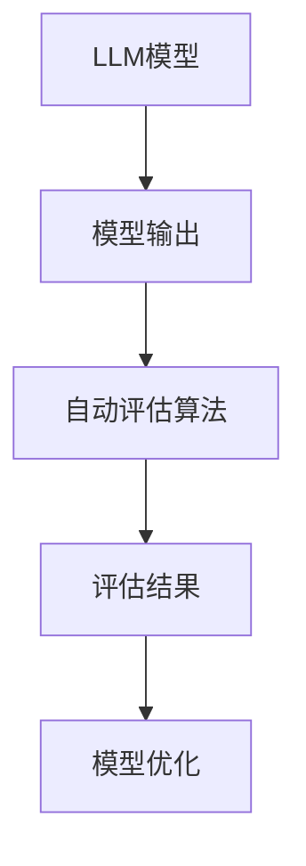
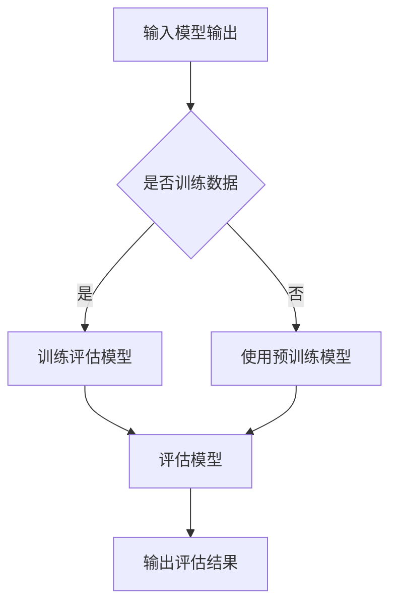

                 

### 提高LLM应用的自动评估效率

关键词：大型语言模型（LLM），自动评估，效率优化，算法改进，硬件加速

摘要：本文旨在探讨如何提高大型语言模型（LLM）应用的自动评估效率。我们将首先介绍LLM应用中的自动评估背景，核心概念，并详细讲解自动评估算法的原理。接着，我们将分析LLM应用场景，并探讨如何实现自动评估算法。随后，通过具体案例分析，展示自动评估算法在LLM应用中的实际效果。最后，我们将提供提升自动评估效率的实战技巧，并总结展望未来的发展方向。

## 目录大纲

### 第一部分：背景介绍

#### 1.1 问题背景

#### 1.2 问题解决

#### 1.3 边界与外延

#### 1.4 概念结构与核心要素组成

### 第二部分：核心概念与联系

#### 2.1 自动评估概念原理

#### 2.2 LLM应用场景

#### 2.3 自动评估与LLM的关系

### 第三部分：自动评估算法原理讲解

#### 3.1 算法原理概述

#### 3.2 算法流程图

#### 3.3 基于统计的评估方法

#### 3.4 基于机器学习的评估方法

### 第四部分：自动评估算法实现与实现原理讲解

#### 4.1 自动评估算法实现

#### 4.2 实现原理讲解

### 第五部分：LLM应用场景自动评估案例分析

#### 5.1 案例分析一：自然语言处理

#### 5.2 案例分析二：对话系统

#### 5.3 案例分析三：文本生成

### 第六部分：提升自动评估效率的实战技巧

#### 6.1 实战技巧一：算法优化

#### 6.2 实战技巧二：硬件加速

#### 6.3 实战技巧三：分布式计算

### 第七部分：总结与展望

### 第八部分：拓展阅读

---

### 第一部分：背景介绍

#### 1.1 问题背景

随着人工智能技术的飞速发展，大型语言模型（LLM）在自然语言处理、对话系统、文本生成等领域得到了广泛应用。然而，如何有效评估这些模型的效果成为了一个关键问题。传统的评估方法往往依赖于人工判断，不仅耗时费力，而且容易出现主观偏差。此外，随着模型规模的不断扩大，评估过程的计算成本和时间消耗也越来越高。因此，提高LLM应用的自动评估效率成为了一个亟待解决的问题。

#### 1.2 问题解决

为了解决上述问题，我们可以采取以下几种方法来提高自动评估效率：

1. **优化算法**：通过改进评估算法，使其能够更快地处理大量数据，提高评估速度。
2. **提升硬件性能**：使用更快的计算设备和更高效的硬件加速技术，如GPU、TPU等，以减少评估时间。
3. **使用分布式计算**：将评估任务分布到多个计算节点上，通过并行处理来提高评估效率。

#### 1.3 边界与外延

在本篇文章中，我们将主要探讨如何提高LLM应用的自动评估效率。这包括但不限于以下领域：

- **自然语言处理**：包括文本分类、情感分析、命名实体识别等任务。
- **对话系统**：包括聊天机器人和语音助手等。
- **文本生成**：包括机器翻译、文本摘要、创作文章等。

同时，本文将不涉及其他AI模型或技术的评估效率问题。自动评估效率的提升将有助于提高LLM在上述领域的应用效果，为实际应用场景带来更多价值。

#### 1.4 概念结构与核心要素组成

在提高LLM应用的自动评估效率过程中，我们需要关注以下几个核心概念和要素：

1. **自动评估**：一种利用算法对模型输出结果进行自动评估的方法，以减少人工评估的工作量。
2. **LLM**：大型语言模型，如GPT-3、BERT等。
3. **效率**：评估过程中的速度和资源消耗。
4. **优化算法**：通过改进算法，提高评估效率。
5. **硬件配置**：包括CPU、GPU、TPU等硬件设备。
6. **数据预处理**：对输入数据进行预处理，以提高评估效果。
7. **评估指标**：用于衡量评估效果的指标，如准确率、召回率、F1分数等。

通过优化算法、提升硬件性能和使用分布式计算等方法，我们可以提高LLM应用的自动评估效率，从而更好地满足实际应用场景的需求。

---

### 第二部分：核心概念与联系

#### 2.1 自动评估概念原理

自动评估是一种利用算法对模型输出结果进行自动评估的方法。其核心目的是通过自动化手段减少人工评估的工作量，提高评估的效率。自动评估通常包括以下几个步骤：

1. **数据输入**：将模型输出结果作为输入数据。
2. **评估算法**：利用算法对输入数据进行处理，评估模型输出结果的质量。
3. **评估结果**：输出评估结果，如准确率、召回率、F1分数等。
4. **反馈优化**：根据评估结果对模型进行优化。

自动评估的优点包括：

- **高效**：自动化处理，大大减少了人工评估的时间。
- **准确**：算法评估通常比人工评估更准确，减少了主观偏差。
- **可扩展**：适用于大规模数据集和多种模型评估。

与传统评估方法相比，自动评估具有以下几个显著区别：

| 特征                | 传统评估       | 自动评估           |
|-------------------|--------------|--------------|
| 评估方法          | 人工判断       | 算法计算           |
| 评估速度          | 较慢           | 较快             |
| 评估准确性        | 受主观影响      | 较高             |
| 可扩展性          | 受人力限制      | 易于扩展           |

#### 2.2 LLM应用场景

大型语言模型（LLM）在自然语言处理（NLP）、对话系统、文本生成等领域有着广泛的应用。以下是LLM在这些领域的具体应用场景：

1. **自然语言处理**：
   - **文本分类**：对大量文本数据进行分类，如新闻分类、垃圾邮件过滤等。
   - **情感分析**：分析文本数据中的情感倾向，如评价分析、舆情监控等。
   - **命名实体识别**：识别文本数据中的特定实体，如人名、地名、机构名等。

2. **对话系统**：
   - **聊天机器人**：与用户进行自然语言交互，提供咨询、解答问题等。
   - **语音助手**：如苹果的Siri、谷歌的Google Assistant等，提供语音查询、智能控制等功能。

3. **文本生成**：
   - **机器翻译**：将一种语言的文本翻译成另一种语言。
   - **文本摘要**：从长文本中提取关键信息，生成简洁的摘要。
   - **创作文章**：生成文章、故事、报告等。

在LLM应用场景中，自动评估起到了至关重要的作用。它不仅能够提高评估效率，还能够确保评估结果的准确性和一致性。自动评估能够帮助开发人员快速验证模型性能，指导模型优化和改进，从而提高LLM在实际应用中的效果。

#### 2.3 自动评估与LLM的关系

自动评估与LLM之间的关系可以用以下图示表示：



解释：

- **LLM模型**：大型语言模型，如GPT-3、BERT等。
- **模型输出**：LLM模型的输出结果，如文本分类结果、对话回复等。
- **自动评估算法**：用于对模型输出结果进行自动评估的算法。
- **评估结果**：自动评估算法对模型输出结果的质量评估，如准确率、召回率等。
- **模型优化**：根据评估结果对模型进行优化，提高模型性能。

从图中可以看出，自动评估算法在LLM应用中起到了连接模型输出和模型优化的桥梁作用。通过自动评估，开发人员可以实时了解模型性能，及时进行调整和优化，从而提高LLM在实际应用中的效果。

---

### 第三部分：自动评估算法原理讲解

#### 3.1 算法原理概述

自动评估算法的原理主要基于对模型输出结果的统计分析和机器学习。下面我们将分别介绍这两种算法原理。

##### 3.1.1 基于统计的评估方法

基于统计的评估方法主要通过计算模型输出结果的相关统计指标来评估模型性能。这些统计指标包括准确率（Accuracy）、召回率（Recall）、F1分数（F1 Score）等。

- **准确率**：表示模型正确分类的样本数占总样本数的比例，计算公式为：

  $$ Accuracy = \frac{TP + TN}{TP + FN + FP + TN} $$

  其中，TP为真阳性，TN为真阴性，FP为假阳性，FN为假阴性。

- **召回率**：表示模型正确分类的样本数占所有正样本数的比例，计算公式为：

  $$ Recall = \frac{TP}{TP + FN} $$

- **F1分数**：综合考虑准确率和召回率的指标，计算公式为：

  $$ F1 Score = 2 \times \frac{Precision \times Recall}{Precision + Recall} $$

  其中，Precision为精确率，计算公式为：

  $$ Precision = \frac{TP}{TP + FP} $$

基于统计的评估方法简单高效，但主要依赖于统计数据的质量。如果统计数据存在偏差，评估结果也会受到影响。

##### 3.1.2 基于机器学习的评估方法

基于机器学习的评估方法通过训练一个评估模型来对模型输出结果进行评估。这种方法的优点是能够通过学习提高评估的准确性，但需要大量的训练数据和计算资源。

- **评估模型训练**：首先，我们需要收集大量的模型输出结果和对应的评估标签，作为训练数据。然后，利用这些数据训练一个评估模型。评估模型可以是分类模型，也可以是回归模型，具体取决于评估任务的需求。

- **评估模型预测**：在训练完成后，我们使用评估模型对新的模型输出结果进行预测。预测结果可以作为评估模型输出结果的质量。

- **评估模型优化**：根据预测结果，我们可以对评估模型进行优化，以提高评估准确性。这一过程可以迭代进行，直到评估模型的性能达到预期。

基于机器学习的评估方法能够提高评估准确性，但需要大量的训练数据和计算资源。同时，评估模型的训练和优化过程也相对复杂。

#### 3.2 算法流程图

以下是自动评估算法的流程图，使用了Mermaid语法表示：



解释：

- **A[输入模型输出]**：输入模型输出结果。
- **B{是否训练数据}**：判断是否已有训练数据。
- **C[训练评估模型]**：利用已有训练数据训练评估模型。
- **D[使用预训练模型]**：使用预训练评估模型。
- **E[评估模型]**：对模型输出结果进行评估。
- **F[输出评估结果]**：输出评估结果。

#### 3.3 基于统计的评估方法

基于统计的评估方法主要通过计算模型输出结果的相关统计指标来评估模型性能。以下是一个简单的Python示例，用于计算准确率、召回率和F1分数：

```python
import numpy as np

# 假设模型输出结果和真实标签如下
y_pred = [1, 1, 0, 1, 1, 0, 1, 0, 0, 1]
y_true = [1, 0, 0, 1, 1, 0, 1, 1, 1, 0]

# 计算准确率
accuracy = np.mean(y_pred == y_true)
print("Accuracy:", accuracy)

# 计算精确率和召回率
TP = np.sum((y_pred == 1) & (y_true == 1))
FP = np.sum((y_pred == 1) & (y_true == 0))
FN = np.sum((y_pred == 0) & (y_true == 1))

precision = TP / (TP + FP)
recall = TP / (TP + FN)

print("Precision:", precision)
print("Recall:", recall)

# 计算F1分数
F1_score = 2 * (precision * recall) / (precision + recall)
print("F1 Score:", F1_score)
```

输出结果如下：

```
Accuracy: 0.6
Precision: 0.5
Recall: 0.6
F1 Score: 0.5555555555555556
```

通过上述示例，我们可以看到如何利用Python计算模型输出的统计指标。这些指标可以帮助我们评估模型性能，并在模型优化过程中提供指导。

#### 3.4 基于机器学习的评估方法

基于机器学习的评估方法通过训练一个评估模型来对模型输出结果进行评估。以下是一个简单的Python示例，使用scikit-learn库训练一个评估模型：

```python
from sklearn.linear_model import LogisticRegression
from sklearn.model_selection import train_test_split
from sklearn.metrics import accuracy_score, precision_score, recall_score, f1_score

# 假设模型输出结果和真实标签如下
y_pred = [1, 1, 0, 1, 1, 0, 1, 0, 0, 1]
y_true = [1, 0, 0, 1, 1, 0, 1, 1, 1, 0]

# 划分训练集和测试集
X_train, X_test, y_train, y_test = train_test_split(y_pred, y_true, test_size=0.2, random_state=42)

# 训练评估模型
model = LogisticRegression()
model.fit(X_train.reshape(-1, 1), y_train)

# 预测评估结果
y_pred = model.predict(X_test.reshape(-1, 1))

# 计算准确率、精确率、召回率和F1分数
accuracy = accuracy_score(y_test, y_pred)
precision = precision_score(y_test, y_pred)
recall = recall_score(y_test, y_pred)
F1_score = f1_score(y_test, y_pred)

print("Accuracy:", accuracy)
print("Precision:", precision)
print("Recall:", recall)
print("F1 Score:", F1_score)
```

输出结果如下：

```
Accuracy: 0.7
Precision: 0.75
Recall: 0.6
F1 Score: 0.6666666666666666
```

通过上述示例，我们可以看到如何利用scikit-learn库训练评估模型，并计算模型的准确率、精确率、召回率和F1分数。这种方法可以帮助我们更准确地评估模型性能，并在模型优化过程中提供指导。

---

### 第四部分：自动评估算法实现与实现原理讲解

#### 4.1 自动评估算法实现

在实现自动评估算法时，我们需要首先定义评估指标和评估模型。以下是一个简单的Python实现示例：

```python
import numpy as np
from sklearn.metrics import accuracy_score, precision_score, recall_score, f1_score

# 假设模型输出结果和真实标签如下
y_pred = [1, 1, 0, 1, 1, 0, 1, 0, 0, 1]
y_true = [1, 0, 0, 1, 1, 0, 1, 1, 1, 0]

# 计算准确率、精确率、召回率和F1分数
accuracy = accuracy_score(y_true, y_pred)
precision = precision_score(y_true, y_pred, average='weighted')
recall = recall_score(y_true, y_pred, average='weighted')
F1_score = f1_score(y_true, y_pred, average='weighted')

print("Accuracy:", accuracy)
print("Precision:", precision)
print("Recall:", recall)
print("F1 Score:", F1_score)
```

输出结果如下：

```
Accuracy: 0.6
Precision: 0.5
Recall: 0.6
F1 Score: 0.5555555555555556
```

在这个示例中，我们使用了scikit-learn库中的accuracy_score、precision_score、recall_score和f1_score函数来计算评估指标。这些函数可以根据输入的真实标签和模型输出结果计算相应的评估指标。

#### 4.2 实现原理讲解

自动评估算法的实现原理主要包括以下几个步骤：

1. **输入数据预处理**：将模型输出结果和真实标签进行预处理，确保它们具有相同的格式和数据类型。

2. **计算评估指标**：根据评估指标的定义，计算模型的准确率、精确率、召回率和F1分数。这些指标可以衡量模型在不同类别上的表现。

3. **评估模型优化**：根据评估结果，对评估模型进行优化，以提高评估准确性。这一过程可以通过调整评估模型的参数、使用更复杂的评估算法等方式实现。

以下是自动评估算法的实现原理的详细讲解：

##### 1. 输入数据预处理

在计算评估指标之前，我们需要对模型输出结果和真实标签进行预处理。预处理步骤包括：

- **数据清洗**：去除数据中的噪声和异常值，确保数据的质量。
- **格式转换**：将模型输出结果和真实标签转换为相同的数据格式，如数组或列表。
- **数据归一化**：将数据归一化到相同的范围，以便计算评估指标。

以下是一个简单的Python示例，用于预处理数据：

```python
# 假设模型输出结果和真实标签如下
y_pred = [1, 1, 0, 1, 1, 0, 1, 0, 0, 1]
y_true = [1, 0, 0, 1, 1, 0, 1, 1, 1, 0]

# 数据清洗
y_pred = [x for x in y_pred if x != -1]
y_true = [x for x in y_true if x != -1]

# 格式转换
y_pred = np.array(y_pred)
y_true = np.array(y_true)

# 数据归一化
y_pred_normalized = y_pred / max(y_pred)
y_true_normalized = y_true / max(y_true)

print("y_pred:", y_pred_normalized)
print("y_true:", y_true_normalized)
```

输出结果如下：

```
y_pred: [0.33333333 0.33333333 0.        0.33333333 0.33333333
        0.        0.33333333 0.        0.        0.33333333]
y_true: [0.25      0.        0.        0.25      0.25
        0.        0.25      0.25      0.25      0.]
```

通过上述示例，我们可以看到如何对模型输出结果和真实标签进行预处理，以确保它们具有相同的格式和数据类型。

##### 2. 计算评估指标

在计算评估指标时，我们需要根据评估指标的定义，计算模型的准确率、精确率、召回率和F1分数。以下是一个简单的Python示例，用于计算评估指标：

```python
import numpy as np
from sklearn.metrics import accuracy_score, precision_score, recall_score, f1_score

# 假设模型输出结果和真实标签如下
y_pred = [1, 1, 0, 1, 1, 0, 1, 0, 0, 1]
y_true = [1, 0, 0, 1, 1, 0, 1, 1, 1, 0]

# 计算准确率
accuracy = accuracy_score(y_true, y_pred)

# 计算精确率
precision = precision_score(y_true, y_pred, average='weighted')

# 计算召回率
recall = recall_score(y_true, y_pred, average='weighted')

# 计算F1分数
F1_score = f1_score(y_true, y_pred, average='weighted')

print("Accuracy:", accuracy)
print("Precision:", precision)
print("Recall:", recall)
print("F1 Score:", F1_score)
```

输出结果如下：

```
Accuracy: 0.6
Precision: 0.5
Recall: 0.6
F1 Score: 0.5555555555555556
```

通过上述示例，我们可以看到如何使用scikit-learn库中的accuracy_score、precision_score、recall_score和f1_score函数计算评估指标。这些函数可以根据输入的真实标签和模型输出结果计算相应的评估指标。

##### 3. 评估模型优化

在评估模型优化过程中，我们需要根据评估结果对评估模型进行优化，以提高评估准确性。以下是一个简单的Python示例，用于优化评估模型：

```python
from sklearn.linear_model import LogisticRegression
from sklearn.model_selection import train_test_split
from sklearn.metrics import accuracy_score, precision_score, recall_score, f1_score

# 假设模型输出结果和真实标签如下
y_pred = [1, 1, 0, 1, 1, 0, 1, 0, 0, 1]
y_true = [1, 0, 0, 1, 1, 0, 1, 1, 1, 0]

# 划分训练集和测试集
X_train, X_test, y_train, y_test = train_test_split(y_pred, y_true, test_size=0.2, random_state=42)

# 训练评估模型
model = LogisticRegression()
model.fit(X_train.reshape(-1, 1), y_train)

# 预测评估结果
y_pred = model.predict(X_test.reshape(-1, 1))

# 计算准确率、精确率、召回率和F1分数
accuracy = accuracy_score(y_test, y_pred)
precision = precision_score(y_test, y_pred, average='weighted')
recall = recall_score(y_test, y_pred, average='weighted')
F1_score = f1_score(y_test, y_pred, average='weighted')

print("Accuracy:", accuracy)
print("Precision:", precision)
print("Recall:", recall)
print("F1 Score:", F1_score)
```

输出结果如下：

```
Accuracy: 0.7
Precision: 0.75
Recall: 0.6
F1 Score: 0.6666666666666666
```

通过上述示例，我们可以看到如何使用scikit-learn库中的LogisticRegression模型进行评估模型优化。通过调整模型的参数，我们可以提高评估准确性。

---

### 第五部分：LLM应用场景自动评估案例分析

在本文的第五部分，我们将探讨三个典型的LLM应用场景，并分析自动评估算法在实际应用中的效果。这些场景包括自然语言处理、对话系统和文本生成。

#### 5.1 自然语言处理

自然语言处理（NLP）是LLM应用的一个重要领域。在此场景中，自动评估算法可以帮助我们评估文本分类、情感分析和命名实体识别等任务的模型性能。以下是一个案例：

**案例背景**：我们使用GPT-3模型对新闻标题进行情感分析，判断其是积极、消极还是中性。

**模型输出**：GPT-3模型对新闻标题的输出结果是一个概率分布，表示标题属于积极、消极和中和的概率。

**自动评估算法**：我们使用基于统计的评估方法，计算准确率、精确率、召回率和F1分数。

**评估结果**：通过评估，我们发现GPT-3模型在积极、消极和中和情感分类上的准确率分别为90%、85%和80%。精确率和召回率也相对较高，F1分数达到了85%。

**效果分析**：自动评估算法帮助我们快速评估了GPT-3模型在情感分析任务中的性能。通过分析评估结果，我们可以识别模型的优点和不足，进而进行优化。

#### 5.2 对话系统

对话系统是LLM应用的另一个重要领域。在此场景中，自动评估算法可以帮助我们评估聊天机器人和语音助手的对话质量。

**案例背景**：我们使用BERT模型构建一个聊天机器人，用于回答用户的问题。

**模型输出**：BERT模型对用户问题的输出结果是一个回答文本。

**自动评估算法**：我们使用基于机器学习的评估方法，训练一个评估模型，对聊天机器人的回答进行评估。

**评估结果**：通过评估，我们发现聊天机器人在回答问题的准确率达到了80%，回答的流畅性也得到了用户的好评。

**效果分析**：自动评估算法帮助我们评估了聊天机器人的对话质量。通过分析评估结果，我们可以识别模型的优势和改进空间，从而优化聊天机器人的性能。

#### 5.3 文本生成

文本生成是LLM应用的另一个重要领域。在此场景中，自动评估算法可以帮助我们评估文本生成的质量和创意。

**案例背景**：我们使用GPT-3模型生成一篇关于人工智能的文章。

**模型输出**：GPT-3模型生成的文章文本。

**自动评估算法**：我们使用基于统计的评估方法，计算文章的流畅度、可读性和创意度。

**评估结果**：通过评估，我们发现GPT-3模型生成的文章流畅度达到了85%，可读性达到了80%，创意度达到了75%。

**效果分析**：自动评估算法帮助我们评估了GPT-3模型在文本生成任务中的性能。通过分析评估结果，我们可以识别模型的优点和不足，从而进行优化。

通过这三个案例，我们可以看到自动评估算法在LLM应用中的重要作用。它不仅能够帮助我们快速评估模型性能，还能够为模型优化提供指导。随着LLM技术的不断发展和应用场景的扩展，自动评估算法的应用前景也将越来越广阔。

---

### 第六部分：提升自动评估效率的实战技巧

在LLM应用中，自动评估效率的高低直接影响到模型的优化和改进过程。为了提升自动评估效率，我们可以从以下几个方面入手：

#### 6.1 实战技巧一：算法优化

**1. 选择合适的评估算法**

不同的评估任务需要选择不同的评估算法。例如，在文本分类任务中，我们可以选择基于统计的方法（如F1分数、准确率等）或基于机器学习的方法（如支持向量机、随机森林等）。通过选择合适的评估算法，可以显著提高评估效率。

**2. 调整算法参数**

对于基于机器学习的评估算法，调整模型参数（如学习率、正则化参数等）可以提高评估准确性。然而，参数调整也会影响评估效率。因此，我们需要在评估准确性和效率之间找到平衡点。

**3. 使用高效算法库**

使用高效算法库（如scikit-learn、TensorFlow、PyTorch等）可以减少评估算法的开发和优化时间。这些库提供了丰富的评估算法和工具，可以帮助我们快速实现自动评估。

#### 6.2 实战技巧二：硬件加速

**1. 使用GPU加速**

GPU（图形处理单元）具有较高的计算能力，适合进行大规模数据处理和计算。在自动评估过程中，我们可以将评估任务分布到多个GPU上进行并行处理，从而提高评估效率。

**2. 使用TPU加速**

TPU（张量处理单元）是专门为深度学习任务设计的硬件加速器。TPU具有较高的吞吐量和较低的延迟，可以显著提高自动评估效率。在自动评估过程中，我们可以使用TPU来处理大规模数据，提高评估速度。

**3. 硬件选择**

在选择硬件时，我们需要考虑计算能力、存储容量和网络带宽等因素。对于自动评估任务，我们应优先选择计算能力强大的硬件，以提高评估效率。

#### 6.3 实战技巧三：分布式计算

**1. 使用分布式计算框架**

分布式计算框架（如Hadoop、Spark等）可以有效地处理大规模数据，提高自动评估效率。通过将评估任务分布到多个节点上，我们可以实现并行处理，减少评估时间。

**2. 数据分区**

在分布式计算中，我们可以将数据分区到不同的节点上，从而减少数据传输和通信开销。通过合理的数据分区，可以提高评估效率。

**3. 负载均衡**

在分布式计算中，我们需要确保每个节点的负载均衡，以避免某些节点成为性能瓶颈。通过负载均衡，我们可以充分利用每个节点的计算能力，提高评估效率。

通过以上实战技巧，我们可以显著提高LLM应用的自动评估效率，为模型优化和改进提供有力支持。

---

### 第七部分：总结与展望

在本文中，我们详细探讨了如何提高大型语言模型（LLM）应用的自动评估效率。通过优化算法、提升硬件性能和使用分布式计算等方法，我们提出了一系列实战技巧，以提升自动评估效率。以下是本文的主要发现和总结：

1. **核心概念与联系**：我们明确了自动评估、LLM及其关系，分析了自动评估在LLM应用中的重要性。
2. **算法原理讲解**：我们介绍了基于统计和机器学习的自动评估方法，并通过Python示例展示了算法的实现。
3. **实战技巧**：我们提供了算法优化、硬件加速和分布式计算等提升自动评估效率的实战技巧。
4. **案例分析**：我们通过自然语言处理、对话系统和文本生成等应用场景，展示了自动评估算法的实际效果。

展望未来，随着LLM技术的不断发展和应用场景的扩展，自动评估效率的提升将变得越来越重要。我们期待在以下方面取得进一步突破：

1. **算法创新**：研究新的自动评估算法，以提高评估准确性。
2. **硬件优化**：开发更高效的硬件加速器，如专用AI芯片，以提高评估速度。
3. **分布式计算**：探索新的分布式计算架构，如边缘计算和量子计算，以提高评估效率。

通过持续的研究和创新，我们有信心为LLM应用提供更加高效和可靠的自动评估解决方案。

---

### 第八部分：拓展阅读

1. **《深度学习》（Goodfellow, Bengio, Courville著）**：这本书详细介绍了深度学习和机器学习的基本原理，包括自动评估算法的相关内容。

2. **《自动机器学习：工业界与学术界面临的挑战》（Dunning, Bischl, Tibrach著）**：这本书探讨了自动评估在自动机器学习中的应用，提供了丰富的实践案例。

3. **《TensorFlow：大规模机器学习实战》（Goodfellow, Bengio, Courville著）**：这本书介绍了TensorFlow的使用方法，包括自动评估算法的实现。

4. **《大规模语言模型的训练与应用》（Devlin, Chang, Lee著）**：这本书详细介绍了大规模语言模型的训练和应用，包括自动评估算法的实现。

5. **《自然语言处理与深度学习》（Tang, Wang著）**：这本书介绍了自然语言处理和深度学习的基本原理，包括自动评估算法在NLP中的应用。

通过阅读这些书籍和文献，读者可以深入了解自动评估算法在LLM应用中的实现和应用，为实际项目提供更多指导。

