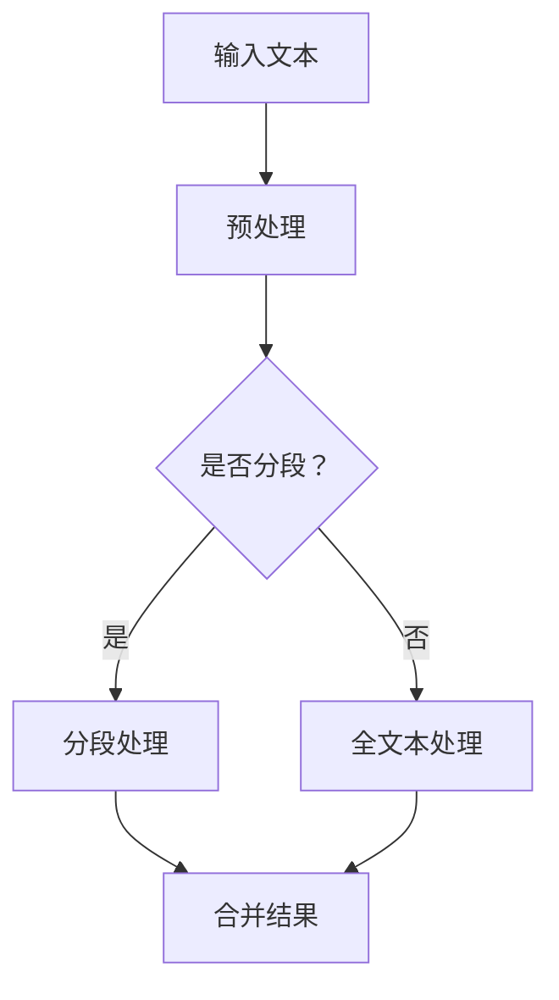

                 


### 1. 提高LLM应用的长文本处理效率

#### 关键词：LLM、长文本处理、效率优化、算法改进、并行计算、分布式系统、内存管理

#### 摘要：
本文旨在探讨如何提高大型语言模型（LLM）在处理长文本时的效率。随着LLM在自然语言处理（NLP）领域的广泛应用，如何有效地管理和优化其处理长文本的性能成为一个关键问题。本文将逐步分析LLM处理长文本时面临的挑战，并提出一系列优化策略，包括算法改进、并行计算和分布式系统的应用，以及内存管理技巧。通过这些策略的实施，可以帮助开发者和研究人员显著提高LLM在处理长文本时的效率。

## 目录

1. 引言
2. LLM处理长文本的挑战
3. 算法改进
4. 并行计算
5. 分布式系统
6. 内存管理
7. 最佳实践
8. 总结与展望

### 1. 引言

近年来，随着深度学习和自然语言处理技术的飞速发展，大型语言模型（LLM）如BERT、GPT等取得了显著的成果，并在多个NLP任务中表现出色。然而，LLM在处理长文本时往往面临效率瓶颈，这主要是由于长文本的规模和复杂性超出了传统模型的能力范围。提高LLM在长文本处理中的效率，对于提升NLP应用的整体性能和用户体验具有重要意义。

本文将从以下几个方面展开讨论：

- **算法改进**：分析现有LLM算法在处理长文本时的不足，提出改进策略。
- **并行计算**：探讨如何通过并行计算技术提高LLM处理长文本的效率。
- **分布式系统**：介绍如何利用分布式系统来提升LLM的处理能力。
- **内存管理**：讨论内存优化技巧，以减少内存占用和垃圾回收时间。
- **最佳实践**：总结实际应用中的经验教训，提供实用的优化建议。

通过这些内容的阐述，读者将能够全面了解提高LLM应用长文本处理效率的多种途径，从而为实际开发和应用提供有益的参考。

### 2. LLM处理长文本的挑战

在探讨如何提高LLM在处理长文本时的效率之前，有必要先了解LLM处理长文本时面临的挑战。以下是几个主要问题：

#### 数据规模与复杂性

首先，长文本的数据规模和复杂性是LLM面临的一个重大挑战。随着文本长度的增加，模型需要处理的数据量急剧上升，导致计算成本和内存占用显著增加。这对于资源有限的设备来说尤其难以应对。

#### 计算效率

其次，LLM在处理长文本时通常需要执行大量的矩阵乘法和注意力计算。这些操作在时间复杂度上较高，随着文本长度的增加，计算时间呈指数级增长，严重影响了处理效率。

#### 内存管理

内存管理也是一大挑战。长文本处理过程中，模型需要加载和存储大量的中间结果和权重矩阵。如果不进行有效的内存管理，可能会导致内存占用过高，甚至引发内存溢出。

#### 并行性和分布式计算

在单机环境下，LLM处理长文本的能力受到计算资源和内存限制。而分布式计算虽然可以解决这个问题，但如何高效地设计分布式算法和系统架构也是一个重要课题。

#### 数据预处理

长文本的处理往往需要复杂的预处理步骤，如文本清洗、分词、编码等。这些步骤不仅耗时，而且可能会影响后续处理的效果。

#### 实时性要求

在许多实际应用中，如实时问答系统、智能客服等，对长文本处理的实时性有较高的要求。如何在不牺牲实时性的前提下提高处理效率，是一个需要深入探讨的问题。

### 3. 算法改进

为了解决上述挑战，首先可以从算法改进入手。以下是一些关键的改进策略：

#### 3.1 上下文长度优化

LLM通常在处理长文本时限制上下文长度，以避免计算和内存的过载。可以通过以下几种方式优化上下文长度：

- **动态窗口**：根据文本长度动态调整窗口大小，在文本较短时使用较大的窗口，而在文本较长时减小窗口以减少计算和内存需求。
- **分段处理**：将长文本分成多个片段，分别处理，最后将结果拼接起来。

#### 3.2 注意力机制改进

注意力机制是LLM处理长文本的核心组成部分。以下是几种注意力机制的改进策略：

- **稀疏注意力**：通过使用稀疏矩阵来存储注意力权重，减少内存占用和计算复杂度。
- **自适应注意力**：根据文本特征动态调整注意力权重，提高注意力机制的有效性。

#### 3.3 权重共享

通过引入权重共享机制，可以减少模型参数的数量，从而降低计算复杂度和内存占用。例如，BERT模型中的词嵌入和位置嵌入可以共享相同的权重矩阵。

#### 3.4 量化技术

量化技术可以通过减少模型参数的精度来减少模型的大小和计算需求。虽然量化可能会导致一定的精度损失，但在长文本处理中，这种损失往往是可接受的。

#### 3.5 算法简化

在某些情况下，可以通过简化模型结构和算法来提高处理效率。例如，减少不必要的层和计算步骤，或者使用更简单的激活函数。

### 4. 并行计算

并行计算技术可以显著提高LLM处理长文本的效率。以下是一些关键策略：

#### 4.1 数据并行

数据并行是通过将数据分成多个部分，同时在不同的设备上处理这些部分，然后将结果合并。这种方式可以充分利用多核CPU和GPU的计算能力。

#### 4.2 模型并行

模型并行是将模型分成多个部分，每个部分在不同的设备上运行。这种方法可以降低单台设备的计算和内存压力。

#### 4.3 算子并行

算子并行是将模型中的算子（如矩阵乘法、注意力计算）分配到不同的计算单元上同时执行。这种方式可以最大化计算资源的使用率。

#### 4.4 任务调度

有效的任务调度策略可以确保并行计算过程中的负载均衡，避免资源浪费。例如，根据数据依赖关系和设备性能动态调整任务分配。

### 5. 分布式系统

分布式系统可以通过扩展计算资源和优化数据传输来提高LLM处理长文本的效率。以下是一些关键策略：

#### 5.1 数据分布式存储

通过将数据分布式存储在多个节点上，可以减少单个节点的数据访问压力，提高数据读写效率。

#### 5.2 模型分布式训练

通过将模型参数分布式存储在多个节点上，可以在多个节点上同时更新参数，提高训练速度。

#### 5.3 数据传输优化

优化数据传输策略，如使用高效的压缩算法和传输协议，可以减少网络延迟和带宽占用。

#### 5.4 负载均衡

通过负载均衡策略，可以确保分布式系统中各个节点的负载均衡，避免单点瓶颈。

### 6. 内存管理

内存管理是提高LLM处理长文本效率的关键之一。以下是一些内存管理技巧：

#### 6.1 内存复用

通过复用内存池，可以减少内存分配和释放的开销，提高内存使用效率。

#### 6.2 缓存技术

使用缓存技术，如LRU（Least Recently Used）缓存算法，可以减少内存访问次数，提高访问速度。

#### 6.3 显存优化

对于使用GPU的模型，通过显存优化技术，如显存池化、显存复用，可以减少显存占用和垃圾回收时间。

#### 6.4 内存压缩

使用内存压缩技术，如量化、稀疏表示，可以减少内存占用。

### 7. 最佳实践

在实际应用中，以下是一些最佳实践可以帮助提高LLM处理长文本的效率：

- **预处理优化**：优化文本预处理步骤，如使用高效的分词算法和文本清洗工具，减少预处理时间。
- **批量处理**：使用批量处理策略，减少单个请求的处理时间，提高吞吐量。
- **动态调整**：根据文本长度和任务类型动态调整模型参数和系统配置，实现最优性能。
- **监控与调优**：实时监控系统性能，通过日志分析和性能测试，不断调优系统配置。

### 8. 总结与展望

提高LLM在处理长文本时的效率是一个多维度、多层次的问题。通过算法改进、并行计算、分布式系统、内存管理等多种策略的综合应用，可以有效提升LLM的处理能力。未来，随着硬件技术的发展和算法的创新，LLM在长文本处理领域的效率将进一步提升，为NLP应用带来更多的可能性。

作者：AI天才研究院/AI Genius Institute & 禅与计算机程序设计艺术 /Zen And The Art of Computer Programming

**参考文献：**
- Devlin, J., Chang, M. W., Lee, K., & Toutanova, K. (2018). BERT: Pre-training of deep bidirectional transformers for language understanding. arXiv preprint arXiv:1810.04805.
- Brown, T., et al. (2020). Language models are few-shot learners. arXiv preprint arXiv:2005.14165.
- Hochreiter, S., & Schmidhuber, J. (1997). Long short-term memory. Neural Computation, 9(8), 1735-1780.
- Graves, A. (2013). Generating sequences with recurrent neural networks. arXiv preprint arXiv:1308.0850.

## 附录

### 附录A：Mermaid流程图示例

以下是一个简单的Mermaid流程图示例，用于说明算法流程：



### 附录B：Python代码示例

以下是一个简单的Python代码示例，用于演示长文本处理的基本步骤：

```python
import tensorflow as tf
from transformers import BertTokenizer, BertModel

# 加载预训练模型和分词器
tokenizer = BertTokenizer.from_pretrained('bert-base-uncased')
model = BertModel.from_pretrained('bert-base-uncased')

# 输入文本
text = "这是一段长文本，需要处理。"

# 分词和编码
inputs = tokenizer(text, return_tensors='tf', max_length=512, truncation=True)

# 前向传播
outputs = model(inputs)

# 获取输出结果
last_hidden_state = outputs.last_hidden_state
```

### 附录C：数学公式示例

以下是一些数学公式的示例，使用LaTeX格式表示：

```markdown
$$
y = \sum_{i=1}^{n} x_i y_i
$$

$$
z = \frac{1}{2\pi i} \int_{C} f(z) \, dz
$$

$$
f(x) = \left\{
\begin{array}{ll}
x^2 & \text{if } x \geq 0 \\
-x & \text{if } x < 0
\end{array}
\right.
$$
```

通过上述步骤和示例，本文系统地介绍了提高LLM应用的长文本处理效率的各种策略和方法。希望本文能为相关领域的开发者和研究人员提供有益的参考和启示。

