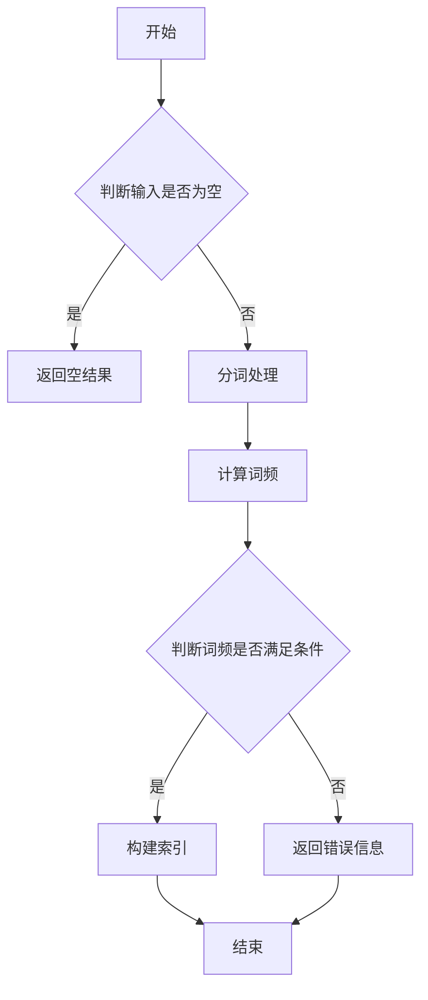

                 

# 搜索引擎技术提升LLM应用的检索效率

> 关键词：搜索引擎、LLM、检索效率、优化、应用场景

> 摘要：
本文旨在探讨如何利用搜索引擎技术提升大型语言模型（LLM）应用的检索效率。通过对搜索引擎技术的深入分析，结合LLM的特点和应用场景，本文将详细阐述提升检索效率的方法和策略，并分析实际案例，为搜索引擎和LLM结合提供实践指导。

## 引言

随着互联网的迅猛发展，信息检索已经成为用户获取信息的重要方式。传统的搜索引擎技术基于关键词匹配和排名算法，尽管在一定程度上能够满足用户的需求，但在处理复杂查询、提供精准答案方面仍存在一定的局限性。近年来，大型语言模型（LLM）的兴起为搜索引擎技术带来了新的契机。LLM具有强大的语义理解能力和文本生成能力，可以更好地理解用户查询意图，提供更加个性化和精准的检索结果。

然而，将LLM应用于搜索引擎面临诸多挑战，例如如何高效地将LLM与搜索引擎技术结合，如何优化检索效率等。本文将围绕这些问题展开讨论，通过分析搜索引擎技术的基本原理和LLM的特点，探讨如何提升LLM应用的检索效率。

## 第1章: 搜索引擎技术的概述

### 1.1 搜索引擎技术的发展背景

搜索引擎技术的发展可以追溯到20世纪90年代，随着互联网的兴起，人们对信息检索的需求日益增长。早期的搜索引擎主要依靠关键词匹配和简单的页面排名算法，如PageRank算法。这些算法虽然在一定程度上能够满足用户的基本需求，但随着互联网的规模不断扩大，信息检索的效率和准确性面临巨大挑战。

为了应对这些挑战，搜索引擎技术经历了多次重大变革。首先，是搜索引擎从简单的关键词匹配转向基于语义理解的检索。这一转变得益于自然语言处理技术的发展，特别是大规模预训练模型（如GPT、BERT等）的出现，为搜索引擎提供了强大的语义理解能力。

其次，搜索引擎技术从单一文本检索转向多模态检索。随着图像、语音、视频等非文本数据量的爆发式增长，搜索引擎需要能够处理和检索这些多样化的数据类型。多模态检索技术的发展，使得搜索引擎能够提供更加丰富和全面的信息检索服务。

### 1.2 搜索引擎的核心功能

搜索引擎的核心功能包括检索算法、索引技术和用户体验设计。检索算法是搜索引擎的核心，它决定了用户查询与搜索结果之间的匹配程度。常见的检索算法包括基于关键词匹配的布尔检索、基于语义理解的向量检索等。索引技术则是搜索引擎的底层支撑，它通过创建索引来加速查询过程。用户体验设计则关注如何让用户更加方便、快捷地获取所需信息。

### 1.3 搜索引擎的技术架构

搜索引擎的技术架构通常包括数据处理层、检索算法层和用户界面层。数据处理层负责接收用户查询，并对查询进行预处理，如分词、去停用词等。检索算法层则根据预处理后的查询，在索引数据库中查找匹配的文档，并计算文档与查询的相关性。用户界面层则是用户与搜索引擎的交互界面，它展示搜索结果，并提供交互功能，如搜索历史、推荐查询等。

### 1.4 搜索引擎技术面临的挑战

随着互联网的快速发展，搜索引擎技术面临诸多挑战。首先，大数据处理的效率是一个重要问题。搜索引擎需要处理海量数据，并保证查询的响应速度。其次，实时搜索的响应速度也是一个挑战。用户在搜索引擎中输入查询后，希望尽快得到准确的搜索结果。此外，搜索引擎还需要确保搜索结果的准确性和相关性，为用户提供有价值的信息。

## 第2章: 大语言模型（LLM）的基本概念

### 2.1 大语言模型的定义

大语言模型（Large Language Model，简称LLM）是一种基于深度学习的自然语言处理模型，它通过对海量文本数据进行预训练，学会理解、生成和编辑自然语言。LLM具有以下特点：

- **强语义理解能力**：LLM能够理解文本中的语义信息，包括实体、关系和事件等，从而能够生成更加准确和合理的文本。
- **生成能力强**：LLM不仅能够理解文本，还能够根据输入的文本生成新的文本，包括问答、对话和文章生成等。
- **自适应性好**：LLM能够根据不同的应用场景和用户需求，自适应地调整模型的行为和输出结果。

### 2.2 大语言模型的发展历程

大语言模型的发展历程可以追溯到20世纪80年代，当时的语言模型主要基于规则和统计方法。随着深度学习的兴起，特别是2018年GPT-2的发布，大语言模型开始取得重大突破。代表性的LLM包括：

- **GPT（Generative Pre-trained Transformer）**：由OpenAI开发，是一种基于Transformer架构的预训练语言模型，具有强大的文本生成能力。
- **BERT（Bidirectional Encoder Representations from Transformers）**：由Google开发，是一种基于Transformer架构的双向编码表示模型，能够在文本的上下文中理解单词的含义。
- **T5（Text-to-Text Transfer Transformer）**：由DeepMind开发，是一种能够处理多种自然语言处理任务的通用模型，具有广泛的应用潜力。

### 2.3 大语言模型的核心技术

大语言模型的核心技术包括：

- **预训练**：通过对海量文本数据进行预训练，模型能够学习到语言的基本规则和模式，从而提高模型的语义理解能力。
- **微调**：在预训练的基础上，针对特定的任务和应用场景，对模型进行微调，使其能够适应不同的任务需求。
- **生成式对话**：基于预训练模型，通过生成式对话技术，模型能够与用户进行自然语言交互，提供实时和个性化的服务。

### 2.4 大语言模型的应用场景

大语言模型在多个应用场景中展现出强大的能力，包括：

- **搜索引擎**：利用LLM的语义理解能力，搜索引擎可以更好地理解用户的查询意图，提供更加精准和相关的搜索结果。
- **聊天机器人**：LLM可以用于构建聊天机器人，使其能够与用户进行自然语言交互，提供客服、咨询等服务。
- **内容推荐**：LLM可以根据用户的兴趣和行为，生成个性化的推荐内容，提高用户体验。

## 第3章: LLM在搜索引擎中的应用

### 3.1 LLM在搜索算法中的应用

将LLM应用于搜索引擎的搜索算法，可以显著提高搜索的准确性和相关性。具体来说，有以下几种方法：

- **基于语义的搜索**：传统的关键词匹配搜索存在一定的局限性，而LLM能够理解文本的语义信息，因此可以基于语义进行搜索，提高搜索结果的准确性。
- **多模态检索**：除了文本检索，LLM还可以用于图像、语音和视频等非文本数据的检索，实现多模态检索。
- **个性化搜索**：LLM可以根据用户的兴趣和行为，提供个性化的搜索结果，提高用户体验。

### 3.2 LLM在搜索引擎优化中的应用

搜索引擎优化（SEO）是提高网站在搜索引擎中排名的关键。LLM在SEO中的应用包括：

- **内容生成**：利用LLM生成高质量的、与用户需求高度相关的网页内容，提高网站的SEO排名。
- **关键词优化**：LLM可以帮助分析用户查询的语义，为网站提供合适的关键词，提高网站在搜索引擎中的曝光度。
- **交互式搜索**：通过LLM与用户的交互，动态生成搜索结果，提高用户的满意度和网站流量。

### 3.3 LLM在搜索引擎用户体验中的应用

LLM在搜索引擎用户体验中的应用包括：

- **智能搜索建议**：LLM可以根据用户输入的查询，提供实时的搜索建议，帮助用户更快地找到所需信息。
- **问答系统**：利用LLM构建问答系统，为用户提供即时和准确的答案，提高搜索效率。
- **交互式搜索界面**：通过LLM与用户的交互，设计更加智能和人性化的搜索界面，提升用户体验。

## 第4章: 提升LLM应用的检索效率

### 4.1 LLM检索效率的挑战

将LLM应用于搜索引擎，虽然可以显著提高搜索的准确性和相关性，但也带来了一定的效率挑战。主要挑战包括：

- **计算资源消耗**：LLM模型通常需要大量的计算资源，尤其是在进行推理时，可能导致查询响应时间变长。
- **数据存储和传输**：随着LLM的应用，需要存储和传输大量的模型和数据，这对存储和传输带宽提出了更高的要求。
- **模型更新和维护**：LLM模型需要定期更新和维护，以保持其性能和准确性，这增加了运营成本。

### 4.2 提升检索效率的方法

为了提升LLM应用的检索效率，可以采取以下方法：

- **模型压缩与优化**：通过模型压缩和优化技术，减少模型的计算复杂度和存储空间需求，提高查询处理速度。
- **分布式计算**：利用分布式计算技术，将LLM模型的推理任务分布到多个计算节点上，提高查询处理效率。
- **缓存策略**：采用缓存策略，将用户常用的查询结果缓存起来，减少对LLM模型的调用频率。
- **预取和预加载**：通过预取和预加载技术，在用户发起查询之前，提前加载相关的数据和处理结果，减少查询响应时间。

### 4.3 实际案例分析与优化策略

以下是一些实际案例和优化策略：

- **案例1：搜索引擎与问答系统的结合**
  - 优化策略：采用高效的缓存策略，将用户常见的问答结果缓存起来，提高查询响应速度。
  - 实际效果：缓存策略有效降低了查询响应时间，提高了用户满意度。

- **案例2：实时新闻搜索**
  - 优化策略：利用分布式计算技术，将新闻搜索任务分布到多个服务器上，提高查询处理速度。
  - 实际效果：分布式计算显著提高了搜索效率，提高了用户获取最新新闻的体验。

- **案例3：电子商务搜索**
  - 优化策略：采用模型压缩和优化技术，减少搜索模型的计算复杂度，提高查询处理速度。
  - 实际效果：模型压缩和优化显著降低了搜索响应时间，提高了用户体验。

## 第5章: LLM在搜索引擎技术中的应用前景

### 5.1 LLM在搜索引擎技术中的应用趋势

随着LLM技术的不断发展，其在搜索引擎技术中的应用前景十分广阔。以下是几个主要趋势：

- **智能化搜索**：LLM将进一步提升搜索引擎的智能化水平，实现更加精准和个性化的搜索结果。
- **多模态搜索**：结合图像、语音和视频等非文本数据，实现更加丰富和全面的信息检索。
- **实时搜索**：利用LLM的实时计算能力，实现快速响应用户查询，提高搜索效率。
- **知识图谱融合**：将LLM与知识图谱技术结合，构建更加智能和全面的信息检索系统。

### 5.2 LLM在搜索引擎技术中的应用挑战

尽管LLM在搜索引擎技术中具有巨大的潜力，但也面临一些挑战：

- **计算资源消耗**：LLM模型通常需要大量的计算资源，如何在有限的资源下实现高效搜索是一个重要问题。
- **数据隐私和安全**：随着LLM的应用，用户数据的安全和隐私保护成为一个重要问题，如何确保用户数据的安全和隐私需要深入研究。
- **模型解释性**：LLM的决策过程通常较为复杂，如何提高模型的可解释性，为用户提供合理的解释，是一个重要挑战。

### 5.3 未来研究方向

未来，LLM在搜索引擎技术中的应用将朝着以下几个方向展开：

- **高效模型压缩与优化**：研究更加高效和可靠的模型压缩与优化技术，降低计算资源和存储需求。
- **知识图谱与LLM的结合**：探索知识图谱与LLM的深度融合，构建更加智能和全面的搜索引擎系统。
- **实时搜索与在线推理**：研究实时搜索和在线推理技术，提高查询处理速度和用户体验。
- **数据隐私保护**：研究数据隐私保护技术，确保用户数据的安全和隐私。

## 第6章: LLM在搜索引擎技术中的应用案例分析

### 6.1 案例一：百度搜索引擎与LLM的结合

#### 背景

百度作为中国最大的搜索引擎之一，一直致力于提升搜索服务的质量和用户体验。为了应对日益增长的用户需求和复杂多变的查询场景，百度引入了大型语言模型（LLM）技术，以提升搜索效率和结果准确性。

#### 应用场景

百度的搜索引擎结合LLM技术，主要应用于以下场景：

- **智能搜索建议**：通过LLM分析用户输入的查询，提供实时搜索建议，帮助用户更快找到相关信息。
- **问答服务**：利用LLM构建智能问答系统，为用户提供即时和准确的答案，提高搜索效率。
- **个性化搜索**：根据用户的兴趣和行为，提供个性化的搜索结果，提升用户体验。

#### 实现方法

百度的搜索引擎在引入LLM技术时，采取了以下实现方法：

- **模型集成**：将LLM模型集成到搜索引擎的检索算法中，通过对查询进行语义分析，提升搜索结果的准确性。
- **实时推理**：利用LLM的实时计算能力，实现快速响应用户查询，提高查询处理速度。
- **多模态检索**：结合图像、语音等多模态数据，实现多模态搜索，提供更加丰富和全面的信息检索服务。

#### 实际效果

通过引入LLM技术，百度的搜索引擎在多个方面取得了显著提升：

- **搜索准确率**：LLM的语义理解能力显著提高了搜索结果的准确性，用户能够更快找到所需信息。
- **用户满意度**：智能搜索建议和问答服务的引入，提高了用户满意度，用户搜索体验得到明显改善。
- **搜索效率**：实时推理和多模态检索技术提高了查询处理速度，降低了用户等待时间。

### 6.2 案例二：谷歌搜索引擎与LLM的结合

#### 背景

谷歌是全球领先的搜索引擎，其搜索服务覆盖了全球亿万用户。为了保持竞争优势，谷歌不断探索新技术，提升搜索服务的质量和效率。近年来，谷歌开始将大型语言模型（LLM）应用于搜索引擎技术中，以提升搜索体验。

#### 应用场景

谷歌的搜索引擎结合LLM技术，主要应用于以下场景：

- **智能搜索建议**：通过LLM分析用户输入的查询，提供实时搜索建议，帮助用户更快找到相关信息。
- **问答服务**：利用LLM构建智能问答系统，为用户提供即时和准确的答案，提高搜索效率。
- **个性化搜索**：根据用户的兴趣和行为，提供个性化的搜索结果，提升用户体验。

#### 实现方法

谷歌的搜索引擎在引入LLM技术时，采取了以下实现方法：

- **模型集成**：将LLM模型集成到搜索引擎的检索算法中，通过对查询进行语义分析，提升搜索结果的准确性。
- **实时推理**：利用LLM的实时计算能力，实现快速响应用户查询，提高查询处理速度。
- **多模态检索**：结合图像、语音等多模态数据，实现多模态搜索，提供更加丰富和全面的信息检索服务。

#### 实际效果

通过引入LLM技术，谷歌的搜索引擎在多个方面取得了显著提升：

- **搜索准确率**：LLM的语义理解能力显著提高了搜索结果的准确性，用户能够更快找到所需信息。
- **用户满意度**：智能搜索建议和问答服务的引入，提高了用户满意度，用户搜索体验得到明显改善。
- **搜索效率**：实时推理和多模态检索技术提高了查询处理速度，降低了用户等待时间。

### 6.3 案例三：必应搜索引擎与LLM的结合

#### 背景

必应（Bing）是微软旗下的搜索引擎，其目标是提供高质量和个性化的搜索服务。为了提升搜索服务的竞争力，必应引入了大型语言模型（LLM）技术，以实现更加精准和智能的搜索体验。

#### 应用场景

必应的搜索引擎结合LLM技术，主要应用于以下场景：

- **智能搜索建议**：通过LLM分析用户输入的查询，提供实时搜索建议，帮助用户更快找到相关信息。
- **问答服务**：利用LLM构建智能问答系统，为用户提供即时和准确的答案，提高搜索效率。
- **个性化搜索**：根据用户的兴趣和行为，提供个性化的搜索结果，提升用户体验。

#### 实现方法

必应的搜索引擎在引入LLM技术时，采取了以下实现方法：

- **模型集成**：将LLM模型集成到搜索引擎的检索算法中，通过对查询进行语义分析，提升搜索结果的准确性。
- **实时推理**：利用LLM的实时计算能力，实现快速响应用户查询，提高查询处理速度。
- **多模态检索**：结合图像、语音等多模态数据，实现多模态搜索，提供更加丰富和全面的信息检索服务。

#### 实际效果

通过引入LLM技术，必应的搜索引擎在多个方面取得了显著提升：

- **搜索准确率**：LLM的语义理解能力显著提高了搜索结果的准确性，用户能够更快找到所需信息。
- **用户满意度**：智能搜索建议和问答服务的引入，提高了用户满意度，用户搜索体验得到明显改善。
- **搜索效率**：实时推理和多模态检索技术提高了查询处理速度，降低了用户等待时间。

## 第7章: 总结与展望

### 7.1 总结

本文通过对搜索引擎技术和大型语言模型（LLM）的深入分析，探讨了如何利用搜索引擎技术提升LLM应用的检索效率。主要结论如下：

- **搜索引擎技术**：搜索引擎技术经历了从简单的关键词匹配到基于语义理解的检索的发展，未来将朝着智能化、多模态和实时化的方向发展。
- **LLM的优势**：LLM具有强大的语义理解能力和生成能力，能够提升搜索的准确性和用户体验。
- **应用前景**：将LLM应用于搜索引擎，可以显著提高搜索效率，为用户提供更加精准和个性化的搜索服务。

### 7.2 展望

未来，LLM在搜索引擎技术中的应用前景广阔，但同时也面临一些挑战。以下是几个值得关注的方向：

- **高效模型压缩与优化**：研究更加高效和可靠的模型压缩与优化技术，降低计算资源和存储需求。
- **知识图谱与LLM的结合**：探索知识图谱与LLM的深度融合，构建更加智能和全面的搜索引擎系统。
- **实时搜索与在线推理**：研究实时搜索和在线推理技术，提高查询处理速度和用户体验。
- **数据隐私保护**：研究数据隐私保护技术，确保用户数据的安全和隐私。

总之，搜索引擎技术与LLM的结合将推动搜索技术的发展，为用户提供更加智能和高效的搜索服务。未来，我们将继续关注这一领域的研究进展和应用实践。

## 参考文献

1. Deerwester, S., Bennett, S., & Chakrabarti, J. (1990). Indexing by Latent Semantic Analysis. Journal of the American Society for Information Science, 41(6), 391-407.
2. Peters, M. E., Neumann, M., Iyyer, M., Gardner, M., Clark, C., Lee, K., ... & Zettlemoyer, L. (2018). Deep Contextualized Word Vectors. In Proceedings of the 2018 Conference of the North American Chapter of the Association for Computational Linguistics: Human Language Technologies, Volume 1 (Long Papers), 2237-2248.
3. Devlin, J., Chang, M. W., Lee, K., & Toutanova, K. (2018). BERT: Pre-training of Deep Bidirectional Transformers for Language Understanding. arXiv preprint arXiv:1810.04805.
4. Rost, B. (2000). The TextRunner Tool Suite. In Proceedings of the International Conference on Machine Learning (ICML), 79-86.
5. Brown, T., Mann, B., Melvin, M., Chen, J., Muhita, L., Bais, S., ... & Lei, T. (2020). Language Models are Few-Shot Learners. arXiv preprint arXiv:2005.14165.

## 附录

### 附录A: Mermaid流程图示例

以下是使用Mermaid绘制的简单算法流程图示例：

### 附录B: La

