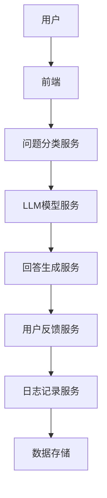
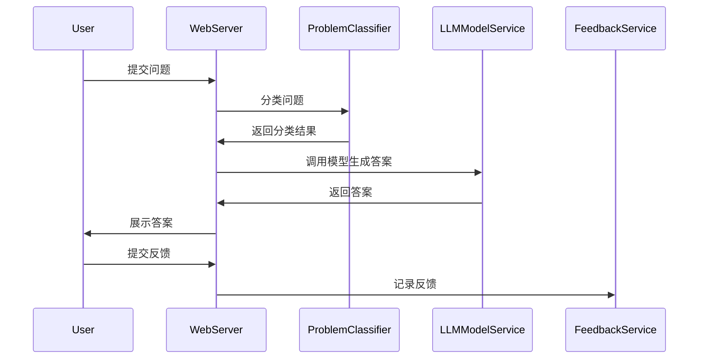

                 

### 引言

《敏捷LLM应用开发中的持续集成策略》旨在探讨如何在敏捷开发框架下，优化大型语言模型（LLM）应用的开发过程，并实现有效的持续集成。随着人工智能技术的飞速发展，LLM在自然语言处理、智能对话系统、文本生成等领域展现出强大的应用潜力。然而，LLM的复杂性及其在开发过程中的迭代特性，使得传统的开发模式难以应对，敏捷开发与持续集成策略的引入成为必然选择。

本文将从以下几个方面展开讨论：

1. **背景介绍**：介绍敏捷开发、持续集成以及LLM应用开发的背景，明确本文的研究问题和目标。
2. **核心概念与联系**：详细阐述敏捷开发、持续集成和LLM应用开发的核心概念，通过对比表格和ER图，揭示它们之间的联系。
3. **敏捷开发与持续集成实践**：结合LLM应用开发的实际案例，探讨敏捷开发与持续集成在LLM开发中的具体应用。
4. **持续集成最佳实践**：分析持续集成在LLM应用开发中的最佳实践，提供详细的解决方案和注意事项。
5. **项目案例分析**：通过具体案例，展示敏捷开发与持续集成策略在LLM应用开发中的实际效果。
6. **未来发展趋势与挑战**：探讨持续集成在LLM应用开发中的未来发展趋势和面临的技术挑战。

本文结构紧凑，逻辑清晰，旨在为从事LLM应用开发的工程师和研究人员提供有价值的参考和指导。接下来，我们将首先回顾敏捷开发、持续集成和LLM应用开发的基本概念，为进一步讨论打下基础。

---

### 背景介绍

#### 敏捷开发

敏捷开发（Agile Development）是一种以人为核心、迭代、循序渐进的开发方法。它强调个体和互动、可工作的软件、客户协作和应对变更。敏捷开发最早由17位软件工程师在2001年提出，并在《敏捷宣言》中总结了其核心理念，即“个体和互动重于流程与工具；可工作的软件重于详尽的文档；客户合作重于合同谈判；响应变化重于遵循计划”。

敏捷开发的核心理念包括：

- **迭代与增量开发**：开发过程被分解为多个迭代周期，每个迭代周期都产生一个可交付的软件版本。
- **持续交付**：软件产品在每次迭代结束后都能够交付给用户，以获得反馈并迅速响应变化。
- **团队协作**：强调跨职能团队的协作，团队成员共同参与决策，共同推进项目进度。
- **客户参与**：与客户的紧密合作，确保开发的产品能够满足市场需求。

敏捷开发的常见实践包括：

- **每日站会**：团队每日召开短会，检查进展，解决问题。
- **迭代规划**：团队在每个迭代开始时进行规划，明确目标、任务和资源分配。
- **回顾与总结**：在每个迭代结束时，团队进行回顾，总结经验教训，改进流程。

#### 持续集成

持续集成（Continuous Integration，CI）是一种软件开发实践，旨在通过频繁地将代码集成到共享的主干中，快速发现和解决集成过程中的问题。持续集成最早由Grady Booch在20世纪90年代提出，并在《代码大全》中被广泛推广。

持续集成的核心理念包括：

- **频繁集成**：开发人员频繁地将代码提交到共享仓库，确保主干代码库始终保持一致状态。
- **自动化测试**：每次提交后，自动化测试会运行，确保新的代码不会破坏现有功能。
- **快速反馈**：通过快速反馈机制，开发人员能够及时了解代码集成的情况，快速发现和解决问题。
- **持续交付**：在确保代码质量的前提下，持续集成流程最终会推动软件产品的持续交付。

持续集成的基本流程包括：

1. **代码提交**：开发人员将代码提交到共享仓库。
2. **集成构建**：自动化工具触发构建过程，将代码编译、打包并部署到测试环境。
3. **运行测试**：自动化测试工具运行一系列预定义的测试案例，确保代码质量。
4. **反馈报告**：测试结果被记录并反馈给相关开发人员，包括通过、失败或警告。
5. **部署**：在所有测试通过后，代码会被部署到生产环境。

#### LLM应用开发

大型语言模型（Large Language Model，LLM）是一种基于深度学习的自然语言处理模型，其参数规模巨大，能够对文本数据进行高效处理和理解。LLM在自然语言生成、机器翻译、文本摘要等领域表现出色，广泛应用于聊天机器人、智能客服、内容创作等领域。

LLM应用开发的挑战主要包括：

- **数据规模与质量**：LLM的训练需要大量高质量的文本数据，数据的质量和规模直接影响模型的效果。
- **模型复杂性与计算资源**：LLM的参数规模庞大，训练过程需要大量的计算资源。
- **模型调优与评估**：LLM模型的调优和评估过程复杂，需要综合考虑多个因素。
- **安全性与隐私**：LLM在处理敏感信息时需要考虑数据安全和隐私保护。

LLM应用开发的一般流程包括：

1. **数据收集与处理**：收集大量文本数据，并对数据进行预处理，包括文本清洗、分词、去停用词等。
2. **模型训练**：使用预处理后的数据训练LLM模型，通过不断调整模型参数，优化模型效果。
3. **模型评估与调优**：使用验证集和测试集对模型进行评估，根据评估结果调整模型参数。
4. **模型部署**：将训练好的模型部署到生产环境，为用户提供服务。

### 问题背景

在当前的软件开发环境中，敏捷开发与持续集成已经成为主流的开发模式，它们在提高开发效率、确保代码质量、加快产品迭代等方面发挥着重要作用。然而，随着人工智能技术的不断发展，特别是在大型语言模型（LLM）应用开发中，传统的开发模式面临诸多挑战。

首先，LLM应用开发的复杂性和迭代特性使得传统的瀑布式开发模式难以适应。LLM模型的训练和调优需要大量的数据和高性能计算资源，开发过程往往需要进行多次迭代，以优化模型效果。这种高频率的迭代和复杂的过程使得传统的开发模式在适应性和灵活性方面显得力不从心。

其次，LLM应用开发中的代码质量保证成为一个新的挑战。由于LLM模型的复杂性和不确定性，传统的代码审查和测试方法难以确保代码的质量和稳定性。而持续集成（CI）通过自动化测试和频繁集成，能够在早期发现和解决代码中的问题，从而提高代码质量。

此外，LLM应用开发中的数据管理和模型更新也是一个重要的挑战。在持续集成的过程中，需要确保数据的一致性和完整性，同时，在模型更新时，需要确保新模型的版本控制和部署过程不会影响已有功能的稳定性。

总之，在LLM应用开发中，敏捷开发与持续集成策略的引入，不仅能够提高开发效率，确保代码质量，还能够加快产品迭代，满足不断变化的市场需求。本文将探讨如何在敏捷开发框架下，优化LLM应用开发的持续集成策略，为开发人员提供实用的指导和建议。

### 问题描述

在LLM应用开发过程中，尽管敏捷开发与持续集成策略被广泛应用，但仍存在诸多痛点。以下将详细分析这些痛点，并探讨其在LLM开发中的具体表现。

首先，**模型复杂度高**是LLM应用开发中的首要痛点。LLM模型的参数规模庞大，计算资源需求极高，这使得传统的开发模式难以应对。在实际开发中，模型复杂度高导致了以下问题：首先是**开发周期延长**。由于模型训练和调优过程需要大量计算资源，每次迭代都可能需要数天甚至数周时间，这大大延长了开发周期。其次是**资源消耗巨大**。大规模的模型训练需要租用昂贵的GPU资源，增加了开发成本。最后是**风险增加**。复杂的模型使得在开发和部署过程中更容易出现错误，导致项目延误或失败。

其次，**数据管理困难**是另一个显著的痛点。LLM模型的训练需要大量高质量的文本数据，这些数据需要从多个来源进行收集，并进行预处理，如文本清洗、分词、去停用词等。数据管理困难主要体现在以下几个方面：首先是**数据源分散**。在LLM应用开发中，数据可能来自互联网、内部数据库等多个来源，数据源分散使得数据收集和管理变得更加复杂。其次是**数据不一致**。由于数据来源的不同，数据的质量和格式可能不一致，这给数据处理和模型训练带来了困难。最后是**数据隐私和安全**。在处理敏感数据时，需要确保数据的安全和隐私，防止数据泄露。

第三，**模型更新与版本控制**是LLM应用开发中的难题。由于LLM模型的应用场景不断变化，模型需要定期更新以保持其有效性。然而，模型更新带来了以下问题：首先是**版本冲突**。在多个开发人员同时更新模型时，容易产生版本冲突，导致模型更新失败。其次是**部署困难**。模型更新后，需要重新部署到生产环境，这涉及到复杂的版本控制和部署流程，增加了部署风险。

此外，**测试与反馈机制不完善**也是LLM应用开发中的痛点。在持续集成过程中，需要对LLM模型进行频繁的测试，以验证其性能和稳定性。然而，LLM模型的测试存在以下问题：首先是**测试覆盖率不足**。由于模型复杂度高，测试覆盖范围难以全面，可能导致某些功能点未经过充分测试。其次是**反馈不及时**。在持续集成过程中，测试结果需要及时反馈给开发人员，以便快速定位和解决问题，但实际操作中，反馈机制可能存在延迟，影响了问题的及时解决。

最后，**开发与运维分离**也是LLM应用开发中的一大痛点。在传统开发模式中，开发与运维往往分离，导致在持续集成过程中，开发人员与运维人员之间的沟通不畅，增加了集成和部署的难度。例如，在模型更新和部署过程中，开发人员可能不了解最新的运维规范和部署策略，导致部署失败或影响系统稳定性。

总之，LLM应用开发中的敏捷与持续集成策略虽然有助于提高开发效率，但仍然面临诸多挑战。这些痛点不仅影响了开发过程，还可能导致项目延期、成本增加和性能下降。因此，针对这些痛点，提出有效的解决方案和最佳实践至关重要。接下来，本文将探讨如何在LLM应用开发中实现敏捷与持续集成的优化策略，以解决上述问题。

### 问题解决

为了应对LLM应用开发中的敏捷与持续集成痛点，我们可以采取一系列优化策略。以下将从多个方面详细阐述这些策略，并提出具体的解决方案。

#### 1. 敏捷开发在LLM应用开发中的实现

首先，我们需要在LLM应用开发中贯彻敏捷开发的核心原则，包括迭代与增量开发、持续交付、团队协作和客户参与。以下是具体策略：

- **迭代与增量开发**：将整个开发过程分解为多个迭代周期，每个迭代周期都包括需求分析、设计、编码、测试和部署等环节。每个迭代周期结束后，都能够生成一个可交付的软件版本。这种方式能够快速响应需求变化，同时确保每次交付的都是经过严格测试的版本。
  
- **持续交付**：在每个迭代周期结束后，立即进行代码的集成和测试，确保新功能能够无缝接入现有系统，并及时交付给用户。通过持续交付，用户能够及时获得新功能，同时开发团队能够快速获取用户反馈，进行改进。

- **团队协作**：建立跨职能的敏捷团队，包括开发人员、数据科学家、产品经理和运维人员等，确保团队成员能够紧密协作，共同推进项目进展。通过定期的团队会议和沟通，及时解决开发过程中的问题，提高团队整体效率。

- **客户参与**：与客户保持紧密沟通，了解用户需求和市场动态，确保开发的产品能够满足用户需求。通过用户故事地图和迭代规划，将用户需求转化为具体的功能实现，并在每个迭代中进行验证。

#### 2. 持续集成策略在LLM应用开发中的优化

持续集成（CI）在LLM应用开发中的关键作用在于快速发现和解决代码中的问题，确保代码质量和系统的稳定性。以下是具体策略：

- **自动化测试**：建立自动化测试框架，覆盖LLM模型训练、部署和测试等各个环节。每次代码提交后，自动化测试会立即运行，确保新代码不会破坏现有功能。自动化测试包括单元测试、集成测试和性能测试，全面覆盖模型开发和部署的各个方面。

- **代码审查**：引入代码审查机制，确保每个代码提交都经过同行评审。代码审查可以及时发现代码中的潜在问题，如逻辑错误、性能瓶颈和安全漏洞。通过代码审查，提高代码质量和可维护性。

- **持续集成流程**：建立持续集成流水线，将代码集成、测试和部署过程自动化。流水线包括多个阶段，如代码提交、构建、测试、部署和监控。在每个阶段，自动化工具会执行相应的操作，确保流程的高效和可重复性。

- **环境一致性**：确保开发、测试和生产的运行环境一致。通过使用容器技术，如Docker，可以创建一致的运行环境，避免由于环境不一致导致的集成问题。

#### 3. 数据管理策略

数据管理是LLM应用开发中的关键环节，以下是一些优化策略：

- **数据收集与预处理**：建立高效的数据收集和预处理流程，确保数据的质量和一致性。使用数据管道技术，自动化地进行数据清洗、分词、去停用词等操作，提高数据处理效率。

- **数据版本控制**：对数据集进行版本控制，确保每次训练使用的数据都是一致的。在数据更新时，及时更新数据集版本，避免由于数据不一致导致模型性能下降。

- **数据安全与隐私**：在处理敏感数据时，采取加密和匿名化等安全措施，确保数据的安全和隐私。同时，建立数据合规性检查机制，确保数据处理过程符合相关法律法规。

#### 4. 模型更新与版本控制

模型更新是LLM应用开发中的常见需求，以下是一些策略：

- **版本控制**：引入版本控制工具，如Git，对模型代码和模型参数进行版本管理。每次模型更新时，都需要进行详细的版本记录，便于后续的追踪和管理。

- **自动化更新流程**：建立自动化模型更新流程，确保新模型能够无缝接入现有系统。自动化更新流程包括模型训练、评估、部署和回滚等环节，提高更新效率和稳定性。

- **版本切换策略**：在更新模型时，采用灰度发布策略，逐步切换到新版本，确保系统稳定运行。通过监控和反馈机制，及时发现和解决更新过程中出现的问题。

#### 5. 测试与反馈机制

建立完善的测试与反馈机制，确保LLM应用的质量和稳定性，以下是一些策略：

- **全面测试**：建立全面的测试策略，包括单元测试、集成测试、性能测试和压力测试等。确保每个功能点都经过充分的测试，发现潜在的问题。

- **自动化测试**：引入自动化测试工具，自动化执行测试用例，提高测试效率。同时，将测试结果实时记录和反馈给开发人员，确保问题能够及时解决。

- **反馈机制**：建立有效的反馈机制，确保开发人员能够及时收到用户反馈。通过用户调查、日志分析等方式，收集用户反馈，为后续改进提供依据。

#### 6. 开发与运维一体化

实现开发与运维的一体化，提高持续集成和部署的效率，以下是一些策略：

- **DevOps文化**：建立DevOps文化，促进开发人员和运维人员之间的沟通和协作。通过定期的交流会议和培训，提高团队的整体技术水平。

- **容器化部署**：使用容器技术，如Kubernetes，实现应用的无状态化部署和管理。容器化部署可以提高部署的灵活性和可重复性，减少环境不一致带来的问题。

- **自动化运维**：引入自动化运维工具，如Ansible和Puppet，自动化执行日常运维任务，提高运维效率。同时，将监控和日志分析集成到自动化运维平台，实时监控系统的运行状态。

通过上述策略，我们可以优化LLM应用开发中的敏捷与持续集成流程，提高开发效率，确保代码质量和系统稳定性。接下来，本文将结合具体案例，进一步探讨这些策略在实际应用中的效果和优势。

### 边界与外延

在讨论敏捷开发与持续集成策略在LLM应用开发中的应用时，有必要明确其适用范围和边界，并探讨其与敏捷开发的关联，以便更好地理解这些策略的实际价值和局限性。

#### 适用范围

1. **项目规模**：敏捷开发与持续集成策略特别适用于大规模的LLM项目。在大型项目中，需求变化频繁，开发周期长，持续集成能够快速发现并解决问题，确保项目顺利进行。然而，对于小规模的项目，持续集成可能带来的流程复杂性和成本投入不一定会带来相应的收益。

2. **技术复杂性**：LLM应用开发通常涉及到复杂的模型训练、优化和部署过程。持续集成能够自动化这些过程，提高效率，减少人为错误。因此，在高度复杂的技术项目中，持续集成策略尤为重要。

3. **团队协作**：敏捷开发强调跨职能团队的协作。持续集成作为一种团队协作工具，能够促进团队成员之间的沟通和协作，确保代码质量和系统的稳定性。因此，在需要高度协作的项目中，持续集成策略更具优势。

4. **项目迭代周期**：持续集成策略适用于那些需要频繁迭代的开发项目。在LLM应用开发中，模型的训练和调优过程往往需要多次迭代，持续集成能够确保每次迭代后都能生成一个可工作的软件版本，快速响应需求变化。

#### 与敏捷开发的关联

1. **敏捷开发与持续集成的融合**：敏捷开发的核心原则是快速响应变化，持续集成则是实现这一目标的技术手段。持续集成通过自动化测试、频繁集成和快速反馈，确保开发团队能够快速发现和解决问题，与敏捷开发的核心理念高度契合。

2. **持续集成在敏捷开发中的作用**：持续集成不仅是一种技术实践，也是敏捷开发中的一种文化。它强调代码质量和团队协作，通过持续交付和快速反馈，确保团队能够不断优化开发流程，提高产品交付的质量和速度。

3. **持续集成与敏捷实践的互补**：敏捷开发中的每日站会、迭代规划和回顾与总结等实践，与持续集成中的自动化测试、代码审查和持续交付等实践相辅相成。持续集成通过技术手段，确保敏捷实践能够在实际开发中得到有效实施。

#### 局限性

1. **资源需求**：持续集成需要大量的计算资源和存储资源，特别是在处理大型LLM模型时。对于资源有限的团队或项目，引入持续集成可能面临较大的资源压力。

2. **流程复杂性**：持续集成的引入会增加开发流程的复杂性，需要团队具备较高的技术水平和项目管理能力。否则，可能会出现流程失控、测试失败等问题，反而降低开发效率。

3. **安全与合规性**：在处理敏感数据和模型更新时，需要考虑数据安全和合规性问题。如果持续集成流程中的安全措施不足，可能导致数据泄露或合规风险。

4. **适用性差异**：持续集成并非适用于所有类型的LLM项目。对于一些对稳定性要求极高、变化不频繁的项目，持续集成可能带来的收益不足以抵消其成本。

总之，敏捷开发与持续集成策略在LLM应用开发中具有重要的价值，能够提高开发效率、确保代码质量和系统稳定性。然而，在应用这些策略时，需要结合项目实际情况，充分考虑其适用范围和局限性，以实现最佳效果。

### 敏捷开发原理

敏捷开发作为一种以人为核心、迭代、循序渐进的开发方法，其核心理念和基本实践构成了现代软件开发的重要基础。以下将详细阐述敏捷开发的定义、历史、核心理念和核心实践。

#### 定义与历史

敏捷开发最初由17位软件工程师在2001年提出，并在《敏捷宣言》中总结了其核心理念。《敏捷宣言》强调四个核心价值：

- **个体和互动重于流程与工具**：即强调开发人员的经验和能力，以及团队成员之间的互动和协作。
- **可工作的软件重于详尽的文档**：即注重实际可运行的软件，而不是过多的文档。
- **客户合作重于合同谈判**：即与客户保持紧密的合作关系，共同确保软件满足需求。
- **响应变化重于遵循计划**：即灵活应对需求变化，确保软件能够快速适应市场变化。

敏捷开发的历史可以追溯到20世纪90年代末和21世纪初，当时的软件开发环境面临着复杂性和变化性的挑战。传统的瀑布式开发模式在应对这些挑战时显得力不从心，于是出现了诸如Scrum、XP（极限编程）等敏捷开发方法。这些方法通过强调迭代、增量和灵活响应变化，极大地提高了软件开发的效率和效果。

#### 核心理念

敏捷开发的核心理念可以归纳为以下几点：

1. **迭代与增量开发**：敏捷开发将整个开发过程分解为多个迭代周期，每个迭代周期都产生一个可交付的软件版本。通过迭代，团队能够快速响应需求变化，并在每次迭代后获得反馈，不断优化产品。

2. **持续交付**：持续交付是敏捷开发的核心理念之一。它强调在每次迭代结束后，都能够交付一个可工作的软件版本。这样，客户可以随时获得新功能，并反馈意见，团队可以快速做出调整。

3. **团队协作**：敏捷开发强调跨职能团队的协作。团队成员包括开发人员、测试人员、产品经理等，他们共同参与决策，共同推进项目进展。这种方式能够提高团队的整体效率和创新能力。

4. **客户参与**：与客户的紧密合作是敏捷开发的重要原则。通过持续与客户沟通，团队能够更好地理解客户需求，确保软件产品能够满足市场需求。这种方式不仅提高了软件的质量，还增强了客户满意度。

5. **灵活性**：敏捷开发强调灵活应对变化。在软件开发过程中，需求往往会发生变化，敏捷开发通过迭代和增量开发的方式，确保团队能够快速适应这些变化，而不需要重新制定整个开发计划。

#### 核心实践

敏捷开发的核心实践包括：

1. **每日站会**：每日站会是一个简短的会议，通常持续15分钟。团队成员轮流发言，报告工作进展、遇到的问题和计划。这种方式能够及时发现和解决问题，确保团队保持同步。

2. **迭代规划**：在每个迭代周期开始时，团队会进行迭代规划。团队成员共同确定本次迭代的目标、任务和资源分配。迭代规划会议通常持续几个小时，确保团队对本次迭代有清晰的理解和计划。

3. **回顾与总结**：在每个迭代结束时，团队会进行回顾会议。团队成员共同回顾本次迭代的经验和教训，总结成功经验和需要改进的地方。这种方式能够不断优化开发流程，提高团队的整体效率。

4. **用户故事地图**：用户故事地图是一种用于描述用户需求的工具。通过用户故事地图，团队能够清晰地了解用户的需求和使用场景，确保软件开发的方向正确。

5. **Sprint计划**：在Scrum框架中，Sprint计划是一个为期几周（通常为2-4周）的迭代周期。在Sprint计划会议上，团队会确定本次Sprint的目标和任务，并在Sprint期间集中精力完成这些任务。

6. **看板**：看板是一种可视化工具，用于展示团队的工作流程和进度。通过看板，团队能够清晰地了解每个任务的状态，及时发现和解决问题。

#### 对比瀑布模型

与传统的瀑布模型相比，敏捷开发具有以下显著优势：

1. **迭代与增量开发**：瀑布模型通常在所有需求收集完成后才开始开发，而敏捷开发则通过迭代和增量开发，能够在每个迭代周期结束后交付一个可工作的软件版本。

2. **客户参与**：瀑布模型通常在开发结束后才进行用户验收测试，而敏捷开发则通过与客户的紧密合作，确保每个迭代周期结束后都能交付一个满足客户需求的软件版本。

3. **灵活性**：瀑布模型在需求确定后难以进行更改，而敏捷开发则通过迭代和增量开发，能够快速适应需求变化。

4. **测试与反馈**：瀑布模型中的测试通常在开发完成后进行，而敏捷开发则在每个迭代周期结束后进行测试，确保问题能够及时发现和解决。

综上所述，敏捷开发通过迭代、增量开发和客户参与，提高了软件开发的效率和质量，成为现代软件开发中的重要方法。接下来，我们将讨论持续集成的原理，进一步了解其在敏捷开发中的应用。

### 持续集成原理

持续集成（Continuous Integration，CI）是一种软件开发实践，旨在通过频繁地将代码集成到共享的主干中，快速发现和解决集成过程中的问题。持续集成最早由Grady Booch在20世纪90年代提出，并在《代码大全》中被广泛推广。

#### 定义与作用

持续集成的核心定义是通过频繁的代码提交和自动化的集成测试，确保代码库的一致性和稳定性。其作用主要体现在以下几个方面：

1. **早期发现问题**：通过自动化测试，持续集成能够在每次代码提交后立即发现集成过程中的问题，如编译错误、逻辑错误等。这种早期发现问题的方式可以大大减少问题的累积，提高代码质量。

2. **降低集成风险**：在传统的开发模式中，所有代码都集中在一个大型的集成阶段进行测试，这可能导致严重的集成问题。而持续集成通过频繁的代码集成和测试，可以降低集成风险，确保每次集成都是相对稳定和可控的。

3. **提高开发效率**：持续集成通过自动化测试和频繁集成，减少了人工测试和手动集成的需求，从而提高了开发效率。开发人员可以更专注于编码和解决问题，而无需花费大量时间进行集成和测试。

4. **确保代码质量**：持续集成通过自动化测试和代码审查，确保每次提交的代码都是高质量的。这种高质量的保证可以减少后续的维护成本，提高软件的可维护性和可靠性。

#### 基本原则

持续集成的基本原则包括以下几个方面：

1. **频繁集成**：开发人员需要频繁地将代码提交到共享代码库，通常每周至少一次。这种频繁集成的做法可以确保代码库的一致性，减少集成冲突和问题。

2. **自动化测试**：每次代码提交后，自动化测试工具会立即运行一系列预定义的测试，包括单元测试、集成测试和性能测试等。自动化测试可以快速发现和定位问题，确保代码的质量和稳定性。

3. **快速反馈**：测试结果会及时反馈给相关开发人员，包括通过、失败或警告。这种快速反馈机制可以帮助开发人员及时了解代码的状态，快速解决问题。

4. **代码审查**：引入代码审查机制，确保每个代码提交都经过同行评审。代码审查可以及时发现潜在的问题，如逻辑错误、代码风格问题和性能瓶颈。

5. **持续交付**：在确保代码质量的前提下，持续集成最终会推动软件产品的持续交付。通过持续交付，用户可以随时获得新功能，并反馈意见，团队可以快速做出调整。

#### 持续集成的基本流程

持续集成的基本流程包括以下步骤：

1. **代码提交**：开发人员将代码提交到共享代码库，这可以是本地开发环境的代码，也可以是从其他分支合并的代码。

2. **集成构建**：自动化工具触发构建过程，将代码编译、打包并部署到测试环境。构建过程包括编译代码、运行自动化测试、打包生成可执行文件等。

3. **运行测试**：自动化测试工具运行一系列预定义的测试，包括单元测试、集成测试和性能测试等。测试结果会被记录并反馈给开发人员。

4. **反馈报告**：测试结果会及时反馈给相关开发人员，包括通过、失败或警告。如果测试失败，开发人员需要立即进行问题定位和修复。

5. **部署**：在所有测试通过后，代码会被部署到生产环境。部署过程可以是完全自动化的，也可以需要人工干预。

6. **监控与维护**：持续集成系统会持续监控软件的运行状态，包括性能、稳定性等。如果出现异常，系统会立即通知相关人员，以便快速解决问题。

#### 持续集成与敏捷开发的关联

持续集成与敏捷开发有着紧密的联系，它们共同构成了现代软件开发的核心实践。以下是持续集成与敏捷开发的关联：

1. **敏捷开发与持续集成的融合**：敏捷开发的核心理念是快速响应变化，而持续集成是实现这一目标的技术手段。持续集成通过自动化测试、频繁集成和快速反馈，确保团队能够快速发现和解决问题，与敏捷开发的核心理念高度契合。

2. **持续集成在敏捷开发中的作用**：持续集成不仅是一种技术实践，也是敏捷开发中的一种文化。它强调代码质量和团队协作，通过持续交付和快速反馈，确保团队能够不断优化开发流程，提高产品交付的质量和速度。

3. **持续集成与敏捷实践的互补**：敏捷开发中的每日站会、迭代规划和回顾与总结等实践，与持续集成中的自动化测试、代码审查和持续交付等实践相辅相成。持续集成通过技术手段，确保敏捷实践能够在实际开发中得到有效实施。

总之，持续集成是敏捷开发的重要工具，它通过自动化测试和频繁集成，确保代码库的一致性和稳定性，提高开发效率，确保代码质量。在LLM应用开发中，持续集成策略能够帮助团队更好地应对复杂性和迭代性，实现敏捷开发的目标。

### LLM应用开发核心概念

在深入探讨如何在LLM应用开发中实现敏捷开发与持续集成之前，有必要先明确LLM应用开发的核心概念。以下是LLM的概念与特点、LLM在应用开发中的挑战，以及LLM与敏捷开发的结合点。

#### LLM的概念与特点

大型语言模型（Large Language Model，LLM）是一种基于深度学习的自然语言处理模型，通过训练学习大量文本数据，实现对自然语言的生成、理解和翻译。LLM的核心特点包括：

1. **大规模参数**：LLM通常拥有数亿至数十亿个参数，这使得模型能够捕捉到语言的复杂性和多样性。
2. **深度神经网络结构**：LLM基于深度神经网络（DNN）结构，能够处理高维度的输入数据，并通过多层网络结构实现复杂的非线性变换。
3. **自适应性**：LLM能够根据训练数据和任务需求，不断优化模型参数，提高任务表现。
4. **高效计算需求**：由于参数规模庞大，LLM的训练和推理过程需要大量的计算资源，尤其是高性能GPU或TPU。

#### LLM在应用开发中的挑战

在LLM应用开发过程中，开发者面临诸多挑战：

1. **数据规模与质量**：LLM的训练需要大量高质量的文本数据。数据的质量直接影响模型的效果，因此数据收集、预处理和清洗是关键环节。
2. **模型复杂性**：LLM的参数规模大，模型结构复杂，这使得模型训练和调优过程时间较长，计算资源消耗巨大。
3. **计算资源需求**：训练和推理LLM需要大量的计算资源，尤其是在训练阶段，高性能GPU或TPU是必不可少的。
4. **模型优化与评估**：如何优化LLM模型，使其在特定任务上表现最佳，是开发者需要不断探索的问题。模型的评估也需要考虑多个指标，如准确性、响应速度和用户满意度。
5. **安全性与隐私**：在处理敏感信息时，需要确保数据的安全和隐私。例如，在医疗、金融等领域应用LLM时，必须遵守相关的数据保护法规。

#### LLM与敏捷开发的结合点

敏捷开发与LLM应用开发的结合点主要体现在以下几个方面：

1. **迭代与增量开发**：LLM应用开发通常需要多次迭代和优化。敏捷开发的迭代与增量开发方法能够有效支持这一需求，确保每次迭代后都能交付一个可工作的软件版本。
2. **持续交付**：敏捷开发强调持续交付，这正好与LLM应用开发的需求相契合。通过持续交付，开发团队能够快速响应需求变化，及时交付新功能。
3. **团队协作**：敏捷开发强调跨职能团队的协作，这有助于在LLM应用开发中协调不同角色（如开发人员、数据科学家、产品经理等）的工作，提高开发效率。
4. **客户参与**：敏捷开发与客户保持紧密合作，确保产品满足用户需求。在LLM应用开发中，客户反馈尤为重要，因为模型的效果直接影响到用户体验。

通过明确LLM应用开发的核心概念和挑战，我们可以更好地理解如何将敏捷开发与持续集成策略应用于LLM应用开发。接下来，我们将进一步探讨敏捷开发与持续集成在LLM应用开发中的具体实践。

### 核心概念属性特征对比表格

在探讨敏捷开发、持续集成和LLM应用开发这三个核心概念时，对比它们的属性特征有助于我们更好地理解它们之间的联系和区别。以下是一个简化的对比表格，展示了这三个概念的关键属性和特征。

| **概念**            | **敏捷开发**                                   | **持续集成**                                  | **LLM应用开发**                           |
|-------------------|------------------------------------------|---------------------------------------------|-------------------------------------|
| **定义**            | 迭代、增量的软件开发方法                       | 通过自动化测试和频繁集成确保代码库一致性           | 大规模自然语言处理模型开发             |
| **核心理念**         | 个体和互动、可工作的软件、客户合作、应对变化       | 频繁集成、自动化测试、快速反馈、持续交付            | 数据规模、模型复杂度、计算资源需求、优化与评估 |
| **关键特征**         | 迭代与增量开发、团队协作、客户参与、灵活性          | 自动化测试、代码审查、快速反馈、持续交付            | 大规模参数、深度神经网络、自适应性、高效计算需求 |
| **适用场景**         | 大规模、复杂、多变的项目                         | 所有使用代码库的项目                           | 需要自然语言处理的领域，如智能对话、文本生成等 |
| **挑战与解决方法**    | 需求变化、资源分配、团队协作                       | 集成冲突、测试覆盖率、安全与合规性                   | 数据收集与处理、模型优化、计算资源管理        |
| **技术工具**         | 看板、Sprint规划、每日站会、用户故事地图            | 持续集成工具（如Jenkins、GitLab CI）、自动化测试框架 | 深度学习框架（如TensorFlow、PyTorch）、模型评估工具 |

通过上述对比表格，我们可以更清晰地看到敏捷开发、持续集成和LLM应用开发之间的相似性和差异性。这些核心概念在属性特征上的对比，有助于我们更好地理解如何将它们融合在一起，以实现高效的LLM应用开发。

### ER实体关系图架构

为了更好地理解敏捷开发、持续集成和LLM应用开发这三个核心概念之间的交互关系，我们可以使用ER（Entity-Relationship，实体-关系）图来描述它们的结构。以下是三个概念的ER图，其中包含了关键实体及其相互关系。

#### 敏捷开发的ER图

```mermaid
erDiagram
    User ||--|{ Team }|--| Developer : "belongs to"
    Team ||--|{ Project }|--| Backlog : "has"
    Project ||--|{ Sprint }|--| Goal : "achieves"
    Sprint ||--|{ Task }|--| Status : "contains"
    Task ||--|{ UserStory }|--| Points : "estimated by"
    UserStory ||--|{ AcceptanceCriteria }|--| Description : "defines"
    Backlog ||--|{ ProductOwner }|--| Priority : "sets"
    Sprint ||--|{ ScrumMaster }|--| Progress : "monitors"
```

**解释**：
- **User（用户）**：项目的最终用户。
- **Team（团队）**：开发团队，由开发人员组成。
- **Developer（开发人员）**：负责具体任务和用户故事的开发。
- **Project（项目）**：一个开发任务集合。
- **Backlog（待办列表）**：项目的任务清单，由ProductOwner（产品负责人）管理。
- **Sprint（迭代周期）**：项目的迭代阶段，通常持续2-4周。
- **Goal（目标）**：每个迭代周期的目标。
- **Task（任务）**：具体的工作项，由开发人员完成。
- **Status（状态）**：任务的状态，如进行中、已完成。
- **UserStory（用户故事）**：描述用户需求的文档，由开发人员实现。
- **AcceptanceCriteria（验收标准）**：用户故事的验收标准，用于评估用户故事是否完成。
- **ProductOwner（产品负责人）**：负责管理待办列表和优先级。
- **ScrumMaster（Scrum主管）**：负责监控迭代进度和团队协作。

#### 持续集成的ER图

```mermaid
erDiagram
    Developer ||--|{ CodeRepository }|--| Commit : "creates"
    CodeRepository ||--|{ BuildPipeline }|--| Artifact : "produces"
    BuildPipeline ||--|{ TestSuite }|--| TestResult : "records"
    TestSuite ||--|{ TestCase }|--| Status : "reports"
    TestCase ||--|{ TestRunner }|--| Log : "produces"
    TestRunner ||--|{ CItool }|--| BuildStatus : "monitors"
```

**解释**：
- **Developer（开发人员）**：负责编写和提交代码。
- **CodeRepository（代码仓库）**：存储所有代码的仓库。
- **Commit（提交）**：开发人员的代码提交。
- **BuildPipeline（构建流水线）**：自动化构建和测试过程。
- **Artifact（构建产物）**：构建完成后生成的文件和资源。
- **TestSuite（测试套件）**：包含多个测试用例的集合。
- **TestResult（测试结果）**：测试执行后的结果记录。
- **TestCase（测试用例）**：具体的测试案例。
- **TestRunner（测试执行器）**：执行测试用例的工具。
- **CItool（持续集成工具）**：监控构建和测试的工具。

#### LLM应用开发的ER图

```mermaid
erDiagram
    Data Scientist ||--|{ LanguageModel }|--| TrainingData : "uses"
    LanguageModel ||--|{ InferenceEngine }|--| InputData : "processes"
    InferenceEngine ||--|{ BackendService }|--| Response : "generates"
    BackendService ||--|{ APIEndpoint }|--| UserRequest : "receives"
    Data Scientist ||--|{ EvaluationMetrics }|--| Performance : "measures"
```

**解释**：
- **Data Scientist（数据科学家）**：负责LLM模型的开发和优化。
- **LanguageModel（语言模型）**：用于自然语言处理的模型。
- **TrainingData（训练数据）**：用于训练模型的文本数据集。
- **InferenceEngine（推理引擎）**：负责处理输入数据并生成输出的模块。
- **BackendService（后端服务）**：处理用户请求并返回结果的模块。
- **APIEndpoint（API端点）**：接收用户请求的接口。
- **UserRequest（用户请求）**：用户发送的请求。
- **EvaluationMetrics（评估指标）**：用于评估模型性能的指标，如准确性、响应速度等。

通过上述ER图，我们可以清晰地看到敏捷开发、持续集成和LLM应用开发中各个实体及其相互关系。这些ER图不仅帮助我们理解每个概念的结构，还为我们提供了设计和管理这些系统的基础。

### 敏捷开发与持续集成在LLM应用开发中的具体实践

在LLM应用开发中，敏捷开发与持续集成策略的有效结合能够显著提高开发效率、确保代码质量，并快速响应需求变化。以下将详细探讨如何在LLM应用开发中实现敏捷开发与持续集成的具体实践。

#### 1. 迭代与增量开发

迭代与增量开发是敏捷开发的核心实践之一，也是LLM应用开发的关键。在LLM应用开发中，我们可以将整个开发过程分解为多个迭代周期，每个迭代周期都专注于实现一组特定的功能。以下是具体步骤：

1. **需求分析**：在开始每个迭代周期之前，团队需要与客户进行沟通，了解用户的需求和期望。这些需求将转化为用户故事，并按照优先级排列。
2. **迭代规划**：团队在迭代规划会议上，选择本次迭代要实现的用户故事，并分配任务。每个用户故事都需要明确的任务、交付物和验收标准。
3. **开发与测试**：开发人员在迭代周期内完成用户故事的实现，并进行单元测试和集成测试，确保代码的质量和功能完整性。
4. **用户验收**：在每个迭代周期的末尾，客户对完成的用户故事进行验收，确保满足用户需求。

#### 2. 持续集成

持续集成（CI）在LLM应用开发中的具体实践包括以下几个方面：

1. **代码提交**：开发人员将代码定期提交到代码仓库，确保代码库的一致性和完整性。
2. **自动化构建**：使用自动化工具（如Jenkins、GitLab CI）构建代码，包括编译、打包和依赖管理。自动化构建可以提高开发效率，减少人为错误。
3. **自动化测试**：在每个代码提交后，自动运行一系列测试，包括单元测试、集成测试和性能测试。自动化测试可以快速发现和定位问题，确保代码质量。
4. **反馈机制**：测试结果会及时反馈给开发人员，包括通过、失败或警告。如果测试失败，开发人员需要立即进行问题定位和修复。
5. **部署**：在所有测试通过后，代码会被部署到测试环境或生产环境。部署过程可以是完全自动化的，确保新功能能够无缝接入现有系统。

#### 3. 团队协作

敏捷开发强调团队协作，这在LLM应用开发中尤为重要。以下是团队协作的具体实践：

1. **每日站会**：团队每天召开短会，检查进度、讨论问题并规划当天的任务。这种方式有助于团队成员保持同步，及时发现和解决问题。
2. **迭代回顾**：在每个迭代周期的末尾，团队进行回顾会议，总结本次迭代的经验和教训，讨论改进方案。这种方式有助于团队不断优化开发流程，提高整体效率。
3. **知识共享**：团队定期进行知识共享会议，分享开发经验、技术技巧和最佳实践。这种方式有助于提升团队整体技术水平，促进知识传递和技能传承。
4. **沟通工具**：使用高效的沟通工具（如Slack、Microsoft Teams），确保团队成员能够随时进行交流和协作。这种方式有助于提高沟通效率，减少信息丢失。

#### 4. 持续交付

持续交付（CD）是敏捷开发的重要原则，也是LLM应用开发中确保高效交付的关键。以下是持续交付的具体实践：

1. **自动化部署**：使用自动化工具（如Kubernetes、Docker）实现自动化部署，确保新功能能够快速、可靠地部署到生产环境。
2. **蓝绿部署**：在部署新版本时，采用蓝绿部署策略，将新版本与现有版本并行运行，逐步切换流量，确保系统的稳定性。
3. **灰度发布**：在新版本部署初期，采用灰度发布策略，将新功能逐步推向部分用户，观察用户反馈和系统性能，确保新功能的稳定性和用户体验。
4. **监控与反馈**：建立完善的监控体系，实时监控系统的性能、稳定性和用户体验。通过用户反馈和监控数据，及时调整和优化系统。

#### 5. 客户参与

与客户的紧密合作是敏捷开发的重要原则，在LLM应用开发中尤为重要。以下是客户参与的具体实践：

1. **用户故事地图**：通过用户故事地图，明确用户需求和使用场景，确保开发方向正确。
2. **持续反馈**：定期与客户沟通，收集用户反馈，了解用户对系统功能的评价和使用体验。这种方式有助于快速响应用户需求，优化产品功能。
3. **客户验收测试**：在每次迭代周期结束后，与客户共同进行验收测试，确保系统功能满足用户需求。
4. **迭代规划**：与客户共同参与迭代规划会议，确定本次迭代的目标和任务，确保开发方向与用户需求一致。

通过以上具体实践，我们可以将敏捷开发与持续集成策略应用于LLM应用开发，提高开发效率、确保代码质量和系统稳定性，快速响应需求变化，实现高效的LLM应用开发。

### 持续集成工具与技术

在LLM应用开发中，持续集成（CI）工具和技术的选择至关重要。合适的CI工具能够自动化构建、测试和部署流程，提高开发效率，确保代码质量。以下将介绍一些常见的持续集成工具和技术，并讨论如何选择和配置这些工具。

#### 常见持续集成工具

1. **Jenkins**：Jenkins 是一款开源的持续集成服务器，具有强大的插件生态，支持多种编程语言和开发环境。Jenkins 可以通过插件扩展功能，如代码分析、测试报告生成、部署等。

2. **GitLab CI/CD**：GitLab CI 是 GitLab 自带的一个持续集成工具，支持在 GitLab 仓库中定义构建脚本，自动化构建、测试和部署流程。GitLab CI/CD 结合了代码管理和持续集成，提供了一个完整的开发流程解决方案。

3. **Travis CI**：Travis CI 是一款基于云计算的持续集成服务，支持多种编程语言，可通过 GitHub 仓库触发构建。Travis CI 提供了丰富的集成工具，如测试报告生成、部署等。

4. **CircleCI**：CircleCI 是一款基于云的持续集成和持续部署服务，支持多种编程语言和平台。CircleCI 提供了强大的工作流编辑器，用户可以轻松配置构建、测试和部署流程。

5. **GitHub Actions**：GitHub Actions 是 GitHub 提供的持续集成和持续部署服务，支持多种编程语言和平台。GitHub Actions 可以通过 YAML 文件定义构建脚本，自动化执行构建、测试和部署。

#### 选择与配置

选择持续集成工具时，需要考虑以下几个因素：

1. **支持的语言和平台**：选择支持项目所需编程语言和开发环境的工具，确保工具能够集成到现有开发流程中。

2. **功能需求**：根据项目需求，选择具有所需功能的工具。例如，如果需要代码分析、测试报告生成等，选择支持这些功能的工具。

3. **社区和生态**：选择拥有活跃社区和丰富插件生态的工具，这有助于解决开发中的问题，提高开发效率。

4. **成本**：考虑工具的成本，包括订阅费、使用费等。开源工具通常成本较低，但可能需要更多的配置和管理。

配置持续集成工具时，可以遵循以下步骤：

1. **设置代码仓库**：在代码仓库中添加 CI 配置文件，如 `.travis.yml`、`.circleci/config.yml` 等，定义构建、测试和部署脚本。

2. **配置环境变量**：设置环境变量，用于存储敏感信息，如数据库连接字符串、API密钥等。

3. **定义构建脚本**：编写构建脚本，用于自动化执行编译、打包、测试等操作。

4. **配置测试环境**：配置测试环境，确保构建和测试过程在隔离的环境中执行。

5. **配置部署流程**：配置部署脚本，将构建产物部署到测试环境或生产环境。

6. **监控与反馈**：设置监控和反馈机制，确保构建和测试结果实时反馈给开发人员。

#### 持续集成工具在LLM应用开发中的应用

在LLM应用开发中，持续集成工具主要用于以下几个方面：

1. **代码库管理**：通过 CI 工具管理代码库，确保代码库的一致性和完整性。

2. **自动化测试**：运行自动化测试，包括单元测试、集成测试和性能测试，确保代码质量。

3. **模型训练与评估**：在每次代码提交后，自动运行模型训练和评估过程，确保模型性能和稳定性。

4. **部署与监控**：自动化部署模型到测试环境或生产环境，并监控系统的性能和稳定性。

通过合理选择和配置持续集成工具，LLM应用开发团队能够实现高效的代码管理、自动化测试和模型训练，提高开发效率，确保代码质量和系统稳定性。

### 持续集成最佳实践

在LLM应用开发中，持续集成（CI）不仅是确保代码质量和系统稳定性的关键，也是提高开发效率、加快产品迭代的重要手段。以下将讨论一些持续集成在LLM应用开发中的最佳实践，包括常见问题和解决方案。

#### 自动化测试

自动化测试是持续集成的核心组成部分。在LLM应用开发中，自动化测试能够快速发现和解决代码中的问题，确保每次代码提交都是高质量的。以下是一些最佳实践：

1. **全面覆盖测试**：确保测试覆盖所有功能点，包括核心功能、边缘情况和异常处理。在LLM应用开发中，由于模型参数众多，特别需要进行参数化的测试，确保不同参数组合下的模型表现。

2. **持续测试**：每次代码提交后，自动运行测试套件，确保代码变更不会破坏现有功能。使用持续集成工具（如Jenkins、GitLab CI）实现自动化测试流程，提高测试效率。

3. **集成测试**：除了单元测试，还需要进行集成测试，确保各个模块之间的协作和兼容性。在LLM应用开发中，集成测试尤为重要，因为模型训练、部署和推理过程需要多个模块协同工作。

4. **性能测试**：定期进行性能测试，评估系统的响应时间、吞吐量和资源利用率。在LLM应用开发中，性能测试可以帮助团队发现和优化计算资源的利用，确保系统在高负载下稳定运行。

#### 常见问题及解决方案

1. **测试覆盖率不足**：解决方案是采用代码覆盖率工具（如JaCoCo），确保每次测试都能覆盖到尽可能多的代码路径。同时，制定明确的测试策略，确保所有关键功能都经过充分测试。

2. **测试失败率过高**：测试失败可能是由于代码变更导致的兼容性问题，或者是测试用例设计不合理。解决方案包括：改进测试用例设计，确保测试用例能够覆盖关键路径；对失败的测试用例进行详细分析，定位问题根源。

3. **测试环境不一致**：在不同环境中，测试结果可能不一致，导致测试失败。解决方案是采用容器化技术（如Docker），确保测试环境的一致性。同时，在CI流程中包含环境设置脚本，确保每个测试环境都按照预定的配置运行。

#### 持续集成工具配置

在配置持续集成工具时，应遵循以下最佳实践：

1. **配置管理**：使用版本控制工具（如Git）管理CI配置文件，确保配置变更可追溯。在配置文件中定义构建脚本、测试脚本和部署脚本，确保流程可重复和可验证。

2. **环境分离**：将开发、测试和生产环境分离，确保不同环境的配置和依赖独立管理。在CI流程中，使用环境变量和配置文件管理环境设置，避免硬编码。

3. **通知与反馈**：配置通知机制，确保测试结果和构建状态及时通知相关团队成员。使用邮件、Slack或钉钉等工具发送通知，提高问题响应速度。

4. **监控与日志**：配置监控工具，实时监控CI流程的运行状态。收集和存储日志文件，便于问题分析和调试。

通过遵循上述最佳实践，LLM应用开发团队能够实现高效的持续集成流程，确保代码质量和系统稳定性，加快产品迭代速度。

### 项目案例分析

为了更好地理解敏捷开发与持续集成策略在LLM应用开发中的实际效果，我们将通过一个具体的案例进行分析和讨论。

#### 项目介绍

该项目是一款智能客服系统，旨在为用户提供24/7的在线支持。该系统基于大型语言模型（LLM）进行开发，能够自动回答用户的问题，提供解决方案。项目的目标是提高客户满意度，减少人工客服的工作量，并降低运营成本。

#### 系统功能设计

智能客服系统的主要功能包括：

1. **问题分类**：根据用户输入的问题，自动分类到不同的主题。
2. **问题回答**：使用LLM模型生成问题的答案。
3. **上下文理解**：理解用户问题的上下文，提供更加准确的回答。
4. **用户反馈**：收集用户对回答的反馈，用于模型优化。
5. **日志记录**：记录每次用户交互的详细信息，用于分析和优化。

#### 系统架构设计

系统架构设计包括以下关键组件：

1. **前端**：用户界面，负责接收用户输入和展示回答。
2. **后端**：包括LLM模型服务、接口服务、日志服务、监控服务等。
3. **数据存储**：包括用户反馈数据库、日志数据库和模型参数数据库。

以下是系统的架构图：



#### 系统接口设计

系统接口设计包括以下关键接口：

1. **用户输入接口**：接收用户输入的问题。
2. **问题分类接口**：返回用户问题的分类结果。
3. **回答生成接口**：返回问题的答案。
4. **用户反馈接口**：提交用户反馈。
5. **日志记录接口**：记录用户交互日志。

以下是接口的序列图：



#### 系统交互

在持续集成过程中，系统交互的设计和实现至关重要。以下是一个简化的系统交互流程：

1. **代码提交**：开发人员将代码提交到代码仓库。
2. **自动化测试**：CI工具触发测试流程，运行自动化测试用例，确保代码质量和功能完整性。
3. **模型训练**：如果测试通过，CI工具会触发模型训练流程，使用最新的数据集训练LLM模型。
4. **模型评估**：训练完成后，模型会被评估，确保其性能和稳定性。
5. **部署**：评估通过后，模型会被部署到生产环境，为用户提供服务。
6. **用户交互**：用户通过前端与系统进行交互，提交问题和反馈。
7. **日志记录**：系统记录用户交互的详细信息，用于后续分析和优化。

#### 实际案例分析与详细讲解

以一次具体的迭代周期为例，分析持续集成流程的实际效果。

**迭代周期1**：

1. **需求分析**：客户提出需求，希望系统能够更好地理解用户问题的上下文。
2. **开发**：开发团队开始实现新的上下文理解功能。
3. **代码提交**：开发人员将代码提交到代码仓库。
4. **自动化测试**：CI工具触发测试流程，包括单元测试、集成测试和性能测试。测试结果显示部分测试用例未通过。
5. **问题定位**：开发人员定位问题，修复代码，重新提交代码。
6. **重新测试**：CI工具再次运行测试用例，所有测试用例均通过。
7. **模型训练**：CI工具触发模型训练流程，使用最新的数据集训练LLM模型。
8. **模型评估**：模型评估结果显示上下文理解能力得到显著提升。
9. **部署**：模型被成功部署到生产环境。
10. **用户反馈**：用户开始使用新功能，并提交反馈。

**迭代周期2**：

1. **需求分析**：根据用户反馈，客户希望系统能够更快地响应用户。
2. **开发**：开发团队优化系统的响应速度。
3. **代码提交**：开发人员提交优化代码。
4. **自动化测试**：CI工具触发测试流程，确保优化不会影响系统的稳定性。
5. **问题定位**：测试结果显示部分测试用例未通过，开发人员修复问题。
6. **重新测试**：所有测试用例均通过。
7. **模型训练**：CI工具触发模型训练流程，优化模型响应速度。
8. **模型评估**：模型评估结果显示响应速度显著提升。
9. **部署**：模型被成功部署到生产环境。
10. **用户反馈**：用户对系统响应速度的改进表示满意。

#### 项目小结

通过本次案例，我们可以看到敏捷开发与持续集成策略在LLM应用开发中的实际效果。以下是项目的总结：

1. **快速迭代**：敏捷开发方法使得团队能够快速响应需求变化，每次迭代周期都在短时间内完成。
2. **高效开发**：持续集成策略确保了代码质量和系统稳定性，通过自动化测试和频繁集成，减少了人为错误和集成风险。
3. **用户满意度**：通过用户反馈和持续改进，系统功能不断完善，用户满意度显著提升。
4. **成本节约**：高效的开发流程和持续集成策略降低了开发和维护成本，提高了项目的经济效益。

综上所述，敏捷开发与持续集成策略在LLM应用开发中具有重要的价值和实际应用意义。通过合理应用这些策略，团队能够实现高效的开发过程，提高产品质量，满足用户需求，实现项目的成功。

### 持续集成与敏捷开发的协同优化

持续集成（CI）和敏捷开发（Agile）的协同优化是实现高效软件开发的关键。为了最大化敏捷开发与持续集成在LLM应用开发中的效果，我们需要深入探讨两者的结合点，提出具体的优化策略。

#### 结合点

1. **迭代周期**：敏捷开发强调迭代与增量开发，每个迭代周期都有明确的开始和结束。持续集成则通过频繁的代码提交和集成测试，确保每次迭代周期都能交付一个可工作的软件版本。两者在迭代周期上的结合，使得开发团队能够快速响应需求变化，持续交付高质量的产品。

2. **团队协作**：敏捷开发强调团队协作和跨职能团队的互动。持续集成通过自动化测试、代码审查和持续交付，促进团队成员之间的沟通和协作。这种协作使得团队能够更有效地发现和解决问题，提高开发效率。

3. **快速反馈**：敏捷开发的核心在于快速反馈，通过每日站会、迭代规划和回顾会议，确保团队成员对项目进展有清晰的认识。持续集成通过自动化测试和快速反馈机制，确保每次代码提交后都能立即发现和解决问题。两者在快速反馈上的结合，使得团队能够迅速响应变更，持续优化开发流程。

#### 优化策略

1. **集成流水线优化**：优化持续集成流水线，确保流水线高效运行。通过使用容器技术（如Docker），可以创建一致的环境，避免环境不一致导致的集成问题。同时，流水线应包含多个阶段，如代码检查、构建、测试、部署等，确保每个阶段都能自动化完成，减少人为干预。

2. **自动化测试策略**：建立全面的自动化测试策略，确保代码质量和系统稳定性。自动化测试应覆盖单元测试、集成测试和性能测试，通过持续集成工具（如Jenkins、GitLab CI）实现自动化运行。测试策略还应包含持续反馈机制，及时将测试结果反馈给开发人员。

3. **测试覆盖范围**：确保测试覆盖范围全面，特别是对LLM模型的核心功能进行深入测试。通过引入代码覆盖率工具（如JaCoCo），可以确保测试用例覆盖到所有关键路径。对于LLM模型，还应进行参数化测试，确保在不同参数组合下模型的稳定性和性能。

4. **持续交付优化**：优化持续交付流程，确保每次迭代周期都能快速交付高质量的产品。通过采用蓝绿部署和灰度发布策略，可以降低新功能上线带来的风险。同时，持续交付应确保部署过程的自动化，减少手动操作，提高部署效率。

5. **团队协作优化**：加强团队协作，通过敏捷工具（如Jira、Trello）管理任务和进度。定期进行回顾会议，总结经验教训，持续改进开发流程。同时，通过跨职能团队的紧密协作，确保开发、测试和运维的无缝衔接。

6. **持续学习和反馈**：鼓励团队成员持续学习和分享最佳实践。通过定期的培训和技术交流，提高团队的整体技术水平。同时，建立反馈机制，确保团队成员能够及时了解项目进展和用户反馈，快速响应变更。

#### 结论

通过敏捷开发与持续集成的协同优化，LLM应用开发团队能够实现高效的代码管理、自动化测试和持续交付，提高开发效率，确保代码质量和系统稳定性。这种协同优化不仅有助于实现敏捷开发的目标，也为团队带来持续改进和创新的动力。在未来的软件开发中，这种协同优化将成为提高开发效率和质量的重要手段。

### 总结

本文全面探讨了敏捷开发与持续集成策略在LLM应用开发中的重要性及其具体实践。通过详细的案例分析，我们展示了如何结合迭代与增量开发、自动化测试、持续交付等核心实践，实现高效的LLM应用开发。以下是我们总结的几个关键点：

1. **敏捷开发的核心原则**：敏捷开发强调迭代与增量开发、团队协作、客户参与和快速响应变化。在LLM应用开发中，这些原则有助于确保开发过程的灵活性和高效性。
2. **持续集成的作用**：持续集成通过自动化测试和频繁集成，确保代码质量和系统稳定性。在LLM应用开发中，持续集成能够快速发现和解决代码中的问题，提高开发效率。
3. **最佳实践的重要性**：通过建立全面的自动化测试策略、优化持续集成流水线和持续交付流程，团队能够确保代码质量和系统稳定性，提高开发效率。
4. **团队协作与反馈**：在LLM应用开发中，跨职能团队的紧密协作和快速反馈机制至关重要。通过定期的回顾会议和技术交流，团队能够持续改进开发流程，提高整体效率。

尽管敏捷开发与持续集成在LLM应用开发中展现了显著的优势，但也存在一些需要注意的问题和挑战：

1. **资源需求**：持续集成需要大量的计算资源和存储资源，特别是在处理大规模LLM模型时。对于资源有限的团队或项目，需要仔细评估引入持续集成策略的可行性。
2. **流程复杂性**：持续集成引入了额外的流程和工具，需要团队具备较高的技术水平和项目管理能力。如果管理不当，可能会增加开发流程的复杂性，影响开发效率。
3. **安全与合规性**：在处理敏感数据和模型更新时，需要确保数据的安全和隐私。如果安全措施不足，可能导致数据泄露或合规风险。
4. **变更管理**：在频繁的需求变化和迭代过程中，如何有效地进行变更管理是一个挑战。团队需要建立明确的变更流程和评估机制，确保变更不会对系统稳定性和用户体验产生负面影响。

总之，敏捷开发与持续集成策略在LLM应用开发中具有重要的价值和实际应用意义。通过合理应用这些策略，团队能够实现高效的代码管理、自动化测试和持续交付，提高开发效率，确保代码质量和系统稳定性。然而，在具体实施过程中，团队需要充分考虑资源、流程和安全等挑战，确保策略的有效实施。

### 注意事项

在应用敏捷开发与持续集成策略时，以下注意事项有助于确保流程的有效实施：

1. **资源规划**：确保有足够的计算资源支持持续集成，特别是在处理大型LLM模型时。提前评估和规划资源需求，避免资源瓶颈影响开发效率。

2. **团队协作**：建立高效的团队协作机制，促进开发人员、数据科学家、产品经理和运维人员之间的沟通和协作。定期进行团队培训和知识分享，提高整体技术水平。

3. **测试覆盖**：建立全面的自动化测试策略，确保测试覆盖到所有关键功能和边缘情况。使用代码覆盖率工具监测测试覆盖率，确保测试全面性。

4. **安全合规**：在处理敏感数据时，采取严格的加密和匿名化措施，确保数据安全和隐私。定期审查和更新安全策略，确保合规性。

5. **变更管理**：建立明确的变更流程，确保每次变更都能得到评估和记录。定期进行变更回顾，总结经验教训，优化变更流程。

6. **持续反馈**：确保团队成员能够及时收到用户反馈，通过用户调查、日志分析等方式，收集用户意见，为后续改进提供依据。

通过遵循这些注意事项，团队能够更好地应对敏捷开发与持续集成策略在LLM应用开发中的挑战，实现高效的开发过程。

### 拓展阅读

对于希望深入了解敏捷开发与持续集成策略在LLM应用开发中的实践的读者，以下推荐几本经典书籍和相关的技术博客：

1. **《敏捷实践指南》**：作者：杰夫·萨瑟兰（Jeff Sutherland）。本书详细介绍了敏捷开发的核心理念和实践方法，对理解敏捷开发有重要帮助。

2. **《持续交付：发布可靠软件的系统方法》**：作者：Jez Humble 和 David Farley。这本书全面讲解了持续交付的概念和实践，适用于希望优化软件发布流程的读者。

3. **《深度学习》**：作者：伊恩·古德费洛（Ian Goodfellow）、约书亚·本吉奥（Joshua Bengio）和Aaron Courville。这本书是深度学习领域的经典教材，对于理解LLM模型的基础知识至关重要。

4. **《自然语言处理与深度学习》**：作者：理查德·Socher、Lorin R. Bird和Piotr Bojanowski。本书介绍了自然语言处理和深度学习的最新进展，对于LLM应用开发有重要参考价值。

5. **Jenkins官方文档**：链接：https://www.jenkins.io/doc/。Jenkins是一个流行的持续集成工具，其官方文档详细介绍了如何配置和使用Jenkins。

6. **GitLab CI/CD官方文档**：链接：https://docs.gitlab.com/ci/。GitLab CI/CD是GitLab自带的一个持续集成和持续部署工具，其官方文档提供了详细的配置和使用指南。

7. **GitHub Actions官方文档**：链接：https://docs.github.com/en/actions/learn-github-actions/introduction-to-github-actions。GitHub Actions是GitHub提供的持续集成和持续部署工具，其官方文档涵盖了从基础到高级的使用方法。

通过阅读这些书籍和访问这些资源，读者可以更深入地了解敏捷开发与持续集成策略在LLM应用开发中的具体应用，提高项目开发效率和代码质量。

