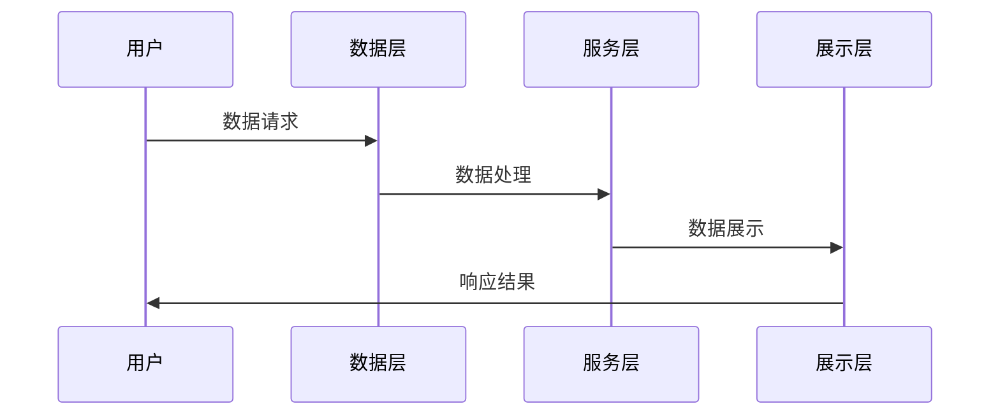
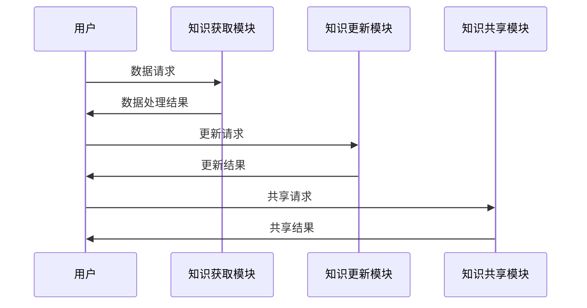

                 


# 敏捷LLM应用开发中的知识管理

> 关键词：敏捷开发、知识管理、LLM、自然语言处理、数据流处理

> 摘要：
本文深入探讨了敏捷LLM（Large Language Model）应用开发中的知识管理问题，从问题背景、核心概念、系统分析与架构设计、项目实战等多个方面进行了详细分析。通过本文，读者将了解敏捷LLM应用开发中的知识管理的重要性，以及如何通过知识获取与整合、知识更新、知识共享等手段，提高项目开发效率和质量。

## 知识管理概述

### 第1章：问题背景与问题描述

#### 1.1 问题背景

随着人工智能和大数据技术的迅速发展，知识管理在敏捷LLM应用开发中变得越来越重要。在敏捷开发模式下，知识管理的效率和准确性直接影响到项目的成功与否。

#### 1.2 问题描述

敏捷LLM应用开发中的知识管理面临的主要问题包括：

- **知识获取与整合**：如何在短时间内从大量数据中快速获取有用知识，并将其有效整合到模型中。
- **知识更新**：如何保持知识库的实时更新，以适应不断变化的应用场景。
- **知识共享**：如何实现团队内部的知识共享，提高团队协作效率。

#### 1.3 问题解决

为了解决上述问题，我们可以从以下几个方面入手：

- **自动化知识获取与整合**：利用自然语言处理技术和大数据分析技术，实现自动化知识获取与整合。
- **实时更新机制**：建立实时数据流处理系统，确保知识库能够及时更新。
- **知识共享平台**：构建团队内部的知识共享平台，方便团队成员之间的交流与合作。

#### 1.4 边界与外延

知识管理的边界与外延涉及到数据来源、数据处理方式、知识应用领域等多个方面。以下是一个简单的ER实体关系图架构，用于描述知识管理系统的基本结构。

```mermaid
erDiagram
  DataSource ||--|{ KnowledgeIntegration : 集成}
  KnowledgeIntegration ||--|{ KnowledgeBase : 知识库}
  KnowledgeBase ||--|{ KnowledgeApplication : 知识应用}
```

#### 1.5 本章小结

本章主要介绍了敏捷LLM应用开发中知识管理的问题背景、问题描述、问题解决思路以及系统的边界与外延。在接下来的章节中，我们将进一步探讨知识获取与整合、知识更新、知识共享等方面的具体方法与实现。

### 核心概念与联系

### 第2章：核心概念原理

#### 2.1 敏捷LLM

敏捷LLM是指在大规模语言模型（Large Language Model）开发过程中，采用敏捷开发方法进行项目管理和迭代开发的一种模式。敏捷LLM的主要特点包括：

- **快速迭代**：通过不断迭代优化模型，快速适应新的需求和应用场景。
- **需求驱动**：以用户需求为导向，根据用户反馈不断调整模型。
- **团队合作**：强调团队协作，确保项目顺利进行。

#### 2.2 知识获取与整合

知识获取与整合是指从海量数据中提取有用信息，并将其整合到知识库中的过程。其核心包括：

- **数据采集**：通过各种渠道收集数据，如公开数据集、企业内部数据等。
- **数据清洗**：对采集到的数据进行去重、去噪、格式化等处理。
- **知识提取**：利用自然语言处理技术从数据中提取知识。
- **知识整合**：将提取到的知识整合到知识库中，实现知识的积累与共享。

#### 2.3 知识更新

知识更新是指对知识库进行定期维护和更新，确保知识库的实时性和准确性。其方法包括：

- **自动更新**：通过数据流处理系统实现知识库的自动更新。
- **人工维护**：由专业人员定期检查和更新知识库。
- **版本控制**：对知识库进行版本控制，确保知识的可追溯性和可靠性。

#### 2.4 知识共享

知识共享是指通过平台和工具实现团队内部的知识共享与协作。其方法包括：

- **知识库平台**：构建专门的知识库平台，提供知识检索、分享、评论等功能。
- **团队协作工具**：利用团队协作工具，如Slack、Trello等，实现团队成员之间的实时沟通与协作。
- **知识地图**：利用知识地图展示知识结构，帮助团队成员快速定位和掌握相关知识点。

### 概念属性特征对比表格

以下是敏捷LLM、知识获取与整合、知识更新、知识共享等核心概念的主要属性特征对比表格：

| 核心概念       | 主要属性特征                                                       |
|----------------|----------------------------------------------------------------|
| 敏捷LLM       | 快速迭代、需求驱动、团队合作                                       |
| 知识获取与整合 | 数据采集、数据清洗、知识提取、知识整合                              |
| 知识更新       | 自动更新、人工维护、版本控制                                       |
| 知识共享       | 知识库平台、团队协作工具、知识地图                                  |

## 系统分析与架构设计

### 第3章：系统分析与架构设计

#### 3.1 问题场景介绍

在敏捷LLM应用开发中，如何高效地管理知识成为关键问题。为了解决这一问题，我们需要设计一个完善的系统架构，以支持知识获取、整合、更新和共享。

#### 3.2 项目介绍

本项目旨在构建一个敏捷LLM应用开发中的知识管理系统，包括知识获取与整合、知识更新、知识共享等功能。

#### 3.3 系统功能设计

系统功能设计主要包括以下几个方面：

1. **知识获取与整合**：通过数据采集、数据清洗、知识提取和知识整合，实现知识库的构建。
2. **知识更新**：通过自动更新、人工维护和版本控制，确保知识库的实时性和准确性。
3. **知识共享**：通过知识库平台、团队协作工具和知识地图，实现团队内部的知识共享与协作。

#### 3.4 系统架构设计

系统架构设计采用分层架构，包括数据层、服务层和展示层。具体架构如下：



#### 3.5 系统接口设计

系统接口设计主要包括以下几个方面：

1. **知识获取接口**：用于接收用户上传的数据，并进行数据采集、清洗和提取。
2. **知识更新接口**：用于接收用户提交的知识更新请求，并执行自动更新或人工维护。
3. **知识共享接口**：用于实现团队内部的知识共享，包括知识检索、分享和评论等功能。

#### 3.6 系统交互

系统交互主要涉及用户与系统的交互，以及系统内部各模块之间的交互。以下是一个简单的序列图示例：



## 项目实战

### 第4章：项目实战

#### 4.1 环境安装

在本项目实战中，我们选择Python作为编程语言，使用TensorFlow作为机器学习框架。首先，我们需要安装Python和TensorFlow。以下是安装命令：

```bash
pip install python
pip install tensorflow
```

#### 4.2 系统核心实现

系统核心实现包括知识获取与整合、知识更新、知识共享等功能。以下是部分核心代码的解读与分析。

#### 4.2.1 知识获取与整合

知识获取与整合的核心代码如下：

```python
import tensorflow as tf
import numpy as np

# 数据预处理
def preprocess_data(data):
    # 数据清洗、去重、格式化等操作
    # ...
    return processed_data

# 知识提取
def extract_knowledge(data):
    # 利用自然语言处理技术提取知识
    # ...
    return knowledge

# 知识整合
def integrate_knowledge(knowledge):
    # 将提取到的知识整合到知识库中
    # ...
    return integrated_knowledge
```

#### 4.2.2 知识更新

知识更新的核心代码如下：

```python
# 自动更新
def auto_update(knowledge_base):
    # 通过数据流处理系统实现知识库的自动更新
    # ...
    return updated_knowledge_base

# 人工维护
def manual_maintenance(knowledge_base):
    # 由专业人员定期检查和更新知识库
    # ...
    return maintained_knowledge_base
```

#### 4.2.3 知识共享

知识共享的核心代码如下：

```python
# 知识库平台
def knowledge_library_platform(knowledge):
    # 构建知识库平台，提供知识检索、分享、评论等功能
    # ...
    return knowledge_library_platform

# 团队协作工具
def team_c

