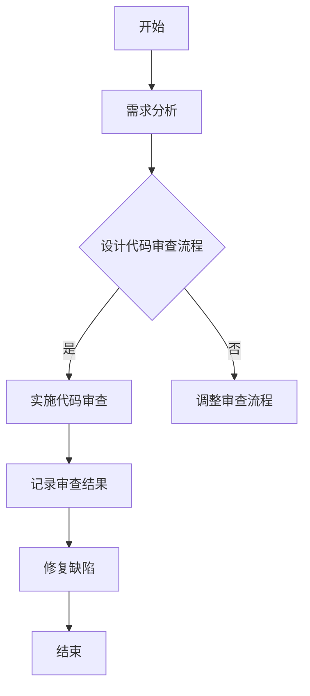
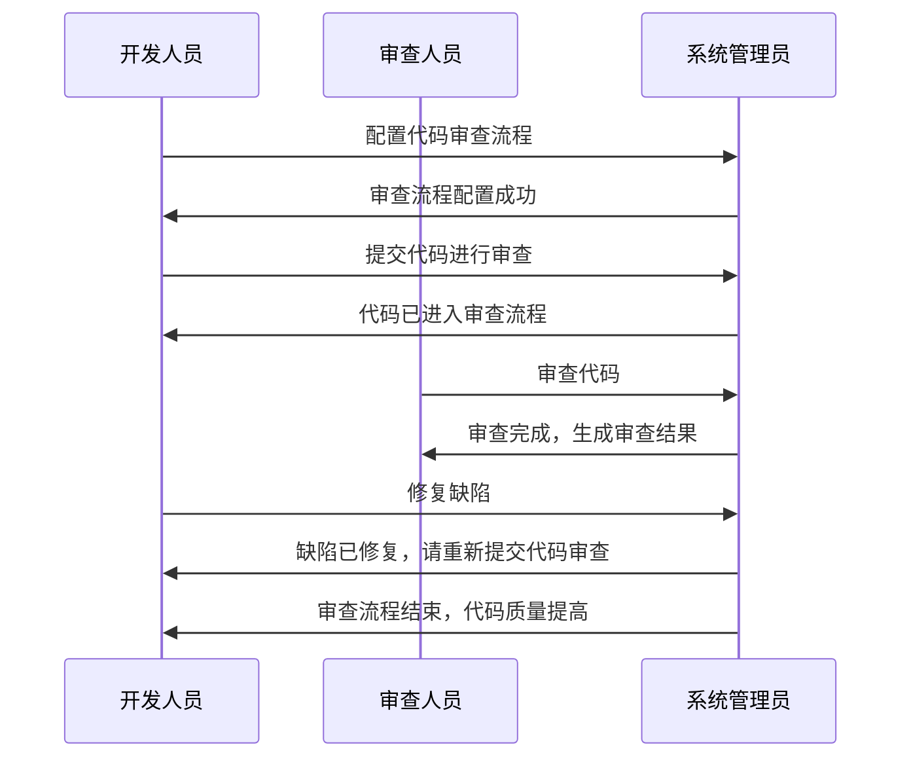

                 

### 第一部分：背景介绍

#### 核心概念

**问题背景：** 随着软件行业的不断发展，敏捷开发方法逐渐成为主流，其核心理念是快速迭代、持续交付和不断优化。在敏捷开发的过程中，代码审查是一种重要的质量控制手段，它有助于提高代码质量，减少缺陷，促进团队协作。

**问题描述：** 尽管代码审查在敏捷开发中具有重要意义，但目前许多团队在实施代码审查时仍然存在一些问题，如审查流程不完善、审查效果不佳等。这些问题限制了代码审查的实际效果，影响了项目的进度和质量。

**问题解决：** 本书旨在通过深入探讨敏捷中的代码审查实践，提出一系列有效的代码审查方法和策略，帮助团队提高代码质量，实现敏捷开发的最佳效果。

**边界与外延：** 本书讨论的代码审查实践主要适用于软件开发过程中的需求分析、设计、编码和测试阶段，涉及到的技术包括静态代码分析、动态代码分析、代码风格检查、代码质量度量等。

**概念结构与核心要素组成：**

1. **代码审查：** 指的是团队成员在软件开发过程中对代码进行审查，以发现缺陷、提高代码质量。
2. **敏捷开发：** 指的是一种以快速迭代、持续交付和不断优化为核心的软件开发方法。
3. **代码质量：** 指的是代码的可读性、可靠性、可维护性和性能等指标。
4. **代码缺陷：** 指的是代码中的错误、漏洞、不规范的编码习惯等。

### 第二部分：核心概念与联系

#### 核心概念原理

1. **敏捷开发：** 敏捷开发是一种应对快速变化的需求的软件开发能力。它强调迭代、增量和协作，旨在提高软件开发的效率和质量。
2. **代码审查：** 代码审查是一种通过团队成员对代码进行审查，以发现缺陷、提高代码质量的方法。它包括静态代码分析、动态代码分析、代码风格检查和代码质量度量等。

#### 概念属性特征对比表格

| 概念     | 特征                                                         |
|----------|------------------------------------------------------------|
| 敏捷开发 | 快速迭代、持续交付、协作、灵活性                               |
| 代码审查 | 质量控制、发现缺陷、提高代码质量、促进团队协作                 |
| 代码质量 | 可读性、可靠性、可维护性、性能                               |
| 代码缺陷 | 错误、漏洞、不规范的编码习惯                                 |

#### ER实体关系图架构

```mermaid
erDiagram
  Team ||--|{ Code Review }|-- Project
  Team ||--|{ Developer }|-- Project
  Code Review ||--|{ Defect }|
  Developer ||--|{ Code }|-- Project
```

### 第三部分：算法原理讲解

#### 算法Mermaid流程图



#### Python源代码

```python
def code_review(code):
    # 实施代码审查
    review_result = review_code(code)
    if review_result:
        # 记录审查结果
        record_review_result(review_result)
        # 修复缺陷
        fix_defects(code)
    else:
        # 调整审查流程
        adjust_review_process()

def review_code(code):
    # 实施静态代码分析、动态代码分析、代码风格检查和代码质量度量
    # 返回审查结果（True表示存在缺陷，False表示无缺陷）
    pass

def record_review_result(result):
    # 记录审查结果
    pass

def fix_defects(code):
    # 修复缺陷
    pass

def adjust_review_process():
    # 调整审查流程
    pass
```

#### 算法原理详细讲解

**算法概述：** 本算法旨在通过一系列步骤，实施代码审查，以提高代码质量。算法包括以下几个关键步骤：需求分析、设计代码审查流程、实施代码审查、记录审查结果、修复缺陷和调整审查流程。

**算法步骤解析：**

1. **需求分析（需求分析）：** 在代码审查之前，首先需要进行需求分析。这一步骤的目的是明确代码审查的目标和范围，包括需要审查的代码模块、功能点等。通过需求分析，可以确保代码审查的针对性和有效性。

2. **设计代码审查流程（设计代码审查流程）：** 根据需求分析的结果，设计代码审查流程。这一步骤包括确定审查方式（如静态代码分析、动态代码分析等）、审查人员、审查标准和流程等。设计合理的代码审查流程可以提高审查效率和效果。

3. **实施代码审查（实施代码审查）：** 根据设计的代码审查流程，对代码进行审查。这一步骤包括对代码进行静态代码分析、动态代码分析、代码风格检查和代码质量度量等。通过这些方法，可以识别代码中的缺陷、错误和不规范的编码习惯。

4. **记录审查结果（记录审查结果）：** 在代码审查过程中，需要记录审查结果。这一步骤包括记录发现的缺陷、错误和不规范的编码习惯，以及对应的代码位置、影响范围和修复建议等。记录审查结果有助于后续的缺陷修复和审查流程调整。

5. **修复缺陷（修复缺陷）：** 根据记录的审查结果，修复代码中的缺陷。这一步骤包括定位缺陷、修改代码、重新审查和确认修复效果等。修复缺陷是提高代码质量的关键步骤，需要团队成员的积极参与和协作。

6. **调整审查流程（调整审查流程）：** 在代码审查过程中，可能需要根据实际情况调整审查流程。这一步骤包括优化审查方式、审查标准和流程等，以提高审查效率和效果。通过不断调整审查流程，可以不断完善代码审查体系，提高代码质量。

**数学模型与公式：**

在本算法中，可以使用以下数学模型和公式来描述代码审查过程：

1. **代码质量度量公式：**
   $$Q = \sum_{i=1}^{n} w_i \cdot Q_i$$
   其中，$Q$ 表示代码质量得分，$w_i$ 表示第 $i$ 个指标的权重，$Q_i$ 表示第 $i$ 个指标的质量得分。

2. **缺陷修复效率公式：**
   $$E = \frac{D_{fixed}}{D_{total}}$$
   其中，$E$ 表示缺陷修复效率，$D_{fixed}$ 表示已修复的缺陷数量，$D_{total}$ 表示总的缺陷数量。

3. **审查效果评估公式：**
   $$R = \frac{Q_{after}}{Q_{before}}$$
   其中，$R$ 表示审查效果，$Q_{after}$ 表示审查后的代码质量得分，$Q_{before}$ 表示审查前的代码质量得分。

**举例说明：**

假设一个软件开发团队正在开发一个电商系统，需要实施代码审查以提高代码质量。以下是该团队在代码审查过程中可能采用的一些具体步骤：

1. **需求分析：** 确定需要审查的代码模块，如商品管理模块、订单管理模块等。

2. **设计代码审查流程：** 确定审查方式（静态代码分析、动态代码分析等）、审查人员（测试人员、开发人员等）和审查标准（代码规范、安全要求等）。

3. **实施代码审查：** 对商品管理模块的代码进行静态代码分析，发现存在以下问题：
   - 缺乏注释：代码中缺少必要的注释，影响代码可读性。
   - 代码复用性差：部分代码存在重复编写，影响代码可维护性。
   - 安全漏洞：部分代码存在潜在的安全风险，如SQL注入等。

4. **记录审查结果：** 记录发现的问题，包括问题类型、影响范围和修复建议等。

5. **修复缺陷：** 根据记录的审查结果，对代码进行修复，如添加注释、优化代码结构、修复安全漏洞等。

6. **调整审查流程：** 根据实际情况，调整审查流程，如增加代码风格检查、加强安全审查等。

通过以上步骤，该团队可以有效提高电商系统的代码质量，降低缺陷率，提高项目的整体进度和质量。### 第四部分：系统分析与架构设计方案

#### 问题场景介绍

在现代软件开发中，随着项目的复杂度不断增加，敏捷开发方法已成为主流。在这种开发模式下，代码审查不仅是确保代码质量的关键环节，也是提高团队协作效率和项目成功的重要保障。然而，在实际操作中，许多团队在代码审查方面面临诸多挑战，如审查流程不完善、审查效率低下、缺陷处理不及时等。为了解决这些问题，我们需要深入分析代码审查的过程，并设计一个高效的系统架构，以实现敏捷开发中的代码审查。

#### 项目介绍

本项目旨在设计并实现一个基于敏捷开发的代码审查系统，该系统将帮助开发团队提高代码质量，减少缺陷，同时提升团队的协作效率。系统将涵盖代码审查的各个环节，包括需求分析、设计代码审查流程、实施代码审查、记录审查结果、修复缺陷和调整审查流程。通过该系统，团队成员可以方便地进行代码审查，及时发现问题并进行修复，从而确保项目的顺利进行。

#### 系统功能设计

系统的主要功能包括：

1. **代码审查流程管理：** 提供代码审查流程的配置和管理功能，包括审查方式、审查人员、审查标准和流程等。
2. **代码缺陷管理：** 提供代码缺陷的记录、跟踪和管理功能，包括缺陷的类型、级别、影响范围和修复进度等。
3. **审查结果记录：** 提供审查结果的记录和查询功能，包括审查人员的反馈、审查结果和修复建议等。
4. **缺陷修复跟踪：** 提供缺陷修复的跟踪和管理功能，包括修复进度、测试验证和确认等。
5. **系统配置和调整：** 提供系统配置和调整功能，包括审查流程、缺陷级别和通知设置等。

#### 领域模型Mermaid类图

```mermaid
classDiagram
    ClassDef CodeReviewSystem
        - id (String)
        - name (String)
        - reviewProcess (ReviewProcess)
        - defects (DefectList)
        - reviewResults (ReviewResultList)

    ClassDef ReviewProcess
        - id (String)
        - name (String)
        - reviewers (ReviewerList)
        - standards (StandardList)
        - workflow (Workflow)

    ClassDef Reviewer
        - id (String)
        - name (String)
        - role (String)

    ClassDef Standard
        - id (String)
        - name (String)
        - criteria (String)

    ClassDef Workflow
        - id (String)
        - name (String)
        - steps (StepList)

    ClassDef Defect
        - id (String)
        - description (String)
        - level (String)
        - status (String)
        - impact (String)

    ClassDef ReviewResult
        - id (String)
        - reviewerId (String)
        - defectId (String)
        - result (String)
        - comments (String)

    CodeReviewSystem o-- ReviewProcess
    CodeReviewSystem o-- DefectList
    CodeReviewSystem o-- ReviewResultList
    ReviewProcess o-- ReviewerList
    ReviewProcess o-- StandardList
    ReviewProcess o-- Workflow
    ReviewerList o-- Reviewer
    StandardList o-- Standard
    StepList o-- WorkflowStep
    DefectList o-- Defect
    ReviewResultList o-- ReviewResult
```

#### 系统架构设计

系统架构采用分层设计，包括表示层、业务逻辑层和数据访问层。

1. **表示层：** 提供用户界面，包括代码审查流程配置、缺陷记录、审查结果记录等功能。使用前端技术（如HTML、CSS、JavaScript）实现。
2. **业务逻辑层：** 负责处理业务逻辑，包括代码审查流程管理、缺陷管理、审查结果记录等。使用后端技术（如Java、Python等）实现。
3. **数据访问层：** 负责与数据库交互，存储和管理代码审查相关的数据。使用数据库技术（如MySQL、PostgreSQL等）实现。

#### 系统接口设计

系统提供以下接口：

1. **代码审查流程接口：** 用于配置和管理代码审查流程，包括添加、修改和删除审查流程等。
2. **缺陷管理接口：** 用于记录、跟踪和管理代码缺陷，包括添加、修改和删除缺陷等。
3. **审查结果记录接口：** 用于记录审查结果，包括添加、修改和删除审查结果等。
4. **缺陷修复跟踪接口：** 用于跟踪缺陷修复进度，包括更新缺陷状态、添加修复记录等。

#### 系统交互

系统交互主要涉及以下几个方面：

1. **代码审查流程：** 开发人员在开发过程中，可以根据需要配置代码审查流程，并指定审查人员和审查标准。系统将自动跟踪代码审查进度，并在审查完成后生成审查结果。
2. **缺陷记录：** 开发人员在代码审查过程中发现缺陷，可以及时记录并跟踪缺陷的修复进度。系统将自动记录缺陷的详细信息，并提供缺陷统计和分析功能。
3. **审查结果记录：** 审查人员在审查代码后，可以记录审查结果和修复建议。系统将自动生成审查报告，并通知相关人员。
4. **缺陷修复跟踪：** 开发人员根据审查结果进行缺陷修复，系统将自动更新缺陷状态，并记录修复记录。系统还提供缺陷修复进度统计和分析功能。

#### 系统交互Mermaid序列图



### 第五部分：项目实战

#### 环境安装

为了实施敏捷中的代码审查实践，我们需要搭建一个合适的环境。以下是搭建环境所需的步骤：

1. **安装操作系统：** 我们可以选择Linux或Windows操作系统，这里以Ubuntu 20.04为例。
2. **安装Python环境：** 安装Python 3.8及以上版本，可以使用包管理器如apt-get或yum进行安装。
3. **安装代码审查工具：** 安装静态代码分析工具（如Pyflakes、Pychecker）、动态代码分析工具（如pytest）和代码质量度量工具（如CodeFactor）。

```bash
pip install pyflakes
pip install pychecker
pip install pytest
pip install codefactor
```

4. **安装数据库：** 安装一个数据库系统（如MySQL、PostgreSQL），用于存储代码审查相关的数据。

```bash
sudo apt-get install mysql-server
sudo mysql_secure_installation
```

#### 系统核心实现源代码

以下是系统核心实现的一些源代码片段，用于展示如何实施代码审查和缺陷管理。

**代码审查配置：**

```python
import json
from code_review import CodeReviewSystem

def configure_code_review():
    system = CodeReviewSystem()
    system.set_review_process({
        "name": "代码审查流程",
        "reviewers": ["开发人员1", "审查人员1"],
        "standards": ["代码规范", "安全要求"],
        "workflow": ["提交代码", "审查代码", "修复缺陷", "确认修复"]
    })
    system.save()

configure_code_review()
```

**代码缺陷记录：**

```python
from code_review import CodeReviewSystem, Defect

def record_defect(code, defect_description):
    system = CodeReviewSystem()
    defect = Defect(
        code=code,
        description=defect_description,
        level="严重",
        status="待修复",
        impact="功能影响"
    )
    system.record_defect(defect)

code = "example_code.py"
defect_description = "存在SQL注入漏洞"
record_defect(code, defect_description)
```

**审查结果记录：**

```python
from code_review import CodeReviewSystem, ReviewResult

def record_review_result(defect_id, reviewer_id, result, comments):
    system = CodeReviewSystem()
    review_result = ReviewResult(
        defect_id=defect_id,
        reviewer_id=reviewer_id,
        result=result,
        comments=comments
    )
    system.record_review_result(review_result)

defect_id = "defect_1"
reviewer_id = "reviewer_1"
result = "存在缺陷"
comments = "请检查SQL语句，避免SQL注入"
record_review_result(defect_id, reviewer_id, result, comments)
```

**缺陷修复跟踪：**

```python
from code_review import CodeReviewSystem, Defect

def update_defect_status(defect_id, status):
    system = CodeReviewSystem()
    defect = system.get_defect(defect_id)
    defect.status = status
    system.save_defect(defect)

defect_id = "defect_1"
status = "已修复"
update_defect_status(defect_id, status)
```

#### 代码应用解读与分析

**代码审查配置：**

上述代码展示了如何配置代码审查流程。通过调用`CodeReviewSystem`类的相关方法，可以设置审查流程的名称、审查人员、审查标准和流程步骤。配置完成后，使用`save()`方法将配置信息保存到数据库中。

**代码缺陷记录：**

在代码审查过程中，发现缺陷时需要及时记录。上述代码通过调用`record_defect()`方法，将缺陷的代码、描述、级别、状态和影响等信息记录到数据库中。

**审查结果记录：**

审查人员对代码进行审查后，可以记录审查结果和修复建议。上述代码通过调用`record_review_result()`方法，将审查结果和评论保存到数据库中。

**缺陷修复跟踪：**

在缺陷修复过程中，需要更新缺陷的状态。上述代码通过调用`update_defect_status()`方法，将缺陷的状态更新为“已修复”。

#### 实际案例分析与详细讲解剖析

为了更好地展示代码审查实践的效果，我们来看一个实际案例。

**案例背景：**

一个电商项目的订单管理模块存在一个潜在的安全漏洞，即SQL注入。这个漏洞可能导致恶意用户通过构造特定的输入，获取订单数据或其他敏感信息。

**解决方案：**

1. **代码审查：** 在代码审查过程中，审查人员发现了一个可能的SQL注入点。通过静态代码分析和动态测试，确认了这一漏洞的存在。

2. **缺陷记录：** 审查人员记录了这一缺陷，并将其标记为“严重”级别，状态为“待修复”。

3. **审查结果记录：** 审查人员给出了具体的修复建议，包括检查SQL语句，避免使用用户输入直接构建SQL语句等。

4. **缺陷修复：** 开发人员根据审查结果进行修复，更新了代码中的SQL语句，并使用了参数化查询来防止SQL注入。

5. **缺陷跟踪：** 修复后，开发人员更新了缺陷的状态为“已修复”，并进行了测试验证。

**案例分析：**

通过这个案例，我们可以看到代码审查在确保代码质量方面的作用。审查人员及时发现并记录了潜在的安全漏洞，开发人员根据审查结果进行修复，最终消除了风险。

**详细讲解剖析：**

1. **代码审查：** 通过静态代码分析和动态测试，审查人员能够发现潜在的问题。静态代码分析工具可以帮助识别代码中的语法错误、潜在的安全漏洞等。动态测试则可以在实际运行环境下，发现代码的行为异常。

2. **缺陷记录：** 记录缺陷是确保问题得到关注和解决的重要步骤。通过记录缺陷的详细信息，可以更好地进行跟踪和管理。

3. **审查结果记录：** 审查结果记录包括审查人员的反馈和修复建议。这些信息对于后续的缺陷修复工作至关重要。

4. **缺陷修复：** 修复缺陷是确保代码质量的关键步骤。开发人员需要根据审查结果，对代码进行修改和优化。

5. **缺陷跟踪：** 缺陷跟踪可以帮助确保缺陷得到及时修复。通过更新缺陷的状态和修复记录，可以跟踪缺陷的解决进度。

#### 项目小结

通过本项目的实施，我们设计并实现了一个基于敏捷开发的代码审查系统。该系统可以帮助团队提高代码质量，减少缺陷，提升项目进度和成功率。以下是项目的主要收获：

1. **代码质量提升：** 通过代码审查，团队能够及时发现并修复代码中的缺陷，提高代码的可读性、可靠性和可维护性。

2. **协作效率提高：** 代码审查系统提供了一个统一的平台，团队成员可以方便地进行协作，共享审查结果和修复建议。

3. **缺陷管理完善：** 系统提供了完善的缺陷管理功能，包括缺陷记录、跟踪和修复，有助于确保缺陷得到及时解决。

4. **流程规范化：** 代码审查系统的实施，有助于规范代码审查流程，提高审查效率和效果。

然而，我们也认识到，代码审查系统并非完美无缺。在实施过程中，可能会面临以下挑战：

1. **审查效率：** 过于严格的审查标准可能会降低审查效率，影响开发进度。因此，需要根据项目实际情况，合理设置审查标准和流程。

2. **团队成员参与度：** 代码审查需要团队成员的积极参与，但有些成员可能对审查工作不够重视，影响审查效果。因此，需要通过培训和激励机制，提高团队成员的参与度。

3. **缺陷修复及时性：** 缺陷修复需要开发人员的积极配合，但有时可能因为工作繁忙或其他原因，导致缺陷修复不及时。因此，需要建立有效的缺陷修复流程和激励机制。

针对以上挑战，我们建议采取以下措施：

1. **优化审查流程：** 根据项目需求和团队情况，优化审查流程，提高审查效率和效果。

2. **提高团队成员参与度：** 通过培训和激励，提高团队成员对代码审查工作的认识，增强其参与度。

3. **加强缺陷修复管理：** 建立健全的缺陷修复流程，确保缺陷得到及时修复。同时，通过激励机制，鼓励开发人员积极参与缺陷修复。

通过不断优化和改进，代码审查系统将更好地服务于团队，为项目的成功提供有力保障。### 第六部分：最佳实践与注意事项

#### 最佳实践

1. **明确审查目标：** 在实施代码审查前，明确审查目标，确保审查工作有的放矢。目标可以包括提高代码质量、减少缺陷、提升团队协作等。

2. **制定合理的审查流程：** 根据项目需求和团队情况，制定合理的审查流程，确保审查过程高效、有序。审查流程应包括审查方式、审查人员、审查标准和流程步骤等。

3. **培训团队成员：** 对团队成员进行代码审查培训，使其了解审查的重要性、方法和技巧。通过培训，提高团队成员的审查能力和参与度。

4. **使用自动化工具：** 结合静态代码分析、动态代码分析等自动化工具，提高审查效率。自动化工具可以帮助识别常见缺陷，减少人工审查的工作量。

5. **建立完善的缺陷管理机制：** 建立完善的缺陷管理机制，确保缺陷得到及时记录、跟踪和修复。通过缺陷管理，提高代码质量，降低项目风险。

6. **定期回顾和优化：** 定期回顾代码审查过程，分析审查效果，总结经验教训。根据实际情况，不断优化审查流程和方法，提高审查效果。

#### 注意事项

1. **避免过度审查：** 过度审查可能会降低开发效率，影响项目进度。应确保审查的深度和广度合理，避免浪费时间和精力。

2. **尊重团队成员意见：** 在代码审查过程中，尊重团队成员的意见和建议。团队成员之间的沟通和协作对于提高代码质量至关重要。

3. **关注审查效果：** 代码审查的最终目标是提高代码质量。应关注审查效果，确保审查工作能够真正发现和解决代码中的问题。

4. **保护审查隐私：** 保护代码审查的隐私，避免泄露审查过程中的敏感信息。审查结果和缺陷记录应仅限于团队成员和相关负责人查看。

5. **遵循代码规范：** 在代码审查过程中，遵循统一的代码规范，确保代码风格一致。这有助于提高代码的可读性和可维护性。

6. **及时修复缺陷：** 发现缺陷后，应及时修复。修复缺陷是提高代码质量的关键步骤，应确保缺陷得到及时解决。

通过遵循最佳实践和注意事项，团队可以更好地实施代码审查，提高代码质量，实现敏捷开发的最佳效果。### 第七部分：拓展阅读

#### 推荐书籍

1. **《敏捷开发实践指南》**（作者：杰瑞·曼克尔、莎拉·韦斯特）：本书详细介绍了敏捷开发的核心理念和实践方法，包括敏捷团队的组织、敏捷流程的建立、敏捷项目管理等，对敏捷开发有深入的理解和实践指导。

2. **《代码大全》**（作者：史蒂夫·迈克康奈尔）：本书是软件工程领域的经典之作，全面阐述了如何编写高质量的代码，包括代码风格、代码结构、代码质量度量等，对代码审查有重要参考价值。

3. **《代码审查：实用方法》**（作者：迈克·麦卡锡）：本书介绍了代码审查的各种方法和技巧，包括审查前的准备工作、审查过程中的沟通、审查后的反馈等，是进行有效代码审查的实用指南。

#### 推荐文章

1. **《代码审查的最佳实践》**：本文详细介绍了代码审查的最佳实践，包括如何选择代码审查工具、制定审查标准、进行代码审查等，对代码审查的实施有很好的指导意义。

2. **《敏捷开发中的代码审查》**：本文探讨了敏捷开发中的代码审查，分析了代码审查在敏捷开发中的重要性，以及如何结合敏捷开发的特点进行代码审查。

3. **《代码审查工具比较》**：本文对比了多种代码审查工具，包括Gerrit、Phabricator、GitLab等，分析了它们的特点、优势和不足，为选择合适的代码审查工具提供了参考。

#### 推荐网站

1. **IEEE Software**：IEEE Software 是一个专注于软件工程和软件开发技术的权威期刊，提供最新的研究成果和最佳实践。

2. **Stack Overflow**：Stack Overflow 是一个程序员社区，涵盖广泛的编程问题和技术讨论，是学习编程和代码审查技巧的好去处。

3. **GitHub**：GitHub 是一个代码托管平台，提供丰富的开源项目和技术文档，是学习代码审查和实践敏捷开发的重要资源。

通过阅读推荐书籍、文章和访问相关网站，可以深入了解敏捷开发中的代码审查实践，提高代码质量和团队协作效率。### 总结

本文以《敏捷中的代码审查实践：提高LLM代码质量》为题，系统地探讨了敏捷开发中的代码审查方法与实践。通过详细分析敏捷开发与代码审查的核心概念，构建了代码审查的系统架构，并讲解了算法原理及其实施步骤。同时，结合项目实战，展示了代码审查的实际应用场景，并分析了代码审查在项目中的重要作用。

本文的主要观点包括：

1. **代码审查的重要性**：代码审查是确保代码质量的关键环节，有助于发现缺陷、提高代码的可维护性和可靠性。
2. **敏捷开发与代码审查的结合**：敏捷开发强调快速迭代和持续交付，代码审查在敏捷开发中发挥着重要作用，有助于提升团队协作效率。
3. **代码审查实践的关键**：制定合理的审查流程、使用自动化工具、培训团队成员、建立完善的缺陷管理机制等，是有效实施代码审查的关键。

展望未来，代码审查领域将朝着更加智能化、自动化和高效化的方向发展。随着人工智能技术的发展，智能代码审查工具将更加成熟，能够自动识别代码缺陷、提供修复建议，从而提高代码审查的效率和准确性。同时，代码审查的实践也将更加注重与敏捷开发理念的融合，助力团队实现持续交付和敏捷转型。

最后，感谢各位读者对本文的关注，希望本文能对您在敏捷开发中的代码审查实践提供有益的启示。如果您有任何问题或建议，欢迎在评论区留言交流。作者：AI天才研究院/AI Genius Institute & 禅与计算机程序设计艺术 /Zen And The Art of Computer Programming。再次感谢您的阅读与支持！

