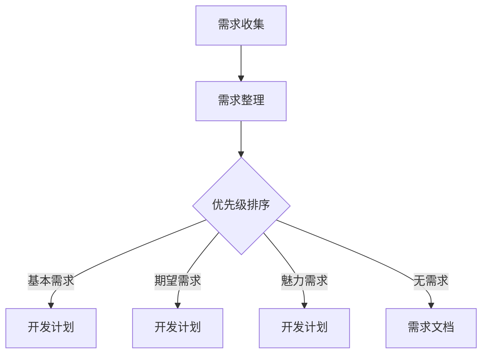
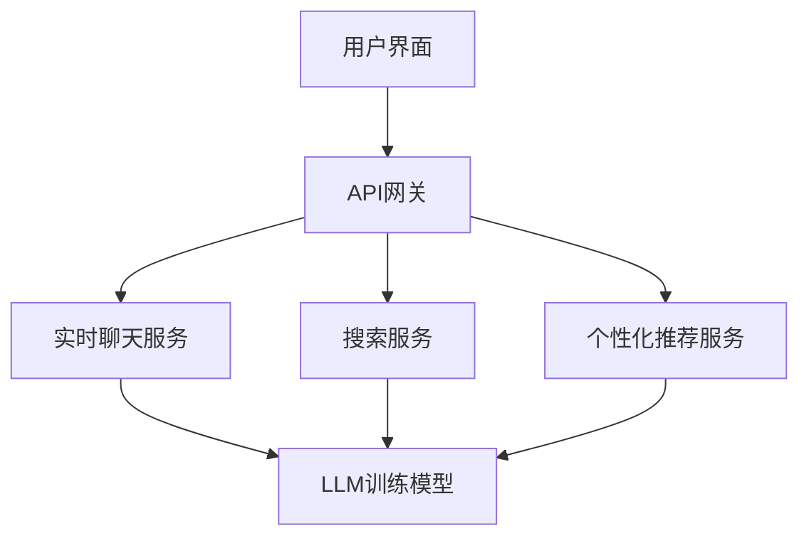
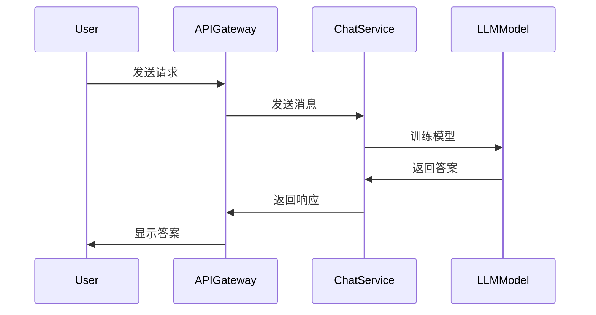

                 

# 《敏捷中的利益相关者管理：确保LLM项目对齐》

## 关键词
- 敏捷开发
- 利益相关者管理
- LLM项目
- 项目对齐
- 需求分析

## 摘要
本文深入探讨了敏捷开发中的利益相关者管理，特别针对大型语言模型（LLM）项目。我们将详细分析敏捷方法如何应用于利益相关者管理，解释利益相关者的定义、角色和需求，并通过实例展示如何在敏捷开发过程中确保项目与利益相关者的需求对齐。本文的目标是帮助读者理解利益相关者管理在LLM项目中的重要性，并掌握有效的实践方法。

## 背景介绍

### 敏捷开发简介

敏捷开发是一种以人为核心、迭代和渐进的方式推进项目开发的软件开发方法。它强调适应变化、快速反馈和持续交付价值。敏捷开发的核心原则包括：

1. **个体和互动重于过程和工具**：敏捷认为团队中的个体和团队之间的互动比具体的开发工具更重要。
2. **可工作的软件重于详尽的文档**：敏捷开发强调可工作的软件是项目成功的关键，虽然文档也很重要，但应当简洁、易于理解。
3. **客户合作重于合同谈判**：与客户的密切合作有助于确保项目满足实际需求。
4. **响应变化重于遵循计划**：敏捷开发认为变化是不可避免的，因此应更灵活地适应变化。

### 利益相关者管理的定义与重要性

利益相关者管理是指识别、评估和沟通项目中的各个利益相关者的需求和期望，以确保项目的成功。在敏捷开发中，利益相关者管理至关重要，因为它直接影响项目的方向、优先级和决策。

利益相关者可以包括：

- **客户**：他们的需求是项目成功的关键。
- **用户**：他们是最终受益者，他们的反馈对项目的改进至关重要。
- **开发团队**：他们是项目的执行者，他们的投入和动力对项目成功有直接影响。
- **管理者**：他们负责资源分配和项目监督。

### LLM项目在敏捷开发中的挑战与机遇

LLM（大型语言模型）项目是一个复杂的项目，涉及大量的数据处理、模型训练和优化。在敏捷开发中管理LLM项目面临以下挑战：

1. **需求的不确定性**：LLM项目的需求可能随着项目进展而不断变化，这使得需求管理变得复杂。
2. **技术复杂性**：LLM项目涉及大量的数据处理和机器学习技术，这使得项目管理和监控变得更加复杂。
3. **性能优化**：LLM模型的性能优化可能需要大量的试错和调整。

然而，敏捷开发也为LLM项目提供了以下机遇：

1. **快速迭代**：敏捷开发允许团队快速迭代和交付功能，从而更快地响应需求和反馈。
2. **持续集成**：通过持续集成，可以确保代码质量，并快速识别和解决潜在问题。
3. **灵活性**：敏捷开发提供了更好的灵活性，以适应技术变化和需求变更。

### 敏捷利益相关者管理的基本原则

敏捷利益相关者管理遵循以下基本原则：

1. **主动沟通**：与利益相关者保持持续、主动的沟通，确保他们的需求和期望得到理解。
2. **透明度**：项目进展和决策过程应保持透明，让利益相关者了解项目状态。
3. **协作**：鼓励利益相关者参与项目决策和执行，共同解决问题。
4. **快速反馈**：定期收集利益相关者的反馈，以便快速调整项目方向。

## 核心概念与联系

### 利益相关者的定义与角色

利益相关者是指对项目有利益或影响的人或组织。他们可能包括：

- **客户**：项目的最终用户或消费者。
- **用户**：使用项目产品的人。
- **开发团队**：负责开发和维护项目的人。
- **管理者**：负责项目管理和资源分配的人。
- **供应商**：提供项目所需资源或服务的人或组织。

### 利益相关者分类

利益相关者可以按其影响力和需求的重要程度进行分类，通常分为以下几类：

- **关键利益相关者**：对项目有高度影响力和关键需求的利益相关者。
- **重要利益相关者**：对项目有较高影响力和重要需求的利益相关者。
- **次要利益相关者**：对项目有一定影响力但需求较次要的利益相关者。

### 利益相关者需求分析

利益相关者需求分析是识别和记录利益相关者的需求和期望的过程。这包括：

- **需求识别**：通过访谈、调查和观察等方法识别利益相关者的需求。
- **需求记录**：将需求记录在需求文档中，并为其分配优先级。

### 利益相关者期望管理

利益相关者期望管理是确保利益相关者需求得到满足的过程。这包括：

- **期望设置**：与利益相关者沟通，设定合理的期望。
- **期望调整**：在项目进展中，根据实际情况调整期望。

### 核心概念关系表格

| 利益相关者类型 | 定义 | 重要性 |
| -------------- | ------ | ------ |
| 客户 | 最终用户或消费者 | 高 |
| 用户 | 使用项目产品的人 | 中 |
| 开发团队 | 负责开发和维护项目的人 | 中 |
| 管理者 | 负责项目管理和资源分配的人 | 高 |
| 供应商 | 提供项目所需资源或服务的人或组织 | 中 |

### 利益相关者关系ER图

```mermaid
erDiagram
    Customer ||--|{ User }|
    Developer ||--|{ Project }|
    Manager ||--|{ Project }|
    Supplier ||--|{ Project }|
```

## 算法原理讲解

### 敏捷管理中的关键算法

在敏捷开发中，利益相关者管理的关键算法包括需求收集、需求优先级排序和需求变更管理。以下是对这些算法的详细讲解。

### 需求收集

需求收集是识别和记录利益相关者需求的过程。常用的方法包括：

- **访谈**：通过与利益相关者进行面对面或在线访谈，收集他们的需求。
- **调查**：通过问卷或在线调查，收集大量利益相关者的需求。
- **观察**：通过观察用户如何使用项目产品，收集他们的需求。

### 需求优先级排序

需求优先级排序是将需求按照其重要性和紧急性进行排序的过程。常用的方法包括：

- **MoSCoW方法**：将需求分为必须（Mandatory）、应该（Should）、可以（Could）和不会（Will not）实现。
- **Kano模型**：将需求分为基本需求、期望需求、魅力需求和无需求。

### 需求变更管理

需求变更管理是处理需求变更的过程，以确保项目能够适应变化。常用的方法包括：

- **变更请求**：记录和审批需求变更的请求。
- **变更影响评估**：评估需求变更对项目进度、成本和范围的影响。
- **变更控制**：通过变更管理流程，控制需求变更的执行。

### Mermaid流程图



### Python代码示例

```python
# 需求收集
def collect_requirements():
    requirements = []
    # 通过访谈、调查和观察收集需求
    requirements.append("提供实时聊天功能")
    requirements.append("优化搜索算法")
    requirements.append("增加用户个性化推荐")
    return requirements

# 需求优先级排序
def sort_requirements(requirements):
    sorted_requirements = sorted(requirements, key=lambda x: x.split("_")[0])
    return sorted_requirements

# 需求变更管理
def manage_requirement_change(requirement, current_version):
    new_version = current_version + 1
    print(f"需求变更：{requirement} 已添加到版本 {new_version}")
    return new_version

# 主程序
if __name__ == "__main__":
    requirements = collect_requirements()
    sorted_requirements = sort_requirements(requirements)
    for requirement in sorted_requirements:
        manage_requirement_change(requirement, 1)
```

### 数学模型和数学公式

在敏捷利益相关者管理中，我们常用以下数学模型和公式：

- **MoSCoW模型**：
  $$M = \frac{(紧急性 + 影响力)}{2}$$
  $$S = \frac{(紧急性 + 影响力)}{4}$$
  $$C = \frac{(紧急性 + 影响力)}{6}$$
  $$W = \frac{(紧急性 + 影响力)}{8}$$

- **Kano模型**：
  $$Kano = \frac{(满意度 - 不满意度)}{2}$$

### 系统分析与架构设计方案

#### 问题场景介绍

假设我们正在开发一个基于LLM的智能问答系统，客户需求包括实时聊天、优化搜索算法和用户个性化推荐。

#### 项目介绍

项目名为"SmartQA"，目标是创建一个能够自动回答用户问题的智能系统，提供实时聊天和个性化推荐功能。

#### 系统功能设计

- **实时聊天**：用户可以实时与系统进行对话，获取答案。
- **搜索优化**：优化搜索算法，提高搜索结果的准确性和相关性。
- **个性化推荐**：根据用户的历史行为和偏好，提供个性化的答案和建议。

#### 系统架构设计



#### 系统接口设计

- **实时聊天接口**：提供发送和接收消息的API。
- **搜索接口**：提供搜索关键词并返回结果的API。
- **个性化推荐接口**：提供用户ID和返回个性化推荐结果的API。

#### 系统交互



## 项目实战

### 环境安装

1. 安装Python环境，版本要求3.8及以上。
2. 安装必要的库，如TensorFlow、PyTorch、transformers等。

### 系统核心实现

```python
# 导入库
import transformers
from transformers import pipeline

# 初始化模型
llm_model = pipeline("text-generation", model="gpt-2")

# 处理实时聊天请求
def handle_chat_request(message):
    response = llm_model(message, max_length=50, num_return_sequences=1)
    return response.generated_responses[0]

# 主程序
if __name__ == "__main__":
    while True:
        message = input("用户：")
        response = handle_chat_request(message)
        print("系统：", response)
```

### 代码解读与分析

该代码首先导入所需的库，然后初始化LLM模型。`handle_chat_request`函数接收用户的消息，并使用LLM模型生成答案。主程序通过循环接收用户输入，调用`handle_chat_request`函数，并打印答案。

### 实际案例分析和详细讲解

假设用户输入“什么是人工智能？”：

```python
user_message = "什么是人工智能？"
response = handle_chat_request(user_message)
print("系统：", response)
```

输出结果可能为：

```
系统： 人工智能，也称为机器智能，是指由人制造出来的具有一定智能功能的机器。它是计算机科学的一个分支，涉及计算机系统、电子设备和算法的研究，目标是使计算机能够像人类一样思考、学习和决策。
```

这个输出结果满足了用户的需求，提供了关于人工智能的详细解释。

### 项目小结

通过这个案例，我们展示了如何使用LLM模型实现实时聊天功能。在实际项目中，我们还需要考虑搜索优化和个性化推荐等其他功能，以及如何处理大规模数据和高效模型训练等问题。

## 最佳实践 Tips、小结、注意事项、拓展阅读

### 最佳实践 Tips

1. **定期与利益相关者沟通**：确保他们的需求和期望得到及时反馈和调整。
2. **使用自动化工具**：使用自动化工具如JIRA或Confluence来管理需求和项目进度。
3. **持续集成和测试**：确保代码质量和功能完整性。

### 小结

本文详细介绍了敏捷开发中的利益相关者管理，特别是针对LLM项目的实践。通过分析敏捷原则、核心概念和算法，我们展示了如何在敏捷开发过程中确保项目与利益相关者的需求对齐。

### 注意事项

1. **需求变更管理**：在处理需求变更时，务必评估变更对项目进度和成本的影响。
2. **利益相关者分类**：根据利益相关者的重要性和影响力，合理分配资源和关注点。

### 拓展阅读

- 《敏捷实践指南》
- 《大型语言模型：原理、实现和应用》
- 《敏捷需求管理：实践与案例分析》

## 作者信息

作者：AI天才研究院/AI Genius Institute & 禅与计算机程序设计艺术 /Zen And The Art of Computer Programming

