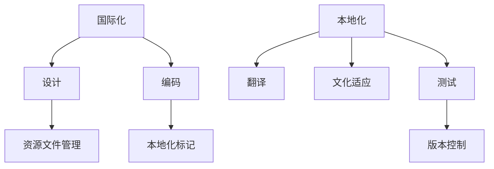

                 

# 《敏捷中的多语言开发：管理LLM国际化挑战》

## 关键词：敏捷开发、多语言开发、LLM国际化、挑战、策略

> **摘要**：本文深入探讨了敏捷开发中多语言开发的重要性，以及大型语言模型（LLM）国际化所面临的挑战。文章首先介绍了敏捷开发的基本概念和优势，随后探讨了多语言开发的必要性及其面临的挑战，重点分析了LLM国际化的难点和解决方案。文章还提供了敏捷多语言开发的实践方法和案例分析，为开发者提供了实用的指导。

## 第1章 引言

### 1.1 问题背景

#### 1.1.1 敏捷开发与国际化

敏捷开发是一种以人为核心、迭代、循序渐进的开发方法。它强调个体和互动、可工作的软件、客户合作和应对变更。随着全球化的深入，国际市场的重要性日益凸显，因此，如何在敏捷开发过程中管理多语言需求成为了一个关键问题。

#### 1.1.2 多语言开发的重要性

多语言开发是为了满足不同语言环境下的用户需求。随着互联网的发展，用户分布越来越广泛，多语言网站和应用程序成为了企业拓展国际市场的必要手段。多语言开发不仅可以提高用户体验，还能提升产品的市场竞争力。

#### 1.1.3 LLM国际化的挑战

大型语言模型（LLM）具有强大的自然语言处理能力，但在国际化过程中面临着一系列挑战，如语言多样性、语言变异和语言理解与生成质量等。如何有效管理这些挑战，实现LLM的国际化，成为开发者需要解决的问题。

### 1.2 术语解释

#### 1.2.1 敏捷开发

敏捷开发是一种软件开发方法，它强调快速迭代、客户合作和持续改进。敏捷开发的核心价值观包括个体和互动、可工作的软件、客户合作和应对变更。

#### 1.2.2 LLM（大型语言模型）

LLM是指通过深度学习技术训练的强大语言处理模型。这些模型具有丰富的知识库和强大的语言理解与生成能力，可以应用于自然语言生成、问答系统、机器翻译等多个领域。

#### 1.2.3 国际化（Internationalization）

国际化是指使软件产品能够适应不同语言和文化环境的过程。国际化通常包括国际化（I18N）和本地化（L10N）两个阶段。

## 第2章 敏捷开发基础

### 2.1 敏捷开发概述

#### 2.1.1 敏捷开发的起源

敏捷开发起源于20世纪90年代末期，是对传统软件开发方法的反思和改进。其核心思想是快速响应变化、持续交付价值。

#### 2.1.2 敏捷开发的核心理念

敏捷开发的核心理念包括：以人为本、迭代开发、客户合作、持续交付和持续改进。

#### 2.1.3 敏捷开发的实践方法

敏捷开发的实践方法包括：每日站立会议、迭代规划、回顾会议、用户故事、迭代和增量交付等。

### 2.2 敏捷开发与传统开发的比较

#### 2.2.1 优势与局限

敏捷开发的优势在于快速响应变化、提高客户满意度、提高团队协作效率。但其局限性在于可能对项目的计划和预算控制造成一定压力。

#### 2.2.2 适用场景

敏捷开发适用于需求变化频繁、用户参与度高、团队协作紧密的项目。

### 2.3 敏捷开发中的团队角色

#### 2.3.1 产品负责人

产品负责人是敏捷团队的核心，负责定义产品的愿景和目标，与用户和客户紧密合作。

#### 2.3.2 Scrum Master

Scrum Master负责确保团队遵循敏捷实践，消除障碍，促进团队协作。

#### 2.3.3 开发人员

开发人员是敏捷团队的核心成员，负责实现产品需求，持续改进开发流程。

## 第3章 多语言开发基础

### 3.1 多语言开发概述

#### 3.1.1 多语言开发的重要性

多语言开发是适应全球化需求的必要手段，可以提高用户体验，拓展市场。

#### 3.1.2 多语言开发的关键要素

多语言开发的关键要素包括：国际化（I18N）、本地化（L10N）、语言资源管理、翻译管理、测试和部署。

#### 3.1.3 多语言开发的挑战

多语言开发的挑战包括：语言多样性、技术难题、成本和时间压力等。

### 3.2 多语言开发技术

#### 3.2.1 国际化（I18N）

国际化是将软件产品设计成可以适应多种语言和文化的过程。国际化通常涉及字符编码、资源文件管理、日期和数字格式等。

#### 3.2.2 本地化（L10N）

本地化是将国际化后的软件产品针对特定语言和文化进行适配的过程。本地化通常涉及翻译、文化适应、本地化测试等。

#### 3.2.3 国际化与本地化的关系

国际化是本地化的前提，本地化是国际化的具体实现。

### 3.3 多语言开发工具

#### 3.3.1 常见工具介绍

常见的多语言开发工具包括：翻译平台、国际化框架、本地化工具和测试工具等。

#### 3.3.2 工具选型考虑因素

工具选型考虑因素包括：语言支持、功能丰富度、易用性、集成能力、成本等。

## 第4章 LLM国际化挑战

### 4.1 LLM国际化的难点

#### 4.1.1 语言多样性

语言多样性是LLM国际化的最大挑战之一。不同语言的语法、词汇和表达方式存在显著差异，这需要模型具备广泛的语言适应性。

#### 4.1.2 语言变异

语言变异是指同一语言在不同地区或群体中的变化。这种变异可能导致模型在特定地区的表现不佳。

#### 4.1.3 语言理解与生成质量

语言理解与生成质量是衡量LLM国际化效果的重要指标。高质量的LLM能够准确理解用户输入并生成符合语言习惯的回复。

### 4.2 LLM国际化的策略

#### 4.2.1 数据源国际化

数据源国际化是LLM国际化的基础。通过收集和整合多语言数据，可以提升模型在不同语言环境中的性能。

#### 4.2.2 模型训练策略

模型训练策略包括：多语言数据融合、迁移学习、多任务学习等。这些策略有助于提升LLM在国际环境下的性能。

#### 4.2.3 模型评估与优化

模型评估与优化是LLM国际化的关键环节。通过评估模型在不同语言环境中的表现，可以发现并解决性能问题。

### 4.3 LLM国际化最佳实践

#### 4.3.1 国际化开发流程

国际化开发流程包括：需求分析、设计、编码、测试和部署。在每个阶段都要充分考虑国际化因素。

#### 4.3.2 跨语言数据管理

跨语言数据管理是LLM国际化的核心。通过合理的数据管理策略，可以提高数据质量和利用效率。

#### 4.3.3 跨文化沟通技巧

跨文化沟通技巧是LLM国际化的关键。了解不同文化的特点和沟通方式，有助于提高国际化项目的成功率。

## 第5章 敏捷中的多语言开发实践

### 5.1 敏捷多语言开发流程

#### 5.1.1 敏捷与多语言开发的结合

敏捷多语言开发是将敏捷开发理念应用于多语言开发过程。其核心思想是快速迭代、持续交付和跨团队协作。

#### 5.1.2 敏捷多语言开发流程

敏捷多语言开发流程包括：国际化需求分析、国际化设计、国际化编码、国际化测试和国际化部署。

#### 5.1.3 敏捷多语言开发的关键步骤

敏捷多语言开发的关键步骤包括：国际化需求管理、国际化测试策略、国际化资源管理、国际化部署策略等。

### 5.2 敏捷多语言开发工具链

#### 5.2.1 工具链概述

敏捷多语言开发工具链包括：国际化框架、翻译平台、本地化工具、测试工具等。

#### 5.2.2 工具链组件

工具链组件包括：国际化框架（如i18next、React-I18next）、翻译平台（如Transifex、Crowdin）、本地化工具（如PO编辑器、 Lokalise）和测试工具（如Jest、Cypress）。

#### 5.2.3 工具链集成与优化

工具链集成与优化是提高敏捷多语言开发效率的关键。通过集成和优化工具链，可以实现自动化、协同和高效的国际化流程。

### 5.3 敏捷多语言开发案例

#### 5.3.1 案例背景

某跨国公司计划开发一款面向全球市场的在线教育平台。为了满足不同语言环境下的用户需求，该公司决定采用敏捷多语言开发模式。

#### 5.3.2 解决方案

解决方案包括：采用国际化框架进行前端国际化、使用翻译平台进行内容翻译、利用本地化工具进行后端国际化、制定详细的国际化测试策略等。

#### 5.3.3 案例总结

通过敏捷多语言开发实践，该公司成功实现了在线教育平台的多语言支持，提高了用户体验和国际化竞争力。

## 第6章 LLM国际化挑战应对策略

### 6.1 LLM国际化挑战分析

#### 6.1.1 挑战识别

LLM国际化挑战主要包括：语言多样性、语言变异、语言理解与生成质量等。

#### 6.1.2 挑战优先级

根据项目的实际情况，确定挑战的优先级。例如，对于某些关键语言，可能需要优先解决语言变异问题。

#### 6.1.3 挑战解决方案

针对不同挑战，提出相应的解决方案。例如，对于语言多样性问题，可以采用多语言数据融合策略；对于语言变异问题，可以采用迁移学习策略。

### 6.2 LLM国际化策略设计

#### 6.2.1 数据源国际化策略

数据源国际化策略包括：多语言数据收集、数据清洗、数据整合等。

#### 6.2.2 模型训练策略

模型训练策略包括：多语言数据融合、迁移学习、多任务学习等。

#### 6.2.3 模型评估与优化策略

模型评估与优化策略包括：多语言测试集构建、性能评估指标、优化算法等。

### 6.3 LLM国际化策略实施与监控

#### 6.3.1 实施步骤

实施步骤包括：国际化需求分析、数据准备、模型训练、模型评估、优化调整等。

#### 6.3.2 监控指标

监控指标包括：模型准确率、响应时间、用户满意度等。

#### 6.3.3 反馈与改进

根据监控结果和用户反馈，对国际化策略进行持续改进。

## 第7章 未来展望与总结

### 7.1 敏捷多语言开发与LLM国际化的未来发展

#### 7.1.1 技术趋势

随着人工智能技术的发展，敏捷多语言开发和LLM国际化将越来越普及。

#### 7.1.2 应用领域扩展

敏捷多语言开发和LLM国际化将在更多领域得到应用，如医疗、金融、教育等。

#### 7.1.3 持续改进的方向

未来将持续改进敏捷多语言开发和LLM国际化的方法和技术，提高开发效率和国际化效果。

### 7.2 总结与展望

#### 7.2.1 敏捷多语言开发的价值

敏捷多语言开发可以提高用户体验，拓展市场，提高产品竞争力。

#### 7.2.2 LLM国际化的关键成功因素

LLM国际化的关键成功因素包括：国际化需求分析、多语言数据管理、模型训练与优化等。

#### 7.2.3 敏捷多语言开发与LLM国际化结合的重要性

敏捷多语言开发与LLM国际化的结合，将为企业带来更大的商业价值。

---

### 作者信息

**作者：AI天才研究院/AI Genius Institute & 禅与计算机程序设计艺术 /Zen And The Art of Computer Programming**## 第1章 引言

### 1.1 问题背景

#### 1.1.1 敏捷开发与国际化

敏捷开发（Agile Development）起源于20世纪90年代末期，是对传统软件开发方法的反思和改进。传统的瀑布模型（Waterfall Model）强调严格的结构化和顺序执行，但在面对需求变化迅速和复杂性增加的今天，这种方法往往无法满足快速响应和持续改进的需求。敏捷开发则强调以人为本、迭代开发、客户合作和应对变更，其核心是快速交付可工作的软件，并通过持续迭代和反馈不断优化。

国际化（Internationalization）是指将软件产品设计成可以适应不同语言和文化环境的过程。随着全球化的深入，越来越多的软件产品需要满足不同国家和地区的用户需求。国际化不仅包括语言支持，还涉及文化适应、本地化（Localization）和全球化（Globalization）等多个方面。本地化是将国际化后的软件产品针对特定语言和文化进行适配的过程，而全球化则是指将产品设计成可以在多个国家和地区使用的通用产品。

#### 1.1.2 多语言开发的重要性

多语言开发是国际化的重要组成部分，它直接影响到产品的用户体验和市场竞争力。以下是一些多语言开发的重要性：

1. **市场拓展**：全球市场越来越多元化，多语言开发可以帮助企业进入新的市场，拓展业务范围。
2. **用户体验**：本地化的用户界面和内容可以提高用户的满意度和忠诚度。
3. **品牌形象**：在国际市场上，能够提供多语言支持的软件往往更能体现企业的专业性和全球化视野。
4. **合规要求**：在某些国家和地区，法律和法规可能要求软件必须支持特定语言。
5. **技术发展**：多语言开发推动了自然语言处理、机器翻译等技术的进步。

#### 1.1.3 LLM国际化的挑战

大型语言模型（Large Language Model，简称LLM）如GPT-3、BERT等，具有强大的自然语言理解与生成能力，但在国际化过程中面临着一系列挑战：

1. **语言多样性**：不同语言的语法结构、词汇和表达方式差异巨大，使得模型需要在多种语言环境中保持高性能。
2. **语言变异**：同一语言在不同地区或社会群体中可能存在显著差异，如美国英语和英国英语的区别，这增加了模型适配的难度。
3. **数据源不足**：高质量的多语言数据资源有限，尤其是对于一些小语种，数据匮乏会限制模型的训练和优化。
4. **语言理解与生成质量**：LLM在不同语言环境中的理解与生成质量可能不一致，这会影响用户的体验。
5. **技术实现**：多语言LLM的开发和部署需要解决复杂的编码、解码、字符编码等问题。

本文将深入探讨如何在敏捷开发框架下管理这些国际化挑战，提供有效的策略和实践方法。

### 1.2 术语解释

为了更好地理解本文的内容，以下是几个关键术语的解释：

#### 1.2.1 敏捷开发

敏捷开发（Agile Development）是一种软件开发方法，它强调快速迭代、客户合作和持续改进。敏捷开发的核心理念包括：

- **以人为本**：重视人的作用和团队合作。
- **迭代开发**：通过短周期迭代来不断优化产品。
- **客户合作**：与客户紧密合作，确保产品满足需求。
- **应对变更**：快速适应需求变化。

敏捷开发的典型实践包括每日站立会议、迭代计划会议、回顾会议、用户故事、迭代交付等。

#### 1.2.2 LLM（大型语言模型）

大型语言模型（Large Language Model，简称LLM）是一种通过深度学习技术训练的神经网络模型，它能够理解和生成自然语言。LLM具有以下特点：

- **大规模训练数据**：通过大量文本数据进行训练，能够学习和理解复杂的语言规律。
- **强大的语言理解能力**：能够理解上下文、语法、语义等多层次的语言信息。
- **灵活的生成能力**：能够根据输入生成连贯、合理的文本。

LLM的应用包括自然语言生成、问答系统、机器翻译、文本摘要等。

#### 1.2.3 国际化（Internationalization）

国际化（Internationalization，简称I18N）是指将软件产品设计成可以适应多种语言和文化的过程。国际化的目标是：

- **支持多种语言**：软件能够显示和解析多种语言的文本。
- **避免硬编码**：软件中的文本不直接嵌入代码，而是存储在外部资源中，便于翻译和更新。
- **文化适应性**：软件能够适应不同文化习惯，如日期格式、货币符号等。

国际化通常包括以下步骤：

1. **设计国际化**：在软件设计阶段考虑国际化需求。
2. **编码国际化**：在编写代码时遵循国际化原则。
3. **测试国际化**：确保软件在不同语言和文化环境下的表现一致。
4. **部署国际化**：将国际化的软件产品发布到不同市场。

#### 1.2.4 本地化（Localization）

本地化（Localization，简称L10N）是指将国际化后的软件产品针对特定语言和文化进行适配的过程。本地化的目标是：

- **本地化内容**：翻译和调整软件中的文本、图片等资源。
- **适应本地文化**：调整日期格式、货币符号、节假日等，以符合目标市场的文化习惯。
- **优化用户体验**：确保软件在目标市场中的可用性和用户友好性。

本地化通常包括以下步骤：

1. **需求分析**：确定本地化需求和目标市场。
2. **资源翻译**：将软件中的文本翻译成目标语言。
3. **文化适应**：调整软件内容以适应目标文化。
4. **测试和验证**：确保本地化后的软件符合预期。

国际化与本地化是相辅相成的，国际化是本地化的前提，而本地化是国际化的具体实现。

### 1.3 文章结构

本文结构如下：

- **第1章 引言**：介绍问题背景和术语解释。
- **第2章 敏捷开发基础**：讨论敏捷开发的起源、核心理念和实践方法。
- **第3章 多语言开发基础**：探讨多语言开发的重要性、关键要素和技术。
- **第4章 LLM国际化挑战**：分析LLM国际化的难点和策略。
- **第5章 敏捷中的多语言开发实践**：介绍敏捷多语言开发流程、工具链和案例。
- **第6章 LLM国际化挑战应对策略**：提出LLM国际化挑战的解决方案和实施步骤。
- **第7章 未来展望与总结**：展望敏捷多语言开发和LLM国际化的未来发展，并总结文章的核心观点。

通过以上结构，本文旨在为开发者提供关于敏捷多语言开发和LLM国际化的全面理解和实践指导。

## 第2章 敏捷开发基础

### 2.1 敏捷开发概述

#### 2.1.1 敏捷开发的起源

敏捷开发（Agile Development）起源于20世纪90年代末期，是对传统软件开发方法的反思和改进。当时，许多软件项目面临着需求变化频繁、项目周期长、交付质量不稳定等问题。为了应对这些问题，软件开发者开始探索新的方法，以更快地响应客户需求、提高软件质量和开发效率。敏捷开发的概念逐渐形成，并在2001年由17位软件开发专家共同签署了《敏捷宣言》（Manifesto for Agile Software Development），提出了敏捷开发的核心理念。

#### 2.1.2 敏捷开发的核心理念

敏捷开发的核心理念包括以下几个方面：

1. **个体和互动重于流程和工具**：敏捷开发强调团队协作和个体的主动性，认为高效的团队合作比依赖特定的流程和工具更为重要。
2. **可工作的软件重于详尽的文档**：敏捷开发认为，最终交付的功能完善的软件比大量的文档更有价值，因此更注重实际软件的交付。
3. **客户合作重于合同谈判**：敏捷开发倡导与客户的紧密合作，通过不断沟通和反馈来确保软件能够满足客户需求。
4. **应对变化重于遵循计划**：敏捷开发强调对需求变化的灵活应对，通过迭代开发和持续交付来不断优化产品。

#### 2.1.3 敏捷开发的实践方法

敏捷开发的实践方法主要包括以下几个方面：

1. **迭代开发**：敏捷开发将项目划分为多个短周期（称为迭代或冲刺），每个迭代都会交付一个可工作的软件版本。通过迭代，团队能够快速响应需求变化，并逐步完善产品。
2. **增量交付**：敏捷开发强调逐步交付功能完整的软件模块，而不是一次性交付整个项目。这种方法可以提高客户满意度，并减少项目风险。
3. **每日站立会议**：每日站立会议是敏捷开发的一个重要实践，团队成员每天花10分钟时间面对面讨论进展、问题和计划，以确保信息同步和问题及时解决。
4. **用户故事**：用户故事是一种描述软件需求的简单、实用和可测试的形式，通常包含“作为...，我想...，以便...”的结构。用户故事有助于团队更好地理解客户需求，并优先考虑重要的功能。
5. **回顾会议**：回顾会议是每个迭代结束时的会议，团队会评估上一迭代的工作表现，识别问题，并讨论改进措施。这种方法有助于持续改进开发流程。

### 2.2 敏捷开发与传统开发的比较

#### 2.2.1 优势与局限

敏捷开发与传统开发方法（如瀑布模型）相比，具有以下优势和局限：

**优势**：

1. **快速响应变化**：敏捷开发强调灵活应对需求变化，能够快速调整开发计划，以适应不断变化的市场需求。
2. **提高客户满意度**：通过迭代开发和增量交付，客户可以尽早看到和体验软件的功能，提供反馈，从而确保产品满足客户需求。
3. **高效团队协作**：敏捷开发强调团队协作和自主管理，有助于提高团队的工作效率和创新能力。
4. **持续改进**：回顾会议和持续反馈机制有助于团队不断优化开发流程，提高产品质量。

**局限**：

1. **计划和控制难度**：由于敏捷开发强调快速迭代和灵活应对变化，可能导致项目的计划和预算控制变得困难。
2. **团队沟通成本**：频繁的会议和沟通可能会增加团队的沟通成本，尤其是在团队分布在不同地理位置时。
3. **文档不足**：敏捷开发更注重实际软件的交付，可能导致文档编写不足，影响项目的可维护性。

#### 2.2.2 适用场景

敏捷开发适用于以下场景：

1. **需求变化频繁**：当需求变化频繁且不可预测时，敏捷开发能够更好地适应这种变化，确保产品按时交付。
2. **客户需求明确**：当客户需求明确且对软件质量有较高要求时，敏捷开发可以帮助团队快速交付高质量的产品。
3. **团队协作紧密**：敏捷开发强调团队协作，适用于团队协作紧密、沟通顺畅的项目。
4. **高风险项目**：当项目面临较高的风险时，敏捷开发可以通过快速迭代和持续交付来降低风险。

然而，对于需求明确、项目周期长、变化较少的传统项目，瀑布模型等传统开发方法可能更为合适。

### 2.3 敏捷开发中的团队角色

敏捷开发中，团队成员的角色与传统开发有所不同，更加注重协作和自主管理。以下是敏捷开发中的主要团队角色及其职责：

#### 2.3.1 产品负责人（Product Owner）

产品负责人是敏捷团队的核心成员，负责定义产品的愿景和目标，管理产品待办事项（Product Backlog），并与开发团队、客户和利益相关者保持紧密沟通。产品负责人的主要职责包括：

1. **定义产品愿景**：明确产品的目标、功能和价值，确保团队朝着正确的方向前进。
2. **管理待办事项**：根据市场需求和优先级，持续更新和调整产品待办事项，确保团队始终在解决最重要的问题。
3. **提供反馈**：与开发团队和客户密切合作，提供关于产品功能、设计和用户体验的反馈，以确保产品满足用户需求。
4. **沟通协调**：协调团队内外部的沟通，确保所有人都清楚产品的需求和期望。

#### 2.3.2 Scrum Master

Scrum Master是敏捷团队的教练和促进者，负责确保团队遵循敏捷实践，消除团队开发过程中的障碍，并促进团队的协作和持续改进。Scrum Master的主要职责包括：

1. **确保团队遵循敏捷实践**：监督团队的工作流程，确保团队遵循敏捷宣言和原则，例如每日站立会议、迭代计划和回顾会议等。
2. **消除障碍**：识别并解决团队在开发过程中遇到的问题和障碍，确保团队能够专注于交付高质量的产品。
3. **促进团队协作**：鼓励团队成员之间的沟通和协作，提高团队的凝聚力和效率。
4. **持续改进**：与团队一起识别改进机会，并推动实施改进措施，以持续提高开发流程和产品质量。

#### 2.3.3 开发人员（Developers）

开发人员是敏捷团队的核心成员，负责实现产品需求、编写代码和测试软件。开发人员的职责包括：

1. **实现产品需求**：根据产品待办事项，实现产品功能和特性，确保交付的软件符合需求。
2. **编写代码**：编写高质量的代码，遵循编码标准和最佳实践，确保代码的可读性和可维护性。
3. **测试软件**：编写和执行测试用例，确保软件的质量和稳定性，发现和修复潜在的问题。
4. **协作和反馈**：积极参与团队协作，与其他团队成员共享知识和经验，提供和接收关于产品设计和用户体验的反馈。

通过以上团队角色的协作和自主管理，敏捷开发能够更好地应对需求变化，提高开发效率和产品质量。

## 第3章 多语言开发基础

### 3.1 多语言开发概述

#### 3.1.1 多语言开发的重要性

多语言开发（Multilingual Development）是软件开发中一个重要的领域，其核心目标是确保软件产品能够在不同的语言和文化环境中运行。随着全球化的加速和跨国企业的兴起，多语言开发的重要性日益凸显。以下是多语言开发的重要性：

1. **市场拓展**：多语言开发可以帮助企业进入新的市场，吸引全球用户，从而扩大市场份额。
2. **用户体验**：本地化的用户界面和内容可以提高用户的满意度和忠诚度，增强用户体验。
3. **合规要求**：在某些国家和地区，法律和法规可能要求软件必须支持特定语言，例如欧盟的通用数据保护条例（GDPR）。
4. **品牌形象**：多语言开发可以提升企业的品牌形象，显示企业对全球用户的重视和承诺。
5. **技术进步**：多语言开发推动了自然语言处理、机器翻译等技术的发展。

#### 3.1.2 多语言开发的关键要素

多语言开发涉及多个关键要素，这些要素是确保软件国际化成功的基础：

1. **国际化（Internationalization）**：国际化是指将软件设计成可以适应多种语言和文化的过程。国际化的目标是确保软件中的语言和文化元素可以轻松地替换和更新，而不会影响软件的其他部分。

2. **本地化（Localization）**：本地化是指将国际化的软件产品针对特定语言和文化进行调整的过程。本地化包括翻译文本、调整日期格式、货币符号、图像等，使其符合目标市场的文化和语言习惯。

3. **语言资源管理**：语言资源管理涉及收集、存储和管理软件中使用的语言资源，包括文本、图像、音频等。有效的语言资源管理可以提高翻译和本地化的效率。

4. **翻译管理**：翻译管理是指协调和管理软件的翻译过程，包括选择翻译服务提供商、管理翻译预算和确保翻译质量。

5. **测试**：测试是确保多语言软件质量和功能完整性的关键步骤。测试应涵盖不同语言环境下的用户界面、功能、性能和安全性。

6. **部署**：部署是将多语言软件产品发布到不同市场的过程。部署应确保软件在目标市场中的可用性、兼容性和用户体验。

#### 3.1.3 多语言开发的挑战

多语言开发面临着多个挑战，这些挑战可能影响项目的进度和质量：

1. **语言多样性**：不同语言的语法、词汇和表达方式差异巨大，需要开发团队具备跨语言开发的能力。
2. **技术难题**：国际化涉及到字符编码、日期格式、货币符号等技术问题，需要专业的技术支持。
3. **成本和时间压力**：多语言开发通常需要额外的成本和时间，尤其是在翻译和管理多语言资源方面。
4. **文化差异**：不同文化有不同的价值观和行为规范，需要本地化内容以适应目标市场的文化。
5. **质量保证**：确保多语言软件在不同语言环境下的功能完整性和用户体验一致性是一个挑战。

### 3.2 多语言开发技术

#### 3.2.1 国际化（Internationalization）

国际化（Internationalization，简称I18N）是将软件设计成可以适应多种语言和文化的过程。国际化的关键目标是在不修改源代码的情况下，使软件能够支持多种语言。以下是一些国际化技术的关键点：

1. **字符编码**：字符编码是将文本转换为计算机可以处理的数字格式。常见的编码标准包括UTF-8、UTF-16和ISO-8859-1。国际化要求软件能够处理和存储多种字符编码。

2. **资源文件管理**：国际化通常涉及将文本和其他资源（如图像、音频等）存储在外部资源文件中，如.properties文件、JSON文件或XML文件。这些资源文件可以根据不同的语言环境进行替换。

3. **平台无关性**：国际化要求软件在不同的操作系统和平台上都能正常运行。例如，Java和.NET平台提供了强大的国际化支持。

4. **本地化标记**：在源代码中，使用特定的标记（如Java中的`_${key}`或C#中的`$"[name]"`)来引用外部资源文件中的文本，以便在运行时根据当前语言环境替换。

5. **元数据管理**：国际化还涉及管理元数据，如语言名称、区域设置等。这些信息通常存储在配置文件或数据库中，以支持动态语言切换。

#### 3.2.2 本地化（Localization）

本地化（Localization，简称L10N）是将国际化的软件产品针对特定语言和文化进行调整的过程。本地化的关键步骤包括：

1. **翻译**：翻译是将源语言的文本转换为目标语言的文本。高质量的翻译是本地化的关键，通常需要专业的翻译人员和工具。

2. **文化适应**：本地化不仅仅是翻译，还包括调整文本以适应目标市场的文化和语言习惯。这包括调整日期格式、货币符号、度量单位等。

3. **图像和媒体调整**：本地化还涉及调整图像、视频、音频和其他媒体内容，使其符合目标市场的文化规范。

4. **测试和验证**：本地化后的软件需要在不同的语言环境中进行测试，确保其功能完整性和用户体验一致性。

5. **版本控制**：在本地化过程中，需要管理不同版本的翻译文件，以确保正确应用最新的更改。

#### 3.2.3 国际化与本地化的关系

国际化与本地化是相辅相成的，国际化是本地化的前提，而本地化是国际化的具体实现。以下是一个简单的国际化与本地化关系示意图：

国际化过程中，设计阶段考虑如何支持多种语言，编码阶段使用国际化标记和资源文件管理。本地化阶段则涉及翻译、文化适应和测试等步骤。

### 3.3 多语言开发工具

多语言开发工具可以帮助开发者和管理人员更高效地实现国际化与本地化。以下是一些常见的多语言开发工具：

#### 3.3.1 常见工具介绍

1. **国际化框架**：例如Java中的Spring Framework、Python中的Babel、C#中的Resource Manager等，提供国际化支持的基础库和工具。

2. **翻译平台**：如Transifex、 Crowdin、Memsource等，提供在线翻译协作和管理功能，可以帮助团队高效地进行翻译工作。

3. **本地化工具**：如Lokalise、i18next、React-I18next等，提供本地化功能，包括语言切换、多语言内容管理和本地化测试。

4. **测试工具**：如Selenium、Jest、Cypress等，提供自动化测试功能，确保多语言软件在不同语言环境下的功能完整性和用户体验。

#### 3.3.2 工具选型考虑因素

选择多语言开发工具时，需要考虑以下因素：

1. **语言支持**：确保工具支持所需的编程语言和平台。

2. **功能丰富度**：选择具有丰富功能的工具，如支持翻译记忆、版本控制和自动化测试等。

3. **易用性**：选择用户界面友好、易于使用的工具，提高团队的生产效率。

4. **集成能力**：确保工具能够与其他开发工具和平台集成，如持续集成系统、项目管理工具等。

5. **成本**：考虑工具的预算和成本，确保其符合团队的财务预算。

6. **社区和文档**：选择有良好社区支持和详细文档的工具，以便团队成员能够快速学习和解决问题。

通过合理选择和使用多语言开发工具，团队可以更高效地实现软件的国际化与本地化，提高产品质量和市场竞争力。

## 第4章 LLM国际化挑战

### 4.1 LLM国际化的难点

#### 4.1.1 语言多样性

语言多样性是LLM国际化的最大挑战之一。地球上的语言种类繁多，每种语言都有其独特的语法结构、词汇和表达方式。对于LLM来说，这意味着需要具备能够理解和生成多种语言的强大能力。以下是一些具体难点：

1. **语言理解**：不同语言的语义和语法规则差异很大，使得模型在处理非母语文本时可能无法准确理解文本的含义。
2. **上下文理解**：某些语言的表达可能依赖于上下文，而LLM在不同语言中处理上下文的能力可能不一致。
3. **语言变异**：即使在同一语言中，不同地区和群体的语言使用也可能存在显著差异，如美式英语和英式英语，这增加了模型的适应性挑战。

#### 4.1.2 语言变异

语言变异是指同一语言在不同地区或社会群体中的变化。这种变异可能导致LLM在特定地区的表现不佳。以下是一些具体例子：

1. **地域差异**：例如，英语在美国和英国之间存在许多差异，如拼写、词汇和语法规则。
2. **社会阶层差异**：某些词汇和表达方式在不同社会阶层中可能有所不同，这需要模型能够理解和适应这些差异。
3. **年龄和性别差异**：不同年龄和性别的用户可能会使用不同的语言风格和表达方式，这要求模型具备广泛的适应性。

#### 4.1.3 语言理解与生成质量

语言理解与生成质量是衡量LLM国际化效果的重要指标。高质量的LLM能够准确理解用户输入并生成符合语言习惯的回复。以下是几个相关难点：

1. **生成准确性**：模型生成的文本需要准确无误，避免误解或错误的语义。
2. **流畅性**：生成的文本需要流畅自然，避免生硬或不自然的语言。
3. **文化适应性**：模型需要能够适应不同文化的语言习惯，如礼貌用语、俚语、幽默表达等。
4. **情感智能**：在某些场景中，模型需要能够理解和模拟人类的情感表达，例如在客户服务或聊天机器人应用中。

### 4.2 LLM国际化的策略

为了应对LLM国际化面临的挑战，需要采取一系列策略来提高模型在不同语言环境中的性能。以下是一些关键策略：

#### 4.2.1 数据源国际化

数据源国际化是LLM国际化的基础。高质量的多语言数据是实现高性能LLM的关键。以下是一些实现策略：

1. **多语言数据收集**：收集和整合来自不同语言的数据，包括文本、音频和视频等。可以采用公开的数据集、自有数据、第三方数据源等多种方式。

2. **数据清洗与预处理**：对收集到的数据进行清洗和预处理，包括去除噪声、标准化文本、消除重复等，以提高数据质量。

3. **数据融合**：将来自不同语言的数据进行融合，以增强模型的泛化能力。可以通过交叉语言信息融合、多语言数据对齐等技术实现数据融合。

#### 4.2.2 模型训练策略

模型训练策略对于LLM在国际环境中的性能至关重要。以下是一些具体策略：

1. **多语言模型训练**：训练一个能够处理多种语言的模型，如多语言BERT（mBERT）或XLM（Cross-lingual Language Model）。这些模型可以通过共享底层语言知识来提高多语言性能。

2. **迁移学习**：利用已训练的单语言模型（如英语模型）作为预训练模型，然后在目标语言上进行微调。迁移学习可以帮助模型快速适应新的语言环境。

3. **多任务学习**：通过同时训练多个任务（如机器翻译、问答系统和文本摘要）来提高模型的多语言能力。多任务学习可以增强模型对不同语言任务的理解和生成能力。

4. **自适应训练**：根据模型的实际性能和用户反馈，动态调整训练策略。例如，对于表现不佳的语言，可以增加该语言的数据或调整训练参数。

#### 4.2.3 模型评估与优化

模型评估与优化是确保LLM国际化效果的重要步骤。以下是一些关键策略：

1. **多语言测试集**：构建包含多种语言的测试集，用于评估模型在不同语言环境中的性能。测试集应覆盖不同语言和文化背景，以确保评估结果的全面性和准确性。

2. **性能指标**：定义合适的性能指标来评估模型在不同语言环境中的表现。常见的指标包括准确率、召回率、F1分数、BLEU分数等。

3. **对比测试**：将模型在不同语言环境中的性能与基线模型或竞争模型进行对比，以评估改进效果。

4. **用户反馈**：收集用户在不同语言环境中的反馈，用于指导模型的优化。用户反馈可以帮助发现模型在特定语言环境中的缺陷和改进空间。

5. **持续优化**：根据评估结果和用户反馈，持续调整和优化模型。这可以包括数据增强、算法改进、参数调整等。

#### 4.2.4 跨语言数据管理

跨语言数据管理是LLM国际化的核心。以下是一些具体策略：

1. **数据资源库**：建立和维护一个跨语言数据资源库，包括文本、音频、视频等多种类型的数据。资源库应支持快速检索和高效的数据处理。

2. **数据版本控制**：对跨语言数据进行版本控制，确保不同版本的数据能够正确对应和整合。

3. **数据共享与协作**：鼓励跨团队和跨地区的协作，共享数据资源和知识，以提高数据利用效率和国际化效果。

4. **数据质量控制**：建立严格的数据质量控制流程，确保数据的质量和一致性。可以采用自动化工具和人工审核相结合的方式。

#### 4.2.5 跨文化沟通技巧

跨文化沟通技巧是LLM国际化的重要环节。以下是一些具体策略：

1. **文化研究**：深入了解目标市场的文化特点和语言习惯，包括礼仪、价值观和沟通方式等。

2. **本地化团队**：组建由本地化专家、语言学家和工程师组成的团队，负责处理跨语言和文化的问题。

3. **用户研究**：通过用户研究，了解目标用户的需求、偏好和行为习惯，以优化产品设计和用户体验。

4. **反馈机制**：建立有效的用户反馈机制，收集用户在使用过程中的体验和反馈，及时调整和改进产品。

通过以上策略，可以有效地应对LLM国际化面临的挑战，提高模型在不同语言环境中的性能和用户体验。国际化不仅是一个技术问题，也是一个文化和社会问题，需要多方面的综合考虑和持续优化。

### 4.3 LLM国际化最佳实践

#### 4.3.1 国际化开发流程

在LLM国际化过程中，制定和遵循一个明确的开发流程是至关重要的。以下是一些国际化开发流程的最佳实践：

1. **需求分析**：在项目初期，与客户和利益相关者进行深入的需求分析，明确国际化目标和需求。这包括确定支持的语言、目标市场和文化需求。

2. **规划与设计**：在规划与设计阶段，考虑国际化需求，确保软件架构支持多语言。设计阶段应包括国际化设计的审查，以确保软件能够灵活适应多种语言。

3. **编码与测试**：在编码阶段，遵循国际化编码规范，例如使用国际化框架和工具来管理语言资源。在测试阶段，应包括多语言测试，确保软件在不同语言环境中的功能完整性和用户体验一致性。

4. **部署与维护**：在部署阶段，确保多语言软件能够顺利发布到目标市场。在维护阶段，持续关注用户反馈，及时更新和优化软件。

#### 4.3.2 跨语言数据管理

跨语言数据管理是LLM国际化成功的关键。以下是一些跨语言数据管理的最佳实践：

1. **数据资源库**：建立一个集中式的跨语言数据资源库，包括文本、音频、视频等。资源库应支持快速检索和高效的数据处理。

2. **数据标准化**：对收集到的数据进行标准化处理，包括字符编码转换、文本清洗和格式统一等。这有助于提高数据的一致性和可用性。

3. **数据质量控制**：建立严格的数据质量控制流程，包括自动化检查和人工审核。确保数据的质量和准确性，以支持高质量的LLM训练和优化。

4. **数据版本控制**：对跨语言数据进行版本控制，确保不同版本的数据能够正确对应和整合。

#### 4.3.3 跨文化沟通技巧

在国际化过程中，跨文化沟通技巧至关重要。以下是一些跨文化沟通的最佳实践：

1. **文化研究**：深入了解目标市场的文化特点和语言习惯，包括礼仪、价值观和沟通方式等。

2. **本地化团队**：组建由本地化专家、语言学家和工程师组成的团队，负责处理跨语言和文化的问题。

3. **用户研究**：通过用户研究，了解目标用户的需求、偏好和行为习惯，以优化产品设计和用户体验。

4. **反馈机制**：建立有效的用户反馈机制，收集用户在使用过程中的体验和反馈，及时调整和改进产品。

5. **跨团队协作**：鼓励跨团队和跨地区的协作，促进知识共享和经验交流，提高国际化项目的成功率和效率。

通过遵循以上最佳实践，团队可以更有效地管理LLM国际化的挑战，提高模型在不同语言环境中的性能和用户体验。国际化不仅是一个技术问题，也是一个文化和沟通问题，需要多方面的综合考虑和持续优化。

### 4.4 LLM国际化的成功案例分析

#### 4.4.1 案例背景

一个成功的LLM国际化案例是谷歌翻译（Google Translate）。谷歌翻译是一个跨语言的机器翻译服务，旨在帮助用户在不同语言之间进行交流。谷歌翻译的成功不仅在于其高准确率的翻译结果，还在于其全面支持多种语言和高效的用户体验。

#### 4.4.2 解决方案

谷歌翻译在国际化过程中采取了以下解决方案：

1. **多语言支持**：谷歌翻译支持超过100种语言，这得益于其强大的多语言数据资源和模型训练策略。谷歌通过收集和整合大量的多语言数据，包括文本、语音和图像，以支持多种语言的翻译。

2. **模型训练策略**：谷歌采用多种模型训练策略，如迁移学习和多任务学习，以提高模型在不同语言环境中的性能。例如，谷歌的mBERT（Multilingual BERT）模型是一个专门设计用于跨语言理解和生成的模型，它通过共享底层语言知识来提高多种语言的处理能力。

3. **用户界面本地化**：谷歌翻译的用户界面也进行了本地化，以适应不同国家和地区的文化和语言习惯。用户可以在应用程序中切换语言，并享受本地化的用户界面和体验。

4. **持续优化**：谷歌不断收集用户反馈，并通过机器学习和数据分析技术持续优化翻译模型。这种方法确保了谷歌翻译能够不断适应新的语言和文化环境，提供高质量的翻译服务。

#### 4.4.3 案例总结

谷歌翻译的成功为LLM国际化提供了宝贵的经验和启示：

1. **数据资源的重要性**：高质量的多语言数据是实现高性能LLM的基础。谷歌通过大量的数据收集和整合，为模型训练提供了丰富的资源。

2. **模型训练策略的关键性**：选择合适的模型训练策略，如迁移学习和多任务学习，可以显著提高模型在不同语言环境中的性能。

3. **用户界面本地化的重要性**：本地化的用户界面可以提高用户体验，确保软件在目标市场中的可用性和用户友好性。

4. **持续优化和反馈机制的必要性**：持续优化和反馈机制有助于模型不断适应新的语言和文化环境，提供高质量的翻译服务。

通过谷歌翻译的成功案例，我们可以看到，LLM国际化不仅需要强大的技术支持，还需要全面考虑数据资源、模型训练策略和用户界面本地化等多个方面。这些最佳实践为其他企业在国际化过程中提供了有益的参考。

### 4.5 LLM国际化面临的挑战与未来展望

#### 4.5.1 挑战分析

尽管LLM国际化取得了显著进展，但仍然面临一系列挑战：

1. **数据不足**：许多小语种的数据资源仍然有限，这限制了模型在这些语言中的性能。
2. **文化差异**：不同文化之间的语言习惯和表达方式差异较大，这增加了模型本地化的难度。
3. **技术复杂性**：国际化涉及字符编码、资源管理、语言模型训练等多个技术层面，需要复杂的解决方案。
4. **用户体验**：用户对翻译质量的要求越来越高，这要求模型提供更准确、更自然的翻译结果。
5. **成本与资源**：国际化需要大量的时间和资源投入，对于中小企业来说，这可能是一个巨大的负担。

#### 4.5.2 未来展望

未来，LLM国际化有望在以下几个方面取得突破：

1. **数据资源扩展**：随着全球数据的增长，预计会有更多的多语言数据资源成为可用，这有助于提高模型在小语种中的性能。
2. **技术创新**：人工智能和机器学习技术的进步将为LLM国际化提供更多先进的解决方案，如更多的迁移学习技术和多任务学习模型。
3. **多模态翻译**：结合文本、语音、图像等多种模态的数据，可以实现更准确和自然的翻译体验。
4. **用户参与**：用户可以通过反馈机制直接参与翻译过程的优化，提高翻译质量和用户体验。
5. **开源合作**：开放源代码项目和跨行业的合作将进一步推动LLM国际化技术的发展。

通过解决当前面临的挑战和把握未来的发展趋势，LLM国际化将在全球范围内发挥更大的作用，为跨国交流和商务合作提供更强大的支持。

## 第5章 敏捷中的多语言开发实践

### 5.1 敏捷多语言开发流程

#### 5.1.1 敏捷与多语言开发的结合

敏捷开发与多语言开发相结合，旨在通过敏捷的方法论提高多语言软件开发的效率和质量。这种结合的关键在于如何平衡敏捷开发的快速迭代和国际化需求，以确保软件在不同语言环境中都能够正常运行。

1. **快速迭代与国际化**：敏捷开发强调快速交付可工作的软件，而多语言开发需要确保每个迭代中的功能都能被本地化。为了实现这一目标，团队需要在每个迭代中预留时间进行国际化工作。

2. **国际化需求管理**：在敏捷开发中，国际化需求应被视为与功能需求同等重要。产品负责人需要明确国际化需求，并在产品待办事项（Product Backlog）中优先考虑。

3. **团队协作**：敏捷开发强调跨职能团队的协作。在多语言开发中，团队应包括国际化专家、开发人员、测试人员和本地化工程师，以确保国际化工作的顺利进行。

#### 5.1.2 敏捷多语言开发流程

敏捷多语言开发流程包括以下关键步骤：

1. **需求分析**：在项目启动阶段，团队需要与客户和利益相关者进行深入的需求分析，明确软件需要支持的语言和本地化要求。

2. **国际化设计**：在软件设计阶段，团队应考虑国际化需求，确保软件架构支持多语言。这包括设计国际化友好的用户界面、字符编码支持和资源管理策略。

3. **编码与本地化**：在编码阶段，开发人员应遵循国际化编码规范，同时进行本地化工作。可以使用国际化框架和工具来管理语言资源，确保代码的可维护性和可扩展性。

4. **测试与验证**：在测试阶段，团队应进行多语言测试，确保软件在不同语言环境下的功能完整性和用户体验一致性。测试应包括功能测试、性能测试和文化适应测试。

5. **部署与维护**：在部署阶段，团队应确保多语言软件能够顺利发布到目标市场。在维护阶段，持续关注用户反馈，及时更新和优化软件。

#### 5.1.3 敏捷多语言开发的关键步骤

1. **国际化需求管理**：明确国际化需求，并将其纳入产品待办事项。

2. **国际化设计审查**：确保软件架构支持多语言，设计国际化友好的用户界面。

3. **国际化编码规范**：遵循国际化编码规范，确保代码的可维护性和可扩展性。

4. **多语言资源管理**：使用国际化框架和工具来管理语言资源，如文本、图像和音频。

5. **多语言测试策略**：制定多语言测试计划，确保软件在不同语言环境下的功能完整性和用户体验一致性。

6. **持续国际化**：在整个开发周期中持续进行国际化工作，确保每个迭代的功能都能被本地化。

### 5.2 敏捷多语言开发工具链

#### 5.2.1 工具链概述

敏捷多语言开发工具链包括多种工具和框架，旨在提高国际化开发效率和软件质量。以下是一些常见的工具和框架：

1. **国际化框架**：如Java中的Spring Framework、Python中的Babel、C#中的Resource Manager等，提供国际化支持的基础库和工具。

2. **翻译平台**：如Transifex、Crowdin、Memsource等，提供在线翻译协作和管理功能，可以帮助团队高效地进行翻译工作。

3. **本地化工具**：如Lokalise、i18next、React-I18next等，提供本地化功能，包括语言切换、多语言内容管理和本地化测试。

4. **测试工具**：如Selenium、Jest、Cypress等，提供自动化测试功能，确保多语言软件在不同语言环境下的功能完整性和用户体验一致性。

5. **持续集成工具**：如Jenkins、GitLab CI/CD等，提供自动化构建和测试功能，确保多语言软件的持续集成和交付。

#### 5.2.2 工具链组件

敏捷多语言开发工具链的组件包括：

1. **国际化框架**：用于管理国际化资源和本地化标记，确保代码中的文本可以被动态替换。

2. **翻译平台**：用于集中管理和协作翻译工作，确保翻译质量。

3. **本地化工具**：用于将翻译内容集成到应用程序中，并提供本地化测试。

4. **测试工具**：用于确保多语言软件在不同语言环境下的功能完整性和用户体验一致性。

5. **持续集成工具**：用于自动化构建、测试和部署流程，确保多语言软件的持续交付。

#### 5.2.3 工具链集成与优化

集成和优化敏捷多语言开发工具链是提高开发效率的关键。以下是一些策略：

1. **集成管理**：使用配置管理工具（如Puppet、Ansible）来管理不同环境中的工具和配置，确保工具链的一致性和可重复性。

2. **自动化测试**：通过编写自动化测试脚本，确保多语言软件在不同语言环境下的功能完整性和用户体验一致性。

3. **持续集成**：使用持续集成工具（如Jenkins、GitLab CI/CD）来自动化构建、测试和部署流程，确保多语言软件的持续交付。

4. **性能优化**：通过性能测试和优化工具（如JMeter、LoadRunner）来评估和优化多语言软件的性能和稳定性。

5. **反馈机制**：建立有效的用户反馈机制，收集用户在使用过程中的体验和反馈，及时调整和优化工具链。

通过合理集成和优化工具链，团队可以更高效地管理国际化开发流程，提高软件质量和市场竞争力。

### 5.3 敏捷多语言开发案例

#### 5.3.1 案例背景

一个实际的敏捷多语言开发案例是某国际知名在线教育平台。该平台旨在为全球用户提供高质量的在线学习资源，支持多种语言。为了满足不同国家和地区的用户需求，该平台采用了敏捷多语言开发模式。

#### 5.3.2 解决方案

1. **需求分析**：在项目启动阶段，团队与客户和利益相关者进行了深入的需求分析，明确了平台需要支持的语言和本地化要求。团队确定了主要目标市场，并确定了需要翻译和本地化的内容。

2. **国际化设计**：在软件设计阶段，团队确保软件架构支持多语言。他们使用了国际化框架（如React-I18next）来管理国际化资源和本地化标记，确保代码中的文本可以被动态替换。同时，团队设计了国际化友好的用户界面，确保用户可以轻松切换语言。

3. **编码与本地化**：在编码阶段，开发人员遵循国际化编码规范，使用国际化框架来管理语言资源。他们使用翻译平台（如Transifex）来集中管理和协作翻译工作，确保翻译质量。开发人员还在代码中嵌入本地化标记，以便翻译人员能够轻松地替换文本。

4. **测试与验证**：在测试阶段，团队制定了多语言测试计划，确保平台在不同语言环境下的功能完整性和用户体验一致性。他们使用自动化测试工具（如Cypress）来执行功能测试和用户体验测试，确保多语言平台的质量。

5. **部署与维护**：在部署阶段，团队使用持续集成工具（如Jenkins）来自动化构建、测试和部署流程，确保多语言平台能够顺利发布到不同市场。在维护阶段，团队持续关注用户反馈，并根据用户反馈进行软件更新和优化。

#### 5.3.3 案例总结

通过采用敏捷多语言开发模式，该国际知名在线教育平台成功实现了以下成果：

1. **多语言支持**：平台支持多种语言，为全球用户提供了一致的用户体验。

2. **高效开发**：敏捷开发方法提高了开发效率，团队能够快速响应需求变化和用户反馈。

3. **高质量软件**：通过严格的测试和反馈机制，平台在不同语言环境下的功能完整性和用户体验一致性得到了保障。

4. **用户满意度**：用户对平台的满意度显著提高，平台在国际市场上的竞争力得到了增强。

通过这个案例，我们可以看到敏捷多语言开发如何帮助企业在国际化过程中提高开发效率和产品质量，从而实现商业成功。

## 第6章 LLM国际化挑战应对策略

### 6.1 LLM国际化挑战分析

#### 6.1.1 挑战识别

在LLM国际化过程中，团队需要识别和应对一系列挑战。以下是LLM国际化面临的主要挑战：

1. **语言多样性**：不同语言的语法、词汇和表达方式差异巨大，这使得LLM在处理非母语文本时可能存在理解偏差。
2. **数据源不足**：高质量的多语言数据资源有限，尤其是对于小语种，数据匮乏会限制模型的训练和优化。
3. **语言变异**：同一语言在不同地区或社会群体中可能存在显著差异，增加了模型适配的难度。
4. **语言理解与生成质量**：LLM在不同语言环境中的理解与生成质量可能不一致，影响用户体验。
5. **技术复杂性**：国际化涉及字符编码、资源管理、模型训练等多个技术层面，需要复杂的技术解决方案。

#### 6.1.2 挑战优先级

识别挑战后，团队需要确定挑战的优先级，以合理分配资源和精力。以下是挑战的优先级：

1. **语言多样性**：语言多样性是国际化中的基础挑战，应首先解决。高质量的多语言数据是实现高性能LLM的关键。
2. **数据源不足**：数据源不足会直接影响模型性能，因此应优先解决。可以通过数据采集、数据共享和迁移学习等技术手段解决。
3. **语言变异**：语言变异对用户体验有直接影响，应优先解决。可以通过多语言数据融合、迁移学习和自适应训练等策略应对。
4. **语言理解与生成质量**：这是用户最直接感知的挑战，应确保在合理时间内解决。可以通过多语言测试、用户反馈和持续优化来实现。
5. **技术复杂性**：技术复杂性涉及多个方面，可以在解决其他挑战的同时逐步解决。通过培训、技术文档和团队协作来应对。

#### 6.1.3 挑战解决方案

针对上述挑战，团队可以采取以下解决方案：

1. **语言多样性**：通过多语言数据融合和迁移学习策略，提高模型在不同语言环境中的性能。例如，使用mBERT（Multilingual BERT）或XLM（Cross-lingual Language Model）等跨语言模型。
2. **数据源不足**：通过扩展数据采集范围、共享数据资源和利用迁移学习技术，增加高质量多语言数据。例如，可以从开源数据集、合作伙伴和用户反馈中获取数据。
3. **语言变异**：通过多语言数据融合、迁移学习和自适应训练策略，使模型能够适应不同地区和群体的语言习惯。例如，可以在特定语言区域的数据上进行微调，提高模型在该区域的性能。
4. **语言理解与生成质量**：通过多语言测试集、用户反馈和持续优化策略，提高模型在不同语言环境中的理解与生成质量。例如，定期进行性能评估和用户测试，及时调整模型参数。
5. **技术复杂性**：通过培训、技术文档和团队协作，逐步解决技术复杂性。例如，制定国际化开发规范，提供技术支持文档，组织技术分享会议，提高团队的技术水平。

### 6.2 LLM国际化策略设计

为了有效应对LLM国际化挑战，团队需要设计一系列策略。以下是几个关键策略：

#### 6.2.1 数据源国际化策略

数据源国际化是LLM国际化的基础。以下是一些数据源国际化策略：

1. **数据采集**：扩展数据采集范围，收集多种语言的数据。可以从开源数据集、社交媒体、合作伙伴和用户反馈中获取数据。
2. **数据整合**：整合来自不同语言的数据，消除数据冗余和噪声。可以通过数据清洗、对齐和融合等技术手段实现。
3. **数据共享**：建立跨团队和跨组织的共享机制，促进多语言数据资源的共享和利用。

#### 6.2.2 模型训练策略

模型训练策略对于LLM在国际环境中的性能至关重要。以下是一些模型训练策略：

1. **多语言模型训练**：训练能够处理多种语言的模型，如mBERT或XLM。这些模型可以通过共享底层语言知识来提高多语言性能。
2. **迁移学习**：利用已训练的单语言模型作为预训练模型，然后在目标语言上进行微调。这种方法可以快速提升模型在新语言环境中的性能。
3. **多任务学习**：通过同时训练多个任务（如机器翻译、问答系统和文本摘要）来提高模型的多语言能力。

#### 6.2.3 模型评估与优化策略

模型评估与优化策略是确保LLM国际化效果的重要步骤。以下是一些策略：

1. **多语言测试集**：构建包含多种语言的测试集，用于评估模型在不同语言环境中的性能。测试集应覆盖不同语言和文化背景。
2. **性能指标**：定义合适的性能指标来评估模型在不同语言环境中的表现，如准确率、召回率、F1分数和BLEU分数等。
3. **用户反馈**：收集用户在不同语言环境中的反馈，用于指导模型的优化。用户反馈可以帮助发现模型在特定语言环境中的缺陷和改进空间。
4. **持续优化**：根据评估结果和用户反馈，持续调整和优化模型。这可以包括数据增强、算法改进和参数调整等。

### 6.3 LLM国际化策略实施与监控

实施LLM国际化策略后，团队需要持续监控和优化模型的国际化效果。以下是实施与监控的关键步骤：

#### 6.3.1 实施步骤

1. **需求分析**：明确国际化需求，确定需要支持的语言和本地化要求。
2. **数据准备**：收集和整合多语言数据，进行数据清洗和预处理。
3. **模型训练**：使用多语言数据训练模型，采用迁移学习和多任务学习策略。
4. **模型评估**：构建多语言测试集，评估模型在不同语言环境中的性能。
5. **优化调整**：根据评估结果和用户反馈，调整模型参数和训练策略。

#### 6.3.2 监控指标

1. **模型性能指标**：如准确率、召回率、F1分数和BLEU分数等。
2. **用户体验指标**：如用户满意度、错误率、响应时间等。
3. **系统稳定性指标**：如系统的响应速度、资源利用率等。

#### 6.3.3 反馈与改进

1. **用户反馈**：收集用户在不同语言环境中的反馈，了解模型的实际应用效果。
2. **性能评估**：定期进行性能评估，发现并解决模型在特定语言环境中的问题。
3. **持续改进**：根据用户反馈和性能评估结果，持续优化模型和系统。

通过实施和监控LLM国际化策略，团队可以不断提高模型在不同语言环境中的性能，提供高质量的国际化服务，满足全球用户的需求。

## 第7章 未来展望与总结

### 7.1 敏捷多语言开发与LLM国际化的未来发展

#### 7.1.1 技术趋势

随着人工智能和自然语言处理技术的不断发展，敏捷多语言开发和LLM国际化将在未来有更大的发展空间。以下是一些技术趋势：

1. **多模态翻译**：结合文本、语音、图像等多种模态的数据，可以实现更准确和自然的翻译体验。
2. **迁移学习和多任务学习**：通过迁移学习和多任务学习技术，可以快速提升模型在新语言环境中的性能。
3. **神经网络架构的优化**：新型神经网络架构的优化，如Transformer和BERT的变种，将进一步提升模型的处理效率和准确性。
4. **跨语言数据共享**：随着数据获取渠道的增加，跨语言数据共享机制将更加完善，为模型训练提供更多资源。
5. **云计算和边缘计算的结合**：云计算和边缘计算的结合将提高多语言开发的灵活性和效率。

#### 7.1.2 应用领域扩展

敏捷多语言开发和LLM国际化将在更多领域得到应用，包括但不限于：

1. **智能客服与聊天机器人**：通过多语言能力，智能客服和聊天机器人可以为全球用户提供高效的服务。
2. **全球化电商**：电商平台将更加注重多语言支持，以吸引全球用户。
3. **跨文化交流**：多语言技术和LLM将为跨国交流和文化传播提供强大的支持。
4. **教育领域**：在线教育平台将通过多语言技术，打破语言障碍，为全球学生提供教育资源。
5. **医疗与健康**：多语言医疗信息处理和医疗翻译系统将在全球医疗领域发挥重要作用。

#### 7.1.3 持续改进的方向

未来的持续改进方向包括：

1. **模型性能优化**：通过不断优化模型结构和算法，提高模型在不同语言环境中的性能和准确性。
2. **用户体验提升**：通过改进用户界面和交互设计，提高多语言软件的用户体验。
3. **跨文化沟通**：研究跨文化沟通机制，提高多语言技术在不同文化背景下的适应能力。
4. **数据资源管理**：建立高效的数据资源管理机制，确保多语言数据的持续更新和利用。
5. **培训与支持**：为开发者提供更多的培训和支持，提高他们对多语言开发和LLM国际化的理解和应用能力。

### 7.2 总结与展望

#### 7.2.1 敏捷多语言开发的价值

敏捷多语言开发的价值体现在以下几个方面：

1. **市场拓展**：通过多语言支持，企业可以进入更多市场，提高市场份额。
2. **用户体验**：本地化的用户界面和内容可以提高用户的满意度和忠诚度。
3. **品牌形象**：多语言支持显示了企业的专业性和全球化视野，提升了品牌形象。
4. **合规要求**：满足法律和法规对多语言支持的要求，避免潜在的法律风险。
5. **技术进步**：多语言开发推动了自然语言处理、机器翻译等技术的进步。

#### 7.2.2 LLM国际化的关键成功因素

LLM国际化的关键成功因素包括：

1. **数据资源**：高质量的多语言数据是实现高性能LLM的基础。
2. **模型训练策略**：选择合适的模型训练策略，如迁移学习和多任务学习，可以显著提高模型在不同语言环境中的性能。
3. **用户反馈**：收集用户在不同语言环境中的反馈，用于指导模型的优化。
4. **跨文化沟通**：深入了解目标市场的文化特点和语言习惯，确保翻译和本地化内容符合用户期望。
5. **持续优化**：根据用户反馈和性能评估结果，持续调整和优化模型和系统。

#### 7.2.3 敏捷多语言开发与LLM国际化结合的重要性

敏捷多语言开发与LLM国际化的结合，将为企业带来以下重要价值：

1. **高效开发**：敏捷开发方法提高了多语言软件开发的效率，通过快速迭代和持续交付，团队可以更快地响应市场需求。
2. **高质量软件**：LLM国际化的技术优势确保了多语言软件在不同语言环境下的功能完整性和用户体验一致性。
3. **全球化竞争力**：通过多语言和LLM技术的结合，企业可以在全球范围内提升竞争力，吸引更多用户和市场份额。
4. **持续改进**：敏捷和LLM的结合，使得企业能够持续改进产品，不断提升用户满意度和市场竞争力。

总之，敏捷多语言开发和LLM国际化的结合，将为企业在全球化竞争中提供强大的支持，推动企业实现持续增长和成功。随着技术的不断进步和应用领域的扩展，这种结合将变得更加重要和必要。

### 作者信息

**作者：AI天才研究院/AI Genius Institute & 禅与计算机程序设计艺术 /Zen And The Art of Computer Programming**。本文由AI天才研究院和禅与计算机程序设计艺术共同撰写，旨在为开发者提供关于敏捷多语言开发和LLM国际化的深入见解和实践指导。我们致力于推动人工智能技术的发展，帮助企业和团队在全球化竞争中取得成功。如果您对本文有任何问题或建议，欢迎随时与我们联系。

