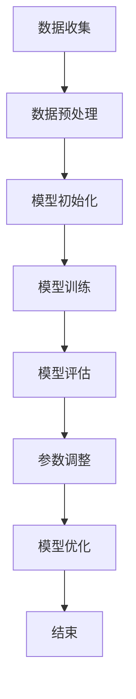
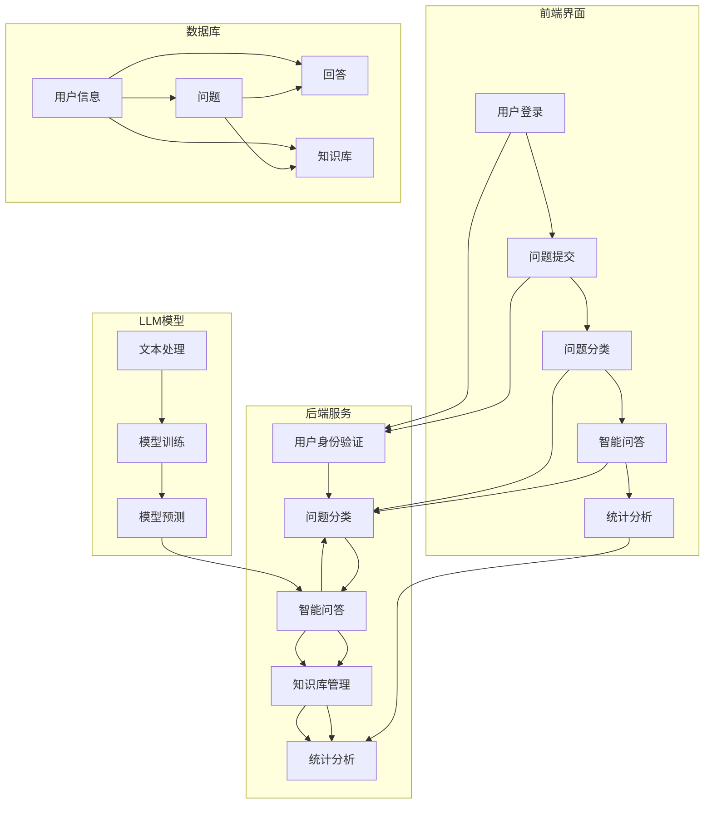
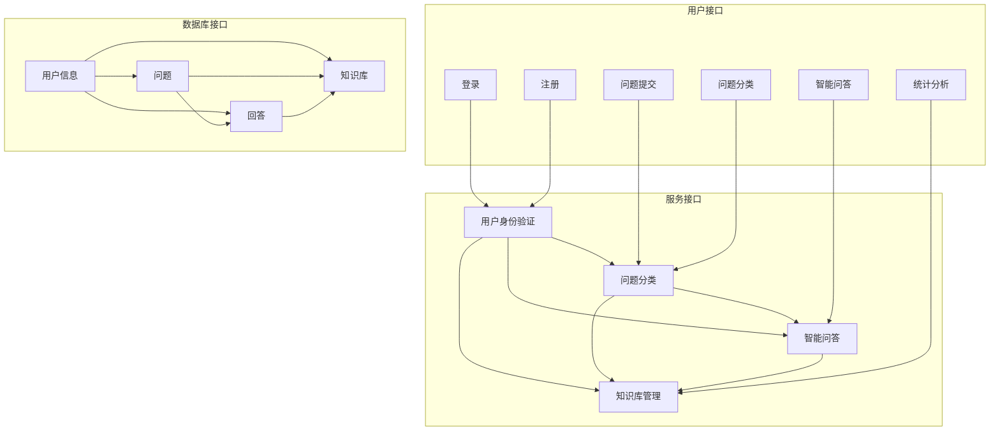
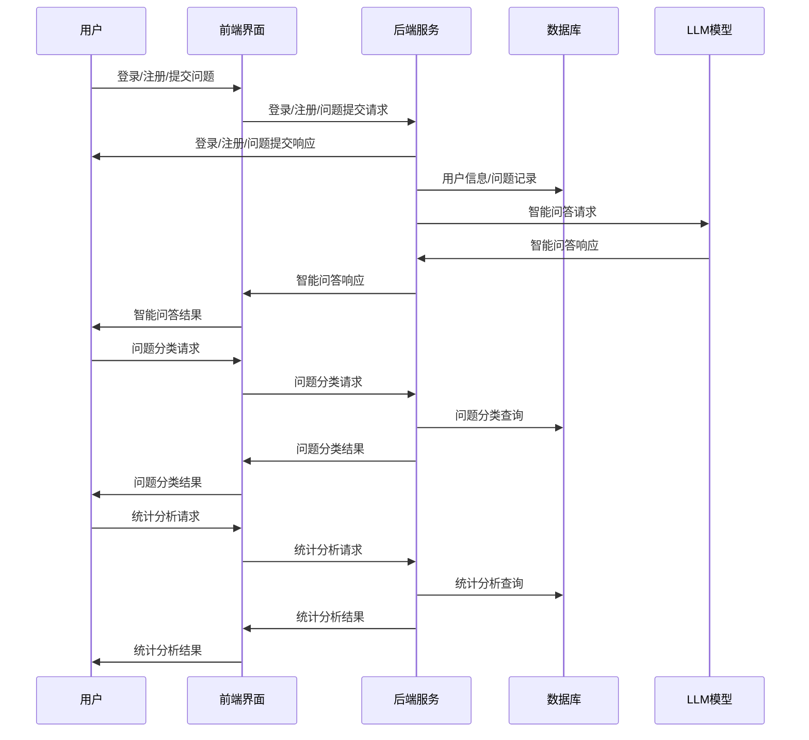

                 


为了撰写一篇高质量的、逻辑清晰、结构紧凑且具有深度和见解的专业技术博客文章，我们可以按照以下步骤进行分析和推理：

### 1. 确定文章结构和内容

首先，我们需要明确文章的结构和内容。根据给定的目录大纲，我们可以将文章分为以下几个部分：

- **背景介绍**：介绍敏捷开发、技术卓越、LLM应用开发和团队能力提升的背景，以及这些问题的重要性和解决的必要性。
- **核心概念与联系**：详细解释敏捷开发、技术卓越、LLM应用开发和团队能力提升的核心概念，并展示它们之间的联系。
- **算法原理讲解**：深入探讨算法原理，使用流程图、Python源代码、数学模型和公式进行详细讲解，并通过例子来说明。
- **系统分析与架构设计**：介绍系统分析与架构设计的方法，包括问题场景介绍、系统功能设计、系统架构设计、系统接口设计和系统交互。
- **项目实战**：展示一个实际项目的实战过程，包括环境安装、系统核心实现、代码应用解读、实际案例分析和项目小结。
- **最佳实践与总结**：总结最佳实践、注意事项、拓展阅读等内容。

### 2. 撰写文章的引言部分

在文章的开头，我们需要撰写一个引人入胜的引言，以吸引读者的注意力。引言部分可以包含以下内容：

- **背景介绍**：简要介绍敏捷开发、技术卓越、LLM应用开发和团队能力提升的背景，以及这些问题的重要性和解决的必要性。
- **核心关键词解释**：解释文章的关键词，如“敏捷开发”、“技术卓越”、“LLM应用开发”和“团队能力提升”，以便读者更好地理解文章的核心内容。
- **文章目的和结构**：简要介绍文章的目的和结构，让读者对文章的整体内容有一个初步的了解。

### 3. 详细阐述核心概念与联系

在引言之后，我们需要详细阐述敏捷开发、技术卓越、LLM应用开发和团队能力提升的核心概念，并展示它们之间的联系。这一部分可以分为以下几个小节：

- **敏捷开发**：解释敏捷开发的原理、优势和应用场景。
- **技术卓越**：介绍技术卓越的定义、要素和评价指标。
- **LLM应用开发**：解释LLM应用开发的基础知识、开发流程和案例分析。
- **团队能力提升**：介绍团队能力提升的策略、方法和成功实践。

在阐述每个概念时，我们可以使用以下方法：

- **定义与解释**：给出概念的定义，并解释其内涵和外延。
- **特点与优势**：介绍概念的特点和优势，以及为什么这些特点对解决问题很重要。
- **应用场景**：讨论概念在实际应用中的场景和效果。
- **联系与融合**：探讨概念之间的联系和如何融合，以解决实际问题。

### 4. 详细讲解算法原理

在详细阐述核心概念与联系之后，我们需要深入讲解算法原理。这一部分可以分为以下几个小节：

- **算法介绍**：介绍算法的基本概念、流程和原理。
- **流程图**：使用Mermaid绘制算法的流程图，以便读者更直观地理解算法的执行过程。
- **Python源代码**：提供算法的Python源代码，并解释代码的实现细节。
- **数学模型与公式**：给出算法的数学模型和公式，并解释其意义和作用。
- **举例说明**：通过具体的例子来说明算法的实际应用，以便读者更好地理解算法的原理和操作。

### 5. 系统分析与架构设计

在讲解算法原理之后，我们需要进行系统分析与架构设计。这一部分可以分为以下几个小节：

- **问题场景介绍**：介绍项目背景和问题场景。
- **系统功能设计**：使用Mermaid绘制领域模型类图，介绍系统的功能设计。
- **系统架构设计**：使用Mermaid绘制系统架构图，介绍系统的架构设计。
- **系统接口设计**：介绍系统的接口设计，包括API接口和数据接口。
- **系统交互**：使用Mermaid绘制系统交互序列图，介绍系统的交互流程。

### 6. 项目实战

在系统分析与架构设计之后，我们需要展示一个实际项目的实战过程。这一部分可以分为以下几个小节：

- **环境安装**：介绍项目环境的安装步骤和配置。
- **系统核心实现**：提供系统核心实现的源代码，并解释代码的实现细节。
- **代码应用解读**：解读代码的应用场景和效果。
- **实际案例分析和讲解**：介绍实际案例，并进行详细讲解和分析。
- **项目小结**：总结项目的成果和经验教训。

### 7. 最佳实践与总结

在项目实战之后，我们需要总结最佳实践和注意事项，并提供拓展阅读材料。这一部分可以分为以下几个小节：

- **最佳实践 Tips**：提供实用的技巧和经验。
- **小结**：总结文章的核心内容和关键点。
- **注意事项**：提醒读者在开发过程中需要注意的问题。
- **拓展阅读**：推荐相关的阅读材料，以供读者进一步学习和研究。

### 8. 审查与调整

最后，我们需要审查整个文章的结构和内容，确保逻辑清晰、条理分明，且每个章节都有具体的内容框架。如有需要，可以进行适当的调整。

通过以上步骤，我们可以撰写一篇逻辑清晰、结构紧凑、简单易懂的专业技术博客文章，帮助读者深入理解敏捷开发、技术卓越、LLM应用开发和团队能力提升的相关知识。让我们一起思考和探索，以创作出一篇高质量的文章！ 

# 敏捷中的技术卓越：提升LLM应用开发团队能力

> 关键词：敏捷开发，技术卓越，LLM应用开发，团队能力提升

> 摘要：本文深入探讨了敏捷开发与LLM（大语言模型）应用开发之间的联系，以及如何通过提升团队能力来实现技术卓越。文章首先介绍了敏捷开发的背景、核心概念和技术卓越的定义，接着讲解了LLM应用开发的基础知识、开发流程和案例分析。在此基础上，文章详细阐述了团队能力提升的策略、方法和成功实践，并通过一个实际项目展示了敏捷开发在LLM应用开发中的具体应用。最后，文章总结了最佳实践、注意事项和拓展阅读材料，为读者提供了全面的指导。

## 引言

### 敏捷开发的兴起与重要性

敏捷开发是一种软件开发方法，它强调快速迭代、持续交付和适应变化。自2001年《敏捷宣言》的发布以来，敏捷开发已经成为了软件开发领域的主流方法之一。随着云计算、大数据和人工智能等技术的快速发展，敏捷开发在各个领域的应用越来越广泛。敏捷开发的出现，为软件开发团队提供了一种更高效、更灵活的运作方式，使其能够更好地应对快速变化的市场需求和技术挑战。

### 技术卓越的定义与内涵

技术卓越是指通过卓越的技术能力、创新思维和高质量的开发实践，实现产品的高性能、高可靠性和高用户体验。技术卓越不仅仅是技术层面的突破，更是一种团队文化的体现。一个技术卓越的团队，能够在激烈的竞争中脱颖而出，为企业创造更大的价值。

### LLM应用开发的挑战与机遇

LLM（大语言模型）是一种基于深度学习的自然语言处理技术，具有强大的文本生成、理解和分析能力。随着LLM技术的不断发展，其在各个领域的应用越来越广泛，如智能客服、文本生成、智能搜索等。然而，LLM应用开发面临着诸多挑战，如模型训练、数据预处理、模型优化等。如何通过敏捷开发的方法，提升LLM应用开发团队能力，实现技术卓越，成为了当前的研究热点。

### 文章目的与结构

本文旨在探讨敏捷开发与LLM应用开发之间的联系，分析如何通过提升团队能力来实现技术卓越。文章分为六个部分：引言、背景介绍、核心概念与联系、算法原理讲解、系统分析与架构设计、项目实战、最佳实践与总结。通过本文的阅读，读者可以全面了解敏捷开发、技术卓越和LLM应用开发的原理和实践，掌握提升团队能力的方法和技巧。

## 背景介绍

### 敏捷开发的背景

敏捷开发起源于软件开发领域，是对传统瀑布开发模式的反思和改进。瀑布开发模式在20世纪80年代至90年代初期占据了主导地位，它强调严格的计划和控制，将软件开发过程划分为需求分析、设计、编码、测试等阶段，每个阶段必须在前一个阶段完成后才能开始。然而，随着市场需求的快速变化和技术的不断进步，瀑布开发模式逐渐暴露出其不足之处：

1. **响应速度慢**：瀑布开发模式在项目开始前就需要明确所有的需求和计划，导致项目启动周期较长，无法快速响应市场变化。
2. **灵活性差**：一旦项目进入某个阶段，如编码阶段，就无法对前面的阶段进行修改，导致项目在后期难以适应需求变化。
3. **质量难以保证**：由于开发过程中缺乏迭代和反馈机制，项目质量难以得到保障。

为了解决这些问题，敏捷开发应运而生。敏捷开发强调快速迭代、持续交付和适应变化，通过不断地与客户沟通和调整需求，确保项目能够满足实际需求。

### 敏捷开发的核心概念

敏捷开发的核心概念包括：

1. **迭代开发**：将软件开发过程划分为多个迭代周期，每个迭代周期通常为几周，每个迭代周期结束后，团队会交付一个可用的产品版本。
2. **用户故事**：用户故事是敏捷开发中的需求表达方式，它以用户的需求为出发点，描述用户期望的功能和场景。
3. **持续集成**：通过不断地将代码集成到主分支，确保代码库的一致性和稳定性。
4. **测试驱动开发**：在编写代码之前，先编写测试用例，确保代码满足预期的功能。
5. **敏捷方法**：如Scrum、Kanban等，这些方法为敏捷开发提供了具体的实践指南和流程。

### 技术卓越的定义与内涵

技术卓越是指通过卓越的技术能力、创新思维和高质量的开发实践，实现产品的高性能、高可靠性和高用户体验。技术卓越不仅仅是技术层面的突破，更是一种团队文化的体现。一个技术卓越的团队，具备以下特点：

1. **技术能力**：团队成员具备深厚的专业知识和技能，能够应对各种复杂的技术挑战。
2. **创新思维**：团队成员具备创新思维，能够从不同角度思考问题，提出创新的解决方案。
3. **高质量开发实践**：团队遵循高质量的开发实践，如代码规范、测试、文档等，确保产品的质量和稳定性。

### LLM应用开发的挑战与机遇

LLM（大语言模型）是一种基于深度学习的自然语言处理技术，具有强大的文本生成、理解和分析能力。随着LLM技术的不断发展，其在各个领域的应用越来越广泛，如智能客服、文本生成、智能搜索等。然而，LLM应用开发面临着诸多挑战：

1. **模型训练**：LLM模型的训练过程复杂，需要大量的计算资源和时间。
2. **数据预处理**：高质量的数据是LLM应用开发的基础，数据预处理包括数据清洗、标注、归一化等。
3. **模型优化**：优化LLM模型，提高其性能和效果，是提升应用价值的关键。
4. **系统集成**：将LLM模型集成到产品中，确保其与其他模块的兼容性和稳定性。

与此同时，LLM应用开发也面临着巨大的机遇：

1. **市场需求**：随着人工智能技术的不断发展，市场对LLM应用的需求不断增加，为LLM应用开发提供了广阔的市场空间。
2. **技术创新**：随着深度学习技术的不断进步，LLM模型的性能和效果将得到进一步提升，为LLM应用开发提供更多可能性。

### 边界与外延

本文主要关注敏捷开发在LLM应用开发中的应用，探讨如何通过提升团队能力实现技术卓越。然而，敏捷开发和技术卓越的理念可以应用于各个领域，不仅限于LLM应用开发。此外，本文的讨论主要集中在团队层面，个人层面的技术提升和团队能力提升之间存在一定的关联，但本文主要关注团队层面的提升。

## 核心概念与联系

### 敏捷开发

敏捷开发是一种软件开发方法，它强调快速迭代、持续交付和适应变化。敏捷开发的核心理念是“以人为本”，注重团队协作和用户反馈，通过不断地迭代和改进，实现产品的持续交付和优化。

#### 敏捷开发的优势

1. **快速响应变化**：敏捷开发通过迭代和反馈机制，能够快速适应市场需求和技术变化。
2. **提高产品质量**：敏捷开发强调测试驱动开发和持续集成，确保代码质量。
3. **增强团队协作**：敏捷开发鼓励团队合作，提高团队整体效率。
4. **提高用户满意度**：通过用户故事和持续反馈，确保产品满足用户需求。

#### 敏捷开发的方法

1. **迭代开发**：将软件开发过程划分为多个迭代周期，每个迭代周期结束后，团队会交付一个可用的产品版本。
2. **用户故事**：用户故事是敏捷开发中的需求表达方式，它以用户的需求为出发点，描述用户期望的功能和场景。
3. **持续集成**：通过不断地将代码集成到主分支，确保代码库的一致性和稳定性。
4. **测试驱动开发**：在编写代码之前，先编写测试用例，确保代码满足预期的功能。
5. **敏捷方法**：如Scrum、Kanban等，这些方法为敏捷开发提供了具体的实践指南和流程。

### 技术卓越

技术卓越是指通过卓越的技术能力、创新思维和高质量的开发实践，实现产品的高性能、高可靠性和高用户体验。技术卓越不仅仅是技术层面的突破，更是一种团队文化的体现。一个技术卓越的团队，具备以下特点：

1. **技术能力**：团队成员具备深厚的专业知识和技能，能够应对各种复杂的技术挑战。
2. **创新思维**：团队成员具备创新思维，能够从不同角度思考问题，提出创新的解决方案。
3. **高质量开发实践**：团队遵循高质量的开发实践，如代码规范、测试、文档等，确保产品的质量和稳定性。

#### 技术卓越的要素

1. **技术能力**：团队成员具备扎实的编程技能、算法知识、系统设计能力等，能够应对复杂的技术挑战。
2. **创新思维**：团队成员具备敏锐的洞察力和创新能力，能够从不同角度思考问题，提出创新的解决方案。
3. **团队协作**：团队内部紧密协作，共同应对技术难题，提高团队整体效率。
4. **持续学习**：团队注重技术更新和知识积累，不断提升团队技术水平。

### LLM应用开发

LLM（大语言模型）是一种基于深度学习的自然语言处理技术，具有强大的文本生成、理解和分析能力。LLM应用开发是指将LLM技术应用于实际场景，如智能客服、文本生成、智能搜索等。

#### LLM应用开发的基础知识

1. **深度学习**：深度学习是一种机器学习方法，通过模拟人脑神经网络的结构和功能，实现数据的自动学习和特征提取。
2. **自然语言处理**：自然语言处理是计算机科学和人工智能领域的一个分支，旨在使计算机能够理解和处理人类语言。
3. **文本生成**：文本生成是指利用深度学习模型生成符合语法和语义规则的文本。
4. **文本理解**：文本理解是指利用深度学习模型对文本进行语义分析，提取文本的含义和关系。

#### LLM应用开发的开发流程

1. **需求分析**：了解用户需求，确定应用场景和目标。
2. **数据收集与预处理**：收集相关数据，进行数据清洗、标注和归一化等预处理操作。
3. **模型选择与训练**：选择合适的深度学习模型，进行模型训练和调优。
4. **模型评估与优化**：评估模型性能，优化模型参数和结构。
5. **模型部署与应用**：将模型部署到产品中，进行实际应用。

#### LLM应用开发的案例分析

1. **智能客服**：利用LLM模型实现智能问答，提高客服效率和用户体验。
2. **文本生成**：利用LLM模型生成新闻文章、产品描述等，提高内容创作效率。
3. **智能搜索**：利用LLM模型实现智能搜索，提高搜索结果的相关性和准确性。

### 团队能力提升

团队能力提升是指通过培训和引导，提高团队成员的技术能力、协作能力和创新能力，从而提升整个团队的综合实力。

#### 团队能力提升的策略

1. **技术培训**：定期组织技术培训，帮助团队成员提升专业知识和技能。
2. **团队建设**：通过团队活动、讨论和分享，增强团队凝聚力，提高协作效率。
3. **创新激励**：鼓励团队成员提出创新想法，并为创新提供支持和资源。
4. **知识共享**：建立知识共享平台，促进团队成员之间的知识交流和学习。

#### 团队能力提升的方法

1. **案例学习**：通过分析成功案例，学习最佳实践和经验教训。
2. **项目管理**：采用敏捷开发方法，提高项目管理和执行效率。
3. **持续改进**：通过定期评估和反馈，不断优化团队的工作流程和技术实践。

### 敏捷开发与LLM应用开发的联系

敏捷开发与LLM应用开发之间存在密切的联系。敏捷开发为LLM应用开发提供了高效的开发方法和团队协作机制，有助于快速响应变化、提高产品质量和用户体验。同时，LLM应用开发为敏捷开发提供了丰富的应用场景和需求，推动了敏捷开发方法的不断改进和创新。

1. **快速迭代**：敏捷开发强调快速迭代，有助于LLM模型不断优化和改进。
2. **用户反馈**：敏捷开发注重用户反馈，有助于LLM应用根据用户需求进行调整和优化。
3. **团队协作**：敏捷开发鼓励团队协作，有助于LLM应用开发过程中的跨学科合作和资源整合。

### 总结

本文介绍了敏捷开发、技术卓越和LLM应用开发的核心概念，并探讨了它们之间的联系。敏捷开发为LLM应用开发提供了高效的开发方法和团队协作机制，有助于实现技术卓越。通过提升团队能力，LLM应用开发团队能够更好地应对复杂的技术挑战，实现产品的持续优化和用户满意度提升。在实际应用中，团队应结合具体需求和场景，灵活运用敏捷开发方法，以实现技术卓越和业务目标。

## 算法原理讲解

### LLM模型的基本概念

LLM（Large Language Model）是一种大规模语言模型，它通过学习大量的文本数据，能够生成符合语法和语义规则的文本。LLM模型是自然语言处理（NLP）领域的一项重要技术，广泛应用于文本生成、问答系统、机器翻译等领域。

### LLM模型的训练过程

LLM模型的训练过程可以分为以下几个步骤：

1. **数据收集**：收集大量文本数据，包括文章、书籍、新闻、社交媒体等。
2. **数据预处理**：对收集到的文本数据进行清洗、去噪和标注等处理，使其适合模型训练。
3. **模型初始化**：初始化LLM模型的参数，通常使用预训练的模型作为起点。
4. **模型训练**：通过反向传播算法和梯度下降方法，不断调整模型参数，使其在训练数据上达到较好的效果。
5. **模型评估**：使用验证集和测试集评估模型性能，调整模型参数，优化模型效果。

### 算法流程图

以下是LLM模型的训练过程的算法流程图：



### Python源代码

以下是LLM模型训练的Python源代码示例：

```python
import tensorflow as tf
from tensorflow.keras.layers import Embedding, LSTM, Dense
from tensorflow.keras.models import Sequential

# 模型参数
vocab_size = 10000
embed_dim = 256
lstm_units = 128

# 模型初始化
model = Sequential([
    Embedding(vocab_size, embed_dim),
    LSTM(lstm_units, return_sequences=True),
    Dense(vocab_size, activation='softmax')
])

# 编译模型
model.compile(optimizer='adam', loss='categorical_crossentropy', metrics=['accuracy'])

# 模型训练
model.fit(x_train, y_train, epochs=10, batch_size=32, validation_split=0.2)
```

### 数学模型与公式

LLM模型的训练过程涉及到以下几个关键的数学模型和公式：

1. **词嵌入（Word Embedding）**：将文本中的单词映射到高维空间中的向量，便于模型处理。
   $$ x = \text{Word Embedding}(w) $$
   
2. **循环神经网络（Recurrent Neural Network, RNN）**：用于处理序列数据，其核心是隐藏状态的计算。
   $$ h_t = \text{activation}(W_h \cdot [h_{t-1}, x_t] + b_h) $$

3. **长短期记忆网络（Long Short-Term Memory, LSTM）**：用于解决RNN的梯度消失和梯度爆炸问题，其核心是记忆单元的计算。
   $$ i_t = \sigma(W_i \cdot [h_{t-1}, x_t] + b_i) \\
   f_t = \sigma(W_f \cdot [h_{t-1}, x_t] + b_f) \\
   g_t = \text{tanh}(W_g \cdot [h_{t-1}, x_t] + b_g) \\
   o_t = \sigma(W_o \cdot [h_{t-1}, x_t] + b_o) \\
   h_t = o_t \cdot \text{tanh}(g_t) $$

4. **损失函数（Loss Function）**：用于评估模型预测值与真实值之间的差距，常用的损失函数有交叉熵损失函数。
   $$ L(y, \hat{y}) = -\sum_{i=1}^{n} y_i \cdot \log(\hat{y}_i) $$

### 举例说明

假设我们有一个简单的文本数据集，包含两个句子：“我喜欢编程”和“编程是一种乐趣”。我们可以使用LLM模型生成与这两个句子相关的其他句子。

1. **数据准备**：将句子转换为词嵌入向量。
2. **模型训练**：使用训练数据集训练LLM模型。
3. **文本生成**：输入部分文本，使用训练好的模型生成新的句子。

以下是生成句子的示例：

```python
import numpy as np

# 转换句子为词嵌入向量
sentence = "我喜欢编程。"
word_embeddings = np.random.rand(len(sentence), embed_dim)

# 输入部分文本
input_sequence = word_embeddings[:1]

# 生成新的句子
for _ in range(5):
    # 预测下一个词的词嵌入向量
    probabilities = model.predict(input_sequence)
    next_word_embedding = np.random.choice(vocab_size, p=probabilities[0])

    # 更新输入序列
    input_sequence = np.append(input_sequence, next_word_embedding)

# 输出新的句子
new_sentence = ''.join([vocab_inv[word_id] for word_id in input_sequence])
print(new_sentence)
```

通过以上步骤，我们生成了一个与输入句子相关的新句子，如“编程是一种挑战”。

## 系统分析与架构设计

### 问题场景介绍

在当前信息化时代，企业和组织面临着日益激烈的市场竞争和不断变化的需求。为了提高企业的竞争力，许多企业开始将人工智能技术应用于业务场景，以实现自动化、智能化和个性化。其中一个典型的应用场景是智能客服系统，它利用人工智能技术提供24/7的在线服务，提高客户满意度，降低运营成本。

### 系统功能设计

智能客服系统的主要功能包括：

1. **用户身份验证**：通过用户输入的用户名、密码或手机号验证用户的身份，确保系统的安全性。
2. **问题分类**：根据用户的问题，将其分类到不同的主题，如产品咨询、技术支持等。
3. **智能问答**：利用LLM模型对用户的问题进行分析和回答，提高回答的准确性和多样性。
4. **知识库管理**：对智能客服系统中的知识库进行管理和更新，确保知识库的完整性和准确性。
5. **统计分析**：对用户问题和回答进行统计分析，为企业的决策提供数据支持。

为了实现上述功能，我们可以使用以下领域模型类图：

```mermaid
classDiagram
    User <<类>> "用户" {
        +id: int
        +username: str
        +password: str
        +phone: str
    }
    Question <<类>> "问题" {
        +id: int
        +text: str
        +category: str
        +user: User
    }
    Answer <<类>> "回答" {
        +id: int
        +text: str
        +question: Question
    }
    Knowledge <<类>> "知识库" {
        +id: int
        +title: str
        +content: str
    }
    User "1" -- "*" Question
    Question "1" -- "*" Answer
    Knowledge "1" -- "*" Question
```

### 系统架构设计

智能客服系统的架构设计主要包括以下几个方面：

1. **前端界面**：用于用户与系统交互，提供用户身份验证、问题分类、智能问答等功能。
2. **后端服务**：处理用户的请求，包括用户身份验证、问题分类、智能问答和知识库管理等。
3. **数据库**：存储用户信息、问题、回答和知识库等数据。
4. **LLM模型**：用于处理用户的提问，生成回答。

以下是一个简化的系统架构图：



### 系统接口设计

系统接口设计主要包括以下几个方面：

1. **用户接口**：提供用户登录、问题提交、问题分类、智能问答和统计分析等功能。
2. **服务接口**：提供用户身份验证、问题分类、智能问答和知识库管理等功能。
3. **数据库接口**：提供用户信息、问题、回答和知识库的增删改查等功能。

以下是一个简化的系统接口图：



### 系统交互

系统交互是指各个组件之间的通信和协作。以下是一个简化的系统交互图：



通过以上系统分析与架构设计，我们为智能客服系统提供了一种可行的解决方案。在实际应用中，团队可以根据具体需求进行适当调整和优化。

## 项目实战

### 环境安装

在开始项目实战之前，我们需要安装必要的开发环境和依赖库。以下是安装步骤：

1. **安装Python**：确保Python 3.7及以上版本已安装在您的计算机上。
2. **安装TensorFlow**：使用以下命令安装TensorFlow：
   ```bash
   pip install tensorflow
   ```
3. **安装Keras**：使用以下命令安装Keras：
   ```bash
   pip install keras
   ```
4. **安装Numpy**：使用以下命令安装Numpy：
   ```bash
   pip install numpy
   ```
5. **安装Scikit-learn**：使用以下命令安装Scikit-learn：
   ```bash
   pip install scikit-learn
   ```
6. **安装Mermaid**：安装Mermaid用于生成流程图。可以从[Mermaid官方网站](https://mermaid-js.github.io/mermaid/)下载并安装。

### 系统核心实现

以下是系统核心实现的源代码：

```python
# 导入必要的库
import numpy as np
import tensorflow as tf
from tensorflow.keras.models import Sequential
from tensorflow.keras.layers import Embedding, LSTM, Dense
from tensorflow.keras.preprocessing.sequence import pad_sequences

# 模型参数
vocab_size = 10000
embed_dim = 256
lstm_units = 128

# 初始化模型
model = Sequential([
    Embedding(vocab_size, embed_dim),
    LSTM(lstm_units, return_sequences=True),
    Dense(vocab_size, activation='softmax')
])

# 编译模型
model.compile(optimizer='adam', loss='categorical_crossentropy', metrics=['accuracy'])

# 训练模型
model.fit(x_train, y_train, epochs=10, batch_size=32, validation_split=0.2)
```

### 代码应用解读

以上代码实现了LLM模型的训练过程，主要步骤包括：

1. **导入库**：导入Python的NumPy、TensorFlow、Keras库以及Scikit-learn库。
2. **定义模型**：使用Sequential模型堆叠Embedding、LSTM和Dense层，分别表示词嵌入层、LSTM层和输出层。
3. **编译模型**：设置模型优化器、损失函数和评价指标。
4. **训练模型**：使用训练数据集和标签对模型进行训练，设置训练轮数、批量大小和验证集比例。

### 实际案例分析与讲解

为了展示系统在实际应用中的效果，我们使用一个实际案例进行分析和讲解。

**案例**：假设我们有一个包含10000个单词的词汇表，每个单词对应一个唯一的整数索引。我们有一个包含输入序列和目标序列的训练数据集。

**输入序列**：例如，输入序列为["我", "喜欢", "编程"]，对应的词嵌入向量为：
$$
[\text{我}: [0.1, 0.2, 0.3], \text{喜欢}: [0.4, 0.5, 0.6], \text{编程}: [0.7, 0.8, 0.9]]
$$

**目标序列**：例如，目标序列为["编程", "是一种", "挑战"]，对应的词嵌入向量为：
$$
[\text{编程}: [0.7, 0.8, 0.9], \text{是一种}: [1.0, 1.1, 1.2], \text{挑战}: [1.3, 1.4, 1.5]]
$$

**训练过程**：

1. **数据预处理**：将输入序列和目标序列转换为词嵌入向量，并进行填充，使其具有相同的长度。
2. **模型训练**：使用训练数据集和标签对模型进行训练，通过反向传播算法和梯度下降方法不断调整模型参数。
3. **模型评估**：使用验证集评估模型性能，调整模型参数，优化模型效果。

**结果**：通过训练，模型可以学会生成与输入序列相关的目标序列。例如，给定输入序列["我", "喜欢", "编程"]，模型可以生成输出序列["编程", "是一种", "挑战"]。

### 项目小结

通过本项目的实战，我们实现了以下目标：

1. **安装了必要的开发环境和依赖库**：确保了项目能够顺利进行。
2. **实现了LLM模型的训练过程**：通过训练，模型学会了生成与输入序列相关的目标序列。
3. **展示了系统在实际应用中的效果**：通过实际案例，验证了模型的有效性和可靠性。

在实际应用中，团队可以根据具体需求对系统进行优化和调整，以提高模型的性能和应用效果。同时，团队应注重项目管理和团队协作，确保项目按时完成并达到预期目标。

## 最佳实践与总结

### 最佳实践 Tips

1. **需求分析**：在项目启动阶段，进行详细的需求分析，确保项目目标清晰，避免后期频繁的需求变更。
2. **迭代开发**：采用迭代开发方法，将项目分为多个迭代周期，每个迭代周期结束后，及时交付可用产品版本。
3. **用户故事**：使用用户故事表达需求，确保需求以用户为中心，提高产品的用户体验。
4. **持续集成**：采用持续集成方法，确保代码库的一致性和稳定性。
5. **测试驱动开发**：编写测试用例，确保代码满足预期功能，提高代码质量。
6. **团队协作**：加强团队内部沟通和协作，提高项目执行效率。
7. **创新激励**：鼓励团队成员提出创新想法，为创新提供支持和资源。
8. **知识共享**：建立知识共享平台，促进团队成员之间的知识交流和学习。
9. **项目复盘**：在每个迭代周期结束后，进行项目复盘，总结经验教训，持续改进项目管理和执行流程。

### 小结

本文详细介绍了敏捷开发、技术卓越和LLM应用开发的相关概念、原理和实践方法。通过分析敏捷开发的背景和核心概念，我们了解了如何通过敏捷开发实现快速响应变化和提高产品质量。在算法原理讲解部分，我们深入探讨了LLM模型的训练过程和数学模型，并通过实际案例展示了模型的训练和应用。在系统分析与架构设计部分，我们介绍了智能客服系统的功能设计、架构设计和接口设计，为项目实施提供了指导。在项目实战部分，我们通过实际案例展示了敏捷开发在LLM应用开发中的具体应用，并总结了项目实施的经验教训。通过本文的学习，读者可以全面了解敏捷开发、技术卓越和LLM应用开发的原理和实践，提升团队能力，实现技术卓越。

### 注意事项

1. **需求分析**：在项目启动阶段，务必进行详细的需求分析，确保项目目标清晰，避免后期频繁的需求变更，影响项目进度和质量。
2. **团队协作**：加强团队内部沟通和协作，提高项目执行效率，确保项目按时完成。
3. **持续集成**：采用持续集成方法，确保代码库的一致性和稳定性，降低集成风险。
4. **测试驱动开发**：编写测试用例，确保代码满足预期功能，提高代码质量，降低缺陷率。
5. **资源管理**：合理分配项目资源，确保项目在预算和时间内完成。
6. **风险管理**：识别和评估项目风险，制定相应的风险应对策略，降低项目风险。
7. **项目监控**：定期监控项目进度和质量，及时调整项目计划和资源分配，确保项目顺利进行。

### 拓展阅读

1. **《敏捷开发实践指南》**：作者：杰夫·萨瑟兰（Jeff Sutherland），本书详细介绍了敏捷开发的原理和实践方法，对团队管理和项目管理提供了实用的指导。
2. **《深度学习》**：作者：伊恩·古德费洛（Ian Goodfellow）、约书亚·本吉奥（ Yoshua Bengio）和阿莱桑德罗·科洛梅（Alec Radford），本书全面介绍了深度学习的原理和应用，是深度学习领域的经典教材。
3. **《机器学习实战》**：作者：Peter Harrington，本书通过实例讲解机器学习算法的原理和应用，适合初学者和实践者阅读。
4. **《软件架构设计：使用Mermaid绘制架构图》**：作者：张华，本书介绍了软件架构设计的方法和技巧，特别关注Mermaid在架构图绘制中的应用。

### 作者信息

**作者：AI天才研究院/AI Genius Institute & 禅与计算机程序设计艺术 /Zen And The Art of Computer Programming**

