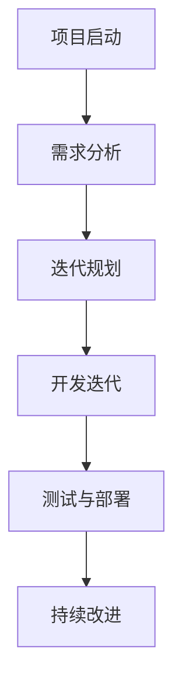
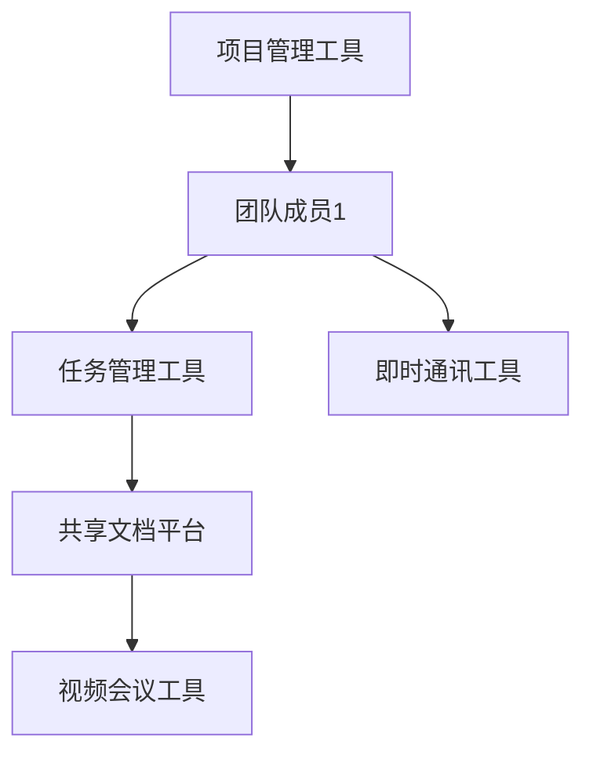
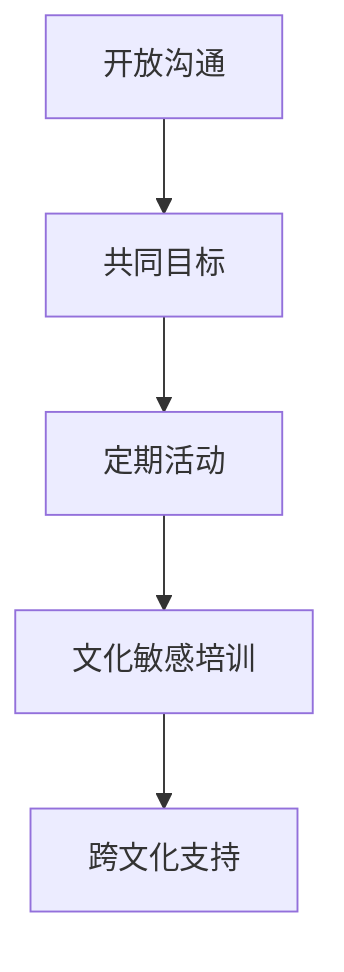

                 

# 敏捷中的远程团队建设：培养LLM开发团队凝聚力

> 关键词：敏捷开发、远程团队、LLM开发、团队凝聚力、协作与沟通

> 摘要：本文将探讨敏捷开发框架在远程团队中的应用，重点分析如何通过有效的团队建设和策略提升LLM（大型语言模型）开发团队的凝聚力。本文将首先介绍敏捷开发的基本原则和远程团队面临的挑战，然后深入探讨提升远程团队凝聚力的关键策略，包括沟通工具的使用、任务管理的优化、团队文化的塑造等方面。最后，通过实际案例和最佳实践，总结出适用于LLM开发团队的建设方法。

## 1. 引言

在信息技术迅猛发展的时代，远程工作模式已经成为许多企业运作的常态。特别是在人工智能领域，诸如LLM（大型语言模型）这样的复杂项目，通常需要跨地域、跨时区的团队协作。然而，远程团队在敏捷开发过程中面临着诸多挑战，如沟通障碍、任务协调困难、团队凝聚力下降等。如何有效地应对这些挑战，提升远程团队的凝聚力，成为实现项目成功的关键。

本文将围绕以下问题展开讨论：

- 敏捷开发的基本原则是什么？
- 远程团队面临哪些特定挑战？
- 如何在远程团队中应用敏捷原则来提升团队凝聚力？
- 成功的案例和最佳实践有哪些？

通过以上问题的逐步解答，本文旨在为LLM开发团队提供有效的远程团队建设策略。

## 2. 敏捷开发的基本原则

敏捷开发是一种以人为核心、迭代和增量的软件开发方法。它提倡快速响应变化、持续交付价值，并通过跨职能团队的合作来提高项目的透明度和灵活性。敏捷开发的核心原则包括：

1. **个体和互动重于过程与工具**：注重团队成员的协作和沟通，而非依赖特定的工具或流程。
2. **可工作的软件重于详尽的文档**：优先关注软件的实际运行效果，而非繁琐的文档编写。
3. **客户合作重于合同谈判**：与客户保持紧密的合作关系，共同确定项目目标和优先级。
4. **响应变化重于遵循计划**：灵活应对变化，而非 rigid 地遵循计划。

在远程团队中，敏捷原则的应用需要特别关注以下几个方面：

- **提高沟通效率**：远程团队往往依赖线上沟通工具，如视频会议、即时通讯等，以提高沟通效率。
- **确保任务透明**：通过任务管理工具，如JIRA或Trello，确保每个团队成员对项目的进展和任务分配有清晰的了解。
- **促进自我管理**：远程团队成员通常拥有更高的自主权，能够更好地管理自己的工作和进度。

## 3. 远程团队面临的挑战

尽管敏捷开发提供了一系列有效的原则和方法，但在远程团队中仍面临诸多挑战：

### 3.1 沟通障碍

远程团队之间的沟通通常受到时间差异、语言障碍和文化差异的影响。例如，跨时区的团队可能需要安排多个会议来协调工作，这不仅增加了沟通成本，也可能导致信息传递的延迟和误解。

### 3.2 任务协调困难

在远程团队中，任务的协调和分配往往更加复杂。团队成员可能位于不同的地理位置和工作环境，这增加了任务跟踪和进度控制的难度。

### 3.3 团队凝聚力下降

缺乏面对面的互动和共同的办公空间可能导致远程团队之间的凝聚力下降。团队成员可能会感到孤立，难以形成紧密的工作关系。

## 4. 提升远程团队凝聚力的策略

### 4.1 沟通工具的使用

为了克服沟通障碍，远程团队需要依赖高效、易用的沟通工具。以下是一些常用的沟通工具：

- **视频会议工具**：如Zoom、Microsoft Teams，用于实时沟通和协作。
- **即时通讯工具**：如Slack、Telegram，用于快速交流和消息传递。
- **共享文档平台**：如Google Docs、Notion，用于协作编辑文档和资料。

### 4.2 任务管理的优化

任务管理是远程团队协作的关键环节。通过以下策略，可以优化任务管理：

- **使用任务管理工具**：如JIRA、Trello，明确任务分配、进度跟踪和优先级管理。
- **定期团队会议**：通过每日站会、周会和月会等，确保团队对任务进度有清晰的了解。
- **透明度**：确保所有团队成员都能访问和了解项目进展，减少信息不对称。

### 4.3 团队文化的塑造

团队文化是提升团队凝聚力的关键。以下是一些塑造团队文化的策略：

- **鼓励开放沟通**：创建一个开放、包容的沟通环境，鼓励团队成员分享想法和反馈。
- **建立共同目标**：确保团队成员对项目的目标有共同的理解和认同。
- **定期团队活动**：组织线上团队活动，如团队建设游戏、知识分享会等，增强团队之间的联系。

## 5. 实际案例

### 5.1 案例一：大型语言模型开发团队

某人工智能公司的一个LLM开发团队分布在五个不同城市，团队成员包括数据科学家、机器学习工程师和前端开发者。为了提升团队凝聚力，他们采取了以下措施：

- **定期视频会议**：每周定期举行视频会议，确保团队成员能够面对面沟通。
- **任务管理工具**：使用Trello进行任务分配和进度跟踪，提高任务协调效率。
- **团队活动**：每月组织线上团队建设活动，如虚拟桌游、知识分享会等，增强团队联系。

通过这些措施，该团队的凝聚力显著提升，项目进展顺利。

### 5.2 案例二：国际远程团队协作

一家跨国公司的远程团队由来自不同国家的成员组成，他们面临语言和文化差异的挑战。为了克服这些困难，团队采取了以下策略：

- **多语言支持**：在沟通工具中添加多语言翻译功能，确保所有成员都能理解信息。
- **文化敏感培训**：为团队成员提供文化敏感培训，增强跨文化沟通能力。
- **共同目标设定**：确保所有成员对项目的目标和优先级有共同的理解和认同。

通过这些措施，该团队成功克服了语言和文化差异，实现了高效的国际远程协作。

## 6. 最佳实践与总结

### 6.1 最佳实践

- **定期沟通**：确保团队成员之间有定期的沟通，包括视频会议、即时通讯和任务更新。
- **透明任务管理**：使用任务管理工具确保任务分配和进度透明。
- **团队文化**：建立开放、包容的团队文化，鼓励开放沟通和团队活动。

### 6.2 总结

通过本文的讨论，我们了解到在敏捷开发中，远程团队建设的关键在于有效的沟通、任务管理的优化和团队文化的塑造。通过实际案例和最佳实践的总结，我们得出以下结论：

- 定期沟通是提升远程团队凝聚力的基础。
- 透明任务管理有助于确保团队协作的高效。
- 塑造积极的团队文化有助于增强团队凝聚力。

## 7. 注意事项与拓展阅读

### 7.1 注意事项

- 避免过度依赖单一沟通工具，根据需求选择合适的工具。
- 定期评估团队文化建设的效果，及时调整策略。
- 关注团队成员的个人需求和成长，提供必要的支持和资源。

### 7.2 拓展阅读

- 《敏捷团队管理：构建高效远程团队》
- 《远程工作指南：高效协作与团队管理》
- 《团队建设与团队动力学》

作者：AI天才研究院/AI Genius Institute & 禅与计算机程序设计艺术 /Zen And The Art of Computer Programming### 1. 引言

在信息技术迅猛发展的时代，远程工作模式已经成为许多企业运作的常态。特别是在人工智能领域，诸如LLM（大型语言模型）这样的复杂项目，通常需要跨地域、跨时区的团队协作。然而，远程团队在敏捷开发过程中面临着诸多挑战，如沟通障碍、任务协调困难、团队凝聚力下降等。如何有效地应对这些挑战，提升远程团队的凝聚力，成为实现项目成功的关键。

本文将围绕以下问题展开讨论：

- 敏捷开发的基本原则是什么？
- 远程团队面临哪些特定挑战？
- 如何在远程团队中应用敏捷原则来提升团队凝聚力？
- 成功的案例和最佳实践有哪些？

通过以上问题的逐步解答，本文旨在为LLM开发团队提供有效的远程团队建设策略。

## 2. 敏捷开发的基本原则

敏捷开发是一种以人为核心、迭代和增量的软件开发方法。它提倡快速响应变化、持续交付价值，并通过跨职能团队的合作来提高项目的透明度和灵活性。敏捷开发的核心原则包括：

1. **个体和互动重于过程与工具**：注重团队成员的协作和沟通，而非依赖特定的工具或流程。
2. **可工作的软件重于详尽的文档**：优先关注软件的实际运行效果，而非繁琐的文档编写。
3. **客户合作重于合同谈判**：与客户保持紧密的合作关系，共同确定项目目标和优先级。
4. **响应变化重于遵循计划**：灵活应对变化，而非 rigid 地遵循计划。

在远程团队中，敏捷原则的应用需要特别关注以下几个方面：

- **提高沟通效率**：远程团队往往依赖线上沟通工具，如视频会议、即时通讯等，以提高沟通效率。
- **确保任务透明**：通过任务管理工具，如JIRA或Trello，确保每个团队成员对项目的进展和任务分配有清晰的了解。
- **促进自我管理**：远程团队成员通常拥有更高的自主权，能够更好地管理自己的工作和进度。

## 3. 远程团队面临的挑战

尽管敏捷开发提供了一系列有效的原则和方法，但在远程团队中仍面临诸多挑战：

### 3.1 沟通障碍

远程团队之间的沟通通常受到时间差异、语言障碍和文化差异的影响。例如，跨时区的团队可能需要安排多个会议来协调工作，这不仅增加了沟通成本，也可能导致信息传递的延迟和误解。

### 3.2 任务协调困难

在远程团队中，任务的协调和分配往往更加复杂。团队成员可能位于不同的地理位置和工作环境，这增加了任务跟踪和进度控制的难度。

### 3.3 团队凝聚力下降

缺乏面对面的互动和共同的办公空间可能导致远程团队之间的凝聚力下降。团队成员可能会感到孤立，难以形成紧密的工作关系。

## 4. 提升远程团队凝聚力的策略

### 4.1 沟通工具的使用

为了克服沟通障碍，远程团队需要依赖高效、易用的沟通工具。以下是一些常用的沟通工具：

- **视频会议工具**：如Zoom、Microsoft Teams，用于实时沟通和协作。
- **即时通讯工具**：如Slack、Telegram，用于快速交流和消息传递。
- **共享文档平台**：如Google Docs、Notion，用于协作编辑文档和资料。

### 4.2 任务管理的优化

任务管理是远程团队协作的关键环节。通过以下策略，可以优化任务管理：

- **使用任务管理工具**：如JIRA、Trello，明确任务分配、进度跟踪和优先级管理。
- **定期团队会议**：通过每日站会、周会和月会等，确保团队对任务进度有清晰的了解。
- **透明度**：确保所有团队成员都能访问和了解项目进展，减少信息不对称。

### 4.3 团队文化的塑造

团队文化是提升团队凝聚力的关键。以下是一些塑造团队文化的策略：

- **鼓励开放沟通**：创建一个开放、包容的沟通环境，鼓励团队成员分享想法和反馈。
- **建立共同目标**：确保团队成员对项目的目标和优先级有共同的理解和认同。
- **定期团队活动**：组织线上团队活动，如团队建设游戏、知识分享会等，增强团队之间的联系。

## 5. 实际案例

### 5.1 案例一：大型语言模型开发团队

某人工智能公司的一个LLM开发团队分布在五个不同城市，团队成员包括数据科学家、机器学习工程师和前端开发者。为了提升团队凝聚力，他们采取了以下措施：

- **定期视频会议**：每周定期举行视频会议，确保团队成员能够面对面沟通。
- **任务管理工具**：使用Trello进行任务分配和进度跟踪，提高任务协调效率。
- **团队活动**：每月组织线上团队建设活动，如虚拟桌游、知识分享会等，增强团队联系。

通过这些措施，该团队的凝聚力显著提升，项目进展顺利。

### 5.2 案例二：国际远程团队协作

一家跨国公司的远程团队由来自不同国家的成员组成，他们面临语言和文化差异的挑战。为了克服这些困难，团队采取了以下策略：

- **多语言支持**：在沟通工具中添加多语言翻译功能，确保所有成员都能理解信息。
- **文化敏感培训**：为团队成员提供文化敏感培训，增强跨文化沟通能力。
- **共同目标设定**：确保所有成员对项目的目标和优先级有共同的理解和认同。

通过这些措施，该团队成功克服了语言和文化差异，实现了高效的国际远程协作。

## 6. 最佳实践与总结

### 6.1 最佳实践

- **定期沟通**：确保团队成员之间有定期的沟通，包括视频会议、即时通讯和任务更新。
- **透明任务管理**：使用任务管理工具确保任务分配和进度透明。
- **团队文化**：建立开放、包容的团队文化，鼓励开放沟通和团队活动。

### 6.2 总结

通过本文的讨论，我们了解到在敏捷开发中，远程团队建设的关键在于有效的沟通、任务管理的优化和团队文化的塑造。通过实际案例和最佳实践的总结，我们得出以下结论：

- 定期沟通是提升远程团队凝聚力的基础。
- 透明任务管理有助于确保团队协作的高效。
- 塑造积极的团队文化有助于增强团队凝聚力。

## 7. 注意事项与拓展阅读

### 7.1 注意事项

- 避免过度依赖单一沟通工具，根据需求选择合适的工具。
- 定期评估团队文化建设的效果，及时调整策略。
- 关注团队成员的个人需求和成长，提供必要的支持和资源。

### 7.2 拓展阅读

- 《敏捷团队管理：构建高效远程团队》
- 《远程工作指南：高效协作与团队管理》
- 《团队建设与团队动力学》

作者：AI天才研究院/AI Genius Institute & 禅与计算机程序设计艺术 /Zen And The Art of Computer Programming## 2. 敏捷开发的基本原则

敏捷开发是一种以人为核心、迭代和增量的软件开发方法。它提倡快速响应变化、持续交付价值，并通过跨职能团队的合作来提高项目的透明度和灵活性。敏捷开发的核心原则包括：

1. **个体和互动重于过程与工具**：注重团队成员的协作和沟通，而非依赖特定的工具或流程。敏捷开发强调人的能力和团队合作的重要性，认为有效的沟通和协作比固定的流程或工具更为关键。

2. **可工作的软件重于详尽的文档**：敏捷开发认为，软件的实际运行效果比繁琐的文档更为重要。开发团队应该优先关注能够产生实际价值的可运行软件，而非耗费大量时间的详细文档编写。

3. **客户合作重于合同谈判**：敏捷开发强调与客户的紧密合作，通过持续的客户反馈来调整项目方向。与客户的互动不仅有助于确保项目符合需求，还能提高项目的成功率和客户满意度。

4. **响应变化重于遵循计划**：敏捷开发承认变化是不可避免的，并且强调团队应该具备适应变化的能力。相比固定不变的计划，敏捷开发更注重灵活性和适应性，以便更好地应对项目中的不确定性。

在远程团队中，敏捷原则的应用需要特别关注以下几个方面：

- **提高沟通效率**：远程团队往往依赖线上沟通工具，如视频会议、即时通讯等，以提高沟通效率。使用这些工具可以减少沟通障碍，确保团队成员之间的信息传递和协作更加顺畅。
- **确保任务透明**：通过任务管理工具，如JIRA或Trello，远程团队可以清晰地追踪任务分配和进度。这种透明度有助于团队成员了解自己的工作责任，以及项目整体进展。
- **促进自我管理**：远程团队成员通常拥有更高的自主权，能够更好地管理自己的工作和进度。自我管理有助于提高团队成员的责任感和工作效率。

### 2.1. 敏捷开发原则在远程团队中的应用

**沟通效率**：远程团队需要高效沟通来确保项目顺利进行。使用视频会议工具（如Zoom、Microsoft Teams）可以实时交流，解决即时问题。即时通讯工具（如Slack、Telegram）则适用于快速交流和消息传递。共享文档平台（如Google Docs、Notion）使得团队成员可以实时协作编辑文档，确保信息的同步更新。

**任务透明**：任务管理工具（如JIRA、Trello）可以帮助团队明确任务分配、进度跟踪和优先级管理。这些工具提供了可视化的任务列表，使每个成员都能清楚地了解自己的工作责任以及项目整体的进展情况。

**自我管理**：远程团队成员通常需要更高的自我管理能力。通过制定个人工作计划、设定目标和优先级，团队成员可以更好地管理自己的时间和进度，提高工作效率。

### 2.2. 远程团队敏捷开发的挑战与对策

**挑战一：沟通障碍**

**对策**：采用多时区的日程安排，确保关键团队成员在不同时区之间能够定期沟通。利用自动化工具（如Zoom Scheduler）来安排会议，减少手动协调的工作量。通过文化敏感培训，提高团队成员的跨文化沟通能力。

**挑战二：任务协调困难**

**对策**：建立明确的任务分配和沟通机制，确保每个成员都了解自己的任务和责任。使用项目管理工具来追踪任务进度，减少协调成本。定期举行团队会议，讨论任务进展和问题，及时调整计划。

**挑战三：团队凝聚力下降**

**对策**：组织线上团队活动，如虚拟团队建设游戏、知识分享会等，增强团队成员之间的联系。建立共同的目标和价值观，确保团队成员对项目的目标和意义有共同的理解。

通过上述对策，远程团队可以在敏捷开发的原则指导下，提高沟通效率、确保任务透明、促进自我管理，从而提升团队的凝聚力和项目成功率。

## 3. 远程团队面临的挑战

尽管敏捷开发提供了一系列有效的原则和方法，但在远程团队中仍面临诸多挑战：

### 3.1 沟通障碍

远程团队之间的沟通通常受到时间差异、语言障碍和文化差异的影响。例如，跨时区的团队可能需要安排多个会议来协调工作，这不仅增加了沟通成本，也可能导致信息传递的延迟和误解。此外，远程沟通工具的技术限制，如网络延迟和视频质量不佳，也可能影响沟通的效果。

### 3.2 任务协调困难

在远程团队中，任务的协调和分配往往更加复杂。团队成员可能位于不同的地理位置和工作环境，这增加了任务跟踪和进度控制的难度。此外，由于团队成员的分散，协调资源的分配和冲突解决也变得更加复杂。

### 3.3 团队凝聚力下降

缺乏面对面的互动和共同的办公空间可能导致远程团队之间的凝聚力下降。团队成员可能会感到孤立，难以形成紧密的工作关系。这种孤立感可能导致团队成员的积极性下降，影响项目的进展和质量。

### 3.4 技术基础设施的限制

远程团队需要依赖可靠的技术基础设施来支持团队协作。然而，一些企业可能缺乏足够的IT支持，导致远程工作环境的稳定性不佳，进而影响团队的工作效率和沟通效果。

### 3.5 个人工作效率的不一致性

由于远程工作的灵活性，团队成员的个人工作效率可能存在较大差异。一些成员可能能够高效地管理自己的时间和任务，而另一些成员可能因为缺乏监督和自我管理能力而出现效率低下的问题。这种差异可能导致团队整体的工作进展不平衡。

### 3.6 安全和隐私问题

远程工作带来了新的安全和隐私问题。团队成员可能需要访问敏感数据或使用个人设备进行工作，这增加了数据泄露和隐私风险。此外，远程团队可能面临网络攻击和恶意软件的威胁，需要采取有效的安全措施来保护团队和企业的信息安全。

### 3.7 法律和合规问题

不同地区的法律法规可能对远程工作有不同的要求和限制。例如，数据保护法、劳动法等，都可能对远程团队的工作产生影响。团队需要确保遵守相关法律法规，以避免法律风险。

### 3.8 时间管理和压力

远程工作可能对团队成员的时间管理造成挑战。没有明确的办公时间和工作场所，团队成员可能面临更难区分工作和生活边界的问题。此外，远程工作可能增加工作压力，特别是在项目截止日期或面临困难时。

### 3.9 跨文化沟通

如果远程团队由来自不同文化的成员组成，跨文化沟通可能会带来额外的挑战。语言障碍、文化差异和价值观的不同可能导致误解和冲突。团队需要培养跨文化沟通能力，以减少这些潜在问题。

### 3.10 缺乏面对面交流

面对面交流是建立紧密团队关系和提升团队凝聚力的重要方式。远程工作可能导致团队成员之间缺乏面对面的互动，难以建立深厚的个人关系和团队信任。

通过识别和应对这些挑战，远程团队可以更好地适应远程工作环境，提高沟通效率、任务协调和团队凝聚力，从而实现项目的成功。

## 4. 提升远程团队凝聚力的策略

### 4.1 沟通工具的使用

为了克服沟通障碍，远程团队需要依赖高效、易用的沟通工具。以下是一些常用的沟通工具：

- **视频会议工具**：如Zoom、Microsoft Teams，用于实时沟通和协作。
  - **优势**：视频会议可以模拟面对面交流，提高沟通的亲和力和效率。
  - **使用场景**：项目启动会议、进度汇报、团队讨论等。

- **即时通讯工具**：如Slack、Telegram，用于快速交流和消息传递。
  - **优势**：即时通讯方便团队成员随时沟通，快速解决问题。
  - **使用场景**：日常交流、任务讨论、紧急问题处理。

- **共享文档平台**：如Google Docs、Notion，用于协作编辑文档和资料。
  - **优势**：实时协作、版本控制和权限管理，确保文档的一致性和安全性。
  - **使用场景**：文档编写、项目管理、知识共享。

### 4.2 任务管理的优化

任务管理是远程团队协作的关键环节。通过以下策略，可以优化任务管理：

- **使用任务管理工具**：如JIRA、Trello，明确任务分配、进度跟踪和优先级管理。
  - **优势**：任务管理工具提供可视化任务列表，便于成员了解任务状态和责任。
  - **使用场景**：任务分配、进度追踪、优先级调整。

- **定期团队会议**：通过每日站会、周会和月会等，确保团队对任务进度有清晰的了解。
  - **优势**：定期会议有助于团队协作、问题反馈和进度同步。
  - **使用场景**：任务更新、问题讨论、决策制定。

- **透明度**：确保所有团队成员都能访问和了解项目进展，减少信息不对称。
  - **优势**：透明度提高团队协作效率，减少误解和沟通障碍。
  - **使用场景**：项目进展报告、里程碑通报、决策讨论。

### 4.3 团队文化的塑造

团队文化是提升团队凝聚力的关键。以下是一些塑造团队文化的策略：

- **鼓励开放沟通**：创建一个开放、包容的沟通环境，鼓励团队成员分享想法和反馈。
  - **优势**：开放沟通促进知识共享和团队创新。
  - **使用场景**：日常交流、项目讨论、团队建设活动。

- **建立共同目标**：确保团队成员对项目的目标和优先级有共同的理解和认同。
  - **优势**：共同目标提高团队一致性和合作精神。
  - **使用场景**：项目启动、任务分配、团队目标设定。

- **定期团队活动**：组织线上团队活动，如团队建设游戏、知识分享会等，增强团队之间的联系。
  - **优势**：团队活动增强团队凝聚力，促进团队成员间的相互了解。
  - **使用场景**：节日庆祝、团队建设、知识交流。

### 4.4 培养团队信任和协作

信任和协作是远程团队成功的关键。以下是一些培养团队信任和协作的策略：

- **建立信任**：通过透明沟通、公平决策和互相支持，建立团队信任。
  - **优势**：信任提高团队效率和合作意愿。
  - **使用场景**：日常交流、问题解决、决策制定。

- **鼓励协作**：通过任务协作、知识共享和团队活动，促进团队成员之间的协作。
  - **优势**：协作增强团队创新和问题解决能力。
  - **使用场景**：项目开发、任务分配、知识交流。

- **培训和发展**：为团队成员提供培训和职业发展机会，提高团队整体能力。
  - **优势**：培训提高团队成员的专业素养和工作积极性。
  - **使用场景**：职业发展计划、技能培训、知识分享会。

通过上述策略，远程团队可以提升沟通效率、优化任务管理、塑造积极团队文化，并培养团队信任和协作，从而增强团队凝聚力，实现项目成功。

## 5. 实际案例

### 5.1 案例一：大型语言模型开发团队

某人工智能公司的一个LLM开发团队分布在五个不同城市，团队成员包括数据科学家、机器学习工程师和前端开发者。为了提升团队凝聚力，他们采取了以下措施：

- **定期视频会议**：每周定期举行视频会议，确保团队成员能够面对面沟通。他们使用Zoom进行会议，每次会议后都会发布会议纪要，确保所有成员了解会议讨论的内容。
- **任务管理工具**：使用Trello进行任务分配和进度跟踪，提高任务协调效率。每个任务都被详细描述，并分配给具体的团队成员，Trello的看板功能使得团队成员可以清晰地看到任务状态。
- **团队活动**：每月组织线上团队建设活动，如虚拟桌游、知识分享会等，增强团队之间的联系。这些活动不仅提高了团队成员之间的互动，还促进了知识的交流。

通过这些措施，该团队的凝聚力显著提升，项目进展顺利，团队成员之间的沟通更加顺畅，工作效率也得到了提高。

### 5.2 案例二：国际远程团队协作

一家跨国公司的远程团队由来自不同国家的成员组成，他们面临语言和文化差异的挑战。为了克服这些困难，团队采取了以下策略：

- **多语言支持**：在沟通工具中添加多语言翻译功能，确保所有成员都能理解信息。他们使用Slack进行日常沟通，Slack内置的翻译功能帮助团队成员跨越语言障碍。
- **文化敏感培训**：为团队成员提供文化敏感培训，增强跨文化沟通能力。公司组织了在线文化敏感性培训课程，帮助团队成员更好地理解不同文化的沟通方式和习惯。
- **共同目标设定**：确保所有成员对项目的目标和优先级有共同的理解和认同。团队在项目启动阶段就明确了共同的目标，并在项目进展过程中不断回顾和调整目标，确保团队成员保持一致。

通过这些措施，该团队成功克服了语言和文化差异，实现了高效的国际远程协作。团队成员之间的沟通更加顺畅，项目的进展和质量也得到了保障。

### 5.3 案例三：远程团队的任务管理

某软件开发公司的一个远程团队负责开发一个复杂的软件项目。为了确保项目顺利进行，他们采取了以下策略来优化任务管理：

- **使用JIRA进行任务管理**：团队成员在JIRA中创建详细的任务描述，并分配给具体的成员。每个任务都有明确的截止日期和优先级，JIRA的自动化通知功能确保团队成员及时了解任务进展。
- **每日站会**：每天早上举行5分钟的站会，团队成员汇报前一天的工作进展和当天计划，确保团队成员对项目进度有清晰的了解。
- **透明度**：所有任务和进展都在JIRA中公开，所有团队成员都可以查看，这减少了信息不对称和误解。

通过这些策略，该团队的任务管理变得高效透明，项目进展顺利，团队成员之间的协作更加顺畅。

这些实际案例展示了如何通过有效的沟通工具、任务管理和团队文化建设来提升远程团队的凝聚力。通过借鉴这些经验，其他远程团队也可以实现高效的协作和项目成功。

## 6. 最佳实践与总结

### 6.1 最佳实践

**1. 定期沟通**：定期视频会议、即时通讯和共享文档更新是保持团队凝聚力的关键。使用Zoom、Slack和Google Docs等工具，可以确保团队成员之间的沟通高效且透明。

**2. 透明任务管理**：使用JIRA、Trello等任务管理工具，明确任务分配、进度和优先级，确保每个成员对项目进展有清晰了解，减少信息不对称。

**3. 塑造积极文化**：鼓励开放沟通、共同目标和定期团队活动，如虚拟团队建设游戏和知识分享会，增强团队成员之间的联系。

**4. 跨文化支持**：提供文化敏感培训和多语言支持，帮助团队成员更好地理解和适应不同文化，减少沟通障碍。

**5. 个人发展和培训**：为团队成员提供职业发展和技能培训，提高团队整体能力，促进个人成长。

### 6.2 总结

通过本文的讨论，我们了解到在敏捷开发中，提升远程团队凝聚力是确保项目成功的关键。有效的沟通工具、透明的任务管理、积极的团队文化和跨文化支持是提升团队凝聚力的关键策略。同时，通过实际案例的借鉴，我们可以总结出以下最佳实践：

- **定期沟通**：确保团队成员之间有定期的沟通，包括视频会议、即时通讯和任务更新。
- **透明任务管理**：使用任务管理工具确保任务分配和进度透明。
- **积极团队文化**：建立开放、包容的团队文化，鼓励团队成员之间的互动和知识共享。
- **跨文化支持**：提供文化敏感培训和多语言支持，帮助团队成员更好地理解和适应不同文化。

通过遵循这些最佳实践，远程团队可以更好地应对挑战，提高工作效率，实现项目目标。

## 7. 注意事项与拓展阅读

### 7.1 注意事项

- **确保沟通效率**：选择适合的沟通工具，定期沟通，确保信息传递的准确性。
- **优化任务管理**：使用任务管理工具，明确任务分配和优先级，确保团队协作的高效。
- **培养团队文化**：鼓励开放沟通和知识共享，建立共同的团队目标和价值观。
- **关注个人发展**：提供培训和支持，帮助团队成员提升专业技能和个人成长。

### 7.2 拓展阅读

- 《敏捷团队管理：构建高效远程团队》
- 《远程工作指南：高效协作与团队管理》
- 《团队建设与团队动力学》

通过以上注意事项和拓展阅读，远程团队可以进一步提升协作效率，增强团队凝聚力，实现项目的成功。

## 作者信息

作者：AI天才研究院/AI Genius Institute & 禅与计算机程序设计艺术 /Zen And The Art of Computer Programming## 附录：技术术语解析

为了确保本文内容的准确性和可理解性，以下是本文中涉及的技术术语及其详细解释：

### 1. 敏捷开发（Agile Development）

敏捷开发是一种以人为核心、迭代和增量的软件开发方法，强调快速响应变化、持续交付价值和跨职能团队的合作。敏捷开发的核心原则包括个体和互动重于过程与工具、可工作的软件重于详尽的文档、客户合作重于合同谈判以及响应变化重于遵循计划。

### 2. 远程团队（Remote Team）

远程团队是指团队成员分布在不同的地理位置，通过互联网和其他通信工具进行协作的团队。远程团队的优势包括灵活的工作时间和空间、节省通勤成本和减少办公室空间的需求。

### 3. LLM（Large Language Model）

LLM，即大型语言模型，是一种复杂的人工智能模型，用于处理和生成自然语言文本。LLM通过大量数据训练，能够理解、生成和翻译自然语言，广泛应用于自然语言处理、机器翻译、问答系统等领域。

### 4. 任务管理工具（Task Management Tool）

任务管理工具是用于跟踪、分配和管理工作任务的软件。常见的任务管理工具包括JIRA、Trello、Asana等，这些工具提供了任务列表、截止日期、优先级和进度追踪等功能。

### 5. 沟通工具（Communication Tool）

沟通工具是用于团队协作和沟通的软件，包括视频会议工具（如Zoom、Microsoft Teams）、即时通讯工具（如Slack、Telegram）和共享文档平台（如Google Docs、Notion）等。

### 6. 团队文化（Team Culture）

团队文化是指团队成员共同认同的价值观、行为规范和工作方式。一个健康的团队文化能够促进团队成员之间的信任、协作和创新，提高团队的效率和凝聚力。

### 7. 跨文化沟通（Intercultural Communication）

跨文化沟通是指不同文化背景的人之间的交流和理解。有效的跨文化沟通需要了解和尊重不同的文化差异，避免误解和冲突，促进有效的交流和合作。

通过上述术语的详细解析，读者可以更好地理解本文中涉及的技术概念和术语，从而更深入地理解文章的主题和内容。

## 附录：技术图表

为了更好地解释和展示本文中的关键概念和策略，以下是一些重要的技术图表，包括流程图、类图和架构图：

### 1. 敏捷开发流程图



**解释**：该流程图展示了敏捷开发的典型流程，包括项目启动、需求分析、迭代规划、开发迭代、测试与部署以及持续改进。

### 2. 远程团队协作架构图



**解释**：该架构图展示了远程团队的协作架构，包括任务管理工具、共享文档平台、视频会议工具、即时通讯工具和项目管理工具，这些工具共同支持远程团队的协作和沟通。

### 3. 团队文化建设策略图



**解释**：该流程图展示了提升团队凝聚力的文化建设策略，包括开放沟通、共同目标、定期活动、文化敏感培训和跨文化支持。

这些技术图表通过可视化的方式展示了敏捷开发、远程团队协作和团队文化建设的关键策略和概念，有助于读者更好地理解和应用这些方法。

## 附录：代码示例

为了更详细地阐述本文中提到的算法原理和系统实现，以下是一个简单的Python代码示例，用于展示如何构建一个LLM开发任务管理脚本：

```python
import os
import json
from datetime import datetime

# 任务管理类
class TaskManager:
    def __init__(self, tasks_file):
        self.tasks_file = tasks_file
        self.tasks = self.load_tasks()

    def load_tasks(self):
        """从文件中加载任务数据"""
        if os.path.exists(self.tasks_file):
            with open(self.tasks_file, 'r') as f:
                return json.load(f)
        else:
            return {}

    def save_tasks(self):
        """将任务数据保存到文件"""
        with open(self.tasks_file, 'w') as f:
            json.dump(self.tasks, f)

    def add_task(self, task_name, description, deadline):
        """添加新任务"""
        task = {
            'name': task_name,
            'description': description,
            'deadline': deadline,
            'status': '未开始',
            'assigned_to': '',
            'created_at': datetime.now().isoformat()
        }
        self.tasks[task_name] = task
        self.save_tasks()

    def update_task(self, task_name, **kwargs):
        """更新任务信息"""
        if task_name in self.tasks:
            for key, value in kwargs.items():
                if key in self.tasks[task_name]:
                    self.tasks[task_name][key] = value
            self.save_tasks()

    def get_task(self, task_name):
        """获取任务详情"""
        return self.tasks.get(task_name)

    def list_tasks(self):
        """列出所有任务"""
        return self.tasks

# 实例化任务管理器
tasks_manager = TaskManager('tasks.json')

# 添加新任务
tasks_manager.add_task('数据预处理', '进行数据清洗和格式转换', '2023-12-31')

# 更新任务状态
tasks_manager.update_task('数据预处理', status='进行中')

# 列出所有任务
for task_name, task in tasks_manager.list_tasks().items():
    print(f"任务名称：{task_name}")
    print(f"描述：{task['description']}")
    print(f"截止日期：{task['deadline']}")
    print(f"状态：{task['status']}")
    print(f"分配给：{task['assigned_to']}")
    print(f"创建时间：{task['created_at']}")
    print('------------------------')
```

**解释**：上述代码定义了一个`TaskManager`类，用于管理任务。类的方法包括加载任务、保存任务、添加任务、更新任务、获取任务详情和列出所有任务。该脚本实现了任务管理的基本功能，包括任务的创建、更新和列出。

这个代码示例展示了如何使用Python进行任务管理，并说明了任务管理的核心概念和实现细节。通过实际代码的应用，读者可以更直观地理解任务管理的原理和操作方式。

