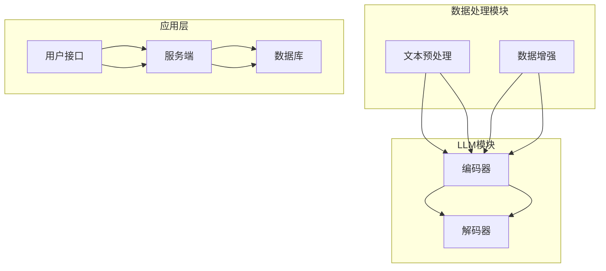
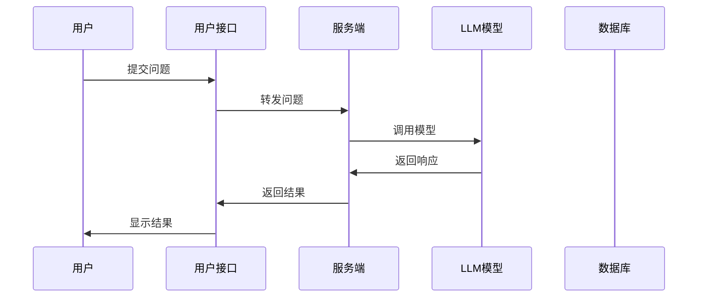

                 

### 敏捷中：确保LLM应用质量一致性

在当前快速发展的技术时代，语言模型（LLM）的应用已经成为人工智能领域的一大热点。LLM，如OpenAI的GPT系列模型，在自然语言处理、机器翻译、问答系统等方面展现出了强大的能力。然而，随着LLM应用的广泛普及，如何确保其质量一致性成为了一个不容忽视的问题。

#### 关键词：
- 敏捷开发
- 语言模型
- 质量一致性
- 应用实践

#### 摘要：
本文将探讨在敏捷开发过程中，如何确保大型语言模型（LLM）应用的质量一致性。文章将从背景介绍、核心概念解析、算法原理讲解、系统分析与架构设计、项目实战和最佳实践等多个方面进行深入讨论，旨在为开发者提供一套行之有效的策略和指南。

## 第一部分：背景与基础

### 1.1 问题背景

#### 1.1.1 LLM应用的现状与挑战

近年来，LLM技术取得了显著进展，广泛应用于各种场景。然而，LLM应用中存在的一个关键问题是质量不一致性。质量不一致性可能导致模型预测不准确、用户体验差等问题，影响实际应用效果。

#### 1.1.2 质量一致性的重要性

质量一致性是指LLM在不同条件下提供一致、可靠的结果。在敏捷开发中，确保质量一致性至关重要。它不仅能够提升模型性能，还能增强用户信任和满意度。

#### 1.1.3 敏捷方法在LLM应用中的适用性

敏捷开发以其灵活、迭代和客户至上的特点，非常适合在LLM应用开发中应用。通过敏捷方法，可以快速响应需求变化，持续优化模型质量。

### 1.2 核心概念

#### 1.2.1 LLM的概述

LLM是一种基于深度学习的语言模型，通过大量文本数据进行训练，能够生成自然语言响应。常见的LLM有GPT、BERT等。

#### 1.2.2 质量一致性的定义

质量一致性指的是模型在不同条件下（如数据集、环境等）都能保持高性能和稳定输出。

#### 1.2.3 敏捷开发的核心理念

敏捷开发强调团队合作、快速迭代、持续交付和客户反馈。这些理念有助于确保LLM应用的质量一致性。

### 1.3 敏捷方法论在LLM应用中的实践

#### 1.3.1 敏捷开发流程

敏捷开发流程通常包括需求收集、规划、迭代开发和回顾等环节。每个环节都要关注质量一致性。

#### 1.3.2 敏捷团队组织

敏捷团队通常由多学科专家组成，包括数据科学家、软件工程师和产品经理等。团队成员紧密协作，共同确保质量一致性。

#### 1.3.3 敏捷工具与框架

敏捷开发中常用的工具有JIRA、Trello等，框架有Scrum、Kanban等。这些工具和框架有助于跟踪项目进度、管理任务和评估质量。

## 第二部分：核心概念与联系

### 2.1 LLM的核心概念

#### 2.1.1 LLM的基本原理

LLM基于深度学习，通过大规模预训练和微调，能够自动理解和生成自然语言。

#### 2.1.2 LLM的主要类型

LLM可分为基于循环神经网络（RNN）的模型和基于Transformer的模型。Transformer模型如BERT、GPT等在性能上优于RNN模型。

#### 2.1.3 LLM的架构

LLM的架构通常包括编码器和解码器，其中编码器负责将输入文本编码为向量，解码器则从向量中生成输出文本。

### 2.2 质量一致性的核心要素

#### 2.2.1 质量一致性的衡量指标

质量一致性的衡量指标包括预测准确率、响应时间、稳定性等。这些指标需要在不同条件下进行评估。

#### 2.2.2 质量一致性与LLM的关联性

质量一致性直接影响LLM应用的可靠性和用户体验。不一致的质量会导致应用效果下降。

#### 2.2.3 质量一致性的影响分析

质量不一致可能导致模型失效、用户投诉、业务损失等。因此，确保质量一致性至关重要。

### 2.3 LLM应用中的敏捷联系

#### 2.3.1 敏捷开发与LLM需求的匹配

敏捷开发强调需求变化和快速迭代，与LLM需求的灵活性相匹配。

#### 2.3.2 敏捷迭代与LLM模型的训练

敏捷迭代有助于模型训练的持续优化，提高质量一致性。

#### 2.3.3 敏捷评估与LLM应用的验证

敏捷评估通过持续测试和反馈，确保LLM应用在不同条件下保持高质量。

## 第三部分：算法原理讲解

### 3.1 算法原理

#### 3.1.1 LLM模型的算法原理

LLM模型主要基于自注意力机制（Self-Attention）和Transformer架构。自注意力机制能够自动学习输入文本之间的关联性。

#### 3.1.2 质量一致性保障算法

质量一致性保障算法主要包括数据增强、模型校验和动态调整等。这些算法有助于提升模型的一致性和稳定性。

#### 3.1.3 算法流程与数学模型

算法流程包括数据预处理、模型训练、评估和调整等。数学模型主要包括损失函数、优化器和注意力机制等。

### 3.2 数学模型与公式

#### 3.2.1 相关数学公式

自注意力机制的核心公式包括：

$$
\text{Attention}(Q, K, V) = \text{softmax}\left(\frac{QK^T}{\sqrt{d_k}}\right)V
$$

其中，Q、K和V分别为查询向量、键向量和值向量，d_k为键向量的维度。

#### 3.2.2 公式的详细讲解

自注意力机制通过计算查询向量与键向量的点积，生成权重向量。这些权重向量用于加权合并值向量，从而实现输入文本之间的关联性。

#### 3.2.3 示例说明

假设输入文本为“我非常喜欢编程”，其中每个词表示为一个向量。通过自注意力机制，可以计算每个词与其它词的关联性，并生成加权向量。这个加权向量将用于生成输出文本。

## 第四部分：系统分析与架构设计

### 4.1 问题场景介绍

#### 4.1.1 应用场景描述

以智能客服系统为例，该系统利用LLM模型为用户提供实时、个性化的服务。

#### 4.1.2 系统功能需求

系统需要支持自然语言理解、生成和交互等功能，确保用户问题得到准确、及时的回答。

### 4.2 系统架构设计

#### 4.2.1 系统架构设计原则

系统架构设计应遵循模块化、可扩展和高效性原则。

#### 4.2.2 系统架构图

使用Mermaid语法绘制系统架构图：

#### 4.2.3 系统接口设计

系统接口包括用户接口、服务端和数据库。用户接口负责接收用户输入，服务端处理LLM模型请求，数据库存储用户信息和模型数据。

### 4.3 系统交互设计

#### 4.3.1 系统交互流程

用户通过接口提交问题，接口将问题发送到服务端。服务端调用LLM模型进行响应，并将结果返回给用户。

#### 4.3.2 交互序列图

使用Mermaid语法绘制交互序列图：

## 第五部分：项目实战

### 5.1 环境安装与配置

#### 5.1.1 环境搭建流程

安装必要的软件和依赖，包括Python、PyTorch、NVIDIA CUDA等。

#### 5.1.2 必要工具安装

安装版本管理工具如Git，代码编辑器如VS Code等。

### 5.2 系统核心实现

#### 5.2.1 核心代码实现

编写LLM模型的训练、评估和部署代码，实现系统核心功能。

#### 5.2.2 代码解读与分析

详细解读核心代码，分析算法原理和实现细节。

### 5.3 实际案例分析

#### 5.3.1 案例描述

以智能客服系统为例，描述系统在实际应用中的表现和效果。

#### 5.3.2 案例分析与讲解

分析案例中的关键问题和解决方案，讲解系统实现的技巧和经验。

### 5.4 项目小结

#### 5.4.1 项目总结

总结项目实施过程、成果和不足之处。

#### 5.4.2 经验与教训

分享项目中的经验和教训，为后续项目提供借鉴。

## 第六部分：最佳实践与拓展

### 6.1 最佳实践

#### 6.1.1 质量一致性保障策略

提出质量一致性保障策略，包括数据质量控制、模型优化和性能测试等。

#### 6.1.2 敏捷开发过程中的优化建议

在敏捷开发过程中，提出优化建议，包括团队协作、需求管理和风险管理等。

### 6.2 小结与展望

#### 6.2.1 书籍小结

总结书籍的主要内容，强调质量一致性的重要性。

#### 6.2.2 行业展望

展望LLM应用的未来发展趋势，探讨敏捷开发在LLM应用中的潜力。

#### 6.2.3 拓展阅读

推荐相关阅读材料，为读者提供进一步学习的机会。

---

### 作者

- 作者：AI天才研究院/AI Genius Institute & 禅与计算机程序设计艺术 /Zen And The Art of Computer Programming

---

**本文内容仅供学习和参考，实际应用时请结合具体情况进行调整。**

