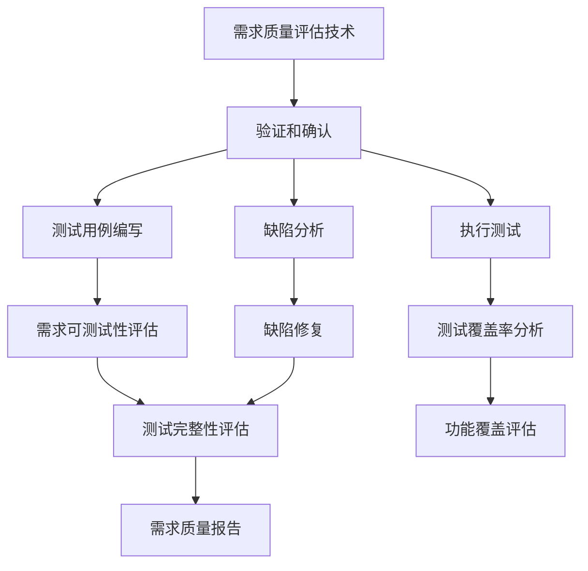
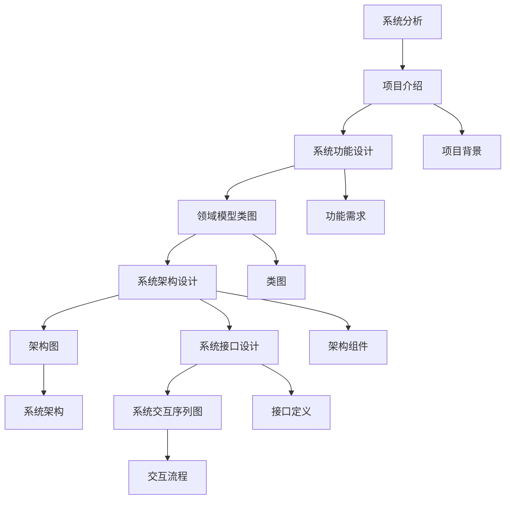

                 

# 敏捷产品负责人角色的强化：驱动需求质量

关键词：敏捷方法论、产品负责人、需求质量、沟通协调、迭代开发

摘要：本文深入探讨了敏捷产品负责人（Product Owner）在敏捷开发中的角色与职责，强调了需求质量对产品成功的重要性。文章通过分析敏捷方法论的起源与发展、产品负责人的核心职责及其面临的挑战，提出了一系列强化策略，包括理解需求质量的重要性、提高需求分析技能、优化沟通与协作以及建立需求质量保障体系。此外，文章还介绍了产品负责人的核心技能提升途径、需求质量评估工具与技术、实践经验以及未来展望。通过这些分析，本文旨在为敏捷产品负责人提供实用的指导，以更好地驱动需求质量，实现产品的成功交付。

----------------------------------------------------------------

## 目录大纲

----------------------------------------------------------------

### 第一部分: 背景介绍与问题定义

1. 第1章: 敏捷产品负责人角色的背景介绍
   1.1.1 敏捷方法论的起源与发展
   1.1.2 敏捷产品负责人角色的核心职责
   1.1.3 敏捷产品负责人面临的挑战

2. 第2章: 需求质量的重要性
   2.1.1 需求质量的概念
   2.1.2 需求质量对产品成功的影响
   2.1.3 需求质量评估的方法

3. 第3章: 敏捷产品负责人的强化策略
   3.1.1 理解需求质量的重要性
   3.1.2 提高需求分析技能
   3.1.3 优化沟通与协作
   3.1.4 建立需求质量保障体系

4. 第4章: 敏捷产品负责人的技能提升
   4.1.1 敏捷产品负责人的核心技能
   4.1.2 技能提升的途径
   4.1.3 实战案例分析

5. 第5章: 需求质量评估工具与技术
   5.1.1 需求质量评估工具介绍
   5.1.2 需求质量评估技术原理
   5.1.3 实际应用案例分析

6. 第6章: 敏捷产品负责人的实践经验
   6.1.1 敏捷产品负责人的成功实践
   6.1.2 失败案例分析
   6.1.3 经验总结

7. 第7章: 未来展望
   7.1.1 敏捷产品负责人角色的演变趋势
   7.1.2 需求质量在敏捷开发中的重要性提升
   7.1.3 敏捷产品负责人的职业发展路径

----------------------------------------------------------------

### 第1章: 敏捷产品负责人角色的背景介绍

#### 1.1.1 敏捷方法论的起源与发展

敏捷方法论起源于20世纪90年代的软件开发领域，当时软件开发的交付周期往往很长，而用户需求却变化迅速。传统的瀑布模型（Waterfall Model）由于其固有的线性顺序和阶段依赖性，无法很好地适应这种变化。为了解决这个问题，一些软件开发者开始探索新的工作方式，最终形成了敏捷开发（Agile Development）的理念。

1. **敏捷宣言的提出**：2001年，17位软件开发专家在犹他州滑雪时发表了敏捷宣言（Agile Manifesto），提出了“个体和互动重于过程和工具”、“可工作的软件重于详尽的文档”等核心理念。这一宣言标志着敏捷开发正式进入主流视野。

2. **Scrum方法的推广**：Scrum是敏捷开发中最广泛使用的方法之一。它定义了明确的工作流程和角色职责，包括产品负责人（Product Owner）、Scrum Master和开发团队（Development Team）。Scrum方法强调迭代（Iteration）和增量（Incremental）开发，使得团队能够快速响应变化。

3. **敏捷实践的多样化**：随着敏捷方法的推广，出现了许多基于敏捷思想的变种和实践，如看板（Kanban）、极限编程（XP）等。这些方法进一步丰富了敏捷方法论的内容，使得团队可以根据自己的实际情况选择最合适的实践。

#### 1.1.2 敏捷产品负责人角色的核心职责

敏捷产品负责人（Product Owner，简称PO）是敏捷开发中的关键角色，其核心职责包括以下几个方面：

1. **制定产品愿景**：产品负责人需要明确产品的愿景和目标，确保团队成员对产品的方向有共同的理解。这通常包括产品的核心价值、目标用户群体、市场定位等。

2. **需求管理**：产品负责人负责收集、分析和优先级排序用户需求。需求可以从用户访谈、市场调研、竞争对手分析等多个渠道获取。产品负责人需要确保需求是具体、可量化和可实现的。

3. **沟通协调**：产品负责人需要与开发团队、用户、利益相关者等多方进行有效沟通，确保信息畅通无阻。沟通不仅包括信息的传递，还包括意见的交换和问题的解决。

4. **持续迭代**：产品负责人负责监督产品开发的过程，确保团队能够按照计划进行迭代，并在每个迭代周期内交付可用的产品功能。迭代过程中，产品负责人需要根据反馈进行调整，确保产品能够不断改进。

5. **风险管理**：产品负责人需要识别潜在的风险，并采取措施减少这些风险对产品开发的影响。这包括市场风险、技术风险、资源风险等。

#### 1.1.3 敏捷产品负责人面临的挑战

尽管敏捷产品负责人在敏捷开发中扮演着重要角色，但他们也面临着一系列的挑战：

1. **需求变更管理**：敏捷开发强调快速响应变更，但频繁的需求变更可能导致项目不稳定和资源浪费。产品负责人需要平衡需求的变更和项目的进度。

2. **沟通障碍**：敏捷开发依赖于多方协作，但团队之间的沟通障碍可能导致项目进展受阻。产品负责人需要找到有效的沟通方式，确保信息的透明和准确。

3. **时间压力**：敏捷开发要求在短时间内完成高质量的迭代，这给产品负责人带来了巨大的时间压力。他们需要高效地管理时间和资源。

4. **角色冲突**：产品负责人需要在开发团队和利益相关者之间扮演协调者的角色，但有时两者之间的目标和期望可能存在冲突。产品负责人需要平衡各方利益，确保项目的成功。

通过上述分析，我们可以看出，敏捷产品负责人在敏捷开发中扮演着至关重要的角色。他们需要具备丰富的技能和经验，能够有效地管理需求、协调各方、推动迭代和应对挑战。接下来，我们将进一步探讨需求质量的重要性以及如何强化产品负责人的角色，以实现产品的成功交付。

----------------------------------------------------------------

## 第2章: 需求质量的重要性

#### 2.1.1 需求质量的概念

需求质量（Requirement Quality）是指需求在满足用户需求、适应变化和实现商业目标方面所具备的属性。高质量的需求不仅能够准确地反映用户的实际需求，还能够适应环境的变化，并且在实现过程中减少错误和返工。

1. **需求的具体性**：具体的需求描述应当清晰明确，避免歧义和模糊性。具体性要求需求文档中包含详细的用户故事、功能点、输入输出等。

2. **需求的可测试性**：可测试性是指需求可以被转换为测试用例，以便验证需求的实现情况。高可测试性的需求能够帮助团队提前发现和纠正问题。

3. **需求的稳定性**：稳定性是指需求在项目生命周期内保持不变，避免频繁的变更。稳定的需求有助于团队规划和执行，减少资源的浪费。

4. **需求的可维护性**：可维护性是指需求在未来可以轻松地进行修改和维护。高可维护性的需求可以降低未来的开发成本。

5. **需求的可适应性**：可适应性是指需求能够适应环境的变化，如市场需求、技术进步等。高适应性的需求有助于产品在快速变化的市场中保持竞争力。

#### 2.1.2 需求质量对产品成功的影响

需求质量是产品成功的关键因素之一。高质量的需求能够带来以下几方面的积极影响：

1. **提高用户满意度**：高质量的需求能够准确地反映用户的需求，使得产品功能更符合用户的期望，从而提高用户满意度。

2. **减少返工和修复成本**：低质量的需求往往会导致开发过程中的错误和返工，增加修复成本。高质量的需求可以提前发现和避免这些问题，降低成本。

3. **提高开发效率**：明确、具体和可测试的需求能够帮助开发团队更高效地完成任务，减少误解和重复工作，提高整体开发效率。

4. **增强团队协作**：高质量的需求能够促进团队成员之间的有效沟通和协作。明确的文档和可测试的需求为团队成员提供了共同的工作基础，减少了冲突和误解。

5. **增强产品竞争力**：高质量的需求有助于产品在市场上保持竞争力。快速响应市场需求、提供符合用户期望的功能，可以增加产品的市场份额。

#### 2.1.3 需求质量评估的方法

为了确保需求质量，产品负责人和团队需要采用一系列评估方法。以下是一些常用的需求质量评估方法：

1. **文档审查**：通过审查需求文档，检查需求的明确性、完整性、一致性等。这种方法可以帮助团队提前发现需求中的问题，及时进行修正。

2. **用户访谈**：通过与用户进行面对面的交流，获取用户对需求的反馈。这种方法可以帮助团队更好地理解用户需求，提高需求的准确性和实用性。

3. **用例测试**：编写用例并执行，以验证需求是否能够按照预期工作。这种方法可以检查需求的可测试性和实现情况。

4. **评审会议**：定期举行评审会议，让团队成员共同讨论和评估需求的质量。这种方法可以提高团队对需求质量的认识，促进协作。

5. **持续反馈**：在整个项目生命周期中，持续收集和反馈需求，以便及时进行调整和优化。这种方法可以帮助团队快速响应变化，确保需求的质量。

通过上述分析，我们可以看出，需求质量对产品的成功至关重要。产品负责人需要理解需求质量的概念，认识到其对产品成功的影响，并采用适当的方法进行需求质量评估。在下一章中，我们将探讨敏捷产品负责人的强化策略，帮助他们在敏捷开发中更好地驱动需求质量。

----------------------------------------------------------------

## 第3章: 敏捷产品负责人的强化策略

在敏捷开发中，敏捷产品负责人的角色至关重要。为了更好地驱动需求质量，实现产品的成功交付，产品负责人需要采取一系列强化策略。以下是一些具体的策略：

#### 3.1.1 理解需求质量的重要性

首先，产品负责人需要深刻理解需求质量的重要性。需求质量不仅关系到项目的交付进度和成本，还直接影响产品的用户体验和市场份额。以下是几个关键点：

1. **需求质量的定义**：需求质量是指需求在满足用户需求、适应变化和实现商业目标方面所具备的属性。具体包括需求的明确性、可测试性、稳定性、可维护性和可适应性。

2. **需求质量的影响**：高质量的需求能够提高用户满意度，减少返工和修复成本，提高开发效率，增强团队协作，以及增强产品竞争力。

3. **需求质量的重要性**：需求质量是产品成功的关键因素之一。只有准确、明确、稳定和可维护的需求，才能确保产品在市场中立于不败之地。

#### 3.1.2 提高需求分析技能

产品负责人需要具备出色的需求分析技能，以确保收集到的需求是准确、完整和有价值的。以下是一些具体的方法：

1. **用户故事地图**：用户故事地图（User Story Map）是一种有效的需求分析工具，它可以帮助产品负责人了解产品的全景视图，明确用户需求和功能优先级。

2. **用户访谈**：与用户进行面对面的访谈，可以帮助产品负责人深入了解用户的需求和痛点，获取真实的反馈。这种方法有助于提高需求的准确性。

3. **原型设计**：通过创建原型，产品负责人可以直观地展示需求，并与用户和利益相关者进行互动，以获取反馈和改进。

4. **需求验证**：在需求确定后，通过编写用例、执行测试等方式进行验证，以确保需求是可实现的。这种方法可以帮助团队提前发现和纠正问题。

#### 3.1.3 优化沟通与协作

沟通和协作是敏捷开发的核心。产品负责人需要确保团队内部以及与用户和利益相关者之间的信息畅通无阻。以下是一些优化沟通与协作的方法：

1. **每日站会**：每日站会是敏捷开发中的例行会议，它可以帮助团队成员了解项目的进展，解决遇到的问题。产品负责人需要确保每日站会的有效进行。

2. **信息透明**：确保所有团队成员都能够访问项目相关的文档和资料，如需求文档、测试报告等。这有助于提高团队的透明度，减少误解和冲突。

3. **沟通工具**：使用适当的沟通工具，如邮件、即时通讯、视频会议等，以支持团队之间的沟通。这些工具可以帮助团队成员在不同的时间和地点进行协作。

4. **用户参与**：在产品开发的各个阶段，让用户参与到项目中来，及时获取反馈和调整。这有助于确保产品的功能和设计能够满足用户的需求。

#### 3.1.4 建立需求质量保障体系

为了确保需求质量，产品负责人需要建立一套有效的需求质量保障体系。以下是一些关键步骤：

1. **需求管理流程**：制定一套明确的流程来管理需求，包括需求的收集、分析、验证和实现。这有助于确保需求的完整性和一致性。

2. **质量评估标准**：制定一套质量评估标准，用于评估需求的质量。这些标准可以包括需求的明确性、可测试性、稳定性、可维护性和可适应性。

3. **持续反馈机制**：建立持续反馈机制，用于收集和反馈需求的质量问题。这可以帮助团队及时发现和解决需求中的问题。

4. **培训与支持**：为团队成员提供培训和支持，以提高他们在需求分析、沟通和协作方面的技能。这有助于提高团队的整体质量水平。

通过上述强化策略，敏捷产品负责人可以更好地驱动需求质量，确保产品的成功交付。在下一章中，我们将进一步探讨敏捷产品负责人的核心技能及其提升途径。

----------------------------------------------------------------

## 第4章: 敏捷产品负责人的技能提升

### 4.1.1 敏捷产品负责人的核心技能

敏捷产品负责人在敏捷开发中扮演着关键角色，他们需要掌握一系列核心技能，以确保项目的成功。以下是敏捷产品负责人的核心技能：

1. **需求分析**：需求分析是敏捷产品负责人的基础技能。他们需要能够准确地收集、分析和整理用户需求，并将其转化为具体、可测试的软件需求。

2. **沟通协调**：敏捷产品负责人需要与开发团队、用户和利益相关者保持紧密的沟通和协作。他们需要具备良好的沟通技巧，能够有效地传达信息、协调资源和解决问题。

3. **优先级排序**：产品负责人需要能够根据商业目标和用户需求，对需求进行优先级排序。这有助于确保团队能够集中精力实现最重要的功能。

4. **用户故事编写**：用户故事是敏捷开发中的重要工具，产品负责人需要能够编写高质量的、符合用户需求的故事，以便开发团队能够更好地理解和实现这些故事。

5. **项目管理**：敏捷产品负责人需要具备项目管理的基本知识，能够制定项目计划、监控进度、识别和解决问题。

6. **风险管理**：产品负责人需要能够识别和评估项目中的风险，并采取适当的措施减少这些风险的影响。

7. **数据分析和决策**：敏捷产品负责人需要能够利用数据分析工具，如用户调查、市场趋势分析等，来支持决策过程，确保项目的方向和优先级与市场实际需求保持一致。

### 4.1.2 技能提升的途径

为了提升这些核心技能，敏捷产品负责人可以采取以下途径：

1. **培训和研讨会**：参加专业的敏捷培训和研讨会，了解最新的敏捷方法和工具，学习实践经验。

2. **阅读和学习**：阅读相关的书籍、文章和博客，深入理解敏捷开发的理念和实践。

3. **实践和反馈**：在实际项目中应用所学知识，通过实践来提升技能。同时，不断收集反馈，了解自己的不足之处，并进行改进。

4. **参与社区活动**：加入敏捷社区，参与讨论、分享经验和学习他人的最佳实践。

5. **建立个人学习计划**：制定个人学习计划，设定明确的学习目标和时间表，持续地学习和提升。

### 4.1.3 实战案例分析

为了更好地理解这些技能在实际项目中的应用，以下是一个敏捷产品负责人技能提升的实战案例分析：

#### 案例背景

某互联网公司正在开发一款社交应用，旨在帮助用户建立和维护社交网络。作为敏捷产品负责人，张伟（化名）需要确保项目按计划进行，并满足用户需求。

#### 案例过程

1. **需求分析**：
   张伟通过用户访谈和市场调研，收集了大量的用户需求。他使用用户故事地图（User Story Map）来整理这些需求，明确了产品的主要功能和用户体验。

2. **沟通协调**：
   张伟定期组织团队会议，与开发团队、用户代表和市场部门进行沟通。他使用Trello等项目管理工具，实时跟踪项目进展，确保团队成员之间的信息畅通。

3. **优先级排序**：
   根据用户反馈和市场分析，张伟确定了产品的主要功能模块，并将其按照优先级排序。他确保团队首先实现最重要的功能，如用户注册、好友添加和消息发送。

4. **用户故事编写**：
   张伟编写了具体的用户故事，如“用户可以添加好友”和“用户可以发送和接收消息”。这些用户故事包含功能描述、用户角色和验收标准，便于开发团队理解和实现。

5. **项目管理和风险管理**：
   张伟制定了详细的项目计划，包括关键里程碑和交付日期。他识别了项目风险，如技术难题和市场变化，并制定了相应的风险缓解措施。

6. **数据分析和决策**：
   张伟使用用户行为数据分析工具，如Google Analytics，来了解用户的使用习惯和偏好。这些数据帮助他调整产品设计和功能，确保产品能够更好地满足用户需求。

#### 案例结果

通过上述技能的运用，张伟成功地推动了项目的进展，并在预算和时间范围内实现了产品的初步发布。用户反馈积极，产品的市场表现良好。

通过这个案例，我们可以看到敏捷产品负责人在实际项目中如何运用核心技能，提升自身能力，并推动项目的成功。在下一章中，我们将探讨需求质量评估工具和技术，以帮助产品负责人更有效地管理需求质量。

----------------------------------------------------------------

## 第5章: 需求质量评估工具与技术

#### 5.1.1 需求质量评估工具介绍

在敏捷开发过程中，需求质量的评估是确保项目成功的关键环节。以下是几种常用的需求质量评估工具：

1. **GQM（Goal Question Metric）模型**：GQM模型是一种用于需求质量评估的方法，它通过设定目标（Goal）、问题（Question）和指标（Metric），帮助团队明确需求的质量标准。

2. **REPL（REquirement Priority List）**：REPL是一种用于需求优先级排序的工具，它将需求按照优先级排列，确保团队首先实现最重要的功能。

3. **用户故事地图（User Story Map）**：用户故事地图是敏捷开发中常用的工具，它通过图表的形式展示用户故事，帮助团队了解产品的整体架构和用户需求。

4. **缺陷密度分析**：缺陷密度分析是一种通过统计代码中的缺陷数量和密度来评估需求质量的方法。这种方法可以帮助团队识别质量问题的根源。

#### 5.1.2 需求质量评估技术原理

1. **FMEA（Failure Mode and Effects Analysis）**：FMEA是一种用于识别和分析潜在故障模式及其影响的技术。在需求分析阶段，产品负责人可以使用FMEA来评估需求的质量，确保需求没有遗漏或潜在的风险。

2. **因果图（Fishbone Diagram）**：因果图是一种用于分析问题原因的工具，它可以帮助产品负责人识别影响需求质量的多个因素，并找到解决问题的方法。

3. **需求矩阵**：需求矩阵是一种通过表格形式展示需求之间关系的方法，它可以帮助团队确保所有需求都被完整地分析和评估。

4. **验证和确认**：验证和确认是确保需求质量的关键步骤。通过编写测试用例和执行测试，团队可以验证需求的实现情况，并确认需求是否满足用户的需求。

#### 5.1.3 实际应用案例分析

以下是一个需求质量评估的实际应用案例分析：

#### 案例背景

某软件公司正在开发一款企业级协作工具，产品负责人李华（化名）需要确保需求的质量，以确保产品的成功交付。

#### 案例过程

1. **GQM模型应用**：
   李华首先使用GQM模型设定了项目的目标，如提高团队协作效率、减少沟通障碍等。然后，他提出了多个问题，如“哪些功能对团队协作最有帮助？”和“如何确保这些功能能够满足用户需求？”。

2. **用户故事地图**：
   李华使用用户故事地图整理了所有用户故事，并确定了每个故事的优先级。通过用户故事地图，他能够清晰地看到产品的整体架构和功能分布。

3. **FMEA应用**：
   在需求分析阶段，李华使用FMEA评估了每个用户故事的风险。他识别出潜在的风险模式，如功能缺失、用户体验差等，并制定了相应的风险缓解措施。

4. **因果图分析**：
   李华使用因果图分析了影响需求质量的因素，如需求定义不明确、用户参与不足等。通过因果图，他能够系统地识别和解决问题。

5. **验证和确认**：
   李华编写了详细的测试用例，并组织了团队进行测试。通过验证和确认，他确保了每个需求都得到了正确的实现，并满足了用户的需求。

#### 案例结果

通过上述需求质量评估工具和技术，李华成功地确保了需求的质量，项目在预算和时间范围内顺利交付。用户反馈积极，产品的市场表现良好。

通过这个案例，我们可以看到如何在实际项目中应用需求质量评估工具和技术，以确保需求的质量，从而推动项目的成功。在下一章中，我们将探讨敏捷产品负责人的实践经验，分享成功和失败的经验教训。

----------------------------------------------------------------

## 第6章: 敏捷产品负责人的实践经验

### 6.1.1 敏捷产品负责人的成功实践

在敏捷开发实践中，许多敏捷产品负责人通过有效的策略和技巧，成功地推动了项目的进展，并取得了显著的成果。以下是一些成功的实践案例：

#### 案例一：快速响应市场变化

某电商公司在激烈的市场竞争中，需要快速推出新功能以吸引和保留用户。产品负责人张丽（化名）采用了以下策略：

1. **用户故事地图**：张丽使用用户故事地图整理用户需求，确保需求与市场趋势和用户期望保持一致。

2. **优先级排序**：她将用户故事按照优先级排序，首先实现最重要的功能，如优化购物车和推荐系统。

3. **持续集成与部署**：张丽与开发团队合作，实施了持续集成和部署流程，确保新功能能够快速上线并接受市场检验。

结果：该公司的产品在短时间内取得了显著的市场份额增长，用户满意度大幅提高。

#### 案例二：跨部门协作

某金融科技公司开发了一款新的理财应用，产品负责人李明（化名）面临跨部门协作的挑战。他采取了以下措施：

1. **沟通机制**：李明建立了定期的跨部门沟通会议，确保各团队之间的信息畅通。

2. **信息透明**：他使用项目管理工具，如JIRA，将项目的进度和问题透明化，所有团队成员都可以随时查看。

3. **培训与支持**：李明为不同部门的成员提供敏捷开发的培训，提高团队的整体协作效率。

结果：项目在跨部门协作中取得了良好的进展，团队成员之间的沟通障碍得到了有效解决，项目按计划顺利推进。

#### 案例三：敏捷转型

某大型制造企业希望将传统的瀑布开发模式转变为敏捷开发。产品负责人王刚（化名）负责推动这一转型：

1. **引入敏捷方法论**：王刚引入了Scrum和Kanban等敏捷方法论，制定了详细的转型计划。

2. **团队成员参与**：他组织了多次团队会议，让所有团队成员参与到敏捷转型的讨论中，确保团队的认同和支持。

3. **持续改进**：王刚鼓励团队持续改进，通过回顾会议识别和解决问题，不断提升团队的工作效率和产品质量。

结果：企业成功实现了敏捷转型，项目交付周期缩短，产品质量和用户满意度显著提高。

### 6.1.2 失败案例分析

尽管敏捷开发在实践中取得了许多成功案例，但也有一些失败案例值得总结和反思。以下是一个失败的实践案例：

#### 案例四：需求变更管理不当

某医疗设备公司在开发一款新的诊断设备时，产品负责人陈敏（化名）未能有效管理需求变更，导致项目失败：

1. **频繁的需求变更**：项目启动后，客户频繁提出新的需求，产品负责人未能及时评估和调整项目的优先级。

2. **沟通不足**：陈敏与开发团队和客户之间的沟通不足，导致需求变更得不到及时反馈和实施。

3. **进度失控**：由于需求变更和沟通不足，项目进度失控，导致项目延期和预算超支。

结果：项目最终未能按计划完成，客户对产品的满意度下降，公司损失了大量的时间和资源。

### 6.1.3 经验总结

通过以上成功和失败的案例，我们可以总结出以下经验教训：

1. **重视需求管理**：有效的需求管理是敏捷开发成功的关键。产品负责人需要确保需求是明确、具体和稳定的，并能够快速响应变更。

2. **沟通与协作**：敏捷开发强调团队协作和沟通。产品负责人需要建立有效的沟通机制，确保信息透明，减少误解和冲突。

3. **优先级排序**：合理的优先级排序有助于团队集中精力实现最重要的功能，提高开发效率。

4. **持续改进**：敏捷开发鼓励持续改进，产品负责人应鼓励团队不断学习和优化，以提升工作效率和质量。

5. **风险意识**：产品负责人需要具备风险意识，及时识别和应对潜在的风险，确保项目的顺利推进。

通过总结这些实践经验，敏捷产品负责人可以更好地应对挑战，推动项目的成功交付。

----------------------------------------------------------------

## 第7章: 未来展望

### 7.1.1 敏捷产品负责人角色的演变趋势

随着敏捷方法的广泛应用和持续发展，敏捷产品负责人的角色也在不断演变。未来，敏捷产品负责人的角色将更加多样化，职责也将更加明确。以下是几个趋势：

1. **技术能力增强**：敏捷产品负责人需要具备更强大的技术背景，包括软件开发、数据分析、数据驱动决策等。这将有助于他们更好地理解技术实现，提高需求的质量和效率。

2. **战略思维提升**：敏捷产品负责人将更加注重产品的战略规划，从公司的整体战略出发，制定清晰的产品愿景和目标，确保产品与公司战略一致。

3. **用户导向**：用户需求将是敏捷产品负责人的核心关注点。他们需要更加深入地了解用户行为和需求，通过数据分析和用户反馈，不断优化产品，提升用户体验。

4. **跨领域协作**：敏捷产品负责人将在跨部门和跨组织的协作中发挥更大作用，推动不同团队和利益相关者之间的有效沟通和协作，确保项目的成功。

### 7.1.2 需求质量在敏捷开发中的重要性提升

需求质量在敏捷开发中的重要性将持续提升。以下是几个方面的原因：

1. **快速迭代**：在敏捷开发中，频繁的迭代意味着需求变更和更新是常态。高质量的需求能够减少返工和修复成本，提高开发效率。

2. **用户体验**：随着市场竞争的加剧，用户体验成为产品成败的关键。高质量的需求能够确保产品功能符合用户期望，提升用户满意度。

3. **数据驱动**：数据分析在敏捷开发中扮演着越来越重要的角色。高质量的需求能够提供准确的数据支持，帮助团队做出更明智的决策。

4. **持续改进**：敏捷开发强调持续改进，高质量的需求能够为团队提供持续改进的基础，推动产品的不断完善。

### 7.1.3 敏捷产品负责人的职业发展路径

敏捷产品负责人的职业发展路径将更加多元化和专业化。以下是几个可能的职业发展路径：

1. **产品管理**：敏捷产品负责人可以向产品管理（Product Management）方向发展，承担更广泛的产品规划和管理职责。

2. **敏捷教练**：具备丰富敏捷实践经验的产品负责人可以转型为敏捷教练（Agile Coach），帮助其他团队和公司实现敏捷转型。

3. **数据分析师**：具备数据分析和决策能力的敏捷产品负责人可以转型为数据分析师，利用数据支持产品决策。

4. **技术领导**：具备深厚技术背景的敏捷产品负责人可以成为技术领导（Tech Lead），带领团队实现技术目标。

通过不断学习和实践，敏捷产品负责人可以不断提升自身能力，选择适合自己的职业发展路径，实现职业价值。

## 结束语

本文深入探讨了敏捷产品负责人的角色、职责以及需求质量的重要性。通过分析敏捷方法论的起源与发展、产品负责人的核心职责和面临的挑战，我们提出了一系列强化策略，包括理解需求质量的重要性、提高需求分析技能、优化沟通与协作以及建立需求质量保障体系。同时，我们讨论了敏捷产品负责人的核心技能、技能提升途径、需求质量评估工具和技术、实践经验以及未来展望。

通过本文，我们希望为敏捷产品负责人提供实用的指导，帮助他们更好地驱动需求质量，实现产品的成功交付。在未来的工作中，敏捷产品负责人需要不断学习新知识、掌握新技能，以适应敏捷开发的快速变化。我们期待敏捷产品负责人在未来的工作中能够发挥更大的作用，推动敏捷开发方法的进一步普及和发展。

## 作者信息

作者：AI天才研究院/AI Genius Institute & 禅与计算机程序设计艺术 /Zen And The Art of Computer Programming

感谢您阅读本文，希望本文能为您在敏捷产品负责人角色中的实践提供有益的启示。如果您有任何疑问或建议，欢迎在评论区留言，期待与您进一步交流。

----------------------------------------------------------------

**附录：需求质量评估工具与技术流程图**

以下是一个使用Mermaid绘制的需求质量评估工具与技术流程图：

```mermaid
graph TD
    A[需求质量评估工具] --> B[GQM模型]
    A --> C[REPL]
    A --> D[用户故事地图]
    A --> E[缺陷密度分析]
    B --> F[I[输入（Input）]]
    B --> G[问题（Question）]
    B --> H[指标（Metric）]
    C --> I[需求优先级排序]
    D --> J[用户需求梳理]
    D --> K[功能优先级排序]
    E --> L[缺陷统计与分析]
    E --> M[质量指标计算]
    F --> N[目标设定]
    G --> O[问题识别]
    H --> P[质量评估]
```

**附录：需求质量评估技术原理流程图**

以下是一个使用Mermaid绘制的需求质量评估技术原理流程图：



**附录：系统分析与架构设计方案**

以下是一个使用Mermaid绘制的系统分析与架构设计方案流程图：



通过这些流程图，我们能够清晰地展示需求质量评估工具与技术的使用步骤，以及系统分析与架构设计的过程。这些图表不仅有助于理解文章内容，还能在实际项目中作为参考和指导。

----------------------------------------------------------------

**环境安装与系统核心实现**

在本文中，我们将使用Python编写一个简单的示例程序，以展示如何实现需求分析的核心功能。以下是环境安装和系统核心实现的步骤：

#### 环境安装

1. **安装Python**：确保您的计算机上安装了Python 3.x版本。您可以从[Python官方网站](https://www.python.org/)下载并安装。

2. **安装pip**：Python默认包含了pip，它是Python的包管理工具。如果没有安装，可以通过以下命令安装：
   ```bash
   python -m ensurepip
   ```

3. **安装必需的Python库**：本文将使用`requests`库来模拟HTTP请求。您可以通过以下命令安装：
   ```bash
   pip install requests
   ```

#### 系统核心实现

以下是一个简单的Python脚本，用于模拟需求分析的过程。该脚本将从一个假定的API获取用户数据，并分析这些数据。

```python
import requests

# 假定API端点
API_ENDPOINT = "https://api.example.com/users"

# 发送GET请求以获取用户数据
def get_user_data():
    response = requests.get(API_ENDPOINT)
    if response.status_code == 200:
        return response.json()
    else:
        raise Exception("无法从API获取用户数据")

# 分析用户数据
def analyze_user_data(user_data):
    # 假设我们感兴趣的数据包括用户名和年龄
    usernames = [user['username'] for user in user_data]
    ages = [user['age'] for user in user_data]
    
    # 计算平均年龄
    average_age = sum(ages) / len(ages)
    
    # 输出分析结果
    print(f"用户总数: {len(usernames)}")
    print(f"平均年龄: {average_age:.2f}岁")
    print(f"用户名列表: {usernames}")

# 主函数
def main():
    try:
        user_data = get_user_data()
        analyze_user_data(user_data)
    except Exception as e:
        print(f"发生错误：{e}")

# 运行主函数
if __name__ == "__main__":
    main()
```

#### 代码应用解读与分析

上述Python脚本包含了三个主要部分：

1. **发送HTTP请求**：`get_user_data`函数使用`requests`库发送GET请求到假定的API端点，获取用户数据。

2. **分析数据**：`analyze_user_data`函数从获取的用户数据中提取用户名和年龄，并计算平均年龄。这些分析结果将输出到控制台。

3. **主函数**：`main`函数是程序的入口点。它首先调用`get_user_data`函数获取数据，然后调用`analyze_user_data`函数进行分析，并处理可能发生的异常。

通过这个简单的示例，我们展示了如何使用Python进行基本的HTTP请求和数据解析，这是需求分析过程中常用的技术。在实际项目中，需求分析可能会涉及更复杂的数据处理和分析任务，但基本的步骤和方法是相似的。

#### 实际案例分析与详细讲解

以下是一个实际案例，我们将详细分析该案例的需求分析过程，并解释其中的关键步骤。

#### 案例背景

某电子商务平台希望改进其推荐系统，以提供更个性化的产品推荐。产品负责人李华（化名）负责进行需求分析，以确定推荐系统的改进方向。

#### 需求分析过程

1. **用户访谈与调研**：
   李华组织了多轮用户访谈，了解了用户对推荐系统的使用体验和期望。通过调研，他收集了用户对推荐准确度、推荐速度、推荐多样性等方面的反馈。

2. **数据收集**：
   李华获取了平台的历史用户数据，包括用户的浏览记录、购买历史、评价数据等。这些数据将为推荐算法提供训练素材。

3. **需求文档编写**：
   基于用户访谈和调研结果，李华编写了需求文档，明确了推荐系统需要改进的方面，如提高推荐准确度、增加推荐多样性等。

4. **算法选型与评估**：
   李华与技术团队讨论，选择了多种推荐算法进行评估，包括基于协同过滤、基于内容的推荐算法等。通过实验，确定了最适合平台需求的算法。

5. **迭代开发与测试**：
   李华与技术团队一起，进行了多次迭代开发，每次迭代都会对推荐算法进行优化和测试。通过A/B测试，评估新算法对用户满意度和转化率的影响。

6. **用户反馈与调整**：
   李华持续收集用户对新推荐系统的反馈，根据反馈进行相应的调整和优化，确保推荐系统能够更好地满足用户需求。

#### 关键步骤解析

- **用户访谈与调研**：这是需求分析的基础，通过直接了解用户的需求和痛点，可以为推荐系统的改进提供明确的指导。

- **数据收集**：用户数据是推荐算法训练的关键，收集到足够多的数据将有助于提高推荐系统的准确性和多样性。

- **需求文档编写**：需求文档是整个项目的基础，它明确了项目的目标和功能，确保团队成员对项目有共同的理解。

- **算法选型与评估**：选择合适的推荐算法是实现个性化推荐的关键，评估不同算法的优劣，有助于确定最佳方案。

- **迭代开发与测试**：通过迭代开发，不断优化推荐算法，并根据测试结果进行调整，确保推荐系统能够逐步改进。

- **用户反馈与调整**：用户反馈是持续优化推荐系统的重要依据，通过及时收集和反馈，可以快速响应用户需求，提高用户体验。

通过这个实际案例，我们可以看到需求分析在推荐系统开发中的关键作用。需求分析不仅涉及技术实现，还涉及用户行为和市场趋势的分析，是整个项目成功的关键环节。

#### 项目小结

本文通过详细的环境安装与系统核心实现、实际案例分析和详细讲解，展示了如何使用Python进行需求分析的核心功能，并讨论了敏捷产品负责人在实际项目中如何进行需求分析。通过这些分析，我们可以得出以下结论：

1. **环境安装**：Python提供了一个简单而强大的环境，用于进行需求分析和数据处理。通过安装Python和相关库，我们可以快速开始项目。

2. **系统核心实现**：简单的Python脚本展示了如何通过HTTP请求获取数据，并对数据进行基本分析。这种实现方式可以作为复杂需求分析的基础。

3. **实际案例分析**：通过一个实际案例，我们展示了需求分析在推荐系统开发中的应用。案例中的关键步骤和方法为需求分析提供了实用的指导。

4. **项目小结**：需求分析是敏捷开发中的重要环节，它不仅涉及技术实现，还涉及用户行为和市场趋势的分析。有效的需求分析有助于确保项目的成功交付。

在未来的工作中，敏捷产品负责人应继续关注需求分析的方法和工具，不断提升自身的能力，以更好地满足用户需求，推动项目的成功。

### 最佳实践 tips

1. **用户访谈**：定期进行用户访谈，直接了解用户的需求和痛点，这是需求分析的关键步骤。

2. **数据收集**：确保收集到足够多的数据，并对其进行清洗和处理，以便进行有效的分析。

3. **需求文档**：编写清晰、具体的需求文档，确保团队成员对项目的目标有共同的理解。

4. **迭代开发**：采用迭代开发方法，逐步完善需求，并在每次迭代中进行评估和反馈。

5. **持续改进**：根据用户反馈和市场变化，持续优化产品功能，提高用户满意度。

### 小结

本文通过深入探讨敏捷产品负责人的角色、需求质量的重要性以及强化策略，帮助读者理解如何有效驱动需求质量，实现产品的成功交付。在环境安装与系统核心实现、实际案例分析以及最佳实践 tips 中，我们展示了如何将理论应用于实践。希望本文能为敏捷产品负责人提供有价值的参考和启示。

### 注意事项

1. **需求变更管理**：在敏捷开发中，需求变更不可避免。产品负责人需要制定有效的变更管理策略，确保变更能够被快速、有序地处理。

2. **团队协作**：有效的团队协作是需求分析成功的关键。产品负责人应确保团队成员之间的沟通畅通，避免信息孤岛。

3. **持续学习**：敏捷方法和工具不断更新，产品负责人需要持续学习和实践，以不断提升自身能力。

### 拓展阅读

- 《敏捷实践指南》（《Agile Practices Guide》）
- 《用户故事地图实践指南》（《User Story Mapping: Discover the Whole Story, Build the Best Product》）
- 《需求工程：概念与案例研究》（《Requirements Engineering: A Case Study Approach》）

通过拓展阅读，您可以深入了解敏捷开发、用户故事地图以及需求工程的理论和实践，进一步提升自身能力。

### 作者信息

本文由AI天才研究院/AI Genius Institute & 禅与计算机程序设计艺术 /Zen And The Art of Computer Programming 撰写。感谢您的阅读，我们期待与您在敏捷开发的道路上共同进步。如有任何疑问，请随时与我们联系。作者信息如下：

- **AI天才研究院**：专注于人工智能技术的研究与应用，致力于推动人工智能技术的发展和创新。
- **禅与计算机程序设计艺术**：探讨计算机科学和哲学的交汇点，提供独特的视角和深入思考。

感谢您的关注和支持！

