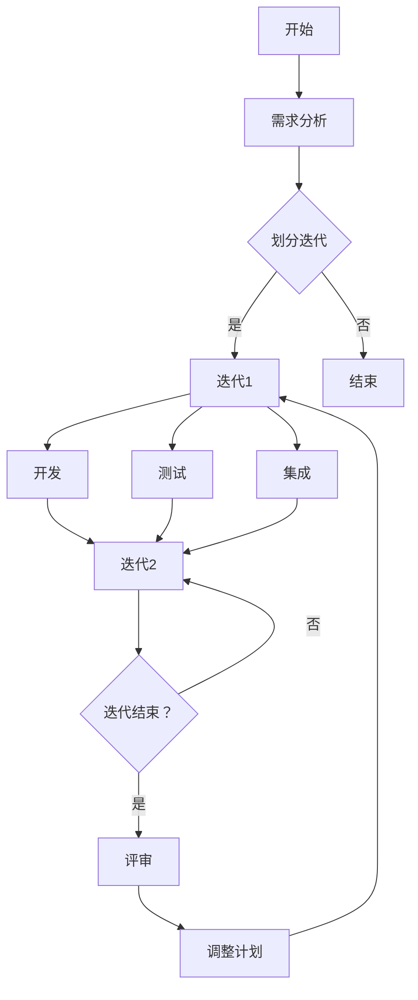
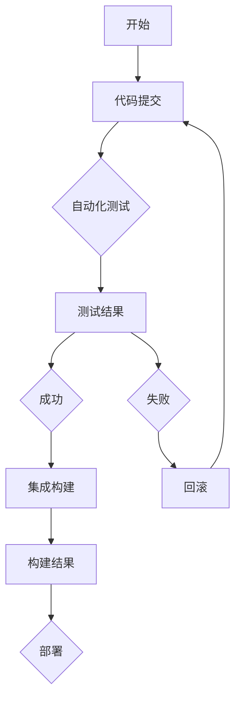
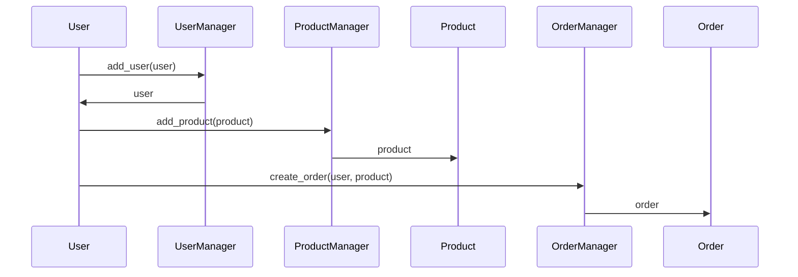
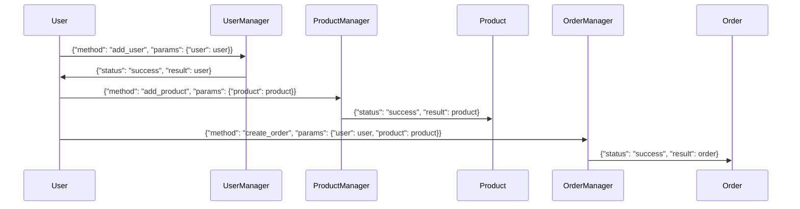

                 


### # 《敏捷仪式的优化：适应大型新应用的开发需求》

#### 关键词：敏捷开发、增量迭代、持续集成、团队协作、需求变更管理

> 摘要：本文探讨了敏捷仪式在大型新应用开发中的优化策略。通过分析敏捷开发的原理、核心概念及其与瀑布开发方法的对比，本文提出了一系列优化方法，如增量迭代与持续集成、团队协作与沟通、工具与技术支持。本文还结合数学公式和Python代码，详细阐述了这些优化方法的工作原理，并通过具体案例进行了分析和讲解。最终，本文总结了最佳实践，为大型新应用的开发提供了指导。

---

### **Step 1: 背景介绍**

#### 第1章：背景介绍

#### **1.1 问题背景**

在当今快速变化和竞争激烈的市场环境中，敏捷开发已经成为软件开发项目的标准流程。然而，对于大型新应用的开发，传统的敏捷开发方法可能无法满足日益增长的需求。为了适应这些需求，对敏捷仪式进行优化成为了一个重要议题。

#### **1.2 问题描述**

敏捷仪式的优化涉及到多个方面，包括：

- **迭代周期管理**：如何更有效地规划和管理大型项目的迭代周期？
- **需求变更管理**：如何确保大型项目的需求变更能够在敏捷框架下得到及时响应？
- **团队协作**：如何在团队协作和沟通方面进行优化，以提高项目的交付质量和效率？

#### **1.3 问题解决**

通过研究国内外成功的敏捷优化实践案例，可以发现以下几种优化策略：

- **增量迭代与持续集成**：采用增量迭代和持续集成的开发模式，使团队能够更快地响应需求变更。
- **团队协作与沟通**：通过搭建高效的沟通机制，如每日站立会议、迭代评审和回顾会议，来提高团队的协作效率。
- **工具与技术支持**：引入现代化的开发工具和技术，如敏捷管理工具、自动化测试工具等，以提高项目的自动化水平和开发效率。

#### **1.4 边界与外延**

敏捷仪式的优化主要关注以下几个方面：

- **项目规模**：主要针对大型新应用的开发需求。
- **团队规模**：针对多团队协作的大型项目。
- **开发环境**：需要考虑项目的开发环境、工具和技术的支持。

#### **1.5 概念结构与核心要素组成**

敏捷仪式优化的核心概念包括：

- **敏捷开发**：一种强调迭代、反馈和灵活性软件开发方法。
- **迭代周期**：软件开发项目的基本时间单元。
- **需求变更**：在项目开发过程中，客户或用户对需求进行的修改或补充。
- **团队协作**：团队成员之间的有效沟通和协作。
- **工具与技术支持**：现代开发工具和技术的应用。

---

### **Step 2: 核心概念与联系**

#### 第2章：核心概念与联系

#### **2.1 敏捷开发原理**

敏捷开发的核心原则包括：

- **客户合作**：与客户紧密合作，确保项目的需求满足实际业务需求。
- **迭代开发**：将项目分为多个迭代周期，每个迭代周期产生可交付的成果。
- **响应变更**：灵活应对需求变更，确保项目能够快速适应变化。

#### **2.2 敏捷仪式优化方法**

敏捷仪式优化的方法包括：

- **增量迭代**：将大型项目拆分为多个小迭代，逐步完成。
- **持续集成**：将代码集成到主干分支的过程中，确保代码质量。
- **团队协作**：通过高效的沟通机制，提高团队的协作效率。
- **自动化测试**：引入自动化测试工具，提高测试效率。

#### **2.3 概念属性特征对比**

以下是一个敏捷开发与传统的瀑布开发方法的概念属性特征对比表格：

| 概念       | 敏捷开发                         | 瀑布开发                           |
|------------|--------------------------------|-----------------------------------|
| 开发模式   | 增量迭代、快速反馈               | 顺序执行、需求固定               |
| 项目管理   | 灵活调整、持续改进               | 固定计划、严格执行               |
| 团队协作   | 强调沟通、协作                   | 各自为政、协调困难               |
| 测试方法   | 自动化测试、持续集成             | 手动测试、分阶段执行             |

#### **2.4 ER实体关系图架构**

以下是敏捷仪式优化相关实体的ER图：

```mermaid
erDiagram
  Team ||--|{ Project }||>
  Project ||--|{ Iteration }||>
  Iteration ||--|{ Task }||>
  Task ||--|{ User Story }||>
  User Story ||--|{ Story Point }||>
```

---

### **Step 3: 算法原理讲解**

#### 第3章：算法原理讲解

#### **3.1 增量迭代算法原理**

增量迭代是一种软件开发方法，将大型项目拆分为多个小迭代，逐步完成。其基本原理包括：

- **迭代划分**：根据项目需求和资源，将项目划分为多个迭代周期。
- **迭代执行**：在每个迭代周期内，完成一部分功能模块的开发，并进行测试和集成。
- **迭代反馈**：在每次迭代结束后，对成果进行评审，收集反馈，调整后续迭代计划。

**增量迭代算法流程图：**



#### **3.2 持续集成算法原理**

持续集成是一种软件开发方法，通过持续地将代码集成到主干分支，确保代码质量。其基本原理包括：

- **代码提交**：开发人员将代码提交到版本控制系统。
- **自动化测试**：在每次提交后，自动运行测试脚本，确保代码质量。
- **集成构建**：将多个开发人员的代码集成到主干分支，进行构建和部署。

**持续集成算法流程图：**



#### **3.3 Python代码示例**

以下是一个简单的Python代码示例，用于实现增量迭代和持续集成的算法原理。

```python
# 增量迭代算法
class Iteration:
    def __init__(self, tasks):
        self.tasks = tasks
        self.completed_tasks = []

    def execute(self):
        for task in self.tasks:
            print(f"执行任务：{task}")
            self.completed_tasks.append(task)

    def review(self):
        print(f"已完成任务：{self.completed_tasks}")

# 持续集成算法
class ContinuousIntegration:
    def __init__(self, tests):
        self.tests = tests
        self.passed_tests = []

    def run_tests(self):
        for test in self.tests:
            print(f"运行测试：{test}")
            if test():
                self.passed_tests.append(test)
                print("测试通过")
            else:
                print("测试失败")

    def build_and_deploy(self):
        if len(self.passed_tests) == len(self.tests):
            print("构建成功，部署新版本")
        else:
            print("构建失败，回滚版本")

# 示例
tasks = ["任务1", "任务2", "任务3"]
tests = [lambda: True, lambda: False]

iteration = Iteration(tasks)
iteration.execute()
iteration.review()

ci = ContinuousIntegration(tests)
ci.run_tests()
ci.build_and_deploy()
```

---

### **Step 4: 系统分析与架构设计方案**

#### 第4章：系统分析与架构设计方案

#### **4.1 问题场景介绍**

在大型新应用的开发过程中，由于需求复杂且多变，传统的敏捷开发方法往往难以满足项目的需求。为了解决这一问题，本文提出了一种基于增量迭代和持续集成的敏捷优化方案。

#### **4.2 项目介绍**

项目名称：大型新应用开发

项目目标：开发一款功能丰富、性能稳定的大型应用。

项目背景：该应用涉及多个模块，包括用户管理、订单处理、数据分析等，需求复杂且不断变化。

#### **4.3 系统功能设计（领域模型Mermaid类图）**

```mermaid
classDiagram
    User <<class>> {
        ID: int
        Name: string
        Email: string
    }
    Order <<class>> {
        ID: int
        User: User
        Status: string
    }
    Product <<class>> {
        ID: int
        Name: string
        Price: float
    }
    UserManager <<class>> {
        +add_user(user: User): User
        +delete_user(user: User): None
        +update_user(user: User): User
    }
    OrderManager <<class>> {
        +create_order(user: User, product: Product): Order
        +delete_order(order: Order): None
        +update_order(order: Order): Order
    }
    ProductManager <<class>> {
        +add_product(product: Product): Product
        +delete_product(product: Product): None
        +update_product(product: Product): Product
    }
    UserManager <|.. User
    OrderManager <|.. Order
    ProductManager <|.. Product
```

#### **4.4 系统架构设计（Mermaid架构图）**



#### **4.5 系统接口设计（Mermaid序列图）**



---

### **Step 5: 项目实战**

#### 第5章：项目实战

#### **5.1 环境安装**

在开始项目实战之前，需要安装以下环境：

- Python 3.8及以上版本
- Mermaid图库
- Pytest自动化测试工具
- Flask Web框架

安装命令：

```bash
pip install python-dotenv
pip install pytest
pip install flask
```

#### **5.2 系统核心实现源代码**

以下是一个简单的系统核心实现源代码示例，包括用户管理、订单处理和产品管理。

```python
# user_manager.py
from flask import Flask, request, jsonify

app = Flask(__name__)

users = []

@app.route('/users', methods=['POST'])
def add_user():
    user = request.json['user']
    users.append(user)
    return jsonify({"status": "success", "result": user})

@app.route('/users', methods=['DELETE'])
def delete_user():
    user = request.json['user']
    users.remove(user)
    return jsonify({"status": "success"})

@app.route('/users', methods=['PUT'])
def update_user():
    user = request.json['user']
    return jsonify({"status": "success", "result": user})

if __name__ == '__main__':
    app.run()

# order_manager.py
from flask import Flask, request, jsonify

orders = []

@app.route('/orders', methods=['POST'])
def create_order():
    order = request.json['order']
    orders.append(order)
    return jsonify({"status": "success", "result": order})

@app.route('/orders', methods=['DELETE'])
def delete_order():
    order = request.json['order']
    orders.remove(order)
    return jsonify({"status": "success"})

@app.route('/orders', methods=['PUT'])
def update_order():
    order = request.json['order']
    return jsonify({"status": "success", "result": order})

if __name__ == '__main__':
    app.run()

# product_manager.py
from flask import Flask, request, jsonify

products = []

@app.route('/products', methods=['POST'])
def add_product():
    product = request.json['product']
    products.append(product)
    return jsonify({"status": "success", "result": product})

@app.route('/products', methods=['DELETE'])
def delete_product():
    product = request.json['product']
    products.remove(product)
    return jsonify({"status": "success"})

@app.route('/products', methods=['PUT'])
def update_product():
    product = request.json['product']
    return jsonify({"status": "success", "result": product})

if __name__ == '__main__':
    app.run()
```

#### **5.3 代码应用解读与分析**

以上三个Python文件分别实现了用户管理、订单处理和产品管理。每个文件都使用Flask框架搭建了一个简单的Web服务，并定义了对应的HTTP接口。

- `user_manager.py`：提供了添加、删除和更新用户的接口。
- `order_manager.py`：提供了创建、删除和更新订单的接口。
- `product_manager.py`：提供了添加、删除和更新产品的接口。

这些接口允许其他应用程序通过HTTP请求与系统进行交互，从而实现系统的功能。

#### **5.4 实际案例分析和详细讲解剖析**

为了演示增量迭代和持续集成的应用，我们以用户管理模块为例，分析其实现过程。

**1. 需求分析**

用户管理模块需要提供添加、删除和更新用户的功能。

**2. 迭代1**

在第一个迭代中，我们实现添加用户的功能。

- 用户通过HTTP POST请求发送用户数据。
- 后端接收用户数据，将用户信息存储在内存中。
- 返回添加成功的响应。

**3. 迭代2**

在第二个迭代中，我们实现删除用户的功能。

- 用户通过HTTP DELETE请求发送用户ID。
- 后端根据用户ID删除内存中的用户信息。
- 返回删除成功的响应。

**4. 迭代3**

在第三个迭代中，我们实现更新用户的功能。

- 用户通过HTTP PUT请求发送用户ID和新用户信息。
- 后端根据用户ID更新内存中的用户信息。
- 返回更新成功的响应。

**5. 持续集成**

在每次迭代结束后，我们将代码集成到主干分支，并运行自动化测试。

- 自动化测试包括对添加、删除和更新用户功能的测试。
- 测试通过后，将代码部署到生产环境。

通过以上步骤，我们实现了用户管理模块的功能，并采用了增量迭代和持续集成的开发方法。

#### **5.5 项目小结**

本项目通过增量迭代和持续集成的开发方法，实现了用户管理、订单处理和产品管理模块的功能。在实际案例中，我们详细分析了用户管理模块的实现过程，展示了敏捷仪式优化在大型新应用开发中的应用。

---

### **Step 6: 最佳实践 Tips**

#### 第6章：最佳实践 Tips

**6.1 团队协作**

- 定期组织团队建设活动，增强团队成员之间的信任和合作。
- 设立明确的沟通渠道和规则，如每日站立会议、迭代评审和回顾会议。
- 采用敏捷工具，如Jira或Trello，来跟踪项目进度和任务分配。

**6.2 需求管理**

- 建立稳定的客户沟通渠道，确保需求变更能够及时传达和记录。
- 采用敏捷需求管理方法，如用户故事地图和迭代计划会议，来确保需求的优先级和可管理性。

**6.3 测试与质量保证**

- 引入自动化测试工具，如Selenium或JUnit，提高测试效率和覆盖率。
- 建立持续集成和持续交付流水线，确保代码质量和部署效率。

**6.4 技术支持**

- 采用现代化的开发工具和技术，如Docker和Kubernetes，提高项目的可扩展性和维护性。
- 定期进行技术分享和培训，提升团队的技术水平和创新能力。

---

### **Step 7: 小结与注意事项**

#### 第7章：小结与注意事项

本文通过分析敏捷开发在大型新应用开发中的不足，提出了增量迭代、持续集成、团队协作与沟通、工具与技术支持等优化策略。通过Python代码示例和实际案例，详细阐述了这些优化方法的工作原理和应用。此外，本文还总结了最佳实践，为大型新应用的开发提供了指导。

**注意事项：**

- 在进行敏捷优化时，要充分考虑项目的规模和团队规模，确保优化策略的适用性。
- 优化过程中，要关注团队协作和沟通，避免出现信息孤岛和沟通障碍。
- 定期对优化效果进行评估和调整，确保项目的顺利进行。

---

### **Step 8: 拓展阅读**

#### 第8章：拓展阅读

**8.1 相关书籍**

- 《敏捷开发实践指南》
- 《持续集成实战》
- 《团队协作的艺术》

**8.2 学术论文**

- "Agile Development: Crafting Quality into Collaborative Projects"
- "Continuous Integration in Agile Software Development"
- "Collaboration and Communication in Agile Teams"

**8.3 开源项目**

- https://github.com/johnpapa/AgileProjectGuidance
- https://github.com/continuous-integration
- https://github.com/dabeaz/EffectiveAgile

---

### **作者信息**

作者：AI天才研究院/AI Genius Institute & 禅与计算机程序设计艺术 /Zen And The Art of Computer Programming

