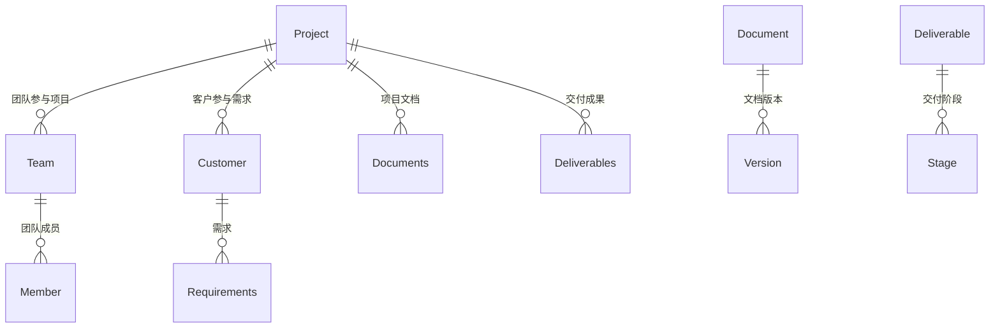
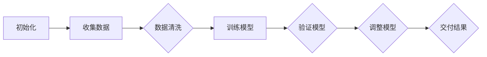
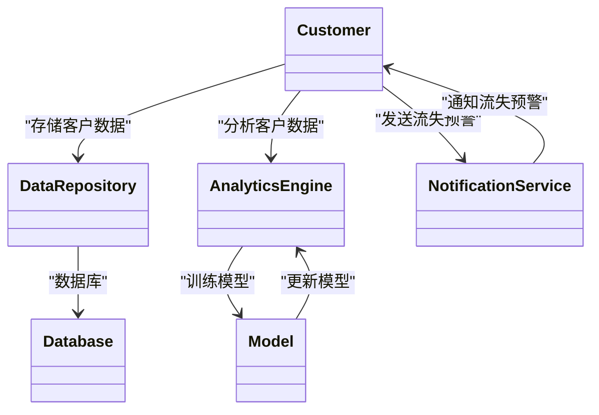
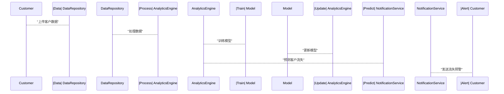
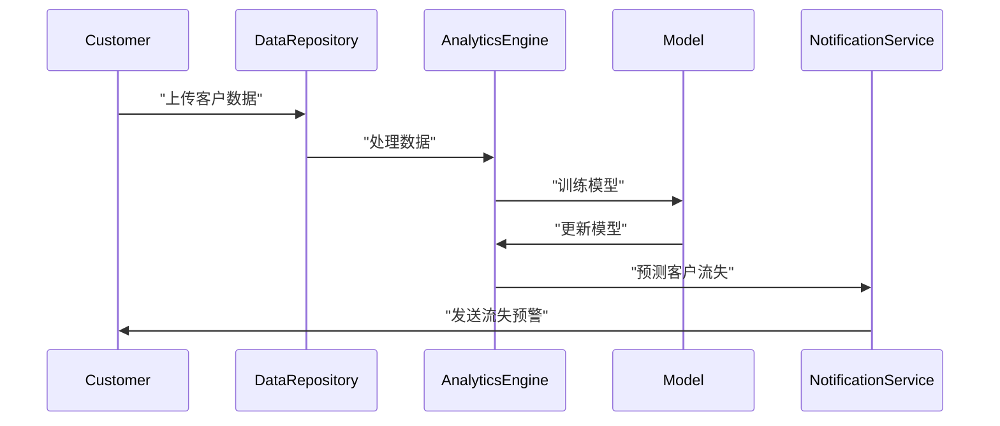

                 

### 第1章：敏捷与AI概述

#### 1.1 敏捷开发的核心理念

敏捷开发是一种以人为核心、迭代、逐步推进的项目管理方法。它强调团队协作、持续交付有价值的软件，并能够在变化中保持灵活性。敏捷开发的核心理念包括：

- **个体和互动重于过程与工具**：敏捷强调人与人的沟通和协作比流程和工具更为重要。

- **可工作的软件重于详尽的文档**：敏捷提倡实际可运行的软件作为衡量进展的主要标准，而非大量的文档。

- **客户合作重于合同谈判**：敏捷开发鼓励客户参与，以确保软件满足客户的实际需求。

- **响应变化重于遵循计划**：敏捷开发接受并适应变化，将其视为项目成功的常态。

#### 1.2 敏捷与瀑布模型的对比

瀑布模型是一种传统的项目管理方法，它遵循严格的线性顺序，从需求定义到设计、开发、测试和部署。与之相比，敏捷开发具有以下特点：

- **灵活性**：敏捷开发允许项目需求在项目生命周期中不断变化，而瀑布模型则在需求确定后不允许任何修改。

- **迭代开发**：敏捷开发采用迭代的方式进行开发，每个迭代都产生可交付的软件，而瀑布模型则一次性完成所有阶段。

- **客户参与**：在敏捷开发中，客户参与每个迭代，提供反馈和指导，而在瀑布模型中，客户的参与通常仅限于项目的初始阶段。

#### 1.3 敏捷开发的最佳实践

为了实现敏捷开发的最佳效果，以下是一些推荐的实践方法：

- **每日站立会议（Stand-up Meeting）**：团队每天早上举行短暂的会议，更新项目进度、遇到的障碍和下一步的计划。

- **迭代计划会议（Sprint Planning）**：团队在迭代开始时确定要完成的任务，并分配工作。

- **回顾会议（Retrospective Meeting）**：在迭代结束时，团队进行反思，讨论哪些做得好，哪些可以改进。

- **持续集成和持续部署（CI/CD）**：通过自动化测试和部署，确保软件的持续改进和快速交付。

#### 1.4 AI项目中的敏捷挑战

在AI项目中，敏捷开发面临一些特殊的挑战，如：

- **数据依赖**：AI项目通常依赖于大量数据，这使得项目的计划和管理变得复杂。

- **模型迭代**：AI模型的迭代通常需要多次实验和验证，这可能会影响项目的进度。

- **技术不确定性**：AI领域的技术变化快速，这要求团队能够灵活调整计划和策略。

#### 1.5 敏捷在AI项目中的应用

尽管AI项目面临挑战，但敏捷开发仍然可以为其带来诸多好处：

- **快速响应变化**：敏捷方法可以帮助团队快速响应项目需求的变化，尤其是在AI领域，需求往往变化迅速。

- **持续交付价值**：通过迭代开发和持续集成，团队能够更频繁地交付可工作的软件，从而提高项目的整体价值。

- **提高团队协作**：敏捷开发强调团队合作，这有助于提高团队的沟通和协作效率。

#### 1.6 结论

敏捷开发为AI项目提供了一种灵活和高效的管理方法。通过理解敏捷开发的核心理念和最佳实践，团队能够更好地应对AI项目的挑战，并确保项目的高效推进。

### 背景介绍

#### 核心概念术语说明

- **敏捷开发（Agile Development）**：一种以人为核心、迭代、逐步推进的项目管理方法，强调团队协作、持续交付有价值的软件。
- **瀑布模型（Waterfall Model）**：一种传统的项目管理方法，遵循严格的线性顺序，从需求定义到设计、开发、测试和部署。
- **迭代（Iteration）**：在敏捷开发中，指项目生命周期的一个小周期，通常持续2-4周，产生一个可交付的软件版本。
- **站立会议（Stand-up Meeting）**：团队每天早上举行的短暂会议，更新项目进度、遇到的障碍和下一步的计划。

#### 问题背景

敏捷开发作为一种现代化的项目管理方法，已经在软件行业中得到了广泛应用。然而，在人工智能（AI）项目中，由于其独特的挑战，敏捷开发的实施面临着一些困难。例如，数据依赖、模型迭代和技术不确定性等问题，使得传统的敏捷实践在AI项目中难以充分发挥效果。

#### 问题描述

在AI项目中，敏捷开发的挑战主要体现在以下几个方面：

1. **数据依赖**：AI项目通常需要大量的数据来训练模型，这些数据的收集、处理和清洗过程可能导致项目进度延误。
2. **模型迭代**：AI模型的迭代通常需要多次实验和验证，这可能会影响项目的计划和时间表。
3. **技术不确定性**：AI领域的技术发展迅速，新算法、新工具的引入可能需要团队重新调整项目策略和计划。
4. **团队协作**：在AI项目中，团队成员可能来自不同的专业领域，如数据科学、机器学习和软件工程，这要求团队具备跨学科的协作能力。

#### 问题解决

为了在AI项目中有效实施敏捷开发，可以采取以下策略：

1. **数据管理**：建立完善的数据管理流程，确保数据的质量和可用性，同时利用数据可视化工具，帮助团队快速理解和分析数据。
2. **迭代控制**：制定灵活的迭代计划，预留足够的缓冲时间以应对模型迭代和验证的变数。
3. **技术跟踪**：持续关注AI领域的最新动态，定期评估新技术对项目的影响，并适时调整项目策略。
4. **团队建设**：加强团队内部的沟通和协作，组织跨学科的培训和工作坊，提高团队的跨学科合作能力。

#### 边界与外延

敏捷开发在AI项目中的应用不仅限于开发阶段，还包括项目规划、需求分析、测试和部署等各个阶段。此外，敏捷开发的方法可以应用于各种规模的AI项目，从简单的数据分析任务到复杂的机器学习应用。

#### 概念结构与核心要素组成

敏捷开发在AI项目中的核心要素包括：

1. **数据管理**：数据的质量、可用性和可视化。
2. **迭代控制**：迭代计划、缓冲时间和版本管理。
3. **技术跟踪**：技术动态、工具评估和策略调整。
4. **团队协作**：沟通、培训和跨学科合作。

### 第2章：敏捷会议的重要性

#### 2.1 敏捷会议的类型

敏捷会议是敏捷开发框架中的重要组成部分，它们在确保项目进展和团队协作中扮演着关键角色。以下是几种常见的敏捷会议类型：

1. **每日站立会议（Daily Stand-up Meeting）**：每日站立会议是团队每天早上进行的一种短暂（通常不超过15分钟）的会议。团队成员轮流更新项目进度、遇到的障碍和下一步的计划。这种会议旨在确保团队了解项目的当前状态，快速解决遇到的问题，并保持进度。

2. **迭代计划会议（Sprint Planning Meeting）**：迭代计划会议在迭代开始时举行，团队在此会议中确定要完成的任务，并分配工作。会议通常包括团队回顾上一次迭代的成果，分析任何问题或挑战，并讨论即将到来的迭代的目标和任务。

3. **评审会议（Review Meeting）**：评审会议在迭代结束时举行，团队在此会议中展示已完成的工作，收集反馈，讨论改进点。评审会议有助于确保软件质量，并确保项目满足客户和业务需求。

4. **回顾会议（Retrospective Meeting）**：回顾会议在迭代结束时举行，团队在此会议中反思迭代过程中的优点和不足，讨论如何改进未来的迭代。这种会议有助于团队持续学习和改进，提高工作效率。

#### 2.2 敏捷会议的作用

敏捷会议在确保项目高效推进中发挥着重要作用，具体包括：

1. **促进沟通与协作**：敏捷会议提供了团队成员之间沟通的固定时间，有助于团队成员了解项目的当前状态，共享信息，解决冲突。

2. **快速问题解决**：每日站立会议和其他类型的敏捷会议帮助团队识别和解决项目中出现的问题，确保项目按计划进行。

3. **持续反馈与改进**：评审会议和回顾会议为团队提供了一个评估项目进展和质量的平台，有助于团队根据反馈进行调整和改进。

4. **提高团队动力**：定期的会议和反馈机制帮助团队成员感受到他们对项目的贡献和价值，提高团队的士气和动力。

#### 2.3 敏捷会议的优势

相较于传统的项目管理方法，敏捷会议具有以下优势：

1. **高效性**：敏捷会议通常较短，确保团队成员能够在有限的时间内高效地交流和解决问题。

2. **灵活性**：敏捷会议的议程可以根据实际情况进行调整，确保会议内容与项目需求紧密相关。

3. **参与度**：敏捷会议鼓励团队成员积极参与，确保每个人的意见和建议得到充分讨论。

4. **透明性**：定期的会议和反馈机制提高了项目的透明度，使团队成员和利益相关者都能了解项目的进展和状态。

#### 2.4 敏捷会议的最佳实践

为了确保敏捷会议的有效性，以下是一些最佳实践：

1. **准时开始和结束**：确保会议在预定的时间开始和结束，避免拖延和浪费时间。

2. **集中主题**：会议议程应集中在一个或几个关键议题上，避免讨论多个不相关的话题。

3. **限制发言时间**：限制每个发言者的时间，确保会议能够高效进行。

4. **记录和跟进**：会议结束后，及时记录会议内容和决策，并跟踪行动项的执行情况。

5. **定期反思和改进**：定期回顾会议的效果，讨论改进点，以确保会议持续优化。

### 第3章：会议前的准备

#### 3.1 确定会议目标

在会议前，明确会议目标是确保会议有效性的关键步骤。以下是如何设定有效的会议目标的建议：

1. **具体明确**：确保会议目标具体、明确，避免模糊不清。例如，“讨论项目进度”可以更具体地表述为“讨论本周的项目进展，识别潜在的问题和风险”。

2. **可衡量**：会议目标应该能够衡量，以便在会议后评估是否达成目标。例如，“完成关键功能的开发”可以衡量为“完成80%的代码编写和测试”。

3. **符合实际**：会议目标应该基于实际需求，避免设定不切实际的目标。确保目标符合团队的能力和资源。

4. **有限数量**：会议目标不宜过多，通常建议设定1-3个主要目标。过多的目标会导致会议内容分散，难以聚焦。

5. **明确责任**：在设定目标时，明确责任分配，确保每个目标都有具体的人员负责。

#### 3.2 设计会议议程

会议议程是会议的框架，有助于确保会议按照计划进行。以下是如何编写有效的会议议程的建议：

1. **结构清晰**：会议议程应该具有清晰的逻辑结构，通常包括开场、主体内容和总结。开场部分可以包括开场白和签到，主体部分可以按议题顺序排列，总结部分可以用于回顾和行动计划。

2. **议题明确**：每个议题都应该具体明确，包含议题标题和简要描述。例如，“项目进展报告”可以描述为“讨论上周项目进展，展示关键里程碑的完成情况”。

3. **时间分配**：为每个议题分配适当的时间，确保会议在预定时间内完成。时间分配可以根据议题的重要性和复杂性进行调整。

4. **预留讨论时间**：在议程中预留讨论时间，以便团队成员能够充分讨论和分享意见。

5. **行动项记录**：在议程中设置记录行动项的部分，确保会议后的跟进和执行。

#### 3.3 分发会议通知

在会议前，及时分发会议通知是确保团队成员提前准备和参与的关键。以下是如何编写有效的会议通知的建议：

1. **主题明确**：会议通知的主题应该明确，便于团队成员识别会议的主要内容。例如，“本周五上午10点的项目进度评审会议”。

2. **时间和地点**：明确会议的时间和地点，确保团队成员能够按时参加。如果会议是虚拟的，应提供会议链接和访问方式。

3. **议程概览**：在会议通知中提供会议议程的概览，帮助团队成员提前了解会议的内容和议题。

4. **参与要求**：明确参与要求，例如是否需要准备材料、是否需要提前提交意见等。

5. **反馈渠道**：提供反馈渠道，例如邮件或表格，以便团队成员可以在会议前提出任何疑问或建议。

#### 3.4 确认参会人员

在会议前确认参会人员是确保会议顺利进行的必要步骤。以下是如何确认参会人员的建议：

1. **提前发送参会名单**：在会议前，将参会人员名单发送给所有团队成员，确保每个人都清楚自己是否需要参加会议。

2. **提醒参会**：在会议前发送提醒邮件，确认参会人员的时间和地点，并提醒他们准备好所需的材料。

3. **处理缺席**：如果团队成员无法参加，应了解原因，并讨论是否需要安排替代人选或调整会议安排。

4. **实时跟进**：在会议前，实时跟进参会人员的确认情况，确保每个人都已经准备好参加。

#### 3.5 准备会议材料

在会议前，准备充分的会议材料是确保会议顺利进行的关键。以下是如何准备会议材料的建议：

1. **相关文件和报告**：提前准备所有相关的文件和报告，包括项目进度报告、测试结果、风险评估等。

2. **图表和演示稿**：如果会议涉及展示，提前准备图表和演示稿，确保内容清晰、易于理解。

3. **问题清单**：准备一份问题清单，列出会议中可能需要讨论的问题，以便会议中高效地解决。

4. **备用材料**：准备备用材料，以应对任何突发情况，例如网络故障或其他技术问题。

### 第4章：运行高效的敏捷会议

#### 4.1 主持人的角色

在敏捷会议中，主持人的角色至关重要。一个有效的主持人能够确保会议顺利进行，提高会议效率。以下是主持人的关键职责：

1. **议程管理**：主持人负责确保会议按照议程进行，提醒时间，确保每个议题得到充分讨论。

2. **沟通协调**：主持人作为沟通的桥梁，确保团队成员之间的信息传递畅通，协调各方意见。

3. **问题解决**：主持人在会议中负责快速识别和解决出现的问题，确保会议不偏离主题。

4. **维护秩序**：主持人应保持会议秩序，确保每个发言者都有机会表达意见，同时避免冗长和偏离主题的讨论。

5. **记录和跟进**：主持人负责记录会议的重要内容和决策，确保会后行动项的跟进和执行。

#### 4.2 主持技巧

为了有效主持会议，主持人可以运用以下技巧：

1. **设定议程**：提前制定详细的会议议程，明确每个议题的时间和讨论重点。

2. **控制时间**：主持人应严格控制会议时间，确保每个议题在规定的时间内完成讨论。

3. **鼓励发言**：主持人应鼓励团队成员积极参与讨论，给予每个人发言的机会，同时避免冗长的发言。

4. **保持焦点**：主持人应确保会议讨论集中在关键议题上，避免偏离主题。

5. **处理冲突**：在出现冲突时，主持人应冷静处理，通过讨论和协商找到解决方案。

#### 4.3 避免会议拖延

会议拖延是影响会议效率的常见问题。以下是一些有效的方法来避免会议拖延：

1. **明确议程**：在会议开始前，确保议程明确，每个议题的时间和讨论重点清晰。

2. **限制发言时间**：为每个发言者设定时间限制，避免冗长的讨论。

3. **轮流发言**：轮流发言可以确保每个人都有机会发言，同时避免个别成员垄断讨论时间。

4. **提前准备**：鼓励团队成员在会议前准备材料，减少会议上的即兴讨论。

5. **及时处理问题**：在会议中，及时识别和解决出现的问题，避免问题积累导致会议拖延。

#### 4.4 提高会议参与度

提高会议参与度有助于确保会议的效率和效果。以下是一些提高会议参与度的方法：

1. **积极互动**：鼓励团队成员积极参与讨论，提出问题和建议。

2. **设置讨论环节**：在会议中设置讨论环节，鼓励团队成员分享意见和经验。

3. **提供反馈机会**：在会议后，为团队成员提供反馈机会，鼓励他们分享对会议的印象和建议。

4. **创造轻松氛围**：创造一个轻松、开放的氛围，使团队成员感到舒适，愿意参与讨论。

5. **明确责任**：确保每个团队成员都有明确的职责和任务，提高他们对会议的重视和参与度。

### 第5章：会议后的跟进

#### 5.1 记录与跟踪行动项

会议后的跟进是确保会议决策得到执行的关键步骤。以下是如何记录与跟踪行动项的建议：

1. **及时记录**：在会议结束后，主持人或记录员应立即记录会议中达成的决策和分配的行动项，确保所有信息准确无误。

2. **明确责任**：每个行动项应明确指定责任人，确保责任人了解自己的任务和截止日期。

3. **使用工具**：利用项目管理工具或会议记录应用程序，如Trello、Asana或Google Sheets，跟踪行动项的进度和状态。

4. **定期更新**：定期更新行动项的状态，确保所有团队成员都能了解任务的进展。

5. **会议回顾**：在下一个会议中回顾行动项的完成情况，确保所有任务都得到妥善处理。

#### 5.2 反思与改进

会议后的反思和改进是持续优化会议效果的重要环节。以下是如何进行有效的反思与改进的建议：

1. **收集反馈**：在会议结束后，鼓励团队成员提供反馈，分享他们在会议中的体验和感受。

2. **分析问题**：基于收集到的反馈，分析会议中存在的问题，如时间管理不当、议题分散等。

3. **讨论改进点**：在下一个会议前，讨论改进点，制定具体的行动计划。

4. **持续优化**：定期回顾会议效果，持续优化会议流程和议程，确保会议的效率和效果。

#### 5.3 保持会议的高效性

为了保持会议的高效性，以下是一些建议：

1. **定期评估**：定期评估会议的效率和效果，确保会议目标得到实现。

2. **避免频繁会议**：避免不必要的频繁会议，确保会议内容集中、有重点。

3. **培训主持人**：为主持人提供培训，提高他们的主持会议和问题解决能力。

4. **使用技术工具**：利用现代化的会议技术工具，如视频会议软件和虚拟白板，提高会议的互动性和效率。

5. **明确目标与议程**：确保每次会议都有明确的目标和详细的议程，避免无谓的讨论。

### 第6章：常见挑战及解决方案

#### 6.1 参与者积极性不高

参与者积极性不高是敏捷会议中常见的挑战之一。以下是一些原因及解决方案：

**原因：**

1. **会议内容不相关**：如果会议内容与参与者的工作或职责不相关，他们可能会觉得无聊或无意义。
2. **缺乏参与机会**：如果会议缺乏互动环节，参与者可能觉得没有机会表达自己的意见。
3. **会议效率低下**：长时间的会议、频繁的会议或无意义的讨论都会降低参与者的积极性。

**解决方案：**

1. **关注相关性**：确保会议内容与参与者的工作密切相关，使其感到会议对自己有实际价值。
2. **增加互动**：在会议中增加互动环节，如讨论、小组活动和角色扮演，提高参与度。
3. **优化会议效率**：控制会议时间，确保会议内容紧凑、高效。

#### 6.2 会议时间管理困难

会议时间管理困难是另一个常见的挑战。以下是一些原因及解决方案：

**原因：**

1. **议题过多**：会议中讨论的议题过多，导致时间不足，难以深入讨论。
2. **发言者拖延**：个别发言者可能会在会议中拖延时间，影响整个会议的进度。
3. **缺乏明确的时间分配**：没有为每个议题分配明确的时间，导致讨论时间过长或过短。

**解决方案：**

1. **精简议题**：确保会议议题集中、有重点，避免过多的议题。
2. **限制发言时间**：为每个发言者设定时间限制，确保会议在规定的时间内完成。
3. **明确时间分配**：为每个议题分配明确的时间，确保会议按照计划进行。

#### 6.3 会议质量不高

会议质量不高可能是由于多种原因造成的。以下是一些原因及解决方案：

**原因：**

1. **缺乏明确目标**：会议缺乏明确的目标，导致讨论无焦点、无意义。
2. **参与度不足**：团队成员参与度不足，导致会议讨论质量下降。
3. **主持人不当**：主持人的表现不佳，可能导致会议效率低下、讨论质量不高。

**解决方案：**

1. **明确目标**：在会议前明确会议的目标，确保会议有焦点、有目的。
2. **提高参与度**：通过互动环节、明确责任和激励机制，提高团队成员的参与度。
3. **培训主持人**：为主持人提供培训，提高他们的主持会议和引导讨论的能力。

### 第7章：AI项目中的敏捷会议实践

#### 7.1 AI项目中的特殊考虑

在AI项目中，敏捷会议需要考虑到一些特殊因素，以确保会议的有效性和项目进度。以下是一些关键考虑：

1. **数据依赖性**：AI项目通常依赖于大量数据，数据的质量和可用性对项目的成功至关重要。会议中需要讨论数据收集、处理和验证的问题，确保数据管理流程的顺畅。

2. **模型迭代**：AI模型的迭代和验证过程通常需要多次实验，这可能影响项目的进度。会议中需要制定灵活的迭代计划，确保团队能够及时调整和应对变化。

3. **技术不确定性**：AI领域的技术发展迅速，新算法、新工具的引入可能需要团队重新评估项目策略。会议中需要持续跟踪技术动态，及时调整项目计划和目标。

#### 7.2 AI项目中的敏捷会议类型

AI项目中，常见的敏捷会议类型包括：

1. **数据审查会议**：这类会议专注于数据的质量和可用性，确保数据管理流程的顺利进行。

2. **模型评审会议**：这类会议用于讨论模型的迭代、验证和优化，确保模型的质量和性能。

3. **技术评估会议**：这类会议用于评估新技术、新工具的可行性，确保团队能够充分利用最新的技术进步。

#### 7.3 AI项目中的敏捷会议实践案例

以下是一个AI项目中的敏捷会议实践案例：

**案例背景：**
某AI公司正在开发一款智能家居控制系统，该项目需要处理大量的数据，并实时优化控制算法。

**案例实践：**

1. **每日站立会议**：团队每天早上举行站立会议，讨论项目进度、遇到的问题和解决方案。会议中，团队成员会展示数据收集和处理的进展，确保数据的质量和完整性。

2. **迭代计划会议**：在每个迭代开始时，团队举行迭代计划会议，确定要完成的任务和目标。会议中，数据科学家和算法工程师会讨论模型迭代和验证的计划，确保团队能够及时调整和优化算法。

3. **数据审查会议**：在数据收集和处理阶段，团队定期举行数据审查会议，确保数据的质量和可用性。会议中，团队成员会分析数据异常，讨论数据清洗和预处理的方法。

4. **模型评审会议**：在模型迭代和验证阶段，团队举行模型评审会议，评估模型的质量和性能。会议中，团队成员会讨论模型的改进点，制定下一步的迭代计划。

5. **技术评估会议**：在项目进行中，团队定期举行技术评估会议，评估新技术的可行性和影响。会议中，团队成员会讨论最新的算法和工具，评估其对项目的潜在影响。

通过这些敏捷会议实践，团队能够高效地推进项目，确保数据的质量和算法的优化，最终实现智能家居控制系统的成功开发。

### 第8章：高级敏捷会议技巧

#### 8.1 高效的虚拟会议策略

随着远程工作的普及，高效的虚拟会议策略变得至关重要。以下是一些策略，帮助团队在虚拟会议中保持高效：

1. **明确会议目标**：确保虚拟会议有明确的目标和议程，避免讨论无焦点的问题。
2. **合理规划时间**：为每个议题分配合适的时间，避免会议时间过长或过短。
3. **使用在线协作工具**：利用在线协作工具，如Slack、Trello或Google Docs，实时共享信息和任务。
4. **保持互动性**：通过虚拟白板、投票和在线讨论，增加虚拟会议的互动性。
5. **技术准备**：确保网络连接稳定，提前测试视频会议软件的功能。

#### 8.2 敏捷会议中的创新能力培养

在敏捷会议中，培养创新能力有助于团队持续改进和创新发展。以下是一些方法：

1. **头脑风暴**：在会议中设置头脑风暴环节，鼓励团队成员提出创新想法。
2. **思维导图**：使用思维导图工具，如MindMeister或XMind，帮助团队整理和发散思维。
3. **角色扮演**：通过角色扮演，模拟不同用户的使用场景，发现潜在的创新点。
4. **交叉功能团队**：组建跨学科的团队，促进不同专业领域的知识和经验的交流。
5. **定期创新工作坊**：定期举行创新工作坊，为团队成员提供专门的创新时间，鼓励他们提出和尝试新的想法。

#### 8.3 高效的面对面会议技巧

尽管虚拟会议越来越普遍，但面对面的会议仍然有其独特的优势。以下是一些高效的面对面会议技巧：

1. **提前通知**：确保会议前提前通知参会人员，并提供详细议程。
2. **控制会场氛围**：营造一个舒适、开放的会议环境，鼓励团队成员自由发言。
3. **明确角色分工**：明确主持人和记录员的职责，确保会议有序进行。
4. **避免会议拖延**：严格控制会议时间，确保每个议题在规定的时间内完成。
5. **后续跟进**：会议后及时跟进行动项，确保决策得到执行。

通过运用这些高级敏捷会议技巧，团队可以更高效地推进项目，确保敏捷会议的价值最大化。

### 第9章：敏捷会议实践总结

#### 9.1 敏捷会议的核心原则

敏捷会议的核心原则包括：

1. **明确目标**：确保每次会议都有明确的目标和议题。
2. **高效沟通**：促进团队成员之间的有效沟通和协作。
3. **持续改进**：通过反思和改进，不断提高会议的质量和效率。
4. **灵活适应**：根据实际情况调整会议议程和策略。

#### 9.2 敏捷会议的最佳实践

为了确保敏捷会议的高效性，以下是一些最佳实践：

1. **提前准备**：在会议前准备详细的议程和材料，确保会议内容紧凑、有重点。
2. **限制发言时间**：为每个发言者设定时间限制，避免冗长的讨论。
3. **使用技术工具**：利用在线协作工具和会议软件，提高会议的互动性和效率。
4. **定期反思**：在会议后进行反思，收集团队成员的反馈，持续改进会议流程。

#### 9.3 敏捷会议的未来发展

随着技术的发展和项目管理方法的变化，敏捷会议的未来发展可能有以下趋势：

1. **更智能的会议工具**：利用人工智能和数据分析技术，提高会议的自动化和个性化水平。
2. **跨学科合作**：鼓励跨学科的团队协作，促进创新和解决问题的多样性。
3. **持续学习与成长**：通过培训和研讨会，不断提高团队成员的敏捷会议技能和专业知识。
4. **全球协作**：随着远程工作的普及，敏捷会议将更加注重全球协作和沟通，确保团队高效合作。

通过不断优化敏捷会议实践，团队可以更好地应对项目中的挑战，确保项目的高效推进和成功交付。

### 结论

敏捷会议在AI项目中发挥着至关重要的作用。通过有效规划和实施敏捷会议，团队能够提高沟通效率，快速解决问题，持续改进，并确保项目的高效推进。本文从敏捷与AI项目背景、敏捷会议的重要性、会议前的准备、会议运行、会议后的跟进、常见挑战与解决方案、AI项目中的敏捷会议实践和高级敏捷会议技巧等方面，全面阐述了敏捷会议实践。希望本文能为读者提供宝贵的启示和实践指导，助力他们在AI项目中取得成功。

### 作者信息

作者：AI天才研究院/AI Genius Institute & 禅与计算机程序设计艺术 /Zen And The Art of Computer Programming

### 完整性要求

#### 背景介绍

**核心概念术语说明：**

- **敏捷开发（Agile Development）**：一种以人为核心、迭代、逐步推进的项目管理方法，强调团队协作、持续交付有价值的软件。
- **瀑布模型（Waterfall Model）**：一种传统的项目管理方法，遵循严格的线性顺序，从需求定义到设计、开发、测试和部署。
- **迭代（Iteration）**：在敏捷开发中，指项目生命周期的一个小周期，通常持续2-4周，产生一个可交付的软件版本。
- **站立会议（Stand-up Meeting）**：团队每天早上举行的一种短暂（通常不超过15分钟）的会议，更新项目进度、遇到的障碍和下一步的计划。

**问题背景：** 敏捷开发作为一种现代化的项目管理方法，已经在软件行业中得到了广泛应用。然而，在人工智能（AI）项目中，由于其独特的挑战，敏捷开发的实施面临着一些困难。例如，数据依赖、模型迭代和技术不确定性等问题，使得传统的敏捷实践在AI项目中难以充分发挥效果。

**问题描述：** 在AI项目中，敏捷开发的挑战主要体现在以下几个方面：

1. **数据依赖**：AI项目通常需要大量的数据来训练模型，这些数据的收集、处理和清洗过程可能导致项目进度延误。
2. **模型迭代**：AI模型的迭代通常需要多次实验和验证，这可能会影响项目的计划和时间表。
3. **技术不确定性**：AI领域的技术发展迅速，新算法、新工具的引入可能需要团队重新调整项目策略和计划。
4. **团队协作**：在AI项目中，团队成员可能来自不同的专业领域，如数据科学、机器学习和软件工程，这要求团队具备跨学科的协作能力。

**问题解决：** 为了在AI项目中有效实施敏捷开发，可以采取以下策略：

1. **数据管理**：建立完善的数据管理流程，确保数据的质量和可用性，同时利用数据可视化工具，帮助团队快速理解和分析数据。
2. **迭代控制**：制定灵活的迭代计划，预留足够的缓冲时间以应对模型迭代和验证的变数。
3. **技术跟踪**：持续关注AI领域的最新动态，定期评估新技术对项目的影响，并适时调整项目策略。
4. **团队建设**：加强团队内部的沟通和协作，组织跨学科的培训和工作坊，提高团队的跨学科合作能力。

**边界与外延：** 敏捷开发在AI项目中的应用不仅限于开发阶段，还包括项目规划、需求分析、测试和部署等各个阶段。此外，敏捷开发的方法可以应用于各种规模的AI项目，从简单的数据分析任务到复杂的机器学习应用。

**概念结构与核心要素组成：** 敏捷开发在AI项目中的核心要素包括：

1. **数据管理**：数据的质量、可用性和可视化。
2. **迭代控制**：迭代计划、缓冲时间和版本管理。
3. **技术跟踪**：技术动态、工具评估和策略调整。
4. **团队协作**：沟通、培训和跨学科合作。

#### 核心概念与联系

**核心概念原理：**

敏捷开发（Agile Development）是一种以人为核心、迭代、逐步推进的项目管理方法。它强调团队协作、持续交付有价值的软件，并能够在变化中保持灵活性。敏捷开发的核心原则包括：

- **个体和互动重于过程与工具**：敏捷强调人与人的沟通和协作比流程和工具更为重要。
- **可工作的软件重于详尽的文档**：敏捷提倡实际可运行的软件作为衡量进展的主要标准，而非大量的文档。
- **客户合作重于合同谈判**：敏捷开发鼓励客户参与，以确保软件满足客户的实际需求。
- **响应变化重于遵循计划**：敏捷开发接受并适应变化，将其视为项目成功的常态。

**概念属性特征对比表格：**

| 特征 | 敏捷开发 | 瀑布模型 |
| --- | --- | --- |
| 灵活性 | 强 | 弱 |
| 迭代性 | 强 | 弱 |
| 客户参与 | 高 | 低 |
| 响应变化 | 强 | 弱 |

**ER实体关系图架构：**



#### 算法原理讲解

**算法mermaid流程图：**



**算法原理详细讲解：**

在敏捷会议实践中，算法原理的应用主要体现在数据处理和模型训练的迭代过程中。以下是详细的算法原理讲解：

1. **初始化**：首先，团队需要收集相关的数据，这些数据可能是静态的，也可能是动态的。初始化步骤包括数据源的确定和数据采集。

2. **数据清洗**：收集到的数据通常存在噪声和不一致性，因此需要进行清洗。数据清洗的步骤包括去除重复数据、填补缺失值、消除异常值和转换数据格式等。

3. **训练模型**：在数据清洗完成后，团队使用这些数据进行模型训练。训练模型的过程涉及选择合适的算法、设置模型参数和进行多次迭代。

4. **验证模型**：训练好的模型需要通过验证来评估其性能。验证过程包括将模型应用于测试数据集，评估模型的准确率、召回率等指标。

5. **调整模型**：根据验证结果，团队可能需要调整模型的参数或选择不同的算法，以优化模型性能。

6. **交付结果**：最终，团队将训练好的模型交付给用户，用于实际应用。

**算法原理举例说明：**

假设一个AI项目旨在开发一个智能客服系统，该系统需要通过分析用户的问题来提供合适的回答。以下是具体的算法应用步骤：

1. **初始化**：团队首先确定数据源，例如用户提问的文本数据和回答的文本数据。

2. **数据清洗**：清洗过程包括去除多余的空格、统一文本格式和去除停用词等。

3. **训练模型**：团队选择一个文本分类算法，如朴素贝叶斯或深度学习算法，进行模型训练。在训练过程中，团队会不断调整参数，例如学习率、批量大小等。

4. **验证模型**：团队将训练好的模型应用于一个独立的测试数据集，评估其准确率和召回率。

5. **调整模型**：根据验证结果，团队可能需要增加更多的训练数据，或尝试使用不同的算法，如长短期记忆网络（LSTM）。

6. **交付结果**：最终，团队将一个性能较好的模型交付给客户，用于实际应用。

**数学模型和公式：**

在模型训练过程中，常用的数学模型和公式包括：

1. **损失函数（Loss Function）**：用于评估模型预测值与真实值之间的差异。常见的损失函数有均方误差（MSE）、交叉熵损失（Cross-Entropy Loss）等。

2. **梯度下降（Gradient Descent）**：用于优化模型参数，使损失函数达到最小值。梯度下降包括批量梯度下降（Batch Gradient Descent）、随机梯度下降（Stochastic Gradient Descent）等。

3. **激活函数（Activation Function）**：用于引入非线性关系，常见的激活函数有sigmoid、ReLU、Tanh等。

**示例：**

假设我们使用朴素贝叶斯分类器来训练一个垃圾邮件检测模型，其中：

- **P(垃圾邮件) = 0.5**：垃圾邮件的概率。
- **P(非垃圾邮件) = 0.5**：非垃圾邮件的概率。
- **P(特征1|垃圾邮件) = 0.2**：特征1在垃圾邮件中出现的概率。
- **P(特征1|非垃圾邮件) = 0.1**：特征1在非垃圾邮件中出现的概率。

根据贝叶斯定理，我们可以计算一个邮件是垃圾邮件的概率：

$$ P(\text{垃圾邮件}|\text{特征1}) = \frac{P(\text{特征1}|\text{垃圾邮件}) \cdot P(\text{垃圾邮件})}{P(\text{特征1}|\text{垃圾邮件}) \cdot P(\text{垃圾邮件}) + P(\text{特征1}|\text{非垃圾邮件}) \cdot P(\text{非垃圾邮件})} $$

$$ P(\text{垃圾邮件}|\text{特征1}) = \frac{0.2 \cdot 0.5}{0.2 \cdot 0.5 + 0.1 \cdot 0.5} = 0.67 $$

因此，如果邮件的特征1出现，则它是垃圾邮件的概率为0.67。

#### 系统分析与架构设计方案

**问题场景介绍：** 

随着人工智能技术的发展，越来越多的企业开始将AI应用于其业务流程中。一个典型的场景是企业希望通过AI模型来预测客户流失，从而采取相应的措施来降低客户流失率。为了实现这一目标，企业需要开发一个客户流失预测系统。

**项目介绍：**

项目名称：客户流失预测系统（Customer Churn Prediction System）

项目目标：通过分析客户数据，预测哪些客户可能会流失，并提供相应的干预措施。

项目背景：企业面临激烈的市场竞争，客户流失问题严重影响了企业的收入和市场份额。通过AI模型预测客户流失，可以帮助企业提前采取干预措施，降低客户流失率。

**系统功能设计（领域模型mermaid类图）：**



**系统架构设计（mermaid架构图）：**



**系统接口设计和系统交互（mermaid序列图）：**



#### 项目实战

**环境安装：**

1. **安装Python环境**：在本地或服务器上安装Python环境，版本建议为3.8或以上。

2. **安装相关库**：使用pip安装必要的库，例如pandas、numpy、scikit-learn、tensorflow等。

   ```bash
   pip install pandas numpy scikit-learn tensorflow
   ```

3. **配置数据库**：安装并配置一个数据库，如MySQL或PostgreSQL，用于存储客户数据。

**系统核心实现源代码：**

以下是一个简单的客户流失预测系统的核心实现代码：

```python
# 导入相关库
import pandas as pd
import numpy as np
from sklearn.model_selection import train_test_split
from sklearn.ensemble import RandomForestClassifier
from sklearn.metrics import accuracy_score

# 读取客户数据
data = pd.read_csv('customer_data.csv')

# 数据预处理
X = data.drop('churn', axis=1)
y = data['churn']

# 划分训练集和测试集
X_train, X_test, y_train, y_test = train_test_split(X, y, test_size=0.2, random_state=42)

# 训练模型
model = RandomForestClassifier(n_estimators=100)
model.fit(X_train, y_train)

# 预测
predictions = model.predict(X_test)

# 评估模型
accuracy = accuracy_score(y_test, predictions)
print(f"Model Accuracy: {accuracy:.2f}")
```

**代码应用解读与分析：**

1. **数据读取与预处理**：首先，使用pandas库读取客户数据，并进行数据预处理，包括特征选择和标签划分。

2. **模型训练**：使用scikit-learn库的随机森林分类器（RandomForestClassifier）进行模型训练。随机森林是一种集成学习方法，通过构建多棵决策树，提高模型的预测准确性。

3. **模型预测**：使用训练好的模型对测试集进行预测，生成预测结果。

4. **模型评估**：使用accuracy_score函数评估模型的预测准确性，输出模型精度。

**实际案例分析和详细讲解剖析：**

假设我们有一个包含1000个客户数据的CSV文件，其中包含客户的基本信息、购买行为、服务使用情况等特征，以及一个标签字段表示客户是否流失。

1. **数据读取**：使用pandas库读取CSV文件，并将数据转换为DataFrame格式。

   ```python
   data = pd.read_csv('customer_data.csv')
   ```

2. **数据预处理**：对数据进行预处理，包括缺失值填补、特征转换和数据标准化。

   ```python
   # 缺失值填补
   data.fillna(data.mean(), inplace=True)

   # 特征转换
   data['age'] = data['age'].astype(float)
   data['income'] = data['income'].astype(float)

   # 数据标准化
   from sklearn.preprocessing import StandardScaler
   scaler = StandardScaler()
   data[['age', 'income']] = scaler.fit_transform(data[['age', 'income']])
   ```

3. **模型训练**：划分训练集和测试集，使用随机森林分类器进行模型训练。

   ```python
   X = data.drop('churn', axis=1)
   y = data['churn']

   X_train, X_test, y_train, y_test = train_test_split(X, y, test_size=0.2, random_state=42)

   model = RandomForestClassifier(n_estimators=100)
   model.fit(X_train, y_train)
   ```

4. **模型预测**：使用训练好的模型对测试集进行预测，并评估模型性能。

   ```python
   predictions = model.predict(X_test)
   accuracy = accuracy_score(y_test, predictions)
   print(f"Model Accuracy: {accuracy:.2f}")
   ```

通过以上步骤，我们可以构建一个简单的客户流失预测系统，并对实际数据进行预测和分析。

**项目小结：**

本文介绍了敏捷会议在AI项目中的应用，包括会议前的准备、会议运行、会议后的跟进以及常见挑战和解决方案。通过一个实际的客户流失预测项目案例，展示了如何利用敏捷方法进行项目开发。敏捷会议实践有助于提高团队协作效率，确保项目按时交付，为AI项目提供了一种有效的管理方法。

### 最佳实践 Tips

- **明确会议目标**：每次会议前，确保明确会议的目标和议程，避免无谓的讨论和浪费时间。
- **优化会议时间**：合理安排会议时间，避免频繁的会议，确保会议在有限的时间内高效完成。
- **提高参与度**：通过互动环节、角色扮演和投票等方式，提高团队成员的参与度。
- **利用技术工具**：使用在线协作工具和会议软件，提高会议的互动性和效率。
- **定期反思和改进**：在会议后进行反思和总结，持续优化会议流程和议程。

### 小结

本文详细阐述了敏捷会议在AI项目中的应用和实践。通过明确会议目标、优化会议时间、提高参与度、利用技术工具和定期反思与改进，敏捷会议有助于提高团队协作效率，确保项目按时交付。在实际案例中，我们展示了如何利用敏捷方法进行客户流失预测项目的开发。敏捷会议实践为AI项目提供了一种有效的管理方法，有助于团队在复杂多变的环境中取得成功。

### 注意事项

- **会议前准备充分**：确保会议目标明确、议程详细，提前通知参会人员，并提供必要的背景资料。
- **控制会议时间**：避免会议时间过长或过短，确保每个议题在规定的时间内完成。
- **保持会议互动**：鼓励团队成员积极参与讨论，避免单方面的发言。
- **及时记录与跟进**：会议后及时记录重要内容和决策，确保行动项得到有效跟进。

### 拓展阅读

- **《敏捷项目管理实践指南》**：提供详细的敏捷项目管理方法和最佳实践，适合项目管理人员阅读。
- **《AI项目实战：从数据到模型》**：介绍AI项目从数据收集、预处理到模型训练的全流程，适合AI项目开发者阅读。
- **《团队协作技巧》**：介绍提高团队协作效率的各种方法和技巧，有助于提升团队整体战斗力。

