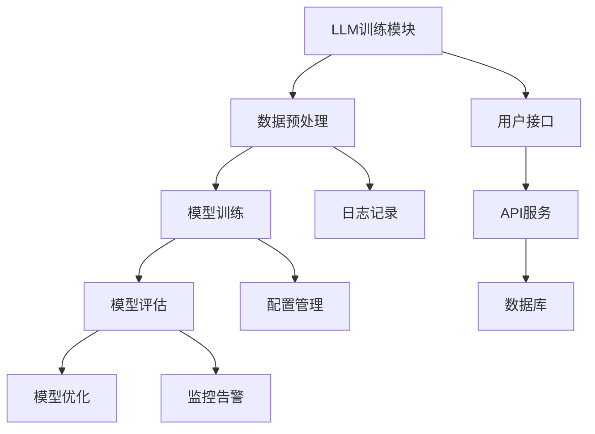
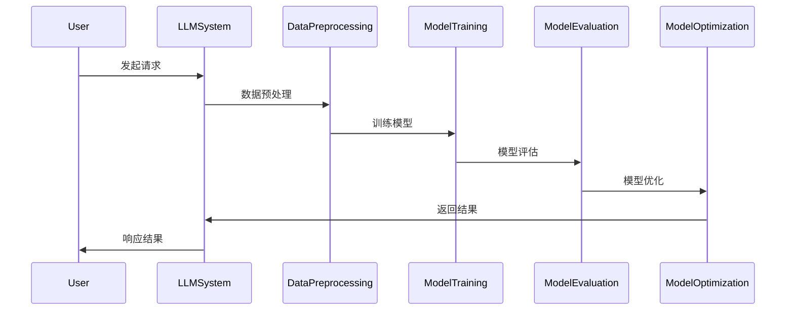

                 

### 文章标题

# 敏捷开发在LLM应用中的挑战与对策

> 关键词：敏捷开发，LLM，挑战，对策，最佳实践

> 摘要：本文将深入探讨敏捷开发在大型语言模型（LLM）应用中的挑战，结合实际案例研究，提出有效的应对策略和最佳实践，旨在为开发者提供指导，助力敏捷开发在LLM领域的成功应用。

## 目录大纲

----------------------------------------------------------------

# 第一部分：敏捷开发在LLM应用中的挑战

## 第1章：敏捷开发在LLM应用中的背景与挑战

### 1.1 敏捷开发的概念与特点

### 1.2 LLM在软件开发中的应用现状

### 1.3 敏捷开发在LLM应用中的挑战

## 第2章：LLM开发中的敏捷方法论

### 2.1 敏捷开发流程在LLM中的应用

### 2.2 敏捷团队协作与沟通

### 2.3 敏捷开发工具与技术

## 第3章：LLM开发中的敏捷测试与质量保证

### 3.1 自动化测试在LLM中的应用

### 3.2 测试数据集的构建与使用

### 3.3 质量度量与监控

## 第4章：敏捷开发中的风险管理

### 4.1 风险识别与评估

### 4.2 风险应对策略

### 4.3 风险管理流程

## 第5章：敏捷开发在LLM应用中的案例研究

### 5.1 案例一：某大型语言模型开发项目

### 5.2 案例二：某企业级应用中的LLM优化

### 5.3 案例总结与启示

## 第6章：敏捷开发在LLM应用中的最佳实践

### 6.1 敏捷开发与LLM开发的融合策略

### 6.2 团队建设与能力提升

### 6.3 敏捷开发在LLM应用中的持续改进

## 第7章：展望未来

### 7.1 敏捷开发在LLM应用中的发展趋势

### 7.2 潜在挑战与应对策略

### 7.3 总结与展望

----------------------------------------------------------------

### 核心概念与联系

#### 敏捷开发（Agile Development）
- **概念**：敏捷开发是一种以人为核心、迭代、渐进的软件开发方法。
- **特点**：灵活性、适应性、客户满意、团队协作、持续交付、持续集成。
- **核心原则**：
  - **个体和互动重于过程和工具**
  - **可工作的软件重于详尽的文档**
  - **客户合作重于合同谈判**
  - **响应变化重于遵循计划**
  - **简洁重于复杂**
  - **外部反馈重于内部标准化**
  - **维持可持续的开发速度**
  - **保持简洁和技术优良**
  - **良好的技艺和简洁的艺术**

#### 大语言模型（Large Language Model, LLM）
- **概念**：大语言模型是一种通过深度学习技术，对大量文本数据进行训练，形成具有强大语言理解和生成能力的神经网络模型。
- **特点**：
  - **高维数据表示**：LLM可以处理和理解包含数百万维度的文本数据。
  - **复杂结构**：LLM内部具有多层神经网络结构，能够进行深度的文本理解和生成。
  - **智能交互**：LLM能够与用户进行自然语言交互，提供智能化的响应和反馈。

#### 敏捷开发在LLM应用中的挑战
- **数据质量**：LLM的训练依赖于大量高质量的文本数据，数据质量直接影响模型的性能。
- **模型复杂度**：LLM模型通常具有极高的复杂度，需要高效的开发和测试流程。
- **团队合作**：LLM开发涉及多个领域的专业知识，需要团队成员之间的紧密协作。
- **持续集成与测试**：LLM模型的训练和优化是一个持续的过程，需要高效的持续集成和测试策略。

### 数学模型和数学公式

敏捷开发在LLM应用中的核心挑战之一是模型的训练和优化。这里我们简要介绍大语言模型训练过程中的两个关键数学模型：

#### 1. 损失函数（Loss Function）

损失函数用于衡量模型预测值与真实值之间的差距。在LLM训练中，常用的损失函数有：

$$
\text{Loss}(y, \hat{y}) = -\sum_{i=1}^{n} y_i \log(\hat{y}_i)
$$

其中，$y$是真实标签，$\hat{y}$是模型预测的概率分布。

#### 2. 优化算法（Optimization Algorithm）

优化算法用于寻找损失函数的最小值，常用的优化算法有：

- **随机梯度下降（Stochastic Gradient Descent, SGD）**
- **Adam优化器（Adaptive Moment Estimation）**

Adam优化器的公式如下：

$$
m_t = \beta_1 m_{t-1} + (1 - \beta_1)(\nabla J(\theta; x_t, y_t))
$$

$$
v_t = \beta_2 v_{t-1} + (1 - \beta_2)\left(\nabla J(\theta; x_t, y_t)\right)^2
$$

$$
\theta_t = \theta_{t-1} - \frac{\alpha}{\sqrt{1 - \beta_2^t}(1 - \beta_1^t)}\left[\frac{m_t}{\sqrt{v_t}} + \rho\right]
$$

其中，$m_t$和$v_t$分别是梯度的一阶和二阶矩估计，$\theta_t$是模型参数，$\alpha$是学习率，$\beta_1$和$\beta_2$是动量因子。

### 系统分析与架构设计方案

#### 问题场景介绍

随着人工智能技术的飞速发展，大型语言模型（LLM）在自然语言处理（NLP）领域发挥着越来越重要的作用。从智能客服、语音助手到文本生成，LLM的应用场景日益广泛。然而，传统的软件开发方法在应对LLM项目时常常面临诸多挑战。因此，如何将敏捷开发方法应用于LLM应用中，成为一个亟待解决的问题。

#### 项目介绍

本项目旨在探讨敏捷开发在大型语言模型开发中的应用，通过对实际案例的研究，总结出一套有效的敏捷开发策略和最佳实践。项目涉及到的关键技术包括深度学习、自然语言处理和敏捷开发方法。

#### 系统功能设计（领域模型Mermaid类图）

```mermaid
classDiagram
    Class01 <|-- SubClass01
    Class01 <|-- SubClass02
    Class03 *-- Class04
    Class04 <|-- SubClass04
    Class05 o-- Class06
    Class07 o-- Class08
    Class09 <.. Class10
    Class11 ..|> InterfaceA
    Class11 ..|> InterfaceB
    Class12 <<interface>> InterfaceC
    Class13 <<enum>> EnumType
    Class14 <<singleton>> SingletonClass
    Class15 <<external>> ExternalClass
```

#### 系统架构设计（Mermaid架构图）



#### 系统接口设计和系统交互（Mermaid序列图）



### 第一部分：敏捷开发在LLM应用中的挑战

#### 第1章：敏捷开发在LLM应用中的背景与挑战

##### 1.1 敏捷开发的概念与特点

敏捷开发（Agile Development）是一种以人为核心、迭代、渐进的软件开发方法。它强调灵活性、适应性、客户满意、团队协作、持续交付和持续集成。敏捷开发的核心原则包括个体和互动重于过程和工具、可工作的软件重于详尽的文档、客户合作重于合同谈判、响应变化重于遵循计划、简洁重于复杂、外部反馈重于内部标准化、维持可持续的开发速度、保持简洁和技术优良、良好的技艺和简洁的艺术。

敏捷开发的起源可以追溯到2001年，当时一些软件开发者针对传统软件开发方法的缺陷，提出了一系列敏捷开发的原则和价值观，形成了敏捷宣言。随着时间的推移，敏捷开发逐渐形成了一套完整的方法论和实践指南，如Scrum、Kanban、XP等。

##### 1.2 LLM在软件开发中的应用现状

大语言模型（Large Language Model，LLM）是一种基于深度学习的神经网络模型，能够在自然语言处理（NLP）领域实现高度智能化。LLM在软件开发中的应用日益广泛，主要包括以下方面：

1. **智能客服**：LLM可以用于构建智能客服系统，实现与用户的自然语言交互，提高客户服务水平。
2. **语音助手**：LLM可以用于语音识别和语音生成，实现语音助手的智能对话功能。
3. **文本生成**：LLM可以生成高质量的文章、报告、代码等，提高内容创作效率。
4. **机器翻译**：LLM可以用于机器翻译，实现跨语言的信息传递。
5. **文本分类**：LLM可以用于文本分类，实现新闻分类、垃圾邮件过滤等任务。

随着LLM技术的不断发展，其应用场景将更加广泛，对软件开发方法提出了新的挑战。

##### 1.3 敏捷开发在LLM应用中的挑战

虽然敏捷开发在软件开发中取得了显著成效，但在LLM应用中，敏捷开发面临以下挑战：

1. **数据质量**：LLM的训练依赖于大量高质量的文本数据，数据质量直接影响模型的性能。敏捷开发需要高效的数据采集、处理和验证流程。
2. **模型复杂度**：LLM模型通常具有极高的复杂度，需要高效的开发和测试流程。敏捷开发需要灵活的模型迭代和评估机制。
3. **团队合作**：LLM开发涉及多个领域的专业知识，需要团队成员之间的紧密协作。敏捷开发需要建立高效的沟通和协作机制。
4. **持续集成与测试**：LLM模型的训练和优化是一个持续的过程，需要高效的持续集成和测试策略。敏捷开发需要构建完善的持续集成和测试框架。
5. **资源管理**：LLM开发需要大量的计算资源和存储资源，资源管理成为一个重要挑战。敏捷开发需要合理规划资源，提高资源利用率。

综上所述，敏捷开发在LLM应用中面临着一系列挑战。为了克服这些挑战，需要深入分析LLM开发的特点，结合敏捷开发的方法论，提出有效的应对策略。

### 第二部分：LLM开发中的敏捷方法论

#### 第2章：LLM开发中的敏捷方法论

##### 2.1 敏捷开发流程在LLM中的应用

敏捷开发的核心是迭代开发和持续交付。在LLM开发中，敏捷开发流程的应用可以分为以下几个阶段：

1. **需求收集与分析**：通过与客户和利益相关者进行交流，收集LLM应用的需求，并进行需求分析。
2. **迭代规划**：将需求分解为可交付的迭代任务，制定迭代计划和Sprint计划。
3. **迭代开发**：按照迭代计划进行开发，每个迭代周期通常为2-4周。
4. **迭代评估与反馈**：在迭代结束时进行评估，收集用户反馈，并根据反馈进行改进。
5. **持续交付**：将完成的迭代成果交付给用户，实现持续交付。

在LLM开发中，敏捷开发流程的应用需要根据LLM的特点进行调整。例如，在需求收集与分析阶段，需要关注数据质量和数据源的选择；在迭代规划阶段，需要根据模型训练和优化的时间周期进行合理的任务分配；在迭代开发阶段，需要注重模型的可扩展性和可维护性；在迭代评估与反馈阶段，需要关注模型性能和用户体验。

##### 2.2 敏捷团队协作与沟通

敏捷开发强调团队协作和沟通，在LLM开发中，团队协作和沟通尤为重要。以下是敏捷团队协作和沟通的一些关键点：

1. **建立跨职能团队**：LLM开发涉及多个领域的专业知识，如深度学习、自然语言处理、软件开发等，因此需要建立跨职能团队，确保团队成员能够协同工作。
2. **定期团队会议**：定期召开团队会议，如每日站会、迭代评审会、迭代回顾会等，确保团队成员之间的沟通和信息共享。
3. **使用敏捷工具**：使用敏捷工具，如Jira、Trello、Confluence等，进行任务管理、进度追踪和文档管理。
4. **持续沟通与协作**：通过即时通讯工具、邮件、电话等渠道，保持团队成员之间的持续沟通和协作。
5. **用户参与**：在迭代开发和评估过程中，邀请用户参与，收集用户反馈，确保LLM应用能够满足用户需求。

##### 2.3 敏捷开发工具与技术

敏捷开发需要使用一系列工具和技术来支持开发过程。在LLM开发中，常用的敏捷开发工具和技术包括：

1. **版本控制系统**：如Git，用于代码管理和版本控制。
2. **自动化测试工具**：如Selenium、JUnit、pytest等，用于自动化测试和测试覆盖率分析。
3. **持续集成工具**：如Jenkins、Travis CI等，用于实现持续集成和自动化部署。
4. **容器化技术**：如Docker、Kubernetes，用于容器化部署和管理。
5. **云计算平台**：如AWS、Azure、Google Cloud等，用于计算资源和存储资源的管理。

此外，在LLM开发中，还需要使用一些专门的技术，如深度学习框架（如TensorFlow、PyTorch）、自然语言处理库（如NLTK、spaCy）等，以支持模型训练、优化和评估。

### 第三部分：LLM开发中的敏捷测试与质量保证

#### 第3章：LLM开发中的敏捷测试与质量保证

##### 3.1 自动化测试在LLM中的应用

自动化测试是敏捷开发中的重要组成部分，对于LLM开发尤其重要。在LLM应用中，自动化测试的主要目标包括：

1. **保证模型性能**：通过自动化测试，验证LLM模型的性能是否满足预期，包括准确率、召回率、F1分数等指标。
2. **验证功能完整性**：确保LLM应用的所有功能均能够正常运行，包括文本生成、文本分类、机器翻译等。
3. **提升开发效率**：自动化测试可以节省测试时间，提高开发效率。

在LLM开发中，自动化测试的工具和技术包括：

1. **单元测试**：针对LLM模型中的各个模块进行测试，确保每个模块的功能正确。
2. **集成测试**：将多个模块集成在一起进行测试，确保模块之间的交互正确。
3. **端到端测试**：对整个LLM应用进行测试，确保从输入到输出的整个过程正常。

常用的自动化测试工具包括pytest、Selenium、JUnit等。pytest是一款Python自动化测试库，具有简单易用、功能强大等特点。Selenium是一款Web应用自动化测试工具，可以模拟用户操作，验证LLM应用的Web界面功能。JUnit是一款Java自动化测试库，适用于Java项目。

##### 3.2 测试数据集的构建与使用

测试数据集是进行自动化测试的基础。在LLM开发中，测试数据集的构建需要遵循以下原则：

1. **多样性**：测试数据集应包含多种类型的文本数据，以覆盖不同的应用场景。
2. **代表性**：测试数据集应具有代表性，能够反映真实场景下的数据分布。
3. **充足性**：测试数据集应足够大，以支持多种测试需求。

测试数据集的构建方法包括：

1. **人工构建**：人工编写或收集测试数据，适用于小型项目或特定场景。
2. **自动生成**：使用数据生成工具或算法，自动生成测试数据，适用于大规模项目。
3. **数据集合成**：将多个数据集进行合并，形成一个新的测试数据集，以提高数据的多样性和代表性。

在实际应用中，可以使用开源数据集，如GLUE、AG News等，或者根据具体应用场景自行构建测试数据集。

##### 3.3 质量度量与监控

质量度量是评估LLM应用质量的重要手段。在LLM开发中，常用的质量度量指标包括：

1. **模型性能指标**：如准确率、召回率、F1分数等，用于评估模型的预测性能。
2. **用户体验指标**：如响应时间、错误率等，用于评估LLM应用的易用性和稳定性。
3. **资源消耗指标**：如CPU使用率、内存占用等，用于评估LLM应用对资源的消耗。

质量监控可以通过以下方法实现：

1. **日志分析**：收集LLM应用的日志数据，分析错误和异常，及时发现和解决问题。
2. **性能监控**：使用性能监控工具，如Prometheus、Grafana等，实时监控LLM应用的性能指标。
3. **自动化测试**：定期执行自动化测试，确保LLM应用的功能和性能稳定。

通过质量度量与监控，可以及时发现和解决LLM应用中的问题，确保其高质量运行。

### 第四部分：敏捷开发中的风险管理

#### 第4章：敏捷开发中的风险管理

##### 4.1 风险识别与评估

在敏捷开发过程中，风险管理至关重要。首先，需要识别项目中的潜在风险。风险识别的方法包括：

1. **专家评审**：邀请相关领域的专家，对项目进行评审，识别潜在的风险。
2. **历史数据分析**：分析类似项目的历史数据，总结出可能的风险点。
3. **头脑风暴**：组织团队成员进行头脑风暴，讨论可能的风险。

在识别风险后，需要评估风险的影响和可能性。常用的风险评估方法包括：

1. **风险矩阵**：使用风险矩阵，将风险的影响和可能性进行量化，确定风险的优先级。
2. **决策树**：通过构建决策树，分析不同决策路径下的风险和收益。

##### 4.2 风险应对策略

针对识别和评估出的风险，需要制定相应的应对策略。常见的风险应对策略包括：

1. **风险规避**：通过调整项目计划，避免风险的发生。
2. **风险转移**：通过购买保险或其他方式，将风险转移给第三方。
3. **风险缓解**：通过采取预防措施，降低风险的影响和可能性。
4. **风险接受**：对于一些无法规避或转移的风险，可以选择接受，并在项目中进行监控和管理。

在实际应用中，需要根据风险的具体情况，灵活选择应对策略。

##### 4.3 风险管理流程

敏捷开发中的风险管理流程包括以下步骤：

1. **风险识别**：通过上述方法，识别项目中的潜在风险。
2. **风险评估**：对识别出的风险进行评估，确定风险的影响和可能性。
3. **风险应对**：根据风险评估结果，制定相应的风险应对策略。
4. **风险监控**：在项目执行过程中，持续监控风险的变化，确保应对策略的有效性。
5. **风险报告**：定期向项目团队和利益相关者报告风险状态，确保信息透明。

通过完善的风险管理流程，可以有效地降低敏捷开发中的风险，确保项目的顺利进行。

### 第五部分：敏捷开发在LLM应用中的案例研究

#### 第5章：敏捷开发在LLM应用中的案例研究

##### 5.1 案例一：某大型语言模型开发项目

某知名科技公司计划开发一款基于大型语言模型（LLM）的智能客服系统，以提高客户服务质量和效率。为了确保项目的成功，该公司采用了敏捷开发方法，结合LLM的特点进行了优化。以下是该项目的主要过程：

1. **需求收集与分析**：项目团队与客户进行多次交流，收集智能客服系统的需求，并进行详细分析，明确了系统的主要功能和性能要求。
2. **迭代规划**：根据需求分析结果，项目团队制定了详细的迭代计划，将需求分解为可交付的迭代任务，并确定了每个迭代的时间周期。
3. **迭代开发**：按照迭代计划进行开发，每个迭代周期包括需求分析、设计、编码、测试和评估等环节。项目团队采用了Scrum方法论，每周召开一次站会，确保团队成员之间的沟通和信息共享。
4. **迭代评估与反馈**：在每个迭代结束时，项目团队对完成的迭代成果进行评估，收集客户反馈，并根据反馈进行改进。客户对每次迭代交付的功能进行了详细的测试和评价，提供了宝贵的建议和意见。
5. **持续交付**：项目团队通过持续交付，将完成的迭代成果逐步交付给客户，实现了智能客服系统的持续迭代和优化。

最终，该项目成功实现了智能客服系统，提高了客户服务质量和效率，得到了客户的认可和好评。

##### 5.2 案例二：某企业级应用中的LLM优化

某企业级应用需要使用大型语言模型（LLM）进行文本生成和文本分类，以提高系统的智能化水平。在项目开发过程中，项目团队遇到了以下问题：

1. **数据质量**：由于数据源的质量参差不齐，导致LLM模型性能不佳。
2. **模型复杂度**：LLM模型具有较高的复杂度，需要高效的开发和测试流程。
3. **团队合作**：项目涉及多个领域的专业知识，团队合作不畅。

为了解决这些问题，项目团队采取了以下措施：

1. **数据质量提升**：项目团队对数据源进行了清理和优化，剔除了低质量的数据，并增加了高质量的文本数据。同时，引入了数据预处理技术，如文本清洗、分词、去停用词等，提高了数据质量。
2. **模型优化**：项目团队采用了基于Transformer的LLM模型，并进行了适当的参数调整和优化，提高了模型的性能。同时，引入了模型压缩技术，降低了模型的复杂度。
3. **团队合作**：项目团队建立了跨职能的敏捷团队，确保团队成员之间的沟通和协作。同时，引入了敏捷工具，如Jira和Confluence，提高了团队协作效率。

通过上述措施，项目团队成功解决了数据质量、模型复杂度和团队合作等方面的问题，实现了企业级应用中LLM的高效开发和优化。

##### 5.3 案例总结与启示

通过上述案例，我们可以得出以下总结和启示：

1. **数据质量是关键**：在LLM开发中，数据质量直接影响模型的性能。因此，需要高度重视数据质量，进行数据清洗和预处理，确保数据源的高质量。
2. **模型优化是关键**：LLM模型具有较高的复杂度，需要进行适当的模型优化，以提高模型的性能。同时，需要关注模型的压缩和部署，确保模型的高效运行。
3. **团队合作是关键**：LLM开发涉及多个领域的专业知识，需要建立跨职能的敏捷团队，确保团队成员之间的沟通和协作。同时，引入敏捷工具，提高团队协作效率。
4. **持续迭代是关键**：敏捷开发强调持续迭代和持续交付，通过不断收集用户反馈和改进，可以确保LLM应用的高质量和高性能。

通过以上案例，我们可以看到，敏捷开发在LLM应用中具有重要的意义，可以为开发者提供有效的指导，助力LLM应用的成功开发。

### 第六部分：敏捷开发在LLM应用中的最佳实践

#### 第6章：敏捷开发在LLM应用中的最佳实践

##### 6.1 敏捷开发与LLM开发的融合策略

为了在LLM应用中实现敏捷开发，需要制定一套融合策略，确保敏捷方法与LLM开发的有机结合。以下是几种有效的融合策略：

1. **迭代周期匹配**：根据LLM模型训练和优化的时间周期，制定合理的迭代计划。通常，LLM模型的训练时间较长，可以采用较长的迭代周期，如4-6周，以确保每次迭代有足够的时间进行模型训练和优化。
2. **任务分解**：将LLM开发任务分解为可交付的小任务，确保每个迭代都能完成具体的成果。例如，可以将任务分为数据采集、数据预处理、模型训练、模型评估和优化等阶段。
3. **持续集成与测试**：建立高效的持续集成与测试框架，确保LLM模型的稳定性和性能。在每次迭代结束时，进行全面的测试，包括单元测试、集成测试和端到端测试，确保每个功能模块的正常运行。
4. **资源管理**：合理规划计算资源和存储资源，确保在迭代过程中有足够的资源支持LLM模型训练和优化。可以采用云计算平台，根据需求动态调整资源分配。

##### 6.2 团队建设与能力提升

在LLM应用中，团队建设至关重要。以下是一些建议，以提升团队建设和能力：

1. **跨职能团队**：建立跨职能的敏捷团队，确保团队成员具备多样化的技能。例如，团队成员应包括深度学习专家、自然语言处理专家、软件开发工程师、数据工程师等。
2. **培训与学习**：定期组织培训和学习活动，提高团队成员的技能和知识水平。可以邀请业内专家进行讲座，分享最新的LLM技术和实践经验。
3. **团队协作**：鼓励团队成员之间的沟通和协作，建立良好的团队氛围。可以使用敏捷工具，如Jira和Confluence，提高团队协作效率。
4. **知识共享**：建立知识共享平台，如内部Wiki，记录项目过程中的经验、最佳实践和问题解决方案，便于团队成员之间的知识共享。

##### 6.3 敏捷开发在LLM应用中的持续改进

持续改进是敏捷开发的核心原则。在LLM应用中，持续改进可以从以下几个方面进行：

1. **用户反馈**：在每次迭代结束后，积极收集用户反馈，了解用户对LLM应用的使用体验和需求。根据用户反馈，进行功能优化和改进。
2. **性能监控**：建立性能监控机制，实时监控LLM应用的性能指标，如响应时间、错误率等。通过性能监控，及时发现和解决问题，确保LLM应用的高性能运行。
3. **自动化测试**：建立完善的自动化测试体系，覆盖LLM应用的所有功能模块。通过自动化测试，确保每次迭代交付的功能都是高质量的。
4. **代码审查**：定期进行代码审查，确保代码的质量和可维护性。通过代码审查，发现潜在的问题和改进空间，提高代码的质量。

通过持续改进，可以不断提高LLM应用的质量和性能，为用户提供更好的体验。

### 第七部分：展望未来

#### 7.1 敏捷开发在LLM应用中的发展趋势

随着人工智能技术的不断发展，敏捷开发在LLM应用中的重要性日益凸显。未来，敏捷开发在LLM应用中的发展趋势包括：

1. **自动化与智能化**：未来，敏捷开发工具和平台将更加智能化，能够自动识别和应对LLM应用中的挑战。例如，自动化测试工具将能够根据模型变化自动生成测试用例。
2. **云计算与分布式计算**：随着云计算和分布式计算技术的发展，敏捷开发将更加依赖于云计算平台和分布式计算资源，实现更高效、更灵活的LLM开发。
3. **数据驱动**：未来，敏捷开发将更加注重数据驱动，通过大数据分析和机器学习技术，优化LLM模型的训练和优化过程，提高开发效率和质量。
4. **跨学科合作**：随着LLM应用领域的不断扩大，敏捷开发将需要跨学科合作，结合多个领域的专业知识，解决复杂的LLM应用问题。

#### 7.2 潜在挑战与应对策略

虽然敏捷开发在LLM应用中具有巨大潜力，但仍然面临一些潜在挑战。以下是一些潜在的挑战和相应的应对策略：

1. **数据质量**：数据质量是LLM模型性能的关键因素。应对策略包括：
   - **数据清洗与预处理**：对数据源进行清洗和预处理，剔除噪声数据和异常值。
   - **数据增强**：通过数据增强技术，如数据扩充、数据变换等，提高数据质量。
   - **数据质量管理**：建立数据质量管理体系，定期评估和监控数据质量，确保数据的高质量。

2. **模型复杂度**：LLM模型具有较高的复杂度，给开发和测试带来挑战。应对策略包括：
   - **模型压缩**：采用模型压缩技术，如剪枝、量化等，降低模型复杂度。
   - **模块化开发**：将复杂的LLM模型分解为多个模块，实现模块化开发，提高可维护性。
   - **自动化测试**：建立完善的自动化测试体系，覆盖LLM应用的所有功能模块，确保模型的质量和稳定性。

3. **团队合作**：LLM开发涉及多个领域的专业知识，团队合作至关重要。应对策略包括：
   - **跨职能团队**：建立跨职能的敏捷团队，确保团队成员具备多样化的技能。
   - **团队协作工具**：引入团队协作工具，如敏捷看板、即时通讯工具等，提高团队协作效率。
   - **知识共享**：建立知识共享平台，如内部Wiki，促进团队成员之间的知识共享。

4. **持续集成与测试**：持续集成与测试是确保LLM应用质量的关键。应对策略包括：
   - **自动化测试**：建立自动化测试体系，覆盖LLM应用的所有功能模块。
   - **持续集成**：引入持续集成工具，如Jenkins、Travis CI等，实现自动化构建和部署。
   - **性能监控**：建立性能监控机制，实时监控LLM应用的性能指标，确保应用的稳定性和性能。

通过应对这些潜在挑战，敏捷开发在LLM应用中将能够发挥更大的作用，推动人工智能技术的发展。

### 总结与展望

#### 总结

本文从多个角度探讨了敏捷开发在大型语言模型（LLM）应用中的挑战与对策。通过分析敏捷开发的基本概念和特点，结合LLM在软件开发中的应用现状，我们明确了敏捷开发在LLM应用中的核心挑战。随后，我们介绍了LLM开发中的敏捷方法论、测试与质量保证、风险管理等方面的最佳实践，并通过实际案例展示了敏捷开发在LLM应用中的成功应用。

#### 展望

展望未来，敏捷开发在LLM应用中将继续发挥重要作用。随着人工智能技术的快速发展，LLM应用将更加广泛，对敏捷开发的需求也将日益增加。未来的挑战包括数据质量、模型复杂度、团队合作、持续集成与测试等方面。通过持续改进和创新发展，敏捷开发有望在这些方面取得更大的突破，助力LLM应用的快速发展。

最后，我们期待敏捷开发在LLM应用中的未来，期待它能够为开发者带来更多的机遇和挑战，共同推动人工智能技术的进步。

### 作者信息

作者：AI天才研究院/AI Genius Institute & 禅与计算机程序设计艺术 /Zen And The Art of Computer Programming

本文由AI天才研究院和禅与计算机程序设计艺术联合撰写，旨在探讨敏捷开发在大型语言模型（LLM）应用中的挑战与对策，为开发者提供有价值的参考和指导。作者具有丰富的计算机编程和人工智能领域的经验，长期致力于推动人工智能技术的发展和普及。在此，感谢各位读者的关注和支持，期待与您共同探索人工智能的无限可能。

