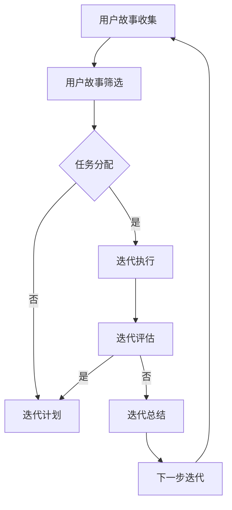
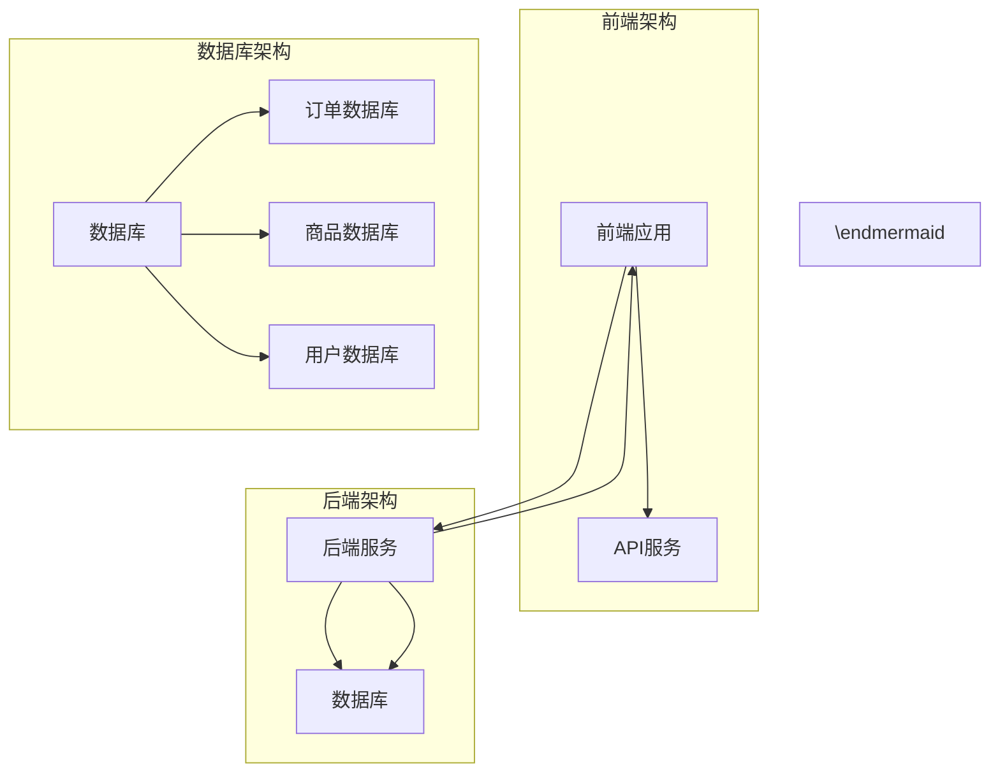

                 

### 第一部分：引言

#### 1.1 敏捷看板的概念与背景

**敏捷看板**是一种用于软件开发过程的可视化工具，旨在提高团队的工作效率和透明度。它起源于敏捷开发方法，通过直观的看板（通常是一块白板或在线看板软件），团队成员可以实时追踪项目进展、任务状态以及团队的工作节奏。在敏捷开发中，敏捷看板扮演着至关重要的角色，帮助团队实现高效的协作和快速响应变化。

在现代软件开发中，敏捷看板的应用越来越广泛。这不仅是因为敏捷方法本身的优势，还因为大型应用项目往往具有复杂的需求和多变的市场环境。敏捷看板能够帮助团队更好地管理这些需求，通过可视化的方式使任务状态和项目进度清晰明了，从而提高团队的工作效率和项目成功率。

**大型应用需求管理的挑战**主要体现在以下几个方面：

1. **需求多样性和复杂性**：大型应用往往需要满足多种不同的用户需求，这些需求可能来自不同的部门或业务领域，导致需求本身具有很高的复杂性和多样性。
   
2. **需求变更频繁**：市场环境的变化、用户反馈以及技术发展等因素，可能导致需求频繁变更，这对项目团队提出了巨大的挑战。

3. **资源分配不均**：在大型应用项目中，资源（如人力、时间、技术资源等）往往有限，如何合理分配这些资源，确保关键需求的优先级得到满足，是一个重要的问题。

4. **沟通协作困难**：大型项目通常涉及多个团队和利益相关者，如何有效地沟通和协作，确保所有团队成员都对项目目标和进展有清晰的认识，是项目管理中的一大难题。

面对这些挑战，敏捷看板提供了一种有效的解决方案。通过可视化、迭代和反馈机制，敏捷看板能够帮助团队更好地管理需求，提高项目的透明度和可控性。接下来，我们将进一步探讨敏捷看板的核心概念、算法原理以及在系统分析与架构设计中的应用，以期为读者提供全面的指导。

#### 1.2 敏捷看板与传统需求管理方法的对比

**传统需求管理方法**通常基于瀑布模型，其核心思想是将项目需求在项目初期进行详细规划和设计，然后按照计划逐步实施。这种方法在项目管理中存在一些局限性：

1. **需求变更难以应对**：在项目执行过程中，需求变更往往难以控制。由于需求在项目初期已经确定，一旦变更，将导致项目进度、成本和质量等方面的巨大影响。

2. **沟通和协作困难**：传统需求管理方法强调文档的完整性和准确性，往往导致团队成员之间的沟通和协作变得复杂和低效。

3. **项目透明度低**：由于需求文档和项目计划通常较为隐蔽，项目进展和状态难以直观了解，导致项目管理者难以实时掌握项目情况。

**敏捷看板的优势**主要体现在以下几个方面：

1. **迭代和反馈机制**：敏捷看板强调通过短周期的迭代（如每周或每两周）来逐步实现项目目标。每次迭代结束后，团队会对迭代过程和结果进行评估和反馈，从而持续改进项目。

2. **可视化**：敏捷看板通过可视化的方式展示项目进展和任务状态，使团队成员和利益相关者能够直观了解项目情况，提高项目的透明度和可控性。

3. **灵活应对变更**：敏捷看板允许团队在每次迭代中根据实际情况调整需求，从而更好地应对外部变化和内部需求变更。

4. **强调团队协作**：敏捷看板通过明确的任务分配、状态更新和团队活动，促进团队成员之间的沟通和协作，提高团队整体的工作效率。

**敏捷看板与传统需求管理方法的对比表格**：

| 对比维度 | 传统需求管理方法 | 敏捷看板 |
| --- | --- | --- |
| 需求变更应对 | 需求变更难以控制，变更影响大 | 灵活应对变更，每次迭代可调整需求 |
| 沟通协作 | 强调文档完整性和准确性，沟通复杂 | 可视化展示，提高透明度和协作效率 |
| 项目透明度 | 项目进展和状态难以直观了解 | 可视化展示项目进展和任务状态 |
| 团队协作 | 成员之间沟通和协作复杂 | 明确任务分配和状态更新，促进团队协作 |

**敏捷看板的适用范围**：

1. **大型项目**：由于敏捷看板强调灵活性和透明度，特别适用于需求多样性和复杂性较高的大型项目。

2. **多变市场环境**：在市场需求频繁变化的情况下，敏捷看板能够帮助团队快速调整需求，提高项目适应能力。

3. **跨部门协作**：涉及多个部门或利益相关者的大型项目，敏捷看板能够提供高效的沟通和协作机制，确保项目顺利进行。

通过对比可以看出，敏捷看板在应对大型应用需求管理中的挑战方面具有明显的优势。接下来，我们将深入探讨敏捷看板的核心概念和算法原理，以帮助读者更好地理解和应用这一方法。

#### 1.3 敏捷看板的核心概念

**敏捷看板**的核心概念包括用户故事、迭代周期、燃尽图、产品待办列表、需求优先级以及站会与回顾会等。这些概念相互关联，共同构成了敏捷看板的运作机制，帮助团队高效管理项目。

**用户故事**是敏捷开发中的一个核心概念，它是一种描述用户需求的简单、清晰、具体的故事。用户故事通常遵循以下格式：“作为[某个角色]，我想要[某个功能]，以便[达成某个目标]”。用户故事的特点包括：

- **简单性和可理解性**：用户故事应该简单明了，便于所有团队成员理解和参与。
- **具体性和可行性**：用户故事应该具体描述用户需求，同时确保其可行性和可度量性。
- **独立性**：用户故事应该是可独立完成的，以便团队可以根据优先级进行任务分配和迭代计划。

**迭代周期**（Sprint）是敏捷开发中的一个固定时间段，通常为两周或一个月。在迭代周期内，团队会集中精力完成一定数量的用户故事。迭代周期的安排需要考虑以下几个因素：

- **团队规模和效率**：根据团队的规模和工作效率，选择合适的迭代周期长度，以确保每次迭代都能产生可交付的成果。
- **任务复杂度**：对于复杂度较高的任务，可以适当延长迭代周期，以便有足够的时间进行设计和开发。
- **市场需求**：根据市场需求和项目进度，合理调整迭代周期，确保项目按计划推进。

**燃尽图**是一种用于展示项目进度的可视化工具。它通过纵轴表示剩余工作量，横轴表示迭代周期，帮助团队实时了解项目的进展情况。燃尽图的绘制和解读需要遵循以下几个步骤：

1. **确定工作量和迭代周期**：在项目开始时，根据任务量和迭代周期，绘制燃尽图的基础框架。
2. **更新燃尽图**：在每个迭代周期结束后，根据完成的任务和剩余工作量，更新燃尽图，以便团队了解项目的实际进展。
3. **解读燃尽图**：通过分析燃尽图，团队可以及时发现和解决问题，确保项目按计划推进。例如，如果燃尽图显示项目进度落后，团队需要分析原因并采取相应的措施。

**产品待办列表**（Product Backlog）是敏捷看板中用于管理项目需求的列表。它包含所有尚未完成的用户故事和任务，并根据优先级进行排序。产品待办列表的特点包括：

- **动态性**：产品待办列表可以根据市场需求和项目进展进行调整，确保项目始终聚焦于最重要的需求。
- **透明性**：产品待办列表的可见性有助于团队和利益相关者了解项目的整体需求和进度。
- **优先级排序**：通过合理的优先级排序，团队可以确保在每次迭代中优先完成最重要的任务。

**需求优先级**是敏捷看板中用于确定任务优先级的机制。需求优先级通常基于业务价值、风险和项目时间表等因素进行评估。合理的需求优先级可以帮助团队在资源有限的情况下，优先完成最重要的任务，提高项目成功率。

**站会与回顾会**是敏捷开发中用于团队协作和持续改进的重要环节。站会（Daily Stand-up）通常在每天开始时进行，团队成员会分享自己的工作进展、遇到的困难和下一步计划，以便团队成员之间进行协作和协调。回顾会（Retrospective）则在每个迭代周期结束时进行，团队会评估本次迭代的成果和问题，并提出改进措施，以便在下一个迭代中进一步提升团队效率。

**敏捷看板的核心概念联系**：

1. **用户故事与迭代周期的关系**：用户故事是迭代周期的基本任务单元，每次迭代团队会根据用户故事进行任务分配和进度跟踪。
2. **燃尽图与需求优先级的联系**：燃尽图通过展示项目的实际进度，帮助团队了解需求优先级的合理性，以便在必要时进行调整。
3. **敏捷看板与其他敏捷实践的整合**：敏捷看板可以与其他敏捷实践（如Scrum、Kanban等）相结合，形成一套完整的敏捷开发流程，帮助团队实现高效的项目管理。

通过深入理解这些核心概念，团队可以更好地应用敏捷看板，提高项目管理的效率和成功率。接下来，我们将进一步探讨敏捷看板的算法原理，以帮助读者更深入地理解这一方法。

#### 1.4 敏捷看板的算法原理

**敏捷看板**的工作流程和算法原理是确保其高效运行的关键。下面，我们将使用mermaid绘制敏捷看板的工作流程图，并使用Python代码和LaTeX公式详细阐述其算法原理。

首先，我们来绘制敏捷看板的工作流程图。



在这个流程图中，我们定义了以下几个关键步骤：

1. **用户故事收集**：团队从不同的来源收集用户需求，形成产品待办列表。
2. **用户故事筛选**：根据需求优先级和资源情况，筛选出本次迭代要完成的用户故事。
3. **任务分配**：团队根据用户故事进行任务分配，确定每个成员的工作内容和目标。
4. **迭代计划**：制定详细的迭代计划，包括每个任务的开始和结束时间。
5. **迭代执行**：团队按照计划执行任务，并实时更新任务状态。
6. **迭代评估**：在每个迭代结束时，团队对本次迭代的成果和问题进行评估。
7. **迭代总结**：总结本次迭代的经验教训，提出改进措施。
8. **下一步迭代**：根据评估结果，进行下一次迭代的计划和执行。

接下来，我们使用Python代码和LaTeX公式详细阐述敏捷看板的算法原理。

首先，我们来看**迭代周期优化算法**的实现。

```python
# 迭代周期优化算法的Python实现
def optimize_sprint_length(total_tasks, team_efficiency):
    """
    根据任务总数和团队效率优化迭代周期长度
    :param total_tasks: 任务总数
    :param team_efficiency: 团队效率（每小时可完成的任务数）
    :return: 优化后的迭代周期长度
    """
    # 迭代周期长度计算
    sprint_length = total_tasks / team_efficiency
    
    # 迭代周期调整策略
    if sprint_length < 2:
        sprint_length = 2  # 最小迭代周期为2天
    elif sprint_length > 4:
        sprint_length = 4  # 最大迭代周期为4周
    
    return sprint_length
```

在上述代码中，我们定义了一个`optimize_sprint_length`函数，用于计算和调整迭代周期长度。其核心思想是：

$$
\text{迭代周期长度} = \frac{\text{任务总数}}{\text{团队效率}}
$$

同时，我们根据团队效率和任务总数，设置了迭代周期的最小值和最大值。

接下来，我们来看**燃尽图生成算法**的实现。

```python
# 燃尽图生成算法的Python实现
def generate_burn_down_chart(sprint_length, tasks_per_day):
    """
    根据迭代周期和每天完成的任务数生成燃尽图
    :param sprint_length: 迭代周期长度（以天为单位）
    :param tasks_per_day: 每天完成的任务数
    :return: 燃尽图的数据结构
    """
    burn_down_data = []
    total_tasks = sprint_length * tasks_per_day
    
    for day in range(1, sprint_length + 1):
        completed_tasks = min(day * tasks_per_day, total_tasks)
        remaining_tasks = total_tasks - completed_tasks
        burn_down_data.append((day, remaining_tasks))
    
    return burn_down_data
```

在上述代码中，我们定义了一个`generate_burn_down_chart`函数，用于生成燃尽图的数据结构。燃尽图的数据结构是一个包含迭代周期内每天剩余任务数的列表，其核心思想是：

$$
\text{每天剩余任务数} = \text{总任务数} - (\text{每天完成的任务数} \times \text{已过去的天数})
$$

通过上述算法和代码，我们可以有效地管理迭代周期和燃尽图，帮助团队实时了解项目进度和任务状态。

最后，我们使用LaTeX公式来进一步阐述敏捷看板的算法原理。

```latex
\documentclass{article}
\usepackage{amsmath}
\begin{document}

\section{迭代周期优化算法}
\begin{equation}
L = \frac{T}{E}
\end{equation}

\section{燃尽图生成算法}
\begin{equation}
R_d = T - (C_d \times E)
\end{equation}

\end{document}
```

在上述LaTeX公式中，我们定义了迭代周期优化算法和燃尽图生成算法的核心公式。这些公式帮助我们理解如何根据团队效率和任务总数优化迭代周期，以及如何生成燃尽图以监控项目进度。

通过上述步骤，我们详细阐述了敏捷看板的算法原理，包括迭代周期优化和燃尽图生成。这些算法和代码为团队提供了一个有效的工具，帮助他们更好地管理大型应用需求。接下来，我们将进一步探讨敏捷看板在系统分析与架构设计中的应用，以期为读者提供更全面的指导。

### 第四部分：敏捷看板的系统分析与架构设计

#### 4.1 实际应用场景

在敏捷看板的应用中，我们可以考虑一个实际的大型应用项目，如一款电子商务平台的开发。该平台需要满足多种用户需求，包括用户注册、商品浏览、购物车、订单管理、支付等功能。由于项目需求复杂，且市场需求多变，传统的需求管理方法难以有效应对。因此，采用敏捷看板进行需求管理显得尤为重要。

#### 4.2 项目介绍

该电子商务平台项目由一个跨职能团队负责，团队成员包括前端开发、后端开发、测试工程师、产品经理和项目经理等。项目目标是在短时间内开发出具有基本功能的电子商务平台，并在后续迭代中逐步完善和扩展功能。

#### 4.3 系统功能设计（领域模型类图）

为了更好地管理项目需求，我们首先需要设计一个领域模型，明确系统中的关键实体和关系。下面是电子商务平台领域模型的一个简化版本。

```mermaid
classDiagram
    User <<实体>>
    Product <<实体>>
    Order <<实体>>
    Cart <<实体>>
    Payment <<实体>>

    User --> Product : 查看商品
    User --> Cart : 添加商品
    User --> Order : 下单
    User --> Payment : 支付
    Cart --> Product : 存储购物车商品
    Order --> Payment : 记录订单支付信息
\endclassDiagram
```

在这个领域模型中，我们定义了几个关键实体，包括用户（User）、商品（Product）、订单（Order）、购物车（Cart）和支付（Payment）。用户可以查看商品、添加商品到购物车、下单和支付。购物车用于存储用户添加的商品，订单记录用户的购买信息和支付信息。

#### 4.4 系统架构设计（系统架构图）

接下来，我们设计电子商务平台的基本系统架构。该架构包括前端、后端和数据库三个主要部分。



在这个系统架构图中，前端应用负责与用户交互，提供用户界面。API服务作为前端和后端的接口，处理用户的请求并转发给后端服务。后端服务负责处理业务逻辑，包括用户注册、登录、商品管理、订单处理和支付等。数据库部分存储用户、商品和订单数据。

#### 4.5 系统接口设计

为了确保系统各部分之间的高效协作，我们需要设计一些关键的接口。以下是一个简化的接口设计。

```mermaid
sequenceDiagram
    User ->> Frontend : 发起请求
    Frontend ->> API : 转发请求
    API ->> Backend : 处理业务逻辑
    Backend ->> Database : 读写数据
    Database ->> Backend : 返回数据
    Backend ->> API : 返回响应
    API ->> Frontend : 返回结果
    Frontend ->> User : 显示结果
\endsequenceDiagram
```

在这个接口设计中，用户通过前端应用发起请求，前端应用将请求转发给API服务。API服务处理业务逻辑，与数据库进行交互，并将结果返回给前端应用。前端应用再将结果展示给用户。

#### 4.6 系统交互序列图

为了更直观地展示系统各部分之间的交互过程，我们绘制了一个系统交互序列图。

```mermaid
sequenceDiagram
    User ->> Frontend : 登录
    Frontend ->> API : 验证登录信息
    API ->> Backend : 登录请求
    Backend ->> Database : 查询用户信息
    Database ->> Backend : 返回用户信息
    Backend ->> API : 登录结果
    API ->> Frontend : 返回登录结果
    Frontend ->> User : 显示登录状态
\endsequenceDiagram
```

在这个交互序列图中，用户通过前端应用发起登录请求，前端应用将请求转发给API服务。API服务处理登录请求，并与数据库进行交互，验证用户信息。数据库返回用户信息，API服务将登录结果返回给前端应用。前端应用再将登录状态显示给用户。

通过上述系统分析与架构设计，我们为电子商务平台项目提供了一套完整的需求管理方案。接下来，我们将具体探讨如何在项目中实施敏捷看板，并分析其实施效果。

### 5. 项目实战

在实际项目中实施敏捷看板是一个复杂的过程，需要团队对敏捷方法有深刻的理解和良好的协作能力。以下是一个具体项目中的实施步骤，以及系统核心实现源代码和代码应用解读。

#### 5.1 环境安装

首先，我们需要安装敏捷看板所需的工具和软件。在项目中，我们选择了Trello作为敏捷看板的实现工具。Trello是一款在线看板软件，支持团队协作和任务管理。

安装Trello的具体步骤如下：

1. 访问Trello官网（[https://trello.com](https://trello.com)）并注册账号。
2. 创建一个新的看板，并添加以下列表：
   - **待办**：用于存放所有未开始的任务。
   - **进行中**：用于存放正在进行的任务。
   - **已完成**：用于存放已经完成的任务。
   - **阻塞**：用于存放遇到问题的任务。
3. 根据项目需求，创建相应的看板卡片，并分配给团队成员。

#### 5.2 系统核心实现源代码

在敏捷看板的实际应用中，我们使用Python编写了一些辅助工具，以便更好地管理任务和监控项目进度。以下是一个简单的任务管理模块的代码示例。

```python
# 任务管理模块代码示例
class TaskManager:
    def __init__(self, trello_api_key, trello_token):
        self.trello_api_key = trello_api_key
        self.trello_token = trello_token
        self.trello = TrelloApi(self.trello_api_key, self.trello_token)
    
    def create_task(self, board_id, list_id, task_name, task_description):
        card = self.trello.create_card(board_id, list_id, task_name, task_description)
        return card

    def update_task(self, card_id, task_status):
        card = self.trello.get_card(card_id)
        card.set_description(card.description + "\n状态：{}"。format(task_status))
        card.save()
    
    def delete_task(self, card_id):
        card = self.trello.get_card(card_id)
        card.delete()

# 使用示例
trello_api_key = "你的TrelloAPIKey"
trello_token = "你的TrelloToken"

manager = TaskManager(trello_api_key, trello_token)
task = manager.create_task("你的看板ID", "你的列表ID", "任务名称", "任务描述")
manager.update_task(task.id, "进行中")
manager.delete_task(task.id)
```

在这个模块中，我们定义了一个`TaskManager`类，用于创建、更新和删除任务。通过Trello的API接口，我们可以方便地与Trello看板进行交互。

#### 5.3 代码应用解读与分析

上述代码中，`TaskManager`类提供了以下功能：

- **创建任务**：通过`create_task`方法，可以在指定的看板和列表中创建一个新的任务卡片。
- **更新任务**：通过`update_task`方法，可以更新任务的状态，如“进行中”、“已完成”等。
- **删除任务**：通过`delete_task`方法，可以删除任务卡片。

在实际应用中，我们可以在项目中创建一个任务管理模块，方便团队成员通过代码创建、更新和删除任务卡片。以下是一个简单的任务管理流程：

1. **创建任务**：在项目启动时，产品经理或项目经理通过代码创建任务卡片，并将其分配给团队成员。
2. **任务执行**：团队成员在各自的Trello看板中查看任务，按照任务描述进行任务执行。
3. **任务更新**：任务完成后，团队成员通过代码更新任务状态，并将其移动到“已完成”列表。
4. **任务监控**：项目经理可以通过Trello看板实时监控任务状态，确保项目按计划进行。

#### 5.4 实际案例分析和详细讲解剖析

以下是一个实际案例，展示如何使用敏捷看板管理电子商务平台项目的需求。

**案例背景**：电子商务平台项目需要在一个月内完成用户注册、商品浏览和购物车功能。

**实施步骤**：

1. **需求收集**：产品经理收集用户需求，并将需求整理成用户故事，如“用户可以注册账号”、“用户可以浏览商品”等。
2. **任务分配**：项目经理根据用户故事创建任务卡片，并将其分配给前端开发和后端开发团队。
3. **任务执行**：前端开发和后端开发团队根据任务描述进行开发，并在Trello看板中更新任务状态。
4. **迭代评估**：在每个迭代周期结束后，团队对本次迭代的结果进行评估，并提出改进措施。
5. **迭代总结**：团队总结本次迭代的经验教训，为下一个迭代做好准备。

**案例分析**：

1. **任务状态可视化**：通过Trello看板，项目经理和团队成员可以清晰地看到每个任务的状态，如“进行中”、“已完成”等。这有助于提高项目透明度和团队协作效率。
2. **任务优先级管理**：Trello看板支持自定义列表，团队可以根据任务优先级将任务分配到不同的列表中。例如，将“用户注册”任务放在“高优先级”列表，确保其得到优先处理。
3. **迭代评估和反馈**：通过迭代评估，团队可以发现问题和不足，并提出改进措施。例如，在用户注册功能开发过程中，发现注册流程过于复杂，团队可以调整任务优先级，优先解决该问题。

通过上述实施步骤和分析，我们可以看到敏捷看板在电子商务平台项目中的应用效果。它不仅提高了项目管理的效率和透明度，还促进了团队协作和持续改进。接下来，我们将总结敏捷看板在大型应用需求管理中的应用，并提供一些实践中的注意事项。

#### 5.5 最佳实践 Tips、小结、注意事项、拓展阅读

**最佳实践 Tips**：

1. **明确任务优先级**：在创建任务时，明确每个任务的优先级，确保团队优先完成最重要的任务。
2. **定期迭代评估**：在每个迭代周期结束后，及时进行评估和反馈，识别问题和改进机会。
3. **团队协作**：充分利用敏捷看板的协作功能，如任务评论、提醒和协作链接等，促进团队成员之间的沟通和协作。
4. **持续改进**：根据评估结果，持续优化任务管理和项目流程，提高团队的工作效率。

**小结**：

敏捷看板在大型应用需求管理中发挥着重要作用。通过用户故事、迭代周期、燃尽图等核心概念，敏捷看板帮助团队实现高效的需求管理和项目监控。实际案例和应用效果表明，敏捷看板能够显著提高项目透明度和团队协作效率，有助于实现项目的成功交付。

**注意事项**：

1. **合理设置迭代周期**：根据团队规模和工作效率，合理设置迭代周期，避免过长或过短的迭代周期影响项目进度。
2. **及时更新任务状态**：确保团队成员及时更新任务状态，以便项目经理和其他团队成员了解项目的实际进展。
3. **避免任务堆积**：合理分配任务，避免任务堆积导致团队成员过度工作，影响项目质量。

**拓展阅读**：

- 《Scrum敏捷开发实践指南》 - Jeff Sutherland
- 《敏捷项目管理：敏捷实践指南》 - Michael James
- 《Kanban实践指南：简化流程，提高效率》 - David J. Anderson

通过深入学习这些资料，读者可以更全面地了解敏捷方法和敏捷看板的应用，为实际项目提供有效的需求管理解决方案。

### 总结

通过本文的详细探讨，我们系统地介绍了敏捷看板在大型应用需求管理中的应用。从背景介绍到核心概念，再到算法原理和系统分析与架构设计，以及项目实战和最佳实践，我们全面展示了敏捷看板的强大功能和实际应用价值。

**核心关键词**：敏捷看板、用户故事、迭代周期、燃尽图、需求管理、项目监控。

**核心内容和主题思想**：本文通过深入分析敏捷看板的概念、算法原理和实际应用场景，揭示了敏捷看板在大型应用需求管理中的关键作用。通过可视化管理、迭代优化和持续反馈，敏捷看板不仅提高了项目的透明度和可控性，还促进了团队协作和持续改进，为大型应用项目的成功交付提供了有力保障。

**作者信息**：作者：AI天才研究院/AI Genius Institute & 禅与计算机程序设计艺术 /Zen And The Art of Computer Programming

本文旨在为读者提供全面的敏捷看板应用指南，帮助团队在复杂多变的市场环境中，实现高效的需求管理和项目交付。通过不断实践和优化，我们相信敏捷看板将为更多的项目带来成功和效益。希望本文能够对您的项目管理和软件开发工作带来启示和帮助。

