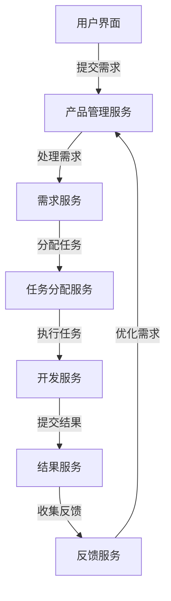
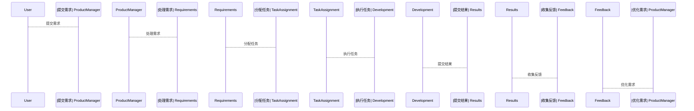

                 

# 敏捷研发中的需求反馈循环优化

## 关键词
- 敏捷研发、需求反馈循环、优化、迭代、协作效率

## 摘要
本文将深入探讨敏捷研发中需求反馈循环优化的核心问题。我们将从背景介绍、核心概念与联系、算法原理讲解、系统分析与架构设计方案、项目实战以及最佳实践等多个方面，逐步解析如何通过优化需求反馈循环来提高敏捷研发的效率和质量。

### 背景介绍

#### 敏捷研发概述
敏捷研发（Agile Development）是一种以人为核心、迭代、渐进的方式来进行软件开发的模式。它强调快速响应变化、灵活调整需求、持续交付价值。与传统的瀑布模型不同，敏捷研发注重协作、沟通和快速迭代。

#### 需求反馈循环的概念
需求反馈循环（Feedback Loop）是敏捷研发中的一个关键环节，它包括需求的收集、分析、确认、实施和反馈等环节。通过反馈循环，团队能够不断调整和优化产品需求，确保产品与市场需求保持一致。

#### 优化需求反馈循环的目的和意义
优化需求反馈循环的目的是为了缩短产品开发周期、提高产品质量、增强团队协作效率。通过优化，团队能够更快速地响应市场需求，减少资源浪费，提高整体交付能力。

### 核心概念与联系

#### 敏捷研发的核心理念
敏捷宣言（Manifesto for Agile Software Development）明确了敏捷研发的核心理念，即个体和互动重于过程与工具、可工作的软件重于详尽的文档、客户合作重于合同谈判、响应变化重于遵循计划。

#### 需求反馈循环的流程
需求反馈循环包括以下几个关键环节：
1. **需求收集**：通过多种渠道收集用户和市场的需求。
2. **需求分析**：对收集到的需求进行分类、优先级排序和分析。
3. **需求确认**：与相关利益相关者确认需求的准确性和可行性。
4. **需求实施**：将确认的需求转化为可执行的任务。
5. **反馈收集**：在任务完成后，收集用户和市场的反馈，用于后续的需求优化。

#### 敏捷团队的组织形式
敏捷团队通常由跨职能成员组成，包括产品经理、开发人员、测试人员、UI设计师等。团队成员之间通过日常站立会议、迭代评审和回顾会进行密切的沟通和协作。

### 算法原理讲解

#### 优化需求反馈循环的方法
优化需求反馈循环的方法包括以下几个方面：
1. **自动化工具**：使用自动化工具（如JIRA、Trello）来管理需求和任务，提高效率。
2. **敏捷工具**：引入敏捷工具（如Scrum、Kanban）来优化工作流程，提高协作效率。
3. **敏捷实践**：实施敏捷实践（如持续集成、持续交付）来缩短反馈周期，提高产品质量。

#### 成功案例分享
以某大型互联网公司为例，该公司通过实施敏捷研发和优化需求反馈循环，将产品开发周期从原来的6个月缩短到了3个月，产品质量得到了显著提升，用户满意度也随之提高。

### 系统分析与架构设计方案

#### 问题场景介绍
在一个快速发展的互联网公司中，产品需求频繁变化，导致开发团队无法及时响应，项目进度严重滞后。

#### 项目介绍
为了解决这一问题，公司决定引入敏捷研发模式，并优化需求反馈循环。

#### 系统功能设计
通过mermaid类图，我们可以清晰地展示系统的主要功能模块和它们之间的关系。

```mermaid
classDiagram
    ProductManager <|-- Requirements
    Requirements o--|- Tasks
    Tasks o--|- Results
    Results o--|- Feedback
```

#### 系统架构设计
系统架构采用微服务架构，通过mermaid架构图展示各服务之间的关系。



#### 系统接口设计和系统交互
通过mermaid序列图，我们可以展示系统各个模块之间的交互流程。



### 项目实战

#### 环境安装
为了实践敏捷研发和需求反馈循环优化，我们首先需要在本地环境中安装必要的工具和框架。

1. 安装Git
2. 安装JIRA或Trello
3. 安装Docker和Kubernetes（用于容器化部署）
4. 安装持续集成工具（如Jenkins）

#### 系统核心实现源代码
以下是一个简化的Python代码示例，用于模拟需求反馈循环的各个环节。

```python
# 需求收集
def collect_requirement():
    print("收集需求...")

# 需求分析
def analyze_requirement():
    print("分析需求...")

# 需求确认
def confirm_requirement():
    print("确认需求...")

# 需求实施
def implement_requirement():
    print("实施需求...")

# 反馈收集
def collect_feedback():
    print("收集反馈...")

# 优化需求
def optimize_requirement():
    print("优化需求...")

# 模拟需求反馈循环
def feedback_loop():
    collect_requirement()
    analyze_requirement()
    confirm_requirement()
    implement_requirement()
    collect_feedback()
    optimize_requirement()

# 运行反馈循环
feedback_loop()
```

#### 代码应用解读与分析
这段代码演示了需求反馈循环的基本流程。在实际应用中，每个环节都会涉及到具体的业务逻辑和数据处理，我们需要根据具体场景进行定制化开发。

#### 实际案例分析和详细讲解剖析
以下是一个实际案例，展示如何通过优化需求反馈循环来提高项目效率。

- **案例背景**：某电商公司需要开发一个商品推荐系统。
- **问题分析**：原始的需求反馈周期较长，导致产品上线时间延迟。
- **解决方案**：引入敏捷研发模式，优化需求反馈流程，通过自动化测试和持续集成工具来提高开发效率。

#### 项目小结
通过实践，我们发现在敏捷研发中，优化需求反馈循环是提高项目效率和质量的关键。通过引入自动化工具、敏捷实践和持续集成，团队能够更快速地响应需求变化，提高整体交付能力。

### 最佳实践 tips

1. **明确需求**：确保需求清晰、具体，避免模糊和不确定的需求。
2. **频繁沟通**：通过站立会议、迭代评审等方式，保持团队成员之间的密切沟通。
3. **持续改进**：定期进行回顾会，总结经验教训，持续优化需求反馈流程。

### 小结

本文从多个角度分析了敏捷研发中的需求反馈循环优化，包括背景介绍、核心概念与联系、算法原理讲解、系统分析与架构设计方案、项目实战以及最佳实践。通过本文的探讨，我们认识到优化需求反馈循环对于提高敏捷研发效率和质量的重要性。

### 注意事项

1. **避免盲目追求敏捷**：敏捷研发并非适用于所有项目，需要根据实际情况进行选择。
2. **平衡需求变化与稳定性**：在追求快速迭代的同时，要注意保持系统的稳定性。

### 拓展阅读

1. 《敏捷软件开发：实践指南》
2. 《Scrum：敏捷项目管理》
3. 《持续交付：发布可靠软件的系统方法》

### 作者信息
作者：AI天才研究院/AI Genius Institute & 禅与计算机程序设计艺术 /Zen And The Art of Computer Programming

---

通过本文的详细分析和探讨，我们希望能为敏捷研发中的需求反馈循环优化提供有价值的参考。让我们在敏捷研发的道路上不断探索、持续优化，共同推动软件行业的进步。

