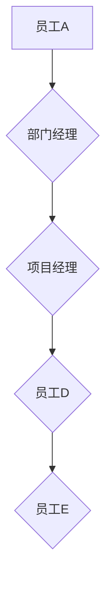
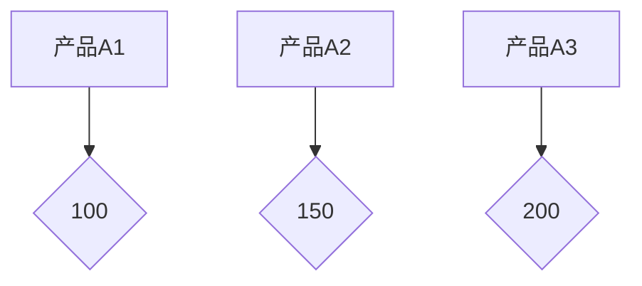
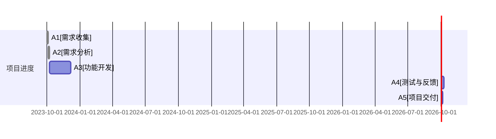
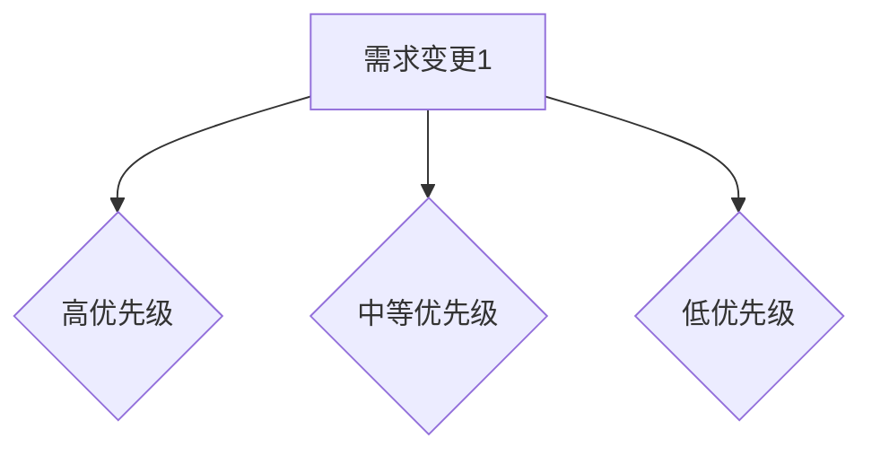
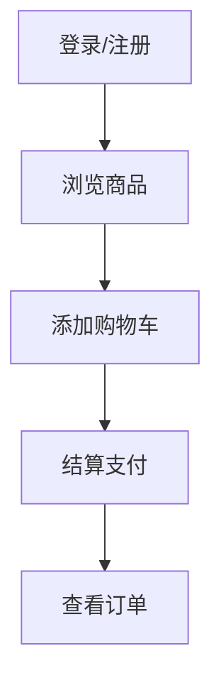
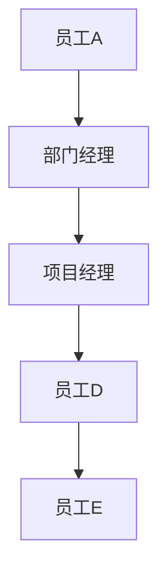

                 

### 引言

#### 1.1.1 敏捷研发的兴起

敏捷研发（Agile Development）作为一种软件开发方法论，源于2001年发布的《敏捷宣言》。随着互联网和移动设备的迅猛发展，客户需求变得多变且迅速，传统的瀑布式开发模式因周期长、调整困难而逐渐被淘汰。敏捷开发强调快速迭代、持续交付和团队协作，旨在更好地适应市场需求和变化。如今，敏捷研发已经成为软件开发领域的主流趋势，被广泛应用于各种规模的项目。

#### 1.1.2 需求可视化的重要性

在敏捷研发中，需求可视化（Requirement Visualization）扮演着至关重要的角色。它不仅有助于团队成员更好地理解需求，还能提高沟通效率、减少误解和错误。通过可视化，需求可以被直观地呈现，使得复杂的信息变得易于理解和分析。此外，需求可视化还能帮助团队及时发现和解决问题，提高项目的透明度和可控性。

#### 1.1.3 需求可视化的挑战与机遇

尽管需求可视化在敏捷研发中具有重要意义，但其实施过程中也面临着一系列挑战。首先，如何准确地捕捉和表达需求本身就是一个难题，特别是在需求不断变更的情况下。其次，选择合适的可视化工具和技巧也是一大挑战，因为不同的工具适用于不同的场景和需求。然而，这些挑战同时也带来了机遇。随着技术的不断发展，越来越多的可视化工具和技巧被推出，为需求可视化提供了更多的选择和可能性。

#### 1.2 需求可视化的定义与作用

需求可视化是将需求信息以图形或图表的形式展示出来，帮助团队成员更好地理解和分析需求的过程。它不仅包括需求文档的图形化表达，还涵盖了用户故事、需求变更、优先级评估等多个方面。需求可视化具有以下几个重要作用：

1. **提高沟通效率**：通过直观的图形化展示，需求信息能够被快速传达和共享，减少了口头沟通的模糊性和误解。
2. **增强项目透明度**：需求可视化使得项目的进展和状态更加透明，有助于团队成员和利益相关者了解项目的整体情况。
3. **辅助需求分析**：可视化工具可以帮助团队更好地分析需求，发现潜在的问题和风险，从而采取相应的措施。
4. **支持决策制定**：通过可视化展示，团队可以更清晰地了解需求的优先级和实现难度，为决策提供有力支持。

#### 1.2.1 需求可视化的定义

需求可视化是一种将需求信息通过图形或图表形式展示的技术和方法。它包括以下几个关键要素：

1. **需求捕捉**：通过访谈、问卷调查、用户反馈等方式收集需求，并将其记录下来。
2. **需求表达**：将收集到的需求转化为可理解的图形或图表形式，如用户故事地图、需求矩阵、需求树等。
3. **需求分析**：利用可视化工具对需求进行深入分析，识别需求之间的关系、优先级和实现难度。
4. **需求展示**：将分析结果以图形或图表形式展示给团队成员和利益相关者，提高沟通效率和项目透明度。

#### 1.2.2 需求可视化的作用

需求可视化在敏捷研发中发挥着至关重要的作用。首先，它能够提高沟通效率。通过直观的图形化展示，需求信息能够被快速传达和共享，减少了口头沟通的模糊性和误解。此外，需求可视化还能增强项目的透明度，使得项目的进展和状态更加清晰。团队成员和利益相关者可以随时随地了解项目的整体情况，从而更好地参与项目管理和决策。

其次，需求可视化有助于辅助需求分析。通过可视化工具，团队可以更清晰地识别需求之间的关系、优先级和实现难度。这有助于团队在早期发现潜在的问题和风险，并采取相应的措施进行解决。例如，通过需求矩阵和需求树等工具，团队可以更好地理解需求的复杂性和关联性，从而制定更有效的开发策略。

最后，需求可视化支持决策制定。通过可视化展示，团队可以更清晰地了解需求的优先级和实现难度，为决策提供有力支持。例如，在项目资源分配和任务调度方面，团队可以根据需求可视化结果做出更明智的决策，确保项目能够按时交付并满足客户需求。

#### 1.2.3 需求可视化的分类

需求可视化可以分为以下几种类型：

1. **用户故事地图**：通过图形化展示用户故事及其之间的关系，帮助团队理解需求的全貌。
2. **需求矩阵**：将需求按照不同的维度进行排列，帮助团队分析需求的优先级和实现难度。
3. **需求树**：以树状结构展示需求之间的层次关系，帮助团队理解需求的层次结构和依赖关系。
4. **看板**：通过看板可视化工具，如JIRA、Trello等，展示任务状态和进度，帮助团队管理项目流程。
5. **知识图谱**：通过图形化展示需求与其他知识实体之间的关联关系，帮助团队更好地理解需求的背景和上下文。

#### 1.3 本书结构概述

本书旨在系统地介绍敏捷研发中的需求可视化展示技巧。全书共分为七个章节，具体结构如下：

- **第1章 引言**：介绍敏捷研发的兴起、需求可视化的重要性以及本书的结构概述。
- **第2章 敏捷研发基本概念**：介绍敏捷开发的基本概念，包括用户故事编写技巧和需求管理方法。
- **第3章 可视化工具介绍**：介绍常见的需求可视化工具，如JIRA、Trello和Asana，以及知识图谱和信息系统可视化技术。
- **第4章 需求可视化实践**：介绍需求可视化流程、案例和实践技巧。
- **第5章 可视化技术进阶**：介绍数据可视化与信息可视化的概念及其在复杂系统需求可视化中的应用。
- **第6章 需求可视化最佳实践**：介绍用户故事地图、看板可视化和知识图谱可视化的最佳实践。
- **第7章 小结与展望**：总结本书的主要内容，展望需求可视化的未来发展趋势。

通过本书的阅读，读者将能够系统地了解敏捷研发中的需求可视化展示技巧，掌握常见的可视化工具和技巧，并能够将其应用于实际项目实践中。希望本书能够为读者在敏捷研发过程中提供有益的指导。

#### 1.3.1 目录组织

本书的目录组织如下：

- **第1章 引言**
  - 1.1 敏捷研发的兴起
  - 1.2 需求可视化的重要性
  - 1.3 需求可视化的挑战与机遇
  - 1.4 需求可视化的定义与作用
  - 1.5 需求可视化的分类
  - 1.6 本书结构概述

- **第2章 敏捷研发基本概念**
  - 2.1 敏捷开发简介
  - 2.2 用户故事编写技巧
  - 2.3 需求管理
  - 2.4 敏捷研发流程

- **第3章 可视化工具介绍**
  - 3.1 常见需求可视化工具
  - 3.2 知识图谱可视化
  - 3.3 信息可视化技术

- **第4章 需求可视化实践**
  - 4.1 需求可视化流程
  - 4.2 需求可视化案例
  - 4.3 需求可视化工具使用技巧

- **第5章 可视化技术进阶**
  - 5.1 数据可视化与信息可视化
  - 5.2 复杂系统的需求可视化
  - 5.3 未来需求可视化的发展趋势

- **第6章 需求可视化最佳实践**
  - 6.1 用户故事地图
  - 6.2 看板可视化
  - 6.3 知识图谱可视化

- **第7章 小结与展望**
  - 7.1 敏捷研发中需求可视化的关键点
  - 7.2 需求可视化工具与技术的应用
  - 7.3 敏捷研发与需求可视化的未来发展

#### 1.3.2 每章节内容概览

以下是每章节的内容概览：

- **第1章 引言**：
  - 本章首先介绍了敏捷研发的兴起背景和需求可视化的重要性。接着，定义了需求可视化，并探讨了其在敏捷研发中的作用和分类。最后，概述了本书的结构和各章节的主要内容。

- **第2章 敏捷研发基本概念**：
  - 本章详细介绍了敏捷开发的基本概念，包括起源、原则和流程。接着，讲解了用户故事编写技巧和需求管理方法，为后续的需求可视化实践打下了基础。

- **第3章 可视化工具介绍**：
  - 本章介绍了常见的需求可视化工具，如JIRA、Trello和Asana。接着，探讨了知识图谱和信息系统可视化技术，为需求可视化提供了多样化的选择。

- **第4章 需求可视化实践**：
  - 本章介绍了需求可视化的具体流程，包括需求收集、分析和可视化设计。接着，通过案例展示了需求可视化的实际应用，并介绍了使用可视化工具的技巧。

- **第5章 可视化技术进阶**：
  - 本章探讨了数据可视化与信息可视化的概念及其在复杂系统需求可视化中的应用。接着，介绍了未来需求可视化的发展趋势，为读者提供了前瞻性的视角。

- **第6章 需求可视化最佳实践**：
  - 本章介绍了用户故事地图、看板可视化和知识图谱可视化的最佳实践。通过实际案例分析，展示了这些实践方法在敏捷研发中的应用效果。

- **第7章 小结与展望**：
  - 本章总结了本书的主要内容，回顾了敏捷研发中需求可视化的关键点和工具技术应用。最后，展望了需求可视化的未来发展趋势，为读者指明了研究方向。

通过本书的阅读，读者将能够系统地掌握敏捷研发中的需求可视化展示技巧，并在实际项目中灵活运用，提高项目的开发效率和质量。

## 第2章 敏捷研发基本概念

敏捷研发是一种以用户需求为导向的软件开发方法论，它强调快速迭代、持续交付和团队协作。本章将介绍敏捷研发的基本概念，包括敏捷开发的起源、原则和流程，以及用户故事编写技巧和需求管理方法。

### 2.1 敏捷开发简介

敏捷开发（Agile Development）起源于20世纪90年代末期，作为对传统瀑布式开发方法的一种反思和改进。敏捷开发的核心思想是应对快速变化的需求，通过短周期的迭代和频繁的交付，确保项目能够灵活适应市场变化，同时提高团队的生产力和项目的质量。

#### 2.1.1 敏捷开发的起源

敏捷开发的起源可以追溯到2001年，当时软件行业面临激烈的竞争和快速变化的市场需求。许多公司发现，传统的瀑布式开发方法由于周期长、调整困难，无法有效应对市场需求的变化。因此，一群软件开发者聚集在一起，共同讨论如何改进软件开发方法，最终形成了《敏捷宣言》。

#### 2.1.2 敏捷开发的原则

敏捷开发遵循以下原则：

1. **个体和互动重于流程和工具**：团队中的每个成员都至关重要，良好的沟通和协作比依赖工具更为重要。
2. **可工作的软件重于详尽的文档**：软件的实际功能和性能是第一位的，虽然文档也很重要，但不应占据过多资源。
3. **客户协作重于合同谈判**：与客户的紧密合作有助于更好地理解需求，从而提高项目的成功率和客户满意度。
4. **响应变化重于遵循计划**：在软件开发过程中，需求往往会发生变化，敏捷开发强调对变化的快速响应。
5. **持续交付重于频繁交付**：频繁交付可确保软件始终处于可运行状态，同时便于及时获取反馈。

#### 2.1.3 敏捷开发的流程

敏捷开发的流程通常包括以下几个步骤：

1. **需求收集**：通过与用户、利益相关者进行沟通，收集项目的需求。
2. **迭代计划**：将需求分解为可管理的任务，并为每个迭代分配资源和时间。
3. **开发与测试**：在每个迭代周期内，开发团队根据计划进行开发工作，并持续进行测试。
4. **评审与回顾**：在每个迭代结束时，团队进行评审，评估项目的进度和成果，并回顾迭代过程中的经验教训，为下一个迭代做好准备。

### 2.2 用户故事编写技巧

用户故事（User Story）是敏捷开发中的一种需求描述方式，它以用户的需求为核心，描述软件系统应如何为用户带来价值。编写良好的用户故事能够帮助团队更好地理解需求，提高开发效率。

#### 2.2.1 用户故事的定义

用户故事是一种简单、直观的需求描述，通常采用以下格式：

“As a [角色]，I want [功能]，so that [目的]”

其中，“角色”指的是使用软件的用户或用户类别，“功能”描述软件应实现的功能，“目的”解释为何这个功能对用户有价值。

#### 2.2.2 用户故事的编写规则

编写用户故事时，应遵循以下规则：

1. **简洁性**：用户故事应简洁明了，避免使用复杂的句子和术语。
2. **具体性**：用户故事应具体描述功能，使开发团队能够明确了解需求。
3. **价值性**：用户故事应描述对用户有价值的功能，确保开发工作能够带来实际价值。
4. **可测试性**：用户故事应包含可测试的描述，以便开发完成后进行验收测试。

#### 2.2.3 用户故事的例子分析

以下是一个用户故事的例子：

“As a user, I want to be able to search for products by category, so that I can easily find items I am interested in.”

这个用户故事描述了一个用户的需求，即能够按类别搜索产品。通过这个例子，我们可以分析以下几个关键要素：

1. **角色**：用户
2. **功能**：搜索产品按类别
3. **目的**：方便用户找到感兴趣的商品

这个用户故事简洁明了，符合编写规则，能够帮助开发团队了解需求并实现相应的功能。

### 2.3 需求管理

需求管理是敏捷开发中至关重要的一环，它涉及需求的收集、分类、优先级评估和变更管理。有效的需求管理有助于确保项目目标的实现，并提高项目的透明度和可控性。

#### 2.3.1 需求分类

需求可以分为以下几类：

1. **功能需求**：描述软件系统应具备的功能和特性。
2. **非功能需求**：描述软件系统应满足的性能、安全、兼容性等方面的要求。
3. **用户需求**：描述用户对软件系统的期望和需求。
4. **业务需求**：描述业务流程、业务规则和业务目标等。

#### 2.3.2 需求变更管理

在软件开发过程中，需求往往会发生变化。需求变更管理包括以下步骤：

1. **变更识别**：识别需求变更，包括新需求的提出和现有需求的修改。
2. **变更评估**：评估变更对项目进度、成本和资源的影响，确定是否接受变更。
3. **变更实现**：在项目计划和资源允许的条件下，实施需求变更。
4. **变更控制**：跟踪变更的执行情况，确保变更得到有效实施。

#### 2.3.3 需求优先级评估

需求优先级评估是需求管理的重要环节，它有助于确保项目能够优先实现高价值的需求。评估需求优先级时，可以考虑以下因素：

1. **业务价值**：需求对业务的贡献和影响程度。
2. **紧迫性**：需求实现的时间敏感性和紧急程度。
3. **风险**：需求实现的困难和风险程度。
4. **资源**：实现需求所需的资源和成本。

通过科学的需求分类、变更管理和优先级评估，敏捷开发团队可以更好地管理需求，确保项目顺利推进并实现预期目标。

## 第3章 可视化工具介绍

在敏捷研发过程中，选择合适的可视化工具对于提升需求管理的效率和团队协作的效果至关重要。本章将介绍几种常见的需求可视化工具，包括JIRA、Trello和Asana，以及知识图谱可视化和信息可视化技术。

### 3.1 常见需求可视化工具

在敏捷开发中，有许多需求可视化工具可以帮助团队有效地管理和追踪项目需求。以下介绍三种广泛使用的工具：

#### 3.1.1 JIRA

JIRA是一款功能强大的需求管理工具，适用于大型团队和复杂项目。它提供了灵活的任务管理、敏捷看板和报告功能。

1. **任务管理**：JIRA可以创建、分配和跟踪任务，确保每个任务都有明确的负责人和截止日期。
2. **敏捷看板**：JIRA的看板功能允许团队将需求划分为不同的阶段，如“待办”、“进行中”和“已完成”，便于团队实时监控项目进展。
3. **报告功能**：JIRA提供了丰富的报告工具，帮助团队分析项目进度、任务完成情况和团队绩效。

#### 3.1.2 Trello

Trello是一款基于看板模型的任务管理工具，简单易用，适用于小型团队和简单项目。

1. **看板视图**：Trello通过卡片和列表的形式展示任务，每个卡片代表一个任务，列表代表不同的阶段。团队可以轻松拖放卡片，调整任务顺序。
2. **标签和过滤器**：Trello支持标签和过滤器功能，帮助团队快速查找和分类任务。
3. **集成扩展**：Trello提供了丰富的第三方插件，可以与其他工具（如GitHub、Slack等）集成，提升团队协作效率。

#### 3.1.3 Asana

Asana是一款全面的任务和项目管理工具，适用于各种规模和类型的团队。

1. **任务和项目规划**：Asana可以创建、分配和跟踪任务，并为每个任务设置截止日期和负责人。
2. **团队协作**：Asana支持团队成员之间的实时沟通和协作，包括讨论、文件共享和通知功能。
3. **可视化报告**：Asana提供了丰富的可视化报告工具，帮助团队了解项目进展和任务完成情况。

### 3.2 知识图谱可视化

知识图谱可视化是将知识实体和关系以图形化形式展示的技术，可以帮助团队更好地理解和管理复杂的需求。

#### 3.2.1 知识图谱的概念

知识图谱（Knowledge Graph）是一种语义网络，用于表示实体及其之间的关联关系。它通过实体、属性和关系的组合，构建一个结构化的知识体系。

1. **实体**：知识图谱中的基本单元，如人、地点、组织等。
2. **属性**：实体的特征，如姓名、年龄、职位等。
3. **关系**：实体之间的关联，如“属于”、“位于”、“担任”等。

#### 3.2.2 知识图谱可视化工具

常见的知识图谱可视化工具有：

1. **Neo4j**：一款开源的图数据库，支持复杂的图结构和查询。Neo4j提供了可视化界面Cypher Studio，可以直观地展示知识图谱。
2. **Gephi**：一款开源的图形数据分析工具，支持多种图形可视化算法，适用于大规模知识图谱的展示。

#### 3.2.3 知识图谱可视化案例

以下是一个简单的知识图谱可视化案例，展示了公司员工及其职位的关系：



在这个知识图谱中，员工A是部门经理，员工D和员工E是其下属。

### 3.3 信息可视化技术

信息可视化（Information Visualization）是将复杂信息以图形或图表的形式展示的技术，可以帮助团队更好地理解和分析需求。

#### 3.3.1 信息可视化的原理

信息可视化基于人类视觉系统对图形和颜色的敏感性，通过将数据以视觉形式呈现，使信息更加直观和易于理解。其主要原理包括：

1. **视觉编码**：使用颜色、形状、大小等视觉元素来表示数据特征。
2. **空间布局**：通过合理的空间布局，使数据之间的关系和趋势更加明显。
3. **交互式操作**：提供交互式功能，如缩放、筛选和过滤，帮助用户更深入地分析数据。

#### 3.3.2 信息可视化工具

常见的信息可视化工具有：

1. **Tableau**：一款强大的商业智能和数据分析工具，支持多种数据可视化图表，如柱状图、折线图、散点图等。
2. **D3.js**：一款开源的JavaScript库，用于创建交互式的数据可视化图表。D3.js提供了丰富的图表类型和自定义选项，适用于各种复杂场景。
3. **Power BI**：一款由微软开发的商业智能工具，支持数据连接、数据建模和数据可视化。Power BI提供了多种图表模板和自定义选项，便于用户快速创建可视化报告。

#### 3.3.3 信息可视化案例

以下是一个简单的信息可视化案例，展示了不同产品的销售数据：



在这个信息可视化中，每个产品都对应一个柱状图，柱状图的高度表示销售数量。通过这个图表，团队可以直观地比较不同产品的销售情况。

通过本章的介绍，读者可以了解到常见需求可视化工具的特点和应用场景，掌握知识图谱和信息系统可视化技术的基本原理，为实际项目中的需求可视化提供有力支持。

### 3.4 可视化工具的优势与使用场景

在敏捷研发过程中，选择合适的可视化工具不仅能够提升团队的协作效率，还能有效地管理需求并提高项目质量。以下是几种常见需求可视化工具的优势及其适用场景：

#### 3.4.1 JIRA

**优势**：
- **多功能集成**：JIRA提供了任务管理、敏捷看板、报告功能等多种需求管理功能，适用于大型团队和复杂项目。
- **灵活性**：JIRA支持自定义字段和 workflows，可以根据团队需求进行调整。
- **可扩展性**：JIRA拥有丰富的插件和集成选项，可以与 GitHub、Slack 等工具配合使用。

**适用场景**：
- **大型项目**：适用于涉及多个团队、复杂需求的项目，便于跨团队协作和项目监控。
- **需求跟踪**：适用于需求收集、任务分配和进度跟踪等需求管理场景。

#### 3.4.2 Trello

**优势**：
- **简单易用**：Trello 的看板模型直观、易于理解，适用于小型团队和简单项目。
- **移动友好**：Trello 提供了移动应用，方便团队成员随时随地进行任务管理和协作。
- **标签和过滤器**：Trello 的标签和过滤器功能有助于快速查找和分类任务。

**适用场景**：
- **小型团队**：适用于团队成员较少、任务相对简单的项目。
- **简单需求管理**：适用于需求收集、任务分配和任务跟踪等简单需求管理场景。

#### 3.4.3 Asana

**优势**：
- **任务和项目规划**：Asana 提供了强大的任务和项目规划功能，适用于多种规模和类型的团队。
- **团队协作**：Asana 支持团队成员之间的实时沟通和协作，包括讨论、文件共享和通知功能。
- **可视化报告**：Asana 提供了丰富的可视化报告工具，帮助团队了解项目进展和任务完成情况。

**适用场景**：
- **多种规模团队**：适用于小型、中型和大型团队，尤其是需要高效协作的项目。
- **复杂需求管理**：适用于涉及多个阶段、复杂需求的项目，便于团队跟踪和管理项目进度。

#### 3.4.4 知识图谱可视化

**优势**：
- **结构化展示**：知识图谱可视化能够清晰地展示实体及其关系，有助于团队理解复杂需求。
- **关联性分析**：通过知识图谱，团队可以分析实体之间的关联性，发现潜在的需求和问题。
- **可视化交互**：知识图谱可视化工具通常支持交互式操作，如缩放、筛选和过滤，便于用户深入分析数据。

**适用场景**：
- **复杂需求分析**：适用于需求关系复杂、需要深入分析的项目。
- **知识管理**：适用于需要对大量知识进行组织和管理的企业或机构。

#### 3.4.5 信息可视化技术

**优势**：
- **直观展示**：信息可视化能够将复杂信息以图形或图表的形式展示，使数据更加直观易懂。
- **交互式分析**：信息可视化工具通常支持交互式操作，便于用户探索和挖掘数据。
- **定制化展示**：用户可以根据需求自定义图表类型、颜色和布局，满足个性化展示需求。

**适用场景**：
- **数据展示**：适用于需要展示和分析大量数据的场景，如市场分析、业务报告等。
- **决策支持**：适用于需要基于数据做出决策的场景，如项目规划、资源分配等。

通过以上介绍，读者可以根据实际项目需求选择合适的可视化工具，并了解其优势和使用场景，从而提高团队协作效率和项目质量。

### 3.5 知识图谱可视化的具体实现

知识图谱可视化是将复杂的实体及其关系通过图形化的方式展示，帮助团队更好地理解和分析需求。下面将详细探讨知识图谱可视化的具体实现过程。

#### 3.5.1 知识图谱的概念

知识图谱（Knowledge Graph）是一种语义网络，用于表示实体及其之间的关联关系。它由三个主要组成部分构成：实体、属性和关系。

- **实体**：知识图谱中的基本单元，如人、地点、组织等。
- **属性**：实体的特征，如姓名、年龄、职位等。
- **关系**：实体之间的关联，如“属于”、“位于”、“担任”等。

#### 3.5.2 知识图谱可视化工具

实现知识图谱可视化常用的工具包括Neo4j和Gephi。

- **Neo4j**：一款开源的图数据库，支持复杂的图结构和查询。Neo4j提供了可视化界面Cypher Studio，可以直观地展示知识图谱。
- **Gephi**：一款开源的图形数据分析工具，支持多种图形可视化算法，适用于大规模知识图谱的展示。

#### 3.5.3 实现步骤

以下是使用Neo4j实现知识图谱可视化的步骤：

1. **数据准备**：
   - 收集数据：通过爬虫、数据库等手段收集所需的实体及其关系。
   - 数据清洗：对收集到的数据进行清洗和预处理，确保数据的准确性和一致性。

2. **建立Neo4j数据库**：
   - 安装Neo4j：从官网下载并安装Neo4j。
   - 创建数据库：在Neo4j中创建一个新的数据库，用于存储知识图谱数据。

3. **导入数据**：
   - 使用Cypher语言导入数据：编写Cypher查询语句，将清洗后的数据导入Neo4j数据库。

   ```cypher
   CREATE (a:Employee {name: 'Alice', age: 30, position: 'Developer'})
   CREATE (b:Employee {name: 'Bob', age: 25, position: 'Tester'})
   CREATE (a)-[:WORKS_WITH]->(b)
   ```

   在这个例子中，创建了两个员工实体及其工作关系。

4. **创建可视化**：
   - 打开Cypher Studio：在Neo4j界面中打开Cypher Studio。
   - 编写Cypher查询：编写Cypher查询语句，生成知识图谱可视化。

   ```cypher
   MATCH (a:Employee)-[:WORKS_WITH]->(b:Employee)
   RETURN a.name AS employeeA, b.name AS employeeB
   ```

   执行查询后，可以在Cypher Studio中查看可视化结果。

#### 3.5.4 案例分析

以下是一个简单的知识图谱可视化案例，展示了公司员工及其职位的关系：


在这个知识图谱中，员工A是部门经理，员工D和员工E是其下属。使用Neo4j实现该知识图谱的步骤如下：

1. 导入员工数据：

   ```cypher
   CREATE (a:Employee {name: 'Alice', age: 30, position: 'Manager'})
   CREATE (b:Employee {name: 'Bob', age: 25, position: 'Project Manager'})
   CREATE (c:Employee {name: 'Charlie', age: 28, position: 'Developer'})
   CREATE (d:Employee {name: 'Dave', age: 22, position: 'Tester'})
   ```

2. 创建职位关系：

   ```cypher
   CREATE (a)-[:REPORTS_TO]->(b)
   CREATE (b)-[:REPORTS_TO]->(c)
   CREATE (c)-[:REPORTS_TO]->(d)
   ```

3. 查询并生成可视化：

   ```cypher
   MATCH (a:Employee)-[:REPORTS_TO]->(b:Employee)
   RETURN a.name AS manager, b.name AS employee
   ```

通过这个案例，我们展示了如何使用Neo4j实现知识图谱可视化，并分析了实现过程和关键步骤。

### 3.6 信息可视化技术的具体应用

信息可视化技术通过将复杂的数据和信息转化为图形或图表，帮助团队更直观地理解数据，从而在需求管理和项目追踪中发挥重要作用。以下是信息可视化技术的具体应用方法和案例分析：

#### 3.6.1 信息可视化的应用方法

1. **数据预处理**：
   - **数据清洗**：在可视化之前，需要对原始数据进行清洗和预处理，确保数据的质量和一致性。
   - **数据聚合**：对大量数据进行聚合和汇总，以便在可视化中展示关键指标。

2. **选择合适的可视化图表**：
   - **柱状图**：适用于比较不同类别的数据，如不同产品的销售数据。
   - **折线图**：适用于展示数据的变化趋势，如项目进度随时间的变化。
   - **饼图**：适用于展示数据的比例分布，如市场占有率。
   - **散点图**：适用于展示两个变量之间的关系，如用户满意度与产品性能的关系。

3. **设计可视化布局**：
   - **布局调整**：根据数据特点和展示需求，调整图表的布局，使其更加直观和易于理解。
   - **颜色和标注**：使用颜色和标注来区分不同类别或趋势，增强可视化效果。

4. **交互式功能**：
   - **缩放和滚动**：允许用户对图表进行缩放和滚动，以便更详细地查看数据。
   - **过滤和筛选**：提供过滤和筛选功能，帮助用户快速查找和关注特定数据。

#### 3.6.2 案例分析

以下是一个信息可视化的案例，展示了某个电商平台的用户行为分析：

**案例背景**：
某电商平台希望通过分析用户行为数据，了解用户在购物过程中的偏好，并优化用户体验。

**数据源**：
- 用户浏览历史：包括用户浏览的商品种类、时间、频率等。
- 购买记录：包括用户购买的商品种类、数量、金额等。
- 用户评价：包括用户对商品的评价、评分等。

**可视化展示**：

1. **用户浏览历史**：
   - **图表类型**：柱状图
   - **图表内容**：展示不同时间段内用户浏览的商品种类和数量。
   - **颜色区分**：使用不同颜色区分不同种类的商品。

   ```mermaid
   graph TD
   A[商品A] --> B{20}
   A --> C{30}
   A --> D{40}
   ```

2. **购买记录**：
   - **图表类型**：饼图
   - **图表内容**：展示用户购买的主要商品种类及其占比。
   - **交互功能**：提供点击和滚动功能，用户可以点击查看每个商品的详细数据。

   ```mermaid
   graph TD
   A[商品A](#red) --> B{40%}
   A --> C[商品B](#blue) --> D{30%}
   A --> E[商品C](#green) --> F{20%}
   ```

3. **用户评价**：
   - **图表类型**：折线图
   - **图表内容**：展示用户对商品的评价分数随时间的变化趋势。
   - **标注说明**：在每个时间点添加标注，说明评价的具体分数。

   ```mermaid
   graph TD
   A[时间A] --> B{4.0}
   A --> C[时间B] --> D{4.5}
   A --> E[时间C] --> F{4.7}
   ```

**案例分析**：
通过这个案例，我们可以看到信息可视化技术如何帮助团队理解用户行为数据。柱状图展示了用户在不同时间段内浏览的商品种类和数量，帮助团队了解用户的活动规律；饼图展示了用户购买的主要商品种类及其占比，为产品优化提供依据；折线图展示了用户对商品的评价分数随时间的变化，帮助团队了解用户满意度，并采取相应的措施。

通过这个案例，读者可以了解到信息可视化技术在需求管理和项目追踪中的应用方法和实际效果，从而在实际项目中更好地运用可视化技术，提高团队协作和项目管理效率。

### 3.7 信息可视化技术的前沿趋势

信息可视化技术正随着数据科学、人工智能和物联网等技术的发展而不断进步。以下是一些信息可视化技术的前沿趋势：

#### 1. **交互式和动态可视化**

随着用户对实时数据分析和互动需求的增长，交互式和动态可视化技术变得尤为重要。这些技术允许用户在图表上进行缩放、过滤和筛选，以深入了解数据。例如，使用D3.js和WebGL等技术可以创建高度交互式的可视化体验。

#### 2. **多维数据可视化**

处理多维数据集变得越来越普遍，因此，能够同时展示多个维度的数据变得至关重要。新的可视化技术，如热力图、多维散点图和交互式仪表板，可以帮助用户更好地理解复杂的数据关系。

#### 3. **虚拟现实（VR）和增强现实（AR）可视化**

虚拟现实和增强现实技术正在改变信息可视化领域。通过VR和AR，用户可以沉浸式地探索数据，并在三维空间中体验数据。这些技术特别适用于地理空间数据、大规模数据集和复杂系统。

#### 4. **人工智能辅助可视化**

人工智能（AI）和机器学习正在被用于自动化数据预处理、特征提取和可视化设计。例如，AI可以分析大量数据，自动生成最佳的可视化布局，或识别数据中的模式和趋势。

#### 5. **可扩展性和适应性**

未来的信息可视化技术需要具备更高的可扩展性和适应性，以应对不同的数据规模和设备类型。这包括支持大数据集的无缝扩展，以及在不同平台上（如桌面、移动设备和嵌入式系统）的无缝切换。

#### 6. **可访问性和包容性**

随着对包容性和可访问性的关注增加，未来的信息可视化技术将更加注重确保所有人（包括那些有视觉障碍的人）都能使用和解释数据。这包括提供辅助功能，如语音描述、屏幕阅读器和可配置的颜色方案。

通过这些前沿趋势，信息可视化技术将继续为敏捷研发提供强大的支持，帮助团队更有效地理解和分析复杂的需求。

### 3.8 选择可视化工具的考虑因素

在敏捷研发过程中，选择合适的可视化工具至关重要，它能够显著提升团队的工作效率和管理水平。以下是选择可视化工具时应考虑的几个关键因素：

#### 1. **团队规模和需求**

- **团队规模**：对于小型团队，简单易用的工具（如Trello）可能更加合适。而对于大型团队，则需要功能更全面且支持协作的工具（如JIRA或Asana）。
- **需求类型**：明确团队的需求类型，例如是进行任务管理、项目规划、需求追踪还是知识管理。根据具体需求选择相应的工具。

#### 2. **用户体验**

- **易用性**：工具的用户界面应直观，便于团队成员快速上手。如果工具过于复杂，可能会降低团队的接受度和使用频率。
- **灵活性**：工具应提供足够的灵活性，允许用户自定义布局、视图和功能，以满足不同团队的需求。

#### 3. **功能特性**

- **任务管理**：确保工具能够有效管理任务，包括任务创建、分配、优先级设定和状态跟踪等功能。
- **报告和分析**：工具应提供丰富的报告和分析功能，帮助团队了解项目进度、资源利用情况和团队绩效。
- **集成能力**：工具应支持与其他常用的工具和平台（如GitHub、Slack、Google Drive等）集成，以便团队能够无缝协作。

#### 4. **可扩展性和适应性**

- **扩展性**：工具应具备良好的扩展性，允许团队根据项目需求添加或修改功能。
- **平台适应性**：工具应能够在不同的操作系统和设备上运行，支持移动端访问，以便团队成员随时随地管理任务。

#### 5. **成本和预算**

- **费用结构**：了解工具的费用结构，包括是否提供免费试用、订阅模式、一次性购买等。
- **预算限制**：根据团队的预算限制选择合适的工具，确保在预算范围内获得最佳性价比。

通过综合考虑上述因素，团队可以找到最适合其需求的可视化工具，从而在敏捷研发过程中充分发挥其优势，提升项目管理的效率和质量。

## 第4章 需求可视化实践

在敏捷研发过程中，需求可视化实践是确保团队高效协作和项目顺利推进的关键环节。本章将详细介绍需求可视化的具体流程、实践案例以及如何使用可视化工具提高工作效率。

### 4.1 需求可视化流程

需求可视化流程可以分为三个主要阶段：需求收集、需求分析和需求可视化设计。

#### 4.1.1 需求收集

需求收集是需求可视化的第一步，涉及从用户、利益相关者和市场等多方面获取需求信息。

1. **访谈和问卷调查**：通过与用户和利益相关者进行面对面访谈或在线问卷调查，了解他们的需求和期望。
2. **用户场景和故事**：编写用户故事，描述用户在使用产品时的具体场景和需求。
3. **需求文档**：将收集到的需求信息整理成文档，便于后续分析。

#### 4.1.2 需求分析

需求分析阶段旨在深入理解需求，识别需求之间的关系和优先级，为后续开发工作奠定基础。

1. **需求分类**：将需求分为功能需求、非功能需求和用户需求等不同类别，便于管理和实现。
2. **需求优先级评估**：根据需求的紧急程度、业务价值和实现难度，对需求进行优先级评估，确保团队能够优先实现高价值的需求。
3. **需求模型**：使用需求模型（如用户故事地图、需求矩阵等）展示需求之间的关系和优先级。

#### 4.1.3 需求可视化设计

需求可视化设计是将需求分析结果以图形或图表形式展示，帮助团队更好地理解和追踪需求。

1. **选择可视化工具**：根据需求类型和团队需求，选择合适的可视化工具（如JIRA、Trello、Gephi等）。
2. **设计可视化视图**：设计直观、易于理解的视图，展示需求之间的关系、优先级和状态。
3. **持续更新**：随着项目的进展和需求的变更，持续更新可视化视图，确保其反映最新的项目状态。

### 4.2 需求可视化案例

以下通过三个具体案例，展示需求可视化的实际应用。

#### 4.2.1 案例一：项目进度跟踪

**背景**：某软件开发项目需要在短时间内完成多个功能模块的开发。

**解决方案**：
- **需求收集**：通过与项目经理和开发团队讨论，了解各个功能模块的进展情况和预计完成时间。
- **需求分析**：将功能模块按照优先级和实现难度进行分类，并制定每个模块的完成时间表。
- **需求可视化设计**：
  - **甘特图**：使用甘特图展示各个功能模块的进度和时间表。
  - **燃尽图**：使用燃尽图展示项目整体进度和剩余任务量。



#### 4.2.2 案例二：需求变更管理

**背景**：项目开发过程中，客户提出了一系列新的需求变更。

**解决方案**：
- **需求收集**：记录客户提出的新需求变更，并与其讨论变更的影响和优先级。
- **需求分析**：评估每个变更的紧急程度、业务价值和实现难度，确定变更的优先级。
- **需求可视化设计**：
  - **需求变更矩阵**：使用需求变更矩阵展示每个变更的优先级和影响。
  - **看板**：使用看板（如JIRA或Trello）实时跟踪变更的状态和进度。



#### 4.2.3 案例三：用户故事展示

**背景**：团队需要清晰地展示用户故事，以便团队成员理解用户需求和预期。

**解决方案**：
- **需求收集**：通过用户访谈和问卷调查，收集用户的故事和需求。
- **需求分析**：整理用户故事，确保每个故事都能够被清晰地理解和实现。
- **需求可视化设计**：
  - **用户故事地图**：使用用户故事地图展示用户故事及其之间的关系。
  - **信息雷达图**：使用信息雷达图展示每个用户故事的完整性和可行性。

```mermaid
graph TD
A[故事A](#blue) --> B{功能1}
A --> C{功能2}
A --> D{功能3}
B --> E{验收标准1}
C --> F{验收标准2}
D --> G{验收标准3}
```

通过这些具体案例，我们可以看到需求可视化如何在实际项目中发挥作用，帮助团队更好地理解和实现需求，从而提高项目管理的效率和质量。

### 4.3 需求可视化工具使用技巧

在敏捷研发中，正确使用需求可视化工具能够显著提升团队的工作效率和项目管理的质量。以下介绍如何使用JIRA、Trello和Asana等常见需求可视化工具，以及一些实用的技巧。

#### 4.3.1 工具配置

1. **JIRA**：
   - **创建项目**：在JIRA中创建新项目，设置项目名称、描述和项目类型（如敏捷、看板等）。
   - **设置工时跟踪**：配置工时跟踪功能，以便团队记录和统计工作时长。
   - **自定义字段**：根据团队需求，自定义字段和 workflows，以便更好地管理任务。

2. **Trello**：
   - **创建看板**：在Trello中创建新看板，添加列表和卡片，定义不同阶段的任务状态。
   - **标签和过滤器**：使用标签和过滤器功能，方便团队成员快速查找和分类任务。

3. **Asana**：
   - **创建项目和工作空间**：在Asana中创建新项目和工作空间，分配团队成员和任务。
   - **任务和子任务**：创建任务和子任务，确保每个任务都有明确的负责人和截止日期。

#### 4.3.2 数据处理

1. **数据导入**：
   - **从Excel/CSV导入**：将需求数据从Excel或CSV文件导入JIRA、Trello和Asana，以便快速初始化项目。
   - **API导入**：使用工具的API，从其他系统（如CRM、ERP等）导入需求数据。

2. **数据更新**：
   - **自动化更新**：使用工具的自动化功能，如JIRA的JQL（JIRA查询语言）和自动化规则，自动更新任务状态和进度。
   - **手动更新**：团队成员定期手动更新任务状态和进度，确保数据的实时性和准确性。

#### 4.3.3 可视化效果优化

1. **图表和报表**：
   - **自定义报表**：在JIRA和Asana中创建自定义报表，展示项目关键指标和进度。
   - **可视化插件**：使用第三方可视化插件（如JIRA的可视化看板插件），增强报表的可读性和交互性。

2. **布局调整**：
   - **屏幕自适应**：确保工具的界面能够在不同屏幕尺寸和设备上自适应展示，提升用户体验。
   - **布局优化**：根据团队需求，调整工具的布局和视图，使其更加直观和易于理解。

3. **颜色和标注**：
   - **颜色区分**：使用不同的颜色区分任务类型、优先级和状态，增强视觉区分度。
   - **标注说明**：在图表和报表中添加标注，说明关键数据和信息，便于团队成员理解。

通过合理配置和使用需求可视化工具，团队可以更高效地管理需求，提高项目管理的透明度和可控性。以下是具体工具的详细使用方法和技巧：

#### 4.3.4 JIRA使用方法

**1. 界面介绍**：
- **顶部导航栏**：提供快速访问项目、报表和设置等功能的入口。
- **侧边栏**：显示项目列表、迭代计划、报告和用户设置等。

**2. 任务管理**：
- **创建任务**：在相应项目下创建任务，填写任务名称、描述、优先级和分配负责人。
- **任务状态**：将任务状态标记为“进行中”、“待办”、“已完成”等，便于团队跟踪任务进度。

**3. 看板功能**：
- **敏捷看板**：创建敏捷看板，定义任务状态（如“待办”、“进行中”、“待测试”等），使用拖放功能调整任务状态。
- **自动化规则**：设置自动化规则，如任务状态更新触发邮件通知或流程变更。

**4. 报表和统计**：
- **燃尽图**：展示项目进度和剩余任务量，帮助团队了解项目状态。
- **迭代统计**：分析迭代周期内的任务完成情况和团队绩效。

**5. 高级功能**：
- **高级搜索**：使用JQL（JIRA查询语言）进行复杂查询，筛选和统计任务。
- **集成扩展**：与其他工具（如GitHub、Confluence、Slack等）集成，实现数据同步和流程自动化。

#### 4.3.5 Trello使用方法

**1. 界面介绍**：
- **看板视图**：每个看板包含多个列表和卡片，列表代表不同阶段，卡片代表任务。
- **卡片详情**：点击卡片可查看任务详细信息，包括描述、标签、评论和附件。

**2. 任务管理**：
- **创建任务**：在相应列表中创建新卡片，填写任务名称和描述。
- **任务状态**：将卡片拖动到不同的列表，更新任务状态（如“待办”、“进行中”、“已完成”）。

**3. 标签和过滤器**：
- **标签**：为卡片添加标签，便于分类和查找任务。
- **过滤器**：使用过滤器快速查找特定状态的卡片。

**4. 集成扩展**：
- **GitHub集成**：自动将GitHub仓库中的分支和合并请求同步到Trello。
- **Slack集成**：将Trello通知发送到Slack聊天室，实现实时协作。

**5. 看板定制**：
- **自定义列表名称**：根据项目需求自定义列表名称和颜色。
- **移动端使用**：Trello提供移动应用，支持随时随地进行任务管理。

#### 4.3.6 Asana使用方法

**1. 界面介绍**：
- **项目视图**：每个项目包含多个任务和工作空间，任务可以分配给不同成员。
- **工作空间**：创建多个工作空间，用于管理不同的项目或团队任务。

**2. 任务管理**：
- **创建任务**：在相应项目中创建新任务，填写任务名称、描述、截止日期和负责人。
- **子任务**：为复杂任务创建子任务，确保每个任务都有明确的完成标准。

**3. 团队协作**：
- **讨论功能**：在任务详情页中添加讨论，团队成员可以实时交流和协作。
- **文件共享**：上传和共享文件，便于团队成员协同工作。

**4. 报表和统计**：
- **燃尽图**：展示项目进度和剩余任务量，帮助团队了解项目状态。
- **迭代统计**：分析项目周期内的任务完成情况和团队绩效。

**5. 集成扩展**：
- **Slack集成**：将Asana通知发送到Slack聊天室，实现实时协作。
- **Google Drive集成**：自动同步Google Drive文件，方便团队协作。

通过合理配置和使用这些需求可视化工具，团队可以更高效地管理需求，提高项目管理的透明度和可控性。以下是一些实用技巧，帮助团队充分利用这些工具：

**1. 定期更新任务状态**：
- 每个团队成员都应该定期更新任务的状态，确保任务的进度和完成情况清晰可见。
- 使用工具的自动化功能（如提醒通知），确保任务状态及时更新。

**2. 设置合理截止日期**：
- 为每个任务设置合理的截止日期，确保任务能够按时完成。
- 根据任务的优先级和团队的工作节奏，合理分配任务量和时间。

**3. 利用标签和过滤器**：
- 使用标签为任务分类，方便快速查找和筛选任务。
- 利用过滤功能，快速查找特定状态的卡片或任务。

**4. 移动端使用**：
- 利用工具的移动应用，随时随地进行任务管理和协作。
- 确保团队成员能够在移动端快速访问任务状态和关键信息。

**5. 定期回顾和总结**：
- 在每个迭代结束时，进行回顾和总结，评估任务的完成情况和团队绩效。
- 根据回顾结果，调整团队的工作方式和工具配置，提升工作效率。

通过这些实用技巧，团队可以充分发挥需求可视化工具的优势，提高项目管理的效率和质量，确保项目的顺利推进和交付。

## 第5章 可视化技术进阶

在敏捷研发中，需求可视化不仅能够帮助团队更好地理解和管理需求，还能够通过数据可视化和信息可视化等进阶技术，进一步提升项目的透明度和团队协作效率。本章将深入探讨数据可视化与信息可视化的概念、复杂系统的需求可视化方法以及未来需求可视化的发展趋势。

### 5.1 数据可视化与信息可视化

#### 5.1.1 数据可视化的概念

数据可视化（Data Visualization）是一种通过图形和图表形式展示数据的技术，它使复杂的数据变得更加直观和易于理解。数据可视化主要包括以下几个方面：

1. **数据转换**：将数据从原始格式（如文本、表格等）转换为视觉格式（如图表、图像等）。
2. **视觉编码**：使用颜色、形状、大小等视觉元素来表示数据特征，如柱状图的高度表示数量、折线图的线条表示趋势。
3. **交互性**：提供交互功能，如缩放、筛选和过滤，使用户能够更深入地探索和分析数据。

数据可视化不仅能够提高数据理解的速度和准确性，还能帮助用户发现数据中的潜在模式和趋势。

#### 5.1.2 信息可视化的概念

信息可视化（Information Visualization）是一种将复杂信息以图形化形式展示的技术，其目的是通过视觉方式帮助用户理解信息。与数据可视化不同，信息可视化更关注于展示信息之间的关系和结构，而不是单一的数据特征。信息可视化主要包括以下几个方面：

1. **信息建模**：将信息转化为结构化的数据模型，如知识图谱、网络图等。
2. **视觉展示**：使用图形和图表形式展示信息模型，如网络图、热力图等。
3. **交互性**：提供交互功能，如节点链接、筛选和缩放等，使用户能够更深入地理解信息。

信息可视化可以帮助用户更好地理解复杂的信息，发现潜在的问题和机会，从而支持决策制定。

#### 5.1.3 数据可视化与信息可视化的关系

数据可视化和信息可视化虽然有不同的侧重点，但它们之间存在密切的关系。数据可视化可以视为信息可视化的一种特例，即当信息仅包含数据特征时，可以使用数据可视化技术来展示。而信息可视化则更注重信息之间的关系和结构，通常涉及多个数据源和更复杂的分析。

在实际应用中，数据可视化和信息可视化往往结合使用，以提供更全面和深入的可视化分析。例如，在敏捷研发中，可以通过数据可视化展示项目进度和任务状态，同时使用信息可视化分析项目风险和团队协作关系。

### 5.2 复杂系统的需求可视化

在复杂系统中，需求可视化尤为重要，因为它可以帮助团队更好地理解和分析系统的各个组成部分及其关系。以下介绍复杂系统的需求可视化方法。

#### 5.2.1 复杂系统的特点

复杂系统具有以下特点：

1. **多维度**：复杂系统涉及多个维度，如功能、性能、安全等，每个维度都可能包含多个指标。
2. **多层次**：复杂系统通常包含多个层次，如系统层、模块层、组件层等，每个层次都需要独立分析和设计。
3. **高度关联**：复杂系统的各个组成部分之间存在复杂的关联关系，一个部分的变更可能会影响其他部分。

#### 5.2.2 复杂系统的需求可视化方法

1. **层次化可视化**：通过层次化结构展示复杂系统的各个层次和组成部分，如使用树状图、层次图等。
2. **关联关系可视化**：使用网络图、知识图谱等展示系统各组成部分之间的关联关系，如使用Mermaid绘制ER图、类图等。
3. **多维度数据可视化**：使用不同的图表形式展示系统的多个维度数据，如使用条形图、折线图、散点图等。
4. **交互式可视化**：提供交互功能，如缩放、筛选和过滤，使用户能够更深入地探索和分析复杂系统的需求。

#### 5.2.3 复杂系统需求可视化案例分析

以下是一个复杂系统的需求可视化案例分析：

**案例背景**：
某大型电商平台需要实现商品推荐系统，该系统涉及多个模块，如用户行为分析、商品分类、推荐算法等。

**需求可视化方法**：

1. **层次化可视化**：
   - 使用树状图展示系统的各个模块及其关系，如用户行为分析模块、商品分类模块和推荐算法模块。
   - 使用层次图展示各个模块的层次关系，如用户行为分析模块包括数据采集、数据处理和用户模型等子模块。

2. **关联关系可视化**：
   - 使用网络图展示用户行为数据、商品分类数据和推荐算法之间的关联关系。
   - 使用Mermaid绘制ER图，展示用户、商品和推荐算法之间的实体关系。

3. **多维度数据可视化**：
   - 使用条形图展示用户购买频率、商品分类和推荐算法的关联关系。
   - 使用折线图展示用户满意度随时间的变化趋势。
   - 使用散点图展示用户行为数据与推荐算法的匹配度。

4. **交互式可视化**：
   - 提供缩放功能，用户可以放大或缩小查看系统的各个部分。
   - 提供筛选和过滤功能，用户可以根据特定需求查看相关数据。

通过以上需求可视化方法，团队可以更清晰地理解复杂系统的需求，发现潜在的问题和优化点，从而提高系统的质量和效率。

### 5.3 未来需求可视化的发展趋势

随着技术的不断发展，需求可视化技术也在不断进步，未来需求可视化将呈现出以下趋势：

#### 1. 人工智能与可视化结合

人工智能（AI）技术在需求可视化中的应用将越来越广泛，如自动生成可视化图表、智能分析数据模式、个性化推荐等。通过AI技术，需求可视化将更加智能化和自动化，提高团队的效率和准确性。

#### 2. 跨领域需求可视化

未来需求可视化将不再局限于单一的领域，而是跨领域融合。例如，在金融、医疗、制造等领域，需求可视化技术将结合不同领域的专业知识，提供更全面和深入的需求分析。

#### 3. 实时需求可视化

随着物联网和大数据技术的发展，实时数据采集和分析变得日益重要。未来需求可视化将实现实时数据的可视化展示，使团队能够快速响应市场变化和需求变更。

#### 4. 增强现实（AR）与虚拟现实（VR）需求可视化

AR和VR技术将为需求可视化带来全新的体验。通过AR和VR，团队可以在虚拟环境中探索和模拟需求，提高对复杂需求的深入理解和分析。

#### 5. 可访问性和包容性

随着对包容性和可访问性的需求增加，未来需求可视化技术将更加注重确保所有人（包括那些有视觉障碍的人）都能使用和解释数据。这包括提供辅助功能，如语音描述、屏幕阅读器和可配置的颜色方案。

通过上述趋势，需求可视化将继续为敏捷研发提供强大的支持，帮助团队更高效地理解和实现复杂的需求，从而提高项目的质量和成功率。

## 第6章 需求可视化最佳实践

在敏捷研发中，需求可视化不仅是一种技术手段，更是一种管理理念。通过正确的需求可视化方法，团队能够更好地理解和满足用户需求，提高项目的质量和效率。本章将介绍几种最佳实践，包括用户故事地图、看板可视化和知识图谱可视化。

### 6.1 用户故事地图

用户故事地图（User Story Map）是一种可视化工具，用于展示用户故事之间的关系和优先级，帮助团队全面了解项目的需求场景。以下是创建用户故事地图的最佳实践：

#### 6.1.1 用户故事地图的概念

用户故事地图是一种以用户为中心的需求管理工具，它将用户故事按流程顺序排列，形成一张大图。用户故事地图通常包括以下几个部分：

1. **核心用户故事**：描述用户完成某个任务或实现某个目标所需的核心功能。
2. **附加用户故事**：补充核心用户故事，实现用户需求的细节和扩展功能。
3. **优先级排序**：根据用户故事的重要性和紧急程度，对用户故事进行排序。

#### 6.1.2 用户故事地图的创建方法

创建用户故事地图的步骤如下：

1. **需求收集**：通过与用户和利益相关者进行访谈和问卷调查，收集用户故事。
2. **用户故事分类**：将用户故事按照功能或场景分类，确保每个用户故事都有明确的业务价值。
3. **绘制用户故事地图**：将分类后的用户故事按流程顺序排列，形成一张用户故事地图。

#### 6.1.3 用户故事地图的应用案例

以下是一个用户故事地图的应用案例，以一个电商平台的用户故事为例：



在这个用户故事地图中，用户需要完成登录/注册、浏览商品、添加购物车、结算支付和查看订单等核心功能。通过用户故事地图，团队可以清晰地看到用户需求的流程和优先级，从而更有针对性地进行开发和优化。

### 6.2 看板可视化

看板（Kanban）是一种基于流程管理的可视化工具，用于展示项目进度和任务状态。通过看板可视化，团队能够实时了解项目进展，并快速调整工作流程。以下是看板可视化的最佳实践：

#### 6.2.1 看板可视化的概念

看板可视化是基于看板方法的需求管理工具，它通过可视化的看板（如JIRA、Trello等）展示任务的状态和进度。看板可视化通常包括以下几个部分：

1. **工作区域**：定义任务在不同阶段的工作区域，如“待办”、“进行中”、“待测试”和“已完成”。
2. **任务卡片**：将任务以卡片形式展示在工作区域中，每个卡片代表一个任务。
3. **工作流**：定义任务在各个工作区域之间的流动规则，如任务只能从“待办”流至“进行中”，再流至“待测试”等。

#### 6.2.2 看板可视化的设计原则

设计看板可视化时，应遵循以下原则：

1. **简洁性**：看板应简洁明了，避免过多冗余信息，确保团队成员能够快速了解任务状态。
2. **透明性**：看板应透明，使所有团队成员都能实时查看项目进展。
3. **灵活性**：看板应具备灵活性，允许团队根据项目需求调整工作流和任务状态。
4. **协作性**：看板应促进团队成员之间的协作，提高沟通效率。

#### 6.2.3 看板可视化的案例分析

以下是一个看板可视化的案例分析，以一个软件开发项目为例：

```mermaid
graph TD
A[待办] --> B[进行中]
B --> C[待测试]
C --> D[已完成]

A[待办]((需求收集))
B[进行中](需求开发)
C[待测试](代码测试)
D[已完成](验收交付)
```

在这个案例中，团队将任务分为“待办”、“进行中”、“待测试”和“已完成”四个阶段，通过看板可视化实时跟踪任务进展。通过看板，团队成员能够清晰地了解每个任务的当前状态，及时调整工作计划，确保项目顺利推进。

### 6.3 知识图谱可视化

知识图谱可视化是将实体及其关系以图形化形式展示的工具，用于帮助团队理解和分析复杂系统的需求。以下是知识图谱可视化的最佳实践：

#### 6.3.1 知识图谱可视化的概念

知识图谱可视化是一种将语义网络中的实体、属性和关系以图形化形式展示的技术。它通常包括以下几个部分：

1. **实体**：知识图谱中的基本单元，如人、地点、组织等。
2. **属性**：实体的特征，如姓名、年龄、职位等。
3. **关系**：实体之间的关联，如“属于”、“位于”、“担任”等。

#### 6.3.2 知识图谱可视化工具的选择

选择合适的知识图谱可视化工具至关重要。以下是一些常用的知识图谱可视化工具：

1. **Neo4j**：一款开源的图数据库，支持复杂的图结构和查询。Neo4j提供了可视化界面Cypher Studio，可以直观地展示知识图谱。
2. **Gephi**：一款开源的图形数据分析工具，支持多种图形可视化算法，适用于大规模知识图谱的展示。

#### 6.3.3 知识图谱可视化案例

以下是一个知识图谱可视化的案例，展示公司员工及其职位的关系：



在这个知识图谱中，员工A是部门经理，员工D和员工E是其下属。通过知识图谱可视化，团队可以清晰地了解公司员工的组织结构和职位关系，从而更好地管理人力资源。

通过以上最佳实践，团队可以更有效地进行需求可视化，提高敏捷研发的效率和质量。无论是用户故事地图、看板可视化还是知识图谱可视化，这些方法都为团队提供了一个直观、透明的需求管理工具，有助于实现项目的成功。

### 6.4 最佳实践总结与应用

在敏捷研发中，需求可视化的最佳实践不仅能够提升团队的工作效率，还能确保项目按计划推进并满足用户需求。以下是几个关键最佳实践的总结及其应用方法：

#### 1. 用户故事地图

**总结**：
用户故事地图是一种强大的工具，它帮助团队以用户为中心，系统性地理解和规划需求。通过可视化用户故事的流程和优先级，团队能够确保开发的每个功能都有实际价值和实现路径。

**应用方法**：
- **步骤**：首先，通过与用户的互动收集用户故事，然后对这些故事进行分类和排序，最后绘制成一个用户故事地图。
- **工具**：使用工具如Mural或Miro来创建用户故事地图，这些工具提供了丰富的绘图和协作功能。

#### 2. 看板可视化

**总结**：
看板可视化通过直观的看板视图展示了项目任务的当前状态和进展。它不仅有助于团队实时了解任务进度，还能促进团队成员之间的沟通和协作。

**应用方法**：
- **步骤**：定义任务的工作流，创建看板，并按照工作流安排任务。团队定期更新任务状态，确保看板反映最新的项目状态。
- **工具**：JIRA、Trello和Asana等工具都提供了看板功能，可以根据团队的具体需求选择合适的工具。

#### 3. 知识图谱可视化

**总结**：
知识图谱可视化通过图形化展示实体和关系，帮助团队理解和分析复杂的需求和系统。它特别适用于需要处理大量关联信息和复杂逻辑的场景。

**应用方法**：
- **步骤**：首先，构建知识图谱，然后选择合适的可视化工具将其图形化展示。最后，通过交互式功能深入分析和探索数据。
- **工具**：Neo4j和Gephi等工具提供了强大的知识图谱可视化功能。

#### 4. 数据可视化

**总结**：
数据可视化通过图形和图表将数据以视觉形式展示，使复杂的统计数据和趋势变得更加直观易懂。它有助于团队发现数据中的模式和趋势，支持更科学的决策。

**应用方法**：
- **步骤**：首先，进行数据清洗和预处理，然后选择合适的可视化工具和图表类型进行展示。最后，根据反馈调整可视化设计，提高其可读性和实用性。
- **工具**：Tableau、D3.js和Power BI等工具提供了丰富的数据可视化功能。

通过这些最佳实践，团队可以在敏捷研发中更有效地管理需求，提升协作效率和项目质量。实际应用中，团队可以根据项目特点灵活选择和应用这些实践方法，确保项目的成功交付。

## 第7章 小结与展望

在敏捷研发中，需求可视化作为一种关键技术，已逐步成为提高项目效率和质量的重要手段。本章将对本书的主要内容进行总结，并探讨需求可视化在敏捷研发中的应用和未来发展趋势。

### 7.1 敏捷研发中需求可视化的关键点

#### 7.1.1 用户故事地图

用户故事地图是一种有效的需求可视化工具，通过以用户为中心的方式，系统性地展示用户需求及其优先级。其关键点包括：

1. **以用户需求为导向**：确保每个用户故事都直接关联到用户的实际需求。
2. **流程化展示**：将用户故事按流程顺序排列，形成一个完整的用户故事地图。
3. **持续更新**：随着项目的进展，定期更新用户故事地图，确保其反映最新的需求变化。

#### 7.1.2 看板可视化

看板可视化通过直观的看板视图展示项目任务的当前状态和进展。其关键点包括：

1. **定义清晰的工作流**：明确任务在不同阶段的状态，确保任务能够按照预定的工作流流动。
2. **实时更新**：团队成员定期更新任务状态，确保看板反映最新的项目进展。
3. **透明沟通**：看板的可视化特性有助于提升项目的透明度，使所有团队成员都能实时了解项目状态。

#### 7.1.3 知识图谱可视化

知识图谱可视化通过图形化展示实体和关系，帮助团队理解和分析复杂的需求和系统。其关键点包括：

1. **构建清晰的知识图谱**：确保知识图谱中的实体和关系准确且完整。
2. **交互式探索**：提供交互式功能，如缩放、筛选和过滤，使用户能够深入分析数据。
3. **适应性展示**：根据不同需求，灵活调整可视化展示，使其更符合实际应用场景。

### 7.2 需求可视化工具与技术的应用

在实际项目中，选择合适的工具和技术进行需求可视化至关重要。以下是一些常见需求可视化工具和技术及其应用场景：

#### 7.2.1 常见需求可视化工具

1. **JIRA**：适用于大型项目和复杂任务管理，提供丰富的任务和报告功能。
2. **Trello**：适用于小型团队和简单项目，界面直观，易于上手。
3. **Asana**：适用于多种规模和类型的团队，提供全面的任务和项目规划功能。

#### 7.2.2 知识图谱可视化技术

1. **Neo4j**：适用于大规模知识图谱的展示，支持复杂的图结构和查询。
2. **Gephi**：适用于大规模数据集的图形数据分析，提供多种可视化算法。

#### 7.2.3 信息可视化技术

1. **Tableau**：适用于商业智能和数据分析，提供丰富的图表类型和自定义选项。
2. **D3.js**：适用于交互式的数据可视化，支持自定义图表和动态数据展示。
3. **Power BI**：适用于企业级数据可视化，提供多种数据连接和报告功能。

### 7.3 敏捷研发与需求可视化的未来发展

随着技术的不断进步，需求可视化在敏捷研发中的应用前景将更加广阔。以下是一些未来发展的趋势：

#### 1. 人工智能与可视化结合

人工智能（AI）技术将在需求可视化中发挥重要作用。例如，通过机器学习算法，可以自动生成最佳的可视化布局，识别数据中的模式和趋势。AI还可以辅助需求分析，提供个性化推荐和预测。

#### 2. 跨领域需求可视化

未来需求可视化将不再局限于单一领域，而是跨领域融合。例如，在金融、医疗、制造等领域，需求可视化技术将结合不同领域的专业知识，提供更全面和深入的需求分析。

#### 3. 实时需求可视化

随着物联网和大数据技术的发展，实时数据采集和分析变得日益重要。未来需求可视化将实现实时数据的可视化展示，使团队能够快速响应市场变化和需求变更。

#### 4. 增强现实（AR）与虚拟现实（VR）需求可视化

AR和VR技术将为需求可视化带来全新的体验。通过AR和VR，团队可以在虚拟环境中探索和模拟需求，提高对复杂需求的深入理解和分析。

#### 5. 可访问性与包容性

随着对包容性和可访问性的需求增加，未来需求可视化技术将更加注重确保所有人（包括那些有视觉障碍的人）都能使用和解释数据。这包括提供辅助功能，如语音描述、屏幕阅读器和可配置的颜色方案。

通过上述发展趋势，需求可视化将继续为敏捷研发提供强大的支持，帮助团队更高效地理解和实现复杂的需求，从而提高项目的质量和成功率。

### 7.4 附录

#### 7.4.1 常用需求可视化工具资源

以下是一些常用的需求可视化工具及其资源：

1. **JIRA**：官网：[https://www.atlassian.com/software/jira](https://www.atlassian.com/software/jira)
2. **Trello**：官网：[https://trello.com](https://trello.com)
3. **Asana**：官网：[https://asana.com](https://asana.com)
4. **Neo4j**：官网：[https://neo4j.com](https://neo4j.com)
5. **Gephi**：官网：[https://gephi.org](https://gephi.org)
6. **Tableau**：官网：[https://www.tableau.com](https://www.tableau.com)
7. **D3.js**：官网：[https://d3js.org](https://d3js.org)
8. **Power BI**：官网：[https://powerbi.microsoft.com](https://powerbi.microsoft.com)

#### 7.4.2 进一步阅读推荐

以下是一些推荐书籍和资源，供读者进一步学习需求可视化和敏捷研发：

1. **《敏捷开发实践指南》**：作者：杰夫·萨瑟兰（Jeff Sutherland）
2. **《需求工程：概念与案例》**：作者：马修·西格尔（Matthew Segal）
3. **《数据可视化：设计基础与实战指南》**：作者：安东尼·吴（Antony Chiang）
4. **《知识图谱：构建语义网与智能搜索》**：作者：唐杰、杨强
5. **《敏捷项目管理实践》**：作者：布鲁斯·马斯特里尼（Bruce M. Mastroianni）

#### 7.4.3 需求可视化案例库

以下是一些需求可视化案例库，供读者参考和借鉴：

1. **JIRA看板案例库**：[https://www.atlassian.com/software/jira/templates](https://www.atlassian.com/software/jira/templates)
2. **Trello看板案例库**：[https://trello.com/templates](https://trello.com/templates)
3. **用户故事地图案例库**：[https://www.mural.co/templates/user-story-map](https://www.mural.co/templates/user-story-map)
4. **知识图谱案例库**：[https://gephi.org/2016/08/introduction-visualization-case-studies/](https://gephi.org/2016/08/introduction-visualization-case-studies/)

通过这些资源和案例，读者可以更深入地了解需求可视化的实际应用，并在自己的项目中实践这些方法。

### 7.5 总结

本书系统地介绍了敏捷研发中的需求可视化展示技巧，从基本概念到实践应用，再到未来发展趋势，为读者提供了全面的技术和管理指导。需求可视化不仅是一种技术手段，更是一种管理理念，它能够帮助团队更好地理解和满足用户需求，提高项目的质量和效率。

通过学习本书，读者将能够：

- 掌握用户故事地图、看板可视化和知识图谱可视化的基本方法和最佳实践。
- 了解常用的需求可视化工具和技术，并根据实际需求选择合适的工具。
- 掌握数据可视化和信息可视化的原理和应用，提高对复杂数据的理解和分析能力。

未来，需求可视化将继续在敏捷研发中发挥重要作用。随着技术的不断进步，需求可视化将变得更加智能化、实时化和跨领域化。读者应关注这些发展趋势，不断学习和实践，以适应敏捷研发的新需求和新挑战。

让我们共同期待需求可视化技术在敏捷研发中带来的更多创新和突破！

