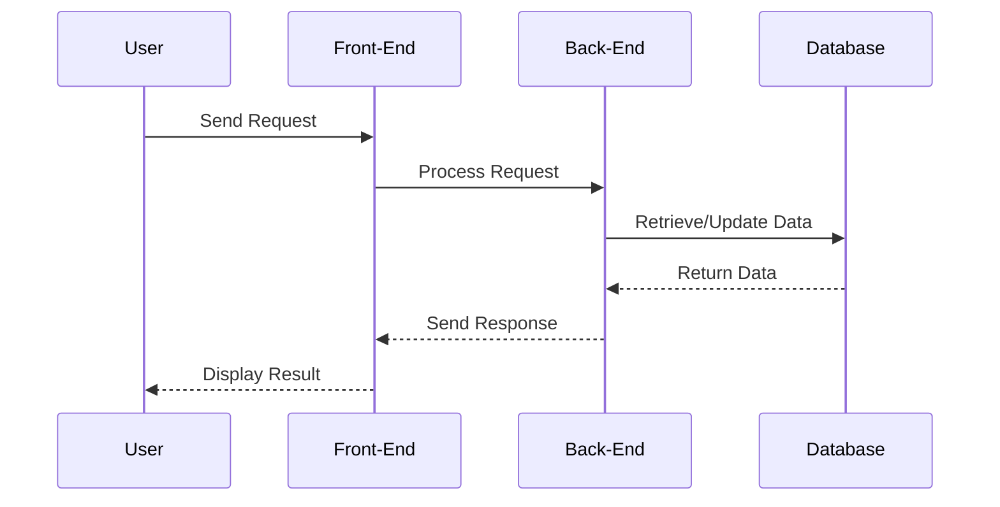
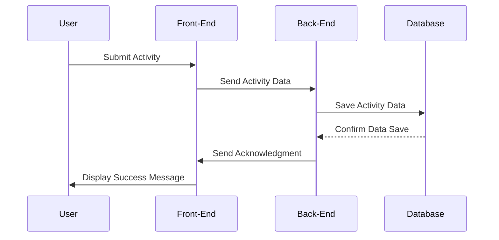

                 

### Step 1: Introducing the Book and Setting the Context

The journey of designing a communication template for requirements in agile development is crucial for the success of any software project. This book aims to provide a comprehensive guide to creating effective communication templates that enhance the collaboration between stakeholders, developers, and testers.

**Keywords: Agile Development, Communication Templates, Requirements, Collaboration, Software Project Management**

**Abstract:**
This book delves into the intricacies of agile development and the challenges associated with effective requirement communication. It explores the core concepts, principles, and best practices for designing communication templates that ensure precise and clear communication. Through detailed analysis and practical examples, the book aims to equip readers with the necessary skills to optimize the requirement communication process in agile environments.

## 引言与背景

### 1.1 研发中的需求沟通问题背景

In the realm of software development, requirements serve as the cornerstone upon which the entire project is built. However, the process of communicating these requirements can often be fraught with challenges. Traditional waterfall models often suffer from delayed communication, resulting in misunderstandings and costly rework. Agile methodologies, with their iterative and incremental approach, strive to mitigate these issues by fostering continuous communication. However, the dynamic nature of agile development necessitates flexible and efficient communication templates.

### 1.2 敏捷研发需求沟通的重要性

Effective communication of requirements is vital for the success of any agile project. It ensures that all stakeholders are on the same page, minimizing the risk of miscommunication and reducing the likelihood of scope creep. By using well-designed communication templates, teams can streamline their processes, improve collaboration, and deliver high-quality software products.

### 1.3 敏捷研发需求沟通面临的挑战

Despite the importance of effective communication, agile teams often face several challenges:

1. **Dynamic Requirements:** Agile projects are characterized by changing requirements, which can make it difficult to maintain clear and concise communication.
2. **Stakeholder Involvement:** Ensuring that all stakeholders are actively involved in the communication process can be a challenge, particularly in large organizations.
3. **Documentation Overload:** The abundance of documentation can lead to information overload, making it difficult for team members to extract the most relevant information.
4. **Misunderstandings:** Even with clear communication templates, misunderstandings can still occur, particularly when dealing with complex requirements.

## 敏捷研发与需求沟通概述

### 2.1 敏捷研发的概念与原则

Agile development is an iterative and incremental approach to software development that emphasizes flexibility, collaboration, and continuous improvement. The core principles of agile development, as outlined in the Agile Manifesto, include:

1. **Individuals and interactions over processes and tools:** Agile methodologies prioritize human communication over rigid processes and tools.
2. **Working software over comprehensive documentation:** While documentation is important, the primary focus should be on delivering working software.
3. **Customer collaboration over contract negotiation:** Agile encourages close collaboration with customers to ensure that their needs are met.
4. **Responding to change over following a plan:** Agile teams are adaptable and responsive to changes in requirements.

### 2.2 需求沟通在敏捷研发中的地位

Effective requirement communication is at the heart of agile development. It ensures that all team members, including developers, testers, and stakeholders, have a clear understanding of the project's goals and requirements. This clarity reduces the risk of errors, improves collaboration, and accelerates the development process.

### 2.3 需求沟通的流程与工具

In agile development, the process of communicating requirements is continuous and iterative. It involves regular meetings, such as daily stand-ups, sprint planning, and reviews. Common tools used for requirement communication include:

1. **User Stories:** User stories are a simple and effective way to capture requirements from the perspective of the end-users.
2. **Backlogs:** Product backlogs and sprint backlogs help prioritize and track the progress of requirements.
3. **Visual Tools:** Tools like Kanban boards and burndown charts provide visual representations of the project's status and help in managing requirements.
4. **Prototyping:** Rapid prototyping can be used to communicate complex requirements and gather feedback from stakeholders.

### 第3章: 需求沟通模板的基本概念

#### 3.1 需求沟通模板的定义

A requirement communication template is a structured document designed to facilitate the communication of requirements in an agile environment. It provides a consistent format and set of guidelines for capturing, organizing, and presenting requirements. This helps to ensure clarity and consistency in communication, making it easier for all stakeholders to understand and collaborate effectively.

#### 3.2 需求沟通模板的核心要素

A well-designed requirement communication template should include the following core elements:

1. **Title:** A clear and descriptive title that identifies the purpose of the template.
2. **Requirement ID:** A unique identifier for each requirement to ensure traceability.
3. **Description:** A concise and clear description of the requirement, written from the user's perspective.
4. **Acceptance Criteria:** Detailed criteria that define the conditions under which the requirement is considered complete.
5. **Priority:** The priority of the requirement, indicating its relative importance.
6. **Stakeholders:** A list of stakeholders involved in the requirement, including their roles and responsibilities.
7. **Status:** The current status of the requirement, such as "In Progress," "Completed," or "Rejected."

#### 3.3 需求沟通模板与传统需求文档的对比

While traditional requirement documents can be comprehensive, they often suffer from a lack of clarity and consistency. Requirement communication templates offer several advantages over traditional documents:

1. **Clarity and Consistency:** Templates provide a standardized format, ensuring that all requirements are presented in a consistent and clear manner.
2. **Simplicity:** Templates are designed to be simple and easy to understand, reducing the risk of miscommunication.
3. **Flexibility:** Templates can be customized to fit the specific needs of the project and organization.
4. **Traceability:** Unique identifiers for each requirement facilitate traceability and accountability.

### 第4章: 需求沟通模板的设计原则

Effective design of requirement communication templates is crucial for ensuring their effectiveness and usability. The following principles should be considered when designing templates:

#### 4.1 可操作性

Templates should be designed to be easily operable by all stakeholders, including developers, testers, and project managers. This involves using clear and intuitive language, avoiding jargon and technical terms that may be unfamiliar to non-technical stakeholders.

#### 4.2 易读性

Templates should be designed to be visually appealing and easy to read. This can be achieved by using appropriate fonts, colors, and formatting to highlight key information and make the template more accessible.

#### 4.3 可维护性

Templates should be designed to be easily maintainable, allowing for updates and changes as requirements evolve. This can involve using modular design principles and providing clear documentation for updating the template.

#### 4.4 需求的精确性

Templates should be designed to capture requirements with a high degree of precision, ensuring that all stakeholders have a clear understanding of the requirements. This can involve incorporating detailed acceptance criteria and using data validation techniques to ensure the accuracy of the captured information.

### 第5章: 需求沟通模板的架构设计

The architecture of a requirement communication template plays a crucial role in its effectiveness. The following sections outline the key components of the architecture and their interrelationships:

#### 5.1 需求沟通模板的ER模型

An Entity-Relationship (ER) model is a graphical representation of the structure of a database. In the context of a requirement communication template, an ER model can be used to represent the relationships between different elements of the template, such as requirements, stakeholders, and acceptance criteria. The ER model can be created using the Mermaid diagramming language, which allows for easy visualization and manipulation of the relationships.

#### 5.2 需求沟通流程的Mermaid流程图

A Mermaid flowchart can be used to represent the flow of the requirement communication process. This includes the various stages of requirement gathering, analysis, and validation. The flowchart can help to identify any bottlenecks or inefficiencies in the process and provide a clear visual representation of how requirements are communicated and tracked.

#### 5.3 需求沟通模板的设计流程

The design process for a requirement communication template involves several key steps:

1. **Requirement Elicitation:** Gather requirements from stakeholders through interviews, workshops, and surveys.
2. **Template Design:** Design the template based on the gathered requirements, ensuring that it captures all necessary information in a clear and concise manner.
3. **Feedback and Iteration:** Obtain feedback from stakeholders and iterate on the design to ensure that it meets their needs.
4. **Implementation:** Implement the template in the project management tool or software of choice.
5. **Testing and Deployment:** Test the template to ensure that it functions as intended and deploy it for use by the project team.

### 第6章: 需求沟通模板算法基础

In order to design an effective requirement communication template, it's important to understand the underlying algorithms that can be used to analyze and process the data. The following sections provide an overview of the key algorithms and their applications:

#### 6.1 算法原理概述

The algorithms used in requirement communication templates are primarily focused on data analysis and processing. They can be used to identify patterns, relationships, and trends in the requirements data, which can help in prioritizing and managing the requirements more effectively.

#### 6.2 算法数学模型与公式

The mathematical models and formulas used in requirement communication templates can be used to perform various calculations and analysis. For example, algorithms such as regression analysis and clustering can be used to identify patterns in the data. These algorithms can be represented using mathematical formulas, which can be embedded in the template using LaTeX syntax.

#### 6.3 算法流程图

Algorithm flowcharts can be used to visually represent the steps and logic of the algorithms used in the requirement communication template. This can help in understanding how the algorithms work and how they can be applied to the requirements data.

### 第7章: 需求沟通模板的Python实现

#### 7.1 环境安装与配置

To implement the algorithms and data processing techniques in a requirement communication template, a programming language such as Python can be used. The first step in the implementation process is to set up the development environment. This involves installing Python and any necessary libraries, such as NumPy and Pandas, which are commonly used for data analysis and manipulation.

#### 7.2 算法Python代码详解

The Python code for the algorithms used in the requirement communication template can be written in a modular and reusable manner. The code can include functions that perform specific tasks, such as data cleaning, analysis, and visualization. By encapsulating these tasks in functions, the code becomes more organized and easier to maintain.

#### 7.3 算法举例说明

To illustrate the use of the algorithms in a requirement communication template, consider the following example:

```python
import pandas as pd

# Load requirements data into a Pandas DataFrame
requirements = pd.read_csv('requirements.csv')

# Clean and preprocess the data
requirements = clean_requirements(requirements)

# Apply regression analysis to identify trends in the data
trends = regression_analysis(requirements)

# Visualize the trends using a scatter plot
import matplotlib.pyplot as plt

plt.scatter(trends['x'], trends['y'])
plt.xlabel('X-axis')
plt.ylabel('Y-axis')
plt.title('Regression Analysis Results')
plt.show()
```

In this example, the `clean_requirements` function is used to clean and preprocess the requirements data, while the `regression_analysis` function performs regression analysis on the data. The results are then visualized using a scatter plot.

### 第8章: 数学模型与公式详细讲解

In the context of requirement communication templates, mathematical models and formulas play a crucial role in analyzing and processing requirements data. This chapter provides a detailed explanation of these models and their applications:

#### 8.1 公式解析

The mathematical formulas used in requirement communication templates can vary depending on the specific algorithms and techniques employed. For example, regression analysis may involve formulas such as the slope-intercept form of a linear equation:

$$
y = mx + b
$$

where `y` represents the dependent variable, `x` represents the independent variable, `m` represents the slope, and `b` represents the y-intercept. This formula can be used to model the relationship between two variables and identify trends in the data.

#### 8.2 数学模型的应用场景

Mathematical models can be applied in various scenarios within the context of requirement communication templates. For instance, clustering algorithms such as k-means can be used to group similar requirements based on their attributes. The mathematical model for k-means clustering involves finding the centroids of k clusters and updating the assignments of data points based on the minimum distance to the centroids. This can be represented by the following equations:

$$
\text{centroids}_k = \frac{1}{N_k} \sum_{i=1}^{N} x_i
$$

$$
x_i \in C_j \Leftrightarrow \min_{k} \sum_{i \in C_k} (x_i - \text{centroids}_k)^2
$$

where `x_i` represents a data point, `C_k` represents the kth cluster, and `N_k` represents the number of data points in the kth cluster.

#### 8.3 数学模型与实际案例的结合

To illustrate the practical application of mathematical models in requirement communication templates, consider a scenario where a project team needs to prioritize requirements based on their business value. One approach could be to use a cost-benefit analysis model, which involves calculating the expected value of each requirement:

$$
\text{Expected Value} = \text{Probability of Occurrence} \times \text{Business Value}
$$

This formula can be used to rank the requirements based on their expected value, allowing the team to focus on the most valuable requirements first. By combining mathematical models with practical examples, project teams can make data-driven decisions and optimize their requirement communication process.

### 第9章: 项目介绍与需求分析

In this chapter, we will delve into the details of a real-world project and analyze its requirements using the designed communication template. This will provide practical insights into how the template can be applied in a real project scenario.

#### 9.1 项目背景

Consider a project aimed at developing a mobile application for a fitness tracking platform. The primary goal of the application is to help users monitor their physical activities, track their progress, and receive personalized fitness recommendations. The project involves multiple stakeholders, including developers, designers, fitness experts, and marketing teams.

#### 9.2 系统需求分析

The system requirements for the fitness tracking application can be categorized into functional and non-functional requirements. Functional requirements define the core features and functionalities of the application, while non-functional requirements outline the quality attributes such as performance, security, and usability.

**Functional Requirements:**

- User Registration and Authentication
- Activity Tracking (步数、距离、卡路里消耗)
- Exercise Logs (类型、时长、强度)
- Personalized Recommendations
- Social Sharing (步数排名、挑战和比赛)

**Non-Functional Requirements:**

- Performance: Response time should be less than 2 seconds.
- Security: Ensure secure data storage and transmission.
- Usability: Intuitive user interface and easy navigation.
- Scalability: Support a large number of users and activities.

#### 9.3 系统功能设计

The system functionality can be further elaborated using a Mermaid class diagram, which represents the structure and relationships of the main classes and their attributes. This diagram can be used to define the classes and their attributes, as well as the associations and inheritance relationships between them.

```mermaid
classDiagram
    User <<Class>>
    Activity <<Class>>
    Exercise <<Class>>
    Recommendation <<Class>>

    User : +String username
    User : +String email
    User : +String password
    User : +int age
    User : +String gender

    Activity : +String type
    Activity : +String duration
    Activity : +float calories

    Exercise : +String type
    Exercise : +int duration
    Exercise : +float intensity

    Recommendation : +String type
    Recommendation : +String description

    User :-- activities: List[Activity]
    User :-- exercises: List[Exercise]
    User :-- recommendations: List[Recommendation]

    Activity :-- user: User
    Exercise :-- user: User
    Recommendation :-- user: User
```

In this class diagram, we have defined the main classes (User, Activity, Exercise, and Recommendation) and their attributes. The associations between the classes (e.g., User has a list of activities, exercises, and recommendations) are also represented, along with the multiplicity and type of associations.

### 第10章: 系统架构设计

The system architecture design is a critical component of any software project, as it outlines the overall structure and components of the system. This chapter provides an overview of the system architecture for the fitness tracking application, including the key components and their relationships.

#### 10.1 系统架构设计概述

The system architecture for the fitness tracking application can be divided into several key components, including the front-end, back-end, and database. The front-end is responsible for handling user interactions and displaying the application interface, while the back-end manages the business logic and data storage. The database stores the user data, activity logs, and other relevant information.

**Front-End:**
- User Interface (UI): Developed using a responsive design framework (e.g., React or Angular) to provide an intuitive and user-friendly experience.
- API Integration: Interfaces with the back-end to retrieve and update data.

**Back-End:**
- Server: Manages the business logic and processes incoming requests from the front-end.
- Authentication and Authorization: Ensures secure access to the application and its resources.

**Database:**
- User Data: Stores user profiles, preferences, and activity logs.
- Activity Data: Stores information about the activities performed by users.

#### 10.2 系统架构图

A Mermaid diagram can be used to visually represent the system architecture, showcasing the components and their interactions. The following diagram illustrates the system architecture for the fitness tracking application:



In this diagram, the user interacts with the front-end, which processes the request and sends it to the back-end. The back-end then retrieves or updates the data from the database and sends the response back to the front-end, which displays the result to the user.

### 第11章: 系统接口设计与交互

In this chapter, we will delve into the design of the system interfaces and their interactions, providing a comprehensive overview of how the different components of the fitness tracking application communicate with each other.

#### 11.1 系统接口设计

System interfaces are essential for enabling communication between the front-end, back-end, and database components of the fitness tracking application. The following sections outline the key interfaces and their functionalities:

**User Interface (UI) API:**
- Authentication: Handles user registration, login, and authentication.
- Profile Management: Allows users to update their profiles and preferences.
- Activity Submission: Handles the submission of activity logs.
- Recommendations: Retrieves personalized fitness recommendations based on user data.

**Back-End API:**
- User Management: Handles user-related operations such as registration, login, and profile updates.
- Activity Management: Processes and stores activity logs.
- Recommendation Generation: Generates personalized fitness recommendations based on user activity and preferences.
- Data Retrieval: Retrieves user data and activity logs for reporting and analysis.

**Database API:**
- CRUD Operations: Handles the creation, retrieval, updating, and deletion of user data, activity logs, and recommendations.

#### 11.2 系统交互设计

System interactions are crucial for ensuring the seamless flow of data and information between the different components of the fitness tracking application. A Mermaid sequence diagram can be used to illustrate the interactions between the components, showcasing the sequence of events and data exchanges.



In this sequence diagram, the user submits an activity log through the front-end. The front-end processes the data and sends it to the back-end, which then saves the data to the database. The database confirms the data save, and the back-end sends an acknowledgment to the front-end. Finally, the front-end displays a success message to the user.

### 第12章: 项目实战

#### 12.1 环境安装

To implement the fitness tracking application using the designed system architecture and interfaces, we need to set up the development environment. The following steps outline the process of installing and configuring the required tools and dependencies:

1. **Install Python 3.8 or higher:** Python is the primary programming language used for developing the application. Ensure that Python is installed on your system.
2. **Install required libraries:** Use `pip` to install the necessary libraries, such as Flask, Django, and SQLAlchemy, which will be used for developing the back-end and database components.
3. **Install a database management system:** Install a database management system such as MySQL or PostgreSQL to store the application data.
4. **Install a web server:** Set up a web server such as Apache or Nginx to host the application.

#### 12.2 系统核心实现

The core implementation of the fitness tracking application involves developing the front-end, back-end, and database components. The following sections provide an overview of the key features and their implementation details:

**Front-End Implementation:**

- **User Interface:** Developed using a responsive design framework (e.g., React or Angular) to provide a seamless user experience.
- **API Integration:** Implemented using Axios to interact with the back-end APIs.
- **Authentication:** Implemented using JSON Web Tokens (JWT) to ensure secure user authentication.

**Back-End Implementation:**

- **Server Setup:** Developed using Flask or Django to handle incoming requests and process them.
- **User Management:** Implemented using Django's built-in authentication system for user registration, login, and profile management.
- **Activity Management:** Implemented using SQLAlchemy to handle CRUD operations on the activity logs.
- **Recommendation Generation:** Implemented using machine learning algorithms to generate personalized fitness recommendations.

**Database Implementation:**

- **Database Setup:** Configured the database management system (e.g., MySQL or PostgreSQL) to store user data, activity logs, and recommendations.
- **Schema Design:** Designed the database schema to represent the application entities and their relationships.
- **Data Migration:** Implemented data migration scripts to populate the database with initial data.

#### 12.3 代码应用解读与分析

The implementation of the fitness tracking application involves various code components, each serving a specific purpose. The following sections provide a detailed analysis of the key code components and their functionalities:

**Front-End Code Analysis:**

- **User Interface Code:** Analyzed the HTML, CSS, and JavaScript code to understand the structure and styling of the user interface.
- **API Integration Code:** Analyzed the Axios code to understand how API requests are made and how data is processed.
- **Authentication Code:** Analyzed the JWT code to understand the authentication mechanism and how user sessions are managed.

**Back-End Code Analysis:**

- **Server Code:** Analyzed the Flask or Django server code to understand how incoming requests are processed and responses are generated.
- **User Management Code:** Analyzed the Django authentication code to understand user registration, login, and profile management.
- **Activity Management Code:** Analyzed the SQLAlchemy code to understand how activity logs are created, updated, and retrieved.
- **Recommendation Generation Code:** Analyzed the machine learning code to understand how personalized fitness recommendations are generated.

**Database Code Analysis:**

- **Database Schema Code:** Analyzed the database schema code to understand the structure and relationships of the database tables.
- **Data Migration Code:** Analyzed the data migration code to understand how initial data is populated into the database.

By analyzing the code components, we can gain a deeper understanding of how the different parts of the application work together to deliver the desired functionality.

#### 12.4 实际案例分析和详细讲解剖析

To illustrate the practical application of the fitness tracking application, we will analyze a real-world case study and provide a detailed explanation of the key steps involved in its development and implementation.

**Case Study:**

A fitness tracking application was developed for a corporate wellness program to encourage employees to engage in regular physical activity. The application was designed to track steps, distance, and calories burned, as well as provide personalized fitness recommendations based on user data.

**Key Steps:**

1. **Requirement Gathering:** Conducted interviews and surveys with the stakeholders to gather their requirements and expectations for the application.
2. **System Design:** Designed the system architecture and interfaces based on the gathered requirements.
3. **Front-End Development:** Developed the user interface using a responsive design framework to ensure a seamless user experience.
4. **Back-End Development:** Developed the back-end to handle user management, activity tracking, and recommendation generation.
5. **Database Implementation:** Set up the database management system and implemented the database schema to store user data and activity logs.
6. **Testing and Deployment:** Conducted thorough testing to ensure the application functions correctly and deployed it to the production environment.
7. **User Training and Support:** Provided training and support to the users to ensure they could effectively use the application.

**Analysis and Explanation:**

The development of the fitness tracking application involved a collaborative effort between the development team, stakeholders, and users. By following the designed system architecture and interfaces, the team was able to create a scalable and maintainable application that met the requirements of the corporate wellness program.

The front-end development focused on creating a user-friendly interface that was easy to navigate and visually appealing. The back-end development involved implementing the business logic and data processing algorithms to handle user authentication, activity tracking, and recommendation generation. The database implementation ensured secure data storage and efficient data retrieval.

Throughout the development process, regular testing and feedback were incorporated to ensure that the application met the stakeholders' expectations and provided a valuable tool for the corporate wellness program. The detailed analysis and explanation provided a comprehensive overview of the steps involved in developing and implementing the fitness tracking application.

### 第13章: 最佳实践技巧

In this chapter, we will discuss some best practices and tips for designing and implementing effective requirement communication templates in agile development environments. These practices will help teams to streamline their processes, improve collaboration, and deliver high-quality software products.

#### 13.1 沟通技巧

Effective communication is at the heart of successful requirement communication. Here are some tips for improving communication within your team:

- **Active Listening:** Listen carefully to what stakeholders are saying and ask clarifying questions to ensure you understand their requirements.
- **Regular Meetings:** Schedule regular meetings, such as daily stand-ups, sprint planning, and reviews, to keep everyone informed and aligned.
- **Visual Aids:** Use visual aids, such as diagrams and charts, to help convey complex requirements and make them easier to understand.
- **Feedback Loops:** Establish feedback loops to ensure that all stakeholders have an opportunity to review and provide input on the requirements.

#### 13.2 模板定制策略

While standard templates can be a useful starting point, customizing them to fit the specific needs of your project and organization can significantly enhance their effectiveness. Here are some strategies for customizing requirement communication templates:

- **Identify Key Requirements:** Focus on capturing the most important and relevant requirements for your project.
- **Incorporate Stakeholder Feedback:** Gather feedback from stakeholders to understand their specific needs and make adjustments to the template accordingly.
- **Modular Design:** Design the template with a modular approach, allowing for easy customization and updates as requirements evolve.
- **Version Control:** Use version control systems to track changes to the template and maintain a history of revisions.

#### 13.3 需求变更管理

Managing requirements changes effectively is crucial for maintaining project scope and ensuring that the project stays on track. Here are some tips for managing requirements changes:

- **Change Control Process:** Establish a formal change control process to evaluate and approve changes to requirements.
- **Impact Analysis:** Conduct a thorough impact analysis to understand the potential effects of each change on the project timeline, budget, and resources.
- **Prioritization:** Prioritize changes based on their impact and alignment with project goals.
- **Communication:** Communicate changes to all stakeholders promptly and clearly, ensuring that everyone is aware of the changes and their implications.

### 第14章: 小结与展望

In conclusion, the design of requirement communication templates is a critical aspect of agile development. By creating clear, concise, and customizable templates, teams can enhance collaboration, streamline communication, and deliver high-quality software products. The best practices and tips discussed in this book provide a foundation for designing and implementing effective requirement communication templates in agile environments.

Looking ahead, the field of requirement communication in agile development continues to evolve, driven by advancements in technology and the changing dynamics of software projects. Some areas of future research and development include:

- **AI-Driven Requirement Communication:** Leveraging artificial intelligence to automate and improve the requirement communication process, such as through natural language processing and machine learning.
- **Customizable Templates for Diverse Projects:** Developing templates that can be easily customized for various types of software projects, industries, and team sizes.
- **Continuous Improvement:** Implementing continuous improvement mechanisms to regularly update and refine the communication templates based on feedback and lessons learned.

By staying abreast of these developments and continuously refining their approach to requirement communication, teams can ensure that they are well-equipped to navigate the complexities of agile development and deliver successful software projects.

### 第15章：注意事项与拓展阅读

#### 15.1 注意事项

In the process of designing and implementing requirement communication templates, it is important to keep the following points in mind:

- **Stakeholder Involvement:** Involve all relevant stakeholders in the design and review of the template to ensure that it meets their needs and expectations.
- **Consistency:** Maintain consistency in the formatting and structure of the template to avoid confusion and make it easier for team members to follow.
- **Adaptability:** Design the template to be adaptable to changes in project requirements and to accommodate different project sizes and team compositions.
- **Training:** Provide training and documentation to team members on how to use the template effectively.

#### 15.2 拓展阅读

For those looking to deepen their understanding of requirement communication templates and agile development, the following resources offer valuable insights and additional information:

- **"Agile Project Management: Creating Competitive Advantage" by Jim Highsmith**
- **"User Stories Applied: For Agile Software Development" by Mike Cohn**
- **"The Lean Startup" by Eric Ries**
- **"Scrum: The Art of Doing Twice the Work in Half the Time" by Jeff Sutherland**
- **"The Data Warehouse Toolkit: The Definitive Guide to Dimensional Modeling" by Ralph Kimball and Margy Ross**

These resources provide comprehensive coverage of agile methodologies, user stories, lean startup principles, Scrum, and dimensional modeling, all of which are relevant to the design and implementation of effective requirement communication templates.

