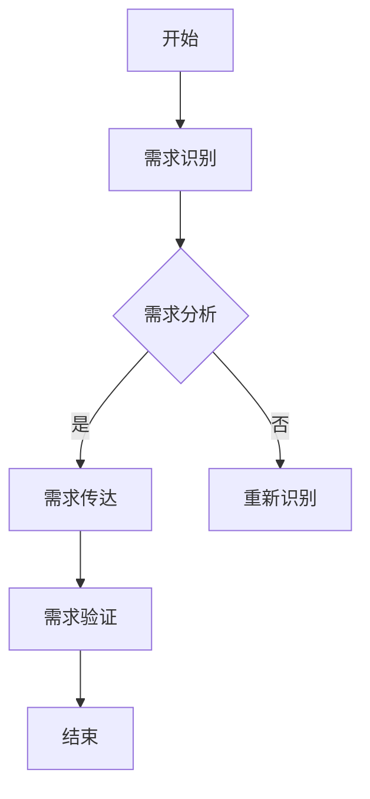

                 


# 敏捷研发中的需求沟通渠道多样化

> 关键词：敏捷研发、需求沟通、多样化、面对面沟通、书面沟通、异步沟通、虚拟沟通、混合沟通

> 摘要：本文深入探讨了敏捷研发中的需求沟通渠道的多样化，分析了面对面沟通、书面沟通、异步沟通、虚拟沟通和混合沟通等多种沟通方式的优势与挑战，并提供了最佳实践和案例，以帮助敏捷团队提升需求沟通的效果。

## 背景介绍

### 核心概念术语说明

在敏捷研发中，需求沟通是一个至关重要的环节。需求沟通涉及到以下几个核心概念：

1. **敏捷研发（Agile Development）**：一种以迭代和增量为特点的软件开发方法，强调快速响应变化、持续交付价值。
2. **需求（Requirement）**：项目必须满足的条件或规范，是软件开发的核心输入。
3. **沟通渠道（Communication Channel）**：用于信息交换的媒介，如面对面、书面、异步、虚拟等。
4. **沟通效果（Communication Effectiveness）**：沟通达到预期目标的程度。

### 问题背景

随着软件项目的复杂度增加，团队成员间的沟通需求变得日益重要。然而，传统的沟通方式往往存在一定的局限性：

- **面对面沟通**：虽然效果较好，但受时间和空间的限制。
- **书面沟通**：易于存档和追溯，但信息传递效率较低。
- **异步沟通**：适合远程团队，但信息更新不及时。
- **虚拟沟通**：借助工具进行远程互动，但存在技术障碍。

### 问题描述

在敏捷研发中，如何选择合适的沟通渠道，以实现高效的需求沟通，成为一个关键问题。不同团队和组织在不同情况下可能有不同的需求，因此需要一种灵活且多样化的沟通策略。

### 问题解决

为了解决上述问题，本文将探讨以下内容：

1. **核心概念与联系**：介绍敏捷研发和需求沟通的相关概念，并分析它们之间的联系。
2. **多样化的需求沟通渠道**：详细讨论面对面沟通、书面沟通、异步沟通、虚拟沟通和混合沟通等多种渠道。
3. **最佳实践与案例分析**：总结最佳实践，并提供实际案例以供参考。

### 边界与外延

本文主要关注敏捷研发中的需求沟通，但不限于软件开发领域。其他类型的敏捷项目，如产品研发、项目管理等，也可参照本文的方法和经验。

### 概念结构与核心要素组成

敏捷研发中的需求沟通可以分解为以下几个核心要素：

1. **需求识别**：识别和理解项目需求。
2. **需求分析**：对需求进行深入分析，确保理解准确。
3. **需求传达**：将需求传达给开发团队。
4. **需求验证**：验证需求是否得到正确实现。
5. **沟通渠道选择**：选择合适的沟通渠道以提升沟通效果。

## 核心概念与联系

### 敏捷研发

敏捷研发是一种以人为核心、迭代和增量为特点的软件开发方法。其核心原则包括：

- **客户满意度**：快速响应客户需求，持续交付价值。
- **迭代开发**：项目分为多个迭代，每次迭代交付可用的软件版本。
- **增量式开发**：逐步完善软件功能，而非一次性完成。
- **团队协作**：强调团队成员间的协作和沟通。

### 需求沟通

需求沟通是敏捷研发中的关键环节。有效的需求沟通有助于确保项目方向正确，减少误解和沟通成本。需求沟通的主要任务包括：

- **需求识别**：通过访谈、问卷调查等方式收集用户需求。
- **需求分析**：对需求进行深入分析，确保理解准确。
- **需求传达**：将需求传达给开发团队，确保每个人都清楚了解项目目标。
- **需求验证**：验证需求是否得到正确实现。

### 沟通渠道

沟通渠道是信息交换的媒介。根据沟通形式的不同，沟通渠道可以分为：

- **面对面沟通**：直接面对面交流，效果较好。
- **书面沟通**：通过文档、邮件等方式交流，易于存档。
- **异步沟通**：通过工具进行异步交流，适用于远程团队。
- **虚拟沟通**：借助虚拟工具进行远程互动。

### 沟通效果

沟通效果是指沟通达到预期目标的程度。有效的需求沟通应具备以下特点：

- **准确性**：信息传递准确无误。
- **及时性**：信息传递及时，减少沟通延迟。
- **可追溯性**：沟通记录易于追溯和查询。
- **参与度**：团队成员积极参与沟通，提高项目成功率。

## 多样化的需求沟通渠道

### 面对面沟通

#### 优势

- **互动性**：直接面对面交流，便于实时沟通和反馈。
- **效率**：信息传递速度快，减少误解和沟通成本。
- **信任**：有助于建立团队成员之间的信任和合作关系。

#### 策略

- **明确目的**：每次面对面沟通前明确交流目标和议程。
- **充分准备**：准备相关文档和数据，确保交流内容准确。
- **倾听和提问**：积极倾听对方意见，提出问题以深入探讨。

#### 挑战

- **时间和空间限制**：需要团队成员在同一地点和时间进行交流。
- **环境因素**：会议室环境、设备等可能影响沟通效果。

### 书面沟通

#### 形式

- **文档**：如需求文档、设计文档、用户手册等。
- **邮件**：用于正式的、书面的交流。
- **报告**：如项目进展报告、风险评估报告等。

#### 技巧

- **清晰**：表达简洁明了，避免使用复杂术语。
- **结构化**：按照逻辑顺序组织内容，便于阅读和理解。
- **明确**：明确目标、需求、要求等，减少误解。

#### 优缺点

**优点**：

- **易于存档**：书面沟通记录易于存档和追溯。
- **便于分享**：书面文档可以方便地分享和传递。
- **可追溯**：沟通记录可以用于后续的审计和评审。

**缺点**：

- **信息传递效率低**：书面沟通需要时间整理和撰写。
- **互动性差**：无法实时反馈和互动。

### 异步沟通

#### 渠道

- **即时通讯工具**：如微信、QQ、Slack 等。
- **邮件列表**：用于发布重要信息。
- **论坛和社区**：如 Stack Overflow、GitHub 等。
- **共享文档**：如 Google Docs、Confluence 等。

#### 优势

- **灵活性**：适合不同时区和工作习惯的团队。
- **便捷性**：随时随地进行交流，不受时间和地点限制。
- **信息更新及时**：信息可以实时更新，便于团队成员查阅。

#### 注意事项

- **及时性**：确保重要信息及时传达和反馈。
- **明确性**：避免使用模糊或歧义性语言。
- **互动性**：鼓励团队成员积极参与沟通，提高参与度。

### 虚拟沟通

#### 工具

- **视频会议**：如 Zoom、Microsoft Teams 等。
- **音频通话**：如 Skype、微信语音等。
- **共享屏幕**：如 TeamViewer、AnyDesk 等。
- **虚拟现实（VR）**：用于增强虚拟沟通体验。

#### 技巧

- **准备充分**：确保网络稳定，提前测试设备。
- **积极互动**：鼓励团队成员积极参与，提出问题和反馈。
- **注意语言和语气**：保持礼貌和尊重，避免误解和冲突。

#### 挑战

- **技术问题**：如网络延迟、设备故障等。
- **参与度**：远程团队成员可能缺乏参与感和互动性。
- **时间管理**：确保沟通会议有效利用时间。

### 混合沟通

#### 模式

- **混合面对面沟通**：部分团队成员面对面交流，其他成员通过视频会议参与。
- **混合书面沟通**：部分内容通过书面文档交流，其他内容通过异步或虚拟沟通方式。
- **混合异步沟通**：部分内容通过即时通讯工具交流，其他内容通过书面文档或论坛等。

#### 优势

- **灵活**：根据实际情况选择合适的沟通渠道。
- **高效**：结合了面对面和异步沟通的优势，提高沟通效果。
- **适应性强**：适用于不同类型的项目和团队。

#### 实践案例

- **跨部门沟通**：不同部门的团队成员通过混合沟通方式，实现高效的需求沟通。
- **远程团队协作**：混合沟通方式有助于远程团队成员保持紧密联系。

## 最佳实践与案例分析

### 最佳实践

#### 沟通渠道的选择

1. **项目特点**：根据项目的特点和需求，选择合适的沟通渠道。
2. **团队结构**：考虑团队成员的分布和工作习惯，选择适合的沟通方式。
3. **沟通频率**：根据项目进度和需求变化，调整沟通频率和渠道。

#### 最佳沟通工具的运用

1. **即时通讯工具**：适用于快速交流和实时反馈。
2. **共享文档平台**：便于团队成员协作和文档管理。
3. **项目管理工具**：如 Jira、Trello 等，用于跟踪项目进度和任务分配。

#### 最佳沟通策略的实施

1. **明确沟通目标**：每次沟通前明确目标，确保沟通内容有针对性。
2. **及时反馈**：鼓励团队成员及时反馈，确保问题得到及时解决。
3. **定期回顾**：定期回顾沟通效果，优化沟通策略。

### 案例分析

#### 案例一：高效的需求沟通

某软件公司采用混合沟通方式，实现高效的需求沟通。他们通过视频会议进行面对面交流，同时使用共享文档平台和即时通讯工具进行异步沟通。这种混合沟通方式有助于团队成员紧密联系，提高项目进度和质量。

#### 案例二：需求沟通的困境与突破

某创业公司在初创阶段，团队成员分布在国内外。由于时差和地理位置的限制，传统沟通方式效果不佳。后来，他们采用异步沟通和虚拟沟通方式，通过共享文档平台和视频会议工具，实现高效的需求沟通。这种多样化的沟通方式有助于提高团队成员的参与度和项目成功率。

#### 案例三：跨部门沟通的实践

某大型企业内部不同部门之间需要密切协作，实现高效的需求沟通。他们采用混合沟通方式，通过视频会议和即时通讯工具进行面对面和异步沟通。同时，使用项目管理工具跟踪项目进度和任务分配。这种多样化的沟通方式有助于跨部门团队高效协作，提高项目交付质量。

## 总结与展望

### 总结

本文深入探讨了敏捷研发中的需求沟通渠道多样化，分析了面对面沟通、书面沟通、异步沟通、虚拟沟通和混合沟通等多种渠道的优势与挑战。通过最佳实践和案例分析，为敏捷团队提供了实用的沟通策略和工具。

### 展望

随着科技的不断发展，需求沟通渠道将更加多样化。未来，虚拟现实、增强现实等新技术将应用于需求沟通，提高沟通效果。同时，人工智能和大数据分析也将为需求沟通提供智能化支持，助力敏捷研发团队实现高效协作。

### 对敏捷研发的启示

1. **灵活选择沟通渠道**：根据项目特点和团队需求，灵活选择合适的沟通渠道。
2. **注重沟通效果**：关注沟通效果，及时反馈和优化沟通策略。
3. **多样化沟通方式**：结合多种沟通方式，提高沟通效率和团队协作。
4. **持续改进**：不断总结经验，优化沟通流程和方法。

## 作者信息

作者：AI天才研究院/AI Genius Institute & 禅与计算机程序设计艺术 /Zen And The Art of Computer Programming

---

请注意，本文为示例文章，实际字数和内容可能需要根据具体要求进行调整。同时，为了满足文章的完整性要求，每个部分都应包含具体的详细讲解和分析。以下是使用mermaid和LaTeX格式的一些示例：

### 数学公式示例

$$
E = mc^2
$$

### Mermaid流程图示例



### Mermaid类图示例

```mermaid
classDiagram
    Product <<class{产品}>
    Feature <<class{功能}>
    User <<class{用户}>
    
    Product o-- Feature
    User o-- Feature
```

在实际撰写文章时，应根据每个章节的内容需求，合理使用这些格式来增强文章的技术性和可读性。同时，确保所有代码、公式和图表都是准确无误的。文章的总体风格应保持专业、严谨且易于理解。在撰写过程中，请遵循文章结构，并确保每个部分的内容都是详细且具体的。

