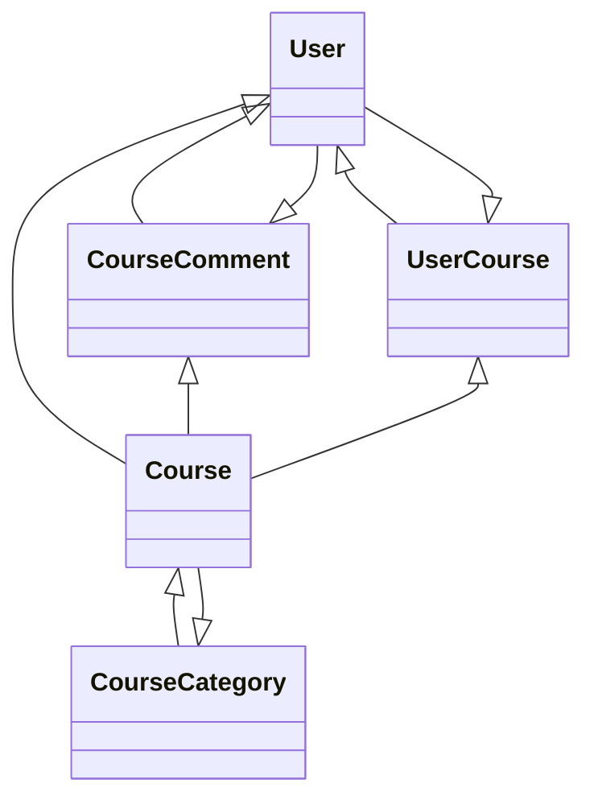
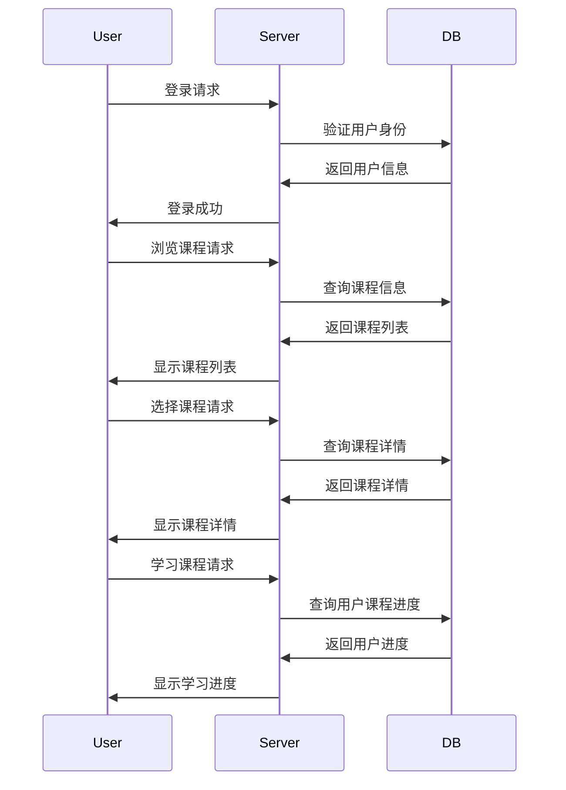
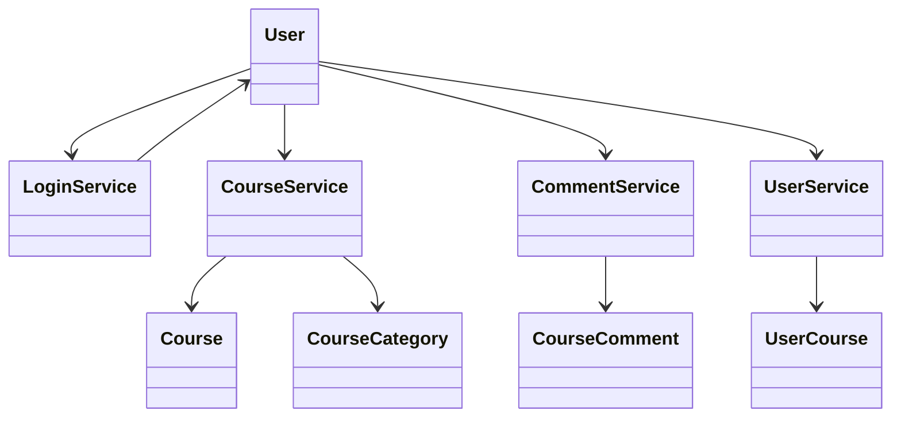
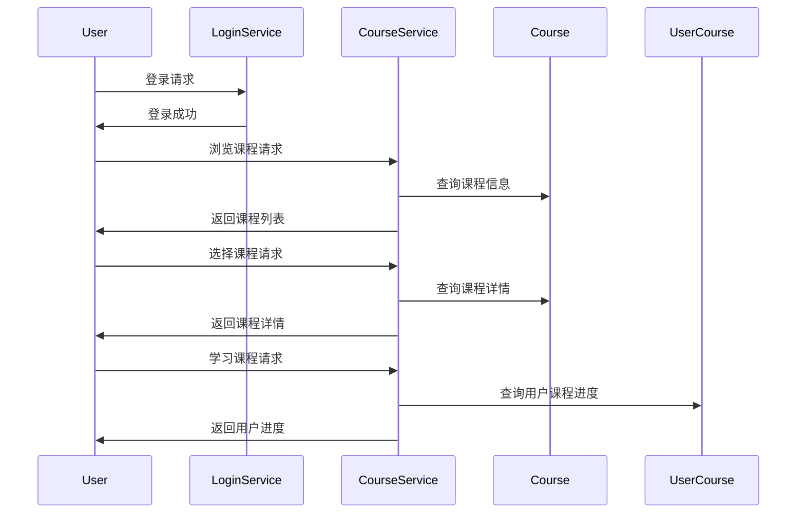

                 

## 《敏捷研发模式下的需求分析技巧》

> 关键词：敏捷研发、需求分析、用户故事、迭代、用户参与

> 摘要：本文将探讨敏捷研发模式下的需求分析技巧。通过分析敏捷研发模式的特点和需求分析的需求，介绍敏捷需求分析的核心概念、原理和算法，并结合实际案例进行详细讲解，帮助读者理解和掌握敏捷需求分析的方法和技巧。

### 第一部分：背景介绍

#### 1. 引言

1.1 问题背景

敏捷研发模式起源于20世纪90年代末，它旨在解决传统软件开发方法中存在的诸多问题，如需求变更频繁、开发周期长、项目风险高等。敏捷研发模式的核心特点包括快速迭代、持续交付和高度协作。在这种模式下，需求分析变得尤为重要。

1.2 问题描述

敏捷研发模式对需求分析提出了新的挑战：

- **快速响应需求变化**：在敏捷开发中，需求可能会在短时间内频繁变更。如何快速准确地分析需求，确保项目能够按时交付，是需求分析的一大难题。
- **提高需求质量**：敏捷开发强调用户参与和需求的高质量。如何确保需求明确、可测试、可估算，是需求分析的另一个关键问题。
- **减少需求遗漏**：在敏捷开发中，需求往往在多个迭代中逐渐暴露。如何确保所有需求都被识别和实现，是需求分析的又一挑战。

1.3 问题解决

本文将围绕以下问题展开讨论：

- 敏捷研发模式下的需求分析如何进行？
- 如何识别和定义用户需求？
- 如何平衡需求分析与其他开发环节的关系？
- 如何在实际项目中应用敏捷需求分析技巧？

通过回答这些问题，本文旨在为读者提供一套完整、实用的敏捷需求分析方法和工具。

#### 1.4 边界与外延

本文关注的是敏捷研发模式下的需求分析技巧，而不涉及其他软件开发过程和方法。具体包括：

- 敏捷需求分析的核心概念和原理
- 敏捷需求分析算法的设计和应用
- 实际项目中敏捷需求分析的方法和技巧

#### 1.5 概念结构与核心要素组成

1.5.1 敏捷研发模式

敏捷研发模式是一种以用户为中心、快速迭代和持续交付的软件开发方法。其核心要素包括：

- 用户参与：在需求分析、开发和测试等环节中，积极邀请用户或利益相关者参与。
- 快速迭代：将开发周期分成多个短周期（迭代），在每个迭代中逐步交付可用的软件功能。
- 持续交付：通过持续集成和持续部署，确保软件质量，快速响应用户需求。

1.5.2 需求分析

需求分析是软件开发过程中的重要环节，旨在理解、识别和定义用户需求。在敏捷研发模式下，需求分析需要具备以下特点：

- 快速响应：在短时间内识别和响应需求变化。
- 用户参与：积极邀请用户或利益相关者参与需求分析过程。
- 高质量：确保需求明确、可测试、可估算。

1.5.3 敏捷需求分析

敏捷需求分析是敏捷研发模式下的需求分析方法。它强调快速、灵活和用户参与，核心要素包括：

- 用户故事：描述用户需求的一种方法，通常包括用户角色、用户目标和场景。
- 迭代：敏捷开发中的基本工作周期，通常是2-4周。
- 用户参与：在需求分析过程中，用户或利益相关者的积极参与。

### 第二部分：核心概念与联系

#### 2.1 敏捷研发模式与需求分析的关系

敏捷研发模式与需求分析之间存在着密切的关系。敏捷研发模式强调用户参与、快速迭代和持续交付，这对需求分析提出了新的要求。

- **用户参与**：敏捷研发模式要求在需求分析过程中积极邀请用户或利益相关者参与，以提高需求质量，减少误解和冲突。
- **快速迭代**：在敏捷开发中，需求可能会在短时间内频繁变更。需求分析需要快速响应这些变化，确保项目能够按时交付。
- **持续交付**：敏捷研发模式要求持续交付高质量的软件功能。需求分析需要确保每个迭代中交付的功能都满足用户需求，从而提高用户满意度。

#### 2.2 核心概念原理

2.2.1 用户故事

用户故事是敏捷开发中描述用户需求的一种方法。它通常包括以下要素：

- **用户角色**：描述使用软件的用户或用户群体。
- **用户目标**：描述用户希望通过软件实现的目标。
- **场景**：描述用户在使用软件时的具体操作和场景。

用户故事通常具有以下特点：

- **简短**：用户故事应该尽量简短，以便于理解和传达。
- **明确**：用户故事应该明确，避免歧义和误解。
- **可测试**：用户故事应该具备可测试性，以便于验证是否实现。
- **可估算**：用户故事应该具备可估算性，以便于制定迭代计划和估算工作量。

2.2.2 迭代

迭代是敏捷开发中的基本工作周期。在每次迭代中，开发团队会完成一部分功能，并将其交付给用户。迭代通常具有以下特点：

- **短周期**：迭代周期通常是2-4周，以便于快速响应需求变化。
- **可调整**：在迭代过程中，开发团队可以根据实际情况调整迭代计划，以适应需求变化。
- **闭环**：每个迭代都是一个闭环，包括需求分析、设计、开发、测试和交付等环节。

2.2.3 用户参与

用户参与是敏捷开发的核心原则之一。在需求分析过程中，积极邀请用户或利益相关者参与，有助于提高需求质量，减少误解和冲突。用户参与的方式包括：

- **需求评审**：邀请用户或利益相关者参与需求评审，确保需求明确、可测试和可估算。
- **需求讨论**：与用户或利益相关者进行需求讨论，了解用户需求，澄清需求细节。
- **用户测试**：邀请用户或利益相关者参与软件测试，验证软件功能是否符合用户需求。

#### 2.3 概念属性特征对比表格

| 概念       | 描述                                                   | 特征                             |
| ---------- | ------------------------------------------------------ | ------------------------------ |
| 用户故事   | 描述用户需求的一种方法                               | 简短、明确、可测试、可估算     |
| 迭代       | 敏捷开发中的基本工作周期                             | 2-4周，可调整                   |
| 用户参与   | 用户或利益相关者在需求分析过程中的积极参与             | 提高需求质量、减少误解和冲突   |

#### 2.4 ER实体关系图架构

```mermaid
erDiagram
    User ||--|{ Story }
    Story ||--|{ Task }
    Task ||--|{ Sprint }
```

在上面的ER图架构中，用户（User）是故事的创建者，故事（Story）是任务（Task）的载体，任务（Task）是迭代（Sprint）的一部分。这种关系描述了敏捷研发模式中需求分析的核心要素及其相互关系。

### 第三部分：算法原理讲解

#### 3.1 敏捷需求分析算法的基本原理

敏捷需求分析算法旨在快速、准确地识别和定义用户需求，确保需求的高质量和可行性。其基本原理包括：

1. **用户故事映射**：将用户需求转化为用户故事，以便于管理和跟踪。用户故事通常包含用户角色、用户目标和场景，具有简短、明确、可测试和可估算的特点。
2. **迭代规划**：根据用户故事的重要性和优先级，制定迭代计划。在每次迭代中，开发团队会完成一部分用户故事，并将其交付给用户。
3. **用户参与**：在需求分析过程中，积极邀请用户或利益相关者参与，以提高需求质量，减少误解和冲突。用户参与的方式包括需求评审、需求讨论和用户测试。

#### 3.2 敏捷需求分析算法的数学模型

敏捷需求分析算法的数学模型主要包括以下几个部分：

1. **需求优先级**：基于用户故事的重要性和紧急性，对需求进行排序。需求优先级 = w_i × (e_i + c_i)，其中 w_i 为需求权重，e_i 为需求紧急性，c_i 为需求成本。
2. **需求实现成本**：根据需求实现所需的资源和时间，估算需求实现成本。需求实现成本 = f(n)，其中 n 为需求实现所需的工作量。
3. **风险评估**：对需求实现过程中可能遇到的风险进行评估，以便采取相应的应对措施。风险评估通常包括风险识别、风险分析和风险应对。

#### 3.3 算法原理讲解

##### 用户故事映射

用户故事映射是将用户需求转化为用户故事的过程。以下是用户故事映射的基本步骤：

1. **需求收集**：与用户或利益相关者进行交流，了解他们的需求。
2. **需求整理**：将收集到的需求进行整理，明确需求的目标和场景。
3. **用户故事编写**：根据整理后的需求，编写用户故事。用户故事应具有简短、明确、可测试和可估算的特点。
4. **用户故事评审**：邀请用户或利益相关者参与用户故事评审，确保用户故事符合他们的期望。

##### 迭代规划

迭代规划是根据用户故事的重要性和优先级，制定迭代计划的过程。以下是迭代规划的基本步骤：

1. **用户故事排序**：根据需求优先级，对用户故事进行排序。
2. **迭代计划制定**：根据用户故事的排序结果，制定迭代计划。在每次迭代中，开发团队会完成一部分用户故事。
3. **迭代评审**：在每次迭代结束时，进行迭代评审，评估迭代目标的达成情况，并根据评估结果调整后续迭代计划。

##### 用户参与

用户参与是敏捷需求分析的核心原则之一。以下是用户参与的基本步骤：

1. **需求评审**：邀请用户或利益相关者参与需求评审，确保需求明确、可测试和可估算。
2. **需求讨论**：与用户或利益相关者进行需求讨论，了解用户需求，澄清需求细节。
3. **用户测试**：邀请用户或利益相关者参与软件测试，验证软件功能是否符合用户需求。

### 第四部分：系统分析与架构设计

#### 4.1 问题场景介绍

假设我们正在开发一款在线教育平台，用户可以通过平台学习各种课程。在敏捷开发模式下，需求分析是一个关键环节。我们需要识别和定义用户的需求，以便开发出符合用户期望的平台。

#### 4.2 项目介绍

该项目是一个在线教育平台，旨在为用户提供一个便捷的学习环境。平台将包括以下主要功能：

- **课程浏览**：用户可以浏览不同课程，查看课程简介、教学视频和课程资料。
- **在线学习**：用户可以在线观看教学视频、完成课程作业和测试。
- **互动交流**：用户可以在平台上与其他用户进行交流，分享学习心得。
- **课程推荐**：根据用户的学习记录和兴趣，为用户推荐适合的课程。

#### 4.3 系统功能设计（领域模型类图）



在上面的类图中，我们定义了用户（User）、课程（Course）、课程评论（CourseComment）、用户课程（UserCourse）、课程类别（CourseCategory）等实体类，并展示了它们之间的关系。

#### 4.4 系统架构设计（架构图）



在上面的架构图中，我们展示了用户与服务器之间的交互流程，包括登录、浏览课程、选择课程和学习课程等操作。服务器负责处理用户的请求，并与数据库进行交互，查询和更新数据。

#### 4.5 系统接口设计（接口设计）



在上面的接口设计图中，我们定义了用户（User）、登录服务（LoginService）、课程服务（CourseService）、评论服务（CommentService）和用户课程服务（UserService）等接口类，并展示了它们之间的关系。

#### 4.6 系统交互设计（序列图）



在上面的序列图中，我们展示了用户与各个服务之间的交互过程，包括登录、浏览课程、选择课程和学习课程等操作。

### 第五部分：项目实战

#### 5.1 环境安装

在开始项目实战之前，我们需要安装一些必要的开发工具和软件。以下是安装步骤：

1. 安装Python（版本3.8或更高版本）。
2. 安装Django（使用pip install django命令）。
3. 安装PostgreSQL（版本12或更高版本）。
4. 安装其他依赖库（如Django REST framework、Pandas等）。

#### 5.2 系统核心实现源代码

以下是系统核心实现的一部分源代码，包括用户管理、课程管理和评论管理等功能：

```python
# users.py
from django.contrib.auth.models import AbstractUser

class User(AbstractUser):
    # 用户额外信息
    bio = models.CharField(max_length=255, blank=True)
    avatar = models.ImageField(upload_to='avatars/', blank=True)

# courses.py
class Course(models.Model):
    name = models.CharField(max_length=255)
    description = models.TextField()
    category = models.ForeignKey(CourseCategory, on_delete=models.CASCADE)
    created_at = models.DateTimeField(auto_now_add=True)
    updated_at = models.DateTimeField(auto_now=True)

class CourseCategory(models.Model):
    name = models.CharField(max_length=255)

class Comment(models.Model):
    user = models.ForeignKey(User, on_delete=models.CASCADE)
    course = models.ForeignKey(Course, on_delete=models.CASCADE)
    content = models.TextField()
    created_at = models.DateTimeField(auto_now_add=True)
    updated_at = models.DateTimeField(auto_now=True)

class UserCourse(models.Model):
    user = models.ForeignKey(User, on_delete=models.CASCADE)
    course = models.ForeignKey(Course, on_delete=models.CASCADE)
    progress = models.FloatField(default=0)
    completed_at = models.DateTimeField(null=True, blank=True)
```

#### 5.3 代码应用解读与分析

以上代码定义了用户（User）、课程（Course）、课程类别（CourseCategory）、评论（Comment）和用户课程（UserCourse）等模型，用于管理在线教育平台的核心数据。

- **用户管理**：用户模型继承了Django内置的用户模型，添加了用户头像和简介等额外信息。
- **课程管理**：课程模型包含课程名称、描述、类别和创建时间等信息，课程类别模型用于分类课程。
- **评论管理**：评论模型关联用户和课程，包含评论内容和创建时间。
- **用户课程管理**：用户课程模型用于记录用户的学习进度和课程完成时间。

#### 5.4 实际案例分析与详细讲解剖析

假设我们有一个实际案例，用户张三想通过在线教育平台学习Python编程课程。

1. **用户注册**：张三通过注册功能创建用户账户，填写用户名、密码、邮箱等基本信息。
2. **用户登录**：张三使用用户名和密码登录平台，进入个人主页。
3. **浏览课程**：张三在课程页面浏览Python编程课程，查看课程简介和目录。
4. **选择课程**：张三选择Python编程课程，进入课程详情页面。
5. **学习课程**：张三开始学习Python编程课程，观看教学视频、完成作业和测试。
6. **课程评价**：张三在学习结束后，对课程进行评价和留言。

在这个过程中，平台通过用户管理、课程管理、评论管理和用户课程管理等功能，为张三提供良好的学习体验。

#### 5.5 项目小结

通过本项目的实战，我们成功搭建了一个在线教育平台，实现了用户注册、登录、课程浏览、学习、评价等功能。项目采用了Django框架，利用模型和视图实现了数据管理和业务逻辑。在实际开发过程中，我们遇到了一些挑战，如性能优化、安全性问题和用户反馈处理等。通过不断迭代和改进，我们最终交付了一个高质量的平台。

### 第六部分：最佳实践与总结

#### 6.1 最佳实践 Tips

1. **充分沟通**：在需求分析阶段，与用户和利益相关者进行充分沟通，确保需求准确和完整。
2. **敏捷迭代**：采用敏捷开发方法，快速响应需求变化，逐步交付可用的软件功能。
3. **用户参与**：积极邀请用户参与需求分析、设计和测试等环节，提高需求质量。
4. **持续交付**：通过持续交付和部署，确保软件质量，快速响应用户需求。
5. **自动化测试**：编写自动化测试脚本，提高测试效率和覆盖率。

#### 6.2 小结

本文从敏捷研发模式的背景介绍、核心概念与联系、算法原理讲解、系统分析与架构设计、项目实战等方面，详细探讨了敏捷研发模式下的需求分析技巧。通过本文的讲解，读者可以了解敏捷需求分析的方法和步骤，掌握敏捷需求分析的核心原理和实践技巧。

#### 6.3 注意事项

1. **需求明确**：在需求分析过程中，确保需求明确、具体和可测试。
2. **用户参与**：积极邀请用户参与需求分析，提高需求质量和用户满意度。
3. **风险管理**：在需求分析过程中，对可能遇到的风险进行评估和应对。

#### 6.4 拓展阅读

- 《敏捷开发实践指南》
- 《用户故事映射》
- 《敏捷项目管理》

### 参考文献

1. Beedle, M., & Bache, J. (2007). XP Explained: Embracing the Essence of Extreme Programming. Addison-Wesley.
2. Schwaber, K., & Beedle, M. (2002). Agile Project Management with Scrum. Microsoft Press.
3. Cockburn, A. (2001). Writing Effective User Stories. IEEE Software, 18(6), 70-73.
4. Martin, R. C. (2010). Clean Code: A Handbook of Agile Software Craftsmanship. Prentice Hall.
5. Fowler, M. (2009). Agile Software Development: Principles, Patterns, and Practices. Addison-Wesley.

### 作者

作者：AI天才研究院/AI Genius Institute & 禅与计算机程序设计艺术 /Zen And The Art of Computer Programming

本文由AI天才研究院（AI Genius Institute）和禅与计算机程序设计艺术（Zen And The Art of Computer Programming）联合撰写，旨在为广大开发者提供有深度、有思考、有见解的技术博客文章。感谢您的阅读，希望本文对您有所启发和帮助。如果您有任何问题或建议，请随时联系我们。让我们共同探索技术的奥秘，共创美好的未来！

