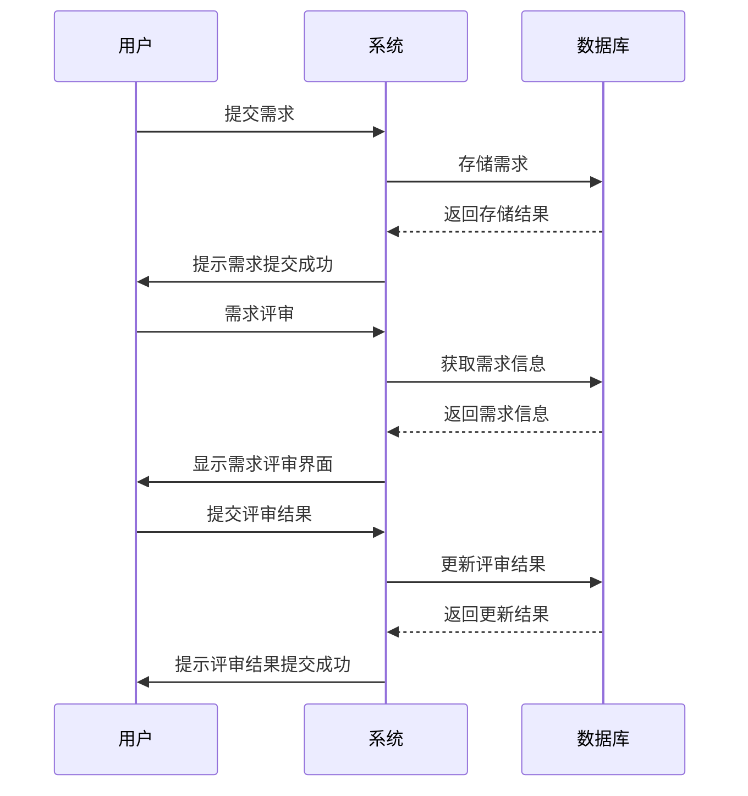

                 

# 敏捷研发模式下的需求评审新方法

## 关键词

敏捷研发，需求评审，敏捷需求评审，迭代反馈，用户参与，需求优先级

## 摘要

本文旨在探讨敏捷研发模式下的需求评审新方法，以应对敏捷环境下需求评审的挑战。通过介绍敏捷需求评审的基础概念、策略、实践和工具，本文为软件开发团队提供了有效的需求管理策略，帮助他们在敏捷开发中实现高效的迭代和持续改进。

## 目录大纲设计

### 背景介绍

#### 1.1 软件研发模式的发展历程

#### 1.2 敏捷研发模式的兴起与优势

#### 1.3 敏捷研发模式下的需求评审挑战

#### 1.4 本书结构安排与目标

### 核心概念与联系

#### 2.1 敏捷研发模式概述

#### 2.2 敏捷需求评审的流程

#### 2.3 敏捷需求评审的关键角色

#### 2.4 敏捷需求评审的方法与工具

### 敏捷需求评审策略

#### 3.1 快速反馈与迭代

#### 3.2 用户参与与需求细化

#### 3.3 需求优先级管理

#### 3.4 需求变更控制

#### 3.5 需求评审与风险管理

### 敏捷需求评审实践

#### 4.1 敏捷需求评审的案例分析

#### 4.2 敏捷需求评审中的常见问题及解决

#### 4.3 敏捷需求评审实践中的最佳实践

### 敏捷需求评审工具与技术

#### 5.1 敏捷需求评审工具介绍

#### 5.2 敏捷需求评审工具的应用

#### 5.3 新技术对敏捷需求评审的影响

### 敏捷需求评审的持续改进

#### 6.1 敏捷需求评审的反馈机制

#### 6.2 敏捷需求评审的改进实践

#### 6.3 敏捷需求评审的持续改进策略

### 总结与展望

#### 7.1 敏捷需求评审的总结

#### 7.2 敏捷需求评审的未来发展趋势

#### 7.3 对敏捷研发模式的思考与建议

## 数学模型和数学公式

### 需求优先级的计算模型

在需求评审过程中，评估需求的优先级是一个重要环节。一个常用的评估模型是基于需求的影响力和实现难度。影响力可以用需求实现后的业务价值来衡量，实现难度可以用所需的工作量和资源来衡量。

### 影响力与实现难度的量化

- **影响力（I）**：需求实现后的业务价值。
- **实现难度（D）**：需求实现所需的工作量和资源。

### 需求优先级的计算公式

需求优先级（P）可以通过以下公式计算：

$$
P = \frac{I}{D}
$$

其中，\( I \) 越大，需求的价值越高；\( D \) 越小，需求的实现难度越低。优先级 \( P \) 越高的需求，越应该被优先考虑。

## 算法原理讲解

为了更好地进行需求评审，我们可以使用一种基于机器学习的方法来评估需求的优先级。以下是一个简单的方法，使用 Python 代码进行说明：

### 需求优先级评估算法

```python
import numpy as np

# 假设有两个需求，其影响力和实现难度如下
需求1 = {'影响力': 10, '实现难度': 5}
需求2 = {'影响力': 8, '实现难度': 3}

# 计算需求优先级
优先级1 = 需求1['影响力'] / 需求1['实现难度']
优先级2 = 需求2['影响力'] / 需求2['实现难度']

print("需求1的优先级：", 优先级1)
print("需求2的优先级：", 优先级2)
```

在这个例子中，我们通过计算每个需求的优先级来确定哪个需求应该被优先处理。通过这种方式，我们可以更有效地管理需求，确保资源被分配到最关键的需求上。

### 系统分析与架构设计方案

在敏捷研发模式下，需求评审是一个动态和持续的过程。以下是一个典型的系统架构设计方案，用于支持敏捷需求评审。

### 问题场景介绍

一个软件开发团队正在使用敏捷方法进行项目开发。他们需要一个系统来管理需求，并在每个迭代周期中进行评审。

### 项目介绍

项目名称：敏捷需求评审系统

项目目标：提供一套工具和方法，支持敏捷需求评审，提高需求管理效率。

### 系统功能设计

1. **需求管理**：包括需求的创建、编辑、删除和查询功能。
2. **需求评审**：支持在线评审，包括投票、评论和讨论功能。
3. **优先级管理**：自动计算需求优先级，并支持手动调整。
4. **需求变更控制**：记录需求变更历史，确保需求的可追溯性。

### 系统架构设计

1. **前端**：采用React框架，提供用户友好的界面，支持需求管理和评审功能。
2. **后端**：采用Spring Boot框架，实现需求管理、评审和优先级计算功能。
3. **数据库**：使用MySQL数据库存储需求信息和评审结果。

#### 系统架构图



### 系统接口设计和系统交互

1. **接口设计**：采用RESTful API设计，提供以下接口：
   - 创建需求：`POST /demands`
   - 获取需求列表：`GET /demands`
   - 更新需求：`PUT /demands/{id}`
   - 删除需求：`DELETE /demands/{id}`
   - 需求评审：`POST /demands/{id}/review`

2. **系统交互**：用户通过前端界面与系统进行交互，系统通过后端接口与数据库进行数据交换。

### 实际案例分析和详细讲解剖析

以下是一个实际案例，用于说明敏捷需求评审系统的应用和实践。

### 案例背景

一个电商网站需要开发一个功能，允许用户在购物车中添加、删除和修改商品数量。这个需求对提升用户体验和销售额至关重要。

### 案例步骤

1. **需求提出**：产品经理提出需求，并将其提交到敏捷需求评审系统。
2. **需求评审**：团队成员对需求进行评审，包括功能实现、性能、安全等方面的考虑。
3. **需求细化**：根据评审结果，对需求进行细化，明确功能细节和需求优先级。
4. **需求实现**：开发团队根据细化后的需求开始实现功能。
5. **需求测试**：测试团队对实现的功能进行测试，确保其符合需求。
6. **需求上线**：将实现的功能部署到生产环境，并对用户进行培训和宣传。

### 案例分析

通过敏捷需求评审系统，该电商网站能够快速响应市场需求，并确保每个需求都经过充分评审和细化。这种方法提高了需求的实现效率和用户满意度，同时也降低了开发过程中的风险。

### 项目小结

敏捷需求评审系统在电商网站项目中发挥了重要作用，帮助团队实现了高效的需求管理。通过这个案例，我们可以看到敏捷需求评审在实践中的应用效果。

### 最佳实践 tips

1. **明确需求优先级**：在需求评审阶段，明确每个需求的优先级，有助于团队集中资源和精力。
2. **用户参与评审**：邀请用户参与需求评审，可以更准确地了解用户需求和期望。
3. **持续改进**：定期对需求评审流程进行评估和改进，以提高评审效率和准确性。

### 小结

敏捷需求评审是敏捷研发模式中的重要环节，通过本文的讨论，我们了解到了敏捷需求评审的基础概念、策略和实践。敏捷需求评审能够帮助团队更好地管理需求，提高开发效率，实现持续改进。在未来的软件开发中，敏捷需求评审将继续发挥重要作用，助力团队实现成功。

### 注意事项

1. **需求评审的及时性**：确保需求评审及时进行，避免需求在开发过程中出现偏差。
2. **评审过程的透明性**：确保评审过程的透明性，让团队成员和利益相关者都能了解评审结果。
3. **风险控制**：在需求评审阶段，充分考虑风险因素，制定相应的风险管理措施。

### 拓展阅读

1. 《敏捷开发实践指南》
2. 《敏捷需求管理》
3. 《敏捷团队协作技巧》

## 作者信息

作者：AI天才研究院/AI Genius Institute & 禅与计算机程序设计艺术 /Zen And The Art of Computer Programming

