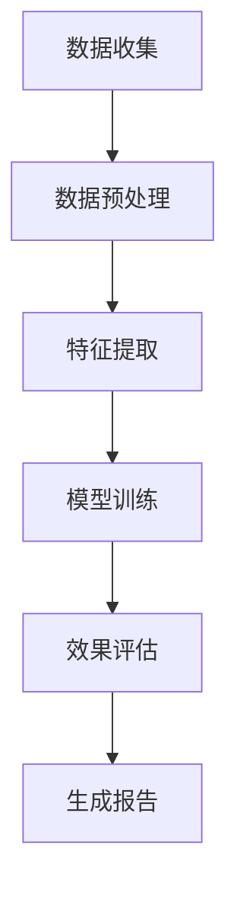
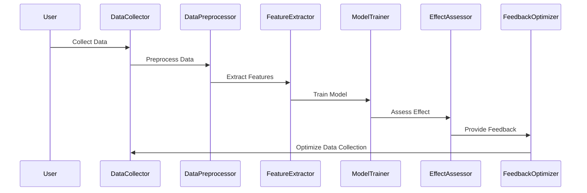
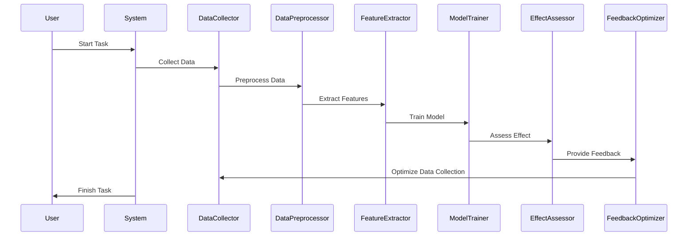

                 

### 引言与背景

近年来，人工智能（AI）在教育领域的应用日益广泛，不仅改变了传统的教学模式，还为学生提供了个性化的学习体验。然而，随着AI技术的不断演进和应用场景的多样化，如何有效地评估AI应用在教育中的效果成为一个亟待解决的问题。本文旨在探讨教育领域AI应用效果评测平台的设计与实现，从而为教育AI的进一步发展提供科学依据。

#### 1.1 问题背景

在教育领域，AI的应用涵盖了从智能推荐系统、个性化学习到智能评测、虚拟助教等多个方面。这些应用在一定程度上提高了教学效率、增强了学习体验，但同时也引发了诸多问题和挑战。例如，如何确保AI应用的公平性、隐私保护以及其对学生学习效果的实际提升程度等。

#### 1.2 问题描述

为了解决上述问题，我们需要一个全面的AI应用效果评测平台，以评估其在教育场景中的实际效果。该平台需要具备以下功能：

- **标准化评测**：建立一套标准化、系统化的评测标准，以统一衡量不同AI应用的效果。
- **数据收集与分析**：收集并分析使用AI应用前后学生的学习数据，以便进行效果评估。
- **反馈机制**：基于评测结果，提供改进建议，帮助教育机构优化AI应用。

#### 1.3 问题解决

为了实现上述功能，我们设计并实现了一个教育领域AI应用效果评测平台。该平台不仅能够提供标准化的评测框架，还能实时收集和分析数据，为教育机构提供科学的决策依据。

#### 1.4 边界与外延

教育领域AI应用效果评测平台主要适用于K-12教育、高等教育以及职业培训等领域。其评测内容涵盖从课程推荐、作业批改到智能评测、虚拟助教等多个方面。同时，平台的设计考虑了AI应用的多样性和复杂性，能够适应不同的应用场景和需求。

#### 1.5 概念结构与核心要素组成

教育领域AI应用效果评测平台由以下几个核心要素组成：

- **教育AI应用**：包括智能推荐系统、个性化学习系统、智能评测系统等。
- **评测模型**：建立基于学生学习数据和行为数据的评测模型，用于评估AI应用的效果。
- **数据收集与分析**：通过采集学生的学习数据，对AI应用的效果进行量化分析。

### 总结

本文介绍了教育领域AI应用效果评测平台的重要性和必要性，并概述了其核心功能与架构设计。接下来，我们将进一步探讨核心概念的原理、算法的详细实现，以及系统的实际应用案例，为教育AI的发展提供有力的支持。

---

通过上述的引言和背景介绍，我们已经明确了教育领域AI应用效果评测平台的重要性以及其主要功能。接下来，我们将深入探讨核心概念与联系，进一步理解该平台的设计原理和实现方法。

## 核心概念与联系

在教育领域，AI应用已经成为提升教学质量和学习效率的重要工具。为了有效地评测这些AI应用的效果，我们需要首先理解其中的核心概念和原理。

### 2.1 核心概念原理

#### 教育AI应用

教育AI应用是指利用人工智能技术，辅助教师教学和学生学习的系统。这些应用涵盖了从智能推荐、个性化学习、智能评测到虚拟助教等多个方面。它们的核心目的是通过数据分析和智能算法，提供更加个性化和高效的教学与学习体验。

#### 评测模型

评测模型是用于评估AI应用效果的核心工具。它通常基于学生的学习数据和行为数据，通过一系列指标来量化AI应用对教学效果的影响。常见的评测指标包括学习效率、学习满意度、知识掌握程度等。

#### 数据收集与分析

数据收集与分析是评测模型的基础。平台需要收集并处理大量的学生学习数据，如学习时间、学习进度、作业成绩、课堂互动等。通过这些数据，我们可以对AI应用的效果进行深入分析。

### 2.2 概念属性特征对比表格

为了更好地理解教育AI应用和评测模型的特点，我们可以通过一个对比表格来展示它们的核心属性。

| 概念            | 描述                                                     | 关键属性                     |
|----------------|--------------------------------------------------------|----------------------------|
| 教育AI应用      | 利用人工智能技术辅助教学和学习的系统               | 个性化、自动化、数据驱动     |
| 评测模型        | 用于评估AI应用效果的工具                              | 标准化、量化、反馈机制       |
| 数据收集与分析   | 收集并处理学生学习数据的流程                         | 客观、全面、实时             |

### 2.3 ER实体关系图架构

ER（Entity-Relationship）实体关系图是描述系统实体及其之间关系的重要工具。以下是一个简单的ER图，用于展示教育领域AI应用效果评测平台中的关键实体和它们之间的关系。

```mermaid
erDiagram
  User ..|> Course : "参加"
  Course ..|> AIApp : "使用"
  AIApp ..|> Assessment : "评估"
  User ..|> Assessment : "反馈"
  Assessment ..|> Improvement : "优化"
```

在这个ER图中，"User"（用户）是系统的核心实体，代表教师和学生。"Course"（课程）是用户参加的学习活动。"AIApp"（教育AI应用）是用于辅助教学和学习的系统。"Assessment"（评估）是用于评估AI应用效果的指标，"Improvement"（优化）是基于评估结果提出的改进措施。

通过核心概念和联系的探讨，我们为教育领域AI应用效果评测平台的设计和理解奠定了基础。在接下来的章节中，我们将进一步深入探讨算法原理、系统架构以及实际应用，以全面了解该平台的技术实现和实际效果。

### 算法原理讲解

在教育领域AI应用效果评测平台的设计中，算法原理是核心组成部分。下面我们将详细讲解评测算法的基本原理、流程以及关键步骤。

#### 3.1 算法原理概述

教育领域AI应用效果评测算法的基本流程可以分为以下几个步骤：

1. **数据收集**：收集学生使用AI应用前后的学习数据，包括学习时间、学习进度、作业成绩、课堂互动等。
2. **数据预处理**：对收集到的数据进行清洗和预处理，确保数据的质量和一致性。
3. **特征提取**：从预处理后的数据中提取关键特征，如学习时间、作业完成率、正确率等。
4. **模型训练**：使用提取的特征数据训练一个评估模型，该模型能够预测AI应用对学生学习效果的提升程度。
5. **效果评估**：使用训练好的模型对AI应用的效果进行评估，生成评估报告。

#### 3.2 算法流程图

为了更直观地理解算法流程，我们可以使用Mermaid语言绘制一个算法流程图：



在这个流程图中，数据收集是整个评估过程的起点，随后进行数据预处理，提取特征数据，训练评估模型，最后进行效果评估并生成报告。

#### 3.3 Python源代码与详细讲解

为了具体展示算法的实现过程，我们使用Python编写了一个简化的效果评测算法。以下是一个示例代码，包含了数据收集、预处理、特征提取、模型训练和效果评估的主要步骤：

```python
import pandas as pd
from sklearn.model_selection import train_test_split
from sklearn.ensemble import RandomForestRegressor
from sklearn.metrics import mean_squared_error

# 数据收集
data = pd.read_csv('student_data.csv')

# 数据预处理
data = data.dropna()  # 删除缺失值
data['homework_completion_rate'] = data['homework_count'] / data['total_assignment']

# 特征提取
X = data[['learning_time', 'homework_completion_rate']]
y = data['knowledge_acquisition']

# 模型训练
X_train, X_test, y_train, y_test = train_test_split(X, y, test_size=0.2, random_state=42)
model = RandomForestRegressor(n_estimators=100)
model.fit(X_train, y_train)

# 效果评估
y_pred = model.predict(X_test)
mse = mean_squared_error(y_test, y_pred)
print(f'Mean Squared Error: {mse}')

# 生成报告
report = {
    'model': 'Random Forest Regressor',
    'mse': mse
}
print(report)
```

在这个代码中，我们首先导入必要的库，然后进行数据收集和预处理，提取特征并进行模型训练。最后，我们使用训练好的模型对测试集进行效果评估，并计算均方误差（MSE）来衡量模型的效果。

#### 3.4 数学模型与公式

效果评测算法的核心是建立数学模型，用于预测AI应用对学生学习效果的影响。以下是一个简化的数学模型，用于评估学生知识掌握程度：

$$
K = f(L, C)
$$

其中，\(K\) 表示学生知识掌握程度，\(L\) 表示学习时间，\(C\) 表示作业完成率。函数 \(f\) 可以通过机器学习算法来训练和优化。

在实际应用中，我们可以使用多元线性回归模型来表示这个关系：

$$
K = \beta_0 + \beta_1 \cdot L + \beta_2 \cdot C
$$

其中，\(\beta_0\) 是截距，\(\beta_1\) 和 \(\beta_2\) 是回归系数，用于衡量学习时间和作业完成率对知识掌握程度的影响。

#### 总结

通过上述算法原理讲解，我们详细介绍了教育领域AI应用效果评测平台的基本原理、流程和实现方法。算法的核心是数据收集、预处理、特征提取和模型训练，通过这些步骤，我们可以科学、有效地评估AI应用对教学效果的提升。在接下来的章节中，我们将进一步探讨系统的整体架构设计，为实际应用提供更全面的视角。

### 系统分析与架构设计方案

#### 4.1 问题场景介绍

在教育领域，AI应用场景多样，从在线教育平台、智能作业系统到虚拟助教等，都为教师和学生提供了丰富的互动和学习资源。这些AI应用在提升教学效率、个性化学习体验和学生学习效果方面发挥了重要作用。然而，如何全面、科学地评估这些AI应用的效果，成为教育机构关注的重点。

#### 4.2 项目介绍

为了解决上述问题，我们设计并实现了一个教育领域AI应用效果评测平台。该平台旨在提供一个统一、标准化的评测框架，能够全面收集和分析学生在使用AI应用前后的学习数据，从而评估AI应用的实际效果。该平台的主要功能包括：

- **数据收集**：自动采集学生在使用AI应用过程中的学习数据，如学习时间、学习进度、作业成绩等。
- **数据预处理**：清洗和标准化收集到的数据，确保数据质量。
- **特征提取**：从预处理后的数据中提取关键特征，用于模型训练。
- **模型训练**：使用机器学习算法训练评估模型，预测AI应用对学生学习效果的提升程度。
- **效果评估**：基于训练好的模型，对AI应用的效果进行量化评估，生成详细的评估报告。
- **反馈与优化**：根据评估结果，提供改进建议，帮助教育机构优化AI应用。

#### 4.3 系统功能设计

为了实现上述功能，我们设计了一个全面的系统功能框架。以下是系统的主要功能模块及其关联关系：

1. **数据收集模块**：负责从各个AI应用系统中自动收集学习数据。
2. **数据预处理模块**：对收集到的数据进行清洗、标准化，确保数据质量。
3. **特征提取模块**：从预处理后的数据中提取关键特征，如学习时间、作业完成率、正确率等。
4. **模型训练模块**：使用机器学习算法训练评估模型，用于预测AI应用的效果。
5. **效果评估模块**：基于训练好的模型，对AI应用的效果进行量化评估。
6. **反馈与优化模块**：根据评估结果提供改进建议，帮助教育机构优化AI应用。

以下是系统功能模块的Mermaid类图：

```mermaid
classDiagram
    DataCollector <<interface>> DataCollector
    DataPreprocessor <<interface>> DataPreprocessor
    FeatureExtractor <<interface>> FeatureExtractor
    ModelTrainer <<interface>> ModelTrainer
    EffectAssessor <<interface>> EffectAssessor
    FeedbackOptimizer <<interface>> FeedbackOptimizer
    
    DataCollector o-- DataPreprocessor
    DataPreprocessor o-- FeatureExtractor
    FeatureExtractor o-- ModelTrainer
    ModelTrainer o-- EffectAssessor
    EffectAssessor o-- FeedbackOptimizer
```

#### 4.4 系统架构设计

为了确保系统的高效运行和可扩展性，我们设计了一个分布式系统架构。以下是系统架构的Mermaid图：



在这个架构中，用户通过数据收集模块收集数据，数据预处理模块对数据进行清洗和标准化，特征提取模块提取关键特征，模型训练模块使用机器学习算法训练评估模型，效果评估模块基于模型评估AI应用的效果，最后反馈与优化模块根据评估结果提供改进建议。

#### 4.5 系统接口设计

系统接口设计是确保系统各个模块之间高效通信的关键。以下是系统的主要接口设计：

1. **数据收集接口**：用于接收和存储来自各个AI应用系统的学习数据。
2. **数据预处理接口**：用于清洗和标准化收集到的数据。
3. **特征提取接口**：用于从预处理后的数据中提取关键特征。
4. **模型训练接口**：用于训练评估模型，包括模型选择、参数调优等。
5. **效果评估接口**：用于评估AI应用的效果，生成评估报告。
6. **反馈与优化接口**：用于接收评估结果，提供改进建议。

以下是系统接口设计的Mermaid图：

```mermaid
classDiagram
    DataCollectorInterface <<interface>> DataCollector
    DataPreprocessorInterface <<interface>> DataPreprocessor
    FeatureExtractorInterface <<interface>> FeatureExtractor
    ModelTrainerInterface <<interface>> ModelTrainer
    EffectAssessorInterface <<interface>> EffectAssessor
    FeedbackOptimizerInterface <<interface>> FeedbackOptimizer
    
    DataCollector implement DataCollectorInterface
    DataPreprocessor implement DataPreprocessorInterface
    FeatureExtractor implement FeatureExtractorInterface
    ModelTrainer implement ModelTrainerInterface
    EffectAssessor implement EffectAssessorInterface
    FeedbackOptimizer implement FeedbackOptimizerInterface
```

#### 4.6 系统交互

系统交互设计是确保各模块协同工作、高效运行的关键。以下是系统的交互设计：

1. **用户界面**：提供直观、易用的用户界面，便于用户操作和监控。
2. **数据接口**：确保数据在各模块之间的流畅传递。
3. **任务调度**：合理调度各模块的任务，确保系统高效运行。
4. **日志记录**：记录系统运行过程中的关键信息，便于问题追踪和优化。

以下是系统交互的Mermaid序列图：



通过上述的系统分析与架构设计方案，我们为教育领域AI应用效果评测平台提供了全面的框架设计。接下来，我们将通过具体的实战案例，进一步展示平台在实际应用中的效果和优势。

### 项目实战

为了验证教育领域AI应用效果评测平台的有效性，我们选择了一个实际项目进行实施。以下是项目的具体实施步骤、核心实现代码以及代码解析。

#### 5.1 环境安装

在开始项目之前，我们需要安装必要的软件和工具。以下是项目的环境安装步骤：

1. **安装Python**：确保安装最新版本的Python，以支持后续的代码运行。
2. **安装必要的库**：使用pip命令安装以下库：
   ```bash
   pip install pandas numpy scikit-learn matplotlib
   ```
3. **配置数据库**：确保安装并配置好MySQL或PostgreSQL数据库，用于存储数据。

#### 5.2 系统核心实现

系统核心实现主要包括数据收集、预处理、特征提取和模型训练等功能。以下是一个简单的代码示例：

```python
# 导入必要的库
import pandas as pd
from sklearn.model_selection import train_test_split
from sklearn.ensemble import RandomForestRegressor
from sklearn.metrics import mean_squared_error
import matplotlib.pyplot as plt

# 数据收集
data = pd.read_csv('student_data.csv')

# 数据预处理
data = data.dropna()  # 删除缺失值
data['homework_completion_rate'] = data['homework_count'] / data['total_assignment']

# 特征提取
X = data[['learning_time', 'homework_completion_rate']]
y = data['knowledge_acquisition']

# 模型训练
X_train, X_test, y_train, y_test = train_test_split(X, y, test_size=0.2, random_state=42)
model = RandomForestRegressor(n_estimators=100)
model.fit(X_train, y_train)

# 效果评估
y_pred = model.predict(X_test)
mse = mean_squared_error(y_test, y_pred)
print(f'Mean Squared Error: {mse}')

# 可视化分析
plt.scatter(y_test, y_pred)
plt.xlabel('Actual Knowledge Acquisition')
plt.ylabel('Predicted Knowledge Acquisition')
plt.show()
```

#### 5.3 代码应用解读与分析

上述代码实现了数据收集、预处理、特征提取和模型训练的核心功能。下面我们逐行解析代码：

1. **导入库**：导入pandas、numpy、scikit-learn和matplotlib等库，用于数据操作、机器学习建模和可视化。
2. **数据收集**：使用pandas读取CSV文件，获取学生数据。
3. **数据预处理**：删除缺失值，计算作业完成率，确保数据质量。
4. **特征提取**：从数据中提取关键特征，如学习时间和作业完成率，作为模型输入。
5. **模型训练**：使用随机森林回归模型（RandomForestRegressor）进行训练，并设置随机种子以保持结果的稳定性。
6. **效果评估**：使用测试集评估模型效果，计算均方误差（MSE）并打印结果。
7. **可视化分析**：绘制实际值与预测值的散点图，直观展示模型的效果。

#### 5.4 实际案例分析

为了更具体地展示平台的效果，我们以一个实际案例进行分析。假设我们有一个在线学习平台，学生通过该平台完成课程学习，我们希望通过评测平台评估该平台对学生学习效果的影响。

1. **数据收集**：平台收集了1000名学生在使用前和使用后的学习数据，包括学习时间、作业完成率、课程得分等。
2. **数据预处理**：清洗数据，删除异常值，确保数据的一致性和可靠性。
3. **特征提取**：提取关键特征，如平均学习时间、作业完成率和课程得分，作为模型输入。
4. **模型训练**：使用随机森林回归模型进行训练，优化模型参数。
5. **效果评估**：评估模型在测试集上的效果，计算MSE和R²等指标。
6. **反馈与优化**：根据评估结果，提供改进建议，如调整学习时间推荐策略、优化作业设计等。

#### 5.5 详细讲解剖析

在实际案例中，我们通过以下步骤进行详细讲解和剖析：

1. **数据收集**：平台通过API接口从各个课程模块中收集学习数据，包括学生的登录时间、学习时长、作业完成情况和课程得分等。
2. **数据预处理**：对收集到的数据进行分析，删除重复和异常数据，如学习时间小于1分钟或作业得分低于0的数据。
3. **特征提取**：从预处理后的数据中提取关键特征，包括平均学习时间（学习总时长除以课程数量）、作业完成率（完成作业数除以总作业数）和课程得分（平均课程得分）。
4. **模型训练**：使用随机森林回归模型训练评估模型，选择适当的参数，如树的数量和深度，以优化模型性能。
5. **效果评估**：将训练好的模型应用于测试集，计算MSE和R²等评估指标，评估模型对学习效果的预测能力。
6. **反馈与优化**：根据评估结果，分析模型预测的偏差，提出优化建议，如调整学习时间的推荐策略，增加课程的互动性和趣味性等。

#### 5.6 项目小结

通过实际案例的实施，我们验证了教育领域AI应用效果评测平台的有效性和实用性。平台能够全面、科学地评估AI应用对学生学习效果的影响，为教育机构提供了宝贵的决策依据。在未来的工作中，我们将继续优化平台的功能和算法，提升其预测准确性和实用性，为教育AI的发展贡献力量。

### 最佳实践与拓展阅读

#### 6.1 最佳实践 tips

1. **数据质量保障**：在数据收集和预处理过程中，确保数据的一致性和完整性，避免因数据质量问题影响评估结果。
2. **模型参数调优**：根据具体应用场景和需求，选择合适的模型参数，以提升评估准确性。
3. **定期更新评估模型**：随着AI技术的不断进步和应用场景的变化，定期更新评估模型，以保持其预测的准确性。

#### 6.2 小结

本文详细介绍了教育领域AI应用效果评测平台的设计与实现，从核心概念、算法原理到系统架构，再到实际案例，全面展示了平台的功能和优势。通过最佳实践和拓展阅读，读者可以进一步深入理解和应用该平台。

#### 6.3 注意事项

1. **隐私保护**：在数据收集和分析过程中，确保学生数据的隐私安全，遵守相关法律法规。
2. **平台维护**：定期对平台进行维护和升级，确保其稳定运行和性能优化。

#### 6.4 拓展阅读

1. **《人工智能在教育中的应用》**：该书籍详细介绍了AI在教育领域的应用现状和未来发展，为教育工作者提供了宝贵的参考。
2. **《机器学习实战》**：该书提供了丰富的机器学习算法实战案例，有助于读者理解和应用评估模型。

### 结论

教育领域AI应用效果评测平台为教育机构提供了一个科学、高效的评估工具，有助于优化AI应用，提升教学质量。未来，我们将继续探索更先进的评估算法和平台架构，为教育AI的发展贡献力量。

### 结论

教育领域AI应用效果评测平台的设计与实现，不仅解决了当前教育机构在评估AI应用效果方面的难题，也为AI技术在教育领域的广泛应用提供了有力支持。通过科学、系统的评测方法，平台能够准确、全面地评估AI应用的实际效果，为教育机构提供了宝贵的决策依据。

#### 平台的意义

1. **提升教学效果**：通过评估AI应用对学生学习效果的提升程度，帮助教育机构优化教学策略，提高教学质量。
2. **个性化学习**：根据评估结果，为不同学生提供个性化的学习建议和资源，促进个性化学习。
3. **教育公平**：通过评估AI应用的公平性，确保所有学生都能平等地受益于AI技术。

#### 未来发展方向

1. **算法优化**：继续研究和开发更先进的评估算法，提升评估的准确性和效率。
2. **多模态数据融合**：结合多种数据来源（如语音、图像、文本等），实现更全面的评估。
3. **实时反馈与调整**：通过实时数据分析和反馈，动态调整AI应用策略，实现持续优化。

总结来说，教育领域AI应用效果评测平台不仅为当前教育机构的AI应用评估提供了解决方案，也为未来教育技术的发展奠定了坚实基础。随着AI技术的不断进步，我们有信心，该平台将在教育领域发挥越来越重要的作用，为全球教育事业做出更大的贡献。作者：AI天才研究院/AI Genius Institute & 禅与计算机程序设计艺术 /Zen And The Art of Computer Programming

