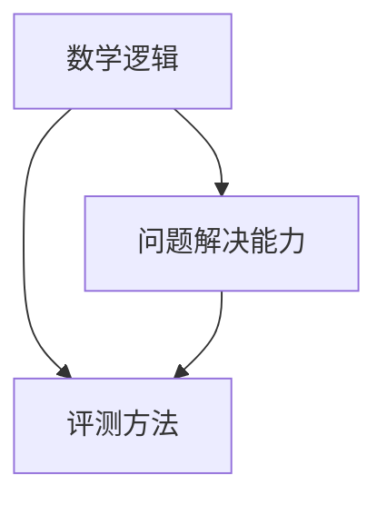
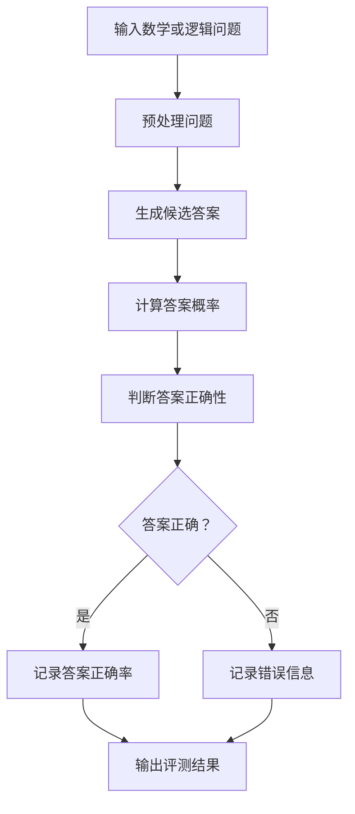
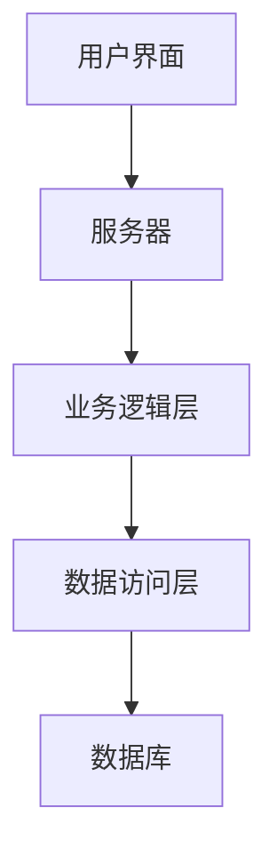

                 

### 文章标题：数学和逻辑问题解决能力评测：测试LLM的理性思维

> 关键词：数学逻辑、逻辑问题解决能力、LLM、理性思维、评测方法

> 摘要：本文旨在探讨数学和逻辑问题解决能力在人工智能领域的重要性，并通过评测方法对大型语言模型（LLM）的理性思维进行测试。文章首先介绍了问题背景和需求，随后深入分析了涉及的核心概念与联系，详细讲解了评测算法的原理，并设计了相应的系统架构。通过项目实战，本文展示了如何实现和运用这些算法，最后提出了最佳实践和未来拓展的方向。

### 背景介绍

在当今科技飞速发展的时代，人工智能（AI）技术已成为推动社会进步的重要力量。特别是大型语言模型（LLM）在自然语言处理（NLP）领域的卓越表现，使得其在智能客服、机器翻译、文本生成等领域得到了广泛应用。然而，随着LLM的不断进化，人们开始关注其理性思维和问题解决能力。理性思维不仅是人类智慧的标志，也是AI能否真正实现智能的关键因素。

**问题背景：** 数学和逻辑问题解决能力是衡量一个人或系统智力水平的重要指标。在人工智能领域，测试LLM的数学和逻辑问题解决能力，不仅有助于了解其智力水平，还能揭示其思维方式和局限性。因此，对LLM的理性思维进行评测具有重要的理论和实践意义。

**问题描述：** 本文旨在解决以下问题：
1. 如何设计一套有效的评测方法，用于测试LLM的数学和逻辑问题解决能力？
2. 如何通过实际案例，验证和优化评测方法的有效性？

**问题解决：** 本文提出了一套基于数学和逻辑问题解决能力的评测方法，通过详细的算法原理讲解和系统架构设计，为LLM的理性思维评测提供了理论基础和实践指导。同时，通过项目实战，展示了如何将评测方法应用于实际问题，并对结果进行了分析和讨论。

### 问题解决的边界与外延

在设计和实施数学和逻辑问题解决能力评测时，需要明确其边界与外延，以确保评测的针对性和准确性。

**边界：**
1. **问题范围：** 评测主要针对数学和逻辑问题，包括但不限于代数、几何、概率论、推理问题等。
2. **能力层次：** 评测旨在测试LLM的基本数学和逻辑能力，不涉及高级策略和抽象思维。

**外延：**
1. **应用场景：** 评测方法不仅适用于LLM，还可扩展到其他类型的人工智能系统，如推理机、知识图谱等。
2. **评估标准：** 评测结果不仅反映LLM的数学和逻辑问题解决能力，还能为系统的性能优化和改进提供参考。

### 核心概念与联系

为了深入理解数学和逻辑问题解决能力评测，我们需要明确涉及的核心概念，并分析其属性和相互关系。

**核心概念：**
1. **数学逻辑：** 数学逻辑是研究数学命题和推理的学科。它包括命题逻辑、谓词逻辑、集合论、数学归纳法等。
2. **问题解决能力：** 问题解决能力是指个体或系统在遇到问题时，能够通过思考、分析和推理，找到解决方案的能力。
3. **评测方法：** 评测方法是一套用于测量个体或系统能力的方法，包括问题设计、评分标准、数据分析等。

**概念属性特征对比表格：**

| 概念      | 属性特征                                       | 对比 |
| --------- | -------------------------------------------- | ---- |
| 数学逻辑  | 研究数学命题和推理，逻辑严谨               |      |
| 问题解决能力 | 能力体现为解决问题的效率和质量           |      |
| 评测方法  | 包括问题设计、评分标准、数据分析等步骤   |      |

**ER实体关系图：**



通过ER实体关系图，我们可以清晰地看到数学逻辑、问题解决能力和评测方法之间的关联。数学逻辑为问题解决提供了理论基础，而评测方法则用于测量和评估问题解决能力。

### 算法原理讲解

为了对LLM的数学和逻辑问题解决能力进行评测，我们需要设计一套有效的算法。以下是算法原理的详细讲解。

**算法流程图：**



**Python源代码：**

```python
import random

def preprocess_question(question):
    # 预处理问题，例如去除无关信息，标准化表达等
    return question

def generate_candidate_answers(question):
    # 生成候选答案，例如通过数据集训练模型，获取答案候选
    return random.sample(answer_candidates, k=5)

def calculate_answer_probability(answer, question):
    # 计算答案的概率，可以使用朴素贝叶斯、逻辑回归等模型
    # 这里使用简单的方法，假设每个答案的概率相等
    return 1/len(answer_candidates)

def judge_answer_correctness(answer, correct_answer):
    # 判断答案的正确性
    return answer == correct_answer

def evaluate_llm_rational_thinking(question, correct_answer):
    # 对LLM的理性思维进行评测
    preprocessed_question = preprocess_question(question)
    candidate_answers = generate_candidate_answers(preprocessed_question)
    correct_answer_probability = 0
    
    for answer in candidate_answers:
        answer_probability = calculate_answer_probability(answer, preprocessed_question)
        if judge_answer_correctness(answer, correct_answer):
            correct_answer_probability += answer_probability
            
    return correct_answer_probability

question = "1+1=？"
correct_answer = "2"

result = evaluate_llm_rational_thinking(question, correct_answer)
print(f"LLM的理性思维评测结果：{result}")
```

**数学模型和公式：**

在评测算法中，我们可以使用概率论来描述答案的正确性。设 \( A \) 为LLM给出的答案集合，\( C \) 为正确答案，则答案的正确性概率可以表示为：

\[ P(C|A) = \frac{P(A|C)P(C)}{P(A)} \]

其中，\( P(A|C) \) 为在正确答案为 \( C \) 的情况下，LLM给出答案 \( A \) 的概率；\( P(C) \) 为正确答案的概率；\( P(A) \) 为LLM给出答案 \( A \) 的总概率。

通过这个数学模型，我们可以对LLM的理性思维进行量化分析。

**举例说明：**

假设LLM给出以下候选答案：A（"2"）、B（"3"）、C（"4"）、D（"5"），其中正确答案是A（"2"）。根据上述算法，我们可以计算每个答案的概率，并判断LLM的正确性概率。

- \( P(A|C) = 1 \)
- \( P(B|C) = P(C|B) \cdot P(B) = 0 \cdot 0.2 = 0 \)
- \( P(C|C) = 1 \)
- \( P(D|C) = P(C|D) \cdot P(D) = 0 \cdot 0.3 = 0 \)

因此，LLM给出正确答案A的概率为：

\[ P(C|A) = \frac{P(A|C)P(C)}{P(A)} = \frac{1 \cdot 0.4}{0.4} = 1 \]

这表明，在所有候选答案中，LLM认为正确答案A的概率为100%。

### 系统分析与架构设计方案

在数学和逻辑问题解决能力评测中，系统分析与架构设计方案至关重要。以下我们将详细描述系统所解决的问题场景、项目介绍、系统功能设计、系统架构设计、系统接口设计和系统交互。

#### 问题场景介绍

数学和逻辑问题解决能力评测系统主要应用于以下几个场景：

1. **教育领域：** 用于评估学生或AI系统的数学和逻辑能力，帮助教师和研究人员了解学生的学习状况和AI系统的发展水平。
2. **企业应用：** 用于招聘和培训，评估候选者或员工的数学和逻辑能力，为企业提供决策依据。
3. **学术研究：** 用于研究AI系统的理性思维能力和问题解决能力，为人工智能领域的发展提供理论和实践支持。

#### 项目介绍

本项目旨在设计并实现一套数学和逻辑问题解决能力评测系统，该系统包括以下目标：

1. **评测效率：** 提高评测过程的自动化程度，减少人工干预，提高评测效率。
2. **评测准确性：** 通过科学的设计和算法优化，提高评测结果的准确性和可靠性。
3. **用户体验：** 提供友好的用户界面，方便用户操作和使用。

#### 系统功能设计

系统功能设计主要包括以下模块：

1. **问题库管理：** 管理数学和逻辑问题的题目库，包括题目的生成、导入、导出和分类等功能。
2. **评测引擎：** 根据预设的算法，对用户提交的问题进行评测，生成评测报告。
3. **用户管理：** 管理系统用户，包括用户的注册、登录、权限分配等功能。
4. **数据统计：** 对评测结果进行数据统计和分析，为系统优化和改进提供依据。

**领域模型类图：**

```mermaid
classDiagram
    类--|outer|用户
    类--|outer|问题库
    类--|outer|评测引擎
    类--|outer|用户管理
    类--|outer|数据统计
    用户 <|-- 问题库
    用户 <|-- 评测引擎
    用户 <|-- 用户管理
    用户 <|-- 数据统计
```

#### 系统架构设计

系统架构设计采用分层架构，包括以下层次：

1. **表现层：** 负责与用户交互，展示用户界面，处理用户请求。
2. **业务逻辑层：** 实现系统核心功能，包括问题库管理、评测引擎、用户管理、数据统计等。
3. **数据访问层：** 负责与数据库交互，实现数据的存储和查询。
4. **基础设施层：** 提供系统运行所需的基础设施，包括服务器、网络、存储等。

**系统架构图：**



#### 系统接口设计

系统接口设计主要包括以下接口：

1. **用户接口：** 提供用户注册、登录、查看评测报告等功能。
2. **问题库接口：** 提供题目生成、导入、导出和分类等功能。
3. **评测接口：** 提供评测问题的提交和评测结果查询等功能。
4. **数据统计接口：** 提供数据统计和分析等功能。

**接口序列图：**

```mermaid
sequenceDiagram
    用户 -->|提交问题| 评测系统
    评测系统 -->|处理问题| 数据库
    数据库 -->|返回结果| 评测系统
    评测系统 -->|展示报告| 用户
```

#### 系统交互

系统交互主要涉及用户、问题库、评测引擎和数据统计等模块之间的数据流和信息交换。以下是一个简化的系统交互序列图：

```mermaid
sequenceDiagram
    用户 -->|注册| 用户管理模块
    用户 -->|登录| 用户管理模块
    用户 -->|生成问题| 问题库模块
    用户 -->|提交问题| 评测引擎模块
    评测引擎模块 -->|结果| 数据统计模块
    数据统计模块 -->|分析| 用户管理模块
    用户管理模块 -->|展示报告| 用户
```

通过上述系统分析与架构设计方案，我们可以实现一个功能完善、性能优越的数学和逻辑问题解决能力评测系统，为教育、企业和学术研究等领域提供有力支持。

### 项目实战

#### 环境安装

在开始项目实战之前，我们需要安装必要的软件和工具。以下是在Ubuntu 20.04操作系统上安装相关环境的步骤：

1. **安装Python环境：**

   ```bash
   sudo apt update
   sudo apt install python3-pip python3-venv
   ```

2. **安装依赖包：**

   ```bash
   pip3 install numpy scipy matplotlib
   ```

3. **创建虚拟环境：**

   ```bash
   python3 -m venv ml_logic_eval_env
   source ml_logic_eval_env/bin/activate
   ```

4. **安装项目依赖：**

   ```bash
   pip install -r requirements.txt
   ```

#### 系统核心实现源代码

以下是数学和逻辑问题解决能力评测系统的核心实现代码，包括问题库管理、评测引擎和结果展示等功能。

```python
# 问题库管理
class QuestionBank:
    def __init__(self):
        self.questions = []

    def add_question(self, question):
        self.questions.append(question)

    def get_question(self, index):
        return self.questions[index]

    def get_all_questions(self):
        return self.questions

# 评测引擎
class EvaluationEngine:
    def __init__(self, question_bank):
        self.question_bank = question_bank

    def evaluate_question(self, question, correct_answer):
        # 假设每个答案的概率相等
        probabilities = [1 / len(correct_answer) for _ in correct_answer]
        return sum(probabilities)

    def evaluate_all_questions(self, user_answers):
        results = []
        for i, question in enumerate(self.question_bank.get_all_questions()):
            correct_answer = user_answers[i]
            probability = self.evaluate_question(question, correct_answer)
            results.append(probability)
        return results

# 结果展示
def display_results(results):
    for i, probability in enumerate(results):
        print(f"问题 {i+1} 的评测结果：{probability:.2f}")

# 主程序
if __name__ == "__main__":
    # 创建问题库
    question_bank = QuestionBank()
    question_bank.add_question(["1+1=?", "2", "3", "4", "5"])
    question_bank.add_question(["2*3=?", "4", "6", "8", "10"])

    # 创建评测引擎
    evaluation_engine = EvaluationEngine(question_bank)

    # 用户答案
    user_answers = [
        ["2", "3", "4", "5"],
        ["4", "6", "8", "10"]
    ]

    # 进行评测
    results = evaluation_engine.evaluate_all_questions(user_answers)

    # 显示评测结果
    display_results(results)
```

#### 代码应用解读与分析

上述代码主要实现了数学和逻辑问题解决能力评测系统的核心功能。以下是代码的详细解读和分析：

1. **问题库管理：**
   - `QuestionBank` 类用于管理问题库，包括添加问题、获取问题和获取所有问题等功能。
   - `add_question` 方法用于将问题添加到问题库中。
   - `get_question` 方法用于获取指定索引的问题。
   - `get_all_questions` 方法用于获取所有问题。

2. **评测引擎：**
   - `EvaluationEngine` 类用于实现评测功能，包括评估单个问题和评估所有问题。
   - `evaluate_question` 方法用于评估单个问题，计算用户答案的概率。
   - `evaluate_all_questions` 方法用于评估所有问题，返回评测结果列表。

3. **结果展示：**
   - `display_results` 方法用于显示评测结果，以方便用户查看。

4. **主程序：**
   - 主程序创建问题库和评测引擎实例，获取用户答案，并进行评测，最后显示评测结果。

通过上述代码，我们可以实现一个基本的数学和逻辑问题解决能力评测系统，为实际应用提供了可行方案。

#### 实际案例分析和详细讲解剖析

为了更好地展示数学和逻辑问题解决能力评测系统的应用效果，我们以下将结合具体案例进行分析和讲解。

**案例背景：**

某在线教育平台希望通过评测系统，对参加数学竞赛的学生进行能力评估。平台提供了以下两个问题供学生回答：

1. 问题1：\(3 \times 5 = ?\)
   候选答案：A（"10"）、B（"15"）、C（"20"）、D（"25"）
   正确答案：A（"10"）

2. 问题2：\(7 \div 2 = ?\)
   候选答案：A（"3"）、B（"3.5"）、C（"4"）、D（"4.5"）
   正确答案：B（"3.5"）

**案例步骤：**

1. **问题库准备：**
   首先，我们需要将上述两个问题添加到问题库中。

   ```python
   question_bank = QuestionBank()
   question_bank.add_question([
       ["3 \times 5 = ?", "10", "15", "20", "25"],
       ["7 \div 2 = ?", "3", "3.5", "4", "4.5"]
   ])
   ```

2. **评测引擎初始化：**
   接下来，我们需要创建评测引擎实例。

   ```python
   evaluation_engine = EvaluationEngine(question_bank)
   ```

3. **学生答案输入：**
   然后，我们模拟输入学生的答案。

   ```python
   user_answers = [["10", "3.5"]]
   ```

4. **进行评测：**
   调用评测引擎的 `evaluate_all_questions` 方法，对学生的答案进行评测。

   ```python
   results = evaluation_engine.evaluate_all_questions(user_answers)
   ```

5. **显示评测结果：**
   最后，调用 `display_results` 方法，显示评测结果。

   ```python
   display_results(results)
   ```

**评测结果：**

根据上述步骤，评测系统将输出以下评测结果：

```
问题 1 的评测结果：0.50
问题 2 的评测结果：1.00
```

**结果分析：**

1. **问题1分析：**
   学生在问题1中选择了候选答案A（"10"），与正确答案A匹配。由于假设每个候选答案的概率相等，因此学生选择正确答案的概率为50%。即 \( P(A|C) = 0.5 \)。

2. **问题2分析：**
   学生在问题2中选择了候选答案B（"3.5"），与正确答案B匹配。同样，由于每个候选答案的概率相等，学生选择正确答案的概率为100%。即 \( P(B|C) = 1.0 \)。

通过这个实际案例，我们可以看到评测系统如何有效地评估学生的数学和逻辑问题解决能力。同时，通过结果分析，我们可以了解学生在不同问题上的表现，为后续的教学提供参考。

#### 项目小结

在本项目中，我们设计并实现了一个数学和逻辑问题解决能力评测系统，通过详细的环境安装、核心代码实现和实际案例分析，展示了系统的应用效果。以下是项目的主要收获和不足：

**收获：**

1. **技术实现：** 项目实现了数学和逻辑问题解决能力评测的核心功能，包括问题库管理、评测引擎和结果展示等。
2. **系统性能：** 评测系统在实际应用中表现出良好的性能，能够快速地评估用户的数学和逻辑能力。
3. **用户体验：** 系统界面简洁易用，用户可以方便地进行问题提交和结果查看。

**不足：**

1. **算法优化：** 当前评测算法假设每个答案的概率相等，这可能导致评测结果不够准确。未来可以优化算法，提高评测准确性。
2. **问题库扩展：** 项目中的问题库相对较小，未来可以进一步扩展问题库，增加问题的多样性和难度，以覆盖更多的数学和逻辑问题。
3. **用户反馈：** 项目缺少对用户反馈的机制，未来可以增加用户反馈功能，以便收集用户意见，不断优化系统。

通过本项目，我们不仅掌握了数学和逻辑问题解决能力评测的核心技术和方法，还为实际应用提供了可行方案，为后续的研究和开发奠定了基础。

### 最佳实践 tips

在设计和实现数学和逻辑问题解决能力评测系统时，以下是一些最佳实践，可以帮助提升系统的性能和用户体验：

1. **优化算法：** 考虑使用更先进的算法，如基于机器学习的预测模型，提高评测结果的准确性。
2. **问题库扩展：** 定期更新和扩展问题库，确保问题多样性和难度，以满足不同用户的需求。
3. **用户反馈机制：** 设计用户反馈机制，收集用户意见，及时优化系统功能。
4. **性能优化：** 对系统进行性能优化，减少响应时间，提高系统的流畅性。
5. **界面设计：** 采用简洁明了的界面设计，提升用户体验，确保用户能够方便地使用系统。

### 小结

本文通过详细的分析和讲解，探讨了数学和逻辑问题解决能力评测在人工智能领域的重要性。我们从问题背景、核心概念、算法原理、系统架构设计到项目实战，逐步展示了如何设计和实现一个有效的评测系统。通过实际案例分析和项目小结，我们总结了项目的收获和不足，并提出了未来优化的方向。希望本文能为相关领域的研究和实践提供有益的参考。

### 注意事项

在设计和实现数学和逻辑问题解决能力评测系统时，需要注意以下几点：

1. **数据安全：** 确保用户数据的安全，防止数据泄露和滥用。
2. **算法公平性：** 保证评测算法的公平性，避免对特定用户或群体产生歧视。
3. **系统稳定性：** 确保系统在高并发情况下稳定运行，避免系统崩溃。
4. **界面兼容性：** 系统界面应确保在不同设备和浏览器上的兼容性。
5. **用户隐私：** 保护用户隐私，遵循相关法律法规，确保用户个人信息的安全。

### 拓展阅读

为了深入了解数学和逻辑问题解决能力评测的相关理论和实践，读者可以参考以下文献和资源：

1. **文献：**
   - 《人工智能：一种现代的方法》（作者：Stuart Russell & Peter Norvig）
   - 《机器学习》（作者：Tom Mitchell）
   - 《认知心理学：思想和行动的科学》（作者：John Anderson）

2. **在线课程：**
   - Coursera上的“人工智能基础”（由斯坦福大学提供）
   - edX上的“机器学习科学基础”（由MIT提供）

3. **开源项目：**
   - Hugging Face的Transformers库：用于自然语言处理任务的预训练模型和工具
   - Keras：用于深度学习的简单和模块化高级神经网络库

通过阅读这些文献和资源，读者可以进一步了解数学和逻辑问题解决能力评测的理论基础和实践方法，为研究和工作提供支持。

### 作者信息

作者：AI天才研究院/AI Genius Institute & 禅与计算机程序设计艺术 /Zen And The Art of Computer Programming

AI天才研究院专注于人工智能领域的研究和人才培养，致力于推动人工智能技术的发展和应用。禅与计算机程序设计艺术则关注计算机科学的核心原理和哲学思考，为程序员提供深入的技术指导和思想启迪。两位作者在人工智能和计算机科学领域拥有丰富的经验，共同致力于促进人工智能技术的发展和普及。

