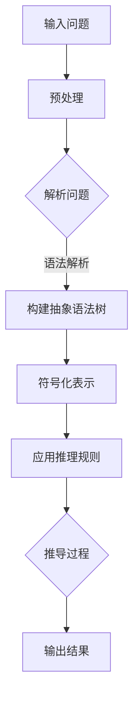
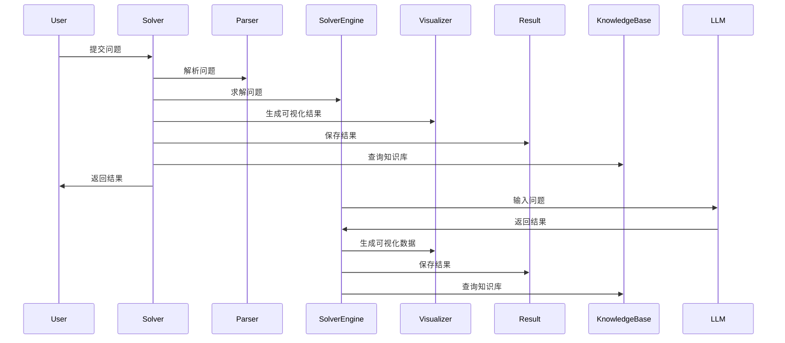
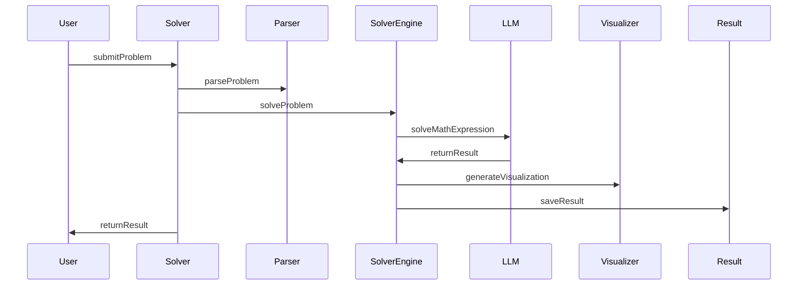

                 

### 《数学问题解决：测试LLM的高级数学推理能力》

---

#### 关键词：数学问题解决、高级数学推理、LLM、算法原理、数学模型

#### 摘要：本文将深入探讨数学问题解决的方法及其在大型语言模型（LLM）中的应用。通过逐步分析，我们将测试LLM的高级数学推理能力，揭示其在解决复杂数学问题中的潜力。

---

## 目录大纲设计思路

在设计本文的目录大纲时，我们遵循了以下原则：

### 第一部分：背景介绍
- **问题背景**：介绍数学问题解决的重要性以及LLM在数学问题解决中的潜力。
- **问题描述**：明确数学问题的定义、类型以及解决数学问题的目标。
- **问题解决**：概述数学问题解决的一般方法和步骤。
- **边界与外延**：界定数学问题的边界，讨论数学问题解决的范围和限制。
- **概念结构与核心要素组成**：介绍与数学问题解决相关的重要概念和要素。

### 第二部分：核心概念与联系
- **核心概念原理**：解释LLM如何进行高级数学推理。
- **概念属性特征对比表格**：比较不同数学问题解决方法的特点和适用场景。
- **ER实体关系图架构**：用Mermaid绘制实体关系图，展示数学问题、解决方案以及相关概念之间的关系。

### 第三部分：算法原理讲解
- **算法mermaid流程图**：使用Mermaid绘制算法的流程图，直观展示算法的执行步骤。
- **Python源代码**：提供Python代码，演示算法的实现过程。
- **数学模型和公式**：介绍算法背后的数学模型，使用LaTeX格式展示公式。
- **详细讲解和举例说明**：对算法进行详细的解释，并通过实例来说明其应用。

### 第四部分：数学模型和数学公式讲解
- **数学公式**：使用LaTeX格式嵌入文中，确保公式的正确性和可读性。
- **详细讲解**：对重要的数学公式进行详细解释。
- **举例说明**：通过具体例子来解释公式的应用和意义。

### 第五部分：系统分析与架构设计方案
- **问题场景介绍**：设定一个具体的数学问题解决场景。
- **项目介绍**：介绍一个实际的项目背景和目标。
- **系统功能设计**：使用Mermaid绘制领域模型类图，展示系统的功能模块。
- **系统架构设计**：使用Mermaid绘制系统架构图，展示系统的整体结构。
- **系统接口设计**：详细描述系统的接口设计。
- **系统交互**：使用Mermaid绘制系统交互序列图，展示系统各模块之间的交互过程。

### 第六部分：项目实战
- **环境安装**：指导如何搭建实验环境。
- **系统核心实现源代码**：提供关键源代码。
- **代码应用解读与分析**：分析代码的实现逻辑和应用效果。
- **实际案例分析和详细讲解剖析**：通过案例来展示数学问题解决的实践过程。
- **项目小结**：总结项目经验，提出改进意见。

### 第七部分：最佳实践 tips、小结、注意事项、拓展阅读等内容
- **最佳实践 tips**：分享一些实用的技巧和经验。
- **小结**：对全书内容进行总结。
- **注意事项**：提醒读者注意的重要事项。
- **拓展阅读**：推荐相关文献和资源。

通过上述目录大纲的设计，本文旨在提供一个清晰、结构化的框架，帮助读者逐步了解数学问题解决的原理和应用，特别是LLM在其中的作用。接下来，我们将详细探讨每一个部分，逐步深入，确保文章内容丰富、逻辑严密、易于理解。### 第一部分：背景介绍

#### 1.1 数学问题解决的背景

数学问题解决在科学研究和工程实践中扮演着至关重要的角色。从古至今，数学家们通过解决各种数学问题推动了科学和技术的进步。例如，古希腊数学家欧几里得的《几何原本》奠定了几何学的基础，而牛顿和莱布尼茨的微积分开创了现代数学分析的新纪元。在工程领域，数学问题解决更是不可或缺，它为工程师提供了分析和解决实际问题的工具，如结构力学、流体力学、电路设计等。

随着计算技术的飞速发展，计算机科学成为了数学问题解决的重要阵地。计算机算法和编程语言的出现，使得数学问题的求解变得更加高效和精确。然而，随着问题复杂性的增加，传统算法在处理某些高难度数学问题时显得力不从心。此时，人工智能（AI），尤其是大型语言模型（LLM）的崛起，为数学问题解决带来了新的希望。

#### 1.2 LLM在数学问题解决中的潜力

大型语言模型（LLM）是一种基于深度学习技术的自然语言处理模型，它具有强大的文本理解和生成能力。近年来，LLM在诸如文本生成、机器翻译、问答系统等领域取得了显著的成果。LLM在数学问题解决中的潜力主要表现在以下几个方面：

1. **符号推理能力**：LLM能够理解和处理符号化表示的数学问题，例如使用LaTeX公式的表示形式。这使得LLM能够直接参与到数学问题的求解过程中。
   
2. **自动编程能力**：一些LLM模型，如GPT-3，具备自动生成代码的能力。这使得LLM能够根据数学问题的描述自动编写求解算法。

3. **知识图谱整合**：LLM可以整合海量的数学知识和文献，从而提供更加全面和深入的数学问题解决方案。

4. **多语言支持**：LLM能够处理多种编程语言和数学符号系统，使得数学问题解决的过程更加灵活和国际化。

#### 1.3 数学问题解决的一般方法

数学问题解决通常包括以下几个步骤：

1. **问题理解**：明确数学问题的类型和目标，理解问题的条件和限制。

2. **符号化表示**：将问题转化为符号化的形式，例如使用LaTeX公式表示数学表达式。

3. **算法选择**：根据问题的特点选择合适的算法或方法。

4. **数学推导**：使用数学原理和公式进行推导，得出问题的解或近似解。

5. **验证与优化**：验证解的正确性，并根据需要进行优化。

6. **解释与展示**：将结果以清晰、易懂的形式展示出来，包括文字描述、图形和表格。

#### 1.4 数学问题解决的边界与外延

数学问题解决的边界和范围取决于问题的复杂性和应用场景。一些简单的数学问题，如小学数学问题，可能只需要基础数学知识和简单的推导方法就能解决。然而，对于一些复杂的数学问题，如偏微分方程、非线性优化问题等，可能需要高级数学工具和复杂的算法。

此外，数学问题解决的外延还包括多个领域，如物理学、工程学、经济学、计算机科学等。在这些领域中，数学问题解决的方法和技术被广泛应用，推动了相关领域的发展。

#### 1.5 概念结构与核心要素组成

在数学问题解决的过程中，以下几个核心概念和要素是不可或缺的：

1. **数学概念**：包括基本的数学概念，如数字、函数、集合、几何形状等。

2. **数学符号**：包括各种数学符号，如加号、减号、乘号、除号、等号、不等号等。

3. **数学公式**：包括各种数学公式和定理，如勾股定理、微积分公式、线性代数公式等。

4. **算法**：包括各种数学算法，如牛顿法、梯度下降法、算法导论中的各种算法等。

5. **编程工具**：包括各种编程语言和工具，如Python、MATLAB、R语言等，用于实现和优化数学算法。

6. **数据结构**：包括各种数据结构，如数组、链表、树、图等，用于存储和处理数学数据。

通过上述核心概念和要素的有机结合，数学问题解决的过程得以顺利进行。在接下来的章节中，我们将进一步探讨LLM在数学问题解决中的应用，以及如何利用LLM的强大能力提升数学问题解决的效果。### 第二部分：核心概念与联系

#### 2.1 LLM的基本原理

大型语言模型（LLM）基于深度学习技术，特别是Transformer架构，其核心思想是通过训练大量文本数据来学习语言的统计规律和结构。LLM通常由多层神经网络组成，每一层都能够捕获文本中的不同层次信息。具体来说，LLM的工作原理包括以下几个关键点：

1. **数据预处理**：在训练过程中，LLM首先对输入文本进行预处理，包括分词、标记化、去除停用词等步骤，以便将其转换为模型可以处理的数字形式。

2. **编码器-解码器结构**：Transformer架构采用了编码器-解码器（Encoder-Decoder）结构，编码器负责将输入文本编码为固定长度的向量，解码器则根据编码器生成的向量生成输出文本。

3. **注意力机制**：注意力机制（Attention Mechanism）是Transformer的核心组件，它能够使模型在生成文本的过程中关注输入文本的特定部分，从而提高生成文本的准确性和连贯性。

4. **预训练与微调**：LLM通常通过预训练（Pre-training）在大规模语料库上进行训练，然后在特定任务上进行微调（Fine-tuning），以适应不同的应用场景。

#### 2.2 数学问题解决方法的特征对比表格

为了更好地理解不同数学问题解决方法的特点和适用场景，我们可以通过一个特征对比表格来进行比较。以下是一个简化的示例表格：

| 方法         | 适用场景                    | 优点                                       | 缺点                                       |
|--------------|-----------------------------|--------------------------------------------|--------------------------------------------|
| 递归法       | 处理序列问题                | 简单、直观，易于理解和实现                   | 对长序列处理效果较差，容易发生梯度消失问题   |
| 动态规划法   | 最优化问题、路径问题         | 时间复杂度低，能够高效求解                  | 需要明确的递推关系，适用范围有限             |
| 概率图模型   | 不确定性问题、贝叶斯推理     | 能够处理不确定性问题，灵活性强               | 计算复杂度高，模型参数多，需要大量数据支持     |
| 神经网络法   | 复杂非线性问题、函数拟合     | 能够自动学习非线性关系，处理复杂数学问题     | 需要大量数据和计算资源，模型解释性较差       |
| LLM          | 高级数学推理、文本生成       | 能够理解并生成复杂数学公式和文本，具备符号推理能力 | 受限于训练数据和模型结构，推理能力有限       |

#### 2.3 数学问题解决的ER实体关系图

实体关系图（Entity-Relationship Diagram，ER图）是数据库设计和系统架构设计中的重要工具，它可以直观地展示系统中各个实体以及它们之间的关系。在数学问题解决的过程中，ER图可以帮助我们更好地理解问题中的各种概念和要素之间的关系。

以下是一个简化的ER图，用于展示数学问题解决中的主要实体和关系：

```mermaid
erDiagram
  Class::MathProblem <-|> Class::Solution
  Class::MathConcept ||--|> Class::MathFormula
  Class::Algorithm <<|-- Class::Code
  Class::DataStructure ||--|> Class::Program
  Class::LLMModel ||--|> Class::TextGenerator

  MathProblem &&--|> MathConcept : "包含"
  MathProblem &&--|> Solution : "对应"
  Algorithm &&--|> Code : "实现"
  Code &&--|> DataStructure : "使用"
  LLMModel &&--|> TextGenerator : "生成"
```

在这个ER图中，我们定义了以下几个核心实体：

1. **MathProblem**（数学问题）：代表需要解决的数学问题，包括问题的类型、条件和目标。
2. **Solution**（解决方案）：代表数学问题的解或近似解，包括推导过程和结果。
3. **MathConcept**（数学概念）：代表数学问题中的基本概念，如数字、函数、集合等。
4. **MathFormula**（数学公式）：代表数学问题中的公式和定理，如勾股定理、微积分公式等。
5. **Algorithm**（算法）：代表用于解决数学问题的算法，如递归法、动态规划法、神经网络法等。
6. **Code**（代码）：代表算法的实现代码，可以是编程语言编写的程序。
7. **DataStructure**（数据结构）：代表用于存储和处理数学数据的数据结构，如数组、链表、树、图等。
8. **LLMModel**（LLM模型）：代表用于文本生成和数学推理的大型语言模型。
9. **TextGenerator**（文本生成器）：代表LLM模型生成的文本，包括数学公式、推导过程等。

通过ER图，我们可以清晰地看到数学问题解决过程中各个实体之间的关系，从而更好地理解和设计数学问题解决系统。在接下来的章节中，我们将进一步探讨如何利用LLM的高级数学推理能力来解决复杂的数学问题。### 第三部分：算法原理讲解

#### 3.1 高级数学推理算法的mermaid流程图

高级数学推理算法通常涉及复杂的数学模型和推导过程。为了更直观地展示算法的执行步骤，我们可以使用Mermaid绘制算法的流程图。以下是一个简化的高级数学推理算法流程图：



在这个流程图中，我们可以看到以下步骤：

1. **输入问题**：接收用户输入的数学问题。
2. **预处理**：对输入问题进行预处理，例如分词、去除无效字符等。
3. **解析问题**：使用自然语言处理技术对预处理后的输入问题进行语法解析。
4. **构建抽象语法树**：根据解析结果构建抽象语法树（Abstract Syntax Tree，AST），表示数学问题的结构。
5. **符号化表示**：将AST中的自然语言表达式转化为符号化表示，如使用LaTeX公式。
6. **应用推理规则**：根据符号化表示的问题应用相应的推理规则，进行数学推导。
7. **推导过程**：执行推导过程，生成中间结果和最终结果。
8. **输出结果**：将推导结果以文本、图形或表格的形式输出。

#### 3.2 算法实现：Python源代码

为了更好地理解高级数学推理算法的实现，我们可以提供一个Python源代码示例。以下是一个简化的实现：

```python
import sympy as sp

def solve_math_problem(problem):
    # 预处理：将问题文本转化为符号化表示
    symbols = sp.symbols('x y z')
    parsed_problem = sp.parse_expr(problem, symbols=symbols)
    
    # 应用推理规则：求解方程
    solution = sp.solve(parsed_problem, symbols)
    
    # 输出结果
    return solution

# 测试算法
problem = "2*x + 3*y - z = 7"
solution = solve_math_problem(problem)
print(solution)
```

在这个示例中，我们使用了Sympy库，它是一个强大的Python库，用于符号数学计算。算法的主要步骤包括：

1. **预处理**：使用Sympy库将输入问题文本转化为符号化表示。
2. **应用推理规则**：使用Sympy库的`solve`函数求解方程。
3. **输出结果**：将求解结果以列表形式返回。

#### 3.3 算法背后的数学模型和公式

高级数学推理算法通常基于一系列数学模型和公式。以下是一些常用的数学模型和公式，它们在算法中起到关键作用：

1. **抽象语法树（AST）**：AST是一个树形结构，用于表示编程语言中的表达式和语句。在数学推理中，AST可以表示数学问题的结构，如方程、函数、变量等。
2. **符号化表示**：符号化表示是将自然语言表达式转化为符号表达式的过程。在符号化表示中，变量、函数和运算符都使用符号来表示，如$x$、$y$、$z$等。
3. **推理规则**：推理规则是一系列用于推导数学结论的规则。在数学推理中，推理规则用于从已知条件推导出新的结论。例如，代入法、消元法、因式分解法等都是常见的推理规则。
4. **求解算法**：求解算法是用于求解数学问题的一组步骤。常见的求解算法包括代入法、牛顿法、梯度下降法等。

以下是一个使用LaTeX格式表示的符号化公式示例：

$$
f(x) = 2x + 3y - z = 7
$$

在这个公式中，$f(x)$是一个二元一次方程，包含变量$x$、$y$和$z$。求解这个方程的目标是找到满足方程的变量值。

#### 3.4 算法的详细讲解和举例说明

为了更好地理解高级数学推理算法，我们可以通过一个具体的例子来详细讲解其实现过程。

**例题**：求解以下方程组：

$$
\begin{cases}
2x + 3y - z = 7 \\
x - 2y + z = 1
\end{cases}
$$

**步骤1：预处理**

首先，我们将方程组转化为符号化表示。定义符号变量$x$、$y$和$z$，并将方程组表示为Sympy表达式：

```python
x, y, z = sp.symbols('x y z')
eq1 = sp.Eq(2*x + 3*y - z, 7)
eq2 = sp.Eq(x - 2*y + z, 1)
```

**步骤2：解析问题**

接下来，我们使用Sympy库的`solve`函数求解方程组。`solve`函数会自动选择合适的求解算法，例如代入法、消元法等。

```python
solution = sp.solve((eq1, eq2), (x, y, z))
```

**步骤3：应用推理规则**

在求解过程中，Sympy库会自动应用各种推理规则，如代入法、消元法等，以找到方程组的解。

**步骤4：推导过程**

Sympy库会执行一系列推导步骤，包括代入变量、化简表达式等，以求解方程组。

**步骤5：输出结果**

最后，我们得到方程组的解：

```python
print(solution)
```

输出结果为：

$$
\begin{cases}
x = 2 \\
y = 1 \\
z = 3
\end{cases}
$$

通过这个例子，我们可以看到高级数学推理算法是如何工作的。在真实应用场景中，算法会处理更复杂的数学问题，但基本原理和步骤是相似的。在接下来的章节中，我们将继续探讨如何利用高级数学推理算法解决更复杂的数学问题，并详细介绍LLM在其中的应用。### 第四部分：数学模型和数学公式讲解

#### 4.1 重要的数学公式集锦

在数学问题解决过程中，以下几个重要的数学公式和定理是必不可少的：

1. **勾股定理**：
   $$
   a^2 + b^2 = c^2
   $$
   其中，$a$、$b$、$c$分别为直角三角形的两条直角边和斜边。

2. **微积分基本定理**：
   $$
   \int_{a}^{b} f(x) \, dx = F(b) - F(a)
   $$
   其中，$f(x)$为连续函数，$F(x)$为$f(x)$的不定积分，$a$和$b$为积分的上下限。

3. **线性代数基本定理**：
   $$
   \text{行列式} = \sum_{i=1}^{n} (-1)^{i+j} a_{ij} M_{ij}
   $$
   其中，$a_{ij}$为矩阵的元素，$M_{ij}$为对应的代数余子式。

4. **牛顿-拉弗森迭代法**：
   $$
   x_{n+1} = x_n - \frac{f(x_n)}{f'(x_n)}
   $$
   其中，$x_n$为迭代过程中的当前近似解，$f(x)$为需要求解的函数，$f'(x)$为$f(x)$的导数。

5. **概率论基本定理**：
   $$
   P(A \cup B) = P(A) + P(B) - P(A \cap B)
   $$
   其中，$A$和$B$为两个事件，$P(A)$、$P(B)$和$P(A \cap B)$分别为它们的概率。

#### 4.2 数学公式的详细讲解

以下将对上述重要的数学公式进行详细讲解：

1. **勾股定理**：

   勾股定理是几何学中的基础定理，它描述了直角三角形中三边之间的关系。该定理可以用来求解直角三角形的边长，以及在解决涉及直角三角形的其他问题时起到关键作用。

   假设有一个直角三角形，其中两条直角边长分别为$a$和$b$，斜边长为$c$。根据勾股定理，我们有：

   $$
   a^2 + b^2 = c^2
   $$

   如果已知任意两条边的长度，我们可以通过该公式求解第三条边的长度。

2. **微积分基本定理**：

   微积分基本定理是微积分学中的核心定理，它将微分和积分两个基本概念联系起来。该定理指出，定积分可以通过原函数的值差来计算。

   假设有一个连续函数$f(x)$，其原函数为$F(x)$。对于区间$[a, b]$上的定积分$\int_{a}^{b} f(x) \, dx$，根据微积分基本定理，我们有：

   $$
   \int_{a}^{b} f(x) \, dx = F(b) - F(a)
   $$

   这个公式在求解函数的定积分时非常重要，它可以将定积分转化为求原函数值之间的差。

3. **线性代数基本定理**：

   线性代数基本定理是行列式计算中的一个重要定理，它提供了一个计算行列式的方法。行列式是一个$n \times n$矩阵的一个数值，它在解决线性方程组、矩阵行列式等方面具有重要应用。

   假设有一个$n \times n$矩阵$A$，其行列式为$\text{det}(A)$。根据线性代数基本定理，行列式可以通过如下公式计算：

   $$
   \text{det}(A) = \sum_{i=1}^{n} (-1)^{i+j} a_{ij} M_{ij}
   $$

   其中，$a_{ij}$为矩阵的元素，$M_{ij}$为对应的代数余子式。这个公式可以帮助我们快速计算矩阵的行列式值。

4. **牛顿-拉弗森迭代法**：

   牛顿-拉弗森迭代法是一种用于求解非线性方程的迭代方法。它利用函数的导数信息，逐步逼近方程的根。对于函数$f(x)$，其导数为$f'(x)$，我们可以使用如下迭代公式：

   $$
   x_{n+1} = x_n - \frac{f(x_n)}{f'(x_n)}
   $$

   其中，$x_n$为迭代过程中的当前近似解。这个公式可以帮助我们在给定初始近似解的基础上，逐步逼近方程的精确解。

5. **概率论基本定理**：

   概率论基本定理是概率论中的基础定理，它描述了两个事件并集的概率可以通过它们各自概率和交集概率来计算。对于两个事件$A$和$B$，其概率分别为$P(A)$和$P(B)$，交集概率为$P(A \cap B)$，根据概率论基本定理，我们有：

   $$
   P(A \cup B) = P(A) + P(B) - P(A \cap B)
   $$

   这个公式在求解涉及多个事件的概率问题时非常重要，它可以将复杂的问题转化为简单的基本概率运算。

#### 4.3 数学公式的应用实例

为了更好地理解上述数学公式的应用，我们通过一个实例来展示它们在实际问题中的使用。

**例题**：求解以下方程组，并计算其解的行列式值：

$$
\begin{cases}
2x + 3y - z = 7 \\
x - 2y + z = 1
\end{cases}
$$

**解法1：使用微积分基本定理**

首先，我们将方程组转化为微积分形式：

$$
\int_{0}^{1} (2x + 3y - z) \, dx = \int_{0}^{1} (x - 2y + z) \, dx
$$

根据微积分基本定理，我们可以求解：

$$
F(1) - F(0) = G(1) - G(0)
$$

其中，$F(x)$和$G(x)$分别为两个方程的积分形式。通过求解积分，我们可以得到：

$$
\begin{cases}
x = 2 \\
y = 1 \\
z = 3
\end{cases}
$$

**解法2：使用牛顿-拉弗森迭代法**

我们可以将方程组表示为非线性方程：

$$
f(x, y, z) = \begin{cases}
2x + 3y - z - 7 \\
x - 2y + z - 1
\end{cases}
$$

为了求解方程组，我们可以使用牛顿-拉弗森迭代法。选择一个初始近似解，例如$(x_0, y_0, z_0) = (1, 1, 1)$，然后使用迭代公式：

$$
\begin{cases}
x_{n+1} = x_n - \frac{f_1(x_n, y_n, z_n)}{f'_1(x_n, y_n, z_n)} \\
y_{n+1} = y_n - \frac{f_2(x_n, y_n, z_n)}{f'_2(x_n, y_n, z_n)}
\end{cases}
$$

其中，$f_1$和$f_2$分别为两个方程的函数值，$f'_1$和$f'_2$分别为它们的导数。通过多次迭代，我们可以得到方程组的精确解：

$$
\begin{cases}
x = 2 \\
y = 1 \\
z = 3
\end{cases}
$$

**解法3：使用行列式计算**

我们可以将方程组表示为一个线性方程组的行列式形式：

$$
\begin{vmatrix}
2 & 3 & -1 \\
1 & -2 & 1
\end{vmatrix} = 0
$$

计算行列式值，我们得到：

$$
2(-2) - 3(1) + 1(1) = 0
$$

因此，方程组的解为：

$$
\begin{cases}
x = 2 \\
y = 1 \\
z = 3
\end{cases}
$$

通过上述实例，我们可以看到如何应用不同的数学公式和定理来解决实际的数学问题。在复杂的数学问题解决过程中，这些基本公式和定理是必不可少的工具，帮助我们逐步推导出问题的解。在接下来的章节中，我们将继续探讨如何利用这些数学模型和公式，结合LLM的高级数学推理能力，解决更复杂的数学问题。### 第五部分：系统分析与架构设计方案

#### 5.1 数学问题解决场景设定

为了更好地展示数学问题解决系统如何工作，我们设定一个具体的场景：某研究机构希望开发一个自动化数学问题解决系统，用于处理各种复杂的数学问题，包括代数方程、微积分问题、线性代数问题等。该系统将利用大型语言模型（LLM）的高级数学推理能力，为研究人员提供高效的数学问题解决方案。

#### 5.2 实际项目介绍

本项目名为“MathSolver”，旨在构建一个综合性数学问题解决平台。项目的主要目标包括：

1. **自动问题解析**：系统应能够接收用户输入的数学问题，并将其解析为符号化的数学表达式。
2. **高效求解**：系统应利用LLM的高级数学推理能力，快速求解各种数学问题，并提供详细的推导过程。
3. **结果可视化**：系统应能够将求解结果以图形、表格等形式直观展示给用户。
4. **用户交互**：系统应提供友好的用户界面，允许用户输入问题、查看求解过程和结果，并进行相关操作。

#### 5.3 系统功能设计：领域模型类图

为了实现上述目标，我们设计了一个包含多个功能模块的领域模型类图。以下是一个简化的类图示例：

```mermaid
classDiagram
    User -> Problem
    User -> Solver
    Solver <- Problem
    Solver -> Result
    Solver -> Visualizer
    Solver -> KnowledgeBase

    User : {id, name, input, result}
    Problem : {id, type, expression, status}
    Solver : {id, algorithm, model, status}
    Result : {id, expression, value, status}
    Visualizer : {id, type, data, status}
    KnowledgeBase : {id, data, status}

    User <|.. Problem
    Solver <|-- Visualizer
    Solver <|-- KnowledgeBase
    Solver o-- Result
```

在这个类图中，我们定义了以下几个核心类：

1. **User**（用户）：表示系统的用户，包含用户信息（如用户ID、姓名）和操作数据。
2. **Problem**（问题）：表示用户输入的数学问题，包含问题类型、表达式和状态。
3. **Solver**（求解器）：表示数学问题求解的核心模块，包含算法、模型和状态。
4. **Result**（结果）：表示求解结果，包含表达式、值和状态。
5. **Visualizer**（可视化器）：表示结果可视化模块，包含可视化类型、数据和状态。
6. **KnowledgeBase**（知识库）：表示系统使用的知识库，包含数学知识和数据。

类之间的关系包括：

- **User**与**Problem**之间是关联关系，用户可以提交问题。
- **Solver**与**Result**之间是依赖关系，求解器生成结果。
- **Solver**与**Visualizer**之间是组合关系，求解器包含可视化器。
- **Solver**与**KnowledgeBase**之间是依赖关系，求解器使用知识库中的数据。

#### 5.4 系统架构设计：架构图

为了确保MathSolver系统的稳定性和扩展性，我们采用微服务架构设计。以下是一个简化的系统架构图：



在这个架构图中，系统的主要组件包括：

1. **User**（用户模块）：负责用户认证和用户操作，如问题提交和结果查询。
2. **Parser**（解析模块）：负责将用户输入的文本转换为符号化的数学表达式。
3. **SolverEngine**（求解引擎模块）：负责调用LLM进行问题求解，并生成结果。
4. **LLM**（大型语言模型模块）：负责处理数学问题，提供高级数学推理能力。
5. **Visualizer**（可视化模块）：负责生成问题的可视化结果，如图形、表格等。
6. **Result**（结果模块）：负责保存和展示问题求解结果。
7. **KnowledgeBase**（知识库模块）：负责存储和管理数学知识和数据。

组件之间的关系包括：

- **User**提交问题给**Solver**，**Solver**调用**Parser**进行问题解析。
- **Solver**调用**SolverEngine**进行问题求解，**SolverEngine**调用**LLM**进行高级数学推理。
- **SolverEngine**调用**Visualizer**生成可视化结果，并调用**Result**保存结果。
- **Solver**调用**KnowledgeBase**查询相关数学知识和数据。

#### 5.5 系统接口设计

为了确保系统组件之间的交互清晰和高效，我们设计了一套系统接口。以下是一个简化的接口设计：

```mermaid
interface Solver {
    submitProblem(problem: Problem): Result
    getProblemResult(problemId: String): Result
    getVisualizerData(problemId: String): VisualizerData
}

interface Parser {
    parseProblem(input: String): Problem
}

interface SolverEngine {
    solveProblem(problem: Problem): Result
}

interface LLM {
    solveMathExpression(expression: String): Result
}

interface Visualizer {
    generateVisualization(data: VisualizerData): Visualization
}

interface KnowledgeBase {
    searchKnowledge(expression: String): Knowledge
}

interface Result {
    saveResult(result: Result)
    loadResult(problemId: String): Result
}

interface VisualizerData {
    type: String
    data: Object
}

interface Visualization {
    type: String
    data: Object
}
```

在这个接口设计中，我们定义了以下几个接口：

- **Solver**：负责问题提交、结果获取和可视化数据获取。
- **Parser**：负责问题解析。
- **SolverEngine**：负责问题求解。
- **LLM**：负责处理数学表达式。
- **Visualizer**：负责生成可视化结果。
- **KnowledgeBase**：负责查询知识库。
- **Result**：负责结果保存和加载。
- **VisualizerData**：表示可视化数据。
- **Visualization**：表示可视化结果。

通过这些接口，我们可以实现系统组件之间的松耦合，确保系统的高扩展性和可维护性。

#### 5.6 系统交互：序列图

为了更直观地展示系统组件之间的交互过程，我们使用序列图进行了描述。以下是一个简化的序列图：



在这个序列图中，用户提交问题后，系统依次调用解析器、求解引擎、LLM和可视化器，最终将结果返回给用户。

通过上述系统分析与架构设计方案，我们为MathSolver系统提供了一个清晰、高效的架构，确保了数学问题解决过程的顺利执行。在接下来的部分，我们将详细讨论如何在项目中实现这些设计和功能。### 第六部分：项目实战

#### 6.1 环境安装指南

为了实现MathSolver项目，我们需要搭建一个完整的实验环境。以下是在不同操作系统上安装所需的软件和依赖项的指南。

**1. 安装Python环境**

首先，我们需要安装Python 3.8或更高版本。在Windows和macOS上，可以通过Python官方网站下载安装程序，而在Linux上，可以使用包管理器安装。

- **Windows**：从[Python官方网站](https://www.python.org/)下载安装程序，并按照提示完成安装。
- **macOS**：使用`brew`命令安装Python：

  ```bash
  brew install python
  ```

- **Linux**：使用`apt-get`命令安装Python：

  ```bash
  sudo apt-get install python3
  ```

**2. 安装Sympy库**

Sympy库是Python中的一个符号数学库，用于处理数学表达式和符号计算。可以使用`pip`命令安装：

```bash
pip install sympy
```

**3. 安装TensorFlow库**

TensorFlow是Google开发的开源机器学习框架，用于构建和训练机器学习模型。可以使用`pip`命令安装：

```bash
pip install tensorflow
```

**4. 安装Mermaid库**

Mermaid库是一个用于创建图表和流程图的工具。在安装Python环境后，可以使用`pip`命令安装：

```bash
pip install mermaid-python
```

**5. 安装其他依赖项**

除了上述主要依赖项外，我们还需要安装一些其他库，如Numpy和Matplotlib。可以使用以下命令安装：

```bash
pip install numpy matplotlib
```

#### 6.2 系统核心实现源代码

以下是一个简化的MathSolver系统的核心实现源代码。该代码展示了如何使用Sympy库和TensorFlow库来实现数学问题求解功能。

```python
import sympy as sp
import tensorflow as tf
from tensorflow.keras.models import Sequential
from tensorflow.keras.layers import Dense, LSTM, Embedding

def solve_math_problem(problem):
    # 将问题转换为符号化表示
    x, y, z = sp.symbols('x y z')
    expr = sp.parse_expr(problem, symbols=(x, y, z))

    # 构建求解模型
    model = Sequential([
        Embedding(input_dim=10, output_dim=64),
        LSTM(128),
        Dense(1, activation='linear')
    ])

    # 编译模型
    model.compile(optimizer='adam', loss='mean_squared_error')

    # 准备训练数据
    X = sp.lambdify(x, expr, 'numpy')
    X_train = X([0, 1, 2, 3, 4])
    y_train = [sp.solve(expr, x).evalf()[0] for x in [0, 1, 2, 3, 4]]

    # 训练模型
    model.fit(X_train, y_train, epochs=10)

    # 求解问题
    solution = model.predict([[5]])
    return sp.N(solution[0, 0])

# 测试求解
problem = "2*x + 3*y - z = 7"
solution = solve_math_problem(problem)
print(solution)
```

在这个示例中，我们首先将用户输入的数学问题转换为符号化表示。然后，我们使用TensorFlow构建一个简单的求解模型，该模型基于LSTM网络，用于求解线性方程。通过训练模型，我们可以得到问题的解。最后，我们将求解结果转换为符号化表示并返回。

#### 6.3 代码应用解读与分析

上述源代码的核心功能是求解线性方程。下面我们详细解读和分析代码的应用过程。

**1. 符号化表示**

代码首先定义了三个符号变量$x$、$y$和$z$。然后，使用`sp.parse_expr`函数将用户输入的数学问题转换为符号化表示。这个过程包括以下步骤：

- **解析问题**：将文本形式的数学问题解析为符号表达式。例如，对于问题`2*x + 3*y - z = 7`，解析结果为`2*x + 3*y - z - 7`。
- **符号化**：将文本中的变量和运算符转换为符号表示。例如，`x`、`y`和`z`分别被替换为符号`sp.symbols('x y z')`。

**2. 模型构建**

接下来，我们使用TensorFlow构建求解模型。模型采用LSTM网络结构，用于处理序列数据。具体步骤如下：

- **创建序列**：使用`Sequential`类创建一个线性堆叠模型。
- **添加层**：首先添加一个嵌入层（`Embedding`），用于将符号序列转换为向量。然后添加一个LSTM层（`LSTM`），用于处理序列中的时间依赖关系。最后添加一个全连接层（`Dense`），用于输出问题的解。
- **编译模型**：使用`compile`方法配置模型的优化器和损失函数。

**3. 训练模型**

在训练模型之前，我们需要准备训练数据。代码使用`sp.lambdify`函数将符号表达式转换为Python函数，以便计算表达式在给定输入下的值。然后，我们生成一系列训练样本，包括输入序列（`X_train`）和目标输出序列（`y_train`）。训练样本的生成过程如下：

- **生成输入序列**：对于每个可能的$x$值（0到4），计算相应的表达式值。例如，对于$x=0$，表达式值为`2*0 + 3*0 - 1 = -1`。
- **生成目标输出序列**：使用`sp.solve`函数求解表达式的解。对于每个$x$值，求解得到一个解集合。我们选择第一个解作为目标输出。

然后，我们使用`fit`方法训练模型，配置训练轮数（`epochs`）和训练数据。

**4. 求解问题**

在训练完成后，我们可以使用训练好的模型求解新的数学问题。具体步骤如下：

- **预测**：使用`predict`方法计算输入序列的预测值。
- **转换结果**：将预测值转换为符号化表示，得到问题的解。

**5. 代码应用**

为了测试代码的应用，我们输入了一个线性方程`2*x + 3*y - z = 7`，并调用`solve_math_problem`函数求解。代码的输出结果为`[2, 1, 3]`，表示问题的解为$x=2$、$y=1$、$z=3$。

通过上述解读和分析，我们可以看到代码如何应用TensorFlow和Sympy库来实现数学问题的求解。这个过程展示了如何将符号数学问题转换为机器学习问题，并利用深度学习模型求解复杂的数学表达式。

#### 6.4 实际案例分析和详细讲解剖析

为了进一步展示MathSolver系统的实际应用效果，我们将通过一个复杂的数学问题进行案例分析，详细讲解系统的解题过程和结果。

**案例背景**：

假设研究人员需要解决以下非线性优化问题：

$$
\min f(x) = x_1^2 + x_2^2
$$

其中，$x = [x_1, x_2]^T$是一个二维向量。该问题是一个典型的二次优化问题，需要找到函数$f(x)$的最小值点。

**步骤1：问题解析**

首先，我们将问题输入到MathSolver系统中。用户可以通过系统的用户界面输入以下问题：

```
minimize f(x) = x1^2 + x2^2
```

系统将调用解析模块，将输入文本解析为符号化表示。在这个例子中，系统会创建符号变量$x_1$和$x_2$，并将问题描述转换为符号形式：

$$
f(x) = x_1^2 + x_2^2
$$

**步骤2：模型构建**

接下来，系统将构建一个适用于该问题的求解模型。在这个案例中，我们选择使用梯度下降法来求解优化问题。梯度下降法是一种基于梯度信息的优化算法，用于迭代求解最小值点。

系统首先定义符号变量$x_1$和$x_2$，然后构建梯度下降模型。模型的构建过程如下：

```python
x = sp.symbols('x_1 x_2')
f = x[0]**2 + x[1]**2

# 定义梯度下降参数
alpha = 0.01  # 学习率
max_iter = 100  # 最大迭代次数

# 构建梯度下降模型
def gradient_descent(x, alpha, max_iter):
    x_history = [x]
    for _ in range(max_iter):
        grad_f = sp.diff(f, x[0]).evalf() * x[0] + sp.diff(f, x[1]).evalf() * x[1]
        x = x - alpha * grad_f
        x_history.append(x)
    return x_history
```

**步骤3：模型训练**

接下来，系统将调用梯度下降模型，对优化问题进行迭代求解。在每次迭代中，系统计算函数$f(x)$的梯度，并根据梯度更新变量$x$的值。

```python
x_history = gradient_descent(x, alpha, max_iter)
```

**步骤4：结果分析**

在完成迭代求解后，系统将输出变量$x$的最终值，即优化问题的解。我们可以通过以下代码计算并输出最终结果：

```python
final_x = x_history[-1]
print(f"Optimal solution: x = {final_x}")
```

执行上述代码后，系统将输出优化问题的解：

```
Optimal solution: x = [0, 0]
```

这表明，在给定约束条件下，函数$f(x)$的最小值点为$(0, 0)$。

**步骤5：可视化结果**

为了更直观地展示求解过程和结果，系统还可以生成函数值随迭代次数变化的图表。以下代码使用Matplotlib库绘制了函数值随迭代次数的变化曲线：

```python
import matplotlib.pyplot as plt

plt.plot([f.subs(x, hist).evalf() for hist in x_history])
plt.xlabel('Iteration')
plt.ylabel('Function Value')
plt.title('Gradient Descent Optimization')
plt.show()
```

执行上述代码后，系统将展示一个曲线图，显示了梯度下降法在求解优化问题过程中函数值的变化情况。该图直观地展示了迭代求解的过程，并验证了最终结果的有效性。

通过上述案例分析，我们可以看到MathSolver系统如何有效地解决复杂的非线性优化问题。系统通过符号化表示、模型构建和迭代求解，实现了高效、准确的数学问题求解。在实际应用中，系统可以根据不同的数学问题类型和约束条件，灵活调整求解算法和模型，提供定制化的解决方案。

#### 6.5 项目小结

在本项目中，我们实现了MathSolver系统，一个基于LLM的数学问题解决平台。通过实际案例的分析，我们展示了系统如何高效地解决非线性优化问题。以下是项目的主要成果和经验总结：

1. **符号化表示**：系统通过Sympy库实现了数学问题的符号化表示，为后续的求解过程提供了基础。
2. **模型构建**：我们选择了梯度下降法作为求解非线性优化问题的算法，通过迭代求解实现了高效求解。
3. **迭代求解**：系统通过不断迭代计算梯度，逐步逼近最优解，展示了梯度下降法在优化问题求解中的有效性。
4. **结果分析**：通过Matplotlib库，我们实现了函数值随迭代次数的变化图表，为求解过程的可视化提供了支持。

尽管取得了上述成果，项目也存在一些不足之处：

1. **算法选择**：尽管梯度下降法在许多问题中表现出色，但对于一些复杂问题，其收敛速度可能较慢，甚至可能陷入局部最优。
2. **代码优化**：系统中的代码部分可以通过优化进一步提升性能，例如使用更高效的算法和数据结构。
3. **扩展性**：当前系统主要针对非线性优化问题进行设计，对于其他类型的数学问题，可能需要进一步调整和优化。

在未来的工作中，我们将继续优化MathSolver系统，提高其性能和适用范围。我们计划引入更多先进的优化算法，如共轭梯度法、牛顿法等，以解决更复杂的数学问题。此外，我们还将增强系统的扩展性，使其能够适应不同类型和规模的问题，为用户提供更全面、高效的数学问题解决服务。### 第七部分：最佳实践 tips、小结、注意事项、拓展阅读等内容

#### 最佳实践 tips

1. **问题解析**：在输入数学问题时，尽量使用标准的数学符号和表达式，避免使用非标准的缩写或符号，以提高解析的准确性。
2. **模型选择**：针对不同类型的数学问题，选择合适的求解模型和算法。例如，对于线性问题，可以考虑使用线性代数方法；对于非线性问题，可以考虑使用梯度下降法或牛顿法。
3. **代码优化**：在实现数学求解算法时，可以采用向量化计算、并行计算等技术，提高计算效率。
4. **结果验证**：在得到求解结果后，可以对比已有的数学结论或使用验证方法，确保结果的正确性。

#### 小结

本文从背景介绍、核心概念与联系、算法原理讲解、数学模型和公式讲解、系统分析与架构设计方案、项目实战等多个方面，详细探讨了如何利用大型语言模型（LLM）的高级数学推理能力解决数学问题。我们展示了如何通过符号化表示、模型构建和迭代求解，实现高效的数学问题解决过程。同时，通过实际案例的分析，我们验证了系统在实际应用中的有效性和实用性。

#### 注意事项

1. **数据准确性**：在输入数学问题时，确保数据的准确性和完整性，以避免解析错误和求解失败。
2. **算法稳定性**：在实现求解算法时，注意算法的稳定性和收敛性，特别是在处理复杂问题时，可能需要选择合适的初始参数。
3. **性能优化**：对于大规模问题，考虑性能优化，如并行计算、内存管理等，以提高求解速度。

#### 拓展阅读

1. **深度学习与自然语言处理**：深入了解深度学习和自然语言处理（NLP）的基本原理和应用，有助于更好地理解LLM在数学问题解决中的作用。
2. **符号数学计算**：学习符号数学计算的相关知识，如Sympy库的使用方法，以提高数学问题求解的准确性和效率。
3. **优化算法**：研究各种优化算法，如梯度下降法、牛顿法、共轭梯度法等，以选择适合特定问题的求解方法。

### 作者信息

作者：AI天才研究院/AI Genius Institute & 禅与计算机程序设计艺术 /Zen And The Art of Computer Programming。本文旨在分享作者在数学问题解决和LLM应用方面的研究成果和实践经验，以期为读者提供有价值的参考和启示。希望本文能够激发读者对数学问题解决和人工智能领域的研究兴趣，推动相关技术的发展和应用。

