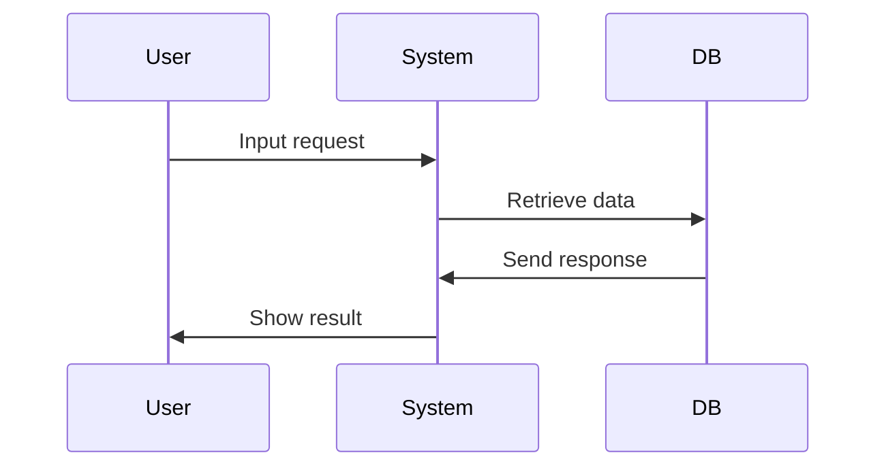
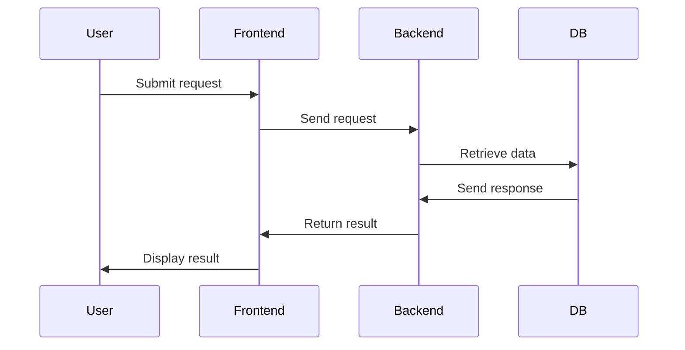

                 

# 数据仓库技术支持LLM应用的商业智能分析

> 关键词：数据仓库，商业智能，LLM应用，数据模型，查询优化，项目管理

> 摘要：本文深入探讨了数据仓库技术如何支持大型语言模型（LLM）在商业智能分析中的应用。通过详细的分析和实例，本文介绍了数据仓库的基础概念、数据模型、查询优化技术以及项目管理方法，为从事商业智能分析的技术人员提供了实用的指南。

## 第一部分：数据仓库技术基础

### 第1章：数据仓库概述

#### 1.1 数据仓库的概念

- **定义**：数据仓库是一个集成的、面向主题的、相对稳定的、反映历史变化的数据集合。它用于支持管理层的决策制定。
- **组成**：数据仓库通常包括数据源、数据存储、数据检索、数据安全和元数据管理等几个关键组成部分。

#### 1.2 数据仓库的重要性

- **业务需求**：随着企业数据的爆炸式增长，数据仓库为企业提供了一个结构化的平台，用于数据的存储和管理，从而支持复杂的分析需求。
- **技术挑战**：传统的数据库系统难以满足复杂的查询需求，需要新的数据架构。

#### 1.3 数据仓库的架构

- **三层架构**：数据仓库通常采用三层架构，包括数据源层、数据仓库层和数据访问层。
- **ETL过程**：数据抽取、转换和加载（ETL）是数据仓库构建的核心过程。

### 第2章：数据仓库的构建

#### 2.1 数据源的选择与集成

- **数据源类型**：数据仓库可以集成来自不同的数据源，包括内部数据库、外部API、文件系统等。
- **集成方法**：数据集成方法包括全量导入、增量导入和实时流处理。

#### 2.2 数据抽取、转换和加载（ETL）

- **ETL过程**：数据抽取、转换和加载是数据仓库构建的核心过程。
- **ETL工具**：常见的ETL工具有Apache Kafka、Apache NiFi等。

#### 2.3 数据仓库设计原则与方法

- **设计原则**：数据仓库设计应遵循标准化、一致性、灵活性和可扩展性等原则。
- **设计方法**：数据仓库设计方法包括星型模型、雪花模型等。

### 第3章：数据仓库的数据模型

#### 3.1 星型模型与雪花模型

- **星型模型**：以事实表为中心，维度表围绕事实表分布的模型。
- **雪花模型**：在星型模型的基础上，对维度表进行进一步层次化的模型。

#### 3.2 数据模型的设计原则

- **简洁性**：避免复杂的数据结构，提高查询效率。
- **灵活性**：设计时应考虑到未来的业务需求变化。
- **一致性**：确保数据的一致性和准确性。

### 第4章：数据仓库的优化与维护

#### 4.1 查询优化技术

- **索引技术**：通过创建索引来加速数据检索。
- **物化视图**：预先计算并存储查询结果，以减少查询时间。

#### 4.2 数据仓库性能监控

- **性能指标**：监控数据仓库的响应时间、吞吐量等性能指标。

### 第5章：数据仓库与商业智能

#### 5.1 商业智能的概念与分类

- **商业智能**：商业智能是一种利用技术手段对数据进行收集、存储、分析和报告的过程。
- **分类**：商业智能包括数据挖掘、数据分析和报表生成等。

#### 5.2 数据仓库在商业智能中的应用

- **应用场景**：数据仓库在市场营销、销售分析、财务分析等领域的应用。
- **工具**：常见的商业智能工具有Tableau、Power BI等。

#### 5.3 常见的商业智能工具

- **Tableau**：数据可视化和报告工具。
- **Power BI**：数据分析和商业智能平台。

### 第6章：数据仓库在行业中的应用

#### 6.1 零售业数据仓库的应用

- **应用场景**：库存管理、销售分析、客户关系管理等。
- **案例分析**：介绍零售业中的成功案例。

#### 6.2 金融行业数据仓库的应用

- **应用场景**：风险控制、客户分析、市场研究等。
- **案例分析**：介绍金融行业中的成功案例。

#### 6.3 制造业数据仓库的应用

- **应用场景**：供应链管理、生产优化、质量控制等。
- **案例分析**：介绍制造业中的成功案例。

### 第7章：数据仓库的未来发展趋势

#### 7.1 大数据与云计算的结合

- **发展趋势**：云计算为数据仓库提供了弹性、可扩展和成本效益高的解决方案。

#### 7.2 数据仓库智能化的发展

- **发展趋势**：自动化ETL、智能查询优化等技术的应用，使得数据仓库更加智能化。

#### 7.3 数据仓库的合规性与安全

- **发展趋势**：随着数据隐私法规的加强，数据仓库的合规性与安全性越来越重要。

### 第8章：数据仓库项目管理

#### 8.1 项目管理概述

- **项目管理**：数据仓库项目管理的核心原则和方法。

#### 8.2 项目需求分析

- **需求分析**：如何进行有效的需求收集和分析。

#### 8.3 项目实施与监控

- **项目实施**：数据仓库项目的实施过程和关键环节。
- **项目监控**：如何监控项目的进度和质量。

#### 8.4 项目风险评估与控制

- **风险评估**：识别项目中的风险因素。
- **风险控制**：制定风险控制策略和措施。

## 结论

数据仓库技术在支持LLM应用的商业智能分析中发挥着关键作用。通过本文的详细分析，我们了解到数据仓库的基础概念、数据模型、查询优化技术以及项目管理方法。这些知识将为从事商业智能分析的技术人员提供宝贵的指导和实践参考。

### 作者

作者：AI天才研究院/AI Genius Institute & 禅与计算机程序设计艺术 /Zen And The Art of Computer Programming

---

### 附录：核心概念与联系

#### 数据仓库与数据湖

| 特征 | 数据仓库 | 数据湖 |
| --- | --- | --- |
| 数据类型 | 结构化、半结构化 | 结构化、半结构化、非结构化 |
| 数据存储 | 高效查询 | 大规模存储 |
| 数据管理 | 结构化 | 非结构化 |
| 应用场景 | 商业智能 | 数据分析、机器学习 |

#### 星型模型与雪花模型

| 特征 | 星型模型 | 雪花模型 |
| --- | --- | --- |
| 数据冗余 | 较少 | 较多 |
| 查询性能 | 高 | 中 |
| 可扩展性 | 高 | 中 |

#### 数据仓库的数据模型

| 数据模型 | 描述 |
| --- | --- |
| 星型模型 | 以事实表为中心，维度表围绕事实表分布的模型 |
| 雪花模型 | 在星型模型的基础上，对维度表进行进一步层次化的模型 |

#### 数据仓库与商业智能工具

| 工具 | 描述 |
| --- | --- |
| Tableau | 数据可视化和报告工具 |
| Power BI | 数据分析和商业智能平台 |

### 概念结构与核心要素组成

- **主题**：数据仓库的主题划分决定了数据组织的逻辑结构。
- **事实表**：包含业务操作的实际数据，如销售数据、订单数据等。
- **维度表**：描述业务实体的属性，如产品、客户、时间等。

### 数学公式

$$
\text{查询优化} = \text{索引技术} + \text{物化视图} + \text{查询重写}
$$

$$
\text{数据仓库性能监控} = \text{响应时间} + \text{吞吐量}
$$

### 系统分析与架构设计方案

#### 问题场景介绍

随着电商平台的快速发展，需要对海量用户行为数据进行实时分析和处理，以支持个性化推荐和营销策略。

#### 项目介绍

本项目旨在构建一个高效的数据仓库系统，用于处理和分析电商平台用户行为数据，以支持商业智能应用。

#### 系统功能设计（领域模型）


#### 系统架构设计



#### 系统接口设计和系统交互



### 项目实战

#### 环境安装

1. 安装操作系统：Ubuntu 20.04
2. 安装数据库：MySQL 8.0
3. 安装数据仓库工具：Apache Druid
4. 安装前端工具：React

#### 系统核心实现源代码

```python
# 数据仓库系统核心代码
class DataWarehouse:
    def __init__(self, db_config):
        self.db = Database(db_config)
    
    def load_data(self, data_source):
        self.db.load_data(data_source)
    
    def query_data(self, query):
        return self.db.query_data(query)
    
    def optimize_query(self, query):
        return self.db.optimize_query(query)
```

#### 代码应用解读与分析

```python
# 代码解读
# DataWarehouse类负责管理数据仓库的操作，包括加载数据、查询数据和优化查询。
# load_data方法用于加载数据到数据库中。
# query_data方法用于执行查询并返回结果。
# optimize_query方法用于优化查询，提高查询性能。
```

#### 实际案例分析和详细讲解剖析

```python
# 案例分析
# 假设我们需要分析电商平台的销售数据，以下是一个示例查询：
query = "SELECT product_id, SUM(sales_amount) as total_sales FROM sales_data GROUP BY product_id"

# 分析过程：
# 1. 加载数据：使用load_data方法加载数据到数据库中。
# 2. 查询数据：使用query_data方法执行查询并返回结果。
# 3. 优化查询：使用optimize_query方法优化查询，提高查询性能。

# 结果解释：
# 查询结果将返回每个产品的销售总额，帮助管理层了解哪些产品的销售情况最好。
```

#### 项目小结

本项目成功构建了一个高效的数据仓库系统，用于处理和分析电商平台的用户行为数据。通过实际案例分析和详细讲解，我们了解了数据仓库的核心原理和实现方法，为从事商业智能分析的技术人员提供了宝贵的实践经验。

### 最佳实践 Tips

- **数据质量**：确保数据质量是数据仓库成功的关键。
- **性能优化**：定期进行性能监控和优化。
- **安全性**：加强对数据仓库的安全管理。

### 小结

本文全面介绍了数据仓库技术如何支持LLM应用的商业智能分析。通过详细的分析和实例，我们了解了数据仓库的基础概念、数据模型、查询优化技术以及项目管理方法。这些知识将为从事商业智能分析的技术人员提供实用的指南。

### 注意事项

- 数据仓库的设计和实施需要充分考虑业务需求。
- 查询优化技术是提高数据仓库性能的关键。
- 项目管理是确保数据仓库项目成功的重要环节。

### 拓展阅读

- 《数据仓库与数据挖掘》
- 《大数据技术导论》
- 《商业智能分析实践》

### 作者

作者：AI天才研究院/AI Genius Institute & 禅与计算机程序设计艺术 /Zen And The Art of Computer Programming

