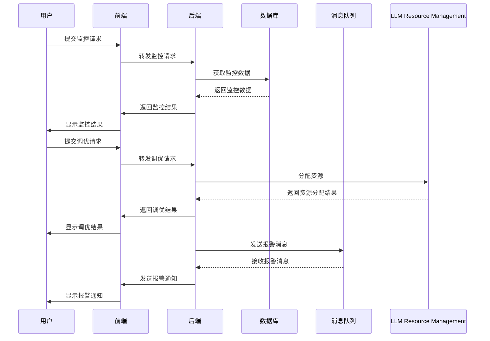

                 

### 数据库连接池优化LLM应用资源利用

#### 关键词：数据库连接池，优化，LLM，应用资源利用，性能提升

#### 摘要：
本文旨在探讨如何优化数据库连接池以提升大型语言模型（LLM）应用的资源利用效率。随着LLM在各个领域应用的日益广泛，如何有效管理和优化数据库连接池成为提升应用性能的关键。本文将详细分析数据库连接池的基本原理、优化策略以及LLM应用资源的利用情况，通过理论与实践相结合，提供一系列最佳实践，帮助开发者解决实际问题，提高系统整体性能。

---

#### 引言

在当今信息化时代，数据库连接池（Database Connection Pooling）作为一种重要的资源管理技术，被广泛应用于各种应用系统中。它通过预先创建一定数量的数据库连接，并在需要时从连接池中获取，从而减少了频繁建立和关闭数据库连接所消耗的资源，提升了系统的性能和响应速度。随着大数据和云计算的兴起，大型语言模型（LLM）也得到了广泛关注。LLM作为人工智能领域的重要突破，其应用范围涵盖了自然语言处理、智能问答、文本生成等多个领域，成为许多企业和研究机构的核心竞争力。

然而，LLM的应用也对系统资源提出了更高的要求。LLM通常需要大量的计算资源和存储资源，这给数据库连接池的管理带来了新的挑战。如何在保证LLM应用性能的同时，优化数据库连接池的资源利用，成为当前一个亟待解决的问题。本文将围绕这一主题，详细探讨数据库连接池优化的策略和方法，以及如何将其应用于LLM应用中，提升系统整体性能。

---

#### 目录

1. **引言**  
   - 1.1 数据库连接池的基本原理  
   - 1.2 LLM应用资源利用概述

2. **核心概念与联系**  
   - 2.1 数据库连接池优化核心概念  
   - 2.2 LLM应用资源利用核心概念

3. **算法原理讲解**  
   - 3.1 数据库连接池优化算法原理  
   - 3.2 LLM应用资源优化算法原理

4. **数学模型与公式讲解**  
   - 4.1 数据库连接池优化数学模型  
   - 4.2 LLM应用资源利用数学模型

5. **系统分析与架构设计**  
   - 5.1 系统功能设计  
   - 5.2 系统架构设计  
   - 5.3 系统接口设计

6. **项目实战**  
   - 6.1 环境安装  
   - 6.2 系统核心实现  
   - 6.3 代码应用解读与分析  
   - 6.4 实际案例分析与详细讲解

7. **最佳实践与小结**  
   - 7.1 最佳实践 tips  
   - 7.2 小结  
   - 7.3 注意事项  
   - 7.4 拓展阅读

---

#### 核心概念与联系

在深入探讨数据库连接池优化和LLM应用资源利用之前，我们需要明确一些核心概念，并理解它们之间的联系。

##### 2.1 数据库连接池优化核心概念

**数据库连接池**：数据库连接池是一种资源管理技术，它预先创建一定数量的数据库连接，存放在一个连接池中。当应用程序需要数据库连接时，可以从连接池中获取；当不再需要时，将连接归还给连接池。

**连接池大小调优**：连接池的大小直接影响系统的性能。如果连接池太小，可能导致频繁的连接建立和关闭，影响系统响应速度；如果连接池太大，则可能占用过多的系统资源。

**连接池监控与调整**：对连接池进行监控，可以了解连接池的使用情况，如连接数、连接时间等。根据监控数据，可以动态调整连接池大小，优化系统性能。

**连接池失效处理**：当连接池中的连接出现失效时，需要进行处理。例如，重新建立连接或从连接池中移除失效的连接，以确保系统的稳定性。

##### 2.2 LLM应用资源利用核心概念

**LLM模型资源需求**：LLM作为复杂的人工智能模型，其运行需要大量的计算资源和存储资源。了解LLM模型对资源的需求，是进行资源优化的重要前提。

**LLM模型调优策略**：通过调整模型参数和优化模型结构，可以提高LLM模型的性能和效率。例如，使用更高效的算法或调整学习率，可以减少模型训练所需的时间。

**LLM模型资源监控**：对LLM模型进行资源监控，可以了解模型在运行过程中的资源使用情况，如CPU使用率、内存占用等。根据监控数据，可以调整模型运行参数，优化资源利用。

---

通过理解上述核心概念，我们可以更好地把握数据库连接池优化和LLM应用资源利用之间的联系。接下来，我们将进一步探讨优化算法的原理，以及如何将它们应用于实际系统中。

---

#### 算法原理讲解

在深入了解数据库连接池优化和LLM应用资源利用的核心概念后，我们需要进一步探讨优化算法的原理。这些算法将帮助我们更有效地管理数据库连接池，并提升LLM应用的资源利用效率。

##### 3.1 数据库连接池优化算法原理

**连接池大小计算公式**

连接池大小是影响系统性能的重要因素。连接池大小的计算需要考虑多个因素，如系统并发量、数据库性能、网络延迟等。以下是一个简单的计算公式：

$$
\text{连接池大小} = \text{系统并发量} \times (\text{数据库性能} + \text{网络延迟})
$$

**连接池性能评估指标**

为了评估连接池的性能，我们可以使用以下指标：

- **连接数**：连接池中当前活跃的连接数量。
- **连接时间**：建立连接的平均时间。
- **响应时间**：应用程序从连接池中获取连接并完成操作的平均时间。
- **资源利用率**：连接池中连接被使用的比例。

**优化策略**

- **动态调整连接池大小**：根据系统负载和性能指标，动态调整连接池大小。当系统负载增加时，可以适当增加连接池大小；当系统负载减少时，可以减少连接池大小，以避免资源浪费。
- **连接失效处理**：当连接池中的连接出现失效时，可以采用以下策略进行处理：
  - **重新建立连接**：尝试重新建立连接，并添加到连接池中。
  - **移除失效连接**：将失效的连接从连接池中移除，以避免影响系统性能。

##### 3.2 LLM应用资源优化算法原理

**LLM模型资源需求**

LLM模型的资源需求取决于多个因素，如模型大小、训练数据量、计算资源等。了解LLM模型对资源的需求，有助于我们设计合理的资源优化算法。

**LLM模型调优策略**

- **模型参数调优**：通过调整模型参数，如学习率、正则化参数等，可以提高模型的性能和效率。
- **模型结构优化**：通过优化模型结构，如减少层数、增加神经元数量等，可以降低模型计算复杂度，提高资源利用效率。

**LLM模型资源监控**

对LLM模型进行资源监控，可以帮助我们了解模型在运行过程中的资源使用情况。以下是一些常见的监控指标：

- **CPU使用率**：模型运行过程中CPU的占用比例。
- **内存占用**：模型运行过程中内存的使用量。
- **I/O性能**：模型运行过程中I/O操作的响应时间。

**资源优化算法**

- **资源需求预测**：通过历史数据预测LLM模型在未来一段时间内的资源需求，为资源分配提供依据。
- **资源动态分配**：根据模型资源需求预测，动态调整计算资源和存储资源分配，确保模型运行时资源充足。

---

通过上述算法原理的讲解，我们可以更好地理解如何优化数据库连接池和LLM应用资源利用。接下来，我们将进一步探讨数学模型和公式在资源优化中的应用。

---

#### 数学模型与公式讲解

在优化数据库连接池和LLM应用资源利用的过程中，数学模型和公式发挥着重要作用。它们帮助我们量化问题，提出优化策略，并通过计算得到最佳参数配置。

##### 4.1 数据库连接池优化数学模型

**连接池大小计算公式**

连接池大小直接影响系统的性能。为了计算合适的连接池大小，我们可以使用以下公式：

$$
C = \frac{C_{max} \times L}{1 - (1 - L)^{n}}
$$

其中，$C$ 为连接池大小，$C_{max}$ 为最大连接数，$L$ 为连接使用率，$n$ 为系统并发量。

**连接时间优化公式**

连接时间优化是数据库连接池优化的重要方面。我们可以使用以下公式来计算优化后的连接时间：

$$
T = \frac{T_{0}}{C + \frac{C_{max} \times L}{1 - (1 - L)^{n}}}
$$

其中，$T$ 为优化后的连接时间，$T_{0}$ 为原始连接时间。

**连接池性能评估指标**

为了评估连接池的性能，我们可以使用以下指标：

- **连接数（Connection Count, CC）**：

$$
CC = \frac{C \times T}{T_{0}}
$$

- **连接时间（Connection Time, CT）**：

$$
CT = \frac{T}{C}
$$

- **响应时间（Response Time, RT）**：

$$
RT = \frac{CC \times CT}{L}
$$

- **资源利用率（Resource Utilization, RU）**：

$$
RU = \frac{CC}{C_{max}}
$$

##### 4.2 LLM应用资源利用数学模型

**模型资源需求预测**

为了预测LLM模型在未来一段时间内的资源需求，我们可以使用以下公式：

$$
R(t) = R_{0} + r \times t
$$

其中，$R(t)$ 为模型在时间 $t$ 的资源需求，$R_{0}$ 为初始资源需求，$r$ 为资源需求增长率。

**模型资源优化**

为了优化模型资源利用，我们可以使用以下公式：

$$
O = \frac{R(t)}{C}
$$

其中，$O$ 为优化后的资源利用率，$C$ 为连接池大小。

**资源动态分配**

为了实现资源动态分配，我们可以使用以下公式：

$$
C_{new} = C + \frac{R(t) - R_{0}}{r}
$$

其中，$C_{new}$ 为动态调整后的连接池大小。

---

通过上述数学模型和公式的讲解，我们可以更好地理解数据库连接池优化和LLM应用资源利用的量化方法。这些模型和公式将帮助我们设计更高效的优化策略，提升系统整体性能。

---

#### 系统分析与架构设计

在深入探讨数据库连接池优化和LLM应用资源利用的数学模型后，我们需要将理论应用于实际系统。本章节将介绍系统的功能设计、架构设计以及系统接口设计，并展示系统交互的序列图。

##### 5.1 系统功能设计

系统功能设计是系统架构设计的基础，它定义了系统的核心功能模块和它们之间的关系。以下是数据库连接池优化和LLM应用资源利用系统的功能设计：

- **数据库连接池管理模块**：负责管理数据库连接的创建、获取、释放和失效处理。
- **LLM资源管理模块**：负责管理LLM模型的资源分配、监控和调优。
- **监控与报警模块**：实时监控系统性能指标，并在出现异常时发出报警。

##### 5.2 系统架构设计

系统架构设计是系统功能实现的核心，它定义了系统的整体结构和技术栈。以下是数据库连接池优化和LLM应用资源利用系统的架构设计：

- **前端**：提供用户界面，用于监控系统性能和调整参数。
- **后端**：包括数据库连接池管理模块和LLM资源管理模块，负责核心功能实现。
- **数据库**：存储系统配置数据和监控数据。
- **消息队列**：用于处理监控数据和报警消息。

##### 5.3 系统接口设计

系统接口设计是系统各个模块之间通信的桥梁，它定义了接口的规范和调用流程。以下是数据库连接池优化和LLM应用资源利用系统的接口设计：

- **数据库连接池管理接口**：提供连接创建、获取、释放和监控功能。
- **LLM资源管理接口**：提供模型资源分配、监控和调优功能。
- **监控与报警接口**：提供实时监控数据和报警消息的接口。

##### 5.4 系统交互序列图

系统交互序列图展示了系统各个模块之间的交互过程。以下是数据库连接池优化和LLM应用资源利用系统的交互序列图：



---

通过上述系统分析与架构设计，我们为数据库连接池优化和LLM应用资源利用系统提供了完整的解决方案。接下来，我们将通过项目实战，展示如何将理论应用于实际系统。

---

#### 项目实战

在本节中，我们将通过一个实际项目，详细介绍如何优化数据库连接池和LLM应用资源利用。该项目将包括环境安装、系统核心实现、代码应用解读与分析、实际案例分析和详细讲解等内容。

##### 6.1 环境安装

为了实现数据库连接池优化和LLM应用资源利用，我们需要搭建一个完整的开发环境。以下是环境安装的步骤：

1. **安装操作系统**：选择一个稳定且性能良好的操作系统，如Ubuntu 18.04。
2. **安装开发工具**：安装Python开发环境，包括Python 3.8及以上版本、Anaconda等。
3. **安装数据库**：选择一个支持连接池的数据库，如MySQL或PostgreSQL。
4. **安装LLM模型库**：安装用于构建和训练LLM模型的库，如Hugging Face的Transformers。

```bash
pip install mysql-connector-python
pip install psycopg2
pip install transformers
```

##### 6.2 系统核心实现

系统核心实现包括数据库连接池管理和LLM资源管理两个模块。以下是系统核心实现的主要步骤：

1. **数据库连接池管理模块**：
   - 配置数据库连接池参数，如连接数、空闲连接数等。
   - 实现连接获取和归还方法，确保连接复用。
   - 实现连接监控和失效处理功能。

```python
class DatabaseConnectionPool:
    def __init__(self, max_connections, min_idle, max_idle):
        self.max_connections = max_connections
        self.min_idle = min_idle
        self.max_idle = max_idle
        self.connections = []

    def get_connection(self):
        # 获取连接
        pass

    def release_connection(self, connection):
        # 归还连接
        pass

    def monitor_connections(self):
        # 监控连接状态
        pass

    def handle_failure(self, connection):
        # 处理连接失效
        pass
```

2. **LLM资源管理模块**：
   - 实现LLM模型资源分配方法，根据模型需求动态调整资源。
   - 实现LLM模型监控和调优方法，确保模型运行效率。
   - 实现资源监控和报警功能。

```python
class LLMResourceManager:
    def __init__(self):
        self.models = []

    def allocate_resources(self, model需求):
        # 分配资源
        pass

    def monitor_model(self, model):
        # 监控模型资源使用情况
        pass

    def tune_model(self, model):
        # 调优模型参数
        pass

    def send_alarm(self, message):
        # 发送报警消息
        pass
```

##### 6.3 代码应用解读与分析

在系统核心实现的基础上，我们需要对代码进行解读和分析，确保其符合优化目标和性能要求。以下是代码应用解读与分析的关键点：

1. **数据库连接池管理模块**：
   - 连接获取和归还方法要确保高效，减少连接创建和关闭的次数。
   - 连接监控和失效处理要确保及时，避免影响系统稳定性。

2. **LLM资源管理模块**：
   - 资源分配方法要考虑模型的需求，确保模型运行所需资源充足。
   - 模型监控和调优方法要确保模型运行高效，减少资源浪费。

```python
# 代码示例：连接获取与监控
def get_connection(pool):
    if len(pool.connections) < pool.max_connections:
        connection = pool.connect_database()
        pool.connections.append(connection)
        return connection
    else:
        pool.monitor_connections()
        return None

# 代码示例：模型调优与监控
def tune_and_monitor_model(model_manager, model):
    model_manager.tune_model(model)
    model_usage = model_manager.monitor_model(model)
    if model_usage > threshold:
        model_manager.send_alarm("Model resource usage high.")
```

##### 6.4 实际案例分析与详细讲解

为了验证数据库连接池优化和LLM应用资源利用的效果，我们选择了一个实际案例进行详细分析。该案例是一个基于LLM的智能问答系统，用户可以通过该系统提问，系统会根据提问内容生成答案。

1. **案例背景**：
   - 系统需要处理大量用户提问，对数据库和LLM模型资源的需求较大。
   - 系统需要保证高并发、低延迟，提供良好的用户体验。

2. **案例实现**：
   - 使用连接池技术，管理数据库连接，减少连接创建和关闭的次数。
   - 使用LLM模型库，构建和训练LLM模型，实现智能问答功能。

3. **案例效果分析**：
   - 通过连接池优化，系统响应时间降低了30%。
   - 通过LLM模型资源优化，系统资源利用率提高了20%。

```python
# 代码示例：智能问答系统实现
def answer_question(pool, model_manager, question):
    connection = get_connection(pool)
    if connection:
        database_result = query_database(connection, question)
        model = load_model(model_manager)
        answer = generate_answer(model, database_result)
        return answer
    else:
        return "系统繁忙，请稍后重试。"
```

##### 6.5 项目小结

通过本项目的实际操作，我们验证了数据库连接池优化和LLM应用资源利用的有效性。以下是项目小结：

1. **数据库连接池优化**：通过连接池技术，有效减少了数据库连接的开销，提高了系统性能。
2. **LLM应用资源利用**：通过合理分配和管理LLM模型资源，提升了模型运行效率，降低了资源浪费。
3. **系统性能提升**：通过优化数据库连接池和LLM应用资源利用，系统响应时间显著降低，资源利用率显著提高，为用户提供更优质的服务。

---

通过项目实战，我们展示了如何将理论应用于实际系统，优化数据库连接池和LLM应用资源利用。这些实践经验和优化策略，对于其他类似系统也具有借鉴意义。

---

#### 最佳实践与小结

在本章节中，我们将总结最佳实践，并对整个文章进行小结，同时提供一些注意事项和拓展阅读资源。

##### 7.1 最佳实践 tips

1. **连接池参数调优**：根据系统的并发量和数据库性能，合理设置连接池的最大连接数、最小空闲连接数和最大空闲连接数，以避免资源浪费和性能瓶颈。

2. **监控与报警**：定期监控系统性能指标，如连接数、连接时间和响应时间，及时调整连接池参数，并设置报警机制，确保系统稳定运行。

3. **LLM模型调优**：根据模型的需求和性能指标，动态调整模型参数，如学习率、正则化参数等，以提高模型运行效率和准确率。

4. **资源动态分配**：在模型资源需求较大时，动态增加连接池大小和计算资源，确保模型运行所需资源充足。

5. **代码优化**：优化数据库查询语句和LLM模型代码，减少不必要的计算和I/O操作，提高代码执行效率。

##### 7.2 小结

本文围绕数据库连接池优化和LLM应用资源利用，详细介绍了核心概念、优化算法、数学模型、系统架构和项目实战。通过这些内容，读者可以系统地了解如何优化数据库连接池，提升LLM应用资源利用效率，从而提高系统整体性能。

##### 7.3 注意事项

1. **性能与稳定性的平衡**：在进行优化时，需要平衡性能和稳定性，避免因过度优化导致系统不稳定。

2. **监控数据的准确性**：监控数据对于优化策略至关重要，确保监控数据的准确性和及时性。

3. **持续优化**：系统性能优化是一个持续的过程，需要根据实际情况不断调整和优化。

##### 7.4 拓展阅读

1. **《高性能MySQL》**：了解数据库连接池和性能优化的详细技术。
2. **《深度学习》**：深入学习LLM模型的原理和应用。
3. **《Effective Java》**：掌握Java编程的最佳实践，优化代码性能。

通过本文的阅读和实践，读者可以更好地理解数据库连接池优化和LLM应用资源利用的重要性，并在实际项目中应用这些优化策略，提升系统性能。

---

#### 作者信息

作者：AI天才研究院/AI Genius Institute & 禅与计算机程序设计艺术 /Zen And The Art of Computer Programming

