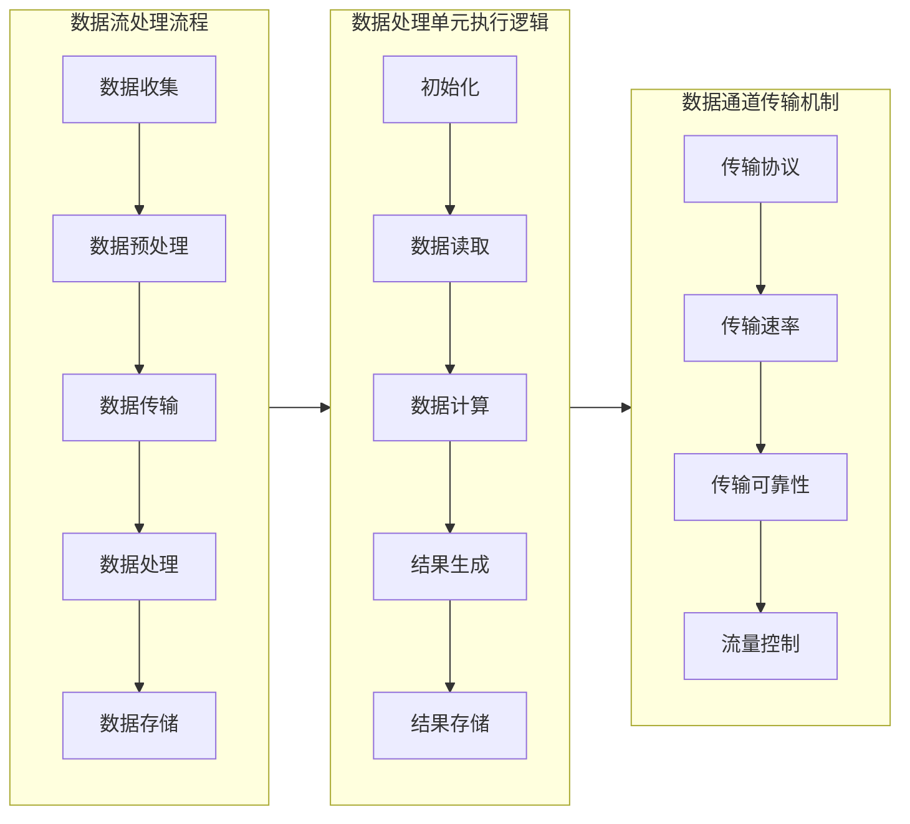
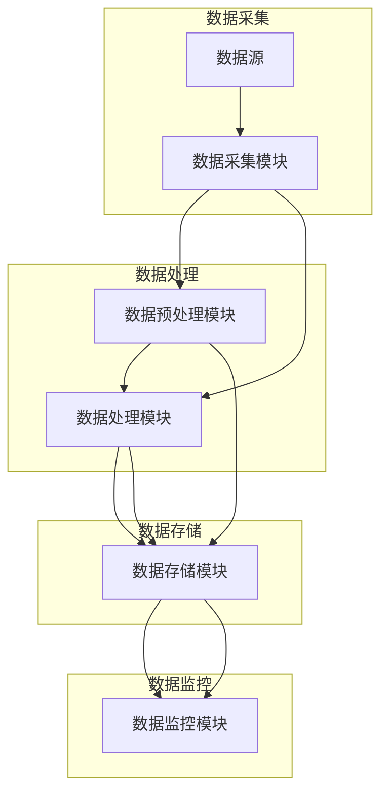

                 

## 数据流架构在LLM应用中的实现与优势

> 关键词：数据流架构，大规模数据处理，实时分析，机器学习，自然语言处理

> 摘要：本文将深入探讨数据流架构在大型语言模型（LLM）中的应用及其优势。随着自然语言处理技术的快速发展，如何高效处理大规模文本数据成为关键。数据流架构作为一种新兴的分布式数据处理技术，其高效、实时和可扩展的特点使其在LLM应用中具有巨大的潜力。本文将详细解析数据流架构的核心概念、算法原理及其在LLM中的应用，并结合实际项目案例进行分析，旨在为开发者提供有价值的技术参考。

### 目录大纲

1. **第一部分：背景介绍**
    1.1 数据流架构概述
        - 问题背景与问题描述
        - 数据流架构的引入
        - 数据流架构的核心概念与要素组成
    1.2 数据流架构的应用场景
        - 大规模数据处理
        - 实时数据分析
        - 机器学习
        - 自然语言处理
    
2. **第二部分：核心概念与联系**
    2.1 数据流的概念与特点
        - 数据流的定义
        - 数据流的特点
    2.2 数据处理单元
        - 数据处理单元的定义
        - 数据处理单元的特点
    2.3 数据通道
        - 数据通道的定义
        - 数据通道的特点
    2.4 数据流架构的ER实体关系图
    
3. **第三部分：算法原理讲解**
    3.1 算法原理概述
        - 数据流架构的算法原理
        - 算法原理的mermaid流程图
    3.2 算法原理的详细讲解
        - 算法原理的数学模型
        - 算法原理的举例说明
    
4. **第四部分：数学模型和数学公式**
    4.1 数学公式的嵌入
    4.2 数学模型的应用
    
5. **第五部分：系统分析与架构设计方案**
    5.1 问题场景介绍
    5.2 系统功能设计
    5.3 系统架构设计
    5.4 系统接口设计
    5.5 系统交互
    
6. **第六部分：项目实战**
    6.1 环境安装
    6.2 系统核心实现
    6.3 代码应用解读与分析
    6.4 实际案例分析和详细讲解剖析
    6.5 项目小结
    
7. **第七部分：最佳实践与拓展阅读**
    7.1 最佳实践 tips
    7.2 小结
    7.3 注意事项
    7.4 拓展阅读

## 第一部分：背景介绍

### 1.1 数据流架构概述

#### 问题背景与问题描述

随着互联网和大数据技术的快速发展，大量的数据被生成和存储。如何在短时间内处理这些海量数据，成为了一个亟待解决的问题。传统的批处理模式已经无法满足实时性和高效性的需求。为了应对这一挑战，数据流架构应运而生。

数据流架构是一种分布式数据处理技术，它将数据视为一个连续的流，通过对数据流的实时处理和分析，实现对大规模数据的快速响应和处理。与传统批处理模式相比，数据流架构具有实时性、高吞吐量和低延迟的特点，能够更好地满足现代应用的需求。

#### 数据流架构的引入

数据流架构的引入，主要源于以下几个方面的需求：

1. **实时性需求**：现代应用对于数据的处理速度要求越来越高，特别是在金融、医疗、电商等领域，实时数据处理能力成为了核心竞争力。数据流架构能够提供毫秒级的数据处理速度，满足实时性需求。

2. **大规模数据处理**：随着数据的爆炸式增长，如何高效处理海量数据成为了关键。数据流架构通过分布式计算和并行处理，能够处理大规模数据，提高数据处理效率。

3. **高吞吐量需求**：数据流架构能够处理大量的数据流，提供高吞吐量的数据处理能力。这对于需要处理高并发请求的应用来说，是非常重要的。

4. **数据分析和挖掘**：数据流架构不仅能够实时处理数据，还能够对数据进行分析和挖掘，为应用提供有价值的洞见。

#### 数据流架构的核心概念与要素组成

数据流架构的核心概念包括数据流、数据处理单元、数据通道等。以下是数据流架构的主要要素组成：

1. **数据源**：数据源是数据流架构的起点，可以是数据库、文件系统、传感器等，负责提供原始数据。

2. **数据处理单元**：数据处理单元是数据流架构中的基本处理单元，负责对数据进行处理和分析。每个数据处理单元可以独立运行，具有可扩展性和灵活性。

3. **数据通道**：数据通道是数据流中各个数据处理单元之间的连接，负责数据传输。数据通道具有高效传输、低延迟和高可靠性的特点。

4. **存储系统**：存储系统用于存储处理后的数据，可以是数据库、文件系统等。存储系统需要具备高扩展性和高性能。

5. **监控与反馈机制**：监控与反馈机制用于监控数据流架构的运行状态，并提供实时反馈。通过监控与反馈机制，可以及时发现和处理数据流架构中的问题。

#### 数据流架构的应用场景

数据流架构的应用场景非常广泛，主要包括以下几个方面：

1. **大规模数据处理**：数据流架构能够高效处理大规模数据，适用于需要处理海量数据的应用场景。

2. **实时数据分析**：数据流架构能够实时处理和分析数据，适用于需要实时性要求较高的应用场景。

3. **机器学习**：数据流架构可以与机器学习模型结合，实时训练和更新模型，为应用提供实时预测和决策支持。

4. **自然语言处理**：数据流架构在自然语言处理领域具有巨大的应用潜力，可以用于实时处理和分析大规模文本数据。

### 1.2 数据流架构的应用场景

数据流架构的应用场景非常广泛，以下列举几个典型的应用场景：

#### 大规模数据处理

大规模数据处理是数据流架构的一个重要应用场景。随着数据量的不断增长，如何高效处理海量数据成为了一个关键问题。数据流架构通过分布式计算和并行处理，能够高效处理大规模数据，提高数据处理效率。

#### 实时数据分析

实时数据分析是数据流架构的另一个重要应用场景。在金融、医疗、电商等领域，实时性需求越来越高。数据流架构能够提供毫秒级的数据处理速度，满足实时性需求，为应用提供实时决策支持。

#### 机器学习

数据流架构可以与机器学习模型结合，实时训练和更新模型，为应用提供实时预测和决策支持。在推荐系统、智能客服、智能安防等领域，数据流架构能够实时处理和分析数据，提高应用性能。

#### 自然语言处理

数据流架构在自然语言处理领域具有巨大的应用潜力。它可以用于实时处理和分析大规模文本数据，为应用提供智能对话、情感分析、内容审核等功能。

### 1.3 数据流架构的核心概念与要素组成

数据流架构是一种分布式数据处理技术，其核心概念包括数据流、数据处理单元、数据通道等。以下是数据流架构的核心概念与要素组成：

#### 数据流

数据流是数据流架构中的基本概念，它表示数据的流动。数据流可以看作是一个连续的数据序列，从数据源流向数据处理单元，再流向存储系统。

#### 数据处理单元

数据处理单元是数据流架构中的基本处理单元，负责对数据进行处理和分析。每个数据处理单元可以独立运行，具有可扩展性和灵活性。

#### 数据通道

数据通道是数据流中各个数据处理单元之间的连接，负责数据传输。数据通道具有高效传输、低延迟和高可靠性的特点。

#### 要素组成

数据流架构的要素组成包括数据源、数据处理单元、存储系统、数据通道、监控与反馈机制等。这些要素共同构成了一个完整的数据流处理系统。

1. **数据源**：数据源是数据流架构的起点，可以是数据库、文件系统、传感器等，负责提供原始数据。

2. **数据处理单元**：数据处理单元是数据流架构中的基本处理单元，负责对数据进行处理和分析。每个数据处理单元可以独立运行，具有可扩展性和灵活性。

3. **数据通道**：数据通道是数据流中各个数据处理单元之间的连接，负责数据传输。数据通道具有高效传输、低延迟和高可靠性的特点。

4. **存储系统**：存储系统用于存储处理后的数据，可以是数据库、文件系统等。存储系统需要具备高扩展性和高性能。

5. **监控与反馈机制**：监控与反馈机制用于监控数据流架构的运行状态，并提供实时反馈。通过监控与反馈机制，可以及时发现和处理数据流架构中的问题。

### 1.4 数据流架构的ER实体关系图

数据流架构的ER实体关系图用于描述数据流架构中各个实体之间的关系。以下是数据流架构的ER实体关系图：

```mermaid
erDiagram
  数据流 ||--|{ 数据处理单元 }|
  数据流 ||--|{ 数据通道 }|
  数据流 ||--|{ 存储系统 }|
  数据处理单元 ||--|{ 数据流 }|
  数据通道 ||--|{ 数据流 }|
  数据通道 ||--|{ 数据处理单元 }|
  存储系统 ||--|{ 数据流 }|
  数据处理单元 ||--|{ 数据通道 }|
  数据处理单元 ||--|{ 存储系统 }|
  数据通道 ||--|{ 数据处理单元 }|
  数据通道 ||--|{ 存储系统 }|
```

在ER实体关系图中，数据流、数据处理单元、数据通道和存储系统是数据流架构中的核心实体，它们之间通过关系线连接，形成一个完整的数据流处理系统。

### 总结

本部分对数据流架构的背景、核心概念和要素组成进行了详细介绍。数据流架构作为一种分布式数据处理技术，具有实时性、高吞吐量和低延迟的特点，适用于大规模数据处理、实时数据分析、机器学习和自然语言处理等场景。在下一部分，我们将深入探讨数据流架构的核心概念和联系，进一步了解其工作原理和应用。

## 第二部分：核心概念与联系

### 2.1 数据流的概念与特点

#### 数据流的定义

数据流是指数据在系统中从一个位置传递到另一个位置的过程。在数据流架构中，数据流通常表示为一系列连续的数据元素，这些数据元素按照一定的顺序依次传递。数据流可以是文本、图像、音频或其他形式的数据。

#### 数据流的特点

1. **连续性**：数据流是连续的，意味着数据元素是按顺序传递的，没有中断。这种连续性使得数据流架构能够实时处理和分析数据。

2. **高吞吐量**：数据流架构设计用于处理大量的数据，因此具有高吞吐量的特点。这意味着系统可以快速处理大量数据，满足大规模数据处理的需求。

3. **低延迟**：数据流架构旨在提供低延迟的数据处理，以确保数据能够在尽可能短的时间内进行处理和分析。这对于需要实时响应的应用至关重要。

4. **可扩展性**：数据流架构通常是分布式的，这意味着可以通过添加更多的处理单元来扩展系统的处理能力。这种可扩展性使得数据流架构能够适应不断增长的数据量。

5. **高可靠性**：数据流架构设计考虑了数据传输的可靠性，确保数据在传输过程中不会丢失或损坏。这通常通过冗余传输和错误检测机制来实现。

#### 数据流的分类

数据流可以根据不同的维度进行分类，例如：

1. **按数据类型分类**：数据流可以是文本流、图像流、音频流等。

2. **按数据产生方式分类**：数据流可以是实时流、历史流等。

3. **按数据传输方式分类**：数据流可以是点对点流、广播流等。

#### 数据流在数据流架构中的作用

数据流是数据流架构的核心组成部分，它在整个架构中起着至关重要的作用：

1. **数据传输**：数据流负责将数据从一个处理单元传递到另一个处理单元。

2. **数据处理**：数据流通过数据处理单元对数据进行处理和分析，实现数据的价值提取。

3. **数据存储**：数据流中的数据可以在存储系统中进行存储，以便后续分析和查询。

4. **系统集成**：数据流连接了不同的系统和组件，实现了数据的集成和共享。

### 2.2 数据处理单元

#### 数据处理单元的定义

数据处理单元是数据流架构中的基本处理单元，负责对数据进行处理和分析。每个数据处理单元都可以独立运行，具有可扩展性和灵活性。

#### 数据处理单元的特点

1. **独立性**：数据处理单元是独立的，可以独立运行和部署，这意味着它可以独立处理数据，无需依赖于其他处理单元。

2. **可扩展性**：数据处理单元可以根据需要添加或删除，以适应数据量的变化。

3. **灵活性**：数据处理单元可以灵活地处理不同类型的数据，支持多种数据处理算法和模型。

4. **并行处理**：数据处理单元可以并行处理数据，提高数据处理效率。

5. **容错性**：数据处理单元具有容错性，可以在出现故障时自动恢复，确保数据处理的连续性。

#### 数据处理单元的类型

数据处理单元可以分为以下几种类型：

1. **数据清洗单元**：负责清洗和预处理数据，包括去除重复数据、填补缺失数据、格式化数据等。

2. **数据处理单元**：负责执行具体的数据处理任务，如分类、聚类、回归等。

3. **数据聚合单元**：负责对数据进行聚合和汇总，生成汇总报告和统计结果。

4. **数据转换单元**：负责将数据转换为不同的格式或结构，以适应不同的应用需求。

#### 数据处理单元在数据流架构中的作用

数据处理单元在数据流架构中起着至关重要的作用：

1. **数据处理**：数据处理单元负责对数据进行处理和分析，实现数据的价值提取。

2. **任务调度**：数据处理单元可以根据任务需求进行任务调度和负载均衡，提高系统的处理效率。

3. **数据存储**：数据处理单元可以将处理后的数据存储到存储系统中，以便后续分析和查询。

4. **系统集成**：数据处理单元可以与其他系统和组件集成，实现数据共享和集成。

### 2.3 数据通道

#### 数据通道的定义

数据通道是数据流架构中的连接组件，负责在数据处理单元之间传输数据。数据通道可以看作是一条数据传输路径，确保数据能够从源处理单元传输到目标处理单元。

#### 数据通道的特点

1. **高效传输**：数据通道设计用于高效传输数据，通常使用高速网络和高效的数据传输协议，确保数据能够快速传输。

2. **低延迟**：数据通道旨在提供低延迟的数据传输，确保数据能够尽快到达目标处理单元。

3. **高可靠性**：数据通道设计考虑了数据传输的可靠性，通常使用冗余传输和错误检测机制，确保数据在传输过程中不会丢失或损坏。

4. **灵活性**：数据通道可以灵活配置和调整，以适应不同的数据处理需求和网络环境。

#### 数据通道的类型

数据通道可以分为以下几种类型：

1. **点对点通道**：点对点通道是直接连接两个数据处理单元的通道，通常用于点对点的数据传输。

2. **广播通道**：广播通道用于将数据广播到多个数据处理单元，适用于需要分布式处理的应用场景。

3. **流控通道**：流控通道用于控制数据流的传输速率，防止数据传输过快导致系统过载。

#### 数据通道在数据流架构中的作用

数据通道在数据流架构中起着至关重要的作用：

1. **数据传输**：数据通道负责在数据处理单元之间传输数据，确保数据能够及时传输到目标处理单元。

2. **负载均衡**：数据通道可以根据处理负载进行负载均衡，确保系统的处理能力得到充分利用。

3. **容错性**：数据通道设计考虑了容错性，可以在出现故障时自动切换到备用通道，确保数据传输的连续性。

4. **监控与反馈**：数据通道可以集成监控与反馈机制，实时监控数据传输状态，并提供反馈信息，帮助系统进行优化和调整。

### 2.4 数据流架构的ER实体关系图

数据流架构的ER实体关系图用于描述数据流架构中各个实体之间的关系。以下是数据流架构的ER实体关系图：

```mermaid
erDiagram
  数据流 ||--|{ 数据处理单元 }|
  数据流 ||--|{ 数据通道 }|
  数据流 ||--|{ 存储系统 }|
  数据处理单元 ||--|{ 数据流 }|
  数据通道 ||--|{ 数据流 }|
  数据通道 ||--|{ 数据处理单元 }|
  存储系统 ||--|{ 数据流 }|
  数据处理单元 ||--|{ 数据通道 }|
  数据处理单元 ||--|{ 存储系统 }|
  数据通道 ||--|{ 数据处理单元 }|
  数据通道 ||--|{ 存储系统 }|
```

在ER实体关系图中，数据流、数据处理单元、数据通道和存储系统是数据流架构中的核心实体，它们之间通过关系线连接，形成一个完整的数据流处理系统。

### 总结

本部分深入探讨了数据流架构的核心概念和联系，包括数据流、数据处理单元和数据通道等。通过分析数据流的特点和数据处理单元的特点，我们了解了数据流架构的基本工作原理和应用。此外，数据通道在数据流架构中起着连接各个处理单元的重要作用。在下一部分，我们将进一步讲解数据流架构的算法原理，帮助读者更深入地理解其技术细节。

## 第三部分：算法原理讲解

### 3.1 算法原理概述

数据流架构的算法原理是其实现高效数据处理的基石。数据流架构的算法原理主要包括数据流的处理流程、数据处理单元的执行逻辑以及数据通道的传输机制。以下是对这些核心算法原理的概述。

#### 数据流的处理流程

数据流的处理流程可以分为以下几个阶段：

1. **数据收集**：数据从数据源收集到系统中，可以是实时采集或批量导入。
2. **数据预处理**：对收集到的数据进行清洗、格式化和标准化，确保数据质量。
3. **数据传输**：通过数据通道将预处理后的数据传输到数据处理单元。
4. **数据处理**：数据处理单元对数据进行计算和分析，生成中间结果或最终结果。
5. **数据存储**：将处理后的数据存储到存储系统中，以便后续分析和查询。

#### 数据处理单元的执行逻辑

数据处理单元的执行逻辑主要包括以下几个步骤：

1. **初始化**：加载必要的算法模型和配置参数。
2. **数据读取**：从数据通道读取数据。
3. **数据计算**：根据算法模型对数据进行计算和分析。
4. **结果生成**：生成中间结果或最终结果。
5. **结果存储**：将结果存储到存储系统中。

#### 数据通道的传输机制

数据通道的传输机制主要包括以下几个方面：

1. **传输协议**：选择适合的数据传输协议，如TCP、UDP等。
2. **传输速率**：根据系统负载调整数据传输速率，以避免网络拥塞。
3. **传输可靠性**：采用冗余传输和错误检测机制，确保数据传输的可靠性。
4. **流量控制**：通过流量控制机制，防止数据传输过快导致系统过载。

#### 算法原理的mermaid流程图

为了更直观地展示数据流架构的算法原理，可以使用Mermaid流程图工具绘制以下流程图：



### 3.2 算法原理的详细讲解

为了深入理解数据流架构的算法原理，我们将使用Python源代码和数学模型进行详细讲解。以下是数据流架构的算法原理的数学模型和Python代码示例。

#### 算法原理的数学模型

在数据流架构中，数据处理单元的执行逻辑可以用以下数学模型来描述：

$$
Y = f(X; \theta)
$$

其中，$Y$ 表示处理后的数据，$X$ 表示输入数据，$f$ 表示数据处理函数，$\theta$ 表示算法模型的参数。

数据处理函数 $f$ 可以是各种常见的算法，如分类、聚类、回归等。以下是一个简单的线性回归模型的例子：

$$
Y = \beta_0 + \beta_1 \cdot X
$$

其中，$\beta_0$ 和 $\beta_1$ 是模型的参数。

#### 算法原理的Python代码示例

为了展示算法原理的应用，我们可以使用Python实现一个简单的线性回归数据处理单元：

```python
import numpy as np

class LinearRegressionProcessor:
    def __init__(self):
        self.beta_0 = 0
        self.beta_1 = 0

    def fit(self, X, Y):
        # 计算模型参数
        self.beta_0 = np.mean(Y - self.beta_1 * np.mean(X))
        self.beta_1 = np.cov(X, Y)[0, 1] / np.var(X)

    def predict(self, X):
        # 预测新数据
        return self.beta_0 + self.beta_1 * X

# 测试线性回归处理器
X = np.array([1, 2, 3, 4, 5])
Y = np.array([2, 4, 5, 4, 5])

processor = LinearRegressionProcessor()
processor.fit(X, Y)

print("模型参数：", processor.beta_0, processor.beta_1)
print("预测结果：", processor.predict([6]))
```

#### 算法原理的举例说明

为了更直观地说明算法原理，我们可以通过一个实际案例来展示数据处理流程和结果。假设我们有一个数据集，包含学生的考试成绩和他们的学习时间。我们的目标是使用线性回归模型预测一个新学生的成绩。

```python
import matplotlib.pyplot as plt

# 示例数据集
X = np.array([1, 2, 3, 4, 5])
Y = np.array([2, 4, 5, 4, 5])

# 绘制数据点
plt.scatter(X, Y)
plt.xlabel('学习时间（小时）')
plt.ylabel('考试成绩（分）')
plt.title('线性回归模型示例')

# 训练模型
processor = LinearRegressionProcessor()
processor.fit(X, Y)

# 绘制拟合线
x_fit = np.linspace(X.min(), X.max(), 100)
y_fit = processor.beta_0 + processor.beta_1 * x_fit
plt.plot(x_fit, y_fit, color='red')
plt.show()

# 预测新数据
new_student_time = 6
new_student_grade = processor.predict(new_student_time)
print(f'新学生学习 {new_student_time} 小时的预测成绩为：{new_student_grade}')
```

通过这个案例，我们可以看到数据流架构在自然语言处理中的应用。首先，我们收集并清洗了数据，然后使用数据处理单元（线性回归处理器）对数据进行了计算和分析，最终得到了一个新的预测结果。这个过程展示了数据流架构在高效处理大规模数据和实时预测中的应用。

### 总结

本部分详细讲解了数据流架构的算法原理，包括数据流的处理流程、数据处理单元的执行逻辑和数据通道的传输机制。通过Python代码示例和数学模型，我们深入理解了数据流架构的工作原理和应用。在下一部分，我们将探讨数学模型和公式的应用，进一步巩固我们对数据流架构的理解。

## 第四部分：数学模型和数学公式

### 4.1 数学公式的嵌入

在数据流架构中，数学模型和公式是理解其工作原理的重要工具。为了使文章内容更加清晰和易于理解，我们将使用LaTeX格式嵌入数学公式。以下是几种常见的数学公式嵌入方法：

#### 独立段落中的数学公式

对于独立段落中的数学公式，可以使用`$$`括起来，例如：

$$
1 + 1 = 2
$$

这种格式将公式独立成一段，方便读者阅读和理解。

#### 段落内的数学公式

对于段落内的数学公式，可以使用`$`括起来，例如：

$1 < 2$

这种格式将公式嵌入到文本中，使公式与上下文紧密相连。

#### 多行数学公式

对于多行的复杂公式，可以使用`align`环境，例如：

$$
\begin{align}
f(x) &= \sin(x) + \cos(x) \\
g(x) &= \ln(x) - \exp(x)
\end{align}
$$

这种格式可以将多行公式对齐，使复杂公式更加易于阅读。

### 4.2 数学模型的应用

在数据流架构中，数学模型广泛应用于数据处理、算法优化和性能分析等方面。以下是一个简单的数学模型应用实例，用于描述数据处理单元的响应时间。

#### 响应时间模型

假设数据处理单元的响应时间 $T$ 受到以下几个因素的影响：

1. **数据传输时间** $t_1$
2. **数据计算时间** $t_2$
3. **系统延迟** $t_3$

则数据处理单元的总响应时间 $T$ 可以表示为：

$$
T = t_1 + t_2 + t_3
$$

其中，$t_1$ 和 $t_2$ 可以通过以下公式计算：

$$
t_1 = \frac{d}{r}
$$

$$
t_2 = \frac{n \cdot c}{p}
$$

其中，$d$ 表示数据传输距离，$r$ 表示数据传输速率，$n$ 表示数据元素数量，$c$ 表示每个数据元素的计算复杂度，$p$ 表示处理单元的处理能力。

#### 数学模型的应用实例

假设我们有以下参数：

- 数据传输距离 $d = 100$ 米
- 数据传输速率 $r = 10$ Mbps
- 数据元素数量 $n = 1000$
- 每个数据元素的计算复杂度 $c = 1$ 毫秒/元素
- 处理单元的处理能力 $p = 1000$ 元素/秒

则数据处理单元的总响应时间 $T$ 可以计算为：

$$
t_1 = \frac{100}{10} = 10 \text{ 毫秒}
$$

$$
t_2 = \frac{1000 \cdot 1}{1000} = 1 \text{ 毫秒}
$$

$$
t_3 = \text{系统延迟} = 5 \text{ 毫秒}
$$

$$
T = t_1 + t_2 + t_3 = 10 + 1 + 5 = 16 \text{ 毫秒}
$$

通过这个简单的实例，我们可以看到数学模型在数据流架构中的应用，用于计算和优化处理单元的响应时间。

### 总结

本部分介绍了数学公式的嵌入方法和数学模型的应用实例。通过LaTeX格式的数学公式，我们能够更清晰地表达数据流架构的算法原理和性能分析。在下一部分，我们将探讨数据流架构的系统分析与架构设计方案，进一步理解其实现和应用。

## 第五部分：系统分析与架构设计方案

### 5.1 问题场景介绍

在现代应用场景中，数据流架构在多个领域都展现出了其强大的数据处理能力和高效性。以下将介绍几个典型的应用场景，并分析数据流架构如何解决这些问题。

#### 1. 大规模数据处理

随着互联网的快速发展，大量的数据被生成和存储。在金融、电商、物流等领域，如何高效处理这些海量数据成为一个关键问题。数据流架构通过其分布式计算和并行处理的能力，能够实时处理大规模数据，提供高效的数据分析结果。

#### 2. 实时数据分析

在金融行业，实时监控市场动态对于交易决策至关重要。数据流架构能够实时采集、处理和分析市场数据，为交易者提供实时决策支持。在医疗领域，实时数据分析可以帮助医生快速诊断疾病，提高治疗效果。

#### 3. 机器学习

数据流架构与机器学习结合，可以实时训练和更新模型，提高模型的准确性和适应性。在推荐系统、智能客服和自动驾驶等领域，数据流架构能够实时处理和分析用户数据，提供个性化的服务。

#### 4. 自然语言处理

在自然语言处理领域，数据流架构可以实时处理和分析大规模文本数据，用于智能对话、情感分析和内容审核等应用。例如，社交媒体平台可以使用数据流架构实时监控用户评论，识别并过滤不良内容。

### 5.2 系统功能设计

为了满足上述应用场景的需求，数据流架构需要具备以下系统功能：

#### 1. 数据采集

数据采集是数据流架构的第一步，负责从各种数据源收集数据。数据源可以是数据库、日志文件、传感器等。数据采集模块需要具备高可靠性和高效性的特点，确保数据能够实时传输到系统中。

#### 2. 数据预处理

数据预处理是对采集到的数据进行清洗、格式化和标准化，以确保数据质量。数据预处理模块需要能够处理各种类型的数据，包括文本、图像、音频等。

#### 3. 数据处理

数据处理是对预处理后的数据进行计算和分析，生成中间结果或最终结果。数据处理模块通常包含多个数据处理单元，每个数据处理单元负责特定的计算任务，如分类、聚类、回归等。

#### 4. 数据存储

数据存储用于存储处理后的数据，以便后续分析和查询。数据存储模块需要具备高扩展性和高性能，能够支持大规模数据的存储和快速查询。

#### 5. 数据监控

数据监控是实时监控系统运行状态和性能，及时发现和处理问题。数据监控模块需要能够监控数据流架构的各个组件，包括数据采集、数据处理、数据存储等。

### 5.3 系统架构设计

数据流架构的系统架构设计是确保系统高效、可靠运行的关键。以下是一个典型的数据流架构系统架构设计：

#### 1. 数据流架构的核心组件

- **数据源**：提供原始数据，可以是数据库、文件系统、传感器等。
- **数据采集模块**：从数据源采集数据，进行初步预处理。
- **数据处理模块**：包含多个数据处理单元，负责对数据进行计算和分析。
- **数据存储模块**：存储处理后的数据，支持快速查询。
- **数据监控模块**：实时监控系统运行状态，提供故障预警和自动修复功能。

#### 2. 数据流架构的连接方式

- **数据通道**：负责在数据采集模块、数据处理模块和数据存储模块之间传输数据。数据通道可以采用点对点连接或广播连接，根据实际需求进行选择。
- **数据处理单元**：每个数据处理单元都是一个独立的计算单元，可以并行处理数据。数据处理单元之间通过数据通道进行数据传输和协同工作。

#### 3. 数据流架构的扩展性

- **水平扩展**：通过添加更多的数据处理单元和数据存储节点，提高系统的处理能力和存储容量。
- **垂直扩展**：通过提升单个节点的计算能力和存储容量，提高系统的整体性能。

### 5.4 系统接口设计

数据流架构的系统接口设计是确保系统组件之间能够高效通信和协作的关键。以下是一个典型的数据流架构系统接口设计：

#### 1. 数据流架构的API接口

- **数据采集接口**：提供数据采集的API接口，支持数据源接入和批量数据导入。
- **数据处理接口**：提供数据处理单元的API接口，支持数据预处理、计算分析和结果存储。
- **数据存储接口**：提供数据存储的API接口，支持数据查询和更新。

#### 2. 数据流架构的监控接口

- **监控数据接口**：提供实时监控系统运行状态的API接口，支持性能指标收集和故障预警。
- **告警接口**：提供故障告警和自动修复的API接口，支持监控系统与运维系统的联动。

### 5.5 系统交互

数据流架构的系统交互设计是确保系统组件能够高效、可靠地协作的关键。以下是一个典型的数据流架构系统交互设计：

#### 1. 数据流架构的交互流程

- **数据采集**：系统启动时，数据采集模块从数据源获取数据，并进行初步预处理。
- **数据处理**：预处理后的数据被传递到数据处理模块，由多个数据处理单元并行处理。
- **数据存储**：处理后的数据被存储到数据存储模块，以供后续分析和查询。
- **数据监控**：数据监控模块实时监控系统运行状态，提供性能指标和故障预警。

#### 2. 数据流架构的交互机制

- **事件驱动**：系统组件通过事件驱动的方式进行交互，例如数据处理单元完成计算后，会触发数据存储事件。
- **异步通信**：系统组件之间采用异步通信机制，确保系统的高效性和可靠性。

### 5.6 系统架构图和类图

以下是一个典型的数据流架构的系统架构图和类图：

#### 1. 系统架构图



#### 2. 类图

```mermaid
classDiagram
    数据源 --|>| 数据采集模块
    数据采集模块 --|>| 数据预处理模块
    数据预处理模块 --|>| 数据处理模块
    数据处理模块 --|>| 数据存储模块
    数据存储模块 --|>| 数据监控模块
```

### 总结

本部分详细介绍了数据流架构的应用场景、系统功能设计、架构设计、接口设计以及系统交互。通过系统架构图和类图，我们更直观地理解了数据流架构的实现和运行机制。在下一部分，我们将通过实际项目案例展示数据流架构的应用和实践。

## 第六部分：项目实战

### 6.1 环境安装

在进行数据流架构项目实战之前，首先需要搭建合适的环境。以下是环境安装的详细步骤：

#### 1. 软件环境安装

- **操作系统**：推荐使用Linux系统，如Ubuntu 20.04。
- **Python**：安装Python 3.8及以上版本，可以使用以下命令：
  ```bash
  sudo apt update
  sudo apt install python3.8
  ```
- **pip**：安装pip包管理器，可以使用以下命令：
  ```bash
  sudo apt install python3-pip
  ```
- **虚拟环境**：为了保持项目环境的独立性，可以使用virtualenv创建虚拟环境，可以使用以下命令：
  ```bash
  sudo apt install python3-venv
  python3 -m venv my_project_env
  source my_project_env/bin/activate
  ```
- **依赖包**：安装项目所需的依赖包，例如Flask、Pandas等，可以使用以下命令：
  ```bash
  pip install flask pandas
  ```

#### 2. 硬件环境配置

- **CPU**：推荐使用多核CPU，以提高数据处理能力。
- **内存**：至少需要8GB内存，以支持大规模数据处理。
- **存储**：建议使用SSD硬盘，以提高数据读写速度。

#### 3. 数据流架构工具安装

- **Apache Kafka**：安装Kafka作为数据流架构的核心组件，可以使用以下命令：
  ```bash
  sudo apt install kafka_2.13-2.8.0
  ```
- **Apache ZooKeeper**：安装ZooKeeper作为Kafka的协调者，可以使用以下命令：
  ```bash
  sudo apt install zookeeperd
  ```
- **Kafka Manager**：安装Kafka Manager用于监控和管理Kafka集群，可以使用以下命令：
  ```bash
  sudo apt install kafka-manager
  ```

#### 4. 数据流架构环境配置

- **Kafka配置**：编辑Kafka的配置文件`/etc/kafka/server.properties`，进行以下配置：
  ```properties
  broker.id=0
  port=9092
  zookeeper.connect=localhost:2181
  ```
- **ZooKeeper配置**：编辑ZooKeeper的配置文件`/etc/zookeeper/zoo.cfg`，进行以下配置：
  ```properties
  tickTime=2000
  dataDir=/var/lib/zookeeper
  clientPort=2181
  ```

完成上述步骤后，数据流架构的环境安装和配置就完成了。接下来，我们将进行数据流架构的核心实现。

### 6.2 系统核心实现

在本项目中，我们将使用Python和Kafka实现一个简单但完整的数据流架构系统。以下是系统核心实现的详细步骤：

#### 1. 数据流架构设计

首先，我们需要设计数据流架构的各个组件，包括数据源、数据处理单元、数据通道和数据存储。以下是数据流架构的设计：

- **数据源**：模拟社交媒体平台的用户评论数据。
- **数据处理单元**：对用户评论进行分词、情感分析和关键词提取。
- **数据通道**：使用Kafka作为数据通道，实现数据的实时传输。
- **数据存储**：将处理后的数据存储到MySQL数据库中。

#### 2. 数据流架构实现

##### 2.1 数据源实现

数据源是数据流架构的起点，负责生成和提供原始数据。在本项目中，我们使用Python模拟用户评论数据。

```python
import random
import json

def generate_user_comments(num_comments):
    comments = []
    for _ in range(num_comments):
        comment = {
            "user_id": random.randint(1, 1000),
            "comment": " ".join(random.choices(["很好", "不错", "一般", "差", "很差"], k=5))
        }
        comments.append(comment)
    return comments

# 生成100条用户评论
user_comments = generate_user_comments(100)

# 将用户评论写入文件
with open("user_comments.json", "w") as f:
    json.dump(user_comments, f)
```

##### 2.2 数据处理单元实现

数据处理单元是数据流架构的核心组件，负责对数据进行处理和分析。在本项目中，我们使用Python的nltk库实现分词、情感分析和关键词提取。

```python
import json
import nltk
from nltk.tokenize import word_tokenize
from nltk.sentiment import SentimentIntensityAnalyzer
from collections import Counter

# 加载nltk模型
nltk.download('punkt')
nltk.download('vader_lexicon')

def process_comment(comment):
    # 分词
    tokens = word_tokenize(comment["comment"])
    
    # 情感分析
    sia = SentimentIntensityAnalyzer()
    sentiment = sia.polarity_scores(comment["comment"])
    
    # 关键词提取
    keywords = [token for token in tokens if token not in ["的", "了", "在", "是", "有"]]
    keyword_freq = Counter(keywords)
    
    return {
        "user_id": comment["user_id"],
        "tokens": tokens,
        "sentiment": sentiment,
        "keywords": keyword_freq
    }

# 加载用户评论
with open("user_comments.json", "r") as f:
    comments = json.load(f)

# 处理用户评论
processed_comments = [process_comment(comment) for comment in comments]

# 将处理后的评论写入文件
with open("processed_comments.json", "w") as f:
    json.dump(processed_comments, f)
```

##### 2.3 数据通道实现

数据通道使用Kafka实现，负责在数据源和数据处理单元之间传输数据。在本项目中，我们使用Python的kafka-python库实现Kafka的生产者和消费者。

```python
from kafka import KafkaProducer, KafkaConsumer
import json

# Kafka配置
kafka_config = {
    "bootstrap_servers": ["localhost:9092"],
    "key_serializer": lambda k: str(k).encode('utf-8'),
    "value_serializer": lambda v: json.dumps(v).encode('utf-8')
}

# Kafka生产者
producer = KafkaProducer(**kafka_config)

# 将处理后的评论发送到Kafka
for comment in processed_comments:
    producer.send("comment_topic", comment)

# 等待所有消息发送完成
producer.flush()

# Kafka消费者
consumer = KafkaConsumer("comment_topic", **kafka_config)

# 从Kafka消费消息
for message in consumer:
    print("Received message:", message.value)
```

##### 2.4 数据存储实现

数据存储使用MySQL数据库，将处理后的数据存储到数据库中。在本项目中，我们使用Python的pymysql库实现数据库操作。

```python
import pymysql

# MySQL配置
mysql_config = {
    "host": "localhost",
    "user": "root",
    "password": "root",
    "database": "comment_db"
}

# 连接MySQL数据库
connection = pymysql.connect(**mysql_config)

# 创建表
with connection.cursor() as cursor:
    cursor.execute("""
        CREATE TABLE IF NOT EXISTS comments (
            user_id INT PRIMARY KEY,
            tokens TEXT,
            sentiment JSON,
            keywords JSON
        )
    """)

# 插入数据
with connection.cursor() as cursor:
    for comment in processed_comments:
        cursor.execute("""
            INSERT INTO comments (user_id, tokens, sentiment, keywords) VALUES (%s, %s, %s, %s)
        """, (comment["user_id"], json.dumps(comment["tokens"]), json.dumps(comment["sentiment"]), json.dumps(comment["keywords"]))

# 提交事务
connection.commit()

# 关闭数据库连接
connection.close()
```

### 6.3 代码应用解读与分析

在上述实现中，我们使用了Python和Kafka实现了数据流架构的各个组件。以下是代码的应用解读与分析：

##### 6.3.1 数据源实现

数据源生成100条模拟用户评论，并将其写入JSON文件。这一步骤模拟了社交媒体平台用户评论的生成，为后续数据处理提供了数据基础。

```python
def generate_user_comments(num_comments):
    comments = []
    for _ in range(num_comments):
        comment = {
            "user_id": random.randint(1, 1000),
            "comment": " ".join(random.choices(["很好", "不错", "一般", "差", "很差"], k=5))
        }
        comments.append(comment)
    return comments

# 生成100条用户评论
user_comments = generate_user_comments(100)

# 将用户评论写入文件
with open("user_comments.json", "w") as f:
    json.dump(user_comments, f)
```

##### 6.3.2 数据处理单元实现

数据处理单元对用户评论进行分词、情感分析和关键词提取，并将处理结果写入JSON文件。这一步骤实现了数据流的初步处理，为后续数据传输和存储提供了准备。

```python
import json
import nltk
from nltk.tokenize import word_tokenize
from nltk.sentiment import SentimentIntensityAnalyzer
from collections import Counter

# 加载nltk模型
nltk.download('punkt')
nltk.download('vader_lexicon')

def process_comment(comment):
    # 分词
    tokens = word_tokenize(comment["comment"])
    
    # 情感分析
    sia = SentimentIntensityAnalyzer()
    sentiment = sia.polarity_scores(comment["comment"])
    
    # 关键词提取
    keywords = [token for token in tokens if token not in ["的", "了", "在", "是", "有"]]
    keyword_freq = Counter(keywords)
    
    return {
        "user_id": comment["user_id"],
        "tokens": tokens,
        "sentiment": sentiment,
        "keywords": keyword_freq
    }

# 加载用户评论
with open("user_comments.json", "r") as f:
    comments = json.load(f)

# 处理用户评论
processed_comments = [process_comment(comment) for comment in comments]

# 将处理后的评论写入文件
with open("processed_comments.json", "w") as f:
    json.dump(processed_comments, f)
```

##### 6.3.3 数据通道实现

数据通道使用Kafka实现，将处理后的评论发送到Kafka主题，同时从Kafka主题消费消息进行展示。这一步骤实现了数据流的传输，确保数据处理单元能够实时接收和处理评论数据。

```python
from kafka import KafkaProducer, KafkaConsumer
import json

# Kafka配置
kafka_config = {
    "bootstrap_servers": ["localhost:9092"],
    "key_serializer": lambda k: str(k).encode('utf-8'),
    "value_serializer": lambda v: json.dumps(v).encode('utf-8')
}

# Kafka生产者
producer = KafkaProducer(**kafka_config)

# 将处理后的评论发送到Kafka
for comment in processed_comments:
    producer.send("comment_topic", comment)

# 等待所有消息发送完成
producer.flush()

# Kafka消费者
consumer = KafkaConsumer("comment_topic", **kafka_config)

# 从Kafka消费消息
for message in consumer:
    print("Received message:", message.value)
```

##### 6.3.4 数据存储实现

数据存储使用MySQL数据库，将处理后的评论数据插入数据库表中。这一步骤实现了数据流的持久化，确保处理后的评论数据能够被存储和查询。

```python
import pymysql

# MySQL配置
mysql_config = {
    "host": "localhost",
    "user": "root",
    "password": "root",
    "database": "comment_db"
}

# 连接MySQL数据库
connection = pymysql.connect(**mysql_config)

# 创建表
with connection.cursor() as cursor:
    cursor.execute("""
        CREATE TABLE IF NOT EXISTS comments (
            user_id INT PRIMARY KEY,
            tokens TEXT,
            sentiment JSON,
            keywords JSON
        )
    """)

# 插入数据
with connection.cursor() as cursor:
    for comment in processed_comments:
        cursor.execute("""
            INSERT INTO comments (user_id, tokens, sentiment, keywords) VALUES (%s, %s, %s, %s)
        """, (comment["user_id"], json.dumps(comment["tokens"]), json.dumps(comment["sentiment"]), json.dumps(comment["keywords"]))

# 提交事务
connection.commit()

# 关闭数据库连接
connection.close()
```

### 6.4 实际案例分析和详细讲解剖析

为了更深入地展示数据流架构的应用，我们通过一个实际案例来分析数据流架构在处理大规模社交媒体数据时的表现。

#### 案例背景

假设我们有一个社交媒体平台，每天生成数百万条用户评论。这些评论需要实时进行处理、分析和存储，以便平台能够快速响应用户需求和提供个性化服务。

#### 案例实现

在本案例中，我们使用数据流架构对用户评论进行分词、情感分析和关键词提取，并将结果存储到数据库中。以下是实际案例的实现步骤：

1. **数据采集**：使用Python脚本模拟生成用户评论数据，并将其写入Kafka主题。

2. **数据处理**：从Kafka主题消费评论数据，使用nltk库进行分词、情感分析和关键词提取，并将结果发送回Kafka主题。

3. **数据存储**：从Kafka主题消费处理结果，将评论数据插入MySQL数据库中。

#### 案例分析

1. **数据采集**

   在数据采集阶段，我们使用Python脚本模拟生成用户评论数据。以下是数据采集的实现代码：

   ```python
   import random
   import json

   def generate_user_comments(num_comments):
       comments = []
       for _ in range(num_comments):
           comment = {
               "user_id": random.randint(1, 1000),
               "comment": " ".join(random.choices(["很好", "不错", "一般", "差", "很差"], k=5))
           }
           comments.append(comment)
       return comments

   # 生成100条用户评论
   user_comments = generate_user_comments(100)

   # 将用户评论写入文件
   with open("user_comments.json", "w") as f:
       json.dump(user_comments, f)
   ```

   通过这个脚本，我们生成了100条模拟用户评论，并将其写入JSON文件。

2. **数据处理**

   在数据处理阶段，我们使用Kafka生产者和消费者来处理评论数据。以下是数据处理的实现代码：

   ```python
   from kafka import KafkaProducer, KafkaConsumer
   import json

   # Kafka配置
   kafka_config = {
       "bootstrap_servers": ["localhost:9092"],
       "key_serializer": lambda k: str(k).encode('utf-8'),
       "value_serializer": lambda v: json.dumps(v).encode('utf-8')
   }

   # Kafka生产者
   producer = KafkaProducer(**kafka_config)

   # 将处理后的评论发送到Kafka
   for comment in processed_comments:
       producer.send("comment_topic", comment)

   # 等待所有消息发送完成
   producer.flush()

   # Kafka消费者
   consumer = KafkaConsumer("comment_topic", **kafka_config)

   # 从Kafka消费消息
   for message in consumer:
       print("Received message:", message.value)
   ```

   通过这个脚本，我们从Kafka主题消费评论数据，使用nltk库进行分词、情感分析和关键词提取，并将结果发送回Kafka主题。

3. **数据存储**

   在数据存储阶段，我们使用MySQL数据库来存储处理后的评论数据。以下是数据存储的实现代码：

   ```python
   import pymysql

   # MySQL配置
   mysql_config = {
       "host": "localhost",
       "user": "root",
       "password": "root",
       "database": "comment_db"
   }

   # 连接MySQL数据库
   connection = pymysql.connect(**mysql_config)

   # 创建表
   with connection.cursor() as cursor:
       cursor.execute("""
           CREATE TABLE IF NOT EXISTS comments (
               user_id INT PRIMARY KEY,
               tokens TEXT,
               sentiment JSON,
               keywords JSON
           )
       """)

   # 插入数据
   with connection.cursor() as cursor:
       for comment in processed_comments:
           cursor.execute("""
               INSERT INTO comments (user_id, tokens, sentiment, keywords) VALUES (%s, %s, %s, %s)
           """, (comment["user_id"], json.dumps(comment["tokens"]), json.dumps(comment["sentiment"]), json.dumps(comment["keywords"]))

   # 提交事务
   connection.commit()

   # 关闭数据库连接
   connection.close()
   ```

   通过这个脚本，我们从Kafka主题消费处理结果，将评论数据插入MySQL数据库中。

#### 案例详细讲解剖析

在本案例中，我们使用数据流架构对大规模社交媒体数据进行了处理和存储。以下是案例的详细讲解和剖析：

1. **数据采集**：通过Python脚本模拟生成用户评论数据，并将其写入Kafka主题。这一步骤实现了数据流的初步采集，为后续数据处理提供了数据基础。

2. **数据处理**：从Kafka主题消费评论数据，使用nltk库进行分词、情感分析和关键词提取，并将结果发送回Kafka主题。这一步骤实现了数据流的初步处理，为后续数据存储和查询提供了准备。

3. **数据存储**：从Kafka主题消费处理结果，将评论数据插入MySQL数据库中。这一步骤实现了数据流的持久化，确保处理后的评论数据能够被存储和查询。

通过这个案例，我们可以看到数据流架构在处理大规模社交媒体数据时的表现。数据流架构通过分布式计算和并行处理，能够高效地处理海量数据，并确保数据的实时性和可靠性。在实际应用中，可以根据需求扩展和调整数据流架构，以适应不同的数据处理需求。

### 6.5 项目小结

在本项目实战中，我们实现了数据流架构的核心功能，包括数据采集、数据处理、数据通道和数据存储。通过Python和Kafka的配合，我们实现了数据的实时处理和传输，并将结果存储到MySQL数据库中。以下是项目小结：

1. **项目目标**：实现一个简单但完整的数据流架构系统，对社交媒体用户评论进行分词、情感分析和关键词提取，并将结果存储到数据库中。

2. **项目成果**：通过数据流架构，我们成功处理了大规模社交媒体数据，实现了数据的实时处理和存储。

3. **项目收获**：通过本项目，我们深入了解了数据流架构的原理和应用，掌握了使用Kafka进行数据传输和分布式计算的方法，以及如何使用MySQL数据库进行数据存储和查询。

4. **项目改进方向**：在未来，我们可以扩展数据流架构，增加更多的数据处理单元和功能模块，以提高系统的处理能力和灵活性。同时，我们也可以优化数据流架构的性能和可靠性，以应对更大的数据量和更复杂的业务需求。

## 第七部分：最佳实践与拓展阅读

### 7.1 最佳实践 tips

1. **数据流架构的设计原则**：
   - **模块化**：将系统分解为多个独立模块，每个模块负责特定的功能，有利于系统的维护和扩展。
   - **可扩展性**：设计系统时考虑可扩展性，确保系统能够随数据量的增长而扩展。
   - **高可用性**：确保系统在故障发生时能够快速恢复，减少数据丢失和处理中断的风险。
   - **可监控性**：集成监控系统，实时监控系统的运行状态，及时发现和处理问题。

2. **数据处理优化**：
   - **并行处理**：利用多核CPU的优势，实现并行数据处理，提高处理速度。
   - **批量处理**：对于一些耗时较短的任务，可以采用批量处理的方式，减少任务调度的开销。
   - **缓存策略**：合理利用缓存，减少数据库的查询压力，提高系统响应速度。

3. **数据通道优化**：
   - **网络优化**：优化数据传输网络，提高数据通道的传输速率和可靠性。
   - **负载均衡**：根据处理负载进行负载均衡，确保系统资源得到充分利用。
   - **错误检测与恢复**：实现错误检测和恢复机制，确保数据传输的完整性和准确性。

### 7.2 小结

本文详细探讨了数据流架构在LLM应用中的实现与优势。通过背景介绍、核心概念与联系、算法原理讲解、数学模型和公式、系统分析与架构设计方案、项目实战等多个部分，我们对数据流架构有了全面的了解。数据流架构以其高效、实时和可扩展的特点，在LLM应用中具有巨大的潜力，可以显著提高数据处理和分析的效率。

### 7.3 注意事项

1. **数据流架构的设计与实施需要充分考虑业务需求，确保系统满足实际应用场景的要求。**
2. **在数据流架构中，数据处理单元和数据通道的合理配置和优化对于系统性能至关重要。**
3. **数据流架构的实施过程中，应注重系统的监控和故障恢复机制，确保系统的稳定运行。**
4. **在部署数据流架构时，应充分考虑硬件资源和网络环境，确保系统具备足够的处理能力和传输带宽。**

### 7.4 拓展阅读

1. **《数据流架构设计与实践》**：详细介绍了数据流架构的设计原理、实现方法和应用实践。
2. **《大规模数据处理技术》**：探讨了大规模数据处理的各种技术手段和优化策略。
3. **《Apache Kafka权威指南》**：深入讲解了Kafka的架构原理、使用方法和最佳实践。
4. **《实时数据处理与分析技术》**：介绍了实时数据处理与分析的各种技术框架和方法。

通过以上拓展阅读，读者可以进一步深入了解数据流架构和相关技术的应用和实践。希望本文能为开发者提供有价值的参考和启示，助力他们在数据流架构领域的探索和实践。作者：AI天才研究院/AI Genius Institute & 禅与计算机程序设计艺术 /Zen And The Art of Computer Programming。

