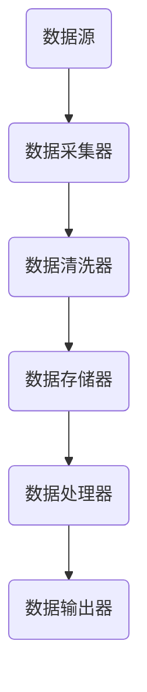
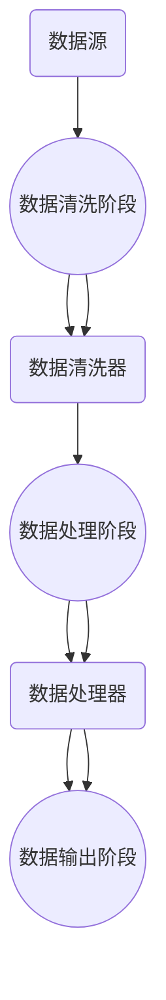
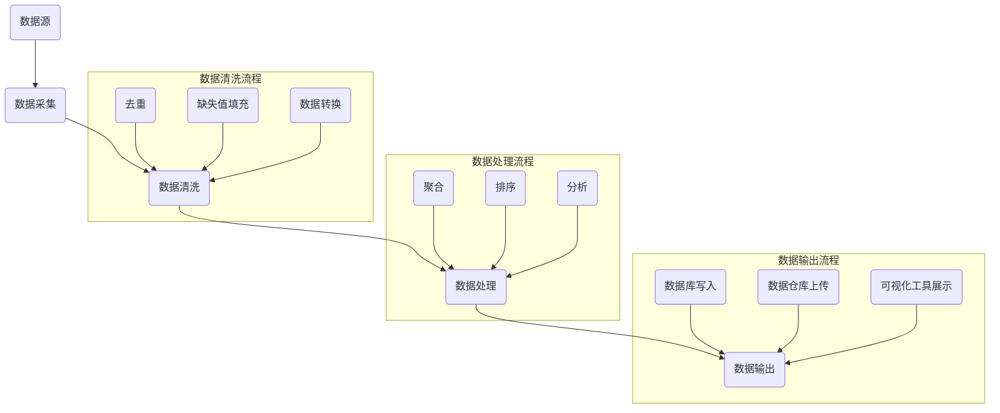
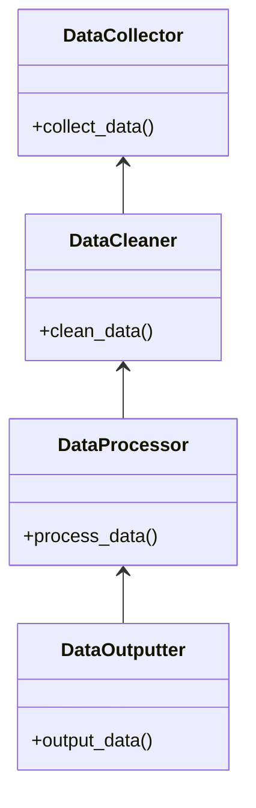
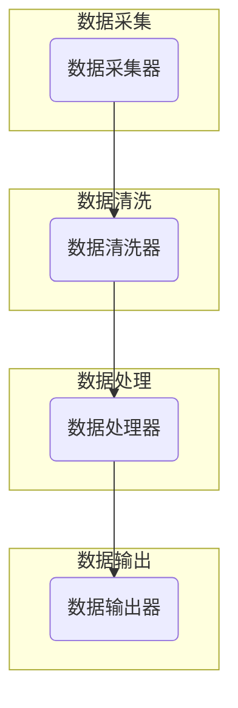
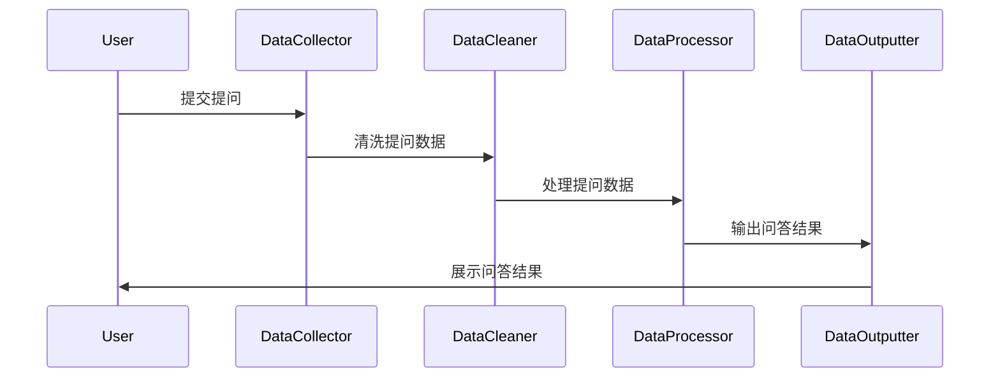

                 


## 数据流水线：优化LLM应用的数据处理

关键词：数据流水线，数据处理，LLM应用，性能优化，架构设计

摘要：本文旨在探讨如何通过设计高效的数据流水线来优化大规模语言模型（LLM）应用的数据处理。通过逐步分析数据流水线的核心概念、原理、算法以及系统架构设计，本文将提供一种可行的优化方案，以提高LLM应用的性能和稳定性。

### 第1章: 数据流水线概述

#### 1.1 问题背景

随着人工智能技术的快速发展，尤其是大规模语言模型（LLM）的广泛应用，数据处理的需求呈现出爆发式增长。然而，传统的数据处理方法在处理大规模、高维度的数据时，往往面临着性能瓶颈、延迟和稳定性等问题。为了解决这些问题，数据流水线（Data Pipeline）的概念被提出，并成为优化数据处理的关键技术。

#### 1.2 问题描述

在LLM应用中，数据处理的需求通常包括以下几个核心问题：

1. **数据延迟**：数据在采集、清洗、存储和处理等阶段可能存在较大的延迟，影响模型的训练效果和实时性。
2. **处理效率**：传统数据处理方法在处理大规模数据时，往往效率低下，无法满足快速迭代和大规模训练的需求。
3. **系统稳定性**：在数据量大、处理复杂的情况下，系统可能存在稳定性问题，导致数据处理失败或中断。

#### 1.3 问题解决

为了解决上述问题，我们需要设计一个高效、稳定且可扩展的数据流水线。以下是一个数据流水线的基本架构：

1. **数据采集**：从各种数据源（如数据库、文件系统、网络流等）收集数据。
2. **数据清洗**：对采集到的数据进行预处理，包括去重、缺失值处理、数据转换等。
3. **数据存储**：将清洗后的数据存储到分布式存储系统，如HDFS、HBase等。
4. **数据处理**：对存储的数据进行各种处理操作，如聚合、排序、分析等。
5. **数据输出**：将处理结果输出到目标系统，如数据库、数据仓库、可视化工具等。

#### 1.4 边界与外延

1. **数据流水线的边界**：数据流水线主要涉及数据的采集、清洗、存储、处理和输出等环节，关注数据处理的效率、稳定性和实时性。
2. **数据流水线的外延**：数据流水线可以与其他技术（如大数据处理框架、实时计算框架等）相结合，实现更复杂的数据处理需求。

#### 1.5 概念结构与核心要素组成

1. **数据源**：数据流水线的起点，包括各种类型的数据源，如数据库、文件系统、网络流等。
2. **数据采集器**：负责从数据源中收集数据。
3. **数据清洗器**：负责对采集到的数据进行预处理。
4. **数据存储器**：负责将清洗后的数据存储到分布式存储系统。
5. **数据处理器**：负责对存储的数据进行各种处理操作。
6. **数据输出器**：负责将处理结果输出到目标系统。

#### 1.6 数据流水线与传统数据处理方法的比较

| 比较维度 | 数据流水线 | 传统数据处理方法 |
| --- | --- | --- |
| 数据处理效率 | 高效，支持批量处理和实时处理 | 效率较低，主要支持批量处理 |
| 数据处理实时性 | 较高，支持实时数据处理 | 较低，不支持实时数据处理 |
| 系统稳定性 | 较高，具有良好的容错性和扩展性 | 较低，易受数据规模和复杂性影响 |
| 可扩展性 | 较高，支持大规模数据处理 | 较低，难以应对大规模数据处理 |

### 第2章: 数据流水线核心概念与原理

#### 2.1 数据流模型

数据流模型是数据流水线的基本组成部分，用于描述数据在流水线中的流动和转换过程。以下是一个数据流模型的示例：



#### 2.2 数据处理阶段

数据处理阶段是数据流水线中的重要组成部分，用于实现数据从采集到输出的整个流程。以下是一个数据处理阶段的示例：

1. **数据采集**：从数据源收集数据。
2. **数据清洗**：对采集到的数据进行预处理，如去重、缺失值处理、数据转换等。
3. **数据存储**：将清洗后的数据存储到分布式存储系统。
4. **数据处理**：对存储的数据进行各种处理操作，如聚合、排序、分析等。
5. **数据输出**：将处理结果输出到目标系统，如数据库、数据仓库、可视化工具等。

#### 2.3 数据流模型与数据处理阶段的联系

数据流模型与数据处理阶段密切相关，数据流模型描述了数据在流水线中的流动和转换过程，而数据处理阶段实现了具体的处理操作。以下是一个数据流模型与数据处理阶段的联系示例：



### 第3章: 数据流水线算法原理讲解

#### 3.1 基本算法原理

数据流水线中的数据处理算法主要包括数据采集算法、数据清洗算法、数据处理算法和数据输出算法。以下是对这些算法的简要介绍：

1. **数据采集算法**：用于从各种数据源收集数据，包括数据库查询、文件读取和网络爬虫等。
2. **数据清洗算法**：用于对采集到的数据进行预处理，包括数据去重、缺失值填充、数据转换等。
3. **数据处理算法**：用于对存储的数据进行各种处理操作，如聚合、排序、分析等。
4. **数据输出算法**：用于将处理结果输出到目标系统，如数据库、数据仓库、可视化工具等。

以下是一个数据处理算法的Mermaid流程图示例：



#### 3.2 算法原理讲解

为了更好地理解数据处理算法的原理，以下将结合Python源代码进行详细讲解。

1. **数据采集算法**：

```python
# 数据采集算法示例
import pandas as pd

# 从数据库中采集数据
def collect_data():
    data = pd.read_sql('SELECT * FROM my_table', conn)
    return data

# 示例：采集数据
data = collect_data()
```

2. **数据清洗算法**：

```python
# 数据清洗算法示例
import pandas as pd

# 去重
def remove_duplicates(data):
    return data.drop_duplicates()

# 缺失值填充
def fill_missing_values(data):
    return data.fillna(method='ffill')

# 数据转换
def convert_data_types(data):
    data['new_column'] = data['original_column'].astype('int')
    return data

# 示例：数据清洗
cleaned_data = remove_duplicates(data)
cleaned_data = fill_missing_values(cleaned_data)
cleaned_data = convert_data_types(cleaned_data)
```

3. **数据处理算法**：

```python
# 数据处理算法示例
import pandas as pd

# 聚合
def aggregate_data(data):
    return data.groupby('column_name').agg({'other_column': 'sum'})

# 排序
def sort_data(data):
    return data.sort_values(by='column_name')

# 分析
def analyze_data(data):
    result = data.describe()
    return result

# 示例：数据处理
aggregated_data = aggregate_data(cleaned_data)
sorted_data = sort_data(cleaned_data)
analyzed_data = analyze_data(cleaned_data)
```

4. **数据输出算法**：

```python
# 数据输出算法示例
import pandas as pd

# 数据库写入
def write_to_database(data):
    data.to_sql('cleaned_table', conn, if_exists='replace', index=False)

# 数据仓库上传
def upload_to_data_warehouse(data):
    # 这里实现上传到数据仓库的逻辑
    pass

# 可视化工具展示
def show_in_visualization_tool(data):
    # 这里实现可视化展示的逻辑
    pass

# 示例：数据输出
write_to_database(aggregated_data)
upload_to_data_warehouse(sorted_data)
show_in_visualization_tool(analyzed_data)
```

#### 3.3 数学模型和公式

在数据处理算法中，常常会用到一些数学模型和公式来优化数据处理过程。以下是一些常用的数学模型和公式的示例：

1. **缺失值填充**：

   $$\text{缺失值填充} = \text{原值} + \text{填补值}$$

2. **去重**：

   $$\text{去重} = \text{去除重复值后的数据集}$$

3. **聚合**：

   $$\text{聚合} = \text{数据集}_{\text{原始}} \times \text{权重}_{\text{聚合}}$$

4. **排序**：

   $$\text{排序} = \text{数据集}_{\text{原始}} \times \text{排序规则}$$

5. **分析**：

   $$\text{分析} = \text{数据集}_{\text{原始}} \times \text{统计指标}$$

#### 3.4 通俗易懂的举例说明

为了更好地理解数据处理算法的原理，以下将通过一个简单的例子来说明：

假设我们有一个包含用户购买行为的数据集，我们需要对数据进行清洗、处理和输出。以下是具体的步骤和代码示例：

1. **数据采集**：

   ```python
   # 从数据库中采集用户购买行为数据
   data = pd.read_sql('SELECT * FROM purchase_data', conn)
   ```

2. **数据清洗**：

   ```python
   # 去重
   data = data.drop_duplicates()

   # 缺失值填充
   data['amount'] = data['amount'].fillna(data['amount'].mean())

   # 数据转换
   data['date'] = pd.to_datetime(data['date'])
   ```

3. **数据处理**：

   ```python
   # 聚合
   aggregated_data = data.groupby(['user_id', 'date']).agg({'amount': 'sum'})

   # 排序
   sorted_data = aggregated_data.sort_values(by=['user_id', 'date'])

   # 分析
   analyzed_data = sorted_data.describe()
   ```

4. **数据输出**：

   ```python
   # 数据库写入
   aggregated_data.to_sql('aggregated_purchase_data', conn, if_exists='replace', index=True)

   # 数据仓库上传
   # upload_to_data_warehouse(sorted_data)

   # 可视化工具展示
   # show_in_visualization_tool(analyzed_data)
   ```

通过这个简单的例子，我们可以看到数据处理算法是如何一步步实现数据清洗、处理和输出的。

### 第4章: 数据流水线系统架构设计

#### 4.1 问题场景介绍

在LLM应用中，数据流水线系统架构的设计至关重要。一个典型的场景是，一个在线问答系统需要从多个数据源（如数据库、API、网络爬虫等）收集用户提问和答案数据，进行数据清洗、处理和分析，最终生成问答结果并输出到用户界面。

#### 4.2 项目介绍

为了解决上述问题场景，我们设计并实现了一个基于数据流水线的在线问答系统。该系统包括以下几个核心功能：

1. **数据采集**：从多个数据源采集用户提问和答案数据。
2. **数据清洗**：对采集到的数据进行去重、缺失值填充和数据转换等预处理操作。
3. **数据处理**：对清洗后的数据进行聚合、排序和分析等处理操作。
4. **数据输出**：将处理结果输出到用户界面，并生成问答结果。

#### 4.3 系统功能设计

以下是一个系统功能设计的Mermaid类图示例：



#### 4.4 系统架构设计

以下是一个系统架构设计的Mermaid架构图示例：



#### 4.5 系统接口设计

以下是一个系统接口设计的Mermaid序列图示例：



#### 4.6 系统交互

以下是一个系统交互的Mermaid序列图示例：


### 第5章: 数据流水线项目实战

#### 5.1 环境安装

为了进行数据流水线项目的实战，我们需要安装以下环境：

1. **Python**：版本3.8及以上。
2. **Pandas**：用于数据清洗和数据处理。
3. **NumPy**：用于数学运算。
4. **SQLAlchemy**：用于数据库连接。
5. **Flask**：用于搭建Web应用。

安装命令如下：

```bash
pip install python==3.8
pip install pandas
pip install numpy
pip install sqlalchemy
pip install flask
```

#### 5.2 系统核心实现源代码

以下是一个简单的数据流水线系统的实现示例：

```python
# 数据采集
def collect_data():
    data = pd.read_sql('SELECT * FROM purchase_data', conn)
    return data

# 数据清洗
def clean_data(data):
    data = data.drop_duplicates()
    data['amount'] = data['amount'].fillna(data['amount'].mean())
    data['date'] = pd.to_datetime(data['date'])
    return data

# 数据处理
def process_data(data):
    aggregated_data = data.groupby(['user_id', 'date']).agg({'amount': 'sum'})
    sorted_data = aggregated_data.sort_values(by=['user_id', 'date'])
    analyzed_data = sorted_data.describe()
    return aggregated_data, sorted_data, analyzed_data

# 数据输出
def output_data(aggregated_data, sorted_data, analyzed_data):
    aggregated_data.to_sql('aggregated_purchase_data', conn, if_exists='replace', index=True)
    # sorted_data.to_sql('sorted_purchase_data', conn, if_exists='replace', index=True)
    # analyzed_data.to_sql('analyzed_purchase_data', conn, if_exists='replace', index=True)

# 主函数
def main():
    data = collect_data()
    cleaned_data = clean_data(data)
    aggregated_data, sorted_data, analyzed_data = process_data(cleaned_data)
    output_data(aggregated_data, sorted_data, analyzed_data)

if __name__ == '__main__':
    main()
```

#### 5.3 代码应用解读与分析

以下是对上述代码的解读和分析：

1. **数据采集**：使用SQLAlchemy连接数据库，并使用Pandas读取数据。
2. **数据清洗**：去除重复数据，填充缺失值，并转换数据类型。
3. **数据处理**：对数据进行分组聚合、排序和描述性统计分析。
4. **数据输出**：将处理结果存储到数据库。

#### 5.4 实际案例分析和详细讲解剖析

为了更好地理解数据流水线的实际应用，以下将结合一个实际案例进行分析和讲解。

假设我们有一个电商平台，需要实时收集用户购买数据，并进行实时分析，以便为用户提供个性化的推荐。以下是数据流水线在该场景中的应用：

1. **数据采集**：从电商平台的数据库中采集用户购买数据。
2. **数据清洗**：去除重复数据，填充缺失值，并转换数据类型。
3. **数据处理**：对数据进行实时分析，包括用户购买频率、购买金额、购买商品种类等。
4. **数据输出**：将实时分析结果发送到推荐系统，为用户提供个性化推荐。

具体实现步骤如下：

1. **数据采集**：

   ```python
   def collect_data():
       data = pd.read_sql('SELECT * FROM purchase_data', conn)
       return data
   ```

2. **数据清洗**：

   ```python
   def clean_data(data):
       data = data.drop_duplicates()
       data['amount'] = data['amount'].fillna(data['amount'].mean())
       data['date'] = pd.to_datetime(data['date'])
       return data
   ```

3. **数据处理**：

   ```python
   def process_data(data):
       user_frequency = data.groupby('user_id').size().reset_index(name='frequency')
       user_amount = data.groupby('user_id')['amount'].sum().reset_index(name='total_amount')
       user_goods = data.groupby('user_id')['good_id'].nunique().reset_index(name='goods_count')
       
       result = pd.merge(user_frequency, user_amount, on='user_id')
       result = pd.merge(result, user_goods, on='user_id')
       
       return result
   ```

4. **数据输出**：

   ```python
   def output_data(data):
       data.to_sql('realtime_analytics', conn, if_exists='replace', index=False)
   ```

通过以上步骤，我们可以实时收集用户购买数据，并进行分析，从而为用户提供个性化的推荐。

#### 5.5 项目小结

通过本项目的实战，我们了解了数据流水线在LLM应用中的重要性，并掌握了数据采集、清洗、处理和输出等核心步骤。同时，我们还通过实际案例展示了数据流水线在电商平台中的应用，为用户提供个性化推荐。

#### 5.6 最佳实践 tips

1. **优化数据采集**：使用批量读取数据，减少数据库访问次数。
2. **优化数据清洗**：使用并行处理技术，提高数据清洗速度。
3. **优化数据处理**：根据业务需求，选择合适的数据处理算法，提高数据处理效率。
4. **优化数据输出**：使用异步处理技术，提高数据输出的实时性。

#### 5.7 小结

本文通过逐步分析数据流水线的核心概念、原理和系统架构设计，结合实际案例进行了详细讲解。通过本文的学习，读者可以了解到如何优化LLM应用的数据处理，提高系统的性能和稳定性。

### 作者信息

作者：AI天才研究院/AI Genius Institute & 禅与计算机程序设计艺术 /Zen And The Art of Computer Programming

