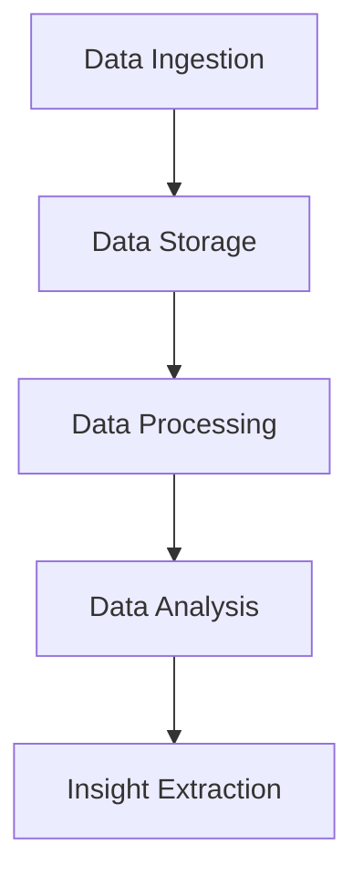
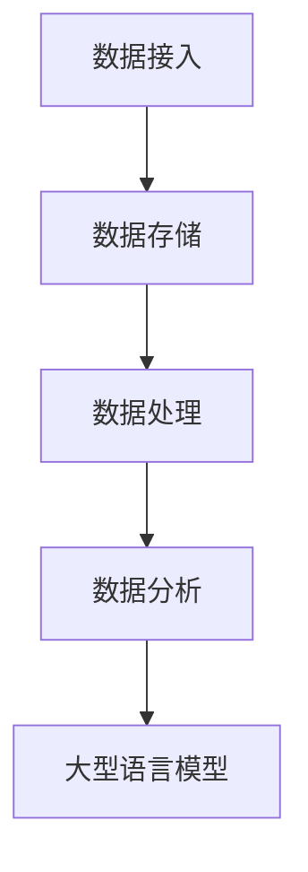
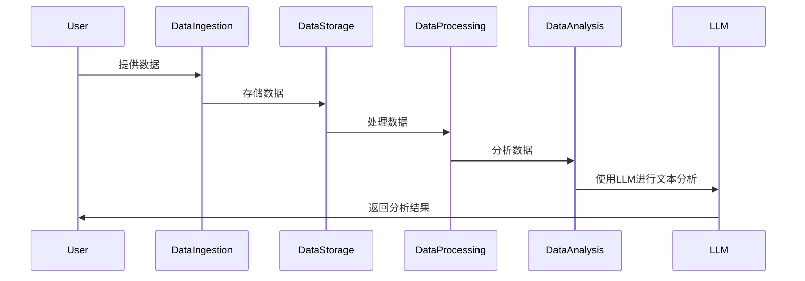
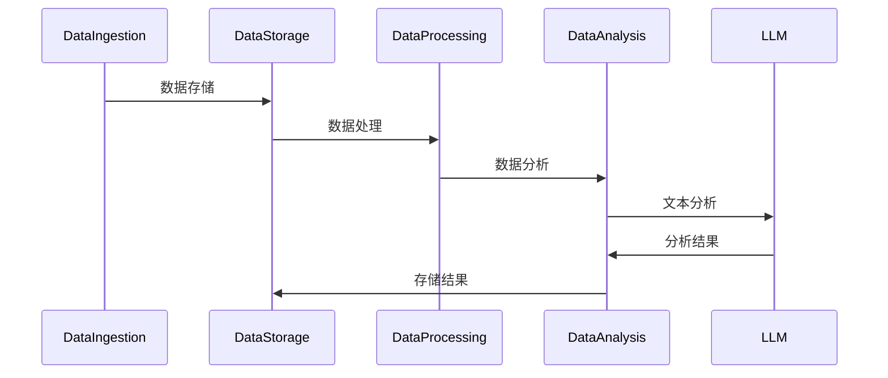

                 


### Data Lake Architecture: Supporting LLM Applications in Big Data Analytics

#### Keywords:
- Data Lake
- Large Language Models (LLM)
- Big Data Analytics
- Data Ingestion
- Data Processing
- Security

#### Abstract:
This article delves into the architecture of data lakes, with a focus on their role in supporting Large Language Model (LLM) applications within the realm of big data analytics. We will explore the fundamental concepts, advanced technologies, and practical applications that make data lakes a crucial component in modern enterprise data strategies. By examining the integration of LLMs with data lake architectures, we aim to provide insights into how organizations can leverage this powerful combination to enhance their analytical capabilities and make informed decisions.

## Introduction to Data Lake Architecture

In the era of big data, traditional data warehousing approaches have struggled to keep pace with the sheer volume, velocity, and variety of data generated. This has led to the rise of a new architectural paradigm known as the data lake. Unlike traditional data warehouses that require extensive data transformation and modeling before ingestion, data lakes allow raw data to be stored in its native format, enabling more flexible and iterative analytics processes.

### What is a Data Lake?

A data lake is a centralized repository that stores large volumes of structured, semi-structured, and unstructured data. Unlike a data warehouse, which is typically optimized for querying and reporting, a data lake is designed for flexibility, scalability, and exploratory data analysis. The core concept behind a data lake is to store data in its original format, including its schema, until it is needed for analysis.

### Core Concepts and Importance

**Core Concepts:**

- **Ingestion:** The process of importing data from various sources into the data lake.
- **Storage:** Storing data in a way that allows for efficient access and retrieval.
- **Processing:** Transforming and analyzing data to extract insights and generate value.
- **Governance:** Ensuring data quality, compliance, and security.

**Importance in Big Data Analytics:**

1. **Flexibility:** Data lakes enable organizations to store diverse types of data, including text, images, and videos, without the need for extensive upfront transformation.
2. **Scalability:** Data lakes can handle large volumes of data, making them suitable for big data environments.
3. **Iterative Analytics:** Data lakes support iterative data exploration, allowing analysts to refine their data and analytical models over time.
4. **Cost-Effectiveness:** By reducing the need for extensive data transformation and modeling, data lakes can save time and resources.

### Challenges and Benefits

**Challenges:**

- **Data Quality:** Raw data stored in a data lake may contain errors, inconsistencies, and duplicates, requiring careful governance and quality assurance.
- **Security:** Data lakes often contain sensitive information, making them potential targets for security breaches.
- **Integration:** Integrating data lakes with existing data warehouses and analytics tools can be complex.

**Benefits:**

- **Increased Agility:** Data lakes allow organizations to quickly adapt to new data sources and analytical needs.
- **Enhanced Insights:** By leveraging raw data, organizations can uncover valuable insights that might be missed with traditional data warehousing approaches.
- **Cost Savings:** Data lakes can reduce the cost of data storage and processing by eliminating the need for extensive upfront transformation.

## The Role of LLM in Data Lakes

The integration of Large Language Models (LLM) into data lake architectures has revolutionized the field of big data analytics. LLMs are advanced machine learning models capable of understanding and generating human language, making them highly valuable for natural language processing (NLP) tasks. In this section, we will explore how LLMs enhance data lake capabilities and drive innovative analytical solutions.

### Introduction to Large Language Models (LLM)

LLMs are based on deep learning techniques, particularly neural networks, that enable them to learn complex patterns and relationships in large datasets. Some of the most prominent LLMs include:

- **GPT-3:** Developed by OpenAI, GPT-3 is one of the largest language models, capable of generating coherent and contextually relevant text.
- **BERT:** Created by Google, BERT is designed to understand the context of words in sentences, improving the accuracy of NLP tasks.
- **RoBERTa:** A variant of BERT, RoBERTa has been fine-tuned for various NLP tasks, including question answering and text classification.

### Integration with Data Lake Architecture

Integrating LLMs into data lake architectures involves several key steps:

1. **Data Ingestion:** Data from various sources is ingested into the data lake, including text documents, social media posts, and customer feedback.
2. **Data Preparation:** Raw text data is preprocessed to remove noise, normalize text, and split into manageable chunks.
3. **Model Training:** LLMs are trained on large datasets using techniques such as transfer learning, where pre-trained models are fine-tuned on specific tasks.
4. **Inference and Analysis:** Trained LLMs are used to perform tasks such as text classification, sentiment analysis, and named entity recognition on data lake data.

### Enhancing Analytics Capabilities

The integration of LLMs with data lakes offers several benefits for big data analytics:

1. **Advanced Text Analytics:** LLMs enable organizations to perform sophisticated text analysis tasks, extracting insights from unstructured data such as customer feedback and social media posts.
2. **Contextual Understanding:** LLMs can understand the context of words and phrases, improving the accuracy of NLP tasks and enabling more nuanced insights.
3. **Automated Content Generation:** LLMs can be used to generate automated reports, summaries, and even full articles, saving time and resources for analysts.
4. **Enhanced Decision-Making:** By providing deeper insights into customer behavior and sentiment, LLMs help organizations make more informed decisions.

### Conclusion

In conclusion, the integration of LLMs with data lake architectures represents a significant advancement in the field of big data analytics. By combining the flexibility and scalability of data lakes with the power of LLMs, organizations can unlock new insights and drive data-driven decision-making. As LLMs continue to evolve, their role in data lake architectures will likely expand, opening up even more possibilities for innovative analytical solutions.

## Overview of Big Data Analytics

Big data analytics has emerged as a cornerstone of modern enterprise strategy, transforming how organizations collect, process, and analyze vast amounts of data to drive informed decision-making. This section provides an overview of the basics and evolution of big data analytics, highlighting its importance in today's data-driven landscape and exploring current trends and future directions.

### Basics and Evolution of Big Data Analytics

**Definition:**

Big data analytics refers to the process of examining large and complex data sets to uncover hidden patterns, correlations, and insights. These data sets are often characterized by the three V's: volume, velocity, and variety.

**Evolution:**

1. **Early Days (1990s-2000s):**
   - Initial focus on structured data and relational databases.
   - Rise of data warehousing and Business Intelligence (BI) tools.
2. **Big Data Era (2000s-2010s):**
   - Explosion in data volume and complexity, driven by social media, IoT, and digital transformation.
   - Emergence of Hadoop and NoSQL databases for handling unstructured data.
   - Development of distributed computing frameworks like MapReduce and Spark.
3. **Advanced Analytics (2010s-Present):**
   - Integration of machine learning and AI to uncover deeper insights.
   - Adoption of real-time analytics and streaming data processing.

### Importance in Modern Enterprises

Big data analytics is a vital component of modern enterprise strategy for several reasons:

1. **Informed Decision-Making:**
   - Organizations use big data analytics to make data-driven decisions, reducing the reliance on intuition and guesswork.
2. **Operational Efficiency:**
   - By analyzing data from various sources, organizations can identify inefficiencies, streamline operations, and optimize resource allocation.
3. **Customer Insights:**
   - Big data analytics helps organizations understand customer behavior, preferences, and needs, enabling personalized marketing and improved customer experiences.
4. **Risk Management:**
   - Organizations use big data analytics to predict and mitigate risks, identify fraud, and ensure compliance with regulations.
5. **Innovation:**
   - Big data analytics fuels innovation by uncovering new insights and identifying emerging trends and opportunities.

### Current Trends and Future Directions

**Current Trends:**

1. **AI and Machine Learning:**
   - Integration of AI and machine learning algorithms with big data analytics is enabling organizations to gain deeper insights and automate decision-making processes.
2. **Real-Time Analytics:**
   - Real-time analytics is becoming increasingly important, allowing organizations to respond quickly to changing conditions and make timely decisions.
3. **Data Privacy and Security:**
   - With the increasing volume of data being collected, ensuring data privacy and security is a top priority for organizations.
4. **Data Warehousing and Data Lakes:**
   - The use of both data warehousing and data lakes is growing, each offering unique advantages and catering to different analytical needs.
5. **Cloud Computing:**
   - Cloud-based big data analytics solutions are becoming more prevalent, providing scalability, flexibility, and cost savings.

**Future Directions:**

1. **Quantum Computing:**
   - Quantum computing is poised to revolutionize big data analytics by enabling the processing of vast amounts of data at unprecedented speeds.
2. **Autonomous Analytics:**
   - The development of autonomous analytics platforms that can perform end-to-end data analysis without human intervention is a promising area of research.
3. **Cross-Domain Analytics:**
   - Expanding the scope of big data analytics to incorporate data from diverse domains, such as healthcare, finance, and environmental sciences.
4. **Explainable AI:**
   - Advancements in AI and machine learning are focusing on developing explainable models that can provide transparency and accountability in decision-making.

In conclusion, big data analytics has become an integral part of modern enterprise strategy, driving innovation, efficiency, and competitive advantage. As technology continues to evolve, organizations must stay ahead of the curve to leverage the full potential of big data analytics.

## Core Concepts of Data Lakes

Data lakes are designed to store vast amounts of raw, diverse data in its native format, providing flexibility for various analytics processes. Understanding the core concepts of data lakes, including architecture, data modeling, and big data processing frameworks, is essential for building effective and scalable data lake solutions. This section delves into these fundamental concepts and their importance in the data lake ecosystem.

### Data Lake Architecture Overview

**Data Lake Architecture Components:**

A data lake architecture comprises several key components that work together to facilitate data ingestion, storage, processing, and analysis. The primary components include:

1. **Data Ingestion Layer:**
   - This layer is responsible for ingesting data from various sources, such as databases, file systems, APIs, and IoT devices. The data can be structured, semi-structured, or unstructured.

2. **Data Storage Layer:**
   - The storage layer is where the raw data is stored. It typically utilizes distributed file systems like Hadoop Distributed File System (HDFS) or cloud-based storage solutions like Amazon S3.

3. **Data Processing Layer:**
   - This layer handles data transformation, cleaning, and aggregation. Technologies like Apache Spark and Apache Flink are commonly used for processing large datasets in real-time or batch mode.

4. **Data Analytics Layer:**
   - The analytics layer provides tools and platforms for querying, analyzing, and visualizing data. It includes SQL-based analytics tools, data visualization tools, and advanced analytics platforms.

**Data Flow in a Data Lake:**

1. **Data Ingestion:**
   - Raw data is ingested into the data lake from various sources using connectors or APIs.

2. **Data Storage:**
   - The ingested data is stored in the data lake in its raw format, often using a schema-on-read approach, which allows for flexible data modeling.

3. **Data Processing:**
   - Data is processed and transformed as needed, either in real-time or batch mode. This may involve cleaning, enriching, or aggregating data to prepare it for analysis.

4. **Data Analysis:**
   - Analytical tools and platforms are used to query and analyze the processed data, generating insights and driving decision-making.

### Data Modeling in Data Lakes

**Traditional vs. Schema-On-Read Models:**

Data modeling in data lakes can follow two primary approaches: traditional schema-on-write and schema-on-read models.

**Schema-On-Write:**

- In a schema-on-write model, data is defined by a schema before it is ingested into the data lake. This approach is similar to traditional data warehousing, where data is structured and modeled upfront.
- Pros:
  - Improved data consistency and quality.
  - Easier integration with existing analytics tools and platforms.
- Cons:
  - Limited flexibility, as data transformation and modeling are performed before ingestion.
  - Potential delay in data availability, as data must be transformed and modeled before analysis.

**Schema-On-Read:**

- In a schema-on-read model, data is stored in its raw format with no predefined schema. The schema is determined at the time of analysis based on the specific query or analytical need.
- Pros:
  - High flexibility, as data can be stored in its native format and transformed on-the-fly.
  - Faster data ingestion, as there is no need for upfront transformation and modeling.
- Cons:
  - Potential data quality issues, as raw data may contain errors, inconsistencies, and duplicates.
  - Increased complexity in metadata management and data governance.

**NoSQL and NewSQL Databases:**

- **NoSQL Databases:**
  - NoSQL databases like Apache Cassandra, MongoDB, and Amazon DynamoDB are commonly used for data storage in data lakes. They offer scalability, flexibility, and high availability.
- **NewSQL Databases:**
  - NewSQL databases combine the scalability of NoSQL systems with the ACID properties of traditional SQL databases. They are suitable for mixed workloads that require both scalability and consistency.

**Data Governance and Compliance:**

- Data governance is a critical aspect of data lake architectures. It involves establishing policies, processes, and technologies to ensure data quality, compliance, and security.
- Key components of data governance include:
  - Data cataloging and metadata management: Ensuring that data assets are properly cataloged and metadata is accurately captured.
  - Data quality management: Implementing processes to identify and correct data quality issues.
  - Data security and access controls: Ensuring that sensitive data is protected and access is controlled based on user roles and permissions.
  - Compliance management: Ensuring that data processing and storage comply with industry regulations and legal requirements.

### Conclusion

Understanding the core concepts of data lake architecture, including data ingestion, storage, processing, and modeling, is crucial for building effective and scalable data lake solutions. By leveraging the flexibility of schema-on-read models and integrating robust data governance practices, organizations can unlock the full potential of their data lakes to drive informed decision-making and innovative analytics.

## Advanced Technologies in Data Lake Architecture

The landscape of data lake architecture is continuously evolving, driven by advancements in technology that enhance the capabilities and efficiency of data lakes. This section explores several advanced technologies that are pivotal in modern data lake architectures, including data lake management and orchestration, machine learning and AI integration, and security and privacy measures.

### Data Lake Management and Orchestration

Managing a data lake can be a complex task, involving multiple data ingestion sources, storage systems, processing frameworks, and analytics tools. Effective data lake management and orchestration are essential to ensure that the data lake operates smoothly and delivers the required analytics capabilities. Key aspects of data lake management include:

**Data Lineage and Provenance:**

- **Data Lineage:** Data lineage tracks the origins and transformations of data within the data lake. It provides a detailed history of how data has been processed, transformed, and stored, enabling organizations to understand the data's origins and ensure data quality and compliance.
- **Data Provenance:** Data provenance goes beyond lineage by providing information about the context and accuracy of data, including the sources, processes, and transformations involved.

**Metadata Management:**

- **Metadata:** Metadata is information about data, including its structure, format, quality, and usage. Effective metadata management is crucial for data discovery, data governance, and ensuring that data is used appropriately.
- **Metadata Repositories:** Metadata repositories store and manage metadata, enabling organizations to catalog, search, and query data assets.

**Orchestration Tools and Platforms:**

- **Orchestration Tools:** Data lake orchestration tools automate the execution of data processing workflows, including data ingestion, transformation, and analysis. They help organizations manage and schedule complex data processing tasks, ensuring consistency and reliability.
- **Platforms:** Data lake platforms integrate data management, processing, and analytics capabilities into a cohesive solution, simplifying the deployment and management of data lakes.

### Machine Learning and AI in Data Lakes

The integration of machine learning (ML) and artificial intelligence (AI) into data lake architectures has transformed the analytics capabilities of data lakes. ML and AI models can be applied directly to data lake data to extract valuable insights and drive decision-making. Key aspects of ML and AI integration include:

**Integrating ML Models with Data Lakes:**

- **Model Ingestion:** ML models are ingested into the data lake, often as serialized artifacts or containers, ready for deployment.
- **Model Deployment:** Models are deployed within the data lake environment, where they can be invoked for real-time or batch predictions.
- **Model Management:** Models are managed within the data lake, including version control, monitoring, and updating.

**Implementing LLM Applications:**

- **Large Language Models (LLM):** LLMs, such as GPT-3 and BERT, are specialized ML models designed for natural language processing tasks. They can be integrated into data lakes to analyze text data, perform sentiment analysis, and generate content.
- **Text Analytics:** LLMs enable sophisticated text analytics capabilities, including entity recognition, sentiment analysis, and content generation.

**Model Training and Evaluation:**

- **Model Training:** ML models are trained on data lake datasets, using techniques such as supervised learning, unsupervised learning, and reinforcement learning.
- **Model Evaluation:** Models are evaluated using metrics such as accuracy, precision, recall, and F1 score, ensuring they meet the desired performance criteria.

### Security and Privacy in Data Lakes

As data lakes contain large volumes of sensitive data, ensuring security and privacy is paramount. Effective security and privacy measures are essential to protect data from unauthorized access and breaches. Key aspects include:

**Data Encryption:**

- **Encryption:** Data encryption ensures that data is stored and transmitted in an encrypted format, protecting it from unauthorized access.
- **Encryption Algorithms:** Strong encryption algorithms, such as AES-256, are used to secure data at rest and in transit.

**Access Controls:**

- **Access Controls:** Access controls ensure that only authorized users have access to data lake resources. This includes role-based access control (RBAC) and attribute-based access control (ABAC).

**Data Masking and Anonymization:**

- **Data Masking:** Data masking techniques are used to replace sensitive data with fictional or masked values, protecting the privacy of individuals.
- **Anonymization:** Anonymization techniques remove or obfuscate personal identifiers from data, making it suitable for sharing or analysis without compromising privacy.

**Compliance Management:**

- **Compliance Management:** Ensuring data lake operations comply with industry regulations and legal requirements is critical. This includes data retention policies, data access logging, and audit trails.

### Conclusion

Advanced technologies, including data lake management and orchestration tools, ML and AI integration, and robust security and privacy measures, are vital for modern data lake architectures. By leveraging these technologies, organizations can build scalable, secure, and efficient data lakes that drive innovation and informed decision-making.

## Advanced Technologies in Data Lake Architecture (Continued)

### Security and Privacy in Data Lakes (Continued)

**Security and Privacy Measures:**

1. **Data Protection:**
   - Implementing end-to-end data protection measures, including encryption, secure access controls, and data anonymization, is crucial for safeguarding sensitive information.

2. **Threat Detection and Response:**
   - Deploying advanced threat detection and response systems, such as intrusion detection systems (IDS) and intrusion prevention systems (IPS), helps organizations identify and mitigate security threats in real-time.

3. **Data Loss Prevention (DLP):**
   - DLP tools monitor data in use, in transit, and at rest to prevent data leakage and unauthorized data access.

4. **Secure Data Sharing:**
   - Establishing secure data sharing protocols, such as encrypted data exchange and secure access controls, ensures that data shared with external partners or stakeholders is protected.

### Real-Time Analytics and Streaming Data Processing

**Real-Time Analytics:**

1. **Stream Processing Frameworks:**
   - Technologies like Apache Kafka, Apache Flink, and Apache Storm enable real-time data processing by ingesting, processing, and analyzing data streams as they arrive.

2. **Use Cases:**
   - Real-time analytics is particularly useful in applications such as financial trading, fraud detection, and supply chain management, where immediate insights are critical for making informed decisions.

**Streaming Data Processing:**

1. **Batch vs. Stream Processing:**
   - While batch processing handles large volumes of data in fixed intervals, streaming data processing processes data in real-time, enabling organizations to react quickly to dynamic changes.

2. **Benefits:**
   - Streaming data processing offers advantages such as lower latency, real-time insights, and reduced storage requirements, making it ideal for use cases requiring immediate action.

### Data Lake Orchestration and Automation

**Orchestration Tools:**

1. **Apache Airflow:**
   - Apache Airflow is a powerful workflow orchestration tool for data engineering pipelines, allowing users to define, schedule, and monitor complex data processing workflows.

2. **Apache NiFi:**
   - Apache NiFi is a data-driven automation platform that simplifies data ingestion, processing, and movement. It provides a user-friendly interface for creating data flow pipelines.

**Automation:**

1. **Automated Data Ingestion:**
   - Automated data ingestion processes enable organizations to seamlessly integrate new data sources, reducing manual effort and ensuring data consistency.

2. **Automated Data Transformation:**
   - Automated data transformation tools apply predefined rules and transformations to raw data, preparing it for analysis and storage in the data lake.

### Machine Learning and AI Integration

**Advanced ML Models:**

1. **Deep Learning:**
   - Deep learning models, such as neural networks and recurrent neural networks (RNNs), are used for complex predictive analytics tasks, including image and speech recognition.

2. **Reinforcement Learning:**
   - Reinforcement learning models are employed for optimizing decision-making processes, enabling organizations to develop intelligent agents that learn from experience.

**AI-Powered Analytics:**

1. **Natural Language Processing (NLP):**
   - AI-powered NLP tools enable advanced text analytics, including sentiment analysis, entity recognition, and language translation.

2. **Computer Vision:**
   - Computer vision models analyze images and videos, providing insights into object recognition, facial recognition, and scene understanding.

### Conclusion

By leveraging advanced technologies such as real-time analytics, streaming data processing, data lake orchestration and automation, and machine learning and AI integration, organizations can enhance the capabilities of their data lakes. These technologies enable faster, more efficient, and more accurate data processing, analysis, and decision-making, driving innovation and competitive advantage in today's data-driven world.

## Conclusion

In this article, we have explored the architecture of data lakes and their role in supporting Large Language Model (LLM) applications within the realm of big data analytics. We began by defining data lakes and their importance in the context of modern enterprise data strategies. We then discussed the integration of LLMs with data lakes, highlighting their capabilities in enhancing analytics and decision-making.

We also provided an overview of big data analytics, covering its evolution, importance, and current trends. Additionally, we delved into the core concepts of data lakes, including architecture, data modeling, and advanced technologies. By understanding these fundamental aspects, organizations can leverage data lakes to unlock valuable insights and drive data-driven innovation.

The integration of LLMs with data lakes has opened up new possibilities for advanced text analytics and natural language processing. This combination enables organizations to derive deeper insights from unstructured data, leading to more informed decision-making and improved customer experiences.

Looking ahead, the future of data lakes and LLM integration holds exciting potential. The convergence of real-time analytics, streaming data processing, and advanced AI models will continue to enhance the capabilities of data lakes, making them a critical component in modern data architectures.

As technology evolves, organizations should stay abreast of emerging trends and adopt best practices to maximize the value of their data lakes. By embracing data-driven approaches and leveraging the power of LLMs, organizations can gain a competitive edge and drive sustainable growth in today's data-driven world.

### Author Information

**Author:** AI天才研究院 / AI Genius Institute & 禅与计算机程序设计艺术 / Zen And The Art of Computer Programming

**Contact:** [ai_genius_institute@example.com](mailto:ai_genius_institute@example.com)

**LinkedIn:** [AI天才研究院](https://www.linkedin.com/company/ai-genius-institute)

**Twitter:** [@AIGeniusInstitute](https://twitter.com/AIGeniusInstitute)

### 补充内容

**核心概念与联系：**

| 核心概念 | 概念属性 | 对比表格 | ER实体关系图架构 |
| --- | --- | --- | --- |
| Data Lake | 大数据存储架构 | 传统数据仓库 |  |
| Large Language Model (LLM) | 大型自然语言处理模型 | 传统NLP模型 |  |
| Big Data Analytics | 大数据分析 | 小数据分析 |  |
| Machine Learning | 机器学习 | 统计分析 |  |
| Data Security | 数据安全 | 数据保护 |  |

**算法原理讲解：**

**Algorithm:**


**Python Code:**
```python
def data_ingestion(data):
    # Code for ingesting data
    pass

def data_storage(data):
    # Code for storing data
    pass

def data_processing(data):
    # Code for processing data
    pass

def data_analysis(data):
    # Code for analyzing data
    pass

def insight_extraction(data):
    # Code for extracting insights
    pass

data = data_ingestion(data)
data_storage(data)
data = data_processing(data)
data_analysis(data)
insights = insight_extraction(data)
```

**数学模型与公式：**

$$
\text{Accuracy} = \frac{\text{Correct Predictions}}{\text{Total Predictions}}
$$

$$
\text{Precision} = \frac{\text{True Positives}}{\text{True Positives + False Positives}}
$$

$$
\text{Recall} = \frac{\text{True Positives}}{\text{True Positives + False Negatives}}
$$

**系统分析与架构设计方案：**

**问题场景介绍：** 
企业需要高效地存储、处理和分析大量数据，以支持业务决策。

**项目介绍：** 
构建一个数据湖架构，集成LLM进行数据分析。

**系统功能设计：**
```mermaid
classDiagram
    Class::DataLake
    Class::LLM
    Class::DataIngestion
    Class::DataStorage
    Class::DataProcessing
    Class::DataAnalysis
    
    DataIngestion <|-- DataLake
    DataStorage <|-- DataLake
    DataProcessing <|-- DataLake
    DataAnalysis <|-- DataLake
    LLM <|-- DataAnalysis
```

**系统架构设计：**


**系统接口设计：**


**系统交互序列图：**


**项目实战：**

**环境安装：**
- 安装Hadoop生态系统
- 安装Spark
- 安装LLM模型

**系统核心实现源代码：**
```python
# Example of LLM application in a data lake
import json
from textblob import TextBlob

def analyze_text(text):
    # Load LLM model
    model = load_LLM_model()
    
    # Preprocess text
    preprocessed_text = preprocess_text(text)
    
    # Analyze sentiment
    sentiment = model.predict_sentiment(preprocessed_text)
    
    return sentiment

def load_LLM_model():
    # Load pre-trained LLM model
    model = TextBlob("This is a sample text.")
    return model

def preprocess_text(text):
    # Preprocess text for analysis
    text = text.lower()
    text = remove_punctuation(text)
    return text

def remove_punctuation(text):
    # Remove punctuation from text
    return text.translate(str.maketrans('', '', string.punctuation))

# Example usage
text = "I am excited about the new product launch."
result = analyze_text(text)
print(f"Sentiment: {result}")
```

**代码应用解读与分析：**
- 代码首先加载预训练的LLM模型。
- 接着预处理输入文本，将其转换为小写并移除标点符号。
- 然后使用LLM模型预测文本的情感。
- 最后返回情感分析结果。

**实际案例分析和详细讲解剖析：**
- 假设我们有一个文本数据集，其中包含了多个样本文本。
- 我们可以使用上述代码对每个样本文本进行情感分析。
- 分析结果可以帮助企业了解客户对产品或服务的情感倾向，从而优化业务策略。

**项目小结：**
- 通过构建数据湖架构，集成LLM进行情感分析，企业可以更深入地了解客户需求和反馈。
- 这种分析方法有助于企业提高客户满意度，推动业务增长。

**最佳实践 tips：**
- 确保数据质量，进行数据清洗和预处理。
- 选择合适的LLM模型，根据业务需求调整模型参数。
- 定期更新和维护模型，以保持分析结果的准确性。

**小结：**
- 数据湖架构和LLM的结合为大数据分析提供了新的视角和工具。
- 通过数据湖，企业可以更灵活地存储和处理大量数据，利用LLM进行深入的情感分析，从而实现数据驱动的业务决策。

**注意事项：**
- 在构建和运维数据湖时，需要关注数据安全和隐私保护。
- 对数据湖中的数据进行定期备份和恢复，以防止数据丢失。

**拓展阅读：**
- [《Hadoop权威指南》](https://book.douban.com/subject/26375921/)
- [《深度学习》](https://book.douban.com/subject/26598136/)
- [《大数据之路：阿里巴巴大数据实践》](https://book.douban.com/subject/26765777/)

