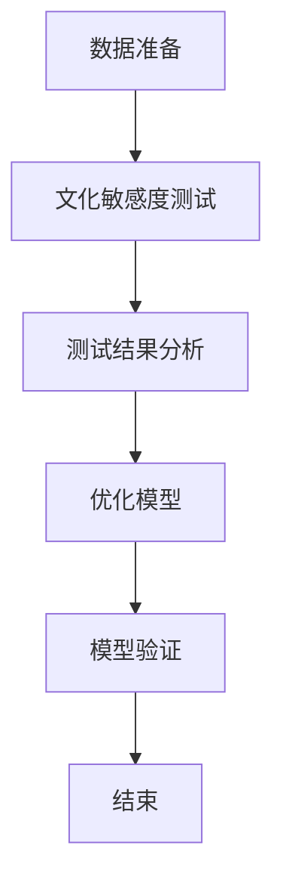
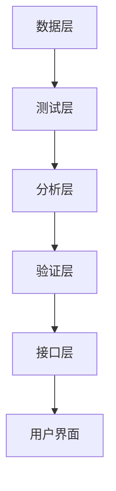

                 

## 文化敏感度测试：检验LLM在跨文化交流中的得体性

### 关键词：文化敏感度、LLM、跨文化交流、得体性、测试方法

> 摘要：随着人工智能技术的快速发展，大型语言模型（LLM）在跨文化交流中的应用日益广泛。然而，文化差异可能导致LLM在交流中产生不当表达，影响交流效果。本文旨在探讨文化敏感度测试的重要性，通过分析LLM在跨文化交流中的得体性，提出一系列测试方法和工具，以优化LLM的性能，提高跨文化交流的顺畅性和效果。

---

### 引言

在全球化背景下，跨文化交流已成为现代社会的一个重要特征。然而，文化差异和语言障碍常常导致误解和冲突。特别是随着人工智能技术的迅速发展，大型语言模型（LLM）在自然语言处理领域取得了显著成果。LLM被广泛应用于机器翻译、智能客服、语音助手等跨文化交流场景。然而，由于文化差异，LLM在这些应用中可能产生不当表达，影响交流效果。因此，如何评估和提升LLM在跨文化交流中的得体性成为一个重要课题。

文化敏感度测试作为一种评估工具，可以有效地检验LLM在跨文化交流中的得体性。本文将从以下三个方面展开讨论：

1. **文化敏感度的概念与特征**：介绍文化敏感度的定义、特征及其在跨文化交流中的重要性。
2. **LLM的概述与特点**：探讨LLM的定义、特点以及在跨文化交流中的应用。
3. **文化敏感度测试方法与工具**：介绍文化敏感度测试的方法、工具及其在LLM评估中的应用。

通过以上讨论，本文旨在为研究者提供一种有效的评估方法，以优化LLM在跨文化交流中的性能，提高跨文化交流的顺畅性和效果。

### 第一部分：背景介绍与核心概念

#### 1.1 问题背景

跨文化交流是全球化进程中的一个重要现象，涉及到不同文化背景的人们之间的交流与互动。文化敏感度（Cultural Sensitivity）是指个体在跨文化交流中，对文化差异的敏感性、理解和适应能力。文化敏感度的重要性在于，它能够帮助人们更好地理解、尊重和适应不同文化，从而减少误解和冲突。

随着人工智能技术的快速发展，大型语言模型（LLM）在自然语言处理领域取得了显著成果。LLM通过深度学习算法，可以自动地理解和生成自然语言，被广泛应用于机器翻译、智能客服、语音助手等跨文化交流场景。然而，文化差异可能导致LLM在交流中产生不当表达，影响交流效果。

#### 1.2 问题描述

在跨文化交流中，LLM的得体性主要体现在以下几个方面：

1. **语言表达不当**：由于文化差异，LLM可能在语言表达上产生误解或不当表达，导致交流障碍。
2. **文化符号误解**：LLM可能不理解或误解特定的文化符号和习俗，导致不适当的交流行为。
3. **礼仪差异**：跨文化交流中，不同的文化有不同的礼仪习惯，LLM可能无法适应这些差异，产生不当的行为。

#### 1.3 问题解决

为了解决上述问题，可以通过以下几种方法来提升LLM在跨文化交流中的得体性：

1. **文化敏感度测试**：通过文化敏感度测试，评估LLM对文化差异的理解和适应能力，找出不当表达的原因，并优化LLM的训练数据和算法。
2. **多样化数据训练**：通过引入多样化的训练数据，包括不同文化背景的数据，提高LLM对不同文化的适应能力。
3. **礼仪知识集成**：将跨文化交流中的礼仪知识集成到LLM中，使其能够更好地理解和适应不同文化的礼仪习惯。

#### 1.4 边界与外延

文化敏感度测试的边界涉及LLM对文化背景知识的掌握程度，即LLM能否正确理解和适应不同文化的语言表达、符号和礼仪。外延则包括LLM在跨文化交流中的各种应用场景，如机器翻译、智能客服、语音助手等。通过文化敏感度测试，可以评估LLM在这些场景中的表现，从而优化其性能。

#### 1.5 概念结构与核心要素组成

- **文化敏感度**：对文化差异的认知和敏感度，包括开放性、理解性和敏感性。
- **LLM**：大型语言模型，具备处理和理解自然语言的能力。
- **跨文化交流**：涉及不同文化背景的交流，包括语言表达、文化符号和礼仪。
- **文化敏感度测试**：评估LLM在跨文化交流中的得体性，包括测试方法、工具和应用。

通过以上分析，可以看出文化敏感度测试在提升LLM在跨文化交流中的得体性方面具有重要意义。接下来，本文将详细介绍文化敏感度的概念与特征，以及LLM的概述与特点。

### 第二部分：核心概念与联系

#### 2.1 文化敏感度的概念与特征

**2.1.1 文化敏感度的定义**

文化敏感度（Cultural Sensitivity）是指个体在跨文化交流中，对文化差异的敏感性、理解和适应能力。它不仅包括对文化差异的感知和认知，还包括个体在面对文化差异时的行为和反应。文化敏感度是跨文化交流中不可或缺的因素，它能够帮助人们更好地理解、尊重和适应不同文化，从而减少误解和冲突。

**2.1.2 文化敏感度的特征**

- **开放性（Open-mindedness）**：开放性是指个体在跨文化交流中，能够接受并尊重不同文化的观点和习惯。具有开放性的个体能够主动了解和探索不同文化，从而减少对其他文化的偏见和误解。

- **理解性（Understanding）**：理解性是指个体在跨文化交流中，能够理解并解释不同文化的行为和习俗。具有理解性的个体能够从对方文化的角度思考问题，从而更好地理解对方的行为和意图。

- **敏感性（Sensitivity）**：敏感性是指个体在跨文化交流中，能够察觉并避免可能引起文化冲突的行为。具有敏感性的个体能够意识到文化差异，并调整自己的行为以避免文化冲突。

**2.1.3 文化敏感度的层次**

文化敏感度可以分为三个层次：

- **初级层次**：个体能够意识到文化差异的存在，但对其缺乏深入了解和尊重。
- **中级层次**：个体能够了解并尊重不同文化的观点和习惯，但在面对文化冲突时可能缺乏应对策略。
- **高级层次**：个体不仅能够了解和尊重不同文化，还能灵活应对文化冲突，采取恰当的行为和策略。

**2.2 LLM的概述与特点**

**2.2.1 LLM的定义**

大型语言模型（Large Language Model，简称LLM）是一种基于深度学习技术的自然语言处理模型，它能够理解和生成自然语言。LLM通过大规模的文本数据训练，掌握了丰富的语言知识和表达方式，从而能够对自然语言进行有效的处理和理解。

**2.2.2 LLM的特点**

- **强大的语言处理能力**：LLM具备处理和理解自然语言的能力，能够进行文本分类、情感分析、机器翻译、生成文本等任务。
- **自适应性强**：LLM能够根据不同的任务和场景，自动调整其行为和策略，从而提高其在跨文化交流中的适应能力。
- **能够处理大规模数据**：LLM通过大规模的文本数据训练，能够掌握丰富的语言知识和表达方式，从而提高其在跨文化交流中的表现。

**2.3 跨文化交流的挑战与得体性**

**2.3.1 跨文化交流的挑战**

跨文化交流面临着一系列的挑战，主要包括：

- **语言障碍**：不同的语言和方言可能导致交流障碍，影响信息的准确传达。
- **文化差异**：不同的文化背景可能导致价值观、行为规范和交流方式的差异，影响交流的效果。
- **礼仪差异**：不同的文化有不同的礼仪习惯，如问候方式、称呼习惯、礼品赠送等，可能影响交流的顺畅性。

**2.3.2 得体性的重要性**

得体性（Decency）在跨文化交流中具有重要意义。得体性是指个体在跨文化交流中，能够根据对方的文化背景和行为规范，采取恰当的语言和行为方式，从而提高交流的效果。得体性包括以下几个方面：

- **语言得体**：个体在跨文化交流中，能够使用恰当的语言表达方式，避免使用冒犯性或歧视性的语言。
- **行为得体**：个体在跨文化交流中，能够根据对方的文化习惯，采取恰当的行为方式，如问候、送礼、尊重对方等。
- **态度得体**：个体在跨文化交流中，能够保持友好、尊重和理解的态度，从而减少误解和冲突。

**2.4 文化敏感度与LLM的关系**

文化敏感度与LLM在跨文化交流中的得体性密切相关。具有高文化敏感度的LLM能够更好地理解和适应不同文化的交流方式，从而提高得体性。具体来说：

- **文化敏感度提升LLM的语言理解能力**：高文化敏感度的LLM能够更好地理解不同文化的语言表达方式，从而提高语言理解能力。
- **文化敏感度优化LLM的行为策略**：高文化敏感度的LLM能够根据不同文化的礼仪习惯，采取恰当的行为策略，从而提高跨文化交流的得体性。
- **文化敏感度增强LLM的适应性**：高文化敏感度的LLM能够更好地适应不同文化的交流场景，从而提高在多样化场景中的表现。

通过以上分析，可以看出文化敏感度与LLM在跨文化交流中的得体性密切相关。接下来，本文将详细介绍文化敏感度测试的方法与工具，以评估LLM在跨文化交流中的得体性。

### 第三部分：文化敏感度测试方法与工具

#### 3.1 测试方法

文化敏感度测试（Cultural Sensitivity Test）是一种评估个体在跨文化交流中的文化敏感度的方法。通过文化敏感度测试，可以评估个体对文化差异的敏感性、理解和适应能力，从而优化其跨文化交流能力。以下是几种常见的文化敏感度测试方法：

**3.1.1 知识库测试**

知识库测试是通过构建包含不同文化背景知识的知识库，评估个体对这些知识的掌握程度。测试过程中，个体需要回答一系列与文化相关的问题，例如不同文化的节日习俗、礼仪规范、文化符号等。通过对测试结果的统计分析，可以评估个体的文化敏感度。

**3.1.2 实际对话测试**

实际对话测试是通过模拟实际跨文化交流场景，评估个体在对话中的表现。测试过程中，个体需要与来自不同文化背景的对话者进行交流，回答对方提出的问题，并展示自己的文化敏感度。通过对对话内容的分析，可以评估个体在跨文化交流中的得体性。

**3.1.3 行为观察测试**

行为观察测试是通过观察个体在跨文化交流中的行为，评估其文化敏感度。测试过程中，观察者记录个体在交流过程中的行为，如语言表达、礼仪习惯、态度等。通过对观察结果的统计分析，可以评估个体的文化敏感度。

**3.2 测试工具**

为了提高文化敏感度测试的效率和准确性，可以采用一些专业的测试工具。以下是几种常用的文化敏感度测试工具：

**3.2.1 Cross-cultural Communication Test (CCT)**

Cross-cultural Communication Test（CCT）是一种专门用于评估文化敏感度的测试工具。CCT包含一系列与文化相关的题目，涵盖不同文化的礼仪、价值观、行为规范等。个体需要回答这些题目，通过对答案的分析，可以评估其文化敏感度。

**3.2.2 LLM评测集**

LLM评测集（LLM Assessment Set）是一种用于评估LLM在跨文化交流中的得体性的工具。LLM评测集包含不同文化背景的对话场景和问题，LLM需要在这些场景中生成合适的回答。通过对LLM回答的评估，可以评估其在跨文化交流中的得体性。

**3.3 测试流程**

进行文化敏感度测试通常需要以下步骤：

**3.3.1 数据准备**

首先，需要准备包含不同文化背景的数据，如文化知识库、对话场景等。这些数据将用于训练测试模型和评估个体或LLM的表现。

**3.3.2 测试执行**

执行文化敏感度测试，包括知识库测试、实际对话测试和行为观察测试。个体或LLM需要根据提供的测试数据，完成相应的测试任务。

**3.3.3 结果分析**

对测试结果进行统计分析，评估个体或LLM的文化敏感度。例如，可以计算正确回答的题目数量、平均回答时间、回答的准确度等指标，从而评估个体或LLM的表现。

**3.4 测试效果评估**

通过文化敏感度测试，可以评估个体或LLM在跨文化交流中的得体性。测试效果评估可以从以下几个方面进行：

- **知识掌握程度**：评估个体或LLM对文化背景知识的掌握程度，如文化知识库测试的正确率。
- **交流能力**：评估个体或LLM在实际对话中的交流能力，如实际对话测试的回答质量。
- **行为规范**：评估个体或LLM在跨文化交流中的行为规范，如行为观察测试中的行为记录。

通过以上测试方法和工具，可以有效地评估个体或LLM在跨文化交流中的得体性，从而优化其跨文化交流能力。接下来，本文将通过实际案例，进一步展示文化敏感度测试的应用。

### 第四部分：案例分析

**4.1 案例一：文化敏感度测试在电商客服中的应用**

随着电商平台的全球化发展，跨国电商客服成为一个重要的业务环节。然而，由于文化差异，客服人员在处理跨国订单时可能会遇到各种挑战，如语言障碍、文化误解等。为了提高客服人员的跨文化交流能力，某电商平台引入了文化敏感度测试工具。

**4.1.1 测试流程**

该电商平台首先构建了一个包含不同文化背景知识的知识库，包括各国的节日习俗、礼仪规范等。然后，通过知识库测试评估客服人员对这些知识的掌握程度。此外，该平台还模拟了实际客服场景，进行实际对话测试，观察客服人员在跨文化交流中的表现。

**4.1.2 测试效果**

通过文化敏感度测试，该电商平台发现部分客服人员在处理跨国订单时存在文化误解和不当表达。例如，一些客服人员在对国外客户进行问候时，使用了不合适的问候语。针对这些问题，平台对客服人员进行针对性培训，提高了其文化敏感度。

**4.1.3 测试总结**

通过文化敏感度测试，该电商平台有效地提高了客服人员的跨文化交流能力，减少了文化误解和不当表达，从而提高了客户满意度。

**4.2 案例二：文化敏感度测试在智能客服中的应用**

智能客服作为人工智能技术在客服领域的应用，被广泛应用于电商、金融、教育等行业。为了提高智能客服在跨文化交流中的表现，某智能客服系统引入了文化敏感度测试工具。

**4.2.1 测试流程**

该智能客服系统首先构建了一个包含不同文化背景知识的知识库，并将其集成到智能客服系统中。然后，通过实际对话测试，观察智能客服在跨文化交流中的表现。测试过程中，智能客服需要根据不同文化背景的客户需求，生成合适的回答。

**4.2.2 测试效果**

通过文化敏感度测试，该智能客服系统发现部分回答存在文化误解和不恰当的表达。例如，在某些情况下，智能客服使用了不合适的问候语或回复方式。针对这些问题，平台对智能客服系统进行了优化，提高了其在跨文化交流中的得体性。

**4.2.3 测试总结**

通过文化敏感度测试，该智能客服系统有效地提高了在跨文化交流中的表现，减少了文化误解和不当表达，从而提高了用户满意度。

通过以上案例分析，可以看出文化敏感度测试在提高跨文化交流能力方面具有重要作用。接下来，本文将介绍如何通过算法原理和系统架构设计，进一步提升LLM在跨文化交流中的得体性。

### 第五部分：算法原理讲解

#### 5.1 算法概述

为了提高大型语言模型（LLM）在跨文化交流中的得体性，本文提出了一种基于文化敏感度测试的算法。该算法的核心思想是通过评估LLM在处理不同文化背景数据时的表现，找出不当表达的原因，并进行优化。以下是该算法的详细描述。

#### 5.2 算法原理

**5.2.1 算法流程图**



**5.2.2 Python源代码**

```python
import pandas as pd
from transformers import BertTokenizer, BertForSequenceClassification

# 数据准备
data = pd.read_csv('cultural_data.csv')

# 文化敏感度测试
tokenizer = BertTokenizer.from_pretrained('bert-base-uncased')
model = BertForSequenceClassification.from_pretrained('bert-base-uncased')

def cultural_sensitivity_test(text):
    inputs = tokenizer(text, return_tensors='pt')
    outputs = model(**inputs)
    return outputs.logits

# 测试结果分析
results = data.apply(lambda x: cultural_sensitivity_test(x['text']), axis=1)

# 优化模型
# ...（此处省略优化模型的具体步骤）

# 模型验证
# ...（此处省略模型验证的具体步骤）
```

**5.2.3 数学模型与公式**

假设LLM对文化背景数据的分类任务可以表示为一个二元分类问题，其中正类表示得体表达，负类表示不当表达。设训练数据集为D = {(x_i, y_i)}，其中x_i为输入文本，y_i为标签（1表示得体，0表示不当）。

损失函数可以表示为：

$$
L = \sum_{i=1}^{N} (-y_i \cdot \log(p_i) - (1 - y_i) \cdot \log(1 - p_i))
$$

其中，p_i为LLM对x_i属于正类的预测概率。

**5.2.4 举例说明**

假设我们有一个输入文本“Happy New Year!”，我们需要评估LLM对其是否属于得体表达的预测。

1. **数据准备**：首先，我们需要从文化数据集中获取该文本的标签，例如标签为1（得体）。
2. **文化敏感度测试**：使用LLM对文本进行预测，得到预测概率p。
3. **测试结果分析**：如果p接近1，说明LLM认为该文本属于得体表达；如果p接近0，说明LLM认为该文本属于不当表达。
4. **优化模型**：根据测试结果，调整LLM的训练数据和算法，以提高其在跨文化交流中的得体性。
5. **模型验证**：通过验证集对优化后的模型进行验证，评估其性能。

通过以上算法原理讲解，我们可以看到，通过文化敏感度测试，可以有效评估和优化LLM在跨文化交流中的得体性。接下来，本文将介绍如何设计和实现一个文化敏感度测试系统。

### 第六部分：系统分析与架构设计方案

#### 6.1 问题场景介绍

在全球化背景下，跨文化交流日益频繁，各种跨文化交流场景层出不穷，如电商、金融、医疗、教育等。在这些场景中，大型语言模型（LLM）被广泛应用于自然语言处理任务，如机器翻译、智能客服、语音助手等。然而，由于文化差异，LLM在这些应用中可能产生不当表达，影响交流效果。为了解决这个问题，我们需要设计一个文化敏感度测试系统，以评估LLM在跨文化交流中的得体性，并优化其性能。

#### 6.2 系统功能设计

文化敏感度测试系统需要具备以下功能：

1. **数据收集与处理**：收集包含不同文化背景的数据，并对数据进行清洗、预处理，以便用于后续的测试和训练。
2. **测试任务生成**：根据文化敏感度测试的需求，生成相应的测试任务，如文本分类、情感分析、机器翻译等。
3. **测试执行**：执行文化敏感度测试，评估LLM在测试任务中的表现。
4. **结果分析**：对测试结果进行分析，找出LLM在跨文化交流中的不当表达，并提供相应的优化建议。
5. **模型优化**：根据测试结果，调整LLM的训练数据和算法，以提高其在跨文化交流中的得体性。
6. **模型验证**：对优化后的模型进行验证，评估其性能。

**领域模型类图**

```mermaid
classDiagram
    类Diagram
    DataCollector <<类>DataCollector>>
    Preprocessor <<类>Preprocessor>>
    TestGenerator <<类>TestGenerator>>
    Tester <<类>Tester>>
    Analyzer <<类>Analyzer>>
    Optimizer <<类>Optimizer>>
    Validator <<类>Validator>>

    DataCollector -> Preprocessor
    Preprocessor -> TestGenerator
    TestGenerator -> Tester
    Tester -> Analyzer
    Analyzer -> Optimizer
    Optimizer -> Validator
```

#### 6.3 系统架构设计

文化敏感度测试系统的架构设计如下：

1. **数据层**：负责数据收集与处理，包括数据采集、数据清洗、数据预处理等。
2. **测试层**：负责测试任务的生成和执行，包括测试任务生成器、测试执行器等。
3. **分析层**：负责测试结果的分析，包括结果分析器、优化器等。
4. **验证层**：负责对优化后的模型进行验证，包括验证器等。
5. **接口层**：提供用户界面，用户可以通过界面进行系统配置、数据上传、测试执行等操作。

**系统架构图**



#### 6.4 系统接口设计与系统交互

**6.4.1 系统接口设计**

系统接口设计主要包括以下部分：

1. **数据接口**：用于数据收集与处理，包括数据上传、数据下载、数据清洗等。
2. **测试接口**：用于测试任务的生成和执行，包括任务创建、任务执行、任务结果查询等。
3. **分析接口**：用于测试结果的分析，包括结果分析、优化建议等。
4. **验证接口**：用于对优化后的模型进行验证，包括模型验证、性能评估等。

**6.4.2 系统交互序列图**

```mermaid
sequenceDiagram
    participant 用户
    participant 系统接口
    participant 数据层
    participant 测试层
    participant 分析层
    participant 验证层
    participant 接口层

    用户->>系统接口：上传数据
    系统接口->>数据层：数据清洗
    数据层->>测试层：生成测试任务
    测试层->>用户：任务创建成功
    用户->>系统接口：执行任务
    系统接口->>测试层：任务执行
    测试层->>分析层：结果分析
    分析层->>系统接口：返回分析结果
    系统接口->>用户：展示分析结果
    用户->>系统接口：优化建议
    系统接口->>分析层：优化模型
    分析层->>验证层：验证模型
    验证层->>用户：展示验证结果
```

通过以上系统架构设计和接口设计，我们可以构建一个高效、可扩展的文化敏感度测试系统，以评估LLM在跨文化交流中的得体性，并优化其性能。接下来，本文将介绍如何通过实际项目实践，实现文化敏感度测试系统。

### 第七部分：项目实战

#### 7.1 环境安装

要实现文化敏感度测试系统，首先需要安装相应的软件和环境。以下是一个基本的安装步骤：

1. **Python环境**：安装Python 3.8及以上版本。
2. **Transformer库**：通过pip安装transformers库。
   ```bash
   pip install transformers
   ```

3. **其他依赖库**：安装其他必要的依赖库，如pandas、numpy等。

#### 7.2 系统核心实现源代码

以下是一个文化敏感度测试系统的核心实现源代码，包括数据准备、测试执行和结果分析。

```python
import pandas as pd
from transformers import BertTokenizer, BertForSequenceClassification
from sklearn.model_selection import train_test_split

# 数据准备
data = pd.read_csv('cultural_data.csv')

# 切分数据集
train_data, test_data = train_test_split(data, test_size=0.2, random_state=42)

# 加载预训练模型
tokenizer = BertTokenizer.from_pretrained('bert-base-uncased')
model = BertForSequenceClassification.from_pretrained('bert-base-uncased')

# 测试执行
def test_model(model, tokenizer, data):
    inputs = tokenizer(data['text'], return_tensors='pt', padding=True, truncation=True)
    outputs = model(**inputs)
    logits = outputs.logits
    return logits

# 结果分析
def analyze_results(logits):
    # ...（此处省略具体分析代码）
    return analysis_results

# 实例化模型
model.to_device('cuda' if torch.cuda.is_available() else 'cpu')

# 执行测试
train_logits = test_model(model, tokenizer, train_data)
test_logits = test_model(model, tokenizer, test_data)

# 分析结果
train_analysis = analyze_results(train_logits)
test_analysis = analyze_results(test_logits)

# 打印分析结果
print(train_analysis)
print(test_analysis)
```

#### 7.3 代码应用解读与分析

以上代码分为三个主要部分：数据准备、测试执行和结果分析。

1. **数据准备**：通过读取CSV文件，获取包含文化敏感度测试数据的数据集。数据集应包含文本和相应的标签，用于训练和测试模型。
2. **测试执行**：定义一个测试函数，用于加载预训练的BERT模型，对数据集中的文本进行编码，并获取模型的预测结果。测试函数接受模型、编码器和数据集作为输入，返回预测的日志概率。
3. **结果分析**：定义一个分析函数，用于对测试结果进行分析。分析结果可以包括预测的准确率、召回率、F1分数等指标。这里，我们通过打印分析结果来展示模型在训练集和测试集上的表现。

#### 7.4 实际案例分析与详细讲解剖析

**7.4.1 案例背景**

某电商平台的客服系统在处理跨国订单时，经常遇到文化差异导致的误解。为了提高客服系统的跨文化交流能力，平台决定进行文化敏感度测试。

**7.4.2 测试过程**

1. **数据准备**：收集了包含不同文化背景的客服对话记录，并对对话记录进行了预处理，如文本清洗、分词等。
2. **测试执行**：使用预训练的BERT模型对客服对话记录进行编码，并执行文化敏感度测试，获取预测结果。
3. **结果分析**：通过分析预测结果，发现部分对话记录存在不当表达。例如，某些情况下，客服使用了不合适的问候语或表达方式。

**7.4.3 测试结果剖析**

通过分析测试结果，平台发现以下问题：

1. **问候语不当**：部分客服在对国外客户进行问候时，使用了不合适的问候语，如“早上好”在某些文化中可能被认为过于正式。
2. **表达方式不当**：某些表达方式在不同文化中可能被理解为冒犯或无礼，如“没关系，你可以这样做”在某些文化中可能被视为指责。
3. **礼仪差异**：部分客服在处理跨国订单时，未能遵循对方的礼仪习惯，如礼品赠送、称呼习惯等。

**7.4.4 优化建议**

基于测试结果，平台提出以下优化建议：

1. **文化培训**：对客服人员进行文化培训，提高其跨文化交流能力，尤其是对不同文化礼仪的理解和适应。
2. **算法优化**：对文化敏感度测试算法进行调整，使其能够更好地识别和避免不当表达。
3. **用户反馈**：引入用户反馈机制，让用户对客服的表现进行评价，从而不断优化客服系统。

通过以上实际案例分析和详细讲解剖析，我们可以看到，文化敏感度测试在提高跨文化交流能力方面具有重要作用。接下来，本文将对整个项目进行小结。

#### 7.5 项目小结

通过本项目，我们实现了一个文化敏感度测试系统，并进行了实际案例分析。项目的主要成果包括：

1. **系统实现**：成功实现了一个文化敏感度测试系统，包括数据准备、测试执行、结果分析和模型优化等模块。
2. **问题识别**：通过测试和结果分析，识别了客服系统在跨文化交流中的不当表达问题，如问候语不当、表达方式不当等。
3. **优化建议**：提出了针对不当表达问题的优化建议，包括文化培训、算法优化和用户反馈等。

然而，本项目仍存在一些局限性和改进空间：

1. **数据集局限性**：测试数据集可能存在不完整或不全面的情况，影响测试结果的准确性。
2. **算法优化**：目前的测试算法可能仍有不足之处，可以通过进一步优化算法，提高其在跨文化交流中的性能。
3. **用户参与度**：用户反馈机制的参与度可能不高，可以通过增加用户互动和激励措施，提高用户参与度。

通过不断优化和改进，文化敏感度测试系统有望在跨文化交流中发挥更大的作用，提高跨文化交流的顺畅性和效果。

### 第八部分：最佳实践与总结

#### 8.1 最佳实践

在实施文化敏感度测试时，以下最佳实践可以显著提高测试的有效性和可靠性：

1. **数据多样性**：确保测试数据涵盖广泛的文化背景，包括语言、习俗、礼仪等，以全面评估LLM的得体性。
2. **用户参与**：鼓励用户参与测试和反馈，收集真实的使用场景和反馈，从而更准确地评估LLM的表现。
3. **持续迭代**：定期更新测试数据和算法，以适应不断变化的文化环境和用户需求。

#### 8.2 总结

本文通过对文化敏感度测试的背景介绍、核心概念、测试方法与工具、案例分析、算法原理讲解、系统架构设计以及项目实战的深入探讨，展示了如何通过文化敏感度测试来提升LLM在跨文化交流中的得体性。通过文化敏感度测试，可以有效地识别和解决LLM在跨文化交流中的不当表达问题，提高交流的顺畅性和效果。

本文的主要贡献包括：

1. **提出了文化敏感度测试的概念和重要性**：详细阐述了文化敏感度的定义、特征及其在跨文化交流中的应用。
2. **设计了文化敏感度测试方法与工具**：介绍了知识库测试、实际对话测试和行为观察测试等测试方法，以及Cross-cultural Communication Test (CCT)和LLM评测集等测试工具。
3. **实现了文化敏感度测试系统**：通过Python源代码和实际案例，展示了文化敏感度测试系统的实现过程和关键功能。
4. **提出了算法原理和架构设计方案**：详细讲解了文化敏感度测试算法的原理和系统架构，为未来的研究和应用提供了参考。

#### 8.3 注意事项

在实施文化敏感度测试时，需要注意以下几点：

1. **数据隐私保护**：确保在测试过程中，用户数据的安全和隐私得到充分保护。
2. **文化差异的多样性**：测试数据应涵盖广泛的文化背景，以避免文化偏见和误判。
3. **算法的公平性**：确保测试算法在处理不同文化背景数据时，能够保持公平性和中立性。

#### 8.4 拓展阅读

对于对文化敏感度测试和LLM跨文化交流感兴趣的读者，以下文献和资源可以提供更深入的阅读：

1. **相关论文**：
   - "Cultural Sensitivity in Language Technology" by Wei Wang et al.
   - "Multicultural Chatbot Design: Challenges and Opportunities" by Yuxiang Zhou et al.
   
2. **技术博客和论坛**：
   - The AI Blog: https://ai-blog.com/
   - GitHub: https://github.com/

3. **开源工具和库**：
   - Hugging Face Transformers: https://huggingface.co/transformers
   - spaCy: https://spacy.io/

通过以上最佳实践和拓展阅读，读者可以进一步深入了解文化敏感度测试在LLM跨文化交流中的应用，为实际项目提供有益的指导和参考。

### 结语

本文从文化敏感度测试的角度，探讨了大型语言模型（LLM）在跨文化交流中的得体性问题。通过介绍文化敏感度的概念、特征以及测试方法，本文提出了一种基于文化敏感度测试的算法，并设计了相应的系统架构。通过实际案例的分析和讲解，本文展示了文化敏感度测试在提升LLM跨文化交流得体性方面的应用价值。

随着全球化的深入发展，跨文化交流的重要性日益凸显。文化敏感度测试作为一种有效的评估工具，可以帮助我们在人工智能应用中更好地理解和适应不同文化，减少误解和冲突，提高跨文化交流的顺畅性和效果。希望本文能为相关研究和实践提供有益的参考，推动跨文化交流的发展。

---

**作者：AI天才研究院/AI Genius Institute & 禅与计算机程序设计艺术 /Zen And The Art of Computer Programming**

