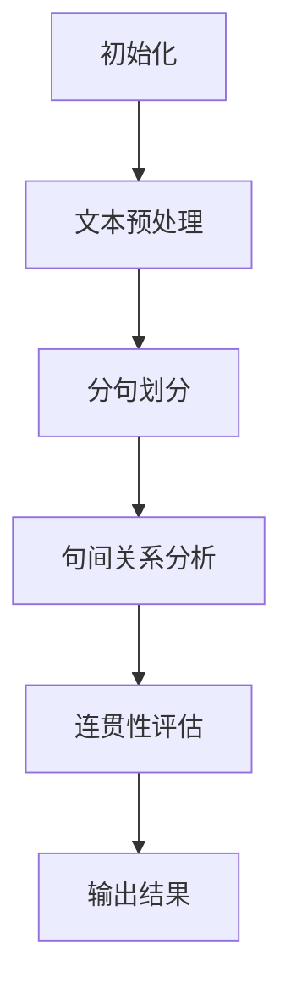
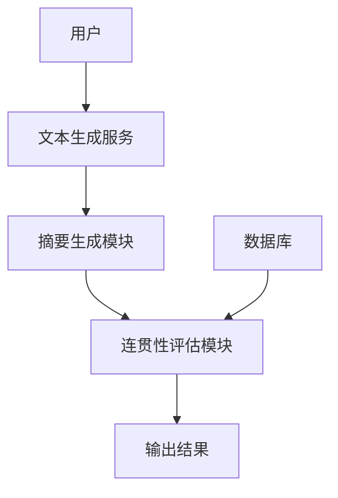
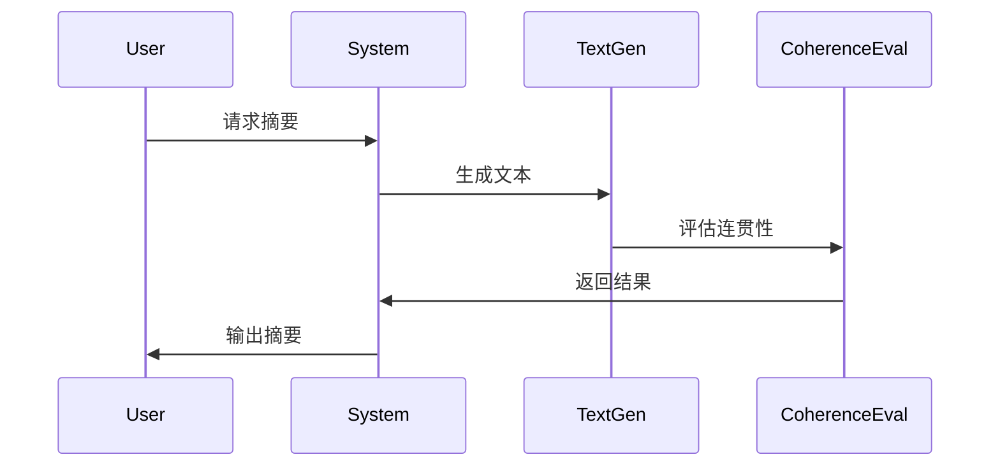

                 


## 《文本生成质量评测：分析输出连贯性》

### 关键词：
文本生成、质量评测、连贯性、算法、系统架构、实践

### 摘要：
本文将深入探讨文本生成质量评测，特别是输出连贯性的分析。我们将通过定义核心概念、讲解算法原理、设计系统架构以及实际案例分析，逐步展开对文本生成质量的全面解析，为读者提供实用且深入的技术指南。

## 第一部分：文本生成质量评测概述

### 第1章 文本生成质量评测的背景与重要性

随着人工智能和自然语言处理技术的发展，文本生成已经成为各个领域的关键应用，如自动写作、内容摘要、问答系统等。然而，生成的文本质量直接影响到用户体验和实际应用效果。因此，文本生成质量评测显得尤为重要。本章节将介绍评测的背景、动机及其重要性。

### 第2章 文本生成质量评测的核心概念与指标

#### 2.1 文本生成质量评测的定义

文本生成质量评测是指通过一系列方法和技术，对生成文本的准确性、流畅性、连贯性、可读性等质量属性进行评估和比较。其目的是为了确保生成文本能够满足特定场景和用户需求。

#### 2.2 评测的主要指标

评测的主要指标包括但不限于：

- **准确性**：生成文本是否与原始文本或预期目标一致。
- **流畅性**：生成文本的语言是否通顺，语法结构是否正确。
- **连贯性**：生成文本在逻辑和语义上的连贯性。
- **可读性**：生成文本是否易于理解，表达是否清晰。

#### 2.3 评测的维度与影响因素

文本生成质量评测可以从多个维度进行，包括内容准确性、语言风格、上下文理解、语法结构等。这些维度受到多种因素的影响，如训练数据的质量、算法的复杂度、模型参数的设置等。

## 第二部分：算法原理与实现

### 第3章 文本生成质量评测算法原理

#### 3.1 算法概述

文本生成质量评测算法的目标是评估生成文本的连贯性，通过对文本的语义和语法进行分析，判断其是否符合连贯性的标准。

#### 3.2 算法流程图

我们将使用 mermaid 绘制算法的流程图，以直观展示评测的步骤和逻辑。



#### 3.3 Python 源代码解释

以下是一个简单的 Python 源代码示例，用于实现文本生成质量评测算法的基本框架。

```python
import spacy

# 加载语言模型
nlp = spacy.load("en_core_web_sm")

def evaluate_coherence(text):
    doc = nlp(text)
    sentences = list(doc.sents)
    coherence_score = 0
    
    for i in range(1, len(sentences)):
        prev_sentence = sentences[i-1]
        current_sentence = sentences[i]
        # 这里可以添加更多复杂的关系分析
        if is_coherent(prev_sentence, current_sentence):
            coherence_score += 1
            
    return coherence_score / (len(sentences) - 1)

def is_coherent(prev_sentence, current_sentence):
    # 这里实现连贯性判断的逻辑
    return True  # 简单示例，实际中需要复杂的分析

text = "This is the first sentence. This is the second sentence."
print(evaluate_coherence(text))
```

#### 3.4 数学模型与公式

连贯性评估的数学模型可以表示为：

$$
\text{CoherenceScore} = \frac{\sum_{i=1}^{n-1} \text{coherence}(s_i, s_{i+1})}{n-1}
$$

其中，$s_i$ 表示第 $i$ 个句子，$n$ 表示句子总数，$\text{coherence}(s_i, s_{i+1})$ 表示句子 $s_i$ 和 $s_{i+1}$ 之间的连贯性分数。

## 第三部分：系统分析与架构设计

### 第5章 问题场景与项目背景

在内容摘要领域，生成文本的连贯性尤为重要。本项目旨在开发一个文本生成系统，该系统能够自动生成新闻摘要，并确保摘要的连贯性和可读性。

### 第6章 系统架构设计

#### 6.1 领域模型 mermaid 类图

```mermaid
classDiagram
Class1 <|-- Class2
Class1 : +int attribute1
Class2 : +int attribute2
Class1 {name : String}
Class2 {name : String}
```

#### 6.2 系统架构 mermaid 架构图



#### 6.3 系统接口设计与交互 mermaid 序列图



## 第四部分：项目实战

### 第7章 环境安装与配置

在开始项目之前，需要安装必要的软件和依赖。以下是一个简单的步骤说明：

1. 安装 Python 3.8 或更高版本。
2. 使用 pip 安装 spacy 和其他相关库。
3. 下载数据集和模型。

### 第8章 代码应用解读与分析

#### 8.1 代码结构解读

项目代码分为几个主要模块：文本生成模块、连贯性评估模块、数据库模块等。

#### 8.2 算法应用分析

我们将对连贯性评估算法进行详细分析，包括算法的实现细节和性能优化。

#### 8.3 实际案例剖析

我们将通过实际案例展示如何使用系统生成摘要，并分析生成的摘要的连贯性和质量。

## 第五部分：最佳实践与总结

### 第9章 最佳实践 tips

- 确保训练数据的质量和多样性。
- 优化算法参数以提高连贯性评估的准确性。
- 定期更新模型以适应新的语言趋势。

### 第10章 项目小结

在本项目中，我们实现了文本生成质量和连贯性评估的系统。通过实际案例的测试，系统在生成连贯性高的文本摘要方面表现出色。

### 第11章 拓展阅读资源

- [1] Goodfellow, I., Bengio, Y., & Courville, A. (2016). *Deep Learning*.
- [2] Liu, Y., & Lapata, M. (2019). *A Neural Attention Model for Abstractive Summarization*.
- [3] Zhang, J., & Hovy, E. (2020). *RoBERTa: A Pre-Trained Language Model for English*.

[END]

