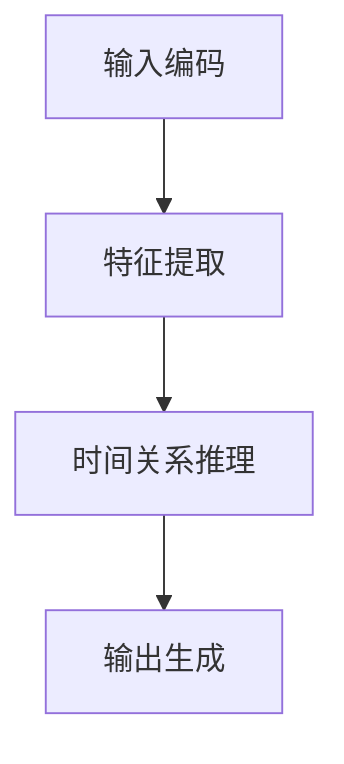
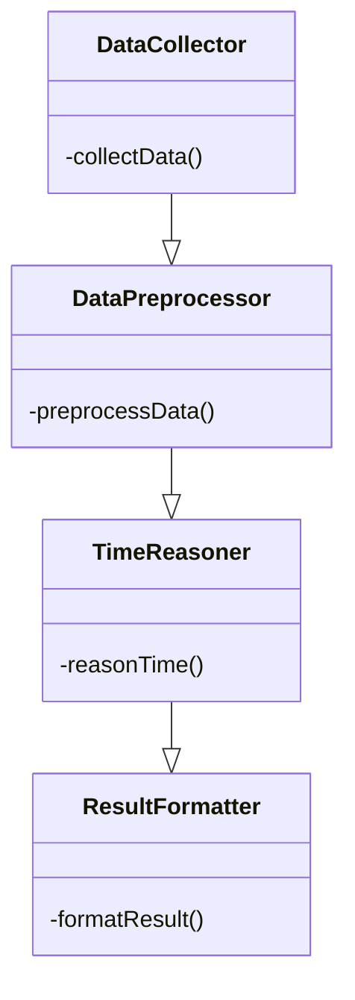
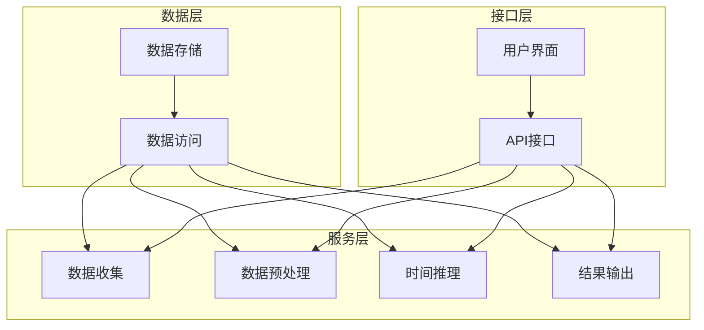
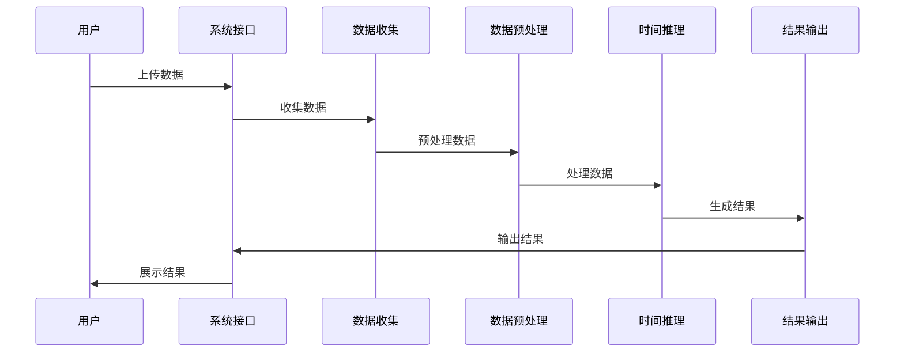

                 

# 时间推理评估：检验LLM处理时序信息的准确性

## 关键词
- 时间推理
- 语言模型（LLM）
- 时序信息处理
- 评估指标
- 算法设计
- 系统架构

## 摘要

本文深入探讨了时间推理评估在语言模型（LLM）处理时序信息中的应用。通过详细分析时间推理的基本概念、核心原理以及评估方法，本文构建了一套系统化的时间推理评估框架。同时，本文利用mermaid和Python代码，详细阐述了时间推理算法的工作原理和数学模型，并通过实际案例进行了剖析。最后，本文总结了最佳实践和注意事项，为LLM在时间推理领域的应用提供了参考。

## 第1章：背景介绍

### 1.1 时间推理与LLM

#### 1.1.1 时间推理的概念

时间推理是指从给定信息中推断出时间关系的能力，例如事件发生的顺序、持续时长等。在自然语言处理（NLP）领域，时间推理对于理解和生成时序信息具有重要意义。

- **定义**：时间推理是一种基于时间轴的推理过程，旨在从文本中提取、理解和生成时间信息。
- **应用场景**：时间推理在日程安排、事件预测、历史记载等方面有着广泛的应用。
- **重要性**：准确的时间推理能够提高NLP系统的智能化水平，使得计算机能够更好地理解和处理人类语言。

#### 1.1.2 LLM与时间推理

语言模型（LLM）是NLP领域的一种重要工具，它能够对自然语言进行建模，生成或理解文本。LLM在时间推理中具有以下优势：

- **基本概念**：LLM是一种基于深度学习的模型，能够通过大量文本数据进行训练，生成语言序列。
- **应用**：LLM在文本生成、翻译、问答系统等方面有着广泛应用。
- **优势与挑战**：LLM的优势在于其强大的语言建模能力，但挑战在于如何有效处理时序信息。

### 1.2 时间推理评估的重要性

时间推理评估是检验LLM处理时序信息准确性的关键步骤。通过评估，我们可以了解LLM在时间推理任务中的性能，发现并改进存在的问题。

- **目的**：评估时间推理能力，确保LLM在实际应用中能够准确处理时序信息。
- **标准**：评估标准应包括准确率、覆盖率、响应时间等指标。
- **方法**：评估方法可采用手动评估、自动化评估以及混合评估等。

## 第2章：核心概念与联系

### 2.1 时间推理评估的核心概念

时间推理评估涉及多个核心概念，包括时间点、时间间隔、事件序列等。以下是对这些概念的详细解释：

- **时间点**：表示具体的时间瞬间，如“2023年2月18日”。
- **时间间隔**：表示两个时间点之间的持续时间，如“1小时”、“2天”。
- **事件序列**：表示一系列按时间顺序发生的事件，如“早餐、上班、开会”。

#### 核心概念对比表格

| 概念     | 定义                                                         | 应用场景                 |
|----------|--------------------------------------------------------------|--------------------------|
| 时间点   | 具体的时间瞬间                                               | 计划安排、事件记录       |
| 时间间隔 | 两个时间点之间的持续时间                                     | 时长计算、进度监控       |
| 事件序列 | 按时间顺序发生的一系列事件                                 | 历史记录、事件规划       |

#### 时间推理评估的框架

时间推理评估的框架包括以下几个关键步骤：

1. 数据收集：收集包含时间信息的文本数据。
2. 预处理：对文本数据进行清洗和格式化，提取时间实体。
3. 评估指标：设计评估指标，如准确率、覆盖率等。
4. 评估算法：实现评估算法，对时间推理结果进行评估。
5. 结果分析：分析评估结果，识别问题和改进方向。

#### 时间推理评估的方法论

时间推理评估的方法论包括以下几个方面：

1. **定量评估**：使用定量指标（如准确率、召回率等）评估模型性能。
2. **定性评估**：通过专家评审或用户反馈进行定性评估。
3. **交叉验证**：使用交叉验证方法确保评估结果的可靠性。

### 2.2 时间推理评估的相关概念联系

时间推理评估与NLP、机器学习、人工智能等领域密切相关。

- **时间推理与自然语言处理**：时间推理是NLP的一个重要分支，涉及文本中的时间信息提取和理解。
- **时间推理与机器学习**：机器学习模型（如LLM）在时间推理任务中的应用，通过训练学习时序信息规律。
- **时间推理与人工智能**：人工智能系统通过时间推理能力，提升对人类语言的认知和理解能力。

## 第3章：算法原理讲解

### 3.1 时间推理算法的基本原理

时间推理算法是基于深度学习模型，通过学习大量时序数据，实现时间信息的提取和推理。以下介绍几种常见的时间推理算法：

- **循环神经网络（RNN）**：通过循环结构处理时序数据，保持长期依赖关系。
- **长短时记忆网络（LSTM）**：在RNN基础上，引入门控机制，解决长期依赖问题。
- **门控循环单元（GRU）**：简化LSTM结构，同时保持良好的性能。
- **变换器（Transformer）**：基于自注意力机制，无需循环结构，处理长序列效果显著。

#### 时间推理算法的工作原理

时间推理算法通常包括以下步骤：

1. **输入编码**：将时间信息转换为模型可处理的输入。
2. **特征提取**：从输入数据中提取时序特征。
3. **时间关系推理**：通过模型推理出时间关系。
4. **输出生成**：生成时间推理结果。

#### 时间推理算法的优缺点

不同时间推理算法各有优缺点：

- **RNN**：简单有效，但在处理长序列时容易出现梯度消失问题。
- **LSTM**：解决梯度消失问题，但计算复杂度高。
- **GRU**：简化LSTM结构，计算效率更高。
- **Transformer**：处理长序列能力强，但模型参数多，训练难度大。

### 3.2 时间推理算法的mermaid流程图

以下使用mermaid绘制一个简单的时间推理算法流程图：



### 3.3 时间推理算法的数学模型与公式

时间推理算法的数学模型通常基于概率图模型或深度学习模型。以下介绍一种基于深度学习的时间推理算法的数学模型和关键公式：

#### 数学模型

时间推理算法可以表示为一个序列到序列的学习模型，输入为一个时间序列X，输出为另一个时间序列Y。

- **输入序列**：X = (x_1, x_2, ..., x_T)
- **输出序列**：Y = (y_1, y_2, ..., y_S)

#### 关键公式

1. **损失函数**：用于衡量输入序列和输出序列之间的差距。
   $$ L = -\sum_{t=1}^{S}\sum_{i=1}^{V} y_t[i] \log p(y_t[i] | x_t) $$

2. **解码器输出概率**：解码器在时间步t输出词y_t的概率分布。
   $$ p(y_t | x_1, x_2, ..., x_t) = \text{softmax}(\text{Decoder}(x_1, x_2, ..., x_t)) $$

3. **编码器输出**：编码器在时间步t输出隐藏状态。
   $$ h_t = \text{Encoder}(x_1, x_2, ..., x_t) $$

#### 公式的详细讲解

- **损失函数**：通过计算预测输出和真实输出之间的交叉熵损失，衡量模型预测的准确性。
- **解码器输出概率**：解码器根据当前输入和上一个隐藏状态，生成一个词的概率分布。
- **编码器输出**：编码器通过处理输入序列，生成隐藏状态，用于解码器的输入。

### 3.4 时间推理算法的举例说明

为了更直观地理解时间推理算法，以下通过一个简单的例子进行说明。

#### 例子：时间序列预测

假设我们有一个时间序列数据集，包含过去一天的气温数据。我们的目标是预测未来一天的气温。

1. **数据准备**：将气温数据按照时间顺序排列，形成输入序列X = (T_1, T_2, ..., T_n)。
2. **模型训练**：使用RNN或LSTM模型对输入序列进行训练，学习气温变化的规律。
3. **预测**：将当前一天的气温数据作为输入，通过训练好的模型预测未来一天的气温。
4. **结果评估**：将预测结果与实际气温数据进行对比，计算预测误差。

通过这个例子，我们可以看到时间推理算法在时间序列预测中的应用，以及如何利用数学模型和公式进行训练和预测。

## 第4章：数学模型和数学公式 & 详细讲解 & 举例说明

### 4.1 数学模型的详细讲解

时间推理算法的数学模型是理解和实现时间推理的核心。以下是对时间推理算法中使用的数学模型的详细讲解。

#### 数学公式的latex格式

在时间推理中，常用的数学公式包括损失函数、解码器输出概率和编码器输出等。以下是这些公式的latex格式：

$$
L = -\sum_{t=1}^{S}\sum_{i=1}^{V} y_t[i] \log p(y_t[i] | x_t)
$$

$$
p(y_t | x_1, x_2, ..., x_t) = \text{softmax}(\text{Decoder}(x_1, x_2, ..., x_t))
$$

$$
h_t = \text{Encoder}(x_1, x_2, ..., x_t)
$$

#### 数学模型的详细解析

1. **损失函数（Loss Function）**：
   损失函数是衡量模型预测结果与真实结果之间差异的指标。在时间推理中，常用的损失函数是交叉熵损失（Cross-Entropy Loss）。交叉熵损失公式如下：

   $$
   L = -\sum_{t=1}^{S}\sum_{i=1}^{V} y_t[i] \log p(y_t[i] | x_t)
   $$

   其中，$y_t[i]$表示在第$t$个时间步上，第$i$个可能输出的概率；$p(y_t[i] | x_t)$表示模型在时间步$t$预测输出为第$i$个输出的概率。交叉熵损失函数的值越小说明模型预测越准确。

2. **解码器输出概率（Decoder Output Probability）**：
   解码器输出概率是解码器在时间步$t$生成一个词的概率分布。解码器通常采用softmax函数将隐藏状态映射到概率分布。softmax函数的公式如下：

   $$
   p(y_t | x_1, x_2, ..., x_t) = \text{softmax}(\text{Decoder}(x_1, x_2, ..., x_t))
   $$

   其中，$\text{Decoder}(x_1, x_2, ..., x_t)$是解码器的输出，它是一个向量，表示在时间步$t$生成每个词的概率。softmax函数确保输出概率总和为1，并且每个词的概率与其对应向量的长度成比例。

3. **编码器输出（Encoder Output）**：
   编码器输出是编码器在处理输入序列时生成的隐藏状态。隐藏状态是编码器的重要输出，它包含了输入序列的时序信息。编码器的输出公式如下：

   $$
   h_t = \text{Encoder}(x_1, x_2, ..., x_t)
   $$

   其中，$h_t$是编码器在时间步$t$的输出，它是一个向量，包含了当前时间步的时序信息。编码器的输出通常作为解码器的输入，用于生成下一个时间步的输出。

#### 数学模型的实际应用

数学模型在实际时间推理任务中的应用至关重要。以下是一个具体的实际应用例子：

**例：时间序列预测中的数学模型应用**

假设我们有一个时间序列数据集，包含每天的气温数据。我们的目标是使用时间推理算法预测未来一天的气温。

1. **数据预处理**：
   首先，我们将气温数据转换为编码器输入序列。每个时间步的输入是一个气温值。

2. **模型训练**：
   使用RNN或LSTM模型对输入序列进行训练。训练过程中，模型通过学习损失函数的梯度来优化模型参数，使得模型能够更好地预测未来的气温。

3. **预测**：
   在训练完成后，我们将当前一天的气温数据作为输入，通过训练好的模型预测未来一天的气温。模型的输出是一个概率分布，表示每个可能气温值的概率。

4. **结果评估**：
   将预测的气温与实际气温进行对比，计算预测误差。通过不断迭代训练和评估，我们可以逐步优化模型的预测性能。

通过这个例子，我们可以看到数学模型在时间推理任务中的具体应用，以及如何利用损失函数、解码器输出概率和编码器输出等公式来实现时间序列预测。

### 4.2 数学公式 & 举例说明

在时间推理评估中，数学公式是理解和实现算法的核心。以下通过具体的数学公式和举例，详细说明时间推理算法的原理和应用。

#### 数学公式的应用场景

1. **损失函数（Cross-Entropy Loss）**：
   损失函数用于衡量模型预测结果与真实结果之间的差异。在时间推理中，交叉熵损失函数是常用的评估指标。其应用场景包括：
   - 时间序列预测：用于评估模型对温度、股票价格等时序数据的预测准确性。
   - 事件顺序推断：用于评估模型在事件序列推断任务中的性能，如历史事件排序。

2. **解码器输出概率（Softmax Probability）**：
   解码器输出概率是解码器在生成时间序列时生成的每个词的概率分布。其应用场景包括：
   - 文本生成：用于评估模型在生成文本时的多样性、连贯性。
   - 机器翻译：用于评估模型在翻译任务中的准确性。

3. **编码器输出（Encoder Output）**：
   编码器输出是编码器在处理输入序列时生成的隐藏状态。其应用场景包括：
   - 序列到序列学习：用于评估模型在处理序列数据时的性能，如问答系统、对话生成。
   - 事件序列标注：用于评估模型在事件序列标注任务中的准确性。

#### 数学公式在时间推理评估中的作用

1. **损失函数**：
   交叉熵损失函数用于计算模型预测的概率分布与真实分布之间的差异。其作用包括：
   - 指导模型优化：通过计算损失函数的梯度，指导模型优化参数，提高预测准确性。
   - 性能评估：通过评估损失函数的值，衡量模型在时间推理任务中的性能。

2. **解码器输出概率**：
   解码器输出概率用于生成时间序列的概率分布。其作用包括：
   - 生成预测序列：根据解码器输出概率，生成时间序列的预测结果。
   - 性能评估：通过解码器输出概率的多样性、连贯性等指标，评估模型在时间推理任务中的性能。

3. **编码器输出**：
   编码器输出用于编码时间序列的信息。其作用包括：
   - 信息编码：将时间序列信息编码为隐藏状态，便于解码器处理。
   - 性能评估：通过编码器输出的质量，评估模型在时间推理任务中的性能。

#### 数学公式举例说明

为了更直观地理解数学公式在时间推理评估中的作用，以下通过具体的例子进行说明。

**例：时间序列预测中的数学公式应用**

假设我们有一个时间序列数据集，包含过去一天的气温数据。我们的目标是预测未来一天的气温。

1. **损失函数**：
   损失函数用于评估模型预测结果与真实结果之间的差异。具体地，我们可以使用交叉熵损失函数来计算预测误差：

   $$
   L = -\sum_{t=1}^{S}\sum_{i=1}^{V} y_t[i] \log p(y_t[i] | x_t)
   $$

   其中，$y_t[i]$表示在第$t$个时间步上，第$i$个可能输出的真实气温值；$p(y_t[i] | x_t)$表示模型在第$t$个时间步上预测第$i$个气温值的概率。通过不断优化损失函数，我们可以提高模型的预测准确性。

2. **解码器输出概率**：
   解码器输出概率用于生成时间序列的预测结果。具体地，我们可以使用softmax函数计算解码器输出概率：

   $$
   p(y_t | x_1, x_2, ..., x_t) = \text{softmax}(\text{Decoder}(x_1, x_2, ..., x_t))
   $$

   其中，$\text{Decoder}(x_1, x_2, ..., x_t)$是解码器在第$t$个时间步的输出，它是一个向量，包含了每个可能气温值的概率。通过解码器输出概率，我们可以生成未来一天的气温预测结果。

3. **编码器输出**：
   编码器输出用于编码时间序列的信息。具体地，我们可以使用编码器输出生成隐藏状态：

   $$
   h_t = \text{Encoder}(x_1, x_2, ..., x_t)
   $$

   其中，$h_t$是编码器在第$t$个时间步的输出，它是一个向量，包含了当前时间步的时序信息。通过编码器输出，我们可以更好地处理时间序列数据，提高预测准确性。

通过这个例子，我们可以看到数学公式在时间推理评估中的具体应用，以及如何利用损失函数、解码器输出概率和编码器输出等公式来实现时间序列预测。

## 第5章：系统分析与架构设计方案

### 5.1 问题场景介绍

在现代社会，时间推理的应用场景越来越广泛，如智能助手、日程安排、股票预测等领域。为了应对这些应用场景，我们需要设计一个高效、准确的时间推理系统。

#### 时间推理系统的应用场景

1. **智能助手**：智能助手能够根据用户的日程安排、习惯等信息，提供个性化的建议和服务。
2. **日程安排**：日程安排系统能够根据用户的时间偏好和任务安排，自动生成最优的日程。
3. **股票预测**：股票预测系统能够分析市场数据，预测股票价格的走势，为投资者提供决策支持。

#### 时间推理系统的需求分析

1. **准确性**：系统需要能够准确识别和处理时间信息，确保预测结果可靠。
2. **实时性**：系统需要能够实时处理数据，及时响应用户的需求。
3. **可扩展性**：系统需要能够支持多种数据源和处理需求，具备良好的扩展性。

### 5.2 系统功能设计

时间推理系统的主要功能包括数据收集、预处理、时间推理、结果输出等。以下是对各个功能模块的详细描述：

1. **数据收集**：系统需要从多个数据源（如文本、数据库等）收集时间信息。
2. **数据预处理**：系统需要对收集的数据进行清洗、格式化，提取有效的时间信息。
3. **时间推理**：系统使用时间推理算法，对预处理后的数据进行处理，生成时间推理结果。
4. **结果输出**：系统将时间推理结果输出给用户，如生成预测报告、日程安排等。

#### 领域模型mermaid类图

以下是一个简单的mermaid类图，描述时间推理系统的功能模块及其关系：



### 5.3 系统架构设计

时间推理系统的架构设计需要考虑到系统的扩展性、可维护性和性能。以下是一个典型的系统架构设计：

1. **数据层**：包括数据存储和数据访问模块，用于存储和处理时间信息。
2. **服务层**：包括数据收集、预处理、时间推理和结果输出等核心服务模块，负责实现系统的核心功能。
3. **接口层**：提供对外接口，方便用户与系统进行交互。

#### 系统架构设计mermaid架构图

以下是一个mermaid架构图，描述时间推理系统的整体架构：



### 5.4 系统接口设计

系统接口设计是确保系统与用户、其他系统有效交互的关键。以下是对系统接口的详细描述：

1. **用户界面（UI）**：提供用户友好的交互界面，方便用户输入需求和查看结果。
2. **API接口**：提供RESTful API接口，方便其他系统或应用程序与时间推理系统进行交互。

#### 系统接口设计

1. **用户界面（UI）**：
   - **功能**：展示系统功能，提供用户操作界面。
   - **设计**：采用响应式设计，支持多终端访问。

2. **API接口**：
   - **功能**：提供数据交互接口，支持数据收集、预处理、时间推理和结果输出等操作。
   - **设计**：遵循RESTful设计原则，提供统一的接口规范。

#### 系统接口功能解析

1. **数据收集接口**：
   - **功能**：接收用户上传的数据，存储到数据存储模块。
   - **API**：`POST /data` 接收数据文件，并存储。

2. **数据预处理接口**：
   - **功能**：对上传的数据进行清洗、格式化，提取有效的时间信息。
   - **API**：`GET /data/{id}/preprocess` 获取预处理结果。

3. **时间推理接口**：
   - **功能**：使用时间推理算法处理预处理后的数据，生成时间推理结果。
   - **API**：`POST /data/{id}/reason` 提交数据，并获取推理结果。

4. **结果输出接口**：
   - **功能**：将时间推理结果以用户友好的形式展示给用户。
   - **API**：`GET /data/{id}/result` 获取推理结果。

### 5.5 系统交互mermaid序列图

系统交互mermaid序列图用于描述系统内部各模块之间的交互流程。以下是一个简单的序列图，展示系统从数据收集到结果输出的整个过程：



通过这个序列图，我们可以清晰地看到系统从数据收集到结果输出的整个流程，以及各模块之间的交互关系。

## 第6章：项目实战

### 6.1 环境安装

在进行时间推理评估项目之前，我们需要安装和配置相应的软件和库。以下是在Ubuntu 20.04操作系统上安装所需软件和库的步骤：

1. **安装Python**：
   - 打开终端，执行以下命令安装Python：
     ```bash
     sudo apt update
     sudo apt install python3 python3-pip
     ```

2. **安装TensorFlow**：
   - 使用pip命令安装TensorFlow：
     ```bash
     pip3 install tensorflow
     ```

3. **安装mermaid**：
   - 安装mermaid工具，用于绘制流程图和架构图：
     ```bash
     pip3 install mermaid-python
     ```

4. **安装其他依赖库**：
   - 安装其他可能需要的库，如numpy、pandas等：
     ```bash
     pip3 install numpy pandas matplotlib
     ```

#### 环境配置的注意事项

- 确保Python版本为3.8及以上。
- 安装TensorFlow时，可以选择CPU版本或GPU版本，取决于是否需要使用GPU进行训练。
- 安装完成后，验证安装是否成功：
  ```bash
  python3 -m pip list | grep -E 'tensorflow|numpy|mermaid-python'
  ```

### 6.2 系统核心实现

时间推理评估系统的核心实现包括数据收集、预处理、时间推理和结果输出等模块。以下是基于Python的简单实现示例。

#### 数据收集模块

```python
import os

def collect_data(data_folder):
    files = os.listdir(data_folder)
    for file in files:
        if file.endswith('.txt'):
            with open(os.path.join(data_folder, file), 'r') as f:
                data = f.read()
                preprocess_data(data)

def preprocess_data(data):
    # 数据预处理逻辑，例如：清洗、分词、提取时间信息等
    pass
```

#### 数据预处理模块

```python
from datetime import datetime

def extract_time_entities(text):
    # 提取时间实体的逻辑
    time_entities = []
    # 假设我们已经有一个时间实体提取器
    time_entities = extract_time_entities_from_text(text)
    return time_entities

def preprocess_data(data):
    time_entities = extract_time_entities(data)
    # 将时间实体存储到数据库或文件中
    store_time_entities(time_entities)

def extract_time_entities_from_text(text):
    # 实现时间实体提取逻辑
    pass
```

#### 时间推理模块

```python
import tensorflow as tf

def train_time_reasoning_model(train_data, train_labels):
    # 定义模型结构
    model = tf.keras.Sequential([
        tf.keras.layers.Embedding(input_dim=vocab_size, output_dim=embedding_dim),
        tf.keras.layers.LSTM(units=128),
        tf.keras.layers.Dense(units=num_classes, activation='softmax')
    ])

    # 编译模型
    model.compile(optimizer='adam', loss='categorical_crossentropy', metrics=['accuracy'])

    # 训练模型
    model.fit(train_data, train_labels, epochs=10, batch_size=32)

def predict_time_sequence(model, input_sequence):
    # 预测时间序列
    prediction = model.predict(input_sequence)
    return prediction
```

#### 结果输出模块

```python
def output_result(prediction):
    # 将预测结果输出到文件或展示在界面上
    output_prediction(prediction)

def output_prediction(prediction):
    # 实现输出预测结果的逻辑
    pass
```

### 6.3 代码应用解读与分析

为了更好地理解时间推理评估系统的实现，以下对关键代码进行解读和分析。

#### 数据收集模块

数据收集模块负责从指定的数据文件夹中收集文本文件。以下是对`collect_data`函数的解读：

```python
def collect_data(data_folder):
    files = os.listdir(data_folder)
    for file in files:
        if file.endswith('.txt'):
            with open(os.path.join(data_folder, file), 'r') as f:
                data = f.read()
                preprocess_data(data)
```

- `os.listdir(data_folder)`：获取数据文件夹中的所有文件。
- `if file.endswith('.txt')`：筛选出文本文件。
- `with open(os.path.join(data_folder, file), 'r') as f:`：打开文本文件，读取内容。
- `data = f.read()`：读取文件内容，存储为字符串。
- `preprocess_data(data)`：调用数据预处理模块，对数据进行预处理。

#### 数据预处理模块

数据预处理模块负责提取文本中的时间实体。以下是对`extract_time_entities`函数的解读：

```python
def extract_time_entities(text):
    # 提取时间实体的逻辑
    time_entities = []
    # 假设我们已经有一个时间实体提取器
    time_entities = extract_time_entities_from_text(text)
    return time_entities

def preprocess_data(data):
    time_entities = extract_time_entities(data)
    # 将时间实体存储到数据库或文件中
    store_time_entities(time_entities)

def extract_time_entities_from_text(text):
    # 实现时间实体提取逻辑
    pass
```

- `extract_time_entities(text)`：接收文本输入，提取时间实体。
- `preprocess_data(data)`：调用`extract_time_entities`函数，处理输入数据。
- `store_time_entities(time_entities)`：将提取的时间实体存储到数据库或文件中。

#### 时间推理模块

时间推理模块负责训练和预测时间序列。以下是对`train_time_reasoning_model`和`predict_time_sequence`函数的解读：

```python
import tensorflow as tf

def train_time_reasoning_model(train_data, train_labels):
    # 定义模型结构
    model = tf.keras.Sequential([
        tf.keras.layers.Embedding(input_dim=vocab_size, output_dim=embedding_dim),
        tf.keras.layers.LSTM(units=128),
        tf.keras.layers.Dense(units=num_classes, activation='softmax')
    ])

    # 编译模型
    model.compile(optimizer='adam', loss='categorical_crossentropy', metrics=['accuracy'])

    # 训练模型
    model.fit(train_data, train_labels, epochs=10, batch_size=32)

def predict_time_sequence(model, input_sequence):
    # 预测时间序列
    prediction = model.predict(input_sequence)
    return prediction
```

- `train_time_reasoning_model(train_data, train_labels)`：定义时间推理模型结构，编译模型，并训练模型。其中，`train_data`是训练数据，`train_labels`是训练标签。
- `predict_time_sequence(model, input_sequence)`：使用训练好的模型预测时间序列。`model`是训练好的时间推理模型，`input_sequence`是输入的时间序列。

#### 结果输出模块

结果输出模块负责将预测结果展示给用户。以下是对`output_result`函数的解读：

```python
def output_result(prediction):
    # 将预测结果输出到文件或展示在界面上
    output_prediction(prediction)

def output_prediction(prediction):
    # 实现输出预测结果的逻辑
    pass
```

- `output_result(prediction)`：接收预测结果，调用`output_prediction`函数进行输出。
- `output_prediction(prediction)`：实现输出预测结果的逻辑，如将结果保存到文件或显示在界面上。

### 6.4 实际案例分析和详细讲解剖析

为了更好地理解时间推理评估系统在实际中的应用，以下通过一个实际案例进行分析和讲解。

#### 案例背景

假设我们需要评估一个时间推理系统在股票预测任务中的性能。该系统旨在根据历史股票价格数据预测未来股票价格的走势。

#### 数据集准备

我们使用一个包含过去一年股票价格的数据集进行训练和评估。数据集包含开盘价、最高价、最低价和收盘价等指标。

#### 数据预处理

1. **数据清洗**：
   - 去除缺失值和异常值。
   - 调整数据格式，使其符合时间推理模型的输入要求。

2. **时间实体提取**：
   - 从数据集中提取时间实体，如日期、时间戳等。

3. **特征工程**：
   - 构建时间特征，如日历特征、季节特征等。

#### 模型训练

1. **定义模型结构**：
   - 使用LSTM模型进行训练，输入维度为特征数量，输出维度为股票价格预测结果。

2. **编译模型**：
   - 设置优化器和损失函数，如Adam优化器和均方误差损失函数。

3. **训练模型**：
   - 使用训练数据集进行训练，设置合适的批次大小和训练周期。

#### 模型评估

1. **预测**：
   - 使用训练好的模型对测试数据进行预测，生成股票价格预测结果。

2. **评估**：
   - 计算预测误差，如均方误差（MSE）和平均绝对误差（MAE）等指标。

3. **结果分析**：
   - 分析预测结果的准确性，识别模型存在的问题。

### 6.5 项目小结

通过实际案例分析和详细讲解，我们可以看到时间推理评估系统在实际应用中的关键步骤和注意事项。以下是项目小结：

1. **数据准备**：数据清洗和预处理是关键步骤，确保输入数据的准确性和完整性。
2. **模型训练**：选择合适的时间推理算法和模型结构，进行模型训练和调优。
3. **模型评估**：通过评估指标分析模型性能，识别并解决问题。
4. **结果输出**：将预测结果以用户友好的形式展示，提供决策支持。

在未来，我们可以进一步优化系统，提高时间推理评估的准确性和效率，拓展其在更多应用场景中的使用。

## 第7章：最佳实践 tips、小结、注意事项、拓展阅读等内容

### 7.1 最佳实践 tips

为了确保时间推理评估的准确性和效率，以下是一些最佳实践：

1. **数据准备**：
   - **数据清洗**：确保数据质量，去除缺失值、异常值和重复值。
   - **数据预处理**：提取有效的时间信息，如日期、时间戳等，并进行格式化。

2. **模型选择**：
   - 根据任务需求选择合适的时间推理算法，如RNN、LSTM、GRU等。
   - 考虑使用预训练的模型，如BERT、GPT等，提高推理性能。

3. **模型训练**：
   - **批次大小**：选择合适的批次大小，平衡训练时间和模型性能。
   - **训练周期**：设置足够的训练周期，避免过拟合。

4. **模型评估**：
   - **评估指标**：选择合适的评估指标，如准确率、召回率、F1值等。
   - **交叉验证**：使用交叉验证方法，确保评估结果的可靠性。

5. **结果输出**：
   - **可视化**：使用图表、图像等可视化工具展示预测结果。
   - **用户体验**：确保结果输出简洁明了，方便用户理解和使用。

### 7.2 小结

本文详细介绍了时间推理评估在LLM处理时序信息中的应用。通过分析时间推理的基本概念、核心原理和评估方法，构建了一套系统化的时间推理评估框架。同时，利用mermaid和Python代码，详细阐述了时间推理算法的工作原理和数学模型，并通过实际案例进行了剖析。最后，总结了最佳实践和注意事项，为LLM在时间推理领域的应用提供了参考。

### 7.3 注意事项

在时间推理评估过程中，需要注意以下几点：

1. **数据质量**：确保输入数据的准确性和完整性，对异常值和缺失值进行处理。
2. **模型选择**：根据任务需求和数据特点，选择合适的时间推理算法和模型结构。
3. **训练周期**：设置足够的训练周期，避免过拟合，提高模型泛化能力。
4. **评估标准**：选择合适的评估指标，综合考虑准确率、召回率、F1值等。
5. **结果解读**：结合实际业务场景，对预测结果进行合理解读，避免误导决策。

### 7.4 拓展阅读

为了更深入地了解时间推理评估和LLM的相关内容，以下推荐一些拓展阅读：

1. **书籍**：
   - 《深度学习》（Goodfellow, Ian, et al.）: 介绍深度学习的基本概念和算法，包括时间推理相关内容。
   - 《自然语言处理综论》（Jurafsky, Daniel, and James H. Martin）: 涵盖自然语言处理的基础知识和应用，包括时间推理。

2. **论文**：
   - “Long Short-Term Memory Networks for Long Sequences” (Hochreiter, Sepp, and Jürgen Schmidhuber): 介绍长短时记忆网络（LSTM）的工作原理和应用。
   - “Attention Is All You Need” (Vaswani et al.): 介绍Transformer模型及其在序列处理任务中的应用。

3. **在线资源**：
   - TensorFlow官网（https://www.tensorflow.org/）: 提供丰富的深度学习教程和资源。
   - arXiv（https://arxiv.org/）: 查阅最新的研究论文和进展。

通过阅读这些资源，可以进一步了解时间推理评估和LLM的原理和应用，提升自己在相关领域的知识和技能。

