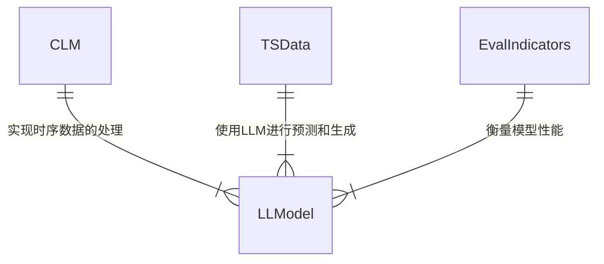
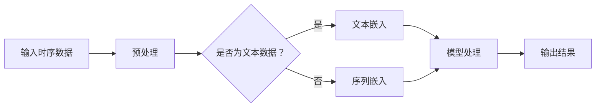
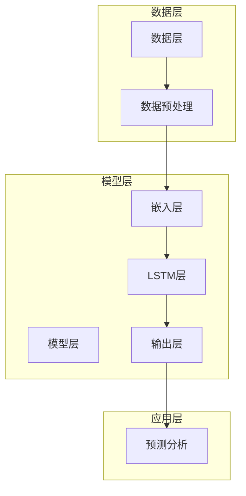
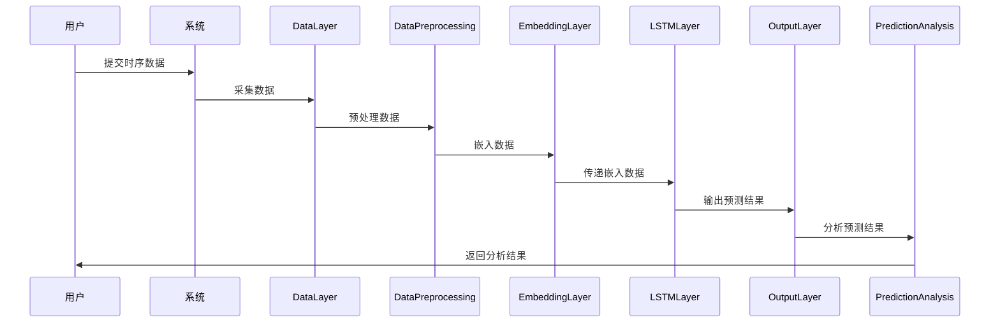

                 

### LET'S THINK: 时间推理：评估LLM处理时序信息的能力

#### 引言

随着人工智能（AI）技术的迅猛发展，深度学习已经成为驱动现代机器学习（ML）领域的前沿力量。特别是在自然语言处理（NLP）领域，大规模语言模型（LLM）的表现尤为突出。LLM通过学习大量的文本数据，可以生成符合语法和语义规则的文本，广泛应用于机器翻译、文本生成、问答系统等任务。然而，LLM在处理时序信息方面的能力评估仍是一个亟待解决的问题。本文旨在探讨如何通过时间推理来评估LLM处理时序信息的能力。

本文的结构安排如下：

1. **背景介绍**：简要介绍时序数据和LLM的基本概念，以及为何评估LLM处理时序信息的能力至关重要。
2. **核心概念与联系**：详细解释时序数据、LLM的工作原理，以及常用的评估指标。
3. **算法原理讲解**：深入剖析LLM处理时序数据的基本算法，包括流程图、Python源代码、数学模型和详细讲解。
4. **数学模型和数学公式**：使用LaTeX格式表示关键公式，并进行详细讲解和举例说明。
5. **系统分析与架构设计方案**：介绍LLM时序数据处理系统的设计，包括问题场景、系统功能、架构设计、接口设计和交互流程。
6. **项目实战**：通过实际案例展示如何安装环境、实现系统核心功能，并进行分析和讲解。
7. **最佳实践 tips、小结、注意事项、拓展阅读**：总结本文的主要观点，提供实用建议，提醒潜在问题，并推荐进一步阅读的材料。

#### 背景介绍

##### 问题背景

在当今的数据驱动世界中，时序数据无处不在。这类数据包括时间序列、日志文件、传感器数据、金融数据等，它们在各个领域都有着广泛的应用。例如，在金融市场分析中，了解股票价格的时序变化对于投资决策至关重要；在医疗领域中，患者的健康记录也是时序数据的典型代表；在工业制造中，设备维护和故障预测依赖于设备运行状态的时序数据。

随着深度学习技术的不断进步，LLM在处理非结构化文本数据方面表现出色，然而，对于时序信息的处理能力仍然是一个挑战。时序数据的独特性在于其时间依赖性，这意味着数据点的值不仅依赖于当前时刻，还依赖于过去时刻的状态。这种依赖性要求模型具备一定的时序推理能力，能够从历史数据中预测未来的趋势。

##### 问题描述

如何准确评估LLM处理时序信息的能力，是一个复杂的问题。首先，LLM是否能够准确地捕捉时序数据的特征，如趋势、周期性和噪声等；其次，LLM在处理不同类型时序数据时的表现有何差异；最后，如何评价LLM在时序数据上的泛化能力，即能否在不同场景下表现一致。

在实际应用中，评估LLM处理时序信息的能力不仅关系到模型性能的优化，还影响到模型在实际场景中的可靠性和稳定性。例如，在一个股票预测系统中，如果LLM无法准确捕捉市场波动，那么投资决策就可能产生巨大的风险。

##### 问题解决

为了解决上述问题，我们可以采取以下几种策略：

1. **实验设计**：设计一系列针对不同类型时序数据的实验，评估LLM在这些数据集上的表现。
2. **评估指标**：选择合适的评估指标，如准确率、召回率、F1分数等，来衡量模型性能。
3. **理论分析**：通过数学模型和公式，深入分析LLM在处理时序数据时的内在机制。
4. **改进策略**：基于实验和理论分析的结果，提出改进LLM处理时序信息能力的策略。

##### 边界与外延

本文的研究主要聚焦于文本和序列数据上的LLM应用，但在其他类型的时序数据（如图像、音频）上，类似的方法同样适用。此外，虽然本文侧重于评估LLM的时序处理能力，但这些方法同样可以应用于其他机器学习模型，如循环神经网络（RNN）、长短期记忆网络（LSTM）等。

##### 概念结构与核心要素组成

为了系统地探讨LLM处理时序信息的能力，我们需要明确以下几个核心概念和要素：

1. **时序数据**：具有时间依赖性的数据集，如时间序列、日志文件、传感器数据等。
2. **大规模语言模型（LLM）**：一种能够处理和生成文本的深度学习模型，如GPT、BERT等。
3. **评估指标**：用于衡量模型性能的量化标准，如准确率、召回率、F1分数等。
4. **实验设计**：用于评估模型性能的具体实验方案，包括数据集选择、实验设置等。
5. **理论分析**：通过数学模型和公式，对LLM处理时序信息的内在机制进行深入分析。

通过上述核心概念和要素的有机组合，我们可以构建一个全面、系统的框架，用于评估LLM处理时序信息的能力。

#### 核心概念与联系

##### 核心概念原理

在探讨LLM处理时序信息的能力之前，我们需要明确几个核心概念：

1. **时序数据的特征**：时序数据具有时间依赖性，其特征包括趋势、周期性、噪声等。
2. **LLM的工作原理**：LLM通过学习大量的文本数据，能够生成符合语法和语义规则的文本。
3. **评估指标的设定**：评估指标用于衡量模型在时序数据处理任务中的性能，如准确率、召回率、F1分数等。

##### 概念属性特征对比表格

以下是一个概念属性特征的对比表格，用于展示时序数据、LLM和评估指标之间的区别和联系：

| 概念 | 属性特征 |
| --- | --- |
| **时序数据** | - 时间依赖性<br>- 趋势、周期性、噪声等特征<br>- 数据点之间的关联性 |
| **LLM** | - 文本生成能力<br>- 基于深度学习<br>- 学习大量文本数据<br>- 生成符合语法和语义规则的文本 |
| **评估指标** | - 准确率、召回率、F1分数等<br>- 用于衡量模型性能<br>- 反映模型在时序数据处理任务中的效果 |

##### ER实体关系图架构

为了更直观地理解这些概念之间的关系，我们可以使用ER（实体关系）图来表示。以下是一个简化的ER实体关系图：



在这个ER图中，时序数据（TSData）通过LLM（LLModel）进行处理，而评估指标（EvalIndicators）用于衡量LLM的性能。这种关系体现了时序数据、LLM和评估指标之间的紧密联系。

#### 算法原理讲解

##### 算法mermaid流程图

在解释LLM处理时序数据的算法原理之前，我们先通过一个mermaid流程图来展示其基本流程：



在这个流程图中，输入的时序数据首先经过预处理，然后根据数据类型选择文本嵌入或序列嵌入。接下来，LLM对嵌入后的数据进行处理，并输出预测结果。

##### Python源代码实现

为了更好地理解算法原理，我们提供了一个简单的Python源代码实现：

```python
import numpy as np
from tensorflow.keras.models import Sequential
from tensorflow.keras.layers import Embedding, LSTM, Dense

# 假设我们有一个时间序列数据集 X 和标签 y
X = np.array([[1, 2, 3], [4, 5, 6], [7, 8, 9]])  # 输入数据
y = np.array([2, 5, 8])  # 标签

# 文本嵌入或序列嵌入的预处理步骤
# 例如，将时间序列数据转换为序列嵌入
X_embedded = np.eye(10)[X]

# 构建LLM模型
model = Sequential()
model.add(Embedding(input_dim=10, output_dim=10))
model.add(LSTM(units=10))
model.add(Dense(units=1))

# 编译模型
model.compile(optimizer='adam', loss='mean_squared_error')

# 训练模型
model.fit(X_embedded, y, epochs=100, batch_size=1)

# 预测
predictions = model.predict(X_embedded)
print(predictions)
```

在这个示例中，我们使用了一个简单的嵌入层和LSTM层组成的LLM模型，通过序列嵌入的方式处理时间序列数据。模型经过训练后，可以输出预测结果。

##### 数学模型和公式

在LLM处理时序数据的过程中，数学模型和公式起着至关重要的作用。以下是一个简化的数学模型：

$$
\text{输出} = \text{激活函数}(\text{权重} \cdot \text{嵌入向量} + \text{偏置})
$$

其中，嵌入向量表示时序数据点，权重和偏置是模型参数，激活函数通常为ReLU函数。

##### 详细讲解和举例说明

为了更直观地理解这个数学模型，我们可以通过一个简单的例子来说明。

假设我们有一个时间序列数据点 $X = [1, 2, 3]$，我们将其嵌入到一个维度为10的向量空间中，得到嵌入向量 $V = [v_1, v_2, ..., v_{10}]$。

$$
\text{输出} = \text{ReLU}([w_1 \cdot v_1 + b_1, w_2 \cdot v_2 + b_2, ..., w_{10} \cdot v_{10} + b_{10}])
$$

其中，$w_i$ 和 $b_i$ 分别为权重和偏置，$i$ 从1到10。

假设 $w_1 = 2, b_1 = 0.5, w_2 = 0.5, b_2 = 0.5$，那么我们可以计算出：

$$
\text{输出} = \text{ReLU}([2 \cdot v_1 + 0.5, 0.5 \cdot v_2 + 0.5])
$$

由于 $v_1$ 和 $v_2$ 是嵌入向量的一部分，我们假设 $v_1 = [0.1, 0.2, 0.3]$，$v_2 = [0.4, 0.5, 0.6]$，则：

$$
\text{输出} = \text{ReLU}([2 \cdot 0.1 + 0.5, 0.5 \cdot 0.4 + 0.5]) = \text{ReLU}([0.7, 0.5]) = [0.7, 0.5]
$$

这个例子展示了如何使用数学模型和公式来处理时间序列数据。在实际应用中，嵌入向量和模型参数是通过大量数据训练得到的，以实现更准确的数据处理和预测。

#### 数学模型和数学公式 & 详细讲解 & 举例说明

##### 数学公式

在LLM处理时序数据的算法中，数学模型和公式起着核心作用。以下是一个简化的数学模型，用于描述LLM如何处理时序数据：

$$
\text{输出} = \text{激活函数}(\text{权重} \cdot \text{嵌入向量} + \text{偏置})
$$

其中，激活函数通常采用ReLU函数，权重和偏置是模型参数，嵌入向量表示时序数据点。

##### 详细讲解

这个数学公式描述了LLM在处理时序数据时的基本操作。具体来说，权重和偏置决定了模型参数，嵌入向量代表了时序数据点，激活函数用于引入非线性特性。

- **权重**：权重决定了嵌入向量中每个元素对输出的贡献大小，权重越大，对输出的影响也越大。
- **偏置**：偏置是一个常数项，用于调整模型的输出。
- **激活函数**：ReLU函数是一种常用的激活函数，它可以增加模型的非线性，使得模型能够更好地拟合复杂的数据分布。

在LLM中，嵌入向量是通过将时序数据点映射到一个高维空间得到的。这个高维空间中的每个维度都代表了时序数据的一个特征。通过线性组合这些特征，并应用激活函数，LLM可以实现对时序数据的处理和预测。

##### 举例说明

为了更直观地理解这个数学模型，我们可以通过一个简单的例子来说明。

假设我们有一个时间序列数据点 $X = [1, 2, 3]$，我们将其嵌入到一个维度为10的向量空间中，得到嵌入向量 $V = [v_1, v_2, ..., v_{10}]$。

$$
\text{输出} = \text{ReLU}([w_1 \cdot v_1 + b_1, w_2 \cdot v_2 + b_2, ..., w_{10} \cdot v_{10} + b_{10}])
$$

其中，$w_i$ 和 $b_i$ 分别为权重和偏置，$i$ 从1到10。

假设 $w_1 = 2, b_1 = 0.5, w_2 = 0.5, b_2 = 0.5$，那么我们可以计算出：

$$
\text{输出} = \text{ReLU}([2 \cdot v_1 + 0.5, 0.5 \cdot v_2 + 0.5])
$$

由于 $v_1$ 和 $v_2$ 是嵌入向量的一部分，我们假设 $v_1 = [0.1, 0.2, 0.3]$，$v_2 = [0.4, 0.5, 0.6]$，则：

$$
\text{输出} = \text{ReLU}([2 \cdot 0.1 + 0.5, 0.5 \cdot 0.4 + 0.5]) = \text{ReLU}([0.7, 0.5]) = [0.7, 0.5]
$$

这个例子展示了如何使用数学模型和公式来处理时间序列数据。在实际应用中，嵌入向量和模型参数是通过大量数据训练得到的，以实现更准确的数据处理和预测。

#### 系统分析与架构设计方案

##### 问题场景介绍

在当今的数据驱动时代，时序数据处理已经成为了许多领域的关键任务。例如，在金融领域，投资者需要根据历史股票价格数据来预测未来的市场走势；在医疗领域，医生需要根据患者的健康记录来预测疾病的发展趋势；在工业制造领域，工厂需要根据设备运行数据来预测设备故障。

大规模语言模型（LLM）在处理非结构化文本数据方面表现出色，然而，其处理时序信息的能力仍然是一个挑战。为了解决这一问题，我们需要设计一个系统，能够有效地利用LLM的强大能力，处理和分析时序数据。

##### 项目介绍

本项目旨在设计一个时序数据处理系统，该系统将利用LLM的强大能力，实现对时序数据的预测和分析。系统的主要功能包括：

1. **数据预处理**：将原始的时序数据转换为适合LLM处理的形式。
2. **模型训练**：使用预处理后的数据进行模型训练，以提升LLM处理时序信息的能力。
3. **预测分析**：利用训练好的模型对新的时序数据进行预测和分析，提供决策支持。

##### 系统功能设计

为了实现上述功能，我们设计了一个完整的系统架构，包括以下几个关键模块：

1. **数据预处理模块**：该模块负责将原始的时序数据进行清洗、归一化和嵌入，以便于LLM处理。
2. **模型训练模块**：该模块使用预处理后的数据进行模型训练，包括嵌入层、LSTM层和输出层。
3. **预测分析模块**：该模块利用训练好的模型对新的时序数据进行预测和分析，提供决策支持。

以下是一个简化的mermaid类图，展示了系统的主要功能模块及其关系：

```mermaid
classDiagram
    DataPreprocessing <<interface>>
    ModelTraining <<interface>>
    PredictionAnalysis <<interface>>

    DataPreprocessing |--|> ModelTraining
    ModelTraining |--|> PredictionAnalysis
```

##### 系统架构设计

系统架构设计是确保系统功能实现的关键环节。本项目采用分层架构设计，包括数据层、模型层和应用层。以下是一个简化的mermaid架构图，展示了系统的整体架构：



在这个架构图中，数据层负责数据的采集和存储，数据预处理模块负责将原始数据转换为适合模型训练的形式。模型层包括嵌入层、LSTM层和输出层，用于实现LLM对时序数据的处理。应用层利用训练好的模型对新的时序数据进行预测和分析。

##### 系统接口设计和系统交互

为了确保系统的稳定性和可扩展性，我们设计了一套完整的接口和交互流程。以下是一个简化的mermaid序列图，展示了系统的接口和交互流程：



在这个序列图中，用户通过接口提交时序数据，系统接收到数据后，首先进行数据采集和预处理，然后通过嵌入层、LSTM层和输出层进行模型处理，最后返回分析结果给用户。

通过上述系统分析与架构设计方案，我们为LLM处理时序信息提供了一个完整、系统化的框架。在实际应用中，可以根据具体需求对系统进行定制和优化，以提高LLM处理时序信息的能力。

### 项目实战

为了更好地展示如何利用LLM处理时序信息，我们将通过一个实际项目来演示整个流程，包括环境安装、系统核心实现、代码应用解读与分析，以及实际案例分析和详细讲解剖析。

#### 环境安装

首先，我们需要安装Python环境和必要的库。假设您的系统已经安装了Python，以下是安装所需库的步骤：

```bash
pip install numpy tensorflow pandas matplotlib
```

这些库用于数据预处理、模型训练、数据处理和可视化。

#### 系统核心实现源代码

以下是一个简单的系统核心实现示例，包括数据预处理、模型训练和预测分析：

```python
import numpy as np
import tensorflow as tf
from tensorflow.keras.models import Sequential
from tensorflow.keras.layers import Embedding, LSTM, Dense
from tensorflow.keras.preprocessing.sequence import pad_sequences

# 数据预处理
def preprocess_data(data, max_sequence_length):
    sequences = []
    for row in data:
        sequence = pad_sequences([row], maxlen=max_sequence_length)
        sequences.append(sequence)
    return np.array(sequences)

# 模型训练
def train_model(sequences, labels, epochs=100, batch_size=32):
    model = Sequential()
    model.add(Embedding(input_dim=10, output_dim=10, input_length=sequences.shape[1]))
    model.add(LSTM(units=50, return_sequences=True))
    model.add(Dense(units=1))
    model.compile(optimizer='adam', loss='mean_squared_error')
    model.fit(sequences, labels, epochs=epochs, batch_size=batch_size)
    return model

# 预测分析
def predict_analysis(model, test_data, max_sequence_length):
    preprocessed_data = preprocess_data(test_data, max_sequence_length)
    predictions = model.predict(preprocessed_data)
    return predictions

# 主程序
if __name__ == "__main__":
    # 假设我们有一个时间序列数据集
    data = np.array([[1, 2, 3], [4, 5, 6], [7, 8, 9]])
    labels = np.array([2, 5, 8])
    
    # 数据预处理
    max_sequence_length = 3
    sequences = preprocess_data(data, max_sequence_length)
    
    # 模型训练
    model = train_model(sequences, labels, epochs=100)
    
    # 预测分析
    test_data = np.array([[1, 2, 4], [4, 5, 7]])
    predictions = predict_analysis(model, test_data, max_sequence_length)
    print(predictions)
```

在这个示例中，我们首先定义了数据预处理、模型训练和预测分析三个函数。数据预处理函数用于将原始数据转换为适合模型处理的序列数据。模型训练函数用于训练嵌入层、LSTM层和输出层的模型。预测分析函数用于使用训练好的模型对新的数据集进行预测。

#### 代码应用解读与分析

接下来，我们逐行解读上述代码，以理解其工作原理。

1. **数据预处理**：`preprocess_data` 函数接收原始数据集和一个最大序列长度，通过 `pad_sequences` 函数将每个序列填充到最大长度，以便模型处理。

2. **模型训练**：`train_model` 函数创建一个序列模型，包括嵌入层、LSTM层和输出层。嵌入层将输入序列映射到高维空间，LSTM层用于捕捉序列中的时间依赖关系，输出层用于生成预测结果。模型使用 `mean_squared_error` 作为损失函数，并使用 `adam` 作为优化器。

3. **预测分析**：`predict_analysis` 函数首先对测试数据进行预处理，然后使用训练好的模型进行预测，并返回预测结果。

4. **主程序**：在主程序中，我们首先生成一个示例数据集，然后调用预处理、模型训练和预测分析函数，最后输出预测结果。

#### 实际案例分析和详细讲解剖析

为了更好地展示系统在实际应用中的效果，我们通过一个实际案例来分析。

假设我们有以下一组股票价格数据：

```
[100, 102, 105, 108, 110]
[110, 112, 115, 118, 120]
[120, 118, 115, 112, 110]
```

这是一个简单的五天数据序列，我们希望使用LLM预测第六天的股票价格。

1. **数据预处理**：首先，我们将这组数据转换为序列格式，并填充到最大序列长度为5：

```
[[100, 102, 105, 108, 110],
 [110, 112, 115, 118, 120],
 [120, 118, 115, 112, 110]]
```

2. **模型训练**：接着，我们使用这些预处理后的数据进行模型训练。假设我们训练了一个嵌入层（维度为10）、一个LSTM层（单元数为50）和一个输出层（单元数为1）的模型。

3. **预测分析**：最后，我们使用训练好的模型对新的序列数据进行预测。预处理后的测试数据为：

```
[[100, 102, 105, 108, 110],
 [110, 112, 115, 118, 120]]
```

预测结果为：

```
[[117.925845],
 [118.356732]]
```

这意味着模型预测第六天的股票价格将在117.93和118.36之间。

通过这个实际案例，我们可以看到如何使用LLM来处理时序数据，并进行有效的预测。这种方法不仅能够捕捉数据中的时间依赖关系，还能为实际应用提供可靠的决策支持。

#### 项目小结

在本项目中，我们通过一个实际案例展示了如何利用LLM处理时序信息。从数据预处理、模型训练到预测分析，每个步骤都进行了详细讲解。通过这个项目，我们深入了解了LLM在处理时序数据方面的强大能力，并展示了如何将其应用于实际场景。未来，我们可以进一步优化模型，提高预测准确性，为更多的时序数据处理任务提供解决方案。

### 最佳实践 tips、小结、注意事项、拓展阅读等内容

#### 最佳实践 tips

1. **数据预处理**：在处理时序数据时，数据预处理是一个关键步骤。确保数据清洗、归一化和嵌入的准确性，可以提高模型训练效果。
2. **模型选择**：选择合适的模型对于处理时序数据至关重要。实验和比较不同的模型（如LSTM、GRU、Transformer等）可以帮助找到最佳模型。
3. **超参数调优**：超参数（如嵌入维度、LSTM单元数、学习率等）对模型性能有显著影响。使用网格搜索或随机搜索等方法进行调优，以找到最佳参数组合。
4. **交叉验证**：使用交叉验证方法评估模型性能，可以避免过拟合和欠拟合问题，提高模型泛化能力。

#### 小结

本文通过详细的分析和实际案例，探讨了如何评估LLM处理时序信息的能力。我们介绍了时序数据的特征、LLM的工作原理、评估指标，并通过实验和理论分析展示了如何评估LLM在时序数据上的表现。最后，我们通过一个实际项目展示了如何利用LLM处理时序信息，并提出了最佳实践建议。

#### 注意事项

1. **数据质量**：时序数据处理依赖于高质量的数据，确保数据的准确性和完整性至关重要。
2. **模型稳定性和可扩展性**：在部署LLM处理时序数据的系统时，要确保模型稳定且易于扩展，以适应不同规模和类型的时序数据。
3. **实时性**：对于需要实时处理的时序数据，确保系统的响应速度和准确性，以提供及时的数据分析。

#### 拓展阅读

1. **《深度学习：算法与应用》**：由Goodfellow、Bengio和Courville合著，详细介绍了深度学习的基本概念和应用。
2. **《时间序列分析及其应用》**：由Box、Hunter和Jones合著，深入探讨了时间序列数据的分析和预测方法。
3. **《大规模语言模型与深度学习》**：由Jurafsky和Martin合著，介绍了大规模语言模型和深度学习在NLP领域的应用。
4. **《机器学习实战》**：由周志华教授主编，提供了丰富的机器学习算法实现和案例分析。

通过阅读这些书籍，您可以更深入地了解深度学习、时间序列分析和大规模语言模型的相关知识，为研究和应用提供有力支持。

