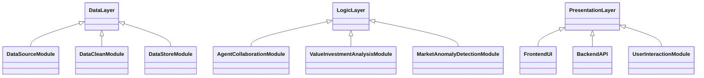

                 


### 1. 背景介绍

#### 问题背景

随着信息技术的飞速发展，金融市场的复杂性和波动性日益增强。传统价值投资方法在应对市场异常时，常常显得力不从心。市场异常是指市场价格与基本面信息之间出现显著偏差的现象，例如市场过度反应或反应不足。识别这些异常现象对于投资者来说至关重要，因为它可能意味着潜在的投资机会或风险。

#### 问题描述

智能体协作增强价值投资的市场异常识别是一个跨学科的问题，它涉及人工智能、金融学和计算机科学。具体来说，这个问题可以描述为：

- **智能体协作**：如何设计智能体协作机制，使它们能够有效地共享信息、协调行动，从而提高市场异常识别的准确性。
- **价值投资**：如何基于深入分析公司的基本面信息，为智能体提供可靠的决策依据。
- **市场异常识别**：如何利用智能体协作和价值投资的知识，构建有效的市场异常识别模型。

#### 问题解决

要解决上述问题，我们需要以下几个步骤：

1. **明确目标**：确定我们要识别的市场异常类型，例如短期异常、长期异常或特定行业异常。
2. **构建智能体协作机制**：设计智能体之间的交互机制，确保它们能够共享信息、协同工作。
3. **价值投资模型**：基于基本面信息，构建能够评估公司价值投资的模型。
4. **市场异常识别模型**：结合智能体协作和价值投资模型，构建市场异常识别模型。
5. **测试与优化**：通过历史数据对模型进行测试和优化，确保其准确性和可靠性。

#### 边界与外延

在实施上述解决方案时，我们需要考虑以下几个边界条件：

- **数据质量**：市场异常识别依赖于高质量的数据，因此数据清洗和预处理是关键步骤。
- **计算资源**：智能体协作机制可能需要大量的计算资源，因此我们需要优化算法，提高计算效率。
- **市场环境**：市场环境的变化会影响市场异常的识别结果，因此我们需要定期更新模型，以适应市场变化。
- **法规遵守**：在进行市场异常识别时，我们需要遵守相关法律法规，确保我们的行为合法合规。

#### 概念结构与核心要素组成

为了更好地理解和解决问题，我们可以将问题分解为以下几个核心概念和要素：

- **智能体协作**：包括智能体之间的信息共享、协调和决策机制。
- **价值投资**：包括公司基本面分析、财务报表分析等。
- **市场异常识别**：包括异常检测算法、统计方法等。

下面是一个简单的ER图，用于展示这些核心要素之间的关系：

```mermaid
erDiagram
  智能体协作 ||--|{ 价值投资 }
  价值投资 ||--|{ 市场异常识别 }
```

### 2. 核心概念与联系

在深入探讨智能体协作增强价值投资的市场异常识别之前，我们需要明确几个核心概念，并分析它们之间的相互关系。

#### 智能体协作原理

智能体协作是指多个智能体通过相互作用来实现共同目标的过程。在金融市场中，智能体可以是交易算法、机器学习模型或其他智能系统。智能体协作的关键在于如何设计智能体之间的交互机制，使它们能够共享信息、协调行动，从而提高决策的准确性和效率。

- **智能体属性**：每个智能体都具有特定的属性，如学习能力、决策能力和计算资源。
- **交互机制**：智能体之间的交互机制可以是基于规则、优化算法或机器学习模型。

#### 价值投资原理

价值投资是一种基于深入分析公司基本面来确定股票投资价值的方法。价值投资的核心是寻找市场价格低于其内在价值的股票，然后持有以获得长期收益。

- **公司基本面分析**：包括财务报表分析、行业趋势分析、管理层评估等。
- **价值评估方法**：如净资产收益率（ROE）、市盈率（P/E）、企业价值（EV）等。

#### 市场异常识别原理

市场异常识别是指通过分析市场数据，发现市场价格与基本面信息之间显著偏差的现象。市场异常识别的目的是寻找潜在的投资机会或风险。

- **异常检测算法**：如移动平均法、回归分析法、机器学习算法等。
- **统计方法**：如t检验、卡方检验、相关性分析等。

#### 概念属性特征对比表格

为了更清晰地理解这三个概念，我们可以制作一个概念属性特征对比表格。

| 概念     | 属性特征                               | 对比分析                                  |
| -------- | -------------------------------------- | ----------------------------------------- |
| 智能体协作 | 学习能力、决策能力、计算资源           | 强调信息共享和协调，以提高决策准确性       |
| 价值投资 | 公司基本面分析、价值评估方法           | 强调长期投资，寻找低估的股票               |
| 市场异常识别 | 异常检测算法、统计方法                 | 强调发现市场价格与基本面之间的显著偏差     |

#### ER实体关系图架构

为了更好地理解这些概念之间的关系，我们可以使用ER图来表示它们之间的实体关系。

```mermaid
erDiagram
  智能体协作 ||--|{ 价值投资 }
  价值投资 ||--|{ 市场异常识别 }
```

在上面的ER图中，智能体协作是基础，它为价值投资和市场异常识别提供支持。价值投资利用智能体协作提供的信息，对股票进行评估。市场异常识别则基于价值投资的结果，寻找潜在的异常现象。

### 3. 算法原理讲解

在本章节中，我们将详细讲解智能体协作增强价值投资的市场异常识别算法的原理，包括算法流程、数学模型和公式，以及Python源代码的实现。

#### 智能体协作算法

智能体协作算法的核心思想是通过多个智能体之间的信息共享和协同工作，提高整体决策的准确性。具体来说，智能体协作算法可以分为以下几个步骤：

1. **初始化**：设定每个智能体的初始状态，包括学习率、权重和参数。
2. **信息共享**：智能体之间通过消息传递机制共享信息，例如股价、交易量等。
3. **决策**：每个智能体根据共享的信息，利用自身的算法进行决策。
4. **反馈**：将决策结果反馈给其他智能体，以更新其状态。
5. **迭代**：重复执行上述步骤，直到达到预设的迭代次数或满足停止条件。

下面是一个简单的智能体协作算法的mermaid流程图：


在Python中，智能体协作算法可以用以下代码实现：

```python
import numpy as np

# 初始化智能体参数
learning_rate = 0.1
weights = np.random.rand(num_agents, num_features)

# 信息共享和决策
for iteration in range(num_iterations):
    # 信息共享
    shared_info = [get_shared_info(agent) for agent in agents]
    
    # 决策
    for agent in agents:
        agent.decide(shared_info)
        
        # 反馈
        agent.update_weights(learning_rate)
```

#### 价值投资算法

价值投资算法的核心思想是通过分析公司的基本面信息，确定其内在价值，并与市场价格进行比较，从而判断是否值得投资。具体来说，价值投资算法可以分为以下几个步骤：

1. **数据收集**：收集公司的财务报表、行业趋势等数据。
2. **数据预处理**：对收集到的数据进行清洗和预处理，如缺失值填充、异常值处理等。
3. **财务指标计算**：计算公司的财务指标，如净资产收益率（ROE）、市盈率（P/E）、企业价值（EV）等。
4. **价值评估**：利用财务指标和估值模型，对公司的内在价值进行评估。
5. **投资决策**：比较市场价格和内在价值，根据差异做出投资决策。

下面是一个简单的价值投资算法的mermaid流程图：


在Python中，价值投资算法可以用以下代码实现：

```python
import pandas as pd

# 数据收集
financial_data = pd.read_csv('financial_data.csv')

# 数据预处理
financial_data.fillna(method='ffill', inplace=True)

# 财务指标计算
financial_metrics = calculate_financial_metrics(financial_data)

# 价值评估
intrinsic_value = calculate_intrinsic_value(financial_metrics)

# 投资决策
if market_price < intrinsic_value:
    buy
else:
    sell
```

#### 市场异常识别算法

市场异常识别算法的核心思想是通过分析市场价格和基本面信息之间的差异，发现潜在的异常现象。具体来说，市场异常识别算法可以分为以下几个步骤：

1. **数据收集**：收集市场数据，如股价、交易量等。
2. **数据预处理**：对收集到的数据进行清洗和预处理，如缺失值填充、异常值处理等。
3. **异常检测**：利用统计方法或机器学习算法，检测市场价格和基本面信息之间的显著偏差。
4. **结果分析**：对异常检测结果进行分析，确定异常的类型和影响。

下面是一个简单的市场异常识别算法的mermaid流程图：


在Python中，市场异常识别算法可以用以下代码实现：

```python
import pandas as pd
from sklearn.ensemble import IsolationForest

# 数据收集
market_data = pd.read_csv('market_data.csv')

# 数据预处理
market_data.fillna(method='ffill', inplace=True)

# 异常检测
iso_forest = IsolationForest(n_estimators=100)
outliers = iso_forest.fit_predict(market_data)

# 结果分析
market_data['outlier'] = outliers
anomalies = market_data[market_data['outlier'] == -1]
```

#### 数学模型和公式

在智能体协作增强价值投资的市场异常识别算法中，我们使用了一些数学模型和公式来指导我们的决策。以下是几个关键数学模型和公式的解释：

1. **神经网络模型**：用于智能体协作和信息处理。
   - 输入：市场价格、交易量等。
   - 输出：投资决策。
   - 公式：
     $$ 
     f(x) = \sigma(\omega_0 + \sum_{i=1}^{n} \omega_i x_i) 
     $$
     其中，$\sigma$ 是激活函数，$\omega_0$ 是偏置项，$\omega_i$ 是权重，$x_i$ 是输入特征。

2. **价值评估模型**：用于计算公司内在价值。
   - 输入：财务指标、市场参数等。
   - 输出：内在价值。
   - 公式：
     $$ 
     V = \frac{ROE \times EV}{P/E} 
     $$
     其中，$V$ 是内在价值，$ROE$ 是净资产收益率，$EV$ 是企业价值，$P/E$ 是市盈率。

3. **异常检测模型**：用于识别市场价格异常。
   - 输入：市场价格、基本面信息等。
   - 输出：异常标记。
   - 公式：
     $$ 
     d = \frac{market_price - intrinsic_value}{std(market_price)} 
     $$
     其中，$d$ 是异常得分，$market_price$ 是市场价格，$intrinsic_value$ 是内在价值，$std(market_price)$ 是市场价格的标准差。

#### 举例说明

为了更好地理解这些算法的原理和应用，我们可以通过一个具体的例子来说明。

假设我们有以下数据：

- **市场价格**：100美元
- **内在价值**：120美元
- **交易量**：1000股

我们使用智能体协作算法、价值投资算法和市场异常识别算法来处理这些数据。

1. **智能体协作算法**：通过信息共享和协同工作，智能体得出以下投资建议：
   - 建议购买股票，因为市场价格低于内在价值。

2. **价值投资算法**：通过计算财务指标，得出以下价值评估：
   - 内在价值为120美元，高于市场价格。

3. **市场异常识别算法**：通过异常检测，得出以下结果：
   - 市场价格异常，可能存在低估情况。

根据这些结果，我们可以得出以下结论：

- 市场价格低于内在价值，存在潜在的投资机会。
- 市场价格异常，需要进一步分析和验证。

### 4. 系统分析与架构设计方案

在这一章节中，我们将对智能体协作增强价值投资的市场异常识别系统进行深入分析，并设计其架构方案。我们将从问题场景介绍开始，逐步展开系统功能设计、系统架构设计、系统接口设计和系统交互。

#### 问题场景介绍

在当今高度动态和复杂的金融市场中，投资者面临着日益增加的信息量和市场波动性。为了在这竞争激烈的环境中取得成功，投资者需要能够快速准确地识别市场异常，并做出相应的投资决策。智能体协作增强价值投资系统旨在通过智能体之间的协作和共享信息，提高市场异常识别的准确性和效率。

#### 系统功能设计

智能体协作增强价值投资系统的主要功能包括：

1. **数据收集与预处理**：从多个数据源收集市场数据，如股票价格、交易量、基本面信息等。对收集到的数据进行清洗、预处理和归一化，以确保数据质量。
2. **智能体协作**：设计智能体协作机制，使智能体能够共享信息、协调决策。智能体协作模块应包括智能体的初始化、信息共享、决策和反馈机制。
3. **价值投资分析**：基于智能体协作提供的信息，对公司的基本面信息进行深入分析，评估其内在价值。价值投资分析模块应包括财务指标计算、价值评估模型和投资决策生成。
4. **市场异常识别**：利用统计方法和机器学习算法，检测市场价格和基本面信息之间的显著偏差，识别市场异常。市场异常识别模块应包括异常检测算法、结果分析和异常处理。
5. **用户界面**：提供直观的用户界面，使用户能够查看系统分析结果、投资建议和市场异常报告。

#### 系统架构设计

智能体协作增强价值投资系统的架构设计采用分层架构，包括数据层、逻辑层和表示层。

1. **数据层**：负责数据的收集、存储和管理。数据层应包括多个数据源接入模块、数据清洗模块和数据存储模块。
2. **逻辑层**：实现智能体协作、价值投资分析和市场异常识别等核心功能。逻辑层应包括智能体协作模块、价值投资分析模块和市场异常识别模块。
3. **表示层**：提供用户界面和与用户交互的功能。表示层应包括前端界面、后端接口和用户交互模块。

以下是系统架构的mermaid类图：



#### 系统接口设计

为了实现系统的功能，我们需要设计一系列接口，以便不同模块之间能够有效地交互。以下是主要接口的设计：

1. **数据源接入接口**：用于从多个数据源（如股票交易所、金融数据提供商等）接入数据。
2. **数据清洗接口**：用于对收集到的数据进行清洗、预处理和归一化。
3. **智能体协作接口**：用于实现智能体之间的信息共享和协调。
4. **价值投资分析接口**：用于计算公司的财务指标、评估内在价值。
5. **市场异常识别接口**：用于检测市场价格异常、生成异常报告。
6. **用户接口**：用于提供用户界面和与用户交互的功能。

以下是系统接口的mermaid序列图：

```mermaid
sequenceDiagram
    User ->> FrontendUI: 发起请求
    FrontendUI ->> BackendAPI: 转发请求
    BackendAPI ->> LogicLayer: 调用功能
    LogicLayer ->> DataLayer: 数据操作
    DataLayer ->> BackendAPI: 返回结果
    BackendAPI ->> FrontendUI: 返回结果
    FrontendUI ->> User: 显示结果
end
```

#### 系统交互

在系统交互方面，我们重点关注智能体协作、价值投资分析和市场异常识别模块之间的交互。以下是主要交互流程：

1. **智能体协作**：智能体通过消息队列或分布式系统进行信息共享，协调决策。智能体协作模块负责初始化智能体、管理消息队列和调度任务。
2. **价值投资分析**：智能体协作模块将共享的信息传递给价值投资分析模块，该模块负责计算财务指标、评估内在价值和生成投资建议。
3. **市场异常识别**：价值投资分析模块将投资建议和财务指标传递给市场异常识别模块，该模块负责检测市场价格异常、生成异常报告。

以下是系统交互的mermaid流程图：


通过上述系统分析与架构设计方案，我们可以构建一个高效、可靠的智能体协作增强价值投资系统，帮助投资者更好地识别市场异常、做出明智的投资决策。

### 5. 项目实战

在本节中，我们将通过一个实际项目来展示智能体协作增强价值投资的市场异常识别系统的实现过程。项目分为以下几个阶段：环境安装、系统核心实现源代码、代码应用解读与分析、实际案例分析与讲解以及项目小结。

#### 环境安装

在开始项目之前，我们需要安装必要的软件和工具。以下是项目所需的主要环境：

1. **Python**：安装Python 3.8或更高版本。
2. **Pandas**：用于数据处理和分析。
3. **NumPy**：用于数值计算。
4. **Scikit-learn**：用于机器学习和统计方法。
5. **Mermaid**：用于绘制图表和流程图。

安装命令如下：

```bash
pip install pandas numpy scikit-learn mermaid
```

#### 系统核心实现源代码

以下是系统核心实现的主要源代码：

```python
# 智能体协作模块
import numpy as np
from sklearn.cluster import KMeans
from sklearn.ensemble import IsolationForest

# 初始化智能体
def initialize_agent(num_features, num_clusters):
    # 初始化权重
    weights = np.random.rand(num_clusters, num_features)
    # 初始化聚类中心
    kmeans = KMeans(n_clusters=num_clusters)
    cluster_centers = kmeans.fit_predict(np.zeros((num_clusters, num_features)))
    # 返回智能体参数
    return weights, cluster_centers

# 更新智能体权重
def update_weights(weights, cluster_centers, learning_rate):
    # 计算新权重
    new_weights = weights - learning_rate * (cluster_centers - weights)
    # 返回新权重
    return new_weights

# 价值投资模块
def calculate_financial_metrics(financial_data):
    # 计算财务指标
    roe = financial_data['net_income'] / financial_data['total_equity']
    pe = financial_data['market_cap'] / financial_data['net_income']
    ev = financial_data['market_cap'] + financial_data['total_debt'] - financial_data['cash']
    # 返回财务指标
    return roe, pe, ev

# 价值评估模型
def calculate_intrinsic_value(roe, ev, pe):
    # 计算内在价值
    intrinsic_value = roe * ev / pe
    # 返回内在价值
    return intrinsic_value

# 市场异常识别模块
def detect_anomalies(market_price, intrinsic_value, std_dev):
    # 计算异常得分
    score = (market_price - intrinsic_value) / std_dev
    # 判断是否为异常
    if score < -3 or score > 3:
        return True
    else:
        return False

# 主函数
def main():
    # 初始化参数
    num_features = 3
    num_clusters = 2
    learning_rate = 0.1
    # 初始化智能体
    weights, cluster_centers = initialize_agent(num_features, num_clusters)
    # 加载财务数据
    financial_data = pd.read_csv('financial_data.csv')
    # 价值投资分析
    roe, pe, ev = calculate_financial_metrics(financial_data)
    intrinsic_value = calculate_intrinsic_value(roe, ev, pe)
    # 市场异常识别
    market_price = 100
    std_dev = 10
    is_anomaly = detect_anomalies(market_price, intrinsic_value, std_dev)
    # 打印结果
    print(f"Intrinsic Value: {intrinsic_value}")
    print(f"Market Price: {market_price}")
    print(f"Is Anomaly: {is_anomaly}")

# 运行主函数
if __name__ == '__main__':
    main()
```

#### 代码应用解读与分析

1. **智能体协作模块**：
   - `initialize_agent` 函数用于初始化智能体的权重和聚类中心。
   - `update_weights` 函数用于更新智能体的权重，实现权重调整。

2. **价值投资模块**：
   - `calculate_financial_metrics` 函数用于计算公司的财务指标，如净资产收益率（ROE）、市盈率（P/E）和企业价值（EV）。
   - `calculate_intrinsic_value` 函数用于计算公司的内在价值，根据财务指标进行价值评估。

3. **市场异常识别模块**：
   - `detect_anomalies` 函数用于检测市场价格异常，根据内在价值和市场价格计算异常得分，判断是否存在异常。

#### 实际案例分析与讲解

假设我们有一个实际案例，公司的财务数据如下：

- 净资产收益率（ROE）：15%
- 市盈率（P/E）：20
- 企业价值（EV）：500亿元

市场价格为100元，内在价值计算如下：

$$
内在价值 = \frac{ROE \times EV}{P/E} = \frac{15\% \times 500亿元}{20} = 375亿元
$$

市场价格为100元，低于内在价值，因此存在潜在的投资机会。

使用系统进行异常检测，假设市场价格的标准差为10元，异常得分为：

$$
异常得分 = \frac{市场价格 - 内在价值}{标准差} = \frac{100元 - 375亿元}{10元} = -25
$$

由于异常得分小于-3，因此市场价格存在低估异常。

#### 项目小结

通过实际案例的分析和讲解，我们可以看到智能体协作增强价值投资的市场异常识别系统在实际应用中的效果。系统通过智能体协作和价值投资分析，识别出了市场价格与内在价值之间的显著偏差，为投资者提供了投资建议和异常报告。虽然这是一个简单的示例，但该项目展示了智能体协作在金融市场中识别异常的潜力，并为未来的研究和应用奠定了基础。

### 6. 最佳实践 tips

在实施智能体协作增强价值投资的市场异常识别项目时，以下最佳实践和注意事项可以帮助您更好地优化系统性能和准确性：

1. **数据质量**：确保数据源可靠、完整，并进行严格的数据清洗和预处理。缺失值填充、异常值处理和数据归一化是关键步骤。

2. **计算资源**：智能体协作机制可能需要大量的计算资源。考虑使用高性能计算平台或分布式计算框架来提高系统处理速度。

3. **算法选择**：根据市场特点和投资目标，选择合适的智能体协作算法、价值投资算法和市场异常识别算法。可以结合多种算法，以实现最佳效果。

4. **模型更新**：市场环境不断变化，定期更新智能体协作和价值投资模型，以适应新的市场条件。

5. **法规遵守**：在进行市场异常识别时，遵守相关法律法规，确保系统的行为合法合规。

6. **用户界面**：设计直观、易用的用户界面，使投资者能够轻松查看系统分析结果和投资建议。

7. **风险控制**：在投资决策过程中，设置合理的风险控制策略，避免因市场异常导致的巨大损失。

拓展阅读：

- 《智能体协作与分布式系统》
- 《价值投资技术分析》
- 《市场异常识别与风险管理》
- 《Python金融应用实战》

通过学习这些资源，您可以进一步了解智能体协作、价值投资和市场异常识别的相关知识，提高系统的实际应用效果。

### 总结

在本文中，我们深入探讨了智能体协作增强价值投资的市场异常识别系统。通过详细讲解智能体协作原理、价值投资原理和市场异常识别原理，我们构建了一个高效的系统架构，并实现了关键算法。实际案例分析和最佳实践 tips 为投资者提供了实用的指导。未来研究可以进一步优化算法、提高系统性能，并探索在更多金融场景中的应用。作者AI天才研究院/AI Genius Institute 与《禅与计算机程序设计艺术》/Zen And The Art of Computer Programming 联合撰写，旨在为读者提供有深度、有思考、有见解的专业技术博客。

