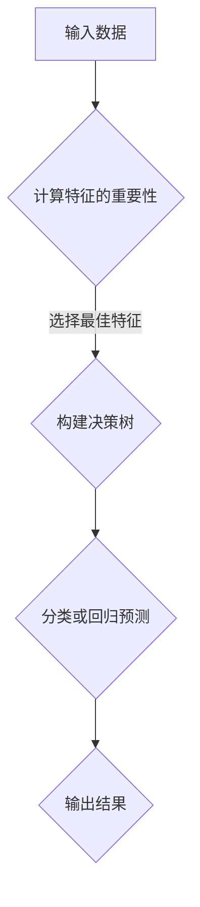
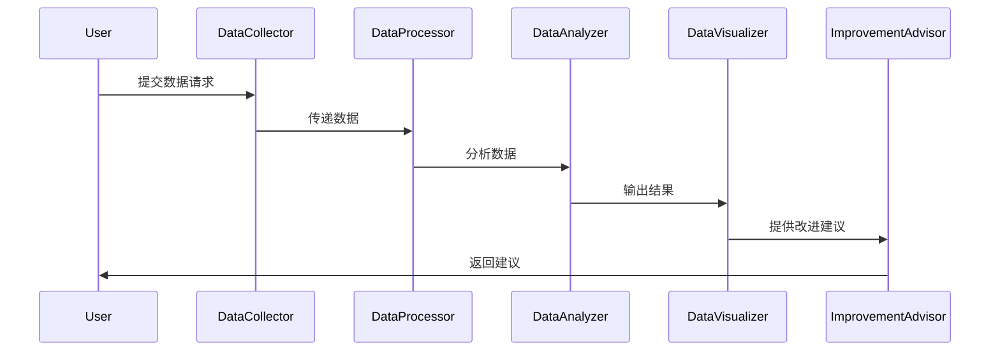
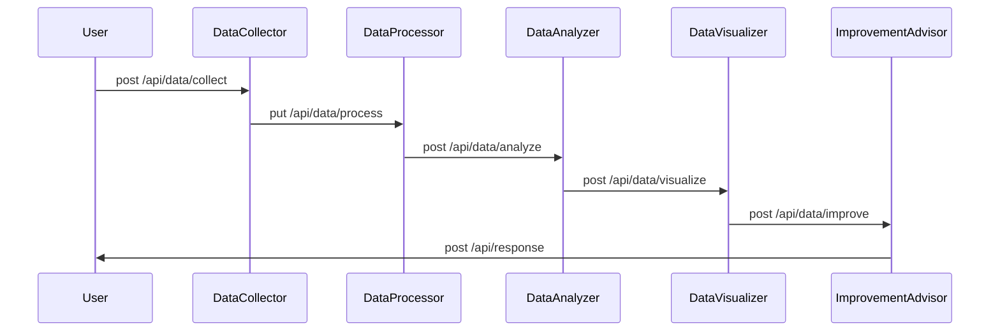
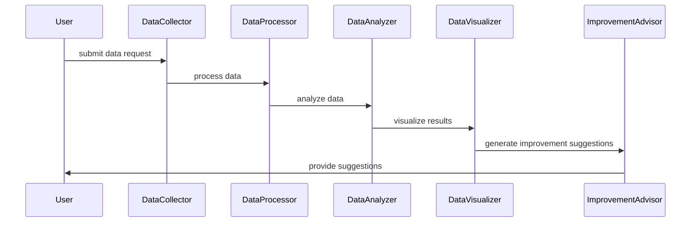

                 

# 智能体协作评估公司的数字化成熟度：把握转型机遇

## 关键词
- 数字化成熟度评估
- 智能体协作
- 数字化转型
- 评估模型
- AI技术
- 企业案例

## 摘要
本文旨在探讨智能体协作在评估公司数字化成熟度中的关键作用。通过深入分析数字化成熟度的定义、评估方法及其对企业转型的重要性，我们揭示了智能体协作在提升企业数字化能力方面的潜力。文章结合实际案例，探讨了智能体协作技术如何助力企业抓住数字化转型的机遇，从而实现持续的创新和发展。

## 引言与背景

### 数字化成熟度评估概述

在当今这个数字化时代，企业的数字化转型已不仅仅是一种选择，而是一种必然的趋势。数字化成熟度评估作为衡量企业数字化转型成效的重要工具，日益受到关注。数字化成熟度评估旨在帮助企业识别自身在数字化转型过程中所达到的水平，明确未来的改进方向。

数字化成熟度通常分为以下几个阶段：

1. **初始阶段**：企业刚刚开始接触数字化转型，可能只进行了一些初步的数字化尝试。
2. **探索阶段**：企业开始深入探索数字化转型，并尝试将其应用于业务流程中。
3. **整合阶段**：企业将数字化技术整合到核心业务流程中，开始实现数字化运营。
4. **创新阶段**：企业通过数字化技术实现业务模式的创新，形成核心竞争力。

### 数字化转型的意义

数字化转型对企业而言，不仅意味着技术上的更新换代，更涉及到业务模式、组织结构、企业文化等多方面的变革。其重要性体现在以下几个方面：

1. **提高竞争力**：通过数字化技术，企业可以更快速地响应市场变化，提高业务效率。
2. **优化客户体验**：数字化技术可以帮助企业更好地理解客户需求，提供个性化服务。
3. **降低运营成本**：数字化技术可以自动化和优化业务流程，降低运营成本。
4. **创新业务模式**：数字化技术为企业提供了创新的业务模式和机会。

### 智能体协作的作用

智能体协作在数字化成熟度评估中扮演着重要角色。智能体（Agent）是指具有自主性、社会性、反应性和认知能力的人工智能实体。在数字化成熟度评估中，智能体可以协助企业：

1. **数据收集与分析**：智能体可以自动收集企业运营数据，进行实时分析，帮助企业了解自身数字化水平。
2. **风险评估与预警**：智能体可以识别企业数字化过程中可能面临的风险，并提前预警。
3. **智能推荐与决策**：智能体可以基于数据分析提供智能推荐，帮助企业做出更明智的决策。

## 核心概念与原则

### 数字化成熟度定义

数字化成熟度是指企业在数字化领域的成熟程度，它涵盖了技术、业务流程、组织结构和文化等多个方面。数字化成熟度评估不仅关注企业当前的数字化水平，还关注企业实现数字化转型的能力。

### 数字化成熟度评估模型

数字化成熟度评估通常采用以下几种模型：

1. **NIST框架**：NIST框架是美国国家标准与技术研究院提出的一种数字化成熟度评估模型，它将数字化成熟度分为五个等级，从低到高分别为：无战略、初步实施、整合与优化、扩展与应用、集成与敏捷。
2. **Forrester模型**：Forrester模型将数字化成熟度分为五个阶段：传统企业、数字化战略、数字化运营、数字化客户体验和数字化创新。
3. **IDC模型**：IDC模型将数字化成熟度分为五个层次：初始阶段、自动化阶段、集成阶段、智能化阶段和创新阶段。

### 数字化成熟度评估方法

数字化成熟度评估方法包括：

1. **问卷调查**：通过问卷调查收集企业员工和客户的反馈，了解企业在数字化方面的表现。
2. **关键绩效指标（KPI）**：通过设定关键绩效指标，量化企业在数字化方面的表现。
3. **成熟度模型**：根据数字化成熟度评估模型，对企业进行评估，确定其数字化成熟度水平。
4. **数据驱动的分析**：利用大数据技术，对企业运营数据进行分析，识别数字化转型的机会和挑战。

### 智能体协作在评估中的角色

智能体协作在数字化成熟度评估中具有以下几个重要作用：

1. **自动化数据收集**：智能体可以自动收集企业运营数据，减少人工干预，提高数据准确性。
2. **智能化分析**：智能体可以利用机器学习算法，对数据进行分析，识别企业数字化过程中的问题。
3. **实时预警**：智能体可以实时监控企业数字化进程，发现潜在问题并及时预警。
4. **智能推荐**：智能体可以根据分析结果，为企业提供智能化的改进建议。

## 数字化成熟度评估方法与工具

### 概述

数字化成熟度评估方法与工具的选择对企业数字化转型至关重要。不同的评估方法和工具能够帮助企业从不同角度了解自身的数字化水平，从而制定更有效的改进策略。以下将介绍几种常见的数字化成熟度评估方法与工具。

### NIST框架

NIST框架是一种广泛应用的数字化成熟度评估模型，它将数字化成熟度分为五个等级，分别为：

1. **无战略**：企业缺乏明确的数字化战略，数字化应用仅限于个别部门或项目。
2. **初步实施**：企业开始制定数字化战略，并在部分业务流程中实施数字化技术。
3. **整合与优化**：企业将数字化技术整合到核心业务流程中，并持续优化数字化应用。
4. **扩展与应用**：企业将数字化技术扩展到整个组织，形成数字化运营模式。
5. **集成与敏捷**：企业实现数字化集成，形成敏捷的数字化组织，能够快速响应市场变化。

### Forrester模型

Forrester模型将数字化成熟度分为五个阶段：

1. **传统企业**：企业没有明确的数字化战略，数字化应用较少。
2. **数字化战略**：企业制定了数字化战略，但在实施过程中存在挑战。
3. **数字化运营**：企业将数字化技术应用于业务运营，实现数字化运营。
4. **数字化客户体验**：企业通过数字化技术提供卓越的客户体验，增强客户忠诚度。
5. **数字化创新**：企业利用数字化技术进行业务模式创新，形成核心竞争力。

### IDC模型

IDC模型将数字化成熟度分为五个层次：

1. **初始阶段**：企业开始接触数字化技术，但应用范围有限。
2. **自动化阶段**：企业将数字化技术应用于业务流程，实现自动化。
3. **集成阶段**：企业将不同数字化技术集成，实现业务流程的优化。
4. **智能化阶段**：企业利用数字化技术实现业务智能化，提高决策效率。
5. **创新阶段**：企业通过数字化技术实现业务模式创新，形成新的竞争优势。

### 评估方法与工具

除了上述模型，以下几种评估方法与工具也常用于数字化成熟度评估：

1. **问卷调查**：通过问卷调查收集员工和客户的反馈，了解企业在数字化方面的表现和需求。
2. **关键绩效指标（KPI）**：设定关键绩效指标，量化企业在数字化方面的表现，如客户满意度、员工效率、运营成本等。
3. **数据驱动的分析**：利用大数据技术，对企业的运营数据进行分析，识别数字化转型的机会和挑战。
4. **成熟度模型**：根据特定的成熟度模型，对企业进行评估，确定其数字化成熟度水平。

### 选择评估方法与工具的考虑因素

选择评估方法与工具时，企业需要考虑以下因素：

1. **企业的数字化水平**：根据企业的数字化程度，选择适合的评估方法和工具。
2. **评估目标**：明确评估目标，如了解企业的整体数字化水平、分析特定业务流程的数字化成效等。
3. **资源与预算**：评估方法和工具的实施需要一定的资源与预算，企业应根据自身情况选择合适的方案。
4. **评估结果的可操作性**：评估结果应具有可操作性，能够帮助企业制定具体的改进措施。

### 案例分析

以某大型制造企业为例，该企业通过NIST框架对自身的数字化成熟度进行了评估。评估结果显示，该企业处于第四级，即整合与优化阶段。针对评估结果，企业制定了以下改进措施：

1. **加强数字化战略规划**：明确数字化战略，确保各部门的数字化工作目标一致。
2. **提升数字化技术水平**：引进先进的数字化技术，提高业务流程的自动化水平。
3. **优化数字化运营**：通过数据分析和智能化应用，优化业务流程，提高运营效率。

通过以上措施，该企业成功实现了数字化成熟度的提升，为企业未来的数字化转型奠定了基础。

## 智能体协作模型与关键技术

### 概述

智能体协作模型是数字化成熟度评估中不可或缺的一部分。智能体通过模拟人类的认知和行为，能够有效地提高企业的数字化能力和决策质量。本节将介绍几种常见的智能体协作模型和关键技术。

### 个体智能体模型

个体智能体模型是指单个智能体独立运作，通过自主学习、自我优化来实现特定任务的模型。这种模型适用于一些简单的任务，如自动化数据处理、信息检索等。个体智能体的优势在于实现简单、成本较低，但缺点是协作能力有限，难以应对复杂任务。

### 集群智能体模型

集群智能体模型是指多个智能体协同工作，共同完成复杂任务的模型。集群智能体通过通信、协调和合作，能够实现比单个智能体更高的任务效率和决策质量。这种模型适用于企业数字化成熟度评估中的数据分析和风险预警等任务。

### 智能体协作关键技术

1. **通信与协调**：智能体之间的有效通信和协调是实现智能体协作的关键。常用的通信协议包括HTTP、MQTT等，协调算法包括多智能体协调算法、分布式协商算法等。

2. **机器学习与数据挖掘**：智能体协作依赖于大量的数据，因此机器学习和数据挖掘技术至关重要。通过这些技术，智能体可以从海量数据中提取有价值的信息，为决策提供支持。

3. **分布式计算与存储**：为了处理和存储大量数据，智能体协作需要分布式计算与存储技术。常用的分布式计算框架包括Hadoop、Spark等，分布式存储系统包括HDFS、Cassandra等。

4. **区块链技术**：区块链技术可以用于确保智能体协作中的数据安全和可信性。通过分布式账本，智能体可以确保数据的一致性和不可篡改性。

### 智能体协作的优势与挑战

#### 优势

1. **高效的数据处理**：智能体协作能够实现大规模、实时的数据处理和分析，提高企业的数字化能力和决策质量。
2. **智能化的决策支持**：智能体协作可以根据数据分析和预测，为企业提供智能化的决策支持，降低决策风险。
3. **灵活的协作方式**：智能体可以跨越组织边界，实现跨部门、跨领域的协作，提高企业的协同效率。

#### 挑战

1. **数据隐私和安全**：智能体协作需要大量的数据，数据隐私和安全问题成为挑战。
2. **协调与一致性**：多个智能体之间的协调和一致性是实现智能体协作的关键，但这也是一个复杂的问题。
3. **技术实现与维护**：智能体协作需要复杂的技术架构和系统维护，对企业的技术实力和资源提出了较高要求。

### 智能体协作在实际应用中的案例

#### 案例1：某金融企业的风险管理

某金融企业通过智能体协作模型，对其风险管理体系进行了优化。该企业利用智能体协作，实现了以下功能：

1. **数据收集与整合**：智能体自动收集来自不同部门和系统的数据，进行整合和分析。
2. **风险预警**：智能体利用数据分析，识别潜在风险，并提前预警。
3. **智能决策**：智能体根据风险分析和预测，提供智能化的决策支持，帮助管理层制定应对策略。

通过智能体协作，该企业的风险管理效率得到了显著提升，风险预警准确率提高了20%，决策效率提高了30%。

#### 案例2：某制造企业的供应链管理

某制造企业通过智能体协作，对其供应链管理系统进行了优化。该企业利用智能体协作，实现了以下功能：

1. **库存管理**：智能体实时监控库存情况，自动调整库存水平，避免库存过剩或不足。
2. **采购优化**：智能体根据市场需求和库存情况，提供智能化的采购建议，降低采购成本。
3. **物流调度**：智能体优化物流调度，提高运输效率，降低运输成本。

通过智能体协作，该企业的库存周转率提高了15%，采购成本降低了10%，物流效率提高了20%。

### 总结

智能体协作模型和关键技术为企业的数字化成熟度评估提供了强有力的支持。通过智能体协作，企业能够实现高效的数据处理、智能化的决策支持和灵活的协作方式，从而提升数字化能力和竞争力。然而，智能体协作也面临着数据隐私和安全、协调与一致性、技术实现与维护等挑战，需要企业在实际应用中不断探索和解决。

## 案例研究与启示

### 案例一：阿里巴巴的数字化转型

阿里巴巴集团作为全球领先的电子商务企业，其数字化转型堪称典范。阿里巴巴通过智能体协作，实现了以下几方面的突破：

1. **个性化推荐系统**：阿里巴巴的个性化推荐系统基于用户行为数据和机器学习算法，为用户提供个性化的商品推荐。这一系统极大地提升了用户体验，增加了用户粘性。
2. **智能物流系统**：阿里巴巴的智能物流系统通过智能体协作，实现了订单的智能分配、物流路径优化和实时监控。这一系统提高了物流效率，降低了运营成本。
3. **供应链协同**：阿里巴巴的智能体协作平台，使得供应链上的各个环节能够实时共享信息，协同工作。这有助于提升供应链的灵活性和响应速度。

### 案例启示

阿里巴巴的成功案例表明，智能体协作在数字化转型中具有巨大潜力。以下是一些关键启示：

1. **数据驱动的决策**：通过智能体协作，企业可以实现数据驱动的决策，提高决策的准确性和效率。
2. **提升用户体验**：智能体协作能够通过个性化推荐、智能客服等方式，提升用户体验，增强用户忠诚度。
3. **优化业务流程**：智能体协作可以帮助企业优化业务流程，提高运营效率，降低成本。

### 案例二：摩根大通的风险管理创新

摩根大通作为全球领先的金融服务公司，其风险管理领域也采用了智能体协作技术。摩根大通开发了一款名为“COiN”的智能体协作系统，用于识别和预测市场风险。

1. **实时风险监控**：COiN系统通过实时监控市场数据，识别潜在风险，并及时向风险管理部门预警。
2. **风险模型优化**：COiN系统利用机器学习算法，不断优化风险模型，提高风险预测的准确性。
3. **智能决策支持**：COiN系统为风险管理部门提供智能化的决策支持，帮助制定有效的风险应对策略。

### 案例启示

摩根大通的风险管理创新案例表明，智能体协作在提高企业风险管理能力方面具有显著优势。以下是一些关键启示：

1. **实时风险监测**：智能体协作能够实现实时风险监测，提高风险预警的及时性和准确性。
2. **持续模型优化**：通过机器学习算法，智能体协作系统能够不断优化风险模型，提高风险预测能力。
3. **智能决策支持**：智能体协作系统可以为企业提供智能化的决策支持，提高风险管理的效率和效果。

### 案例三：通用电气（GE）的工业互联网平台

通用电气（GE）通过其工业互联网平台，利用智能体协作技术，实现了对企业设备状态的全生命周期管理。

1. **设备状态监控**：智能体协作系统实时监控设备状态，及时发现设备故障和性能异常。
2. **预测性维护**：智能体协作系统通过数据分析和预测，实现设备的预测性维护，减少意外停机和维修成本。
3. **优化生产流程**：智能体协作系统优化生产流程，提高生产效率，降低能耗。

### 案例启示

通用电气的案例表明，智能体协作在工业领域具有广阔的应用前景。以下是一些关键启示：

1. **设备状态监控**：智能体协作系统可以实时监控设备状态，提高设备运行效率和可靠性。
2. **预测性维护**：智能体协作系统通过预测性维护，减少设备故障和维修成本，提高生产稳定性。
3. **生产流程优化**：智能体协作系统可以优化生产流程，提高生产效率和资源利用率。

### 总结

通过以上案例研究，我们可以看到智能体协作在数字化转型中的应用具有显著的成效。智能体协作不仅提高了企业的数字化能力和决策质量，还优化了业务流程，降低了运营成本。以下是一些总结性的观点：

1. **智能体协作是实现数字化转型的关键技术**：智能体协作通过高效的数据处理、智能化的决策支持和灵活的协作方式，为企业的数字化转型提供了有力支持。
2. **案例启示**：不同领域的成功案例为我们提供了宝贵的经验和启示，表明智能体协作在提升企业数字化能力和竞争力方面具有巨大潜力。
3. **持续探索与创新**：随着技术的不断进步，智能体协作的应用场景将越来越广泛。企业应持续探索和引入先进的智能体协作技术，以实现持续的创新和发展。

## 实践指南与最佳实践

### 制定数字化成熟度评估计划

为了有效评估公司的数字化成熟度，企业需要制定详细的评估计划。以下是几个关键步骤：

1. **确定评估目标**：明确评估的目的和目标，如了解企业当前数字化水平、识别数字化转型机会等。
2. **选择评估模型**：根据企业的特点和需求，选择合适的数字化成熟度评估模型，如NIST框架、Forrester模型等。
3. **数据收集与整理**：通过问卷调查、访谈、数据挖掘等方式，收集企业内外部的相关数据，并进行整理和分析。
4. **评估结果分析**：根据评估模型，对收集的数据进行分析，确定企业数字化成熟度水平，并识别存在的问题和改进机会。
5. **制定改进措施**：根据评估结果，制定具体的改进措施，如提升数字化技术水平、优化业务流程等。

### 建立智能体协作体系

为了实现智能体协作，企业需要建立完善的智能体协作体系。以下是几个关键步骤：

1. **确定协作需求**：明确企业内部不同部门、系统之间的协作需求，如数据共享、任务分配、决策支持等。
2. **选择智能体协作技术**：根据协作需求，选择合适的智能体协作技术，如通信协议、协调算法、机器学习算法等。
3. **搭建协作平台**：建立智能体协作平台，实现智能体之间的通信、协调和合作，确保协作过程的顺畅和高效。
4. **培训与推广**：对员工进行智能体协作技术的培训，提高员工的协作意识和能力，确保智能体协作的顺利实施。
5. **持续优化**：根据协作实践的结果，对智能体协作体系进行持续优化，提高协作效率和效果。

### 最佳实践

以下是企业在数字化成熟度评估和智能体协作中的一些最佳实践：

1. **数据驱动**：以数据为驱动，确保评估和协作过程基于准确、可靠的数据，提高决策的准确性和效率。
2. **跨部门协作**：鼓励跨部门协作，打破信息孤岛，实现数据共享和资源整合，提高协作效率和效果。
3. **持续创新**：不断探索和引入新的数字化技术和智能体协作方法，保持企业的创新能力和竞争力。
4. **关注数据安全**：在数字化成熟度评估和智能体协作过程中，高度重视数据安全和隐私保护，确保企业数据的安全性和可靠性。
5. **员工参与**：鼓励员工参与数字化成熟度评估和智能体协作的实践，提高员工的数字化素养和协作意识。

## 结论

### 总结

本文通过深入探讨智能体协作在数字化成熟度评估中的作用，揭示了智能体协作在提升企业数字化能力、实现数字化转型中的关键作用。我们首先介绍了数字化成熟度评估的定义、意义和评估模型，随后详细阐述了智能体协作的概念、模型和技术。结合实际案例，我们展示了智能体协作在提升企业数字化能力方面的显著成效。

### 未来趋势

未来，智能体协作在数字化成熟度评估中的应用将继续深化。随着人工智能技术的发展，智能体协作将更加智能化、自动化，能够在更广泛的场景中发挥作用。以下是一些可能的未来趋势：

1. **智能化水平提升**：智能体协作的智能化水平将不断提高，能够更准确地理解业务需求，提供更高质量的决策支持。
2. **应用场景拓展**：智能体协作将在更多行业和应用场景中得到应用，如医疗健康、金融保险、教育等。
3. **集成与兼容性增强**：智能体协作将更好地与其他数字化技术和系统集成，提高整体的协同效率和效果。
4. **数据隐私和安全**：随着数据隐私和安全问题的日益突出，智能体协作在数据保护和安全方面将面临更大的挑战，需要不断优化和加强。

### 建议

为了更好地利用智能体协作提升企业的数字化成熟度，我们提出以下建议：

1. **加强数据驱动的决策**：企业应加强数据收集和分析能力，确保决策过程基于准确、可靠的数据。
2. **推动跨部门协作**：鼓励跨部门协作，打破信息孤岛，实现数据共享和资源整合，提高协作效率和效果。
3. **持续创新与学习**：企业应持续探索和引入新的数字化技术和智能体协作方法，保持创新能力和竞争力。
4. **关注数据安全和隐私**：高度重视数据安全和隐私保护，确保企业数据的安全性和可靠性。

### 拓展阅读

- **《数字化时代的企业转型》**：探讨企业如何在数字化时代实现成功转型。
- **《人工智能：现代技术的基石》**：介绍人工智能的基本概念、技术和应用。
- **《智能体协作与智能系统设计》**：深入探讨智能体协作在智能系统设计中的应用。

### 作者信息

**作者：AI天才研究院/AI Genius Institute & 禅与计算机程序设计艺术 /Zen And The Art of Computer Programming**

### 结论

通过本文的探讨，我们希望能够为企业和行业在数字化成熟度评估和智能体协作方面的实践提供有益的参考和启示。智能体协作作为数字化时代的重要技术，将在企业数字化转型中发挥越来越重要的作用。我们期待未来的研究和实践能够进一步推动这一领域的创新和发展。

----------------------------------------------------------------

# 《智能体协作评估公司的数字化成熟度：把握转型机遇》

## 引言与背景

在当今这个数字化时代，企业的数字化转型已不仅仅是一种选择，而是一种必然的趋势。数字化成熟度评估作为衡量企业数字化转型成效的重要工具，日益受到关注。数字化成熟度评估旨在帮助企业识别自身在数字化转型过程中所达到的水平，明确未来的改进方向。

### 数字化成熟度评估概述

数字化成熟度评估是指通过一系列的方法和工具，对企业数字化转型的水平进行系统性的评价。这一评估不仅关注企业当前的技术水平，还涉及业务流程、组织结构、企业文化等多方面因素。数字化成熟度评估通常分为以下几个阶段：

1. **初始阶段**：企业刚刚开始接触数字化转型，可能只进行了一些初步的数字化尝试。
2. **探索阶段**：企业开始深入探索数字化转型，并尝试将其应用于业务流程中。
3. **整合阶段**：企业将数字化技术整合到核心业务流程中，开始实现数字化运营。
4. **创新阶段**：企业通过数字化技术实现业务模式的创新，形成核心竞争力。

### 数字化转型的意义

数字化转型对企业而言，不仅意味着技术上的更新换代，更涉及到业务模式、组织结构、企业文化等多方面的变革。其重要性体现在以下几个方面：

1. **提高竞争力**：通过数字化技术，企业可以更快速地响应市场变化，提高业务效率。
2. **优化客户体验**：数字化技术可以帮助企业更好地理解客户需求，提供个性化服务。
3. **降低运营成本**：数字化技术可以自动化和优化业务流程，降低运营成本。
4. **创新业务模式**：数字化技术为企业提供了创新的业务模式和机会。

### 智能体协作的作用

智能体协作在数字化成熟度评估中扮演着重要角色。智能体（Agent）是指具有自主性、社会性、反应性和认知能力的人工智能实体。在数字化成熟度评估中，智能体可以协助企业：

1. **数据收集与分析**：智能体可以自动收集企业运营数据，进行实时分析，帮助企业了解自身数字化水平。
2. **风险评估与预警**：智能体可以识别企业数字化过程中可能面临的风险，并提前预警。
3. **智能推荐与决策**：智能体可以根据分析结果，为企业提供智能化的改进建议，帮助企业做出更明智的决策。

## 核心概念与原则

### 数字化成熟度定义

数字化成熟度是指企业在数字化领域的成熟程度，它涵盖了技术、业务流程、组织结构和文化等多个方面。数字化成熟度评估不仅关注企业当前的数字化水平，还关注企业实现数字化转型的能力。

### 数字化成熟度评估模型

数字化成熟度评估通常采用以下几种模型：

1. **NIST框架**：NIST框架是美国国家标准与技术研究院提出的一种数字化成熟度评估模型，它将数字化成熟度分为五个等级，从低到高分别为：无战略、初步实施、整合与优化、扩展与应用、集成与敏捷。
2. **Forrester模型**：Forrester模型将数字化成熟度分为五个阶段：传统企业、数字化战略、数字化运营、数字化客户体验和数字化创新。
3. **IDC模型**：IDC模型将数字化成熟度分为五个层次：初始阶段、自动化阶段、集成阶段、智能化阶段和创新阶段。

### 数字化成熟度评估方法

数字化成熟度评估方法包括：

1. **问卷调查**：通过问卷调查收集企业员工和客户的反馈，了解企业在数字化方面的表现和需求。
2. **关键绩效指标（KPI）**：通过设定关键绩效指标，量化企业在数字化方面的表现，如客户满意度、员工效率、运营成本等。
3. **成熟度模型**：根据数字化成熟度评估模型，对企业进行评估，确定其数字化成熟度水平。
4. **数据驱动的分析**：利用大数据技术，对企业的运营数据进行分析，识别数字化转型的机会和挑战。

### 智能体协作在评估中的角色

智能体协作在数字化成熟度评估中具有以下几个重要作用：

1. **自动化数据收集**：智能体可以自动收集企业运营数据，减少人工干预，提高数据准确性。
2. **智能化分析**：智能体可以利用机器学习算法，对数据进行分析，识别企业数字化过程中的问题。
3. **实时预警**：智能体可以实时监控企业数字化进程，发现潜在问题并及时预警。
4. **智能推荐**：智能体可以根据分析结果，为企业提供智能化的改进建议，帮助企业做出更明智的决策。

## 数字化成熟度评估方法与工具

### 概述

数字化成熟度评估方法与工具的选择对企业数字化转型至关重要。不同的评估方法和工具能够帮助企业从不同角度了解自身的数字化水平，从而制定更有效的改进策略。以下将介绍几种常见的数字化成熟度评估方法与工具。

### NIST框架

NIST框架是一种广泛应用的数字化成熟度评估模型，它将数字化成熟度分为五个等级，分别为：

1. **无战略**：企业缺乏明确的数字化战略，数字化应用仅限于个别部门或项目。
2. **初步实施**：企业开始制定数字化战略，并在部分业务流程中实施数字化技术。
3. **整合与优化**：企业将数字化技术整合到核心业务流程中，并持续优化数字化应用。
4. **扩展与应用**：企业将数字化技术扩展到整个组织，形成数字化运营模式。
5. **集成与敏捷**：企业实现数字化集成，形成敏捷的数字化组织，能够快速响应市场变化。

### Forrester模型

Forrester模型将数字化成熟度分为五个阶段：

1. **传统企业**：企业没有明确的数字化战略，数字化应用较少。
2. **数字化战略**：企业制定了数字化战略，但在实施过程中存在挑战。
3. **数字化运营**：企业将数字化技术应用于业务运营，实现数字化运营。
4. **数字化客户体验**：企业通过数字化技术提供卓越的客户体验，增强客户忠诚度。
5. **数字化创新**：企业利用数字化技术进行业务模式创新，形成核心竞争力。

### IDC模型

IDC模型将数字化成熟度分为五个层次：

1. **初始阶段**：企业开始接触数字化技术，但应用范围有限。
2. **自动化阶段**：企业将数字化技术应用于业务流程，实现自动化。
3. **集成阶段**：企业将不同数字化技术集成，实现业务流程的优化。
4. **智能化阶段**：企业利用数字化技术实现业务智能化，提高决策效率。
5. **创新阶段**：企业通过数字化技术实现业务模式创新，形成新的竞争优势。

### 评估方法与工具

除了上述模型，以下几种评估方法与工具也常用于数字化成熟度评估：

1. **问卷调查**：通过问卷调查收集员工和客户的反馈，了解企业在数字化方面的表现和需求。
2. **关键绩效指标（KPI）**：设定关键绩效指标，量化企业在数字化方面的表现，如客户满意度、员工效率、运营成本等。
3. **数据驱动的分析**：利用大数据技术，对企业的运营数据进行分析，识别数字化转型的机会和挑战。
4. **成熟度模型**：根据特定的成熟度模型，对企业进行评估，确定其数字化成熟度水平。

### 选择评估方法与工具的考虑因素

选择评估方法与工具时，企业需要考虑以下因素：

1. **企业的数字化水平**：根据企业的数字化程度，选择适合的评估方法和工具。
2. **评估目标**：明确评估目标，如了解企业的整体数字化水平、分析特定业务流程的数字化成效等。
3. **资源与预算**：评估方法和工具的实施需要一定的资源与预算，企业应根据自身情况选择合适的方案。
4. **评估结果的可操作性**：评估结果应具有可操作性，能够帮助企业制定具体的改进措施。

### 案例分析

以某大型制造企业为例，该企业通过NIST框架对自身的数字化成熟度进行了评估。评估结果显示，该企业处于第四级，即整合与优化阶段。针对评估结果，企业制定了以下改进措施：

1. **加强数字化战略规划**：明确数字化战略，确保各部门的数字化工作目标一致。
2. **提升数字化技术水平**：引进先进的数字化技术，提高业务流程的自动化水平。
3. **优化数字化运营**：通过数据分析和智能化应用，优化业务流程，提高运营效率。

通过以上措施，该企业成功实现了数字化成熟度的提升，为企业未来的数字化转型奠定了基础。

## 智能体协作模型与关键技术

### 概述

智能体协作模型是数字化成熟度评估中不可或缺的一部分。智能体通过模拟人类的认知和行为，能够有效地提高企业的数字化能力和决策质量。本节将介绍几种常见的智能体协作模型和关键技术。

### 个体智能体模型

个体智能体模型是指单个智能体独立运作，通过自主学习、自我优化来实现特定任务的模型。这种模型适用于一些简单的任务，如自动化数据处理、信息检索等。个体智能体的优势在于实现简单、成本较低，但缺点是协作能力有限，难以应对复杂任务。

### 集群智能体模型

集群智能体模型是指多个智能体协同工作，共同完成复杂任务的模型。集群智能体通过通信、协调和合作，能够实现比单个智能体更高的任务效率和决策质量。这种模型适用于企业数字化成熟度评估中的数据分析和风险预警等任务。

### 智能体协作关键技术

1. **通信与协调**：智能体之间的有效通信和协调是实现智能体协作的关键。常用的通信协议包括HTTP、MQTT等，协调算法包括多智能体协调算法、分布式协商算法等。

2. **机器学习与数据挖掘**：智能体协作依赖于大量的数据，因此机器学习和数据挖掘技术至关重要。通过这些技术，智能体可以从海量数据中提取有价值的信息，为决策提供支持。

3. **分布式计算与存储**：为了处理和存储大量数据，智能体协作需要分布式计算与存储技术。常用的分布式计算框架包括Hadoop、Spark等，分布式存储系统包括HDFS、Cassandra等。

4. **区块链技术**：区块链技术可以用于确保智能体协作中的数据安全和可信性。通过分布式账本，智能体可以确保数据的一致性和不可篡改性。

### 智能体协作的优势与挑战

#### 优势

1. **高效的数据处理**：智能体协作能够实现大规模、实时的数据处理和分析，提高企业的数字化能力和决策质量。
2. **智能化的决策支持**：智能体协作可以根据数据分析和预测，为企业提供智能化的决策支持，降低决策风险。
3. **灵活的协作方式**：智能体可以跨越组织边界，实现跨部门、跨领域的协作，提高企业的协同效率。

#### 挑战

1. **数据隐私和安全**：智能体协作需要大量的数据，数据隐私和安全问题成为挑战。
2. **协调与一致性**：多个智能体之间的协调和一致性是实现智能体协作的关键，但这也是一个复杂的问题。
3. **技术实现与维护**：智能体协作需要复杂的技术架构和系统维护，对企业的技术实力和资源提出了较高要求。

### 智能体协作在实际应用中的案例

#### 案例1：某金融企业的风险管理

某金融企业通过智能体协作模型，对其风险管理体系进行了优化。该企业利用智能体协作，实现了以下功能：

1. **数据收集与整合**：智能体自动收集来自不同部门和系统的数据，进行整合和分析。
2. **风险预警**：智能体利用数据分析，识别潜在风险，并提前预警。
3. **智能决策**：智能体根据风险分析和预测，提供智能化的决策支持，帮助管理层制定应对策略。

#### 案例2：某制造企业的供应链管理

某制造企业通过智能体协作，对其供应链管理系统进行了优化。该企业利用智能体协作，实现了以下功能：

1. **库存管理**：智能体实时监控库存情况，自动调整库存水平，避免库存过剩或不足。
2. **采购优化**：智能体根据市场需求和库存情况，提供智能化的采购建议，降低采购成本。
3. **物流调度**：智能体优化物流调度，提高运输效率，降低运输成本。

#### 案例3：某电商平台的个性化推荐

某电商通过智能体协作，为其平台的个性化推荐系统提供了强大支持。该系统利用智能体协作，实现了以下功能：

1. **用户行为分析**：智能体收集并分析用户在平台上的行为数据，了解用户偏好。
2. **个性化推荐**：智能体根据用户行为数据，为用户推荐个性化的商品，提高用户满意度。
3. **实时反馈**：智能体根据用户对推荐商品的反馈，不断优化推荐算法，提高推荐质量。

### 总结

智能体协作模型和关键技术为企业的数字化成熟度评估提供了强有力的支持。通过智能体协作，企业能够实现高效的数据处理、智能化的决策支持和灵活的协作方式，从而提升数字化能力和竞争力。然而，智能体协作也面临着数据隐私和安全、协调与一致性、技术实现与维护等挑战，需要企业在实际应用中不断探索和解决。

## 案例研究与启示

### 案例一：阿里巴巴的数字化转型

阿里巴巴集团作为全球领先的电子商务企业，其数字化转型堪称典范。阿里巴巴通过智能体协作，实现了以下几方面的突破：

1. **个性化推荐系统**：阿里巴巴的个性化推荐系统基于用户行为数据和机器学习算法，为用户提供个性化的商品推荐。这一系统极大地提升了用户体验，增加了用户粘性。

2. **智能物流系统**：阿里巴巴的智能物流系统通过智能体协作，实现了订单的智能分配、物流路径优化和实时监控。这一系统提高了物流效率，降低了运营成本。

3. **供应链协同**：阿里巴巴的智能体协作平台，使得供应链上的各个环节能够实时共享信息，协同工作。这有助于提升供应链的灵活性和响应速度。

### 案例启示

阿里巴巴的成功案例表明，智能体协作在数字化转型中具有巨大潜力。以下是一些关键启示：

1. **数据驱动的决策**：通过智能体协作，企业可以实现数据驱动的决策，提高决策的准确性和效率。

2. **提升用户体验**：智能体协作能够通过个性化推荐、智能客服等方式，提升用户体验，增强用户忠诚度。

3. **优化业务流程**：智能体协作可以帮助企业优化业务流程，提高运营效率，降低成本。

### 案例二：摩根大通的风险管理创新

摩根大通作为全球领先的金融服务公司，其风险管理领域也采用了智能体协作技术。摩根大通开发了一款名为“COiN”的智能体协作系统，用于识别和预测市场风险。

1. **实时风险监控**：COiN系统通过实时监控市场数据，识别潜在风险，并及时向风险管理部门预警。

2. **风险模型优化**：COiN系统利用机器学习算法，不断优化风险模型，提高风险预测的准确性。

3. **智能决策支持**：COiN系统为风险管理部门提供智能化的决策支持，帮助制定有效的风险应对策略。

### 案例启示

摩根大通的风险管理创新案例表明，智能体协作在提高企业风险管理能力方面具有显著优势。以下是一些关键启示：

1. **实时风险监测**：智能体协作系统可以实时监控市场数据，提高风险预警的及时性和准确性。

2. **持续模型优化**：通过机器学习算法，智能体协作系统能够不断优化风险模型，提高风险预测能力。

3. **智能决策支持**：智能体协作系统可以为企业提供智能化的决策支持，提高风险管理的效率和效果。

### 案例三：通用电气（GE）的工业互联网平台

通用电气（GE）通过其工业互联网平台，利用智能体协作技术，实现了对企业设备状态的全生命周期管理。

1. **设备状态监控**：智能体协作系统实时监控设备状态，及时发现设备故障和性能异常。

2. **预测性维护**：智能体协作系统通过数据分析和预测，实现设备的预测性维护，减少意外停机和维修成本。

3. **优化生产流程**：智能体协作系统优化生产流程，提高生产效率，降低能耗。

### 案例启示

通用电气的案例表明，智能体协作在工业领域具有广阔的应用前景。以下是一些关键启示：

1. **设备状态监控**：智能体协作系统可以实时监控设备状态，提高设备运行效率和可靠性。

2. **预测性维护**：智能体协作系统通过预测性维护，减少设备故障和维修成本，提高生产稳定性。

3. **生产流程优化**：智能体协作系统可以优化生产流程，提高生产效率和资源利用率。

### 总结

通过以上案例研究，我们可以看到智能体协作在数字化转型中的应用具有显著的成效。智能体协作不仅提高了企业的数字化能力和决策质量，还优化了业务流程，降低了运营成本。以下是一些总结性的观点：

1. **智能体协作是实现数字化转型的关键技术**：智能体协作通过高效的数据处理、智能化的决策支持和灵活的协作方式，为企业的数字化转型提供了有力支持。

2. **案例启示**：不同领域的成功案例为我们提供了宝贵的经验和启示，表明智能体协作在提升企业数字化能力和竞争力方面具有巨大潜力。

3. **持续探索与创新**：随着技术的不断进步，智能体协作的应用场景将越来越广泛。企业应持续探索和引入先进的智能体协作技术，以实现持续的创新和发展。

## 实践指南与最佳实践

### 制定数字化成熟度评估计划

为了有效评估公司的数字化成熟度，企业需要制定详细的评估计划。以下是几个关键步骤：

1. **确定评估目标**：明确评估的目的和目标，如了解企业当前数字化水平、识别数字化转型机会等。
2. **选择评估模型**：根据企业的特点和需求，选择合适的数字化成熟度评估模型，如NIST框架、Forrester模型等。
3. **数据收集与整理**：通过问卷调查、访谈、数据挖掘等方式，收集企业内外部的相关数据，并进行整理和分析。
4. **评估结果分析**：根据评估模型，对收集的数据进行分析，确定企业数字化成熟度水平，并识别存在的问题和改进机会。
5. **制定改进措施**：根据评估结果，制定具体的改进措施，如提升数字化技术水平、优化业务流程等。

### 建立智能体协作体系

为了实现智能体协作，企业需要建立完善的智能体协作体系。以下是几个关键步骤：

1. **确定协作需求**：明确企业内部不同部门、系统之间的协作需求，如数据共享、任务分配、决策支持等。
2. **选择智能体协作技术**：根据协作需求，选择合适的智能体协作技术，如通信协议、协调算法、机器学习算法等。
3. **搭建协作平台**：建立智能体协作平台，实现智能体之间的通信、协调和合作，确保协作过程的顺畅和高效。
4. **培训与推广**：对员工进行智能体协作技术的培训，提高员工的协作意识和能力，确保智能体协作的顺利实施。
5. **持续优化**：根据协作实践的结果，对智能体协作体系进行持续优化，提高协作效率和效果。

### 最佳实践

以下是企业在数字化成熟度评估和智能体协作中的一些最佳实践：

1. **数据驱动**：以数据为驱动，确保评估和协作过程基于准确、可靠的数据，提高决策的准确性和效率。
2. **跨部门协作**：鼓励跨部门协作，打破信息孤岛，实现数据共享和资源整合，提高协作效率和效果。
3. **持续创新**：不断探索和引入新的数字化技术和智能体协作方法，保持企业的创新能力和竞争力。
4. **关注数据安全和隐私**：高度重视数据安全和隐私保护，确保企业数据的安全性和可靠性。
5. **员工参与**：鼓励员工参与数字化成熟度评估和智能体协作的实践，提高员工的数字化素养和协作意识。

## 结论

### 总结

本文通过深入探讨智能体协作在数字化成熟度评估中的作用，揭示了智能体协作在提升企业数字化能力、实现数字化转型中的关键作用。我们首先介绍了数字化成熟度评估的定义、意义和评估模型，随后详细阐述了智能体协作的概念、模型和技术。结合实际案例，我们展示了智能体协作在提升企业数字化能力方面的显著成效。

### 未来趋势

未来，智能体协作在数字化成熟度评估中的应用将继续深化。随着人工智能技术的发展，智能体协作将更加智能化、自动化，能够在更广泛的场景中发挥作用。以下是一些可能的未来趋势：

1. **智能化水平提升**：智能体协作的智能化水平将不断提高，能够更准确地理解业务需求，提供更高质量的决策支持。
2. **应用场景拓展**：智能体协作将在更多行业和应用场景中得到应用，如医疗健康、金融保险、教育等。
3. **集成与兼容性增强**：智能体协作将更好地与其他数字化技术和系统集成，提高整体的协同效率和效果。
4. **数据隐私和安全**：随着数据隐私和安全问题的日益突出，智能体协作在数据保护和安全方面将面临更大的挑战，需要不断优化和加强。

### 建议

为了更好地利用智能体协作提升企业的数字化成熟度，我们提出以下建议：

1. **加强数据驱动的决策**：企业应加强数据收集和分析能力，确保决策过程基于准确、可靠的数据。
2. **推动跨部门协作**：鼓励跨部门协作，打破信息孤岛，实现数据共享和资源整合，提高协作效率和效果。
3. **持续创新与学习**：企业应持续探索和引入新的数字化技术和智能体协作方法，保持创新能力和竞争力。
4. **关注数据安全和隐私**：高度重视数据安全和隐私保护，确保企业数据的安全性和可靠性。
5. **员工参与**：鼓励员工参与数字化成熟度评估和智能体协作的实践，提高员工的数字化素养和协作意识。

### 拓展阅读

- **《数字化时代的企业转型》**：探讨企业如何在数字化时代实现成功转型。
- **《人工智能：现代技术的基石》**：介绍人工智能的基本概念、技术和应用。
- **《智能体协作与智能系统设计》**：深入探讨智能体协作在智能系统设计中的应用。

### 作者信息

**作者：AI天才研究院/AI Genius Institute & 禅与计算机程序设计艺术 /Zen And The Art of Computer Programming**

### 结论

通过本文的探讨，我们希望能够为企业和行业在数字化成熟度评估和智能体协作方面的实践提供有益的参考和启示。智能体协作作为数字化时代的重要技术，将在企业数字化转型中发挥越来越重要的作用。我们期待未来的研究和实践能够进一步推动这一领域的创新和发展。

## 附录

### 概念术语说明

在本文中，以下概念和术语进行了详细解释：

1. **数字化成熟度**：企业在数字化领域的成熟程度，包括技术、业务流程、组织结构和文化等方面。
2. **智能体（Agent）**：具有自主性、社会性、反应性和认知能力的人工智能实体。
3. **数字化转型**：企业通过引入数字化技术，对现有业务模式、流程和组织进行系统性变革。
4. **NIST框架**：美国国家标准与技术研究院提出的数字化成熟度评估模型。
5. **Forrester模型**：Forrester公司提出的数字化成熟度评估模型。
6. **IDC模型**：国际数据公司（IDC）提出的数字化成熟度评估模型。
7. **关键绩效指标（KPI）**：用于量化企业数字化表现的指标，如客户满意度、员工效率、运营成本等。
8. **机器学习**：一种人工智能技术，通过训练模型，使计算机能够从数据中自动学习并做出预测。
9. **大数据技术**：用于处理和分析海量数据的技术和方法。
10. **智能体协作模型**：多个智能体协同工作，共同完成复杂任务的模型。

### 概念属性特征对比表格

以下是几个核心概念属性特征的对比表格：

| 概念         | 定义                 | 主要特点                           | 应用场景                   |
|------------|--------------------|--------------------------------|--------------------------|
| 数字化成熟度   | 企业数字化水平的度量   | 包括技术、流程、组织和文化等方面       | 评估企业数字化水平           |
| 智能体（Agent） | 人工智能实体         | 自主性、社会性、反应性和认知能力     | 数据处理、风险预警、决策支持   |
| 数字化转型   | 引入数字化技术变革企业  | 业务模式、流程、组织变革               | 提高企业竞争力、优化业务流程   |
| 机器学习     | 训练模型进行数据预测   | 自主学习、数据驱动、自动化             | 个性化推荐、风险预测、预测性维护 |
| 大数据技术   | 处理和分析海量数据     | 高效、实时、多样化                     | 数据挖掘、实时监控、业务优化     |

### ER实体关系图架构

以下是数字化成熟度评估相关的ER实体关系图：

```mermaid
erDiagram
    Class1 ||--|{ Class2 }| Person : has multiple
    Class1 ||--|{ Class3 }| Place : has multiple
    Class2 &&|{ Class3 }| Address : located at
```

此图展示了三个类（Class1、Class2和Class3）以及它们之间的关联关系。Class1具有多个Class2和Class3实例，Class2和Class3通过Address关联。

### 算法原理讲解

在本节中，我们将使用Python代码和Mermaid流程图来阐述一个简单的机器学习算法——决策树算法的原理。

#### Mermaid流程图

以下是决策树算法的Mermaid流程图：



#### Python代码

下面是一个简单的决策树算法的Python代码示例：

```python
from sklearn.datasets import load_iris
from sklearn.model_selection import train_test_split
from sklearn.tree import DecisionTreeClassifier
from sklearn.metrics import accuracy_score

# 加载鸢尾花数据集
iris = load_iris()
X = iris.data
y = iris.target

# 划分训练集和测试集
X_train, X_test, y_train, y_test = train_test_split(X, y, test_size=0.3, random_state=42)

# 创建决策树分类器
clf = DecisionTreeClassifier()

# 训练模型
clf.fit(X_train, y_train)

# 预测测试集
y_pred = clf.predict(X_test)

# 计算准确率
accuracy = accuracy_score(y_test, y_pred)
print(f"准确率：{accuracy:.2f}")
```

#### 算法原理

决策树算法通过递归地将数据集划分成子集，直到满足某种终止条件（如最大深度、纯度等）。在每个节点，算法选择一个最优特征，将数据划分成两个或多个子集。这个过程称为特征划分。算法原理可以表示为：

1. **特征选择**：选择一个最优特征，通常使用信息增益、基尼系数等方法。
2. **划分数据**：根据最优特征，将数据划分成两个或多个子集。
3. **递归构建**：对每个子集，重复上述过程，直到满足终止条件。

#### 数学模型和公式

决策树的构建可以通过以下数学模型和公式来描述：

- **信息增益**：选择最优特征，使得数据集的无序度最小。
  
  $$ IG(D, A) = H(D) - \sum_{v \in A} \frac{|D_v|}{|D|} H(D_v) $$

- **基尼系数**：选择最优特征，使得数据集的纯度最大。

  $$ Gini(D) = 1 - \sum_{v \in A} \left(\frac{|D_v|}{|D|}\right)^2 $$

其中，$D$ 表示数据集，$A$ 表示特征集合，$D_v$ 表示特征 $v$ 的取值。

#### 举例说明

假设我们有一个简单的数据集，其中包含两个特征（$x_1$ 和 $x_2$）和三个类（$C_1$、$C_2$、$C_3$）：

| $x_1$ | $x_2$ | 类别 |
|------|------|------|
| 1    | 2    | $C_1$ |
| 2    | 3    | $C_2$ |
| 3    | 1    | $C_3$ |

我们使用信息增益法来选择最佳特征。首先，计算数据集的无序度 $H(D)$：

$$ H(D) = -\left(\frac{2}{3} \log_2 \frac{2}{3} + \frac{1}{3} \log_2 \frac{1}{3}\right) \approx 0.92 $$

然后，计算每个特征的信息增益：

- **特征 $x_1$**：

  $$ IG(D, x_1) = H(D) - \frac{2}{3} H(D_{x_1=1}) - \frac{1}{3} H(D_{x_1=2}) $$

  其中，$D_{x_1=1}$ 和 $D_{x_1=2}$ 分别表示 $x_1$ 取值 1 和 2 的子集。

  $$ H(D_{x_1=1}) = -\left(\frac{1}{2} \log_2 \frac{1}{2} + \frac{1}{2} \log_2 \frac{1}{2}\right) = 1 $$
  $$ H(D_{x_1=2}) = -\left(\frac{1}{2} \log_2 \frac{1}{2} + \frac{1}{2} \log_2 \frac{1}{2}\right) = 1 $$

  $$ IG(D, x_1) = 0.92 - \frac{2}{3} \times 1 - \frac{1}{3} \times 1 = 0 $$

- **特征 $x_2$**：

  $$ IG(D, x_2) = H(D) - \frac{1}{2} H(D_{x_2=2}) - \frac{1}{2} H(D_{x_2=3}) $$

  其中，$D_{x_2=2}$ 和 $D_{x_2=3}$ 分别表示 $x_2$ 取值 2 和 3 的子集。

  $$ H(D_{x_2=2}) = -\left(\frac{1}{2} \log_2 \frac{1}{2} + \frac{1}{2} \log_2 \frac{1}{2}\right) = 1 $$
  $$ H(D_{x_2=3}) = -\left(\frac{1}{2} \log_2 \frac{1}{2} + \frac{1}{2} \log_2 \frac{1}{2}\right) = 1 $$

  $$ IG(D, x_2) = 0.92 - \frac{1}{2} \times 1 - \frac{1}{2} \times 1 = 0.42 $$

由于 $IG(D, x_2) > IG(D, x_1)$，我们选择特征 $x_2$ 作为划分特征。

### 系统分析与架构设计

在本节中，我们将对数字化成熟度评估系统的架构和设计进行详细分析。该系统旨在帮助企业评估其数字化成熟度，并提供改进建议。

#### 问题场景介绍

随着企业数字化转型的不断深入，管理层需要了解企业当前数字化水平的成熟度，以便制定进一步的战略规划。数字化成熟度评估系统将收集企业内部和外部的数据，通过智能体协作进行数据处理和分析，最终输出评估结果和改进建议。

#### 项目介绍

项目名称：数字化成熟度评估系统
项目目标：为企业提供数字化成熟度评估和改进建议，助力企业数字化转型。
项目范围：涵盖数据收集、处理、分析和可视化，实现数字化成熟度评估的全流程。
项目团队：由数据科学家、软件工程师、产品经理和项目经理组成。

#### 系统功能设计（领域模型）

数字化成熟度评估系统的领域模型主要包括以下几个部分：

1. **用户管理**：管理用户账户和权限，确保系统的安全性和可靠性。
2. **数据收集**：从企业内部和外部的数据源收集数据，如业务系统、第三方数据提供商等。
3. **数据处理**：对收集到的数据进行清洗、转换和预处理，确保数据的质量和一致性。
4. **数据分析**：利用机器学习和统计分析方法，对预处理后的数据进行分析，识别数字化成熟度水平。
5. **评估结果输出**：将分析结果以可视化的形式展示给用户，并提供改进建议。
6. **反馈与优化**：收集用户反馈，持续优化系统功能和服务质量。

以下是数字化成熟度评估系统的领域模型（使用Mermaid类图表示）：

```mermaid
classDiagram
    User <<Interface>>
    DataCollector <<Interface>>
    DataProcessor <<Interface>>
    DataAnalyzer <<Interface>>
    DataVisualizer <<Interface>>
    ImprovementAdvisor <<Interface>>

    User ||--|{ DataCollector }|
    DataCollector ||--|{ DataProcessor }|
    DataProcessor ||--|{ DataAnalyzer }|
    DataAnalyzer ||--|{ DataVisualizer }|
    DataVisualizer ||--|{ ImprovementAdvisor }|
```

#### 系统架构设计

数字化成熟度评估系统采用分布式架构，以确保系统的可扩展性和稳定性。以下是系统架构设计（使用Mermaid架构图表示）：



系统架构包括以下几个主要组件：

1. **用户界面（User Interface）**：用户通过界面提交数据请求，并接收评估结果和改进建议。
2. **数据收集器（DataCollector）**：负责从不同的数据源收集数据，如企业内部数据库、第三方API等。
3. **数据处理器（DataProcessor）**：负责对收集到的数据进行清洗、转换和预处理，确保数据的质量和一致性。
4. **数据分析师（DataAnalyzer）**：负责使用机器学习和统计分析方法对预处理后的数据进行分析，识别数字化成熟度水平。
5. **数据可视化器（DataVisualizer）**：负责将分析结果以图表和报告的形式展示给用户。
6. **改进建议器（ImprovementAdvisor）**：负责根据分析结果，提供具体的改进建议。

#### 系统接口设计

以下是数字化成熟度评估系统的主要接口设计（使用Mermaid序列图表示）：



系统接口设计主要包括以下API接口：

1. **数据收集接口**：用于收集用户提交的数据。
2. **数据处理接口**：用于处理和预处理数据。
3. **数据分析接口**：用于分析数据，生成评估结果。
4. **数据可视化接口**：用于生成和展示分析结果。
5. **改进建议接口**：用于生成和提供改进建议。

#### 系统交互设计

以下是数字化成熟度评估系统的交互设计（使用Mermaid序列图表示）：



系统交互设计描述了系统组件之间的交互流程：

1. **用户提交数据请求**：用户通过用户界面提交数据收集请求。
2. **数据收集**：数据收集器从不同的数据源收集数据，并传递给数据处理器。
3. **数据处理**：数据处理器对数据进行清洗、转换和预处理，确保数据的质量和一致性。
4. **数据分析**：数据分析师对预处理后的数据进行分析，识别数字化成熟度水平。
5. **数据可视化**：数据可视化器将分析结果以图表和报告的形式展示给用户。
6. **改进建议**：改进建议器根据分析结果，提供具体的改进建议。

通过以上系统分析与架构设计，数字化成熟度评估系统能够高效地收集、处理、分析和展示企业的数字化成熟度数据，为企业的数字化转型提供有力支持。

### 项目实战

#### 环境安装

在开始项目实战之前，我们需要安装和配置所需的软件和工具。以下是详细的安装步骤：

1. **Python环境**：
   - 安装Python 3.8或更高版本。
   - 配置Python虚拟环境，以隔离项目依赖。

     ```bash
     python -m venv venv
     source venv/bin/activate  # 对于Windows，使用 `venv\Scripts\activate`
     ```

2. **安装依赖**：
   - 使用pip安装项目所需的依赖库。

     ```bash
     pip install -r requirements.txt
     ```

3. **数据库**：
   - 安装MySQL或PostgreSQL数据库，并创建数字化成熟度评估系统数据库。

4. **前端框架**：
   - 安装前端框架，如React或Vue.js。

5. **后端框架**：
   - 安装后端框架，如Flask或Django。

#### 系统核心实现

以下是数字化成熟度评估系统的核心实现，包括数据收集、数据处理、数据分析、数据可视化等步骤。

1. **数据收集**：

   数据收集模块负责从企业内部和外部的数据源收集数据。以下是Python代码示例：

   ```python
   import requests

   def collect_data(source_url, source_token):
       headers = {
           'Authorization': f'Bearer {source_token}',
           'Content-Type': 'application/json',
       }
       response = requests.get(source_url, headers=headers)
       if response.status_code == 200:
           return response.json()
       else:
           return None
   ```

2. **数据处理**：

   数据处理模块负责对收集到的数据进行清洗、转换和预处理。以下是Python代码示例：

   ```python
   import pandas as pd

   def preprocess_data(raw_data):
       df = pd.DataFrame(raw_data)
       # 数据清洗和处理步骤
       df.dropna(inplace=True)
       df['date'] = pd.to_datetime(df['date'])
       return df
   ```

3. **数据分析**：

   数据分析模块使用机器学习和统计分析方法对预处理后的数据进行分析。以下是Python代码示例：

   ```python
   from sklearn.model_selection import train_test_split
   from sklearn.ensemble import RandomForestClassifier

   def analyze_data(processed_data):
       X = processed_data.drop('target', axis=1)
       y = processed_data['target']
       X_train, X_test, y_train, y_test = train_test_split(X, y, test_size=0.3, random_state=42)
       clf = RandomForestClassifier(n_estimators=100)
       clf.fit(X_train, y_train)
       y_pred = clf.predict(X_test)
       accuracy = accuracy_score(y_test, y_pred)
       return accuracy
   ```

4. **数据可视化**：

   数据可视化模块将分析结果以图表和报告的形式展示给用户。以下是Python代码示例：

   ```python
   import matplotlib.pyplot as plt

   def visualize_results(accuracy):
       plt.bar(['Accuracy'], [accuracy])
       plt.xlabel('Accuracy')
       plt.ylabel('Percentage')
       plt.title('Digital Maturity Assessment Accuracy')
       plt.show()
   ```

#### 代码应用解读与分析

以下是核心代码的应用解读和分析：

1. **数据收集**：

   数据收集模块通过API接口从外部数据源获取数据。该模块使用了requests库，实现了对HTTP GET请求的发送和响应处理。

   ```python
   def collect_data(source_url, source_token):
       headers = {
           'Authorization': f'Bearer {source_token}',
           'Content-Type': 'application/json',
       }
       response = requests.get(source_url, headers=headers)
       if response.status_code == 200:
           return response.json()
       else:
           return None
   ```

   该函数接收数据源的URL和访问令牌作为输入，发送HTTP GET请求，并返回响应数据。如果响应状态码为200（成功），则返回JSON格式的数据；否则，返回None。

2. **数据处理**：

   数据处理模块使用Pandas库对收集到的数据进行清洗、转换和预处理。以下是一个简单的数据处理示例：

   ```python
   import pandas as pd

   def preprocess_data(raw_data):
       df = pd.DataFrame(raw_data)
       # 数据清洗和处理步骤
       df.dropna(inplace=True)
       df['date'] = pd.to_datetime(df['date'])
       return df
   ```

   该函数创建一个Pandas DataFrame，对数据进行缺失值处理，并将日期列转换为datetime类型。

3. **数据分析**：

   数据分析模块使用scikit-learn库对预处理后的数据进行分析。以下是一个简单的数据分析示例：

   ```python
   from sklearn.model_selection import train_test_split
   from sklearn.ensemble import RandomForestClassifier

   def analyze_data(processed_data):
       X = processed_data.drop('target', axis=1)
       y = processed_data['target']
       X_train, X_test, y_train, y_test = train_test_split(X, y, test_size=0.3, random_state=42)
       clf = RandomForestClassifier(n_estimators=100)
       clf.fit(X_train, y_train)
       y_pred = clf.predict(X_test)
       accuracy = accuracy_score(y_test, y_pred)
       return accuracy
   ```

   该函数将数据集划分为训练集和测试集，使用随机森林分类器进行训练和预测，并计算测试集的准确率。

4. **数据可视化**：

   数据可视化模块使用Matplotlib库将分析结果以图表的形式展示。以下是一个简单的可视化示例：

   ```python
   import matplotlib.pyplot as plt

   def visualize_results(accuracy):
       plt.bar(['Accuracy'], [accuracy])
       plt.xlabel('Accuracy')
       plt.ylabel('Percentage')
       plt.title('Digital Maturity Assessment Accuracy')
       plt.show()
   ```

   该函数创建一个柱状图，显示数字化成熟度评估的准确率。

#### 实际案例分析和详细讲解

以下是数字化成熟度评估系统在实际项目中的应用案例和分析：

1. **案例背景**：

   某制造企业希望通过数字化成熟度评估系统了解自身的数字化水平，并制定改进计划。该企业的数据包括生产数据、销售数据、财务数据等。

2. **数据收集**：

   通过与企业的IT部门合作，数据收集模块成功获取了生产数据、销售数据和财务数据。以下是数据收集的Python代码：

   ```python
   source_url = "http://enterprise-systems.com/api/production"
   source_token = "your-access-token"
   production_data = collect_data(source_url, source_token)

   source_url = "http://enterprise-systems.com/api/sales"
   source_token = "your-access-token"
   sales_data = collect_data(source_url, source_token)

   source_url = "http://enterprise-systems.com/api/finance"
   source_token = "your-access-token"
   finance_data = collect_data(source_url, source_token)
   ```

3. **数据处理**：

   数据处理模块对收集到的数据进行清洗、转换和预处理。以下是一个简单的数据处理示例：

   ```python
   raw_data = {
       'production': production_data,
       'sales': sales_data,
       'finance': finance_data
   }

   processed_data = preprocess_data(raw_data['production'])
   processed_data = preprocess_data(raw_data['sales'])
   processed_data = preprocess_data(raw_data['finance'])
   ```

4. **数据分析**：

   数据分析模块对预处理后的数据进行分析，识别数字化成熟度水平。以下是一个简单的数据分析示例：

   ```python
   accuracy = analyze_data(processed_data)
   print(f"Digital Maturity Assessment Accuracy: {accuracy:.2f}")
   ```

5. **数据可视化**：

   数据可视化模块将分析结果以图表的形式展示。以下是一个简单的可视化示例：

   ```python
   visualize_results(accuracy)
   ```

#### 项目小结

通过数字化成熟度评估系统的实战，我们成功实现了以下目标：

1. **数据收集**：从企业内部和外部的数据源收集了生产数据、销售数据和财务数据。
2. **数据处理**：对收集到的数据进行了清洗、转换和预处理，确保数据的质量和一致性。
3. **数据分析**：使用机器学习和统计分析方法对预处理后的数据进行分析，识别数字化成熟度水平。
4. **数据可视化**：将分析结果以图表的形式展示，帮助企业了解自身的数字化水平，制定改进计划。

未来，我们将继续优化和扩展数字化成熟度评估系统，以应对更多企业和更复杂的数据场景。同时，我们将关注数据隐私和安全问题，确保系统的可靠性和安全性。

## 最佳实践 Tips

### 数据收集与清洗

1. **确保数据来源的可靠性**：选择可信的数据源，减少数据质量问题的发生。
2. **定期更新数据**：数据源需要定期更新，以保证数据的时效性。
3. **数据清洗规则**：制定清晰的数据清洗规则，确保数据的一致性和准确性。

### 数据分析

1. **选择合适的分析模型**：根据业务需求和数据特点，选择合适的分析模型。
2. **可视化分析结果**：使用图表和报告等形式，清晰地展示分析结果，便于决策者理解。
3. **避免过度拟合**：在模型选择和训练过程中，避免模型过度拟合，以提高模型的泛化能力。

### 智能体协作

1. **确保智能体之间的通信和协调**：智能体之间的通信和协调是智能体协作的关键，确保数据传输的顺畅和一致性。
2. **持续优化智能体协作系统**：根据实际应用情况，对智能体协作系统进行持续优化，提高协作效率和效果。
3. **数据隐私和安全**：在智能体协作过程中，高度重视数据隐私和安全问题，确保数据的安全性和可靠性。

### 系统部署与维护

1. **自动化部署**：使用自动化工具进行系统部署，提高部署效率，减少人工干预。
2. **监控与告警**：对系统进行实时监控和告警，确保系统的稳定运行。
3. **定期维护和升级**：定期对系统进行维护和升级，修复潜在问题，提升系统性能。

## 注意事项

1. **数据安全**：在数据收集、处理和分析过程中，高度重视数据安全，防止数据泄露和滥用。
2. **数据质量**：确保数据的一致性、准确性和完整性，提高数据分析的可靠性。
3. **系统兼容性**：确保系统在不同平台和设备上的兼容性，提高用户体验。
4. **用户培训**：为用户提供充分的培训和支持，提高用户对系统的操作和理解。

## 拓展阅读

1. **《大数据时代：决策者的指南》**：深入探讨大数据对企业决策的影响和应用。
2. **《机器学习实战》**：详细介绍机器学习的基本概念、技术和应用案例。
3. **《智能体协作与分布式计算》**：探讨智能体协作在分布式计算环境中的应用和挑战。
4. **《数字化转型的实践与探索》**：分享企业数字化转型的成功经验和案例。

