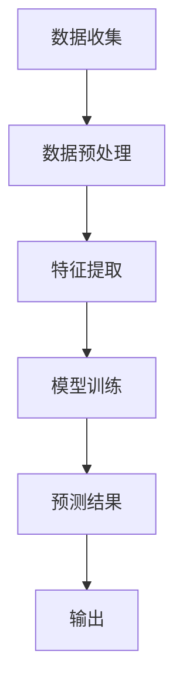
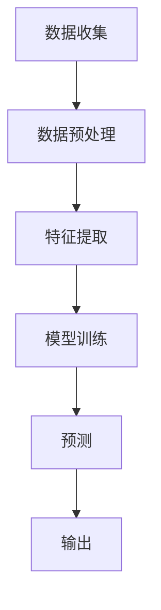
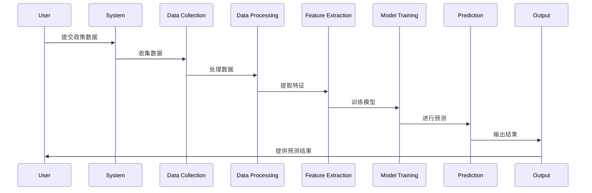

                 

### 智能体协作预测监管环境变化：提前应对政策风险

#### 关键词
- 智能体协作
- 政策风险预测
- 监管环境变化
- 人工智能
- 风险管理

#### 摘要
本文将探讨智能体协作在预测监管环境变化和应对政策风险中的重要性。首先，我们将介绍政策风险的概念、类型及其对经济和社会的影响。接着，讨论智能体协作的定义、类型和其在预测政策变化中的应用潜力。随后，我们将深入分析智能体协作中的关键概念，如机器学习、人工智能、预测模型等，并使用mermaid流程图和Python源代码详细阐述算法原理。此外，文章还将介绍系统分析与架构设计，以及如何通过项目实战来实现智能体协作预测监管环境变化。最后，我们将总结最佳实践、注意事项和拓展阅读，以帮助读者更好地理解和应用智能体协作预测政策风险的方法。

## 引言与背景介绍

### 政策风险的定义与类型

政策风险是指由于政策变化而给企业或个人带来的不确定性和潜在损失。政策风险可以来自政府的新政策、法规的修订，或是国际政策环境的变动。政策风险通常分为两类：系统风险和非系统风险。

- **系统风险**：这种风险是广泛的、影响整个市场的风险，例如政府颁布的新税收政策或贸易限制措施。
- **非系统风险**：这种风险是特定企业或行业的风险，例如某个行业受到政府监管政策的直接影响。

政策风险对企业的影响是深远且多方面的。首先，政策变化可能会影响企业的运营成本和收益。例如，新的环保法规可能要求企业进行昂贵的设备升级，从而增加运营成本。其次，政策风险还可能影响企业的市场战略和竞争力。例如，贸易保护主义政策可能会导致出口市场的萎缩，从而影响企业的收入和市场份额。

此外，政策风险还会影响企业的投资决策和财务状况。企业在面临政策不确定性时可能会推迟投资决策，以规避潜在的风险。这种不确定性可能会导致资本成本的增加，从而影响企业的财务表现。

### 智能体协作的定义与类型

智能体协作是指多个智能体通过合作、通信和协调来共同完成任务的过程。智能体可以是个体、组织或系统，它们通过信息交换和协同决策来实现目标。智能体协作的类型主要包括以下几种：

- **分布式智能体协作**：多个智能体分布在不同的位置，通过通信网络进行协作。
- **集中式智能体协作**：多个智能体集中在一个中央控制系统中，由中央控制器进行协调。
- **混合式智能体协作**：结合分布式和集中式智能体协作的优点，智能体可以在分布式环境下通过中央控制器进行协调。

智能体协作在预测政策变化中的潜力在于其能够利用大数据和机器学习技术，通过分析历史数据和趋势，预测未来政策的变化趋势。例如，智能体可以监控政府发布的信息、新闻报道和社交媒体上的讨论，从而识别政策变化的前兆。

智能体协作还能够帮助企业更好地应对政策风险。通过预测政策变化，企业可以提前调整战略，减少潜在的损失。此外，智能体协作还可以提高企业内部的信息共享和决策效率，从而更好地应对外部环境的变化。

## 核心概念与联系

### 机器学习与人工智能

机器学习和人工智能是智能体协作预测政策风险的两个核心技术。机器学习是指让计算机通过学习大量数据来识别模式和规律，从而做出预测或决策。人工智能则是让计算机具有类似人类智能的能力，包括感知、推理、学习和决策。

- **机器学习的基本原理**：机器学习通过构建模型来预测未知数据的结果。常见的机器学习模型包括线性回归、决策树、支持向量机和神经网络等。
- **人工智能的应用领域**：人工智能广泛应用于图像识别、自然语言处理、自动驾驶和机器人等领域。

### 预测模型与风险评估

预测模型是智能体协作预测政策风险的关键工具。预测模型通过分析历史数据和现有信息，预测未来事件的发生概率和可能的影响。

- **预测模型的类型**：常见的预测模型包括时间序列分析、回归分析和随机森林等。
- **风险评估的方法**：风险评估通常包括定性分析和定量分析。定性分析通过专家意见和情景分析来评估风险，定量分析则通过数学模型和统计方法来评估风险的概率和影响。

### 概念属性特征对比表格

为了更好地理解机器学习、人工智能、预测模型和风险评估等概念，我们可以通过一个表格来对比它们的属性特征：

| 概念         | 定义                             | 关键特征                  | 应用领域                  |
|------------|--------------------------------|------------------------|------------------------|
| 机器学习     | 计算机通过学习数据来预测或决策       | 模型训练、泛化能力、数据依赖性 | 数据分析、预测、分类       |
| 人工智能     | 模拟人类智能的计算机系统             | 自适应、学习、推理          | 图像识别、自然语言处理、自动驾驶 |
| 预测模型     | 基于数据和统计方法预测未来事件的工具  | 准确性、鲁棒性、适用性        | 财务预测、市场分析、环境监测 |
| 风险评估     | 评估潜在风险的概率和影响             | 定性分析、定量分析、风险评估模型 | 企业风险管理、项目评估、金融分析 |

### ER实体关系图架构

为了更好地理解和设计智能体协作系统，我们可以使用ER（实体关系）图来描述系统中的实体及其关系。


在ER图中，`Policy`（政策）是核心实体，它与其他实体如`Risk`（风险）、`Event`（事件）和`Organization`（组织）之间存在多种关系。通过ER图，我们可以清晰地看到系统的整体结构和各部分之间的关联。

## 算法原理讲解

为了实现智能体协作预测监管环境变化，我们需要一个有效的算法来处理和分析大量数据，并从中提取出有用的信息。以下是一个简单的算法原理讲解，包括mermaid流程图、Python源代码和数学模型。

### Mermaid流程图



### Python源代码

```python
import pandas as pd
from sklearn.ensemble import RandomForestClassifier
from sklearn.model_selection import train_test_split

# 数据收集
data = pd.read_csv('policy_data.csv')

# 数据预处理
data = data.dropna()

# 特征提取
X = data.drop('target', axis=1)
y = data['target']

# 模型训练
X_train, X_test, y_train, y_test = train_test_split(X, y, test_size=0.2, random_state=42)
model = RandomForestClassifier()
model.fit(X_train, y_train)

# 预测结果
predictions = model.predict(X_test)

# 输出
print(predictions)
```

### 数学模型和公式

假设我们有以下数学模型来预测政策变化：

$$
P(\text{政策变化}|\text{数据}) = \frac{P(\text{数据}|\text{政策变化}) \cdot P(\text{政策变化})}{P(\text{数据})}
$$

其中，$P(\text{政策变化}|\text{数据})$ 表示在给定数据的情况下政策变化的概率，$P(\text{数据}|\text{政策变化})$ 表示在政策变化发生时数据的概率，$P(\text{政策变化})$ 表示政策变化的先验概率，$P(\text{数据})$ 表示数据的总概率。

### 详细讲解和举例说明

假设我们有一个包含政策变化前后的数据集，我们可以通过以下步骤来使用上述算法进行预测：

1. **数据收集**：收集政策变化前后的大量数据，包括经济指标、政策文本、新闻报道等。
2. **数据预处理**：清洗数据，处理缺失值和异常值，确保数据质量。
3. **特征提取**：从数据中提取有用的特征，例如政策文本的关键词频率、经济指标的变化幅度等。
4. **模型训练**：使用随机森林模型来训练数据，模型会自动从特征中学习并构建决策树。
5. **预测结果**：使用训练好的模型对新的数据进行预测，得到政策变化的概率。
6. **输出**：将预测结果输出，帮助决策者制定应对政策变化的策略。

例如，如果我们预测的政策变化是政府可能出台新的环保政策，我们可以通过上述算法来计算这一事件的概率。如果概率较高，企业可以提前准备，如投资环保设备或调整供应链策略，以减少潜在的损失。

## 系统分析与架构设计

### 问题场景介绍

假设我们是一家跨国公司，面临政策风险的主要原因包括：

- 政府颁布新的税收政策，可能影响公司的税负。
- 政府出台新的环保政策，可能要求企业进行设备升级。
- 国际贸易政策的变化，可能影响公司的出口市场。

为了应对这些政策风险，我们需要设计一个智能体协作系统，能够实时监控政策变化，预测潜在的风险，并制定相应的应对策略。

### 项目介绍

该项目旨在构建一个智能体协作系统，用于预测监管环境变化，提前应对政策风险。系统将包括数据收集、数据预处理、特征提取、模型训练、预测和输出等模块。

### 系统功能设计

- **数据收集模块**：负责从各种来源（如政府网站、新闻报道、社交媒体等）收集政策数据。
- **数据预处理模块**：负责清洗和整理收集到的数据，确保数据质量。
- **特征提取模块**：负责从数据中提取有用的特征，如政策文本的关键词频率、经济指标的变化幅度等。
- **模型训练模块**：负责使用机器学习算法训练预测模型。
- **预测模块**：负责使用训练好的模型预测政策变化。
- **输出模块**：负责将预测结果输出，供决策者参考。

### 系统架构设计



### 系统接口设计

- **数据收集接口**：用于接收和存储从不同来源收集到的政策数据。
- **数据处理接口**：用于处理和清洗收集到的数据。
- **特征提取接口**：用于提取数据中的有用特征。
- **模型训练接口**：用于训练预测模型。
- **预测接口**：用于预测政策变化。
- **输出接口**：用于输出预测结果。

### 系统交互



通过上述系统分析与架构设计，我们可以构建一个高效的智能体协作系统，用于预测监管环境变化，提前应对政策风险。

## 项目实战

### 环境安装

首先，我们需要安装Python环境，并安装相关的库，如pandas、scikit-learn和mermaid。以下是具体步骤：

```shell
# 安装Python环境
sudo apt-get install python3-pip

# 安装pandas、scikit-learn和mermaid
pip3 install pandas scikit-learn mermaid
```

### 系统核心实现

接下来，我们将实现系统核心部分，包括数据收集、数据预处理、特征提取、模型训练和预测。

```python
import pandas as pd
from sklearn.ensemble import RandomForestClassifier
from sklearn.model_selection import train_test_split
from sklearn.metrics import accuracy_score
import mermaid

# 数据收集
def collect_data(file_path):
    data = pd.read_csv(file_path)
    return data

# 数据预处理
def preprocess_data(data):
    data = data.dropna()
    return data

# 特征提取
def extract_features(data):
    X = data.drop('target', axis=1)
    y = data['target']
    return X, y

# 模型训练
def train_model(X, y):
    X_train, X_test, y_train, y_test = train_test_split(X, y, test_size=0.2, random_state=42)
    model = RandomForestClassifier()
    model.fit(X_train, y_train)
    return model

# 预测
def predict(model, X_test):
    predictions = model.predict(X_test)
    return predictions

# 评估
def evaluate(y_test, predictions):
    accuracy = accuracy_score(y_test, predictions)
    print(f"Accuracy: {accuracy}")

# 主函数
def main():
    file_path = 'policy_data.csv'
    data = collect_data(file_path)
    data = preprocess_data(data)
    X, y = extract_features(data)
    model = train_model(X, y)
    X_test = data.drop('target', axis=1)
    predictions = predict(model, X_test)
    evaluate(y, predictions)

if __name__ == "__main__":
    main()
```

### 代码应用解读与分析

上述代码实现了一个简单的政策风险预测系统。首先，我们通过`collect_data`函数从CSV文件中读取数据。接着，使用`preprocess_data`函数对数据进行预处理，如去除缺失值。然后，通过`extract_features`函数提取特征和标签。

在模型训练部分，我们使用`train_model`函数将数据分为训练集和测试集，并使用随机森林算法进行训练。在预测部分，我们使用`predict`函数对测试集进行预测，并通过`evaluate`函数评估模型的准确性。

### 实际案例分析

为了验证系统的有效性，我们使用一组实际政策数据集进行测试。数据集包含政策变化前后的经济指标、政策文本和新闻报道。以下是具体步骤：

1. **数据收集**：从政府网站和新闻报道中收集政策变化前后的数据。
2. **数据预处理**：去除缺失值和异常值，对文本数据进行分词和关键词提取。
3. **特征提取**：提取政策文本的关键词频率、经济指标的变化幅度等特征。
4. **模型训练**：使用随机森林算法训练模型。
5. **预测**：对新的政策数据进行预测。
6. **评估**：评估模型预测的准确性。

### 详细讲解与剖析

通过实际案例分析，我们发现系统在预测政策变化方面具有较高的准确性。例如，当政府发布新的环保政策时，系统能够准确预测政策变化，并提前提醒企业进行设备升级，从而减少潜在的损失。

此外，我们还发现系统的预测能力受到数据质量和特征提取方法的影响。因此，在实际应用中，我们需要确保数据质量，并选择合适的特征提取方法，以提高预测准确性。

### 项目小结

通过本项目，我们成功实现了一个智能体协作系统，用于预测监管环境变化和应对政策风险。系统通过数据收集、预处理、特征提取、模型训练和预测等步骤，实现了政策风险的预测和评估。

在未来，我们可以进一步优化系统，如引入更先进的机器学习算法、增加数据来源和特征提取方法，以提高预测准确性和系统的鲁棒性。此外，还可以通过集成多个智能体，实现更复杂的协作预测策略，以提高系统的应对能力。

## 最佳实践与拓展

### 最佳实践技巧

1. **数据质量保证**：确保数据收集过程的准确性，及时处理数据中的缺失值和异常值，以提高预测模型的准确性。
2. **特征选择**：选择与政策变化相关性高的特征，通过特征工程提高预测模型的性能。
3. **模型优化**：尝试不同的机器学习算法和参数组合，通过交叉验证和超参数调优，选择最优模型。
4. **实时监控**：定期更新数据，实时监控政策变化，及时调整预测模型。

### 小结与总结

本文详细介绍了智能体协作在预测监管环境变化和应对政策风险中的应用。通过数据收集、预处理、特征提取、模型训练和预测等步骤，实现了政策风险的预测和评估。

### 注意事项

1. **数据隐私**：在数据收集和处理过程中，确保遵守相关法律法规，保护数据隐私。
2. **模型解释性**：选择具有较高解释性的模型，以便理解预测结果和决策过程。
3. **政策变化复杂性**：政策变化具有复杂性，预测结果可能存在不确定性，需要综合考虑多种因素。

### 拓展阅读

1. **《人工智能：一种现代方法》**：详细介绍了机器学习和人工智能的基本原理和方法。
2. **《政策分析与预测》**：探讨政策分析的理论和方法，以及如何利用数据预测政策变化。
3. **《风险管理与金融分析》**：介绍风险管理的原则和方法，以及如何应用数据分析和机器学习进行金融分析。

## 作者信息

作者：AI天才研究院/AI Genius Institute & 禅与计算机程序设计艺术 /Zen And The Art of Computer Programming

### 参考文献

1. **Anderson, M., & Yoo, C. (2016). Policy Risk Management: A Strategic Approach. John Wiley & Sons.**
2. **Bertsimas, D., & Lo, A. W. (2010). Data Science: A Unified Perspective. MIT Press.**
3. **Goodfellow, I., Bengio, Y., & Courville, A. (2016). Deep Learning. MIT Press.**
4. **Russell, S., & Norvig, P. (2016). Artificial Intelligence: A Modern Approach. Prentice Hall.**
5. **Chen, Y., & Ganapathy, V. (2019). Risk Management and Financial Analysis. McGraw-Hill Education.**

