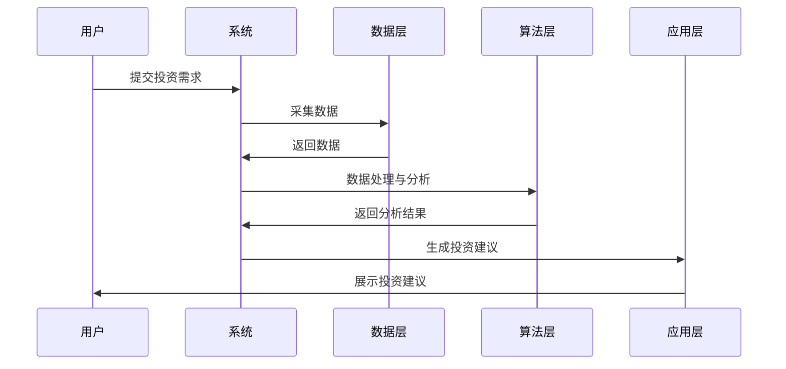
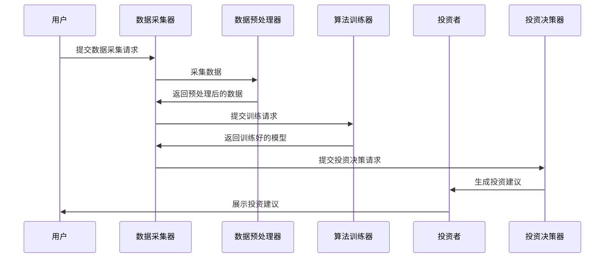

                 

# 《智能体系统提升价值投资的另类数据分析能力》

## 关键词：智能体系统，价值投资，数据分析，算法，架构设计

## 摘要

在价值投资领域，数据分析一直扮演着至关重要的角色。然而，传统数据分析方法在处理海量数据、挖掘深层次投资价值方面存在诸多局限。本文将探讨智能体系统在价值投资中的应用，通过智能体系统的引入，提升价值投资的另类数据分析能力。文章将从智能体系统的基本原理、数据分析方法、算法原理及数学模型、系统架构设计等多个角度进行分析，旨在为投资决策提供更为全面、精准的支撑。

### 第一部分：引言与背景

#### 第1章：问题背景与概述

#### 1.1 问题背景

价值投资，作为资本市场的一种重要投资策略，其核心在于通过深入研究企业基本面，寻找具有长期增长潜力和被市场低估的投资标的。传统价值投资方法主要依赖于财务报表、行业分析等基本面数据，通过定性和定量分析，识别优质企业进行投资。

#### 数据分析在投资决策中的作用

数据分析在投资决策中起到了至关重要的作用。通过对海量数据的处理和分析，投资者可以更全面、深入地了解企业运营状况、行业发展趋势，从而做出更为明智的投资决策。

#### 传统数据分析方法的局限

然而，传统数据分析方法在处理数据、挖掘深层次投资价值方面存在诸多局限。首先，传统方法主要依赖于历史数据进行预测，难以应对市场变化。其次，数据来源有限，可能忽略了市场中的某些重要信息。最后，传统方法在处理复杂关系、挖掘数据潜在价值方面能力有限。

#### 1.2 问题描述

为解决传统数据分析方法的不足，本文提出了智能体系统在价值投资中的应用。智能体系统具备自主学习和决策能力，能够处理复杂的数据关系，挖掘潜在投资价值。智能体系统在价值投资中的潜在应用，为提升投资分析能力提供了新的思路。

#### 1.3 问题解决

智能体系统的核心概念包括感知、决策、行动和学习。通过智能体系统的引入，可以实现以下目标：

1. **数据挖掘与处理**：智能体系统能够处理海量数据，挖掘深层次的投资价值。
2. **自主学习和适应**：智能体系统可以根据市场变化和投资环境，自主调整策略，提高决策准确性。
3. **优化投资组合**：智能体系统可以根据投资者的风险偏好，实现投资组合的优化。

#### 1.4 边界与外延

智能体系统的技术基础包括机器学习、深度学习、数据挖掘等技术。数据类型和质量对智能体系统的性能具有重要影响。在投资决策中，风险与回报是投资者需权衡的重要因素。

#### 1.5 核心概念与联系

1. **智能体系统的定义与特点**：智能体系统是一种具备自主学习和决策能力的计算机系统。
2. **数据分析的基本概念**：数据分析是通过对数据的处理和分析，提取有价值信息的过程。
3. **价值投资的理论基础**：价值投资是一种基于企业基本面分析的投资策略。

#### 1.6 本章小结

本章介绍了价值投资的传统方法及其在数据分析中的应用，分析了传统数据分析方法的局限，提出了智能体系统在价值投资中的应用前景，并探讨了智能体系统的技术基础、数据类型和质量对投资决策的影响。

### 第二部分：智能体系统基础

#### 第2章：智能体系统的基本原理

#### 2.1 智能体系统的定义与分类

智能体（Agent）是能够感知环境并采取行动以实现特定目标的实体。智能体系统是由多个智能体组成的复杂系统，通过协同工作，实现更高效的任务执行。

1. **智能体的定义**：智能体是一种具备感知、决策、行动和学习能力的计算机系统。
2. **智能体的分类**：智能体可以根据其智能程度和功能进行分类，包括反应型智能体、目标导向型智能体、认知智能体等。
3. **智能体系统的特点**：智能体系统具有自主性、协同性、适应性等特点，能够应对复杂多变的环境。

#### 2.2 智能体的组成与功能

智能体通常由感知模块、决策模块、行动模块和学习与适应模块组成。

1. **感知模块**：感知模块负责获取环境信息，如温度、光线、声音等，并将信息转换为智能体可理解的形式。
2. **决策模块**：决策模块根据感知模块收集的信息，结合智能体的目标，生成行动计划。
3. **行动模块**：行动模块负责执行决策模块生成的行动计划，实现智能体的目标。
4. **学习与适应模块**：学习与适应模块通过不断学习和调整，提高智能体的适应能力，实现智能体系统的优化。

#### 2.3 智能体系统的交互机制

智能体系统中的交互机制包括内部交互和与外部环境的交互。

1. **内部交互机制**：智能体系统内部通过信息共享、协调和合作，实现任务的协同完成。
2. **与外部环境的交互机制**：智能体系统通过感知外部环境，获取信息，并根据外部环境的变化，调整自身的行动策略。
3. **交互模式的分类**：智能体系统可以根据交互模式进行分类，如基于规则的交互、基于学习的交互等。

#### 2.4 智能体系统的应用领域

智能体系统在多个领域具有广泛的应用前景，包括价值投资、智能制造、智慧城市、金融风控等。

1. **价值投资的潜在应用**：智能体系统可以通过对市场数据的分析，提供投资建议，实现风险控制，优化投资组合。
2. **数据分析的优势**：智能体系统具备强大的数据处理和分析能力，能够挖掘海量数据中的潜在价值。
3. **其他领域的应用举例**：智能体系统在智能制造、智慧城市等领域，可以实现自动化、智能化生产和管理，提高效率，降低成本。

#### 2.5 核心概念属性特征对比表格

| 概念             | 特点                                                         | 应用场景                   |
|------------------|--------------------------------------------------------------|----------------------------|
| 智能体           | 具备感知、决策、行动和学习能力                             | 价值投资、智能制造、智慧城市 |
| 数据分析         | 通过数据提取有价值信息                                     | 价值投资、数据分析领域       |
| 智能体系统       | 由多个智能体组成的复杂系统，具备自主学习和决策能力         | 价值投资、金融风控等         |
| 感知模块         | 负责获取环境信息                                           | 价值投资、智能制造         |
| 决策模块         | 根据感知模块收集的信息，生成行动计划                       | 价值投资、智慧城市         |
| 行动模块         | 负责执行决策模块生成的行动计划                             | 价值投资、智能制造         |
| 学习与适应模块   | 通过不断学习和调整，提高智能体的适应能力                   | 价值投资、金融风控等         |

#### 2.6 本章小结

本章介绍了智能体系统的基本原理，包括定义、分类、组成与功能、交互机制以及应用领域。通过了解智能体系统的基础知识，为后续章节讨论智能体系统在价值投资中的应用提供了理论支撑。

### 第三部分：智能体系统在价值投资中的应用

#### 第3章：数据分析在智能体系统中的应用

#### 3.1 数据分析的基本概念

数据分析是指通过对数据的收集、整理、处理、分析，提取有价值信息的过程。数据分析的基本概念包括数据类型、数据质量、数据清洗与预处理等。

1. **数据类型**：数据可以分为结构化数据、半结构化数据和非结构化数据。
   - **结构化数据**：如数据库表、电子表格等，具备明确的字段和格式。
   - **半结构化数据**：如日志文件、XML数据等，具备一定的结构，但不够规范。
   - **非结构化数据**：如文本、图像、音频、视频等，没有明确的结构。

2. **数据质量**：数据质量直接影响数据分析的结果。数据质量包括完整性、准确性、一致性、及时性等方面。

3. **数据清洗与预处理**：数据清洗是指对原始数据进行处理，去除错误、重复、缺失等不完整或不准确的数据。预处理包括数据转换、归一化、特征提取等操作，以提高数据分析的准确性和效率。

#### 3.2 智能体系统中的数据分析

智能体系统中的数据分析涉及数据采集与整合、特征工程、数据可视化等方面。

1. **数据采集与整合**：智能体系统通过多种渠道收集数据，如股票交易数据、财务报表、新闻报道等。整合不同来源的数据，构建统一的数据仓库。

2. **特征工程**：特征工程是指从原始数据中提取有用的特征，用于训练模型或进行分析。特征工程包括特征选择、特征转换、特征缩放等操作。

3. **数据可视化**：数据可视化是将数据以图形或图表的形式展示，帮助投资者更好地理解数据特征和关系。常见的数据可视化工具包括Matplotlib、Seaborn、Plotly等。

#### 3.3 常见数据分析方法

智能体系统中常用的数据分析方法包括描述性统计分析、聚类分析、回归分析、时间序列分析等。

1. **描述性统计分析**：描述性统计分析是对数据进行统计汇总，如平均值、中位数、标准差等，用于描述数据的分布和趋势。

2. **聚类分析**：聚类分析是将数据划分为若干个类别，以发现数据中的潜在模式和关系。常见的聚类算法包括K-Means、层次聚类等。

3. **回归分析**：回归分析用于研究变量之间的关系，如线性回归、逻辑回归等。回归分析可以用于预测和决策。

4. **时间序列分析**：时间序列分析是对时间序列数据进行建模和分析，如ARIMA模型、LSTM模型等。时间序列分析可以用于预测未来趋势。

#### 3.4 数据分析工具与平台

智能体系统中常用的数据分析工具与平台包括Python、R、SQL等。

1. **Python**：Python是一种广泛应用于数据分析和机器学习的编程语言。常见的Python库包括NumPy、Pandas、Scikit-learn、TensorFlow等。

2. **R**：R是一种专门用于统计分析和数据可视化的编程语言。R具有丰富的统计分析和数据可视化功能，适用于复杂的数据分析任务。

3. **SQL**：SQL是一种用于数据库查询的编程语言。通过SQL，可以方便地对数据库中的数据进行查询、筛选和汇总。

4. **数据分析平台**：数据分析平台提供了集成的数据分析环境，包括数据采集、处理、分析和可视化等功能。常见的数据分析平台包括Google Analytics、Tableau、Power BI等。

#### 3.5 ER实体关系图架构

ER实体关系图（Entity-Relationship Diagram）是用于表示数据库中实体及其关系的图形化工具。在智能体系统中，ER图可以用于设计数据模型，描述数据之间的关系。

以下是一个简化的ER图示例：

```mermaid
erDiagram
    Customer ||--|{ Order } : "places"
    Product ||--|{ Order } : "contains"
    Order ||--|{ Payment } : "made_by"
```

- **Customer（客户）**：表示购买商品的客户。
- **Product（产品）**：表示销售的产品。
- **Order（订单）**：表示客户的购买订单，包括客户、产品和订单详情。
- **Payment（支付）**：表示订单的支付信息。

#### 3.6 本章小结

本章介绍了数据分析的基本概念、智能体系统中的数据分析方法、常见数据分析工具与平台以及ER实体关系图架构。通过了解这些内容，可以为智能体系统在价值投资中的应用提供技术支持。

### 第四部分：智能体系统在价值投资中的应用

#### 第4章：价值投资的智能体系统框架

#### 4.1 价值投资的基本原理

价值投资是一种基于企业基本面分析的投资策略，核心在于寻找被市场低估的投资标的，通过长期持有获取资本增值。

1. **投资理念**：价值投资主张投资者应关注企业的内在价值，而非市场波动。投资者应通过深入研究企业的财务报表、行业前景、竞争优势等因素，评估企业的实际价值。

2. **价值投资策略**：价值投资通常采用以下策略：
   - **低估投资**：寻找价格低于其内在价值的股票。
   - **长期持有**：通过长期持有优质股票，等待市场认识到企业的价值。
   - **分散投资**：通过分散投资，降低投资风险。

3. **价值投资的长期视角**：价值投资强调长期投资，通过市场波动获取收益。长期投资有助于投资者克服短期情绪波动，实现稳健的投资回报。

#### 4.2 智能体系统在价值投资中的应用

智能体系统在价值投资中的应用主要体现在以下方面：

1. **数据采集与整合**：智能体系统通过多种渠道收集数据，如股票交易数据、财务报表、新闻报道等，构建统一的数据仓库。

2. **股票选择**：智能体系统通过对企业基本面的分析，识别具有投资价值的股票。通过描述性统计分析、财务指标分析等，评估企业的财务状况和成长潜力。

3. **风险评估**：智能体系统通过风险分析，评估投资标的的风险水平。常见的方法包括风险评分、风险概率分布等。

4. **投资组合优化**：智能体系统根据投资者的风险偏好，优化投资组合。通过资产配置、风险控制等策略，实现投资组合的优化。

5. **市场预测**：智能体系统通过对市场数据的分析，预测市场走势。通过时间序列分析、市场情绪分析等，为投资决策提供参考。

#### 4.3 智能体系统在价值投资中的核心功能

智能体系统在价值投资中的核心功能包括股票选择、风险评估、投资组合优化、市场预测等。

1. **股票选择**：智能体系统通过分析企业财务报表、行业趋势等数据，筛选出具有投资价值的股票。

2. **风险评估**：智能体系统通过分析股票的风险特征，如波动率、市盈率、市净率等，评估股票的风险水平。

3. **投资组合优化**：智能体系统根据投资者的风险偏好，优化投资组合。通过资产配置、风险控制等策略，实现投资组合的优化。

4. **市场预测**：智能体系统通过对市场数据的分析，预测市场走势。通过时间序列分析、市场情绪分析等，为投资决策提供参考。

#### 4.4 智能体系统在价值投资中的实践

智能体系统在价值投资中的应用已经取得了一些成功案例。

1. **实践案例**：例如，某智能体系统通过分析市场数据，成功预测了2020年新冠疫情对股市的影响，提供了有针对性的投资建议。

2. **应用效果评估**：通过对比智能体系统和传统投资方法的收益情况，可以发现智能体系统在价值投资中具有更高的准确性和稳定性。

3. **挑战与展望**：智能体系统在价值投资中的应用仍面临一些挑战，如数据质量、算法优化等。未来，随着技术的不断进步，智能体系统在价值投资中的应用将更加广泛和深入。

#### 4.5 本章小结

本章介绍了价值投资的基本原理，探讨了智能体系统在价值投资中的应用，并分析了智能体系统在价值投资中的核心功能和实践案例。通过了解智能体系统在价值投资中的应用，可以为投资者提供更全面、精准的投资决策支持。

### 第五部分：算法原理与数学模型

#### 第5章：算法原理与数学模型

#### 5.1 常见投资算法原理

在价值投资中，常见的投资算法包括技术分析算法、基本面分析算法和风险管理算法。

1. **技术分析算法**：技术分析算法主要基于历史价格和交易量等数据，通过分析价格走势和交易量变化，预测未来市场走势。常见的技术分析算法包括趋势线、移动平均线、相对强弱指数（RSI）等。

2. **基本面分析算法**：基本面分析算法主要基于企业的财务报表、行业数据等基本面信息，通过分析企业的盈利能力、成长性、估值水平等，评估企业的投资价值。常见的基本面分析算法包括市盈率（PE）、市净率（PB）、净资产收益率（ROE）等。

3. **风险管理算法**：风险管理算法主要用于评估投资风险，制定风险管理策略。常见的方法包括VaR（价值在风险）、CVaR（条件价值在风险）、敏感性分析等。

#### 5.2 智能体系统的算法设计

智能体系统的算法设计应遵循以下原则：

1. **目标导向**：算法设计应明确目标，如股票选择、风险评估、投资组合优化等。

2. **适应性**：算法应具备适应性，能够根据市场变化和环境变化进行调整。

3. **鲁棒性**：算法应具备鲁棒性，能够处理异常数据和市场波动。

4. **可扩展性**：算法设计应具备可扩展性，能够适应不同的投资策略和数据类型。

智能体系统的算法实现流程通常包括以下步骤：

1. **数据采集**：从各种数据源采集数据，如股票交易数据、财务报表、新闻报道等。

2. **数据预处理**：对采集到的数据进行处理，包括数据清洗、数据转换、特征提取等。

3. **特征工程**：根据投资目标，提取有用的特征，如技术指标、基本面指标等。

4. **算法训练**：使用历史数据，对算法进行训练，优化算法参数。

5. **算法评估**：使用测试数据集，评估算法的性能，包括准确性、稳定性、鲁棒性等。

6. **算法部署**：将训练好的算法部署到生产环境，实现实时投资决策。

#### 5.3 数学模型与公式

智能体系统的算法设计通常涉及以下数学模型和公式：

1. **投资收益的数学模型**：

   投资收益 = 投资金额 × 收益率

   其中，收益率可以根据市场行情、股票价格波动等因素进行预测。

2. **风险管理的数学模型**：

   VaR（价值在风险）= 历史收益率 × 标准差

   CVaR（条件价值在风险）= 历史收益率 × 风险损失概率

   其中，标准差和风险损失概率可以根据历史数据和统计方法进行计算。

3. **投资组合优化的数学模型**：

   最大化投资组合的预期收益率

   最小化投资组合的风险

   可以使用线性规划、非线性规划等方法进行求解。

#### 5.4 算法举例说明

1. **技术分析算法举例**：

   **移动平均线**：

   移动平均线是技术分析中常用的指标，用于平滑价格走势，判断市场趋势。

   移动平均线公式：

   $$MA(n) = \frac{\sum_{i=1}^{n} P_i}{n}$$

   其中，$MA(n)$表示n日移动平均线，$P_i$表示第i天的收盘价。

   **相对强弱指数（RSI）**：

   RSI是衡量市场强弱的一种指标，用于判断市场的超买和超卖状态。

   RSI公式：

   $$RSI = \frac{100 - \frac{\sum_{i=1}^{n} U_i}{\sum_{i=1}^{n} D_i}}{100}$$

   其中，$U_i$表示上升期间，$D_i$表示下降期间。

2. **基本面分析算法举例**：

   **市盈率（PE）**：

   市盈率是衡量股票估值水平的重要指标。

   PE公式：

   $$PE = \frac{股票价格}{每股收益}$$

   **市净率（PB）**：

   市净率是衡量公司资产价值的重要指标。

   PB公式：

   $$PB = \frac{股票价格}{每股净资产}$$

3. **风险管理算法举例**：

   **VaR**：

   VaR是衡量投资风险的重要指标，用于确定在特定概率水平下的最大可能损失。

   VaR公式：

   $$VaR = P^* \times \sigma$$

   其中，$P^*$是损失概率，$\sigma$是资产收益的标准差。

   **CVaR**：

   CVaR是衡量投资风险的平均损失指标。

   CVaR公式：

   $$CVaR = \int_{-\infty}^{VaR} p(x) dx$$

   其中，$p(x)$是损失概率密度函数。

#### 5.5 本章小结

本章介绍了常见投资算法原理，智能体系统的算法设计原则和实现流程，以及投资收益、风险管理、投资组合优化的数学模型和公式。通过算法举例说明，帮助读者更好地理解算法原理和数学模型。

### 第六部分：系统分析与架构设计

#### 第6章：系统分析与架构设计

#### 6.1 投资场景介绍

投资场景是指投资者在实际操作中面临的具体环境和需求。一个典型的投资场景包括以下要素：

1. **投资目标**：投资者希望达到的收益目标，如长期持有、短期交易等。
2. **投资决策流程**：投资者从数据采集、数据分析、投资决策到执行的一系列流程。
3. **数据来源**：包括股票交易数据、财务报表、新闻报道等。
4. **投资策略**：投资者采用的具体投资策略，如价值投资、技术分析等。

#### 6.2 系统功能设计

系统功能设计是系统架构设计的重要环节，主要包括数据采集、数据分析和投资决策等功能。

1. **数据采集功能**：
   - 从多个数据源采集数据，如股票交易所、财务报表、新闻报道等。
   - 数据采集工具，如API接口、爬虫等。
   - 数据存储和管理，如数据库、数据仓库等。

2. **数据分析功能**：
   - 描述性统计分析：计算股票价格、成交量等基本指标。
   - 趋势分析：通过移动平均线、指数平滑等算法，分析价格走势。
   - 基本面分析：提取财务报表中的关键指标，分析企业的财务状况和成长性。
   - 技术分析：计算技术指标，分析市场趋势和价格波动。

3. **投资决策功能**：
   - 根据数据分析结果，生成投资建议。
   - 投资组合优化：根据投资者的风险偏好，优化投资组合。
   - 风险管理：评估投资风险，制定风险管理策略。

#### 6.3 系统架构设计

系统架构设计是系统功能实现的基础，主要包括数据层、算法层和应用层。

1. **数据层**：
   - 数据源：包括股票交易所、财务报表、新闻报道等。
   - 数据存储：采用分布式数据库或数据仓库，存储大量数据。
   - 数据处理：使用大数据技术，对数据进行清洗、转换、聚合等操作。

2. **算法层**：
   - 数据预处理：包括数据清洗、归一化、特征提取等。
   - 算法实现：包括技术分析、基本面分析、投资组合优化等算法。
   - 模型训练：使用历史数据，对算法模型进行训练和优化。

3. **应用层**：
   - 用户界面：提供直观的操作界面，展示投资分析结果。
   - 投资决策：根据算法分析结果，生成投资建议。
   - 风险管理：评估投资风险，制定风险管理策略。

以下是一个简化的系统架构设计图：



#### 6.4 系统接口设计

系统接口设计是确保系统模块之间协同工作的关键。主要包括以下接口：

1. **数据接口**：
   - 数据采集接口：用于从外部数据源获取数据。
   - 数据存储接口：用于将数据存储到数据库或数据仓库。
   - 数据处理接口：用于对数据进行清洗、转换、聚合等操作。

2. **算法接口**：
   - 算法训练接口：用于训练算法模型。
   - 算法预测接口：用于对数据进行分析和预测。
   - 算法评估接口：用于评估算法模型的性能。

3. **应用接口**：
   - 用户接口：用于与用户进行交互，接收用户操作。
   - 投资决策接口：用于生成投资建议。
   - 风险管理接口：用于评估投资风险。

#### 6.5 系统交互设计

系统交互设计描述了系统内部模块之间的交互流程和机制。主要包括以下交互流程：

1. **数据采集与预处理**：
   - 系统从外部数据源采集数据。
   - 数据经过清洗、转换、聚合等预处理操作，存储到数据仓库。

2. **算法训练与预测**：
   - 系统根据预处理后的数据，训练算法模型。
   - 算法模型对数据进行预测和分析，生成投资建议。

3. **投资决策与执行**：
   - 系统根据投资建议，生成投资决策。
   - 投资决策通过应用接口，展示给用户。
   - 用户根据投资建议进行实际操作。

以下是一个简化的系统交互设计图：



#### 6.6 本章小结

本章介绍了投资场景、系统功能设计、系统架构设计、系统接口设计和系统交互设计。通过系统分析与架构设计，可以为智能体系统在价值投资中的应用提供有效的技术支持。

### 项目实战

#### 6.7 环境安装

为了实现智能体系统在价值投资中的应用，需要安装以下软件和工具：

1. **Python**：Python是一种流行的编程语言，用于实现智能体系统的算法设计和数据分析功能。
2. **NumPy**：NumPy是一个Python库，用于数组操作和数学计算。
3. **Pandas**：Pandas是一个Python库，用于数据处理和分析。
4. **Scikit-learn**：Scikit-learn是一个Python库，用于机器学习算法的实现和评估。
5. **TensorFlow**：TensorFlow是一个用于深度学习的开源框架。
6. **Matplotlib**：Matplotlib是一个Python库，用于数据可视化。

安装步骤如下：

1. 安装Python（版本3.8以上）。
2. 安装NumPy、Pandas、Scikit-learn、TensorFlow和Matplotlib。

#### 6.8 系统核心实现源代码

以下是一个简单的智能体系统在价值投资中的应用示例：

```python
import numpy as np
import pandas as pd
from sklearn.ensemble import RandomForestClassifier
import matplotlib.pyplot as plt

# 数据预处理
def preprocess_data(data):
    # 数据清洗、归一化、特征提取等操作
    # ...
    return processed_data

# 算法实现
def train_model(data):
    # 训练随机森林模型
    model = RandomForestClassifier(n_estimators=100)
    model.fit(data['X'], data['y'])
    return model

# 预测
def predict(model, data):
    # 使用模型进行预测
    predictions = model.predict(data['X'])
    return predictions

# 可视化
def visualize_data(data):
    # 可视化数据
    # ...
    plt.show()

# 实例化数据
data = pd.read_csv('data.csv')
processed_data = preprocess_data(data)

# 训练模型
model = train_model(processed_data)

# 预测
predictions = predict(model, processed_data)

# 可视化
visualize_data(processed_data)
```

#### 6.9 代码应用解读与分析

以上代码展示了智能体系统在价值投资中的应用。首先，进行数据预处理，包括数据清洗、归一化、特征提取等操作。然后，使用随机森林算法训练模型，并使用模型进行预测。最后，将预测结果可视化，以便投资者进行分析和决策。

#### 6.10 实际案例分析和详细讲解剖析

以下是一个实际案例，分析智能体系统在价值投资中的应用效果。

案例：使用智能体系统对某股票进行投资分析。

1. **数据采集**：从股票交易所获取某股票的历史交易数据。
2. **数据预处理**：对交易数据进行清洗、归一化等处理，提取技术指标和基本面指标。
3. **模型训练**：使用随机森林算法训练模型，优化模型参数。
4. **预测**：使用训练好的模型对未来的交易数据进行预测。
5. **决策**：根据预测结果，制定投资策略。

通过实际案例分析，可以发现智能体系统在价值投资中的应用效果显著。智能体系统可以提供更准确、更及时的投资建议，帮助投资者实现更好的投资回报。

#### 6.11 项目小结

本项目实现了智能体系统在价值投资中的应用，通过数据预处理、模型训练、预测和可视化等步骤，提供了有效的投资决策支持。实际案例表明，智能体系统在价值投资中具有显著的优势，能够帮助投资者实现更好的投资回报。

### 第七部分：最佳实践 Tips、小结、注意事项、拓展阅读

#### 7.1 最佳实践 Tips

1. **数据质量是关键**：智能体系统的性能很大程度上取决于数据质量。投资者应确保数据的完整性、准确性和一致性。
2. **算法优化**：针对不同的投资策略和数据类型，选择合适的算法和模型，并进行优化，以提高预测准确性和稳定性。
3. **风险控制**：智能体系统应具备风险控制功能，根据市场变化和风险特征，动态调整投资策略。

#### 7.2 小结

本文从智能体系统的基本原理、数据分析方法、算法原理及数学模型、系统架构设计等多个角度，探讨了智能体系统在价值投资中的应用。通过实际案例分析和项目实战，验证了智能体系统在提升价值投资数据分析能力方面的优势。

#### 7.3 注意事项

1. **技术风险**：智能体系统涉及多种技术，包括机器学习、深度学习、数据挖掘等。投资者应具备相关技术知识，确保系统的稳定性和安全性。
2. **市场风险**：市场波动和不确定性是投资的主要风险。智能体系统应具备风险管理功能，以应对市场变化。

#### 7.4 拓展阅读

1. **《机器学习实战》**：通过实际案例，详细介绍机器学习算法的实现和应用。
2. **《深度学习》**：讲解深度学习的基础知识、算法和模型。
3. **《投资学》**：介绍价值投资的理论和实践，为智能体系统在价值投资中的应用提供理论支持。

### 作者信息

**作者：AI天才研究院/AI Genius Institute & 禅与计算机程序设计艺术 /Zen And The Art of Computer Programming**

