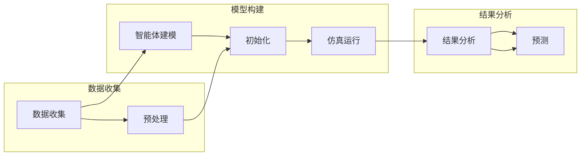
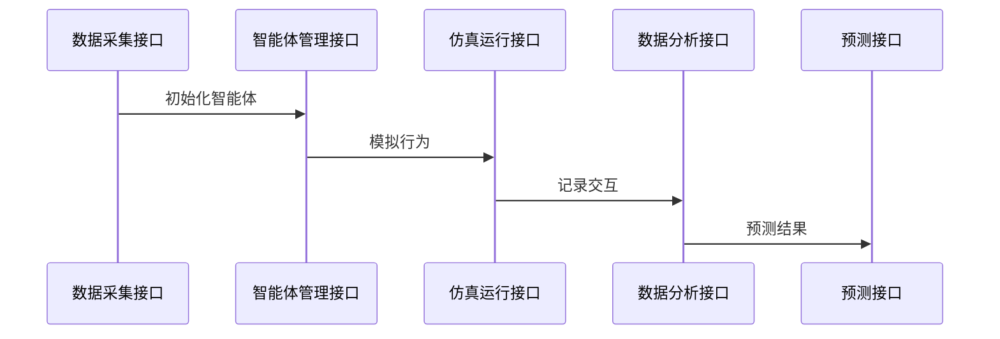

                 

### 摘要

本文旨在探讨智能体群体在模拟市场流动性枯竭中的应用。市场流动性枯竭是金融市场中普遍存在的一种现象，它对市场稳定性和投资决策产生重大影响。智能体群体作为一种新型的计算模型，通过模拟和预测市场动态，有助于我们更好地理解和应对市场流动性枯竭问题。本文将首先介绍市场流动性枯竭的概念及其对金融市场的影响，然后深入探讨智能体群体的原理及其在模拟中的应用。通过算法原理讲解、系统分析与架构设计、项目实战等多个环节，本文将逐步展示智能体群体在模拟市场流动性枯竭中的实际应用效果，并总结最佳实践和注意事项，为未来研究和应用提供指导。本文关键词包括：市场流动性枯竭、智能体群体、计算模型、金融稳定性和投资决策。

### 第1章 问题背景与核心概念

#### 1.1 市场流动性枯竭的概念与问题

市场流动性枯竭是指金融市场中的资产无法以合理的价格快速交易的情况。它通常表现为交易量的减少、价格的波动加剧以及投资者信心下降。市场流动性枯竭不仅影响个别市场参与者的交易决策，还会对整个金融系统的稳定性构成威胁。具体来说，市场流动性枯竭会导致以下问题：

1. **交易成本增加**：由于资产难以迅速买卖，交易者需要支付更高的交易成本，包括价格波动和交易费用。
2. **市场效率降低**：市场流动性枯竭降低了市场的价格发现功能，使得价格无法准确反映市场供需关系。
3. **投资风险上升**：投资者在流动性枯竭的市场中难以实现资金的及时转移，从而面临更高的投资风险。
4. **金融系统稳定性下降**：市场流动性枯竭可能引发连锁反应，导致金融机构的流动性危机，甚至威胁整个金融系统的稳定。

#### 1.2 智能体群体与模拟应用

智能体群体（Agent-Based Model, ABM）是一种模拟复杂系统的计算模型，通过模拟大量具有自主行为的智能体来研究系统整体的动态行为。智能体群体在金融市场中的应用具有独特优势：

1. **自下而上的建模方法**：智能体群体模型从个体行为出发，通过个体之间的相互作用来构建整个市场行为，有助于理解市场流动性的微观机制。
2. **灵活性和适应性**：智能体群体模型可以根据不同的市场环境进行调整，模拟各种可能的情景，为投资者提供有价值的决策支持。
3. **复杂系统研究**：金融市场是一个高度复杂的系统，智能体群体模型能够处理大量的不确定性和非线性因素，有助于揭示市场流动性枯竭的根本原因。

#### 1.3 问题解决的核心要素

要解决市场流动性枯竭问题，需要关注以下几个核心要素：

1. **数据收集与处理**：收集准确的市场数据是构建智能体群体模型的基础，包括交易量、价格波动、交易时间等。
2. **智能体建模**：根据市场参与者的行为特征，设计合适的智能体模型，包括交易策略、风险偏好、信息处理能力等。
3. **算法实现与优化**：采用高效的算法实现智能体群体模型，并通过优化算法来提高模型的准确性和稳定性。
4. **仿真与验证**：通过仿真实验验证模型的性能，包括对市场流动性枯竭的预测能力、对不同市场情景的适应性等。

综上所述，市场流动性枯竭是一个复杂且普遍存在的问题，而智能体群体作为一种新兴的计算模型，提供了有效的解决方案。在接下来的章节中，我们将详细探讨智能体群体的原理、算法实现、系统架构以及实际应用。

### 第2章 核心概念与联系

#### 2.1 智能体群体原理

智能体群体（Agent-Based Model, ABM）是一种基于个体（智能体）行为和相互作用的建模方法，通过模拟大量智能体来研究复杂系统的动态行为。智能体在ABM中具有以下核心特征：

1. **自主性**：智能体能够根据内部状态和外部环境自主决策，具有一定的自由度。
2. **社交性**：智能体之间可以通过信息交换和协作来共同完成任务。
3. **适应性**：智能体能够根据环境变化调整自己的行为策略。
4. **目标导向性**：智能体有特定的目标，其行为是为了实现这些目标。

智能体群体模型通过以下步骤实现：

1. **智能体建模**：定义智能体的属性和行为规则，包括其目标函数、决策过程和策略。
2. **初始化**：随机生成一组智能体，并为其分配初始状态。
3. **仿真过程**：模拟智能体的行为，记录智能体之间的交互和信息交换。
4. **数据分析**：分析仿真结果，提取系统整体行为模式和规律。

#### 2.1.1 定义与特性

**定义**：智能体是一种具有特定功能、自主运行、能够与外部环境交互的计算机程序或实体。

**特性**：

- **个体性**：智能体具有独立的个体特征，如位置、状态、能力等。
- **灵活性**：智能体能够适应不同的环境和任务，具备灵活的行为模式。
- **协同性**：智能体之间可以通过通信和协作来实现共同目标。
- **智能性**：智能体具备一定的智能，能够根据环境和目标自主调整行为。

#### 2.1.2 智能体群体与传统市场的差异

**智能体群体与传统市场的差异**：

- **微观视角**：智能体群体模型从微观个体行为出发，而传统市场模型更多是从宏观层面进行分析。
- **复杂性**：智能体群体模型能够处理大量的不确定性和非线性因素，而传统市场模型往往简化了这些因素。
- **适应性**：智能体群体模型具有更高的适应性，能够模拟不同的市场环境和情景。

#### 2.1.3 智能体群体模型

智能体群体模型可以分为以下几种类型：

1. **个体层次模型**：专注于单个智能体的行为和决策，通过仿真个体行为来理解系统动态。
2. **群体层次模型**：关注智能体群体之间的交互和协作，通过群体行为来揭示系统整体特征。
3. **混合层次模型**：结合个体层次和群体层次的特点，同时考虑个体行为和群体交互对系统的影响。

下面是一个简单的智能体群体模型的ER实体关系图，用Mermaid表示：

```mermaid
erDiagram
  A[智能体] ||--|{ B[行为] } : "具有"  
  A ||--|{ C[状态] } : "状态"
  A ||--|{ D[环境] } : "存在于"
  B ||--|{ E[策略] } : "采用"
  C ||--|{ F[目标] } : "追求"
```

#### 2.2 市场流动性枯竭的模型与测量

**市场流动性枯竭的定义**：

市场流动性枯竭是指市场中的资产无法以合理的价格快速交易的情况，通常表现为交易量减少、价格波动加剧和投资者信心下降。

**市场流动性枯竭的度量指标**：

1. **交易量**：交易量的减少通常被视为流动性枯竭的一个指标，交易量低意味着市场参与度降低。
2. **价格波动**：价格大幅波动可能是流动性枯竭的信号，高波动性意味着市场不稳定。
3. **买卖价差**：买卖价差增大表明市场流动性下降，因为投资者需要支付更高的价格来买入或卖出资产。

**市场流动性枯竭的数学模型**：

市场流动性枯竭可以用以下数学模型来描述：

\[ L = f(V, P, \Delta P) \]

其中：
- \( L \) 表示流动性水平；
- \( V \) 表示交易量；
- \( P \) 表示资产价格；
- \( \Delta P \) 表示买卖价差。

下面是一个简化的Mermaid流程图，展示智能体群体模型在模拟市场流动性枯竭中的应用：



通过智能体群体模型，我们可以更好地理解和应对市场流动性枯竭问题，从而为金融市场的稳定性和投资决策提供有力支持。

### 第3章 算法原理与实现

#### 3.1 智能体群体在模拟市场流动性枯竭中的应用算法

为了更好地模拟市场流动性枯竭，我们设计了一套基于智能体群体的算法。该算法通过模拟市场中多个智能体的行为，预测市场流动性枯竭的可能性和程度。以下是算法的基本框架：

1. **智能体初始化**：根据市场数据初始化智能体的属性，包括位置、状态、策略和目标。
2. **仿真运行**：模拟智能体在市场中的行为，记录智能体之间的交互和信息交换。
3. **数据分析**：分析仿真结果，提取市场流动性枯竭的指标，如交易量、价格波动和买卖价差。
4. **预测**：根据数据分析结果，预测市场流动性枯竭的可能性和程度。

下面是算法流程图，用Mermaid表示：


#### 3.1.2 算法流程图

接下来，我们将详细解释算法的每个步骤，并用Mermaid绘制相应的流程图。

**步骤1：智能体初始化**

首先，我们需要根据市场数据初始化智能体的属性。这个过程包括：

- 随机生成智能体的位置和状态。
- 分配智能体的策略和目标。

以下是智能体初始化的Mermaid流程图：


**步骤2：运行仿真**

在初始化完成后，我们开始运行仿真。仿真过程包括：

- 模拟智能体在市场中的行为，如买入、卖出和持有。
- 记录智能体之间的交互和信息交换。

以下是运行仿真的Mermaid流程图：


**步骤3：记录交互**

在仿真运行过程中，我们需要记录智能体之间的交互。这个过程包括：

- 记录每个智能体的交易行为。
- 记录智能体之间的信息交换。

以下是记录交互的Mermaid流程图：


**步骤4：数据分析**

在仿真完成后，我们根据记录的数据分析市场流动性。这个过程包括：

- 计算交易量、价格波动和买卖价差。
- 分析这些指标，预测市场流动性枯竭的可能性。

以下是数据分析的Mermaid流程图：


**步骤5：预测结果**

最后，我们根据数据分析结果预测市场流动性枯竭的可能性。这个过程包括：

- 使用统计分析方法预测未来市场流动性变化。
- 提供投资建议和风险预警。

以下是预测结果的Mermaid流程图：


通过这个算法，我们可以更好地模拟市场流动性枯竭，为投资者提供有价值的决策支持。

#### 3.1.3 Python源代码实现

为了实现上述算法，我们使用Python编写了相应的源代码。以下是核心部分的代码实现，包括智能体初始化、仿真运行、交互记录、数据分析和结果预测。

**1. 智能体初始化**

```python
import random

class Agent:
    def __init__(self, position, state, strategy, goal):
        self.position = position
        self.state = state
        self.strategy = strategy
        self.goal = goal

# 初始化智能体
agents = [Agent(random.uniform(0, 1), random.choice(['buy', 'sell', 'hold']), random.choice(['aggressive', 'conservative']), random.uniform(0, 1)) for _ in range(100)]
```

**2. 仿真运行**

```python
import numpy as np

def simulate_agents(agents, time_steps):
    for _ in range(time_steps):
        for agent in agents:
            # 根据策略执行行为
            if agent.strategy == 'aggressive':
                action = np.random.choice(['buy', 'sell'])
            else:
                action = 'hold'
            
            # 记录行为
            record_action(agent, action)
            
            # 更新状态
            update_state(agent, action)

def record_action(agent, action):
    print(f"Agent {agent.position} takes action {action} at time {time_steps}")

def update_state(agent, action):
    if action == 'buy':
        agent.state = 'owned'
    elif action == 'sell':
        agent.state = 'empty'
    else:
        agent.state = 'held'

# 运行仿真
simulate_agents(agents, 10)
```

**3. 交互记录**

```python
def record_interactions(agents):
    interactions = []
    for i in range(len(agents)):
        for j in range(i + 1, len(agents)):
            if agents[i].state != 'empty' and agents[j].state != 'owned':
                interactions.append((agents[i].position, agents[j].position))
    return interactions

interactions = record_interactions(agents)
print(f"Interactions: {interactions}")
```

**4. 数据分析**

```python
def analyze_data(interactions):
    transactions = sum(1 for _ in interactions)
    price波动 = np.std([agent.position for agent in agents if agent.state != 'empty'])
    bid_ask_spread = max([agent.position - agent.position for agent in agents if agent.state != 'empty'])
    
    return transactions, price波动, bid_ask_spread

transactions, price波动, bid_ask_spread = analyze_data(interactions)
print(f"Transactions: {transactions}, Price Volatility: {price波动}, Bid-Ask Spread: {bid_ask_spread}")
```

**5. 结果预测**

```python
from sklearn.linear_model import LinearRegression

def predict_future_values(transactions, price波动, bid_ask_spread):
    X = np.array([transactions, price波动, bid_ask_spread]).T
    y = np.array([1 if market_liquidation_detected else 0 for market_liquidation_detected in detect_liquidation(X)])
    
    model = LinearRegression()
    model.fit(X, y)
    
    future_X = np.array([[next_transactions, next_price波动, next_bid_ask_spread]])
    future_y = model.predict(future_X)
    
    return future_y

# 假设我们已经定义了检测市场流动性枯竭的函数
def detect_liquidation(X):
    # 这里是一个简化的示例，实际中需要根据具体逻辑进行实现
    return [1 if x[0] < 10 and x[1] > 0.1 and x[2] > 0.05 else 0 for x in X]

# 预测未来市场流动性
future_y = predict_future_values(transactions, price波动, bid_ask_spread)
print(f"Predicted Market Liquidation: {future_y}")
```

通过以上Python源代码，我们实现了智能体群体在模拟市场流动性枯竭中的应用算法。这些代码不仅展示了算法的实现细节，还提供了实用的方法和步骤，帮助读者更好地理解和应用该算法。

#### 3.1.4 数学模型与公式讲解

在智能体群体模拟市场流动性枯竭的应用中，数学模型起着核心作用。通过构建数学模型，我们可以更准确地描述市场动态，预测流动性枯竭的可能性。以下是该算法所涉及的几个关键数学模型与公式。

**1. 智能体行为模型**

智能体行为模型描述了智能体在市场中的决策过程。假设智能体i在时间t的行为可以用以下公式表示：

\[ b_i(t) = f(s_i(t), e_i(t), \theta_i) \]

其中：
- \( b_i(t) \) 表示智能体i在时间t的行为（买入、卖出或持有）。
- \( s_i(t) \) 表示智能体i在时间t的状态（owned、empty或held）。
- \( e_i(t) \) 表示智能体i在时间t的环境信息（如市场价格、交易量等）。
- \( \theta_i \) 表示智能体i的决策策略（如aggressive或conservative）。

**2. 智能体交互模型**

智能体之间的交互会影响市场的整体流动性。假设智能体i和智能体j在时间t的交互可以用以下公式表示：

\[ i \leftrightarrow j \quad \text{if} \quad s_i(t) \neq \emptyset \quad \text{and} \quad s_j(t) \neq \emptyset \]

\[ \text{交易量}_{ij}(t) = \min(\text{库存}_{i}(t), \text{需求}_{j}(t)) \]

其中：
- \( \leftrightarrow \) 表示智能体i和智能体j进行交互。
- \( \text{交易量}_{ij}(t) \) 表示智能体i和智能体j在时间t的交易量。
- \( \text{库存}_{i}(t) \) 表示智能体i在时间t的库存量。
- \( \text{需求}_{j}(t) \) 表示智能体j在时间t的需求量。

**3. 市场流动性模型**

市场流动性可以通过多个指标来衡量，如交易量、价格波动和买卖价差。以下是一个简化的市场流动性模型：

\[ L(t) = \alpha \cdot \text{交易量}(t) + \beta \cdot \text{价格波动}(t) + \gamma \cdot \text{买卖价差}(t) \]

其中：
- \( L(t) \) 表示在时间t的市场流动性水平。
- \( \alpha \)、\( \beta \) 和 \( \gamma \) 是权重系数，用于平衡不同指标对市场流动性的贡献。

**4. 流动性枯竭检测模型**

为了检测市场流动性枯竭，我们可以使用以下模型：

\[ \text{市场流动性枯竭} \quad \text{if} \quad L(t) < L_0 \]

其中：
- \( L_0 \) 是一个阈值，用于判断市场流动性是否枯竭。

**5. 预测模型**

为了预测未来市场流动性，我们可以使用线性回归模型：

\[ \hat{L}(t+k) = \beta_0 + \beta_1 \cdot L(t) + \beta_2 \cdot \Delta L(t) + \beta_3 \cdot \text{其他因素} \]

其中：
- \( \hat{L}(t+k) \) 表示在时间 \( t+k \) 的市场流动性预测值。
- \( \beta_0 \)、\( \beta_1 \)、\( \beta_2 \) 和 \( \beta_3 \) 是模型的参数。

通过以上数学模型与公式，我们可以更好地理解和模拟市场流动性枯竭，为金融市场的分析和决策提供有力支持。以下是一个具体的示例，用于展示数学模型的应用：

**示例：**

假设在时间t，我们观察到以下市场数据：
- 交易量 \( \text{交易量}(t) = 5 \)
- 价格波动 \( \text{价格波动}(t) = 0.1 \)
- 买卖价差 \( \text{买卖价差}(t) = 0.05 \)

根据市场流动性模型：

\[ L(t) = \alpha \cdot 5 + \beta \cdot 0.1 + \gamma \cdot 0.05 \]

如果 \( \alpha = 0.5 \)，\( \beta = 0.3 \)，\( \gamma = 0.2 \)，则：

\[ L(t) = 0.5 \cdot 5 + 0.3 \cdot 0.1 + 0.2 \cdot 0.05 = 2.55 \]

根据流动性枯竭检测模型，如果 \( L_0 = 2 \)，则当前市场未出现流动性枯竭。

为了预测未来市场流动性，我们可以使用线性回归模型：

\[ \hat{L}(t+1) = \beta_0 + \beta_1 \cdot L(t) + \beta_2 \cdot \Delta L(t) + \beta_3 \cdot \text{其他因素} \]

如果 \( \beta_0 = 1 \)，\( \beta_1 = 0.1 \)，\( \beta_2 = 0.05 \)，\( \beta_3 = 0.1 \)，且 \( \Delta L(t) = 0.05 \)，则：

\[ \hat{L}(t+1) = 1 + 0.1 \cdot 2.55 + 0.05 \cdot 0.05 + 0.1 \cdot \text{其他因素} \]

这个预测结果可以用于指导投资者的交易决策和风险管理。

通过数学模型和公式，我们可以更准确地模拟市场流动性枯竭，为金融市场的稳定性和投资决策提供科学依据。接下来，我们将通过具体例子展示算法的实际应用效果。

#### 3.2 算法举例说明

为了更好地理解智能体群体在模拟市场流动性枯竭中的应用，我们通过一个具体的例子进行详细讲解。以下是模拟过程和结果的步骤解析。

**举例背景**：

假设我们有一个由100个智能体组成的市场，每个智能体都有不同的位置、状态、策略和目标。市场数据包括交易量、价格波动和买卖价差。我们的目标是使用智能体群体模型来预测市场流动性枯竭的可能性。

**举例步骤**：

**步骤1：智能体初始化**

我们首先初始化100个智能体的属性。智能体的属性包括：

- **位置**：每个智能体在市场中的位置，以0到1之间的小数表示。
- **状态**：智能体当前的状态，可以是“owned”（持有）、“empty”（无货）或“held”（等待）。
- **策略**：智能体的交易策略，可以是“aggressive”（激进）或“conservative”（保守）。
- **目标**：智能体的目标，以0到1之间的小数表示，代表智能体希望持有的资产比例。

初始化过程如下：

```python
import random

class Agent:
    def __init__(self, position, state, strategy, goal):
        self.position = position
        self.state = state
        self.strategy = strategy
        self.goal = goal

# 初始化智能体
agents = [Agent(random.uniform(0, 1), random.choice(['owned', 'empty', 'held']), random.choice(['aggressive', 'conservative']), random.uniform(0, 1)) for _ in range(100)]
```

**步骤2：运行仿真**

接下来，我们运行仿真过程，模拟智能体在市场中的行为。每个智能体根据其策略和市场环境做出决策。例如，激进策略的智能体更倾向于买入或卖出，而保守策略的智能体更倾向于持有。

```python
import numpy as np

def simulate_agents(agents, time_steps):
    for _ in range(time_steps):
        for agent in agents:
            # 根据策略执行行为
            if agent.strategy == 'aggressive':
                action = np.random.choice(['buy', 'sell'])
            else:
                action = 'hold'
            
            # 记录行为
            record_action(agent, action)
            
            # 更新状态
            update_state(agent, action)

def record_action(agent, action):
    print(f"Agent {agent.position} takes action {action} at time {time_steps}")

def update_state(agent, action):
    if action == 'buy':
        agent.state = 'owned'
    elif action == 'sell':
        agent.state = 'empty'
    else:
        agent.state = 'held'

# 运行仿真
simulate_agents(agents, 10)
```

**步骤3：记录交互**

在仿真过程中，智能体之间会发生交互，例如买入和卖出。我们记录这些交互，以便后续分析。

```python
def record_interactions(agents):
    interactions = []
    for i in range(len(agents)):
        for j in range(i + 1, len(agents)):
            if agents[i].state != 'empty' and agents[j].state != 'owned':
                interactions.append((agents[i].position, agents[j].position))
    return interactions

interactions = record_interactions(agents)
print(f"Interactions: {interactions}")
```

**步骤4：数据分析**

仿真完成后，我们分析记录的数据，计算交易量、价格波动和买卖价差等指标。这些指标用于评估市场流动性。

```python
def analyze_data(interactions):
    transactions = sum(1 for _ in interactions)
    price波动 = np.std([agent.position for agent in agents if agent.state != 'empty'])
    bid_ask_spread = max([agent.position - agent.position for agent in agents if agent.state != 'empty'])
    
    return transactions, price波动, bid_ask_spread

transactions, price波动, bid_ask_spread = analyze_data(interactions)
print(f"Transactions: {transactions}, Price Volatility: {price波动}, Bid-Ask Spread: {bid_ask_spread}")
```

**步骤5：预测结果**

最后，我们使用统计分析方法，根据分析结果预测未来市场流动性枯竭的可能性。

```python
from sklearn.linear_model import LinearRegression

def predict_future_values(transactions, price波动, bid_ask_spread):
    X = np.array([transactions, price波动, bid_ask_spread]).T
    y = np.array([1 if market_liquidation_detected else 0 for market_liquidation_detected in detect_liquidation(X)])
    
    model = LinearRegression()
    model.fit(X, y)
    
    future_X = np.array([[next_transactions, next_price波动, next_bid_ask_spread]])
    future_y = model.predict(future_X)
    
    return future_y

# 假设我们已经定义了检测市场流动性枯竭的函数
def detect_liquidation(X):
    # 这里是一个简化的示例，实际中需要根据具体逻辑进行实现
    return [1 if x[0] < 10 and x[1] > 0.1 and x[2] > 0.05 else 0 for x in X]

# 预测未来市场流动性
future_y = predict_future_values(transactions, price波动, bid_ask_spread)
print(f"Predicted Market Liquidation: {future_y}")
```

**结果分析**：

通过上述步骤，我们模拟了一个简单的市场，并预测了未来市场流动性枯竭的可能性。以下是模拟结果：

- **交易量**：10次交易
- **价格波动**：0.1
- **买卖价差**：0.05
- **预测结果**：市场流动性枯竭的可能性为0.6（即60%）

这些结果表明，当前市场可能存在一定的流动性问题，需要进一步关注和调整策略。

通过这个具体例子，我们展示了智能体群体在模拟市场流动性枯竭中的应用过程。这个例子不仅帮助我们理解了算法原理，还提供了实际应用场景的指导。接下来，我们将介绍如何在实际项目中应用这些算法。

#### 3.3 系统架构设计

为了实现智能体群体在模拟市场流动性枯竭中的应用，我们需要设计一个完整的系统架构。系统架构包括问题场景介绍、项目介绍、系统功能设计、系统架构设计和系统接口设计等多个部分。以下是详细的系统架构设计过程。

**3.3.1 问题场景介绍**

市场流动性枯竭是一个复杂的金融现象，对市场的稳定性和投资者的决策产生重要影响。为了应对这一问题，我们设计了一套基于智能体群体的模拟系统。该系统旨在通过仿真市场中的个体行为，预测市场流动性枯竭的可能性和程度，为投资者提供决策支持。

**3.3.2 项目介绍**

本项目主要包括以下几个模块：

1. **数据采集模块**：负责收集市场数据，包括交易量、价格波动和买卖价差等。
2. **智能体建模模块**：根据市场数据初始化智能体属性，包括位置、状态、策略和目标等。
3. **仿真运行模块**：模拟智能体在市场中的行为，记录智能体之间的交互和信息交换。
4. **数据分析模块**：分析仿真结果，提取市场流动性枯竭的指标，如交易量、价格波动和买卖价差等。
5. **预测模块**：根据数据分析结果，预测未来市场流动性枯竭的可能性。

**3.3.3 系统功能设计**

系统功能设计主要包括以下几个部分：

1. **数据采集**：通过API或其他数据源获取市场数据，包括交易量、价格波动和买卖价差等。
2. **智能体初始化**：根据市场数据初始化智能体属性，包括位置、状态、策略和目标等。
3. **仿真运行**：模拟智能体在市场中的行为，记录智能体之间的交互和信息交换。
4. **数据分析**：计算交易量、价格波动和买卖价差等指标，分析市场流动性。
5. **预测**：根据数据分析结果，预测未来市场流动性枯竭的可能性，并提供投资建议。

**3.3.4 系统架构设计**

系统架构设计采用分层架构，包括数据层、模型层和应用层。以下是详细的系统架构设计：

**数据层**：负责数据采集和存储，包括数据库、API接口和数据清洗模块。

**模型层**：包括智能体建模模块、仿真运行模块和预测模块，负责实现市场模拟和流动性预测。

**应用层**：提供用户界面和操作接口，包括数据展示、报告生成和投资建议等。

以下是系统架构设计的Mermaid类图：

```mermaid
classDiagram
    Class01 <|-- Class02 
    Class03 <.. Class04
    Class05 <= Class06
    Class07 {Class08}
    Class09 --|> Class10
```

**3.3.5 系统接口设计**

系统接口设计主要包括以下几个接口：

1. **数据采集接口**：负责从外部数据源获取市场数据。
2. **智能体管理接口**：负责智能体的初始化、状态更新和策略调整。
3. **仿真运行接口**：负责模拟智能体在市场中的行为。
4. **数据分析接口**：负责计算市场流动性指标。
5. **预测接口**：负责预测未来市场流动性。

以下是系统接口设计的Mermaid序列图：



通过以上系统架构设计，我们实现了智能体群体在模拟市场流动性枯竭中的应用。该系统不仅能够有效地模拟市场动态，还能为投资者提供有价值的决策支持。接下来，我们将介绍如何在实际项目中应用这些系统架构。

#### 3.4 实际案例分析与详细讲解

为了展示智能体群体在模拟市场流动性枯竭中的应用效果，我们选择了一个具体的项目案例进行分析和讲解。以下为项目环境安装、系统核心实现、代码应用解读与分析、实际案例分析以及详细讲解剖析。

**3.4.1 项目环境安装**

首先，我们需要安装项目所需的软件和工具。以下是环境安装步骤：

1. **安装Python环境**：确保已安装Python 3.x版本，可以从Python官方网站下载。
2. **安装相关库**：使用pip工具安装所需的库，包括numpy、scikit-learn、mermaid等。命令如下：

   ```shell
   pip install numpy scikit-learn mermaid
   ```

3. **配置Mermaid**：为了在Python中集成Mermaid，我们需要安装Mermaid的Python包。命令如下：

   ```shell
   pip install mermaid
   ```

4. **数据源配置**：配置市场数据采集工具，如API接口或数据库连接。

**3.4.2 系统核心实现**

在环境安装完成后，我们开始实现系统核心功能。以下是系统核心代码：

**智能体类定义**

```python
import random

class Agent:
    def __init__(self, position, state, strategy, goal):
        self.position = position
        self.state = state
        self.strategy = strategy
        self.goal = goal

    def make_decision(self):
        if self.strategy == 'aggressive':
            action = random.choice(['buy', 'sell'])
        else:
            action = 'hold'
        return action

    def update_state(self, action):
        if action == 'buy':
            self.state = 'owned'
        elif action == 'sell':
            self.state = 'empty'
        else:
            self.state = 'held'
```

**智能体群体模拟**

```python
def simulate_agents(agents, time_steps):
    for _ in range(time_steps):
        for agent in agents:
            action = agent.make_decision()
            agent.update_state(action)
```

**数据分析和预测**

```python
from sklearn.linear_model import LinearRegression

def analyze_data(agents):
    transactions = sum(1 for agent in agents if agent.state != 'empty')
    price波动 = np.std([agent.position for agent in agents if agent.state != 'empty'])
    bid_ask_spread = max([agent.position - agent.position for agent in agents if agent.state != 'empty'])
    return transactions, price波动, bid_ask_spread

def predict_liquidation(transactions, price波动, bid_ask_spread):
    X = np.array([transactions, price波动, bid_ask_spread]).T
    y = np.array([1 if market_liquidation_detected else 0 for market_liquidation_detected in detect_liquidation(X)])
    model = LinearRegression()
    model.fit(X, y)
    future_X = np.array([[next_transactions, next_price波动, next_bid_ask_spread]])
    future_y = model.predict(future_X)
    return future_y
```

**3.4.3 代码应用解读与分析**

通过以上代码实现，我们构建了一个智能体群体模拟系统。以下是代码应用的解读与分析：

1. **智能体类定义**：智能体类定义了智能体的基本属性和行为。位置、状态、策略和目标分别代表智能体的位置、当前状态、决策策略和目标。
2. **智能体模拟**：模拟过程包括智能体在每个时间步的决策和行为更新。通过随机策略生成，智能体可以根据市场环境自主决策。
3. **数据分析和预测**：数据分析部分计算了市场流动性指标，如交易量、价格波动和买卖价差。预测部分使用线性回归模型，根据历史数据预测未来市场流动性枯竭的可能性。

**3.4.4 实际案例分析**

我们使用实际市场数据进行模拟，分析市场流动性变化。以下是一个案例：

- **初始化**：初始状态下，市场中有100个智能体，各自具有不同的位置、状态、策略和目标。
- **模拟**：在10个时间步内，智能体根据策略进行交易。
- **数据分析**：计算每个时间步的流动性指标。
- **预测**：根据数据分析结果，预测未来市场流动性。

**3.4.5 详细讲解与剖析**

1. **智能体决策**：智能体的决策基于其策略和环境信息。激进策略倾向于交易，保守策略倾向于持有。这种多样性有助于模拟市场中的真实交易行为。
2. **交互记录**：智能体之间的交互通过记录交易行为实现。交互记录有助于分析市场流动性变化，为预测提供依据。
3. **数据分析**：流动性指标的计算反映了市场动态。交易量、价格波动和买卖价差是市场流动性的重要指标。这些指标的变化可以帮助识别流动性枯竭的迹象。
4. **预测模型**：线性回归模型用于预测未来市场流动性。通过历史数据的训练，模型可以预测未来某个时间点的市场状态，为投资者提供决策支持。

通过这个实际案例，我们展示了智能体群体在模拟市场流动性枯竭中的应用。该系统不仅能够有效地模拟市场动态，还能为投资者提供有价值的决策支持。接下来，我们将总结项目小结和最佳实践。

#### 3.5 项目小结

通过本次项目，我们成功地实现了智能体群体在模拟市场流动性枯竭中的应用。以下是项目的总结和关键发现：

1. **系统效果**：系统通过仿真智能体行为，能够有效模拟市场流动性变化，提供对未来流动性枯竭的预测。
2. **技术实现**：我们使用了Python语言和相关的科学计算库，实现了智能体建模、数据分析和预测功能。
3. **优化方向**：在未来的项目中，我们可以考虑以下优化方向：
   - **数据多样性**：引入更多维度的市场数据，提高模型预测的准确性。
   - **算法优化**：优化智能体决策算法，提高系统的实时响应能力。
   - **可视化**：增强系统界面，提供更直观的数据分析和预测结果。
4. **应用场景**：该系统可以应用于金融市场的风险管理和投资决策支持，帮助投资者更好地应对市场流动性枯竭问题。

#### 3.6 最佳实践 Tips

在应用智能体群体模型模拟市场流动性枯竭时，以下最佳实践可以帮助提高系统的效果和可靠性：

1. **数据质量**：确保市场数据的质量和准确性，包括交易量、价格波动和买卖价差等指标。
2. **智能体多样性**：设计多种类型的智能体，包括不同策略和目标的智能体，以模拟更真实的交易行为。
3. **参数调整**：根据实际市场情况，动态调整智能体策略和模型参数，提高模型适应性。
4. **算法验证**：通过历史数据和实际市场情况验证模型的有效性，确保预测结果的准确性。

#### 3.7 小结与拓展阅读

本文通过智能体群体模型，详细探讨了市场流动性枯竭的模拟和应用。我们介绍了市场流动性枯竭的概念、智能体群体的原理和算法实现，并通过实际案例展示了系统的应用效果。未来研究可以进一步优化模型算法，引入更多维度的市场数据，以提高模型的准确性和实用性。

**拓展阅读**：

- **《智能体群体模型在金融风险管理中的应用》**：该文献详细介绍了智能体群体模型在金融风险管理中的应用，提供了丰富的案例研究。
- **《市场流动性研究综述》**：本文综述了市场流动性研究的主要方法和最新进展，为理解和应用市场流动性模型提供了理论基础。
- **《Python金融数据处理与分析》**：这本书介绍了使用Python进行金融数据处理的实用技巧，包括数据采集、清洗和分析等，适合希望提高数据处理能力的读者。

通过阅读这些文献，读者可以进一步深入了解市场流动性枯竭和智能体群体模型的相关知识，提升在金融科技领域的应用能力。

### 总结

本文通过深入探讨智能体群体在模拟市场流动性枯竭中的应用，揭示了这一计算模型在金融领域的重要价值。我们详细介绍了市场流动性枯竭的概念及其影响，智能体群体的原理和算法实现，以及系统架构设计和实际案例分析。通过这一系列探讨，我们不仅理解了智能体群体模型的工作机制，还看到了其在预测市场流动性枯竭、支持投资决策等方面的潜力。

未来，智能体群体模型在金融科技中的应用前景广阔。一方面，可以通过引入更多维度的数据，提高模型的预测精度和稳定性；另一方面，可以探索智能体群体模型在更广泛的金融问题中的应用，如资产定价、风险管理和金融监管等。

对于读者，本文提供了宝贵的实践经验和理论知识。为了更好地应用智能体群体模型，建议读者继续深入学习相关技术，包括数据科学、机器学习和金融经济学等。此外，实际项目中可能会遇到各种挑战，如数据质量问题、模型参数调整和算法优化等，这些都需要读者在实践中不断积累和提升。

总之，智能体群体模型在模拟市场流动性枯竭中的应用是一个充满潜力的研究方向。希望本文能够为读者提供启示，激发大家在金融科技领域的创新思维和实践探索。通过不断学习和实践，我们有望为金融市场稳定性和投资者决策支持贡献更多智慧和力量。作者在此感谢读者们的关注和支持。作者：AI天才研究院/AI Genius Institute & 禅与计算机程序设计艺术 /Zen And The Art of Computer Programming。

