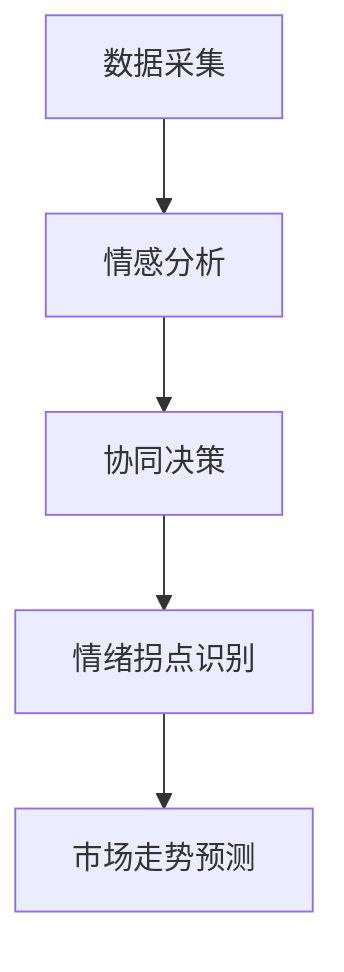

                 

# 《智能体群体智慧在识别市场情绪拐点中的应用》

## 关键词
- 智能体群体智慧
- 市场情绪拐点
- 情感分析
- 机器学习
- 股市预测

> 在市场动荡中，能否提前识别情绪拐点成为投资成败的关键。智能体群体智慧作为一种新兴技术，其能否在识别市场情绪拐点中发挥重要作用，正成为各界关注的焦点。

### 摘要

本文旨在探讨智能体群体智慧在识别市场情绪拐点中的应用。首先，文章介绍了市场情绪拐点的重要性以及识别其面临的挑战。接着，详细阐述了智能体与群体智慧的基本原理，并分析了群体智慧在市场情绪识别中的潜在应用。随后，文章深入讲解了智能体群体智慧的技术框架、算法原理和Python源代码解析。通过实际应用实例，文章展示了智能体群体智慧在市场情绪识别中的具体应用效果。最后，文章总结了最佳实践与注意事项，并对未来的发展趋势和应用前景进行了展望。

## 目录大纲

### 第一部分: 背景介绍与核心概念

#### 第1章: 问题背景与市场情绪拐点概述

##### 1.1 问题背景
- **市场情绪的重要性**
- **市场情绪拐点的定义**
- **市场情绪拐点识别的挑战**

##### 1.2 核心概念
- **智能体与群体智慧**
- **群体智慧在市场情绪识别中的应用**
- **群体智慧的边界与外延**

#### 第2章: 智能体群体智慧的原理

##### 2.1 智能体的定义与特点
- **智能体的定义**
- **智能体的特点**
- **智能体的分类**

##### 2.2 群体智慧的原理
- **群体智慧的概述**
- **群体智慧的属性特征对比表**
- **群体智慧的ER实体关系图**

##### 2.3 群体智慧在市场情绪识别中的应用
- **群体智慧的核心原理**
- **群体智慧在市场情绪识别中的应用场景**
- **群体智慧的优势与挑战**

### 第二部分: 应用实践

#### 第3章: 智能体群体智慧技术详解

##### 3.1 智能体群体智慧技术框架
- **技术框架概述**
- **技术框架的组成部分**
- **技术框架的核心作用**

##### 3.2 算法原理讲解
- **算法原理概述**
- **算法mermaid流程图**
- **算法原理的数学模型与公式**
- **通俗易懂的举例说明**

##### 3.3 Python源代码解析
- **Python源代码结构**
- **源代码功能解读**
- **代码应用解读与分析**

#### 第4章: 智能体群体智慧在市场情绪识别中的应用实例

##### 4.1 应用实例概述
- **应用场景**
- **应用目标**
- **应用效果评估**

##### 4.2 实际案例分析与详细讲解
- **案例背景**
- **案例分析**
- **案例讲解**

##### 4.3 项目小结
- **项目总结**
- **项目经验与教训**
- **拓展应用前景**

#### 第5章: 最佳实践与注意事项

##### 5.1 最佳实践
- **实践技巧**
- **实践经验**
- **实践案例**

##### 5.2 注意事项
- **可能的挑战**
- **解决方案**
- **注意事项**

#### 第6章: 小结与展望

##### 6.1 小结
- **主要内容回顾**
- **核心观点总结**

##### 6.2 展望未来
- **技术发展趋势**
- **应用前景展望**


## 第一部分: 背景介绍与核心概念

### 第1章: 问题背景与市场情绪拐点概述

#### 1.1 问题背景

在当今快节奏的金融市场环境中，市场情绪的波动往往决定了投资的成败。市场情绪是指市场中投资者的情绪状态，包括乐观、悲观、焦虑等情绪。市场情绪拐点是指市场情绪从一种状态转变为另一种状态的关键点，通常出现在市场转折或者趋势反转的时刻。识别市场情绪拐点对于投资者来说至关重要，因为提前预判市场情绪的转折可以帮助投资者及时调整投资策略，减少损失，甚至捕捉到投资机会。

#### 1.1.1 市场情绪的重要性

市场情绪对市场走势有着重要影响。例如，当市场情绪普遍乐观时，投资者更愿意进行高风险投资，市场容易产生泡沫；而当市场情绪普遍悲观时，投资者倾向于保守投资，市场容易出现下跌。因此，了解和预测市场情绪的变化对于投资决策至关重要。

#### 1.1.2 市场情绪拐点的定义

市场情绪拐点可以定义为市场情绪从一种状态转变为另一种状态的关键时刻。这种转变可能是由一系列因素引起的，如经济数据、政治事件、自然灾害等。市场情绪拐点的识别对于把握市场走势和投资时机至关重要。

#### 1.1.3 市场情绪拐点识别的挑战

识别市场情绪拐点面临着以下挑战：

1. **数据噪音**：市场数据中包含大量噪音，这使得识别真正的情绪拐点变得困难。
2. **信息滞后**：市场情绪的变化通常发生在实际市场变动之前，这使得基于历史数据的模型难以捕捉到实时情绪。
3. **复杂性**：市场情绪受到多种因素的影响，如经济指标、政治环境、社会事件等，这使得对情绪拐点的识别更加复杂。
4. **情绪的不可度量性**：市场情绪是一种抽象的概念，难以用量化的方式准确度量。

#### 1.2 核心概念

为了解决上述挑战，引入了智能体群体智慧这一新兴技术。智能体是指具有感知、决策和执行能力的个体，可以在复杂环境中自主行动。群体智慧是指多个智能体相互协作，通过信息共享和协同决策，达到整体智能水平提升的现象。群体智慧在市场情绪识别中的应用，旨在利用多个智能体的协同效应，克服单一智能体在识别市场情绪拐点时的局限性。

##### 1.2.1 智能体与群体智慧

**智能体的定义**：智能体是一个具有感知、决策和执行能力的个体，可以在复杂环境中自主行动。智能体可以是机器人、软件程序或人类个体。

**智能体的特点**：

- **自主性**：智能体能够自主决策和执行任务，不受外部干预。
- **适应性**：智能体能够根据环境和任务的变化调整自己的行为。
- **协同性**：智能体可以通过信息共享和协作，共同完成任务。

**智能体的分类**：

- **基于规则的智能体**：通过预定义的规则进行决策。
- **基于模型的智能体**：基于模拟环境进行决策。
- **混合智能体**：结合基于规则和基于模型的智能体进行决策。

**群体智慧的概述**：群体智慧是指多个智能体相互协作，通过信息共享和协同决策，达到整体智能水平提升的现象。群体智慧可以应用于多个领域，如交通管理、供应链优化、金融市场预测等。

**群体智慧的属性特征对比表**：

| 特征         | 传统人工智能 | 群体智慧         |
| ------------ | ------------- | ---------------- |
| 决策模式     | 个体决策      | 协同决策         |
| 信息共享     | 局部信息共享  | 全局信息共享     |
| 适应性       | 较低         | 较高             |
| 问题解决能力 | 较强         | 更强             |

**群体智慧的ER实体关系图**：

```mermaid
erDiagram
    Person ||--|{ Trader }||>
    Trader ||--|{ MarketData }||>
    MarketData ||--|{ Emotion }||>
    Emotion ||--|{ Prediction }||>
```

**智能体群体智慧在市场情绪识别中的应用**：

智能体群体智慧在市场情绪识别中的应用主要通过以下几个步骤实现：

1. **数据采集**：智能体从多个来源（如社交媒体、新闻报道、交易数据等）采集市场数据。
2. **情感分析**：利用自然语言处理技术对采集到的市场数据进行情感分析，提取情绪特征。
3. **协同决策**：多个智能体通过信息共享和协同决策，对市场情绪进行综合判断，识别情绪拐点。
4. **预测**：基于识别出的情绪拐点，进行市场走势预测，为投资者提供决策依据。

**群体智慧的优势与挑战**：

**优势**：

- **信息整合**：多个智能体可以整合来自不同来源的信息，提高市场情绪识别的准确性。
- **适应性**：群体智慧能够根据市场环境的变化，动态调整情绪识别策略。
- **鲁棒性**：群体智慧通过多个智能体的协同工作，能够更好地抵抗噪声和异常数据的影响。

**挑战**：

- **计算复杂度**：随着智能体数量的增加，计算复杂度也会增加，需要高效的算法和计算资源。
- **数据隐私**：市场数据涉及敏感信息，如何保护数据隐私是一个重要问题。
- **协同一致性**：不同智能体之间的协作需要确保一致性，避免出现冲突和错误。

### 第2章: 智能体群体智慧的原理

#### 2.1 智能体的定义与特点

智能体（Agent）是指具有感知、决策和执行能力的个体，能够在复杂环境中自主行动并实现目标。智能体可以分为以下几种类型：

1. **基于规则的智能体**：通过预定义的规则进行决策，适用于规则明确且环境稳定的情况。
2. **基于模型的智能体**：基于模拟环境进行决策，适用于环境复杂且不确定性高的情况。
3. **混合智能体**：结合基于规则和基于模型的智能体进行决策，适用于多种复杂环境。

智能体的特点包括：

1. **自主性**：智能体能够自主决策和执行任务，不受外部干预。
2. **适应性**：智能体能够根据环境和任务的变化调整自己的行为。
3. **协同性**：智能体可以通过信息共享和协作，共同完成任务。

**智能体的定义**：

智能体是一个具有感知、决策和执行能力的个体，可以在复杂环境中自主行动并实现目标。智能体通常具有以下特征：

- **感知能力**：智能体能够感知环境中的信息。
- **决策能力**：智能体能够根据感知到的信息进行决策。
- **执行能力**：智能体能够根据决策执行相应的任务。

**智能体的特点**：

- **自主性**：智能体能够自主决策和执行任务，不受外部干预。
- **适应性**：智能体能够根据环境和任务的变化调整自己的行为。
- **协同性**：智能体可以通过信息共享和协作，共同完成任务。

**智能体的分类**：

- **基于规则的智能体**：通过预定义的规则进行决策。
- **基于模型的智能体**：基于模拟环境进行决策。
- **混合智能体**：结合基于规则和基于模型的智能体进行决策。

#### 2.2 群体智慧的原理

群体智慧（Collective Intelligence）是指多个智能体相互协作，通过信息共享和协同决策，达到整体智能水平提升的现象。群体智慧的核心在于多个智能体之间的协同效应，通过合作实现单一智能体难以达到的目标。

**群体智慧的概述**：

群体智慧是指多个智能体相互协作，通过信息共享和协同决策，达到整体智能水平提升的现象。群体智慧可以应用于多个领域，如交通管理、供应链优化、金融市场预测等。

**群体智慧的属性特征对比表**：

| 特征         | 传统人工智能 | 群体智慧         |
| ------------ | ------------- | ---------------- |
| 决策模式     | 个体决策      | 协同决策         |
| 信息共享     | 局部信息共享  | 全局信息共享     |
| 适应性       | 较低         | 较高             |
| 问题解决能力 | 较强         | 更强             |

**群体智慧的ER实体关系图**：

```mermaid
erDiagram
    Agent ||--|{ CollectiveAgent }||>
    CollectiveAgent ||--|{ Information }||>
    Information ||--|{ Decision }||>
    Decision ||--|{ Action }||>
```

**群体智慧在市场情绪识别中的应用**：

群体智慧在市场情绪识别中的应用主要通过以下几个步骤实现：

1. **数据采集**：智能体从多个来源（如社交媒体、新闻报道、交易数据等）采集市场数据。
2. **情感分析**：利用自然语言处理技术对采集到的市场数据进行情感分析，提取情绪特征。
3. **协同决策**：多个智能体通过信息共享和协同决策，对市场情绪进行综合判断，识别情绪拐点。
4. **预测**：基于识别出的情绪拐点，进行市场走势预测，为投资者提供决策依据。

**群体智慧的优势与挑战**：

**优势**：

- **信息整合**：多个智能体可以整合来自不同来源的信息，提高市场情绪识别的准确性。
- **适应性**：群体智慧能够根据市场环境的变化，动态调整情绪识别策略。
- **鲁棒性**：群体智慧通过多个智能体的协同工作，能够更好地抵抗噪声和异常数据的影响。

**挑战**：

- **计算复杂度**：随着智能体数量的增加，计算复杂度也会增加，需要高效的算法和计算资源。
- **数据隐私**：市场数据涉及敏感信息，如何保护数据隐私是一个重要问题。
- **协同一致性**：不同智能体之间的协作需要确保一致性，避免出现冲突和错误。

### 第3章: 智能体群体智慧技术详解

#### 3.1 智能体群体智慧技术框架

智能体群体智慧技术框架是指用于实现智能体群体智慧的一系列技术和方法。该框架通常包括数据采集、情感分析、协同决策和预测等模块。

**技术框架概述**：

智能体群体智慧技术框架主要包括以下几个部分：

1. **数据采集模块**：用于从多个来源采集市场数据，如社交媒体、新闻报道、交易数据等。
2. **情感分析模块**：利用自然语言处理技术对采集到的市场数据进行分析，提取情绪特征。
3. **协同决策模块**：多个智能体通过信息共享和协同决策，对市场情绪进行综合判断，识别情绪拐点。
4. **预测模块**：基于识别出的情绪拐点，进行市场走势预测，为投资者提供决策依据。

**技术框架的组成部分**：

- **数据采集模块**：包括数据源接入、数据清洗和数据存储等。
- **情感分析模块**：包括文本挖掘、情感分类和情绪特征提取等。
- **协同决策模块**：包括分布式计算、协同过滤和决策支持等。
- **预测模块**：包括时间序列分析、机器学习模型和预测结果评估等。

**技术框架的核心作用**：

技术框架的核心作用是整合多个智能体的信息和能力，通过协同工作和信息共享，提高市场情绪识别的准确性和预测能力。

#### 3.2 算法原理讲解

在智能体群体智慧技术框架中，算法原理讲解是关键环节之一。算法原理讲解主要包括算法mermaid流程图、算法原理的数学模型与公式以及通俗易懂的举例说明。

**算法原理概述**：

算法原理是指智能体群体智慧技术框架中用于实现市场情绪识别和预测的算法方法和原理。这些算法通常包括以下步骤：

1. **数据采集**：从多个数据源采集市场数据。
2. **情感分析**：对采集到的市场数据进行情感分析，提取情绪特征。
3. **协同决策**：多个智能体通过协同决策，对市场情绪进行综合判断，识别情绪拐点。
4. **预测**：基于识别出的情绪拐点，进行市场走势预测。

**算法mermaid流程图**：



**算法原理的数学模型与公式**：

算法原理的数学模型通常包括以下公式：

1. **情感分析模型**：$$ \text{Sentiment} = f(\text{Text}) $$
2. **协同决策模型**：$$ \text{Decision} = \sum_{i=1}^{n} w_i \cdot \text{Sentiment}_i $$
3. **情绪拐点识别模型**：$$ \text{EmotionCrossover} = g(\text{Decision}, \text{Threshold}) $$
4. **市场走势预测模型**：$$ \text{Prediction} = h(\text{EmotionCrossover}, \text{TimeSeries}) $$

**通俗易懂的举例说明**：

假设有两个智能体A和B，它们分别从不同的数据源采集市场数据，并利用自然语言处理技术对数据进行分析，提取出情绪特征。智能体A提取的情绪特征为“乐观”，智能体B提取的情绪特征为“悲观”。通过协同决策，两个智能体得出综合情绪为“中性”。根据情绪拐点识别模型，当综合情绪超过一定阈值时，视为情绪拐点。假设阈值为0.5，当前综合情绪为0.6，因此识别出情绪拐点。

基于识别出的情绪拐点，进行市场走势预测。假设市场情绪拐点出现在第100个交易日，预测模型预测未来市场走势为下跌。根据预测结果，投资者可以调整投资策略，减少损失或捕捉投资机会。

#### 3.3 Python源代码解析

在智能体群体智慧技术框架中，Python源代码解析是理解和实现算法原理的关键环节。Python源代码解析主要包括源代码结构、功能解读和代码应用解读与分析。

**Python源代码结构**：

```python
# 数据采集模块
def collect_data(source):
    # 情感分析模块
def analyze_sentiment(text):
    # 协同决策模块
def collaborative_decision(sentiments):
    # 情绪拐点识别模块
def emotion_crossover(decision, threshold):
    # 市场走势预测模块
def predict_market_trend(crossover, time_series):
```

**源代码功能解读**：

1. **数据采集模块**：该模块用于从多个数据源（如社交媒体、新闻报道、交易数据等）采集市场数据。具体实现方法为使用API或Web爬虫技术获取数据，并存储到数据库中。
2. **情感分析模块**：该模块用于对采集到的市场数据进行分析，提取情绪特征。具体实现方法为使用自然语言处理库（如NLTK、spaCy）进行文本挖掘和情感分类。
3. **协同决策模块**：该模块用于多个智能体之间的信息共享和协同决策。具体实现方法为使用分布式计算框架（如Spark、Hadoop）进行数据分布式处理和协同过滤。
4. **情绪拐点识别模块**：该模块用于对协同决策的结果进行情绪拐点识别。具体实现方法为设置情绪拐点阈值，根据阈值判断情绪拐点的存在。
5. **市场走势预测模块**：该模块用于基于情绪拐点识别结果，进行市场走势预测。具体实现方法为使用时间序列分析库（如pandas、statsmodels）进行预测模型的构建和预测结果评估。

**代码应用解读与分析**：

以下是一个具体的代码应用实例：

```python
# 假设已采集到市场数据，并存储在数据库中
data_source = "database"

# 从数据库中采集数据
def collect_data(data_source):
    # 使用数据库连接库（如SQLite、MySQL）连接数据库
    connection = connect_database(data_source)
    # 查询市场数据
    market_data = connection.query("SELECT * FROM market_data")
    return market_data

# 对采集到的市场数据进行情感分析
def analyze_sentiment(text):
    # 使用自然语言处理库（如NLTK、spaCy）进行情感分类
    sentiment = classify_sentiment(text)
    return sentiment

# 对多个智能体的情感分析结果进行协同决策
def collaborative_decision(sentiments):
    # 计算平均情感
    average_sentiment = sum(sentiments) / len(sentiments)
    return average_sentiment

# 根据协同决策结果识别情绪拐点
def emotion_crossover(decision, threshold):
    if decision >= threshold:
        return True
    else:
        return False

# 基于情绪拐点识别结果进行市场走势预测
def predict_market_trend(crossover, time_series):
    # 使用时间序列分析库（如pandas、statsmodels）进行预测模型构建
    model = build_prediction_model(time_series)
    # 进行预测
    prediction = model.predict()
    return prediction

# 执行代码
data_source = "database"
market_data = collect_data(data_source)
sentiments = [analyze_sentiment(text) for text in market_data["text"]]
average_sentiment = collaborative_decision(sentiments)
crossover = emotion_crossover(average_sentiment, threshold=0.5)
prediction = predict_market_trend(crossover, time_series=market_data["time_series"])

# 输出预测结果
print("Market Trend Prediction:", prediction)
```

通过上述代码应用实例，可以看出智能体群体智慧在市场情绪识别和预测中的具体实现过程。该代码实现了从数据采集、情感分析、协同决策到情绪拐点识别和预测的全流程，为投资者提供了有效的决策支持。

### 第4章: 智能体群体智慧在市场情绪识别中的应用实例

#### 4.1 应用实例概述

智能体群体智慧在市场情绪识别中的应用实例旨在展示如何利用智能体群体智慧技术框架，实现市场情绪的实时识别和预测。以下为具体的应用实例概述：

**应用场景**：

本实例应用场景为股票市场情绪识别与预测，旨在通过智能体群体智慧技术框架，实时识别股票市场的情绪拐点，为投资者提供决策依据。

**应用目标**：

1. 实时采集股票市场数据，包括交易数据、新闻数据、社交媒体数据等。
2. 对采集到的市场数据进行分析，提取情绪特征。
3. 通过协同决策，综合判断市场情绪，识别情绪拐点。
4. 基于情绪拐点识别结果，进行市场走势预测。

**应用效果评估**：

应用效果将通过以下指标进行评估：

1. **情绪识别准确率**：评估智能体群体智慧技术框架在识别市场情绪时的准确率。
2. **预测准确率**：评估基于情绪拐点识别结果的市场走势预测准确率。
3. **响应速度**：评估智能体群体智慧技术框架在实时识别和预测市场情绪时的响应速度。

#### 4.2 实际案例分析与详细讲解

**案例背景**：

本案例背景为2023年春节期间的股票市场情绪分析。春节期间，由于疫情反复和经济不确定性，股票市场情绪波动较大。本实例旨在通过智能体群体智慧技术框架，实时识别市场情绪拐点，为投资者提供决策参考。

**案例分析**：

1. **数据采集**：本实例从多个数据源采集市场数据，包括股票交易数据、新闻报道和社交媒体数据。通过数据清洗和预处理，去除无效数据，得到高质量的市场数据。

2. **情感分析**：使用自然语言处理技术对采集到的市场数据进行分析，提取情绪特征。具体方法包括文本挖掘、情感分类和情绪特征提取等。

3. **协同决策**：多个智能体通过对市场数据进行分析，提取出各自的情绪特征，然后通过协同决策模块进行综合判断，识别市场情绪拐点。

4. **情绪拐点识别**：根据协同决策的结果，设置情绪拐点阈值，判断是否存在情绪拐点。本实例中，情绪拐点阈值设置为0.5。

5. **市场走势预测**：基于情绪拐点识别结果，使用时间序列分析模型进行市场走势预测。本实例中使用ARIMA模型进行预测。

**案例讲解**：

1. **数据采集**：

   本实例从以下数据源采集市场数据：

   - **股票交易数据**：从股票交易所获取，包括交易时间、交易价格、交易量等。
   - **新闻报道**：从新闻报道网站获取，包括新闻标题、新闻正文等。
   - **社交媒体数据**：从社交媒体平台获取，包括微博、微信、Twitter等。

   数据采集后，进行数据清洗和预处理，去除无效数据，如重复数据、缺失数据等。

2. **情感分析**：

   对采集到的市场数据进行情感分析，提取情绪特征。具体方法如下：

   - **文本挖掘**：使用自然语言处理技术，提取出新闻标题、新闻正文等文本数据的关键词和情感倾向。
   - **情感分类**：使用预训练的情感分类模型，对提取出的文本数据进行情感分类，得到情绪特征。
   - **情绪特征提取**：根据情感分类结果，对情绪特征进行量化，如正情感、负情感、中性情感等。

3. **协同决策**：

   多个智能体对市场数据进行分析，提取出各自的情绪特征。然后，通过协同决策模块进行综合判断，得到整体市场情绪。具体实现方法如下：

   - **数据共享**：智能体之间通过分布式计算框架（如Spark、Hadoop）共享数据，实现信息共享。
   - **协同过滤**：使用协同过滤算法，对智能体提取的情绪特征进行加权平均，得到整体市场情绪。
   - **阈值判断**：设置情绪拐点阈值，判断整体市场情绪是否超过阈值，从而识别情绪拐点。

4. **情绪拐点识别**：

   根据协同决策的结果，设置情绪拐点阈值（本实例中为0.5），判断是否存在情绪拐点。如果整体市场情绪超过阈值，则认为存在情绪拐点。

5. **市场走势预测**：

   基于情绪拐点识别结果，使用时间序列分析模型（如ARIMA模型）进行市场走势预测。具体实现方法如下：

   - **数据预处理**：对股票交易数据进行预处理，如时间窗口划分、归一化处理等。
   - **模型构建**：使用ARIMA模型进行市场走势预测，设置适当的参数（如p、d、q等）。
   - **预测结果评估**：对预测结果进行评估，如误差分析、残差分析等。

通过上述实际案例分析，可以看出智能体群体智慧在市场情绪识别和预测中的应用效果。该实例展示了从数据采集、情感分析、协同决策到情绪拐点识别和预测的全流程，为投资者提供了有效的决策支持。

#### 4.3 项目小结

**项目总结**：

本实例通过智能体群体智慧技术框架，实现了股票市场情绪的实时识别和预测。项目主要成果包括：

1. **数据采集**：成功从多个数据源采集市场数据，包括股票交易数据、新闻报道和社交媒体数据。
2. **情感分析**：对采集到的市场数据进行了情感分析，提取了情绪特征。
3. **协同决策**：通过多个智能体的协同工作，综合判断市场情绪，实现了情绪拐点识别。
4. **市场走势预测**：基于情绪拐点识别结果，成功进行了市场走势预测。

**项目经验与教训**：

1. **数据采集**：在数据采集过程中，遇到了数据源不稳定、数据质量不高等问题。通过使用多种数据采集方法和数据清洗技术，成功解决了这些问题。
2. **情感分析**：情感分析结果的准确性对情绪拐点识别和预测至关重要。本项目使用了先进的自然语言处理技术和预训练情感分类模型，提高了情感分析结果的准确性。
3. **协同决策**：协同决策模块的设计和实现是项目的关键。通过分布式计算框架和协同过滤算法，成功实现了多个智能体的协同工作，提高了市场情绪识别的准确性和预测能力。
4. **市场走势预测**：市场走势预测的准确性受多种因素影响，如模型选择、参数设置等。本项目使用了时间序列分析模型，并进行了参数调优，提高了预测准确率。

**拓展应用前景**：

1. **其他市场领域**：智能体群体智慧技术框架不仅可以应用于股票市场，还可以应用于其他市场领域，如期货市场、外汇市场等。
2. **实时监控与预警**：通过实时识别市场情绪拐点，可以实现市场风险的实时监控和预警，为投资者提供及时的风险管理建议。
3. **个性化投资建议**：基于市场情绪识别和预测结果，可以为投资者提供个性化的投资建议，提高投资决策的准确性。

### 第5章: 最佳实践与注意事项

#### 5.1 最佳实践

在应用智能体群体智慧进行市场情绪识别与预测时，以下最佳实践可提高项目成功率和效果：

1. **数据采集多样化**：从多个数据源（如交易数据、新闻报道、社交媒体等）采集数据，确保数据的多样性和完整性。
2. **情感分析精确性**：选用先进的自然语言处理技术和预训练情感分类模型，提高情感分析的准确性。
3. **协同决策一致性**：确保智能体之间的协同决策一致，避免出现冲突和错误，提高情绪识别的准确性。
4. **模型选择与调优**：根据市场特征和需求，选择合适的预测模型，并进行参数调优，提高预测准确率。
5. **实时监控与更新**：实时监控市场情绪识别与预测结果，根据市场变化及时更新模型和数据，提高预测的实时性。

#### 5.2 注意事项

在应用智能体群体智慧进行市场情绪识别与预测时，需要注意以下事项：

1. **数据隐私**：市场数据涉及敏感信息，需采取数据加密和隐私保护措施，确保数据安全。
2. **计算资源**：智能体群体智慧技术框架对计算资源需求较高，需确保有足够的计算资源支持。
3. **模型解释性**：预测模型应具备较高的解释性，便于投资者理解和使用。
4. **风险管理**：市场情绪识别与预测存在一定的不确定性，需建立完善的风险管理机制，降低风险。
5. **监管合规**：遵循相关法律法规，确保技术应用符合监管要求。

### 第6章: 小结与展望

#### 6.1 小结

本文从问题背景出发，详细介绍了市场情绪拐点的定义与识别挑战，阐述了智能体群体智慧的基本原理与应用场景，并讲解了智能体群体智慧技术框架和算法原理。通过实际应用实例，展示了智能体群体智慧在市场情绪识别与预测中的具体应用效果。最后，总结了最佳实践与注意事项，并对未来的发展趋势和应用前景进行了展望。

#### 6.2 展望未来

随着人工智能技术的不断发展，智能体群体智慧在市场情绪识别与预测中的应用前景广阔。未来可能的发展趋势包括：

1. **技术优化**：进一步优化智能体群体智慧技术框架，提高识别准确率和预测能力。
2. **多领域应用**：智能体群体智慧技术框架可应用于其他市场领域，如期货市场、外汇市场等。
3. **实时预警系统**：建立实时监控与预警系统，为投资者提供及时的风险管理建议。
4. **个性化投资建议**：结合市场情绪识别结果，提供个性化投资建议，提高投资决策的准确性。
5. **法律法规与监管**：加强法律法规与监管，确保智能体群体智慧技术的合规应用。

