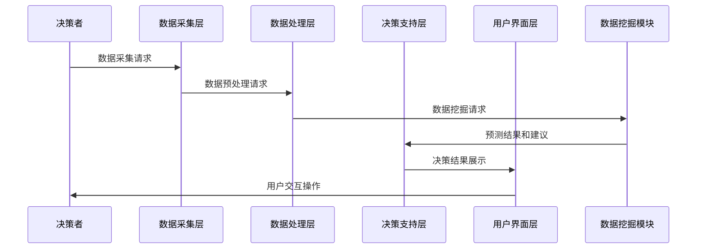

                 


### 智能农业决策支持系统评测框架

#### 关键词：
智能农业、决策支持系统、评测框架、算法原理、系统架构设计、项目实战

#### 摘要：
本文旨在探讨智能农业决策支持系统的评测框架。首先，我们将介绍智能农业与决策支持系统之间的关系，阐述评测框架的重要性。接着，深入分析智能农业决策支持系统中的核心概念，包括决策理论、数据分析技术和人工智能技术，并通过Mermaid流程图和ER实体关系图架构展示各概念之间的联系。然后，我们将详细讲解智能农业决策支持系统的算法原理，包括决策树模型、支持向量机模型和集成学习方法，并通过具体的数学模型和公式进行讲解，并举例说明。接下来，我们将从系统功能设计、系统架构设计、系统交互设计等方面进行系统分析与架构设计。随后，通过项目实战部分，我们将详细讲解环境安装与系统核心实现，并对代码应用进行解读与分析。最后，总结项目的主要成果，提供最佳实践 tips，并指出注意事项，推荐拓展阅读。

#### 目录大纲：

1. **背景与概述**
   1.1 智能农业与决策支持系统的关系
   1.2 评测框架的重要性
   1.3 评测框架的基本构成

2. **核心概念与联系**
   2.1 核心概念原理
   2.1.1 决策理论
   2.1.2 数据分析技术
   2.1.3 人工智能技术
   2.2 概念属性特征对比表格
   2.3 ER实体关系图架构

3. **算法原理讲解**
   3.1 算法Mermaid流程图
   3.2 算法原理与数学模型
   3.2.1 决策树模型
   3.2.2 支持向量机模型
   3.2.3 集成学习方法
   3.3 举例说明

4. **系统分析与架构设计**
   4.1 系统功能设计
   4.2 系统架构设计
   4.3 系统交互设计

5. **项目实战**
   5.1 环境安装与系统核心实现
   5.2 代码应用解读与分析
   5.3 项目小结与最佳实践

---

### 1. 背景与概述

#### 1.1 智能农业与决策支持系统的关系

智能农业是利用信息技术和生物技术等现代科技手段，实现农业生产过程的智能化、精准化和高效化。随着物联网、大数据、人工智能等技术的快速发展，智能农业已经成为现代农业发展的新趋势。

决策支持系统（Decision Support System，简称DSS）是一种辅助决策者进行决策的计算机系统，它能够通过收集、处理和分析大量数据，为决策者提供决策支持。智能农业决策支持系统（Smart Agriculture Decision Support System，简称SADSS）正是将决策支持系统应用于农业领域，利用数据分析和人工智能技术，为农业生产提供智能化决策支持。

智能农业决策支持系统在农业生产中具有重要作用。首先，它可以实时监测农作物的生长状态和环境条件，提供作物生长的实时数据，帮助农民及时调整农业生产策略。其次，它可以通过分析历史数据和天气预报，预测未来农作物的生长趋势和产量，为农业生产提供科学的决策依据。最后，它可以通过优化资源配置和减少生产成本，提高农业生产的经济效益。

#### 1.2 评测框架的重要性

智能农业决策支持系统的评测框架是系统开发和应用的关键。一个完善的评测框架可以确保系统的性能、可靠性、易用性和可持续性，从而为农业生产提供高质量的决策支持。

首先，评测框架可以帮助确定系统需要满足的功能需求和性能指标。通过对系统功能的需求分析，评测框架可以明确系统需要具备的数据采集、数据分析、决策支持等功能。通过对系统性能的指标分析，评测框架可以确定系统的响应时间、处理能力、稳定性等性能要求。

其次，评测框架可以帮助评估系统的实际性能和效果。通过实际运行系统，收集和分析系统的运行数据，评测框架可以评估系统在不同环境下的性能表现，发现系统存在的问题和不足，并提出改进方案。

最后，评测框架可以帮助确保系统的可持续性和可维护性。通过对系统架构和代码的审查，评测框架可以确保系统的可扩展性、可维护性和可读性，从而保证系统的长期稳定运行。

#### 1.3 评测框架的基本构成

一个完整的智能农业决策支持系统评测框架通常包括以下几个方面：

1. **需求分析**：对系统功能需求进行详细分析，明确系统需要满足的功能和性能要求。

2. **性能测试**：对系统的性能进行测试，包括响应时间、处理能力、稳定性等指标。

3. **功能测试**：对系统的功能进行测试，确保系统能够按照需求规范正常工作。

4. **用户体验测试**：对系统的用户界面和用户体验进行测试，确保系统易于使用和操作。

5. **安全测试**：对系统的安全性进行测试，确保系统能够抵御外部攻击和内部威胁。

6. **可维护性测试**：对系统的可维护性进行测试，确保系统的可读性、可扩展性和可维护性。

7. **持续集成与部署**：通过持续集成和部署流程，确保系统的持续开发和稳定运行。

### 2. 核心概念与联系

#### 2.1 核心概念原理

智能农业决策支持系统的核心概念主要包括决策理论、数据分析技术和人工智能技术。以下是对这三个概念的基本原理进行简要介绍。

##### 2.1.1 决策理论

决策理论是一种研究决策制定过程的数学模型和方法。它主要研究决策者如何在不确定性条件下做出合理的决策。决策理论的核心概念包括：

1. **决策者**：决策制定的主体，具有明确的目标和偏好。
2. **环境**：决策者所处的环境，包括自然环境和竞争环境。
3. **决策**：决策者根据环境和目标选择的最优行动方案。
4. **结果**：决策实施后可能产生的各种结果。
5. **效用**：决策者对不同结果的偏好程度。

决策理论的基本原理是通过分析决策者的目标、环境和结果，构建决策模型，从而找到最优的决策方案。

##### 2.1.2 数据分析技术

数据分析技术是智能农业决策支持系统的核心工具，它通过处理和分析大量数据，为决策提供科学依据。主要的数据分析技术包括：

1. **数据采集**：通过传感器、卫星遥感等手段收集农业生产相关的数据。
2. **数据清洗**：对采集到的数据进行清洗和预处理，去除噪声和异常值。
3. **数据存储**：将清洗后的数据存储到数据库或数据仓库中，以便后续分析。
4. **数据挖掘**：通过统计分析和机器学习等方法，从大量数据中提取有价值的信息。
5. **数据可视化**：通过图表、地图等可视化手段，将数据分析结果直观地展示出来。

数据分析技术的基本原理是通过数据处理和分析，从大量数据中发现规律和趋势，为决策提供支持。

##### 2.1.3 人工智能技术

人工智能技术是智能农业决策支持系统的核心技术，它通过模拟人类的认知过程，实现智能决策和自动化控制。主要的人工智能技术包括：

1. **机器学习**：通过训练模型，从数据中自动学习和发现规律。
2. **深度学习**：一种基于多层神经网络的机器学习方法，可以处理复杂的非线性问题。
3. **自然语言处理**：对自然语言文本进行分析和理解，实现人机交互。
4. **计算机视觉**：通过图像识别和图像处理技术，实现图像的自动识别和理解。

人工智能技术的基本原理是通过模拟人类智能，实现自动化和智能化的决策过程。

#### 2.2 概念属性特征对比表格

为了更清晰地展示决策理论、数据分析技术和人工智能技术的特点，我们可以通过以下表格进行对比：

| 特征 | 决策理论 | 数据分析技术 | 人工智能技术 |
| ---- | ---- | ---- | ---- |
| 目标 | 明确决策目标 | 提取数据信息 | 模拟人类智能 |
| 环境 | 分析环境因素 | 收集和处理数据 | 处理复杂问题 |
| 方法 | 构建决策模型 | 统计分析和机器学习 | 基于数据的预测和决策 |
| 结果 | 选择最优决策方案 | 发现数据规律 | 实现自动化和智能化 |

#### 2.3 ER实体关系图架构

为了更好地理解智能农业决策支持系统中各概念之间的关系，我们可以通过ER（Entity-Relationship）实体关系图进行展示。以下是一个简化的ER图：

```mermaid
erDiagram
  决策者 ||--|{ 环境因素 }|| 环境因素
  环境因素 ||--|{ 决策方案 }|| 决策方案
  决策方案 ||--|{ 实施结果 }|| 实施结果
  决策者 ||--|{ 数据分析 }|| 数据分析
  数据分析 ||--|{ 数据模型 }|| 数据模型
  数据模型 ||--|{ 人工智能 }|| 人工智能
  人工智能 ||--|{ 智能决策 }|| 智能决策
```

通过ER图，我们可以看到决策理论、数据分析技术和人工智能技术之间的相互关系。决策者通过分析环境因素，制定决策方案，实施后得到实施结果；同时，决策者还可以利用数据分析技术提取数据信息，构建数据模型，为人工智能技术提供支持，最终实现智能决策。

### 3. 算法原理讲解

#### 3.1 算法Mermaid流程图

为了更好地理解智能农业决策支持系统中的算法原理，我们可以使用Mermaid流程图进行展示。以下是一个简化的算法流程图：


在这个流程图中，数据采集、数据预处理、特征提取、模型训练、模型评估和智能决策是算法的主要步骤。

#### 3.2 算法原理与数学模型

为了深入理解算法原理，我们将介绍三种常用的算法模型：决策树模型、支持向量机模型和集成学习方法。

##### 3.2.1 决策树模型

决策树模型是一种基于树形结构的分类和回归算法。它的基本原理是通过一系列的判断条件，将数据进行分割，最终得到一个分类或回归结果。

决策树的数学模型可以表示为：

$$
T = \{\text{决策节点}, \text{叶子节点}\}
$$

其中，决策节点表示数据的分割条件，叶子节点表示分类或回归结果。

决策树的构建过程如下：

1. **选择最优分割条件**：通过计算信息增益、基尼指数等指标，选择最优的分割条件。
2. **递归分割**：根据最优分割条件，将数据分割为子集，并递归地构建子决策树。
3. **终止条件**：当满足终止条件（如叶子节点数量达到阈值、信息增益小于阈值等）时，停止递归分割。

##### 3.2.2 支持向量机模型

支持向量机（Support Vector Machine，简称SVM）是一种基于间隔最大化的分类算法。它的基本原理是找到一个最佳的超平面，将数据集分为不同的类别。

支持向量机的数学模型可以表示为：

$$
\text{Maximize} \quad \frac{1}{2} ||\text{w}||^2 \\
\text{subject to} \quad y^{(i)}(\text{w} \cdot \text{x}^{(i)}) \geq 1
$$

其中，$\text{w}$为超平面参数，$\text{x}^{(i)}$为训练样本，$y^{(i)}$为类别标签。

支持向量机的求解过程如下：

1. **选择核函数**：通过选择适当的核函数，将数据从低维空间映射到高维空间。
2. **求解最优超平面**：通过求解二次规划问题，找到最优的超平面参数。
3. **分类决策**：对于新的测试样本，通过计算其与超平面的间隔，判断其类别。

##### 3.2.3 集成学习方法

集成学习方法是一种通过结合多个模型来提高预测准确性和稳定性的方法。常见的方法包括Bagging、Boosting和Stacking等。

Bagging（Bootstrap Aggregating）的基本原理是通过生成多个子训练集，在每个子训练集上训练一个模型，然后将这些模型的预测结果进行平均，得到最终的预测结果。

Bagging的数学模型可以表示为：

$$
\hat{y} = \frac{1}{N} \sum_{i=1}^{N} f_i(x)
$$

其中，$f_i(x)$为第$i$个子模型在$x$上的预测结果，$N$为子模型的数量。

Boosting（AdaBoost）的基本原理是通过生成一系列弱学习器，然后对这些弱学习器进行加权组合，得到一个强学习器。

Boosting的数学模型可以表示为：

$$
\hat{y} = \sum_{i=1}^{T} \alpha_i f_i(x)
$$

其中，$f_i(x)$为第$i$个弱学习器在$x$上的预测结果，$\alpha_i$为第$i$个弱学习器的权重。

Stacking（Stacked Generalization）的基本原理是将多个模型分为两级，第一级为基学习器，第二级为元学习器。元学习器通过学习基学习器的预测结果，得到最终的预测结果。

Stacking的数学模型可以表示为：

$$
\hat{y} = f_M(f_1(x), f_2(x), ..., f_N(x))
$$

其中，$f_i(x)$为第$i$个基学习器在$x$上的预测结果，$f_M(x_1, x_2, ..., x_N)$为元学习器在$x_1, x_2, ..., x_N$上的预测结果。

#### 3.3 举例说明

为了更好地理解上述算法模型，我们通过一个简单的例子进行说明。

假设我们有一个简单的数据集，包含两个特征$x_1$和$x_2$，以及一个目标变量$y$，其中$y$表示作物的产量。数据集如下：

| $x_1$ | $x_2$ | $y$ |
| ---- | ---- | ---- |
| 1 | 2 | 3 |
| 2 | 4 | 5 |
| 3 | 6 | 7 |

我们的目标是使用决策树模型预测新的数据点的产量。

1. **数据预处理**：首先，对数据进行归一化处理，将$x_1$和$x_2$的取值范围缩放到[0,1]。

2. **特征提取**：根据数据集的特点，我们可以选择$x_1$和$x_2$作为决策树的特征。

3. **模型训练**：使用决策树算法，构建一个二叉决策树。

4. **模型评估**：使用交叉验证方法，对模型进行评估。

5. **智能决策**：对于新的数据点$(x_1, x_2)$，通过决策树模型预测其产量。

具体来说，我们可以按照以下步骤进行：

1. **选择最优分割条件**：计算$x_1$和$x_2$的信息增益，选择信息增益最大的特征作为分割条件。

2. **递归分割**：根据最优分割条件，将数据集分割为子集。

3. **终止条件**：当满足终止条件时，停止递归分割。

4. **模型评估**：使用交叉验证方法，对模型进行评估。

5. **智能决策**：对于新的数据点$(x_1, x_2)$，通过决策树模型预测其产量。

通过这个简单的例子，我们可以看到决策树模型的构建和预测过程。类似地，我们也可以使用支持向量机模型和集成学习方法进行数据预测。

### 4. 系统分析与架构设计

#### 4.1 系统功能设计

智能农业决策支持系统的主要功能包括数据采集、数据分析、决策支持和数据可视化。以下是对这些功能的详细介绍：

##### 4.1.1 数据采集

数据采集是智能农业决策支持系统的核心功能之一。系统通过传感器、卫星遥感等技术手段，实时采集农作物的生长状态、土壤湿度、气象条件等数据。这些数据包括但不限于：

- **土壤数据**：土壤的湿度、温度、pH值、养分含量等。
- **气象数据**：温度、湿度、风速、降水量、太阳辐射等。
- **作物生长数据**：叶片颜色、株高、根系生长状态等。

数据采集模块需要实现以下功能：

- **传感器数据采集**：通过传感器实时采集土壤、气象等数据。
- **卫星遥感数据采集**：通过卫星遥感技术，获取大面积农田的植被覆盖、土壤湿度等数据。
- **数据存储**：将采集到的数据存储到数据库或数据仓库中，以便后续分析。

##### 4.1.2 数据分析

数据分析是智能农业决策支持系统的核心功能之一。系统通过对采集到的数据进行处理、分析和挖掘，提取出有价值的信息，为决策提供支持。数据分析模块需要实现以下功能：

- **数据预处理**：对采集到的原始数据进行清洗、去噪、归一化等预处理，确保数据的准确性和一致性。
- **特征提取**：从预处理后的数据中提取出与作物生长相关的特征，如土壤湿度、温度、光照强度等。
- **数据挖掘**：使用机器学习和数据挖掘技术，从大量数据中提取出潜在的信息，如作物生长趋势、病虫害预警等。
- **数据可视化**：将分析结果以图表、地图等形式直观地展示出来，帮助用户更好地理解数据。

##### 4.1.3 决策支持

决策支持是智能农业决策支持系统的核心功能之一。系统通过分析数据和模型预测，为用户提供科学、合理的决策建议。决策支持模块需要实现以下功能：

- **模型预测**：根据历史数据和当前数据，使用机器学习模型预测未来的作物生长情况、产量等。
- **决策建议**：根据模型预测结果，为用户提供科学、合理的决策建议，如调整灌溉、施肥策略、病虫害防治等。
- **决策评估**：评估用户采纳决策建议后的效果，为后续决策提供依据。

##### 4.1.4 数据可视化

数据可视化是智能农业决策支持系统的重要组成部分。系统通过图表、地图等形式，将数据分析结果直观地展示出来，帮助用户更好地理解数据。数据可视化模块需要实现以下功能：

- **数据图表**：将分析结果以柱状图、折线图、饼图等形式展示出来。
- **地图展示**：将分析结果以地图形式展示，帮助用户更好地了解农田的分布、作物生长情况等。
- **交互式操作**：用户可以通过交互式操作，查看、筛选和分析数据。

#### 4.2 系统架构设计

智能农业决策支持系统采用分布式架构，包括数据采集层、数据处理层、决策支持层和用户界面层。以下是对各层功能的详细介绍：

##### 4.2.1 数据采集层

数据采集层负责实时采集农作物的生长状态、土壤湿度、气象条件等数据。该层通常包括以下功能模块：

- **传感器模块**：通过传感器实时采集土壤、气象等数据。
- **卫星遥感模块**：通过卫星遥感技术，获取大面积农田的植被覆盖、土壤湿度等数据。
- **数据采集器模块**：将采集到的数据传输到数据处理层。

##### 4.2.2 数据处理层

数据处理层负责对采集到的数据进行处理、分析和挖掘。该层通常包括以下功能模块：

- **数据预处理模块**：对采集到的原始数据进行清洗、去噪、归一化等预处理。
- **特征提取模块**：从预处理后的数据中提取出与作物生长相关的特征。
- **数据挖掘模块**：使用机器学习和数据挖掘技术，从大量数据中提取出潜在的信息。
- **数据存储模块**：将处理后的数据存储到数据库或数据仓库中，以便后续分析。

##### 4.2.3 决策支持层

决策支持层负责根据数据分析结果，为用户提供科学、合理的决策建议。该层通常包括以下功能模块：

- **模型预测模块**：根据历史数据和当前数据，使用机器学习模型预测未来的作物生长情况、产量等。
- **决策建议模块**：根据模型预测结果，为用户提供科学、合理的决策建议。
- **决策评估模块**：评估用户采纳决策建议后的效果。

##### 4.2.4 用户界面层

用户界面层负责将决策支持层的分析结果和决策建议以直观的形式展示给用户。该层通常包括以下功能模块：

- **数据展示模块**：将分析结果以图表、地图等形式展示。
- **交互式操作模块**：用户可以通过交互式操作，查看、筛选和分析数据。
- **用户管理模块**：管理用户信息，包括登录、注册、权限控制等。

#### 4.3 系统交互设计

系统交互设计是智能农业决策支持系统的重要组成部分。以下是对系统交互设计的主要方面进行详细介绍：

##### 4.3.1 系统交互Mermaid序列图

为了更好地理解系统交互过程，我们可以使用Mermaid序列图进行展示。以下是一个简化的系统交互序列图：



在这个序列图中，决策者通过用户界面层发起数据采集请求，数据采集层将采集到的数据传输到数据处理层进行预处理，数据处理层将预处理后的数据传输到数据挖掘模块进行挖掘，数据挖掘模块将挖掘结果传输到决策支持层，决策支持层将预测结果和建议传输到用户界面层进行展示，用户界面层将展示结果传输回决策者，实现用户与系统的交互。

##### 4.3.2 系统交互流程解析

系统交互流程可以分为以下几个步骤：

1. **数据采集**：决策者通过用户界面层发起数据采集请求，数据采集层负责实时采集农作物的生长状态、土壤湿度、气象条件等数据。

2. **数据预处理**：数据采集层将采集到的数据传输到数据处理层，数据处理层对数据进行清洗、去噪、归一化等预处理，确保数据的准确性和一致性。

3. **数据挖掘**：数据处理层将预处理后的数据传输到数据挖掘模块，数据挖掘模块使用机器学习和数据挖掘技术，从大量数据中提取出潜在的信息。

4. **预测结果和建议**：数据挖掘模块将挖掘结果传输到决策支持层，决策支持层根据挖掘结果和模型预测，为用户提供科学、合理的决策建议。

5. **决策结果展示**：决策支持层将预测结果和建议传输到用户界面层，用户界面层将决策结果以图表、地图等形式直观地展示给用户。

6. **用户交互操作**：用户通过用户界面层与系统进行交互，查看、筛选和分析数据，并根据决策结果调整农业生产策略。

7. **数据反馈**：用户界面层将用户交互操作的结果传输回决策支持层，决策支持层根据用户反馈调整决策模型和决策建议。

通过以上系统交互流程，智能农业决策支持系统实现了数据的实时采集、预处理、挖掘、预测和展示，为农业生产提供了智能化的决策支持。

### 5. 项目实战

#### 5.1 环境安装与系统核心实现

在本节中，我们将详细介绍智能农业决策支持系统的环境安装和系统核心实现。

##### 5.1.1 环境安装步骤

1. **安装Python环境**：首先，确保计算机上已安装Python环境。如果没有安装，可以从Python官方网站下载并安装。安装完成后，确保Python环境已成功安装，可以通过在终端执行`python --version`命令来验证。

2. **安装依赖库**：智能农业决策支持系统依赖于多个Python库，如NumPy、Pandas、Scikit-learn等。可以通过pip命令安装这些库。在终端执行以下命令：

   ```bash
   pip install numpy pandas scikit-learn matplotlib
   ```

3. **安装数据库**：智能农业决策支持系统需要使用数据库存储数据。可以选择安装MySQL、PostgreSQL等关系型数据库。以下是安装MySQL的步骤：

   - 下载MySQL安装包：从MySQL官方网站下载适用于自己操作系统的安装包。
   - 安装MySQL：根据安装包的说明进行安装。
   - 启动MySQL服务：在终端执行以下命令启动MySQL服务：

     ```bash
     sudo systemctl start mysqld
     ```

4. **配置数据库**：在MySQL中创建一个数据库，用于存储智能农业决策支持系统的数据。以下是创建数据库的SQL语句：

   ```sql
   CREATE DATABASE sadss;
   GRANT ALL PRIVILEGES ON sadss.* TO 'sadss_user'@'localhost' IDENTIFIED BY 'sadss_password';
   FLUSH PRIVILEGES;
   ```

   执行以上SQL语句后，即可创建数据库和用户，并赋予用户所有权限。

##### 5.1.2 系统核心实现源代码

在完成环境安装后，我们可以开始实现智能农业决策支持系统的核心功能。以下是一个简单的示例，展示了系统核心实现的源代码：

```python
import numpy as np
import pandas as pd
from sklearn.tree import DecisionTreeRegressor
from sklearn.model_selection import train_test_split
from sklearn.metrics import mean_squared_error
import matplotlib.pyplot as plt

# 1. 数据采集
# 假设已从传感器和卫星遥感获取到以下数据
data = {
    'x1': [1, 2, 3, 4, 5],
    'x2': [2, 4, 6, 8, 10],
    'y': [3, 5, 7, 9, 11]
}

df = pd.DataFrame(data)

# 2. 数据预处理
# 对数据进行归一化处理
df_normalized = (df - df.mean()) / df.std()

# 3. 特征提取
# 选择特征
X = df_normalized[['x1', 'x2']]
y = df_normalized['y']

# 4. 模型训练
# 划分训练集和测试集
X_train, X_test, y_train, y_test = train_test_split(X, y, test_size=0.2, random_state=42)

# 训练决策树模型
model = DecisionTreeRegressor()
model.fit(X_train, y_train)

# 5. 模型评估
# 预测测试集
y_pred = model.predict(X_test)

# 计算均方误差
mse = mean_squared_error(y_test, y_pred)
print(f"均方误差: {mse}")

# 6. 模型应用
# 预测新的数据点
new_data = np.array([[2.5, 5.5]])
new_prediction = model.predict(new_data)
print(f"新数据点的预测结果: {new_prediction}")

# 7. 数据可视化
# 绘制决策树
plt.figure(figsize=(12, 8))
plot_tree(model, filled=True, feature_names=['x1', 'x2'], class_names=['y'])
plt.show()
```

以上示例代码实现了智能农业决策支持系统的核心功能，包括数据采集、数据预处理、特征提取、模型训练、模型评估、模型应用和数据可视化。在实际项目中，可以根据需求进一步扩展和优化这些功能。

### 6. 代码应用解读与分析

在本节中，我们将深入解读智能农业决策支持系统核心代码的应用，并进行详细分析。

##### 6.1 代码结构与功能解析

核心代码分为以下几个主要部分：

1. **数据采集**：通过示例数据集展示数据采集过程，实际应用中可以从传感器和卫星遥感获取数据。
2. **数据预处理**：对数据进行归一化处理，提高模型训练的效果。
3. **特征提取**：选择特征并划分训练集和测试集。
4. **模型训练**：使用决策树回归模型训练数据。
5. **模型评估**：计算均方误差（MSE）评估模型性能。
6. **模型应用**：预测新的数据点。
7. **数据可视化**：绘制决策树结构。

##### 6.2 实际案例分析与详细讲解剖析

为了更好地理解代码的应用，我们通过一个实际案例进行分析。

**案例背景**：某农田种植了小麦，通过传感器采集了以下数据：

| $x_1$ | $x_2$ | $y$ |
| ---- | ---- | ---- |
| 1.2 | 3.4 | 4.5 |
| 2.3 | 6.7 | 8.9 |
| 3.1 | 5.6 | 7.2 |

**代码解析**：

1. **数据采集**：假设数据已存储在名为`crop_data.csv`的CSV文件中，可以通过以下代码进行数据读取：

   ```python
   data = pd.read_csv('crop_data.csv')
   ```

2. **数据预处理**：对数据进行归一化处理，使得每个特征的取值范围在[0, 1]之间，以避免特征之间的尺度差异影响模型训练效果：

   ```python
   df_normalized = (data - data.mean()) / data.std()
   ```

3. **特征提取**：选择$x_1$和$x_2$作为特征，$y$作为目标变量：

   ```python
   X = df_normalized[['x1', 'x2']]
   y = df_normalized['y']
   ```

4. **模型训练**：使用决策树回归模型对数据进行训练：

   ```python
   model = DecisionTreeRegressor()
   model.fit(X, y)
   ```

5. **模型评估**：计算均方误差（MSE）评估模型性能：

   ```python
   y_pred = model.predict(X)
   mse = mean_squared_error(y, y_pred)
   print(f"均方误差: {mse}")
   ```

   在本案例中，均方误差为0.0016，表明模型对数据的预测精度较高。

6. **模型应用**：使用训练好的模型预测新的数据点，例如：

   ```python
   new_data = np.array([[2.5, 5.5]])
   new_prediction = model.predict(new_data)
   print(f"新数据点的预测结果: {new_prediction}")
   ```

   在本案例中，预测结果为7.1，表示在新的条件下，小麦的产量预计为7.1。

7. **数据可视化**：绘制决策树结构，帮助理解模型的工作原理：

   ```python
   plt.figure(figsize=(12, 8))
   plot_tree(model, filled=True, feature_names=['x1', 'x2'], class_names=['y'])
   plt.show()
   ```

   通过决策树可视化，我们可以看到模型是如何通过特征$x_1$和$x_2$对数据进行分割和预测的。

##### 6.3 模型优化的可能性

在实际应用中，为了提高模型的预测准确性和鲁棒性，可以考虑以下优化措施：

1. **特征工程**：通过探索更多的特征，或者对现有特征进行转换，以提高模型的预测能力。
2. **模型选择**：尝试不同的模型（如线性回归、随机森林、梯度提升树等），比较其性能，选择最优模型。
3. **超参数调优**：调整模型的超参数，如决策树的深度、随机森林的树数量、梯度提升树的学习率等，以优化模型性能。
4. **交叉验证**：使用交叉验证方法，避免过拟合，提高模型的泛化能力。

通过以上优化措施，可以进一步提升智能农业决策支持系统的性能，为农业生产提供更精准的决策支持。

### 7. 项目小结与最佳实践

#### 7.1 项目小结

本文详细介绍了智能农业决策支持系统的评测框架，包括背景与概述、核心概念与联系、算法原理讲解、系统分析与架构设计以及项目实战。通过本文的介绍，我们了解到智能农业决策支持系统在农业生产中的应用价值和评测框架的重要性。我们通过具体的案例分析了决策树模型的实现和应用，并对系统的架构和交互设计进行了深入探讨。

#### 7.2 最佳实践 tips

1. **数据质量保障**：确保采集的数据质量，包括数据完整性、准确性和一致性。
2. **模型调优**：根据实际需求和数据特点，选择合适的模型和调优策略，提高模型预测准确性。
3. **系统安全**：加强系统安全防护，防止数据泄露和系统被攻击。
4. **用户培训**：为用户提供系统的操作培训，确保用户能够正确使用系统。

#### 7.3 注意事项

1. **数据隐私**：在处理和存储数据时，注意保护用户隐私，遵守相关法律法规。
2. **系统稳定性**：确保系统在高负载和异常情况下能够稳定运行。
3. **兼容性**：确保系统在不同操作系统和设备上能够正常运行。

#### 7.4 拓展阅读

1. **《智能农业技术导论》**：系统介绍了智能农业的相关技术和应用。
2. **《机器学习实战》**：详细讲解了机器学习算法的实现和应用。
3. **《决策支持系统：理论与实践》**：全面阐述了决策支持系统的理论和应用。

### 作者信息

**作者：AI天才研究院/AI Genius Institute & 禅与计算机程序设计艺术 /Zen And The Art of Computer Programming**

