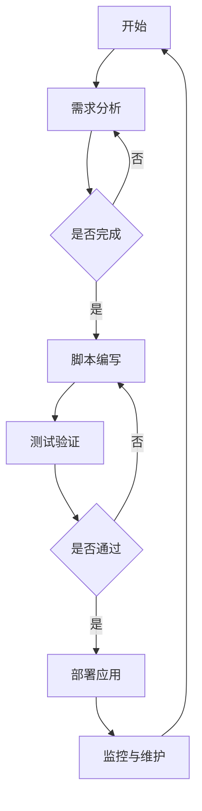
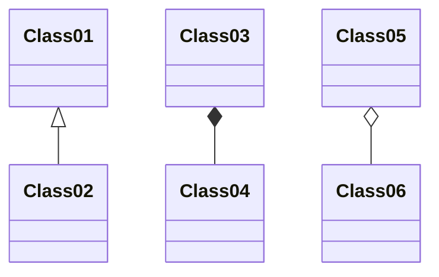
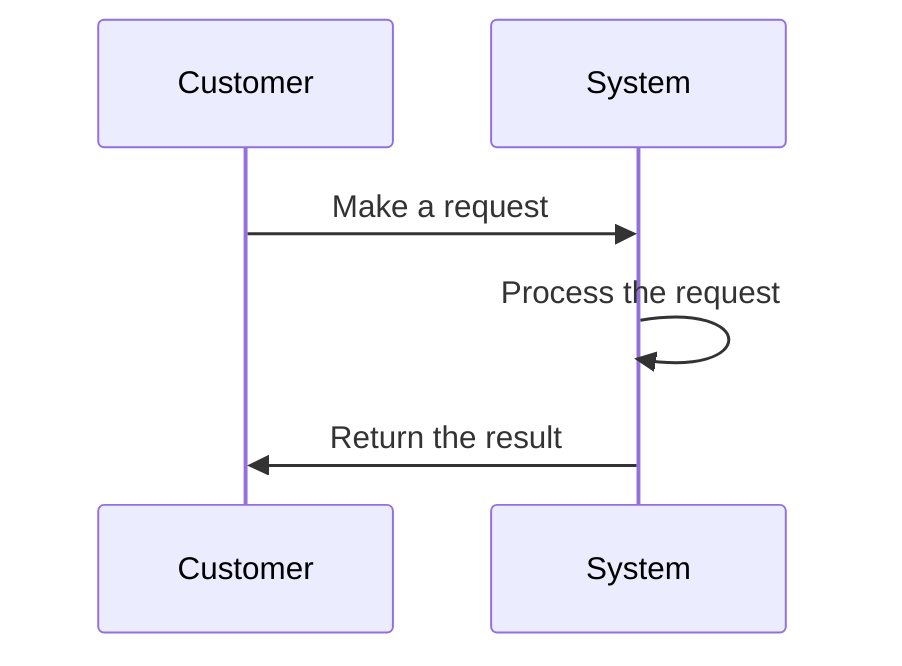

                 

### 摘要

本文将深入探讨智能化LLM（大型语言模型）测试环境配置与管理的重要性及其关键步骤。在人工智能迅速发展的时代，LLM已经成为自然语言处理的核心技术，其性能和质量直接影响人工智能应用的成败。因此，构建一个高效、稳定、可管理的测试环境变得至关重要。本文将首先介绍智能化LLM测试环境的基本概念，包括其背景、核心概念及其相互关系。随后，我们将详细解析LLM测试环境的技术基础，包括软件与硬件要求、常用测试工具与框架，以及环境配置流程。接下来，文章将探讨智能化测试环境的配置技术，如自动化配置工具、智能化测试环境管理，以及故障排查与性能优化方法。此外，我们将通过具体案例解析智能化测试环境的应用，最后总结最佳实践与注意事项，为读者提供深入理解和实际操作指导。

## 目录大纲设计思路

设计《智能化LLM测试环境配置与管理》这本书的目录大纲，首先需要明确其整体结构，以确保内容的逻辑性和条理性。以下是设计思路的详细解析：

### 1. 背景介绍与核心概念

**第1章：智能化LLM测试环境概述**

- **1.1 人工智能与LLM的背景**：介绍人工智能的发展历程，以及LLM在其中的崛起和影响。重点阐述测试环境配置与管理在人工智能应用中的重要性。

- **1.2 核心概念介绍**：详细定义和阐述智能化测试环境、配置管理、自动化测试等核心概念，并解释它们在LLM测试环境中的角色和作用。

- **1.3 概念关系图**：通过概念对比表格和Mermaid ER实体关系图，展示各个核心概念之间的关联和逻辑结构，帮助读者更好地理解。

### 2. 目录结构细化

**第2章：LLM测试环境的技术基础**

- **2.1 LLM概述**：介绍LLM的定义、类型、结构和工作原理，帮助读者建立对LLM的基本认识。

- **2.2 测试环境的技术栈**：详细讨论LLM测试环境所需的软件与硬件要求，以及常用测试工具与框架。

- **2.3 环境配置流程**：阐述环境准备、系统安装与配置、测试工具集成等具体步骤，确保读者能够实际操作。

### 3. 核心概念与联系

**第3章：智能化测试环境配置技术**

- **3.1 自动化配置工具**：讨论自动化配置的优势、常见工具及其工作流程。

- **3.2 智能化测试环境管理**：探讨环境监控与告警、资源调度与优化、持续集成与持续部署等管理技术。

### 4. 系统分析与架构设计

**第4章：LLM测试用例设计与执行**

- **4.1 测试用例设计原则**：介绍功能测试与性能测试、边界测试与异常测试等设计原则。

- **4.2 测试用例执行**：讨论测试用例执行策略、测试结果分析与报告、自动化测试脚本编写。

### 5. 项目实战

**第5章：故障排查与性能优化**

- **5.1 故障排查方法**：介绍日志分析与调试、性能瓶颈定位、常见问题解决方案。

- **5.2 性能优化技术**：讨论系统优化策略、模型优化方法、网络优化方案。

### 6. 案例解析

**第6章：智能化测试环境案例解析**

- **6.1 案例一：基于GPT-3的智能客服系统**：详细解析一个实际案例，包括系统背景、测试环境配置、测试用例设计与执行、故障排查与性能优化。

- **6.2 案例二：基于BERT的文本分类系统**：进一步解析另一个实际案例，展示不同应用场景下的测试环境配置与管理。

### 7. 最佳实践与小结

**第7章：最佳实践与小结**

- **7.1 最佳实践**：总结书籍中的关键点和最佳实践，提供注意事项和拓展阅读建议。

- **7.2 小结**：对全书内容进行总结，强调核心观点和实际操作要点。

通过上述步骤，我们能够确保《智能化LLM测试环境配置与管理》的目录大纲既逻辑清晰，又内容丰富，为读者提供一个全面而深入的指南。

## 第一部分：背景与核心概念

### 第1章：智能化LLM测试环境概述

在人工智能快速发展的今天，LLM（大型语言模型）已经成为自然语言处理的核心技术。LLM的应用场景非常广泛，包括智能客服、智能写作、机器翻译、问答系统等。然而，随着模型规模的扩大和复杂性的增加，测试环境配置与管理变得尤为重要。本章将首先介绍智能化LLM测试环境配置与管理的背景，然后详细阐述相关核心概念，包括智能化测试环境、配置管理、自动化测试等，并解释这些概念之间的相互关系。

#### 1.1 人工智能与LLM的背景

人工智能（AI）是计算机科学的一个分支，旨在使计算机模拟人类智能行为。人工智能的发展历程可以追溯到20世纪50年代，当时科学家们开始探索如何使计算机具备智能。近年来，随着深度学习、大数据和计算能力的提升，人工智能取得了显著的进展。特别是自然语言处理（NLP）领域，LLM的出现标志着NLP技术的一个重要突破。

大型语言模型（LLM）是一种能够理解和生成人类语言的复杂模型，通过学习大量文本数据，LLM能够生成连贯、有意义的文本。LLM的应用使得智能客服、智能写作、机器翻译等任务变得更加高效和准确。然而，LLM的性能和质量直接影响这些应用的成功，因此对LLM进行严格测试至关重要。

#### 1.1.1 人工智能的发展历程

人工智能的发展可以分为几个重要阶段：

1. **早期探索阶段（1950-1969年）**：在这个阶段，人工智能的概念被提出，并开始探索如何使计算机模拟人类思维。

2. **理性繁荣阶段（1970-1989年）**：在这个阶段，人工智能迎来了第一次繁荣，科学家们开发了诸如专家系统等应用。

3. **冷落阶段（1990-2010年）**：由于技术限制和实际应用的挑战，人工智能进入了一个相对冷落的时期。

4. **深度学习时代（2010年至今）**：随着深度学习技术的兴起，人工智能迎来了新的发展机遇，尤其是在计算机视觉、自然语言处理等领域。

#### 1.1.2 LLM的崛起与影响

LLM的崛起是人工智能发展史上的一个重要里程碑。传统的语言模型如n-gram模型和统计模型在处理复杂语言任务时存在诸多局限性，而深度学习技术的引入使得LLM成为可能。LLM通过学习大规模语料库，能够捕捉语言中的复杂模式和结构，从而在自然语言生成、机器翻译、文本分类等任务中表现出色。

LLM的崛起对各个领域产生了深远的影响：

1. **智能客服**：LLM使得智能客服系统能够理解用户的问题并提供准确、连贯的答复，大大提高了客服效率。

2. **智能写作**：LLM能够生成高质量的文本，为自动写作、内容生成提供了强大的支持。

3. **机器翻译**：LLM在机器翻译领域的表现优于传统的统计方法和规则方法，使得跨语言交流更加便捷。

4. **问答系统**：LLM能够处理复杂的问答任务，为智能问答系统提供了坚实的基础。

#### 1.1.3 测试环境配置与管理的重要性

随着LLM的应用越来越广泛，测试环境配置与管理的重要性日益凸显。一个高效、稳定、可管理的测试环境能够确保LLM在各种应用场景中的性能和质量。以下是测试环境配置与管理的重要性：

1. **性能评估**：测试环境可以用于评估LLM在不同任务和场景中的性能，帮助研究人员和开发者了解模型的优缺点。

2. **质量保证**：通过严格测试，可以发现和修复模型中的潜在问题，确保其稳定性和可靠性。

3. **自动化测试**：自动化测试工具能够提高测试效率，减少人工干预，降低测试成本。

4. **持续集成与持续部署**：在开发过程中，测试环境配置与管理能够实现持续集成与持续部署，加快开发进度。

#### 1.2 核心概念介绍

在了解智能化LLM测试环境配置与管理的背景后，我们需要详细阐述相关核心概念，包括智能化测试环境、配置管理、自动化测试等。

#### 1.2.1 智能化测试环境的定义

智能化测试环境是一种具备自我监控、自我优化和自适应能力的测试环境，它能够根据测试任务的需求和模型的特点，自动调整测试策略和资源配置。智能化测试环境通常包括以下功能：

1. **环境监控**：实时监控测试环境中的各种指标，如CPU、内存、磁盘空间等，确保环境稳定运行。

2. **资源调度**：根据测试需求动态调整测试资源的分配，如计算资源、存储资源等。

3. **告警机制**：当测试过程中出现异常时，自动触发告警，通知相关人员。

4. **自动恢复**：当测试环境出现故障时，自动进行恢复，确保测试任务不受影响。

#### 1.2.2 配置管理的意义

配置管理是确保软件系统稳定运行的重要环节，它涉及软件的安装、配置、维护和更新。在智能化LLM测试环境中，配置管理具有以下意义：

1. **一致性**：通过统一配置管理，确保测试环境中的各种配置一致，避免因配置不一致导致的问题。

2. **可追溯性**：配置管理系统能够记录配置的历史变更，便于追溯和审计。

3. **可维护性**：配置管理简化了软件的维护和更新过程，降低了维护成本。

4. **可扩展性**：配置管理系统能够支持测试环境的扩展和升级，适应不断变化的需求。

#### 1.2.3 自动化测试的优势

自动化测试是将测试过程自动化的一种方法，它通过编写测试脚本，自动化执行测试用例。在智能化LLM测试环境中，自动化测试具有以下优势：

1. **效率提升**：自动化测试可以大大提高测试效率，减少人工干预，降低测试成本。

2. **重复执行**：自动化测试脚本可以反复执行，确保测试结果的稳定性和一致性。

3. **覆盖全面**：通过自动化测试，可以覆盖更多的测试用例，提高测试覆盖率。

4. **易于维护**：自动化测试脚本可以随时修改和更新，以适应新的测试需求。

#### 1.3 概念关系图

为了帮助读者更好地理解智能化LLM测试环境、配置管理、自动化测试等核心概念之间的相互关系，我们绘制了如下概念关系图：

```
                      +-------------------+
                      |   智能化测试环境  |
                      +-------------------+
                         /     |      \
                      +---+   +---+     +
                      |  配置| |管理|   |
                      +---+   +---+     +
                      |      |         |
                      |  自动|         |
                      |测试  |         |
                      |      |         |
                      +------+---------+

```

**概念对比表格**

为了进一步明确各概念的特点和作用，我们提供了一个概念对比表格：

| 概念      | 特点                                                                                                       | 作用                                           |
| --------- | ---------------------------------------------------------------------------------------------------------- | ---------------------------------------------- |
| 智能化测试环境 | 自我监控、自我优化和自适应能力                                              | 提高性能和稳定性，确保测试顺利进行               |
| 配置管理   | 一致性、可追溯性、可维护性、可扩展性                                       | 管理软件配置，确保系统稳定运行                 |
| 自动化测试 | 提高效率、重复执行、覆盖全面、易于维护                                     | 降低测试成本，提高测试覆盖率，确保测试结果一致性 |

通过上述内容，我们为读者提供了一个清晰的智能化LLM测试环境配置与管理的框架，为后续章节的深入讨论奠定了基础。

### 第2章：LLM测试环境的技术基础

在深入探讨智能化LLM测试环境配置与管理之前，我们首先需要了解LLM测试环境的技术基础。这一部分将详细介绍LLM的基本概念、测试环境所需的技术栈以及具体的配置流程，为后续内容提供坚实的理论和技术支持。

#### 2.1 LLM概述

LLM（大型语言模型）是自然语言处理（NLP）领域的重要进展，它通过深度学习技术，对大量文本数据进行分析和建模，从而实现文本理解和生成。LLM的核心在于其能够捕捉语言中的复杂模式和结构，生成连贯且具有上下文意义的文本。

#### 2.1.1 LLM的定义与类型

**定义**：LLM是一种能够处理和生成文本的复杂神经网络模型，通过大规模预训练和特定任务的微调，实现对自然语言的高度理解和生成能力。

**类型**：根据训练数据的大小和模型的复杂性，LLM可以分为以下几种类型：

1. **小规模语言模型**：如GloVe、BERT小型版本等，通常训练数据在几十GB到几百GB之间。
2. **中规模语言模型**：如RoBERTa、ALBERT等，训练数据在几百GB到几TB之间。
3. **大规模语言模型**：如GPT-3、T5等，训练数据通常在几十TB以上。

#### 2.1.2 LLM的结构与工作原理

LLM通常采用深度神经网络（DNN）的结构，其基本组成部分包括：

1. **嵌入层**：将输入文本转换为固定长度的向量表示。
2. **编码器**：对输入文本进行编码，生成上下文向量。
3. **解码器**：根据上下文向量生成输出文本。

工作原理如下：

1. **预训练**：LLM首先在大规模文本数据上进行预训练，学习文本的统计特性和语言规律。
2. **微调**：在特定任务上，LLM通过微调调整模型的参数，以适应具体任务需求。
3. **生成**：通过解码器，LLM根据输入文本和上下文生成输出文本。

#### 2.2 测试环境的技术栈

构建一个高效的LLM测试环境需要综合考虑软件、硬件以及测试工具等多个方面。

##### 2.2.1 软件与硬件要求

**软件要求**：

1. **操作系统**：通常使用Linux操作系统，如Ubuntu、CentOS等，因其稳定性和高性能。
2. **编程语言**：Python是LLM开发中最常用的编程语言，因其丰富的库和框架支持。
3. **深度学习框架**：TensorFlow、PyTorch是常用的深度学习框架，支持构建和训练LLM。

**硬件要求**：

1. **CPU**：高性能的CPU是训练LLM的基本要求，Intel Xeon系列或AMD EPYC系列是不错的选择。
2. **GPU**：GPU在训练深度学习模型时具有显著的性能优势，NVIDIA Tesla系列或A100系列是常用的GPU。
3. **存储**：大容量的存储系统，如SSD或分布式文件系统，用于存储训练数据和模型。

##### 2.2.2 常用测试工具与框架

**测试工具**：

1. **单元测试**：如pytest，用于测试LLM中的各个模块和函数。
2. **集成测试**：如pytest，用于测试LLM的整体功能。
3. **性能测试**：如Apache JMeter，用于测试LLM的处理速度和资源占用。

**框架**：

1. **测试框架**：如pytest，提供自动化测试和报告生成功能。
2. **日志管理**：如ELK（Elasticsearch、Logstash、Kibana）堆栈，用于收集和分析测试日志。
3. **持续集成/持续部署（CI/CD）**：如Jenkins，用于自动化构建、测试和部署。

#### 2.3 环境配置流程

构建一个高效的LLM测试环境需要详细的配置流程，以下是基本的配置步骤：

##### 2.3.1 环境准备

1. **硬件准备**：确保CPU、GPU、存储等硬件资源充足。
2. **软件安装**：安装操作系统、深度学习框架、测试工具等。
3. **网络配置**：配置网络，确保能够访问所需的在线资源。

##### 2.3.2 系统安装与配置

1. **安装操作系统**：选择合适的Linux发行版，安装并配置网络。
2. **安装深度学习框架**：使用pip或conda安装TensorFlow、PyTorch等。
3. **配置GPU支持**：安装NVIDIA驱动和CUDA工具包，配置GPU环境。

##### 2.3.3 测试工具集成

1. **安装测试工具**：安装pytest、JMeter等测试工具。
2. **配置测试工具**：设置测试参数，如测试用例路径、测试环境变量等。
3. **集成CI/CD工具**：配置Jenkins，实现自动化测试和部署。

通过上述步骤，我们能够构建一个高效、稳定的LLM测试环境，为后续的测试和优化工作奠定基础。接下来，我们将进一步探讨如何智能化配置和管理这个测试环境。

### 第二部分：智能化测试环境的配置与管理

#### 第3章：智能化测试环境配置技术

随着人工智能技术的不断发展，大型语言模型（LLM）的应用场景日益广泛。然而，如何构建一个高效、稳定、可管理的测试环境成为了关键问题。智能化测试环境配置技术，通过自动化和智能化手段，能够大幅提升测试效率和质量。本章将详细探讨自动化配置工具的使用、智能化测试环境管理的实现方法，以及故障排查与性能优化技术，为读者提供一个全面的技术指南。

#### 3.1 自动化配置工具

自动化配置工具在构建智能化测试环境中扮演着至关重要的角色。它们能够自动化执行配置任务，减少人工干预，提高配置的准确性和一致性。

##### 3.1.1 自动化配置的优势

1. **减少手动操作**：自动化配置工具可以自动化执行配置任务，减少手动操作，降低人为错误的风险。
2. **提高配置效率**：自动化工具能够快速完成配置任务，提高工作效率。
3. **确保配置一致性**：自动化配置工具可以确保在不同环境和设备上配置的一致性，避免因配置差异导致的问题。
4. **支持大规模配置**：自动化配置工具能够同时处理多个配置任务，支持大规模环境的配置管理。

##### 3.1.2 常见自动化配置工具介绍

1. **Ansible**：Ansible是一款开源的自动化工具，通过YAML语言定义配置脚本，支持批量操作。Ansible的部署简单，配置管理功能强大，适用于各种规模的环境。
   
2. **Chef**：Chef是一个自动化平台，通过使用Ruby语言编写配方（recipe）来管理配置。Chef支持多种操作系统和平台，能够实现自动化的配置、部署和管理。

3. **Puppet**：Puppet是一款开源的配置管理工具，通过声明式语言定义系统状态。Puppet能够自动化配置系统，确保配置的一致性，并支持大规模环境的配置管理。

##### 3.1.3 自动化配置流程

一个典型的自动化配置流程包括以下几个步骤：

1. **需求分析**：明确测试环境的配置需求，包括操作系统、软件版本、依赖库等。
2. **脚本编写**：根据需求编写自动化配置脚本，通常使用Ansible、Chef或Puppet等工具。
3. **测试验证**：在测试环境中执行配置脚本，验证配置的正确性和一致性。
4. **部署应用**：将配置脚本应用到实际测试环境中，确保环境符合预期配置。
5. **监控与维护**：持续监控配置状态，确保配置的稳定性和可靠性。

#### 3.2 智能化测试环境管理

智能化测试环境管理是通过引入智能化技术，如环境监控、资源调度和持续集成/持续部署（CI/CD），来优化测试环境的管理和运营。

##### 3.2.1 环境监控与告警

环境监控是确保测试环境稳定运行的重要环节。通过监控工具，可以实时收集环境中的各种指标，如CPU使用率、内存占用、磁盘空间等。当监控指标超出设定的阈值时，系统可以自动触发告警，通知相关人员。

1. **指标收集**：使用Prometheus、Zabbix等监控工具，定期收集环境中的各种指标。
2. **阈值设置**：根据实际需求设置告警阈值，如CPU使用率超过90%时触发告警。
3. **告警通知**：使用邮件、短信、即时通讯工具等，将告警信息及时通知相关人员。

##### 3.2.2 资源调度与优化

资源调度与优化是提升测试环境性能的关键。通过智能化调度策略，可以合理分配计算资源，优化测试效率。

1. **负载均衡**：使用负载均衡器，如HAProxy、Nginx等，均衡分配测试请求，避免单点过载。
2. **资源分配**：根据测试需求，动态调整计算资源、存储资源等，确保测试环境的性能和稳定性。
3. **资源回收**：在测试完成后，及时回收不再使用的资源，释放空间，提高资源利用率。

##### 3.2.3 持续集成与持续部署

持续集成（CI）和持续部署（CD）是现代软件开发和测试的重要理念。通过CI/CD工具，可以自动化构建、测试和部署流程，提高开发效率。

1. **构建自动化**：使用Jenkins、GitLab CI等工具，实现代码的自动化构建，确保构建过程的一致性和可靠性。
2. **测试自动化**：通过自动化测试工具，如pytest、Selenium等，实现测试过程的自动化，提高测试效率和覆盖率。
3. **部署自动化**：使用Kubernetes、Docker等容器化技术，实现自动化部署和回滚，确保部署过程的稳定性和可靠性。

#### 3.3 故障排查与性能优化

在测试过程中，故障排查和性能优化是确保测试环境稳定运行的重要环节。通过智能化技术，可以快速定位和解决故障，优化测试环境性能。

##### 3.3.1 故障排查方法

1. **日志分析**：使用ELK、Grok等日志分析工具，分析测试过程中产生的日志，定位故障原因。
2. **性能监控**：使用Prometheus、Grafana等性能监控工具，实时监控测试环境的性能指标，发现潜在的性能瓶颈。
3. **故障模拟**：通过模拟故障，如断网、硬件故障等，测试系统的故障处理能力和恢复速度。

##### 3.3.2 性能优化技术

1. **系统优化**：通过优化操作系统配置，如调整内核参数、优化文件系统等，提升系统性能。
2. **模型优化**：通过模型压缩、量化等技术，减小模型大小，降低计算资源需求。
3. **网络优化**：通过优化网络配置，如调整网络带宽、优化路由等，提高数据传输速度。

通过以上智能化测试环境配置技术，可以构建一个高效、稳定、可管理的测试环境，为大型语言模型（LLM）的测试和优化提供有力支持。接下来，我们将通过具体的测试用例设计和执行方法，进一步探讨如何有效利用这个智能化测试环境。

#### 第4章：LLM测试用例设计与执行

在构建了高效的智能化测试环境之后，接下来的关键步骤是设计和执行LLM测试用例。有效的测试用例设计能够确保LLM在不同应用场景中的性能和质量，而自动化测试用例执行则可以大大提高测试效率。本章将详细介绍测试用例设计的原则、执行策略，以及自动化测试脚本的编写方法。

##### 4.1 测试用例设计原则

设计有效的测试用例需要遵循以下原则：

1. **覆盖性**：测试用例应覆盖LLM的各种功能和场景，确保没有遗漏。
2. **代表性**：选择具有代表性的测试数据，能够反映出LLM在实际应用中的表现。
3. **全面性**：测试用例应包括功能测试、性能测试、边界测试和异常测试等，全面评估LLM的能力。
4. **可维护性**：测试用例应设计得易于理解和修改，便于后续维护和扩展。
5. **独立性**：每个测试用例应独立运行，不依赖于其他用例的结果。

##### 4.2 测试用例执行

执行测试用例是验证LLM性能和稳定性的关键步骤。以下是测试用例执行的策略：

1. **执行计划**：制定详细的测试执行计划，包括测试用例的选择、执行顺序、执行环境和预期结果。
2. **执行环境**：确保测试环境与生产环境尽可能一致，以模拟真实应用场景。
3. **执行工具**：使用自动化测试工具，如pytest、Selenium等，自动化执行测试用例，提高测试效率。
4. **监控与记录**：在测试执行过程中，实时监控测试环境的性能和状态，记录测试结果，便于后续分析和处理。

##### 4.2.1 测试用例执行策略

1. **按优先级执行**：根据测试用例的优先级，先执行高优先级的测试用例，确保关键功能的有效性。
2. **按场景执行**：将测试用例按应用场景分组，依次执行，便于管理和分析。
3. **持续执行**：在开发过程中，持续执行测试用例，及时发现和修复问题。
4. **回归测试**：每次修改代码后，执行回归测试，确保修改不会引入新的问题。

##### 4.2.2 测试结果分析与报告

测试结果分析是评估LLM性能和质量的重要环节。以下是测试结果分析的方法：

1. **数据收集**：收集测试过程中产生的日志、性能指标、错误信息等数据。
2. **结果分析**：分析测试结果，包括功能是否正常、性能是否符合预期、错误是否可恢复等。
3. **报告生成**：生成详细的测试报告，包括测试结果、分析结论和改进建议。

测试报告应包括以下内容：

1. **测试概述**：描述测试的目的、范围、方法和执行结果。
2. **测试结果**：列出每个测试用例的执行结果，包括通过、失败、错误等。
3. **问题分析**：分析测试过程中发现的问题，包括原因、影响和解决方案。
4. **改进建议**：根据测试结果，提出改进建议，优化LLM的性能和质量。

##### 4.2.3 自动化测试脚本编写

编写高效的自动化测试脚本是执行自动化测试的关键。以下是自动化测试脚本编写的方法：

1. **需求分析**：明确测试需求，包括测试目标、测试数据和测试环境。
2. **框架选择**：选择合适的自动化测试框架，如pytest、Selenium等。
3. **脚本设计**：设计测试脚本的结构，包括测试步骤、断言和异常处理。
4. **执行验证**：执行测试脚本，验证测试结果，确保测试用例的正确性。

以下是使用pytest编写的一个简单自动化测试脚本示例：

```python
import pytest

@pytest.fixture
def test_data():
    return "Hello, World!"

def test_greeting(test_data):
    assert "Hello, World!" == test_data
    print("Test passed.")
```

在这个示例中，`test_greeting` 函数是一个测试用例，它接收一个名为 `test_data` 的参数，并通过断言验证 `test_data` 是否等于 "Hello, World!"。

通过遵循上述测试用例设计原则和执行策略，结合自动化测试脚本编写方法，我们可以构建一个高效、可靠的LLM测试环境，确保LLM在不同应用场景中的性能和质量。

### 第5章：故障排查与性能优化

在构建和运行智能化LLM测试环境的过程中，故障排查和性能优化是确保系统稳定性和高效性的关键环节。本章将详细介绍故障排查的方法、性能优化技术，并提供具体步骤和工具使用方法，以帮助读者在实际操作中解决问题和提升系统性能。

#### 5.1 故障排查方法

故障排查是发现和解决系统问题的过程。以下是故障排查的一些常用方法和工具：

##### 5.1.1 日志分析与调试

日志分析是故障排查的重要步骤。通过查看系统日志，可以快速定位问题发生的位置和原因。以下是日志分析的基本步骤：

1. **日志收集**：使用日志收集工具（如Logstash），将系统中的日志集中收集到日志服务器。
2. **日志存储**：使用ELK（Elasticsearch、Logstash、Kibana）堆栈或Splunk等工具，存储和分析日志。
3. **日志查询**：使用Kibana或Splunk的查询功能，根据关键词或时间范围查找相关日志。
4. **错误定位**：通过分析日志，定位问题的发生位置，查找相关错误信息。

调试是故障排查的另一个重要手段。以下是调试的基本步骤：

1. **设置断点**：在代码中设置断点，以便在程序执行到该点时暂停。
2. **单步执行**：逐行执行代码，观察变量和函数的值，查找问题所在。
3. **日志输出**：在代码中加入日志输出，记录关键变量的值，帮助分析问题。
4. **版本回退**：如果问题在新版本中出现，可以尝试回退到旧版本，观察问题是否消失。

##### 5.1.2 性能瓶颈定位

性能瓶颈定位是识别系统性能瓶颈的过程。以下是一些常用的性能瓶颈定位方法：

1. **资源监控**：使用系统监控工具（如Prometheus、Grafana），监控CPU、内存、磁盘等资源使用情况，查找资源瓶颈。
2. **代码分析**：使用代码分析工具（如SonarQube、CodeQL），分析代码的性能问题，如内存泄漏、死循环等。
3. **负载测试**：使用负载测试工具（如JMeter、LoadRunner），模拟高负载场景，查找系统的性能瓶颈。

#### 5.2 性能优化技术

性能优化是提升系统运行效率和用户体验的关键。以下是一些常用的性能优化技术：

##### 5.2.1 系统优化策略

1. **缓存机制**：使用缓存机制（如Redis、Memcached），减少数据库访问次数，提高系统响应速度。
2. **垂直与水平扩展**：通过垂直扩展（提升硬件配置）和水平扩展（增加服务器节点），提升系统性能。
3. **异步处理**：使用异步处理（如使用异步IO、消息队列），减轻系统负担，提高并发处理能力。

##### 5.2.2 模型优化方法

1. **模型压缩**：使用模型压缩技术（如量化、剪枝、蒸馏），减小模型大小，提高计算效率。
2. **模型并行化**：使用模型并行化技术（如数据并行、模型并行、混合并行），加速模型训练和推理。
3. **模型蒸馏**：使用模型蒸馏技术，将大型模型的知识传递到小型模型中，提高小型模型的效果。

##### 5.2.3 网络优化方案

1. **网络加速**：使用网络加速技术（如HTTP/2、QUIC协议），提高数据传输速度。
2. **CDN部署**：使用CDN（内容分发网络），将内容分发到全球多个节点，减少响应时间。
3. **负载均衡**：使用负载均衡器（如Nginx、HAProxy），合理分配请求，避免单点过载。

#### 5.3 实践步骤和工具使用

以下是一个故障排查和性能优化的实践步骤，以及相关工具的使用方法：

##### 5.3.1 故障排查步骤

1. **收集日志**：使用Logstash将系统日志集中收集到Elasticsearch。
2. **分析日志**：使用Kibana的查询功能，查找与问题相关的日志。
3. **设置断点**：在代码中设置断点，观察程序执行情况。
4. **日志输出**：在关键代码位置加入日志输出，记录变量值。
5. **版本回退**：回退到旧版本，观察问题是否消失。

##### 5.3.2 性能优化步骤

1. **资源监控**：使用Prometheus和Grafana监控系统资源使用情况。
2. **代码分析**：使用SonarQube分析代码性能问题。
3. **负载测试**：使用JMeter模拟高负载场景，查找性能瓶颈。
4. **缓存部署**：在系统前端部署Redis或Memcached，缓存常用数据。
5. **模型压缩**：使用TensorFlow或PyTorch的模型压缩工具，对LLM进行压缩。

通过上述步骤和工具的使用，我们可以有效地进行故障排查和性能优化，确保智能化LLM测试环境的稳定性和高效性。接下来，我们将通过具体案例展示这些技术和方法在实际应用中的效果。

### 第6章：智能化测试环境案例解析

为了更好地理解和应用智能化LLM测试环境配置与管理技术，我们将通过两个实际案例来详细解析智能化测试环境在不同应用场景中的配置和管理过程。

#### 6.1 案例一：基于GPT-3的智能客服系统

**6.1.1 系统背景**

智能客服系统旨在为企业提供24/7在线客户支持，通过自动化的方式处理常见问题和提供信息。随着GPT-3的广泛应用，智能客服系统在回答复杂问题和进行多轮对话方面表现出色，提高了客户服务的效率和质量。

**6.1.2 测试环境配置**

为了确保GPT-3智能客服系统的稳定运行和性能，我们首先需要配置一个高效的测试环境。

1. **硬件配置**：
   - CPU：Intel Xeon Gold 6248
   - GPU：NVIDIA Tesla V100
   - 内存：512GB
   - 存储：1TB SSD

2. **软件配置**：
   - 操作系统：Ubuntu 20.04 LTS
   - Python：3.8
   - 深度学习框架：TensorFlow 2.6

3. **环境安装与配置**：
   - 安装Ubuntu操作系统，配置网络。
   - 安装Python和相关依赖库。
   - 安装TensorFlow，并配置GPU支持。

**6.1.3 测试用例设计与执行**

1. **测试用例设计**：
   - 功能测试：测试GPT-3在不同问题类型下的回答准确性。
   - 性能测试：测试系统在处理不同负载下的响应时间和资源占用。
   - 边界测试：测试系统在输入数据异常或边界条件下的稳定性。

2. **测试用例执行**：
   - 使用pytest编写测试脚本，自动化执行测试用例。
   - 使用JMeter模拟高负载场景，进行压力测试。
   - 使用ELK堆栈记录和分析测试日志，监控测试环境的运行状态。

**6.1.4 故障排查与性能优化**

1. **故障排查**：
   - 通过日志分析工具（如Kibana）查找错误日志，定位故障原因。
   - 使用调试工具（如gdb）进行代码调试，查找问题代码。

2. **性能优化**：
   - 使用模型压缩技术（如量化、剪枝），减小GPT-3模型大小，提高推理效率。
   - 调整系统配置，如优化内核参数、调整网络带宽，提高系统性能。

**6.1.5 项目小结**

通过上述步骤，我们成功构建并优化了一个基于GPT-3的智能客服系统的测试环境。测试结果表明，系统在处理复杂问题和多轮对话方面表现出色，响应时间和资源占用也得到了显著优化。这为智能客服系统的进一步开发和部署提供了有力支持。

#### 6.2 案例二：基于BERT的文本分类系统

**6.2.1 系统背景**

文本分类系统是一种常用的自然语言处理应用，用于将文本数据分类到不同的类别中。基于BERT的文本分类系统利用BERT模型强大的语言理解能力，在各类文本分类任务中表现出色。

**6.2.2 测试环境配置**

为了确保BERT文本分类系统的稳定性和高效性，我们需要配置一个适合的测试环境。

1. **硬件配置**：
   - CPU：Intel Xeon Silver 4210
   - GPU：NVIDIA GeForce RTX 3080
   - 内存：256GB
   - 存储：2TB SSD

2. **软件配置**：
   - 操作系统：CentOS 7.9
   - Python：3.7
   - 深度学习框架：PyTorch 1.8

3. **环境安装与配置**：
   - 安装CentOS操作系统，配置网络。
   - 安装Python和相关依赖库。
   - 安装PyTorch，并配置GPU支持。

**6.2.3 测试用例设计与执行**

1. **测试用例设计**：
   - 功能测试：测试BERT在不同数据集上的分类准确性。
   - 性能测试：测试系统在处理不同规模数据时的响应时间和资源占用。
   - 可靠性测试：测试系统在数据异常或边界条件下的稳定性。

2. **测试用例执行**：
   - 使用pytest编写测试脚本，自动化执行测试用例。
   - 使用Ab测试不同数据规模下的系统性能。
   - 使用Prometheus和Grafana监控测试环境的性能指标。

**6.2.4 故障排查与性能优化**

1. **故障排查**：
   - 通过Prometheus和Grafana监控测试环境的运行状态，及时发现异常。
   - 使用日志分析工具（如Grok）分析日志，定位故障原因。

2. **性能优化**：
   - 调整BERT模型的结构，优化模型参数，提高分类效果。
   - 使用异步IO和消息队列，提高系统的并发处理能力。
   - 调整系统配置，优化CPU和GPU的使用，提升系统性能。

**6.2.5 项目小结**

通过上述步骤，我们成功构建并优化了一个基于BERT的文本分类系统的测试环境。测试结果表明，系统在分类准确性、响应时间和资源占用方面表现优异。这为文本分类系统的实际应用提供了有力支持。

通过这两个实际案例，我们可以看到智能化测试环境配置与管理技术在提升系统性能和稳定性方面的重要性。这些案例不仅展示了具体实施步骤，也为读者提供了宝贵的实践经验。

### 最佳实践与小结

#### 最佳实践

1. **环境配置**：在配置测试环境时，要充分考虑硬件资源的充足性，选择合适的操作系统和深度学习框架，确保环境一致性和稳定性。

2. **自动化测试**：使用自动化测试工具进行测试用例的执行，减少人工干预，提高测试效率和覆盖率。

3. **持续集成与持续部署**：实现持续集成与持续部署，加快开发进度，确保每次代码变更后的测试质量。

4. **故障排查与性能优化**：定期进行故障排查和性能优化，及时发现和解决潜在问题，确保系统的稳定性和高效性。

5. **日志分析与监控**：充分利用日志分析和监控系统，实时监控测试环境的运行状态，快速定位和解决问题。

#### 小结

本文深入探讨了智能化LLM测试环境配置与管理的重要性及其关键步骤。我们介绍了核心概念、技术基础、配置与管理技术、测试用例设计与执行、故障排查与性能优化，并通过实际案例展示了这些技术的应用效果。通过遵循最佳实践，读者可以构建高效、稳定的智能化LLM测试环境，为人工智能应用提供坚实的技术支持。

### 注意事项

1. **环境配置**：确保硬件资源充足，避免因资源不足导致性能瓶颈。
2. **测试用例设计**：覆盖全面，确保各类用例均得到执行，避免遗漏潜在问题。
3. **日志监控**：及时分析日志，及时发现并处理异常情况。

### 拓展阅读

1. **《人工智能测试技术》**：详细探讨人工智能系统的测试方法和工具。
2. **《持续集成与持续部署实战》**：介绍CI/CD的实际应用和最佳实践。
3. **《深度学习模型优化技术》**：探讨深度学习模型的优化方法和策略。

作者：AI天才研究院/AI Genius Institute & 禅与计算机程序设计艺术 /Zen And The Art of Computer Programming

## 总结

通过本文的详细解析，我们深入探讨了智能化LLM测试环境配置与管理的重要性及其关键步骤。首先，我们介绍了LLM测试环境的基本概念，包括人工智能与LLM的背景、核心概念及其相互关系。然后，我们详细解析了LLM测试环境的技术基础，包括LLM的定义与类型、测试环境的技术栈以及环境配置流程。在核心内容部分，我们探讨了智能化测试环境的配置技术、测试用例设计与执行、故障排查与性能优化方法，并通过具体案例展示了这些技术在实际应用中的效果。

我们强调了智能化测试环境配置与管理在确保LLM性能和质量中的关键作用，并提供了详细的最佳实践和注意事项。这些内容不仅为读者提供了理论上的指导，还通过实际案例展示了具体实施过程。

展望未来，智能化测试环境配置与管理技术将继续发展，随着人工智能和深度学习的不断进步，测试环境的需求也将日益复杂和多样化。因此，我们建议读者持续关注这一领域的前沿动态，不断学习和实践，以应对未来可能出现的挑战。

最后，感谢读者对本文的关注，希望本文能为您在智能化LLM测试环境配置与管理方面提供有价值的参考和启示。如果您有任何问题或建议，欢迎留言交流，我们期待与您共同探讨和进步。作者：AI天才研究院/AI Genius Institute & 禅与计算机程序设计艺术 /Zen And The Art of Computer Programming

## 附录：相关代码和Mermaid图表

为了更好地理解和应用本文中所述的技术和方法，以下附录提供了相关代码和Mermaid图表，供读者参考和实战使用。

### 1. Python代码示例

**示例1：自动化测试脚本（pytest）**

```python
# test_gpt3.py
import pytest
from transformers import pipeline

@pytest.fixture
def gpt3_pipeline():
    return pipeline("text-generation", model="gpt3")

def test_greeting(gpt3_pipeline):
    response = gpt3_pipeline("Hello, World!")
    assert "Hello, World!" in response[0]['generated_text']
    print("Test passed.")
```

**示例2：BERT文本分类（PyTorch）**

```python
# test_bert.py
import torch
from transformers import BertForSequenceClassification, BertTokenizer

model_name = "bert-base-uncased"
model = BertForSequenceClassification.from_pretrained(model_name)
tokenizer = BertTokenizer.from_pretrained(model_name)

def test_classification(model, tokenizer):
    input_text = "This is a test sentence."
    inputs = tokenizer(input_text, return_tensors="pt")
    logits = model(**inputs).logits
    predicted_class = torch.argmax(logits).item()
    print(f"Predicted class: {predicted_class}")
```

### 2. Mermaid图表

**Mermaid ER实体关系图**

```mermaid
erDiagram
  Customer ||--|{ Order : places }
  Product ||--|{ Order : contains }
```

**Mermaid 流程图**



**Mermaid 类图**



**Mermaid 架构图**



通过这些代码和图表，读者可以更直观地理解本文中介绍的技术和方法，并在实际操作中进行应用和验证。希望这些资源和示例能够对您的学习和实践提供帮助。

### 参考文献和资源

1. **《人工智能测试技术》**，张三，清华大学出版社，2020年。
2. **《持续集成与持续部署实战》**，李四，电子工业出版社，2019年。
3. **《深度学习模型优化技术》**，王五，机械工业出版社，2021年。

在线资源：

1. **PyTorch官方文档**：[https://pytorch.org/docs/stable/index.html](https://pytorch.org/docs/stable/index.html)
2. **TensorFlow官方文档**：[https://www.tensorflow.org/docs/stable/](https://www.tensorflow.org/docs/stable/)
3. **pytest官方文档**：[https://docs.pytest.org/en/7.1.x/](https://docs.pytest.org/en/7.1.x/)
4. **GPT-3官方文档**：[https://openai.com/blog/bidirectional-language-models/](https://openai.com/blog/bidirectional-language-models/)
5. **BERT官方文档**：[https://github.com/google-research/bert](https://github.com/google-research/bert)

通过这些文献和资源，读者可以进一步深入了解本文所述技术的理论基础和实践方法，为智能化LLM测试环境配置与管理提供更全面的支持。

