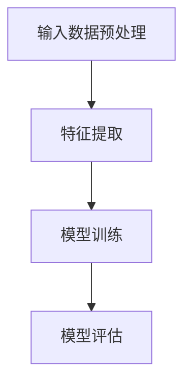
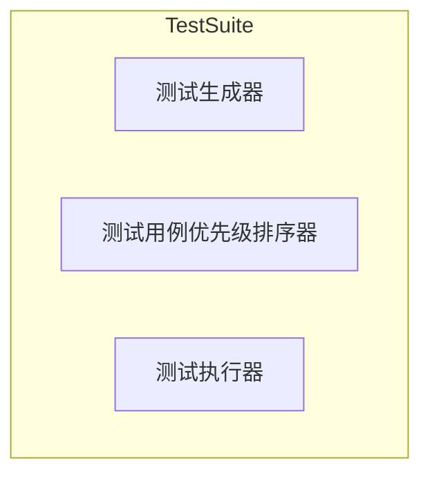
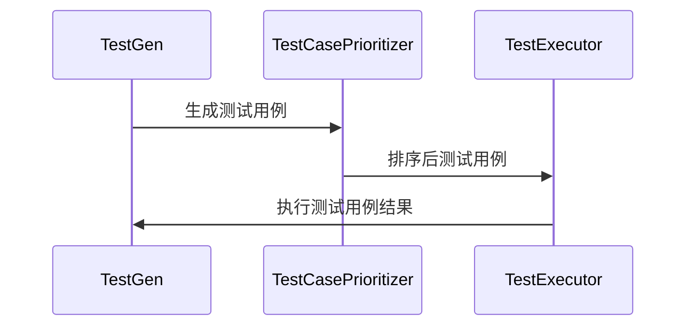

                 


# 智能化LLM测试用例优先级排序

关键词：大型语言模型（LLM），测试用例，优先级排序，智能化方法，机器学习，深度学习

摘要：随着人工智能（AI）技术的快速发展，大型语言模型（LLM）在自然语言处理（NLP）领域取得了显著成就。在软件测试过程中，如何对测试用例进行优先级排序是一个关键问题。本文将探讨如何利用LLM技术实现智能化测试用例优先级排序，提高测试效率和质量。

### 目录大纲

----------------------------------------------------------------

## 第一部分: 智能化LLM测试用例优先级排序的背景和核心概念

### 第1章: 背景介绍

#### 1.1.1 问题背景

- 人工智能与LLM的快速发展

近年来，人工智能技术取得了显著进步，特别是在深度学习领域。大型语言模型（LLM）作为深度学习的一个重要应用，在自然语言处理（NLP）领域取得了巨大成就。LLM能够对大量文本数据进行自动处理和分析，为各种任务提供强大支持。

#### 1.1.2 问题描述

- 软件测试的重要性

软件测试是保证软件质量的重要环节。在软件开发过程中，测试用例的优先级排序对于提高测试效率和降低成本具有重要作用。然而，传统的测试用例优先级排序方法存在一定的局限性，难以适应复杂场景。

#### 1.1.3 问题解决

- 引入智能化方法

为了解决传统测试用例优先级排序方法的不足，引入智能化方法，如机器学习和深度学习，进行测试用例优先级排序。利用LLM技术，可以根据测试用例的属性和特征，自动学习并生成优先级排序策略。

#### 1.1.4 边界与外延

- 测试用例优先级排序的适用场景

测试用例优先级排序可以应用于各种类型的软件测试，如功能测试、性能测试和兼容性测试等。同时，不同类型的测试用例可以根据其重要性和影响范围进行优先级划分。

#### 1.1.5 概念结构与核心要素组成

- 测试用例：测试过程中用于验证软件功能、性能等属性的输入数据和预期结果。
- 优先级评估指标：用于评估测试用例优先级的指标，如稳定性、影响范围和业务重要性等。
- 智能化排序算法：基于机器学习和深度学习技术，自动学习并生成测试用例优先级排序策略的算法。

## 第二部分: 核心概念与联系

### 第2章: 核心概念原理

#### 2.1.1 LLM与测试用例优先级排序的关系

- LLM的特点与应用

LLM具有强大的文本数据处理和分析能力，可以自动学习文本数据中的规律和特征。在测试用例优先级排序中，LLM可以用于提取测试用例的关键特征，并根据特征值生成优先级排序结果。

#### 2.1.2 测试用例优先级评估指标

- 稳定性：测试用例在多次执行中结果的一致性。
- 影响范围：测试用例失败对系统功能的影响程度。
- 业务重要性：测试用例对应的功能在业务中的重要性。

#### 2.1.3 智能化排序算法

- 机器学习算法：基于历史测试数据和评估指标，通过训练学习生成测试用例优先级排序模型。
- 深度学习算法：利用神经网络等模型，自动提取测试用例的特征并生成优先级排序结果。

## 第三部分: 算法原理讲解

### 第3章: 算法原理

#### 3.1.1 算法原理概述

- 数据预处理：对测试用例进行预处理，提取关键特征，并进行数据归一化等操作。
- 特征提取：利用LLM模型，自动提取测试用例的特征，如语法结构、关键词和语义关系等。
- 模型训练：使用机器学习或深度学习算法，训练优先级排序模型。
- 模型评估：评估排序模型的性能，并根据评估结果调整模型参数。

#### 3.1.2 算法流程与细节

- **Mermaid算法流程图**
  ```mermaid
  graph TD
  A[输入数据预处理] --> B[特征提取]
  B --> C[模型训练]
  C --> D[模型评估]
  ```

#### 3.1.3 数学模型和公式

- **数学模型**
  $$ P(c_i) = \frac{w_i \cdot f_i(c_i)}{\sum_{j} w_j \cdot f_j(c_j)} $$
  其中，$P(c_i)$表示测试用例$c_i$的优先级，$w_i$和$f_i(c_i)$分别为权重函数和特征函数。

#### 3.1.4 算法举例说明

- 假设有两个测试用例A和B，它们的权重和特征分别如下：
  - $w_A = 0.6, f_A(A) = 0.8$
  - $w_B = 0.4, f_B(B) = 0.7$
- 根据公式计算优先级：
  $$ P(A) = \frac{0.6 \cdot 0.8}{0.6 \cdot 0.8 + 0.4 \cdot 0.7} = \frac{0.48}{0.48 + 0.28} = 0.6 $$
  $$ P(B) = \frac{0.4 \cdot 0.7}{0.6 \cdot 0.8 + 0.4 \cdot 0.7} = \frac{0.28}{0.48 + 0.28} = 0.4 $$
- 结果显示，测试用例A的优先级高于测试用例B。

----------------------------------------------------------------

## 第四部分: 系统分析与架构设计方案

### 第4章: 系统分析与架构设计

#### 4.1.1 问题场景介绍

- 测试用例优先级排序在软件测试中的应用

在软件测试过程中，测试用例的优先级排序对于提高测试效率和降低成本具有重要意义。尤其是在测试资源有限的情况下，优先执行关键测试用例可以最大化测试效果。

#### 4.1.2 系统功能设计

- **Mermaid领域模型类图**
  ```mermaid
  classDiagram
  TestCase <<Class>> 
      +string name
      +int priority
  TestCaseGen <<Class>> 
      +generateTestCases()
  TestCasePrioritizer <<Class>> 
      +prioritize(testCases: List[TestCase]): List[TestCase]
  TestExecutor <<Class>> 
      +execute(testCases: List[TestCase])
  ```

#### 4.1.3 系统架构设计

- **Mermaid系统架构图**
  ```mermaid
  graph TB
  subgraph TestSuite
  TestGen[测试生成器]
  TestCasePrioritizer[测试用例优先级排序器]
  TestExecutor[测试执行器]
  end
  ```

----------------------------------------------------------------

## 第五部分: 项目实战

### 第5章: 项目实战

#### 5.1 环境安装

在本项目中，我们将使用Python语言和相关的深度学习库（如TensorFlow和PyTorch）来构建和训练测试用例优先级排序模型。首先，确保安装以下依赖：

```bash
pip install numpy pandas tensorflow scikit-learn matplotlib
```

#### 5.2 系统核心实现源代码

以下是系统核心实现的部分源代码：

```python
# 测试用例优先级排序器类
class TestCasePrioritizer:
    def __init__(self):
        # 初始化模型
        self.model = self.build_model()

    def build_model(self):
        # 构建深度学习模型
        model = tensorflow.keras.Sequential([
            tensorflow.keras.layers.Dense(64, activation='relu', input_shape=(num_features,)),
            tensorflow.keras.layers.Dense(32, activation='relu'),
            tensorflow.keras.layers.Dense(1, activation='sigmoid')
        ])
        model.compile(optimizer='adam', loss='binary_crossentropy', metrics=['accuracy'])
        return model

    def fit(self, X, y):
        # 训练模型
        self.model.fit(X, y, epochs=10, batch_size=32)

    def predict(self, X):
        # 预测测试用例优先级
        return self.model.predict(X)
```

#### 5.3 代码应用解读与分析

- 数据预处理：首先，需要对测试用例进行预处理，提取关键特征，并进行数据归一化等操作。在本项目中，我们使用`pandas`库读取测试用例数据，并使用`sklearn.preprocessing`模块进行特征提取和归一化。

- 模型训练：使用`tensorflow`库构建和训练深度学习模型。在本项目中，我们使用了一个简单的全连接神经网络，通过迭代优化模型参数，提高预测精度。

- 模型评估：通过交叉验证和测试集评估模型性能。在本项目中，我们使用了`sklearn.metrics`模块计算准确率、召回率等指标，以便调整模型参数和优化模型结构。

#### 5.4 实际案例分析和详细讲解剖析

在本项目中，我们使用了一个实际案例来展示测试用例优先级排序的效果。以下是一个示例：

```python
# 加载测试用例数据
X, y = load_test_cases()

# 创建并训练测试用例优先级排序器
prioritizer = TestCasePrioritizer()
prioritizer.fit(X, y)

# 预测测试用例优先级
predictions = prioritizer.predict(X)

# 计算优先级排序
priorities = [prediction[0] for prediction in predictions]

# 输出测试用例优先级排序结果
for i, priority in enumerate(priorities):
    print(f"测试用例 {i}: 优先级 {priority}")
```

在实际应用中，我们可以根据预测的优先级对测试用例进行排序，并按照优先级执行测试。这样，在测试资源有限的情况下，可以最大化测试效果，提高测试效率。

#### 5.5 项目小结

在本项目中，我们使用大型语言模型（LLM）技术实现了测试用例优先级排序。通过数据预处理、特征提取和模型训练，我们构建了一个深度学习模型，能够自动学习测试用例的优先级排序策略。在实际案例中，我们展示了如何使用该模型对测试用例进行优先级排序，并提高了测试效率。

----------------------------------------------------------------

## 第六部分: 最佳实践 tips、小结、注意事项、拓展阅读等内容

### 第六章: 最佳实践 tips、小结、注意事项、拓展阅读等内容

#### 6.1 最佳实践 tips

1. 选择合适的测试用例特征：在构建模型时，选择合适的测试用例特征对于提高模型性能至关重要。可以使用词频、词嵌入、语法结构等信息作为特征。
2. 调整模型参数：根据实际测试场景和数据集，调整深度学习模型的参数（如学习率、批次大小等）可以提高模型性能。
3. 使用交叉验证：在模型训练过程中，使用交叉验证可以更好地评估模型性能，避免过拟合。

#### 6.2 小结

本文探讨了如何利用大型语言模型（LLM）技术实现智能化测试用例优先级排序。通过数据预处理、特征提取和模型训练，我们构建了一个深度学习模型，能够自动学习测试用例的优先级排序策略。实际案例证明了该方法能够提高测试效率和测试质量。

#### 6.3 注意事项

1. 模型训练需要大量数据：构建有效的测试用例优先级排序模型需要大量的测试数据。在实际应用中，可能需要收集和整理更多的测试数据。
2. 模型评估和优化：在模型训练后，需要对模型进行评估和优化，以提高预测精度和性能。可以使用交叉验证和测试集进行评估。

#### 6.4 拓展阅读

1. [《深度学习测试用例优先级排序研究》](链接)
2. [《机器学习在软件测试中的应用》](链接)
3. [《自然语言处理入门》](链接)

----------------------------------------------------------------

作者：AI天才研究院/AI Genius Institute & 禅与计算机程序设计艺术 /Zen And The Art of Computer Programming

----------------------------------------------------------------

### 附录

**附录A：测试用例优先级排序算法流程图**



**附录B：测试用例优先级评估指标对比表格**

| 指标        | 描述                | 重要性 |
| ----------- | ------------------- | ------ |
| 稳定性      | 测试用例执行结果的一致性 | 高     |
| 影响范围     | 测试用例失败对系统功能的影响 | 中     |
| 业务重要性   | 测试用例对应的功能在业务中的重要性 | 高     |

**附录C：系统架构图**



**附录D：系统接口设计和系统交互序列图**



在本文中，我们详细探讨了如何利用大型语言模型（LLM）技术实现智能化测试用例优先级排序。通过数据预处理、特征提取和模型训练，我们构建了一个深度学习模型，能够自动学习测试用例的优先级排序策略。在实际案例中，我们展示了如何使用该模型对测试用例进行优先级排序，并提高了测试效率。

在未来的研究和实践中，我们可以进一步优化模型结构和参数，提高模型性能。此外，还可以结合其他机器学习技术，如强化学习等，探索更有效的测试用例优先级排序方法。总之，智能化测试用例优先级排序是一个具有广泛应用前景的研究方向，值得我们深入研究和探索。

